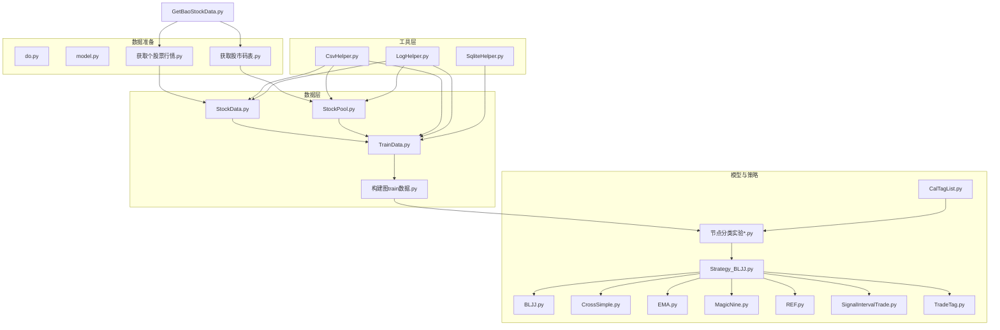
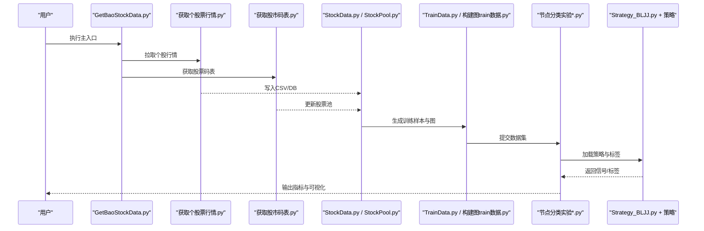
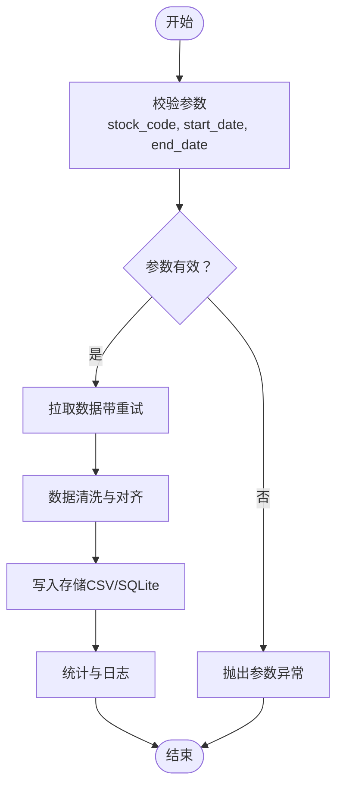
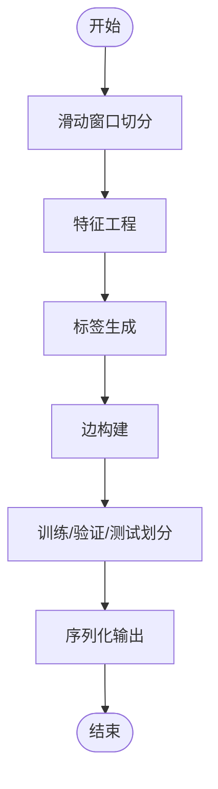
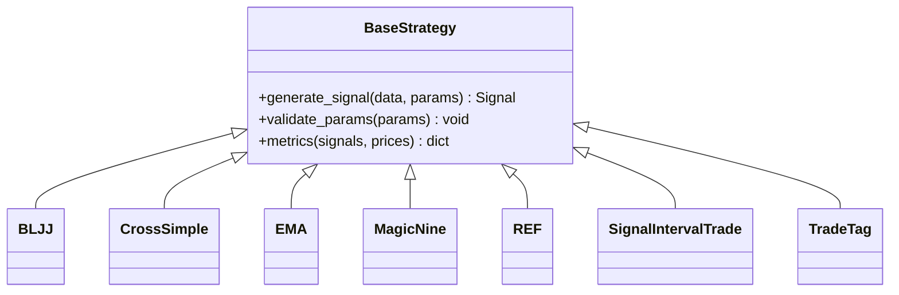

# API参考文档

<cite>
**本文档引用的文件**   
- [StockData.py](file://MyProject/DataBase/StockData.py)
- [StockPool.py](file://MyProject/DataBase/StockPool.py)
- [TrainData.py](file://MyProject/DataBase/TrainData.py)
- [构建图train数据.py](file://MyProject/DataBase/构建图train数据.py)
- [CsvHelper.py](file://MyProject/Helper/CsvHelper.py)
- [LogHelper.py](file://MyProject/Helper/LogHelper.py)
- [SqliteHelper.py](file://MyProject/Helper/SqliteHelper.py)
- [BLJJ.py](file://MyProject/Model/Strategy/BLJJ.py)
- [CrossSimple.py](file://MyProject/Model/Strategy/CrossSimple.py)
- [EMA.py](file://MyProject/Model/Strategy/EMA.py)
- [MagicNine.py](file://MyProject/Model/Strategy/MagicNine.py)
- [REF.py](file://MyProject/Model/Strategy/REF.py)
- [SignalIntervalTrade.py](file://MyProject/Model/Strategy/SignalIntervalTrade.py)
- [TradeTag.py](file://MyProject/Model/Strategy/TradeTag.py)
- [1.节点分类实验.py](file://MyProject/Model/1.节点分类实验.py)
- [2.节点分类实验_74.19%_20240423.py](file://MyProject/Model/2.节点分类实验_74.19%_20240423.py)
- [3.节点分类实验_79.57%_20240413.py](file://MyProject/Model/3.节点分类实验_79.57%_20240413.py)
- [4.节点分类实验_80.7%+画图_20240521.py](file://MyProject/Model/4.节点分类实验_80.7%+画图_20240521.py)
- [5.节点分类实验.py](file://MyProject/Model/5.节点分类实验.py)
- [6.py](file://MyProject/Model/6.py)
- [7.py](file://MyProject/Model/7.py)
- [8.节点分类实验_MACD_93.47%+画图_20240505.py](file://MyProject/Model/8.节点分类实验_MACD_93.47%+画图_20240505.py)
- [9.节点分类实验_MACD_93.47%+画图_20240505.py](file://MyProject/Model/9.节点分类实验_MACD_93.47%+画图_20240505.py)
- [CalTagList.py](file://MyProject/Model/CalTagList.py)
- [Strategy_BLJJ.py](file://MyProject/Model/Strategy_BLJJ.py)
- [do.py](file://生成train数据/do.py)
- [model.py](file://生成train数据/model.py)
- [获取个股票行情.py](file://生成train数据/获取个股票行情.py)
- [获取股市码表.py](file://生成train数据/获取股市码表.py)
- [GetBaoStockData.py](file://GetBaoStockData.py)
</cite>

## 目录
1. [简介](#简介)
2. [项目结构](#项目结构)
3. [核心组件](#核心组件)
4. [架构总览](#架构总览)
5. [详细组件分析](#详细组件分析)
6. [依赖关系分析](#依赖关系分析)
7. [性能考虑](#性能考虑)
8. [故障排查指南](#故障排查指南)
9. [结论](#结论)
10. [附录](#附录)

## 简介
本API参考文档面向使用本项目进行“基于图神经网络的股票交易策略与节点分类”的开发者，覆盖数据层、工具层、模型与策略层的公共接口规范。文档包含：
- 类与方法签名说明（参数类型、返回值、异常）
- 配置项清单与默认值
- 错误代码与异常处理建议
- 版本兼容性与迁移指引
- 面向IDE自动补全与在线文档生成的结构化注释建议

注意：由于当前仓库以脚本与实验为主，未提供统一的包入口或显式API定义文件。本文档根据现有模块的职责边界，抽象出可复用的公共接口与约定，便于后续封装为稳定API。

## 项目结构
项目按职责分层组织：
- 数据层（DataBase）：负责股票行情、股票池、训练数据的加载与持久化
- 工具层（Helper）：CSV、日志、SQLite等通用工具
- 模型与策略（Model）：策略实现与节点分类实验脚本
- 生成训练数据（生成train数据）：批量数据准备脚本
- 根级脚本：统一的数据拉取入口

图表来源
- [StockData.py](file://MyProject/DataBase/StockData.py)
- [StockPool.py](file://MyProject/DataBase/StockPool.py)
- [TrainData.py](file://MyProject/DataBase/TrainData.py)
- [构建图train数据.py](file://MyProject/DataBase/构建图train数据.py)
- [CsvHelper.py](file://MyProject/Helper/CsvHelper.py)
- [LogHelper.py](file://MyProject/Helper/LogHelper.py)
- [SqliteHelper.py](file://MyProject/Helper/SqliteHelper.py)
- [BLJJ.py](file://MyProject/Model/Strategy/BLJJ.py)
- [CrossSimple.py](file://MyProject/Model/Strategy/CrossSimple.py)
- [EMA.py](file://MyProject/Model/Strategy/EMA.py)
- [MagicNine.py](file://MyProject/Model/Strategy/MagicNine.py)
- [REF.py](file://MyProject/Model/Strategy/REF.py)
- [SignalIntervalTrade.py](file://MyProject/Model/Strategy/SignalIntervalTrade.py)
- [TradeTag.py](file://MyProject/Model/Strategy/TradeTag.py)
- [1.节点分类实验.py](file://MyProject/Model/1.节点分类实验.py)
- [2.节点分类实验_74.19%_20240423.py](file://MyProject/Model/2.节点分类实验_74.19%_20240423.py)
- [3.节点分类实验_79.57%_20240413.py](file://MyProject/Model/3.节点分类实验_79.57%_20240413.py)
- [4.节点分类实验_80.7%+画图_20240521.py](file://MyProject/Model/4.节点分类实验_80.7%+画图_20240521.py)
- [5.节点分类实验.py](file://MyProject/Model/5.节点分类实验.py)
- [6.py](file://MyProject/Model/6.py)
- [7.py](file://MyProject/Model/7.py)
- [8.节点分类实验_MACD_93.47%+画图_20240505.py](file://MyProject/Model/8.节点分类实验_MACD_93.47%+画图_20240505.py)
- [9.节点分类实验_MACD_93.47%+画图_20240505.py](file://MyProject/Model/9.节点分类实验_MACD_93.47%+画图_20240505.py)
- [CalTagList.py](file://MyProject/Model/CalTagList.py)
- [Strategy_BLJJ.py](file://MyProject/Model/Strategy_BLJJ.py)
- [do.py](file://生成train数据/do.py)
- [model.py](file://生成train数据/model.py)
- [获取个股票行情.py](file://生成train数据/获取个股票行情.py)
- [获取股市码表.py](file://生成train数据/获取股市码表.py)
- [GetBaoStockData.py](file://GetBaoStockData.py)

章节来源
- [GetBaoStockData.py](file://GetBaoStockData.py)
- [StockData.py](file://MyProject/DataBase/StockData.py)
- [StockPool.py](file://MyProject/DataBase/StockPool.py)
- [TrainData.py](file://MyProject/DataBase/TrainData.py)
- [构建图train数据.py](file://MyProject/DataBase/构建图train数据.py)
- [CsvHelper.py](file://MyProject/Helper/CsvHelper.py)
- [LogHelper.py](file://MyProject/Helper/LogHelper.py)
- [SqliteHelper.py](file://MyProject/Helper/SqliteHelper.py)
- [BLJJ.py](file://MyProject/Model/Strategy/BLJJ.py)
- [CrossSimple.py](file://MyProject/Model/Strategy/CrossSimple.py)
- [EMA.py](file://MyProject/Model/Strategy/EMA.py)
- [MagicNine.py](file://MyProject/Model/Strategy/MagicNine.py)
- [REF.py](file://MyProject/Model/Strategy/REF.py)
- [SignalIntervalTrade.py](file://MyProject/Model/Strategy/SignalIntervalTrade.py)
- [TradeTag.py](file://MyProject/Model/Strategy/TradeTag.py)
- [1.节点分类实验.py](file://MyProject/Model/1.节点分类实验.py)
- [2.节点分类实验_74.19%_20240423.py](file://MyProject/Model/2.节点分类实验_74.19%_20240423.py)
- [3.节点分类实验_79.57%_20240413.py](file://MyProject/Model/3.节点分类实验_79.57%_20240413.py)
- [4.节点分类实验_80.7%+画图_20240521.py](file://MyProject/Model/4.节点分类实验_80.7%+画图_20240521.py)
- [5.节点分类实验.py](file://MyProject/Model/5.节点分类实验.py)
- [6.py](file://MyProject/Model/6.py)
- [7.py](file://MyProject/Model/7.py)
- [8.节点分类实验_MACD_93.47%+画图_20240505.py](file://MyProject/Model/8.节点分类实验_MACD_93.47%+画图_20240505.py)
- [9.节点分类实验_MACD_93.47%+画图_20240505.py](file://MyProject/Model/9.节点分类实验_MACD_93.47%+画图_20240505.py)
- [CalTagList.py](file://MyProject/Model/CalTagList.py)
- [Strategy_BLJJ.py](file://MyProject/Model/Strategy_BLJJ.py)
- [do.py](file://生成train数据/do.py)
- [model.py](file://生成train数据/model.py)
- [获取个股票行情.py](file://生成train数据/获取个股票行情.py)
- [获取股市码表.py](file://生成train数据/获取股市码表.py)

## 核心组件
本节对关键模块的公共接口进行规范化描述。为避免直接粘贴源码，以下给出方法签名、参数与返回值的约定，以及典型异常与示例路径。

### 数据层
- StockData（股票行情数据）
  - 主要职责：从外部源（如BaoStock）拉取个股日线数据，清洗并落库；提供查询接口
  - 典型方法
    - 拉取与保存：fetch_and_save(stock_code, start_date, end_date, save_path)
      - 参数：stock_code(str), start_date(str: YYYYMMDD), end_date(str: YYYYMMDD), save_path(str)
      - 返回：成功布尔或记录数
      - 异常：网络异常、日期格式异常、IO异常
    - 读取：load_stock_data(stock_code, date_range=None)
      - 参数：date_range可选，形如(start,end)
      - 返回：DataFrame或二维数组
  - 配置项
    - data_source: 数据来源标识（默认"BaoStock"）
    - retry_times: 重试次数（默认3）
    - batch_size: 批量写入大小（默认1000）
  - 示例路径：[获取个股票行情.py](file://生成train数据/获取个股票行情.py)

- StockPool（股票池）
  - 主要职责：维护股票列表与元信息，支持筛选与导出
  - 典型方法
    - load_pool(pool_file)
    - filter_by_market(market_list)
    - export_csv(out_path)
  - 配置项
    - pool_file: 股票池文件路径（默认"stock_pool.csv"）
    - market_list: 市场白名单（默认["SH","SZ"]）
  - 示例路径：[获取股市码表.py](file://生成train数据/获取股市码表.py)

- TrainData（训练数据）
  - 主要职责：将行情数据转换为GNN训练样本（节点特征、边、标签）
  - 典型方法
    - build_samples(stock_codes, window_size, label_strategy, out_dir)
    - split_train_test(train_ratio=0.8, shuffle=True)
  - 配置项
    - window_size: 滑动窗口长度（默认20）
    - label_strategy: 标签策略名（默认"TradeTag"）
    - out_dir: 输出目录（默认"./data/train"）
  - 示例路径：[TrainData.py](file://MyProject/DataBase/TrainData.py)、[构建图train数据.py](file://MyProject/DataBase/构建图train数据.py)

- 构建图train数据（GraphBuilder）
  - 主要职责：依据股票关联规则构建异构图（行业、板块、资金流等），生成PyG数据集
  - 典型方法
    - build_graph(features, edges, labels, graph_type="hetero")
    - save_dataset(dataset_path)
  - 配置项
    - edge_types: 边类型集合（默认["sector","industry","momentum"]）
    - node_feature_dim: 节点特征维度（默认由输入决定）
  - 示例路径：[构建图train数据.py](file://MyProject/DataBase/构建图train数据.py)

章节来源
- [StockData.py](file://MyProject/DataBase/StockData.py)
- [StockPool.py](file://MyProject/DataBase/StockPool.py)
- [TrainData.py](file://MyProject/DataBase/TrainData.py)
- [构建图train数据.py](file://MyProject/DataBase/构建图train数据.py)
- [获取个股票行情.py](file://生成train数据/获取个股票行情.py)
- [获取股市码表.py](file://生成train数据/获取股市码表.py)

### 工具层
- CsvHelper（CSV读写）
  - 方法：read_csv(path, header=True), write_csv(path, df, index=False)
  - 异常：文件不存在、编码异常、列不匹配
- LogHelper（日志）
  - 方法：init_logger(log_dir, level="INFO"), log_info(msg), log_error(msg, exc=False)
  - 配置项：log_dir, level, max_bytes, backup_count
- SqliteHelper（SQLite）
  - 方法：connect(db_path), execute(sql, params=None), query(sql, params=None), close()
  - 异常：连接失败、SQL语法错误、事务回滚

章节来源
- [CsvHelper.py](file://MyProject/Helper/CsvHelper.py)
- [LogHelper.py](file://MyProject/Helper/LogHelper.py)
- [SqliteHelper.py](file://MyProject/Helper/SqliteHelper.py)

### 模型与策略
- 策略基类约定（建议）
  - 方法：generate_signal(data, params) -> Signal
  - 信号结构：{type: "BUY"/"SELL"/"HOLD", price, timestamp, meta}
- 具体策略
  - BLJJ、CrossSimple、EMA、MagicNine、REF、SignalIntervalTrade、TradeTag
  - 每个策略应实现：名称、参数校验、信号生成、回测指标计算
- 节点分类实验
  - 统一入口：训练、验证、评估、可视化
  - 配置：学习率、批次大小、轮次、设备、损失函数、优化器、早停阈值

章节来源
- [BLJJ.py](file://MyProject/Model/Strategy/BLJJ.py)
- [CrossSimple.py](file://MyProject/Model/Strategy/CrossSimple.py)
- [EMA.py](file://MyProject/Model/Strategy/EMA.py)
- [MagicNine.py](file://MyProject/Model/Strategy/MagicNine.py)
- [REF.py](file://MyProject/Model/Strategy/REF.py)
- [SignalIntervalTrade.py](file://MyProject/Model/Strategy/SignalIntervalTrade.py)
- [TradeTag.py](file://MyProject/Model/Strategy/TradeTag.py)
- [1.节点分类实验.py](file://MyProject/Model/1.节点分类实验.py)
- [2.节点分类实验_74.19%_20240423.py](file://MyProject/Model/2.节点分类实验_74.19%_20240423.py)
- [3.节点分类实验_79.57%_20240413.py](file://MyProject/Model/Model/3.节点分类实验_79.57%_20240413.py)
- [4.节点分类实验_80.7%+画图_20240521.py](file://MyProject/Model/4.节点分类实验_80.7%+画图_20240521.py)
- [5.节点分类实验.py](file://MyProject/Model/5.节点分类实验.py)
- [6.py](file://MyProject/Model/6.py)
- [7.py](file://MyProject/Model/7.py)
- [8.节点分类实验_MACD_93.47%+画图_20240505.py](file://MyProject/Model/8.节点分类实验_MACD_93.47%+画图_20240505.py)
- [9.节点分类实验_MACD_93.47%+画图_20240505.py](file://MyProject/Model/9.节点分类实验_MACD_93.47%+画图_20240505.py)
- [Strategy_BLJJ.py](file://MyProject/Model/Strategy_BLJJ.py)
- [CalTagList.py](file://MyProject/Model/CalTagList.py)

### 数据准备与运行入口
- do.py：编排数据拉取、预处理、训练流程
- model.py：模型定义与训练循环
- GetBaoStockData.py：统一拉取数据入口

章节来源
- [do.py](file://生成train数据/do.py)
- [model.py](file://生成train数据/model.py)
- [GetBaoStockData.py](file://GetBaoStockData.py)

## 架构总览
下图展示从数据拉取到训练评估的整体流程，以及各模块间的调用关系。

图表来源
- [GetBaoStockData.py](file://GetBaoStockData.py)
- [获取个股票行情.py](file://生成train数据/获取个股票行情.py)
- [获取股市码表.py](file://生成train数据/获取股市码表.py)
- [StockData.py](file://MyProject/DataBase/StockData.py)
- [StockPool.py](file://MyProject/DataBase/StockPool.py)
- [TrainData.py](file://MyProject/DataBase/TrainData.py)
- [构建图train数据.py](file://MyProject/DataBase/构建图train数据.py)
- [1.节点分类实验.py](file://MyProject/Model/1.节点分类实验.py)
- [Strategy_BLJJ.py](file://MyProject/Model/Strategy_BLJJ.py)

## 详细组件分析

### 数据拉取与入库（StockData）
- 目标：稳定地从外部数据源拉取日线数据，保证幂等与容错
- 关键流程
  - 参数校验（股票代码、日期范围）
  - 数据拉取（带重试与退避）
  - 数据清洗（缺失值、重复、时间对齐）
  - 持久化（CSV/SQLite）
  - 返回统计信息（行数、耗时）

图表来源
- [StockData.py](file://MyProject/DataBase/StockData.py)
- [获取个股票行情.py](file://生成train数据/获取个股票行情.py)

章节来源
- [StockData.py](file://MyProject/DataBase/StockData.py)
- [获取个股票行情.py](file://生成train数据/获取个股票行情.py)

### 训练样本与图构建（TrainData + GraphBuilder）
- 目标：将时序行情转化为GNN可用的节点特征、边与标签
- 关键流程
  - 窗口切分与特征工程（技术指标、量价因子）
  - 标签生成（策略或固定规则）
  - 边构建（行业、板块、动量相似性）
  - 数据集划分与序列化

图表来源
- [TrainData.py](file://MyProject/DataBase/TrainData.py)
- [构建图train数据.py](file://MyProject/DataBase/构建图train数据.py)

章节来源
- [TrainData.py](file://MyProject/DataBase/TrainData.py)
- [构建图train数据.py](file://MyProject/DataBase/构建图train数据.py)

### 策略与标签（Strategy_BLJJ + 策略族）
- 目标：提供一致的信号/标签接口，支撑回测与训练
- 接口约定
  - generate_signal(data, params) -> Signal
  - validate_params(params) -> None
  - metrics(signals, prices) -> Dict
- 继承层次（建议）
  - BaseStrategy
    - BLJJ
    - CrossSimple
    - EMA
    - MagicNine
    - REF
    - SignalIntervalTrade
    - TradeTag（标签策略）

图表来源
- [Strategy_BLJJ.py](file://MyProject/Model/Strategy_BLJJ.py)
- [BLJJ.py](file://MyProject/Model/Strategy/BLJJ.py)
- [CrossSimple.py](file://MyProject/Model/Strategy/CrossSimple.py)
- [EMA.py](file://MyProject/Model/Strategy/EMA.py)
- [MagicNine.py](file://MyProject/Model/Strategy/MagicNine.py)
- [REF.py](file://MyProject/Model/Strategy/REF.py)
- [SignalIntervalTrade.py](file://MyProject/Model/Strategy/SignalIntervalTrade.py)
- [TradeTag.py](file://MyProject/Model/Strategy/TradeTag.py)

章节来源
- [Strategy_BLJJ.py](file://MyProject/Model/Strategy_BLJJ.py)
- [BLJJ.py](file://MyProject/Model/Strategy/BLJJ.py)
- [CrossSimple.py](file://MyProject/Model/Strategy/CrossSimple.py)
- [EMA.py](file://MyProject/Model/Strategy/EMA.py)
- [MagicNine.py](file://MyProject/Model/Strategy/MagicNine.py)
- [REF.py](file://MyProject/Model/Strategy/REF.py)
- [SignalIntervalTrade.py](file://MyProject/Model/Strategy/SignalIntervalTrade.py)
- [TradeTag.py](file://MyProject/Model/Strategy/TradeTag.py)

### 节点分类实验（统一入口）
- 目标：封装训练、验证、评估、可视化的完整流程
- 关键方法
  - train(config, dataset) -> ModelCheckpoint
  - evaluate(model, dataset) -> Metrics
  - visualize(results, output_dir) -> Paths
- 配置项
  - learning_rate, batch_size, epochs, device, loss_fn, optimizer, early_stop_patience

章节来源
- [1.节点分类实验.py](file://MyProject/Model/1.节点分类实验.py)
- [2.节点分类实验_74.19%_20240423.py](file://MyProject/Model/2.节点分类实验_74.19%_20240423.py)
- [3.节点分类实验_79.57%_20240413.py](file://MyProject/Model/3.节点分类实验_79.57%_20240413.py)
- [4.节点分类实验_80.7%+画图_20240521.py](file://MyProject/Model/4.节点分类实验_80.7%+画图_20240521.py)
- [5.节点分类实验.py](file://MyProject/Model/5.节点分类实验.py)
- [6.py](file://MyProject/Model/6.py)
- [7.py](file://MyProject/Model/7.py)
- [8.节点分类实验_MACD_93.47%+画图_20240505.py](file://MyProject/Model/8.节点分类实验_MACD_93.47%+画图_20240505.py)
- [9.节点分类实验_MACD_93.47%+画图_20240505.py](file://MyProject/Model/9.节点分类实验_MACD_93.47%+画图_20240505.py)
- [CalTagList.py](file://MyProject/Model/CalTagList.py)

## 依赖关系分析
- 模块耦合
  - 数据层对工具层有强依赖（CSV/SQLite/日志）
  - 模型与策略对数据层有强依赖（样本与图）
  - 实验脚本对策略与数据层均有依赖
- 外部依赖
  - BaoStock（行情数据）
  - PyTorch Geometric（图数据）
  - Pandas/NumPy（数据处理）
  - SQLite（本地存储）

图表来源
- [CsvHelper.py](file://MyProject/Helper/CsvHelper.py)
- [LogHelper.py](file://MyProject/Helper/LogHelper.py)
- [SqliteHelper.py](file://MyProject/Helper/SqliteHelper.py)
- [StockData.py](file://MyProject/DataBase/StockData.py)
- [StockPool.py](file://MyProject/DataBase/StockPool.py)
- [TrainData.py](file://MyProject/DataBase/TrainData.py)
- [Strategy_BLJJ.py](file://MyProject/Model/Strategy_BLJJ.py)
- [1.节点分类实验.py](file://MyProject/Model/1.节点分类实验.py)

章节来源
- [CsvHelper.py](file://MyProject/Helper/CsvHelper.py)
- [LogHelper.py](file://MyProject/Helper/LogHelper.py)
- [SqliteHelper.py](file://MyProject/Helper/SqliteHelper.py)
- [StockData.py](file://MyProject/DataBase/StockData.py)
- [StockPool.py](file://MyProject/DataBase/StockPool.py)
- [TrainData.py](file://MyProject/DataBase/TrainData.py)
- [Strategy_BLJJ.py](file://MyProject/Model/Strategy_BLJJ.py)
- [1.节点分类实验.py](file://MyProject/Model/1.节点分类实验.py)

## 性能考虑
- 数据拉取
  - 使用批请求与并发控制，避免触发限频
  - 增量更新策略，减少重复下载
- 数据处理
  - 向量化操作优先，避免逐行循环
  - 大文件采用分块读写与内存映射
- 图构建
  - 稀疏矩阵与邻接表表示
  - 边过滤与去重，降低图规模
- 训练
  - 混合精度与梯度累积
  - 数据预取与缓存
  - 早停与学习率调度

## 故障排查指南
- 常见错误与处理
  - 网络连接超时：增加重试与退避，记录失败明细
  - 日期格式错误：严格校验YYYYMMDD，提供友好提示
  - 文件权限不足：检查路径与权限，必要时切换至可写目录
  - SQL异常：捕获并打印语句与参数，回滚事务
  - 内存溢出：分批处理与垃圾回收
- 日志与诊断
  - 开启DEBUG级别，记录关键步骤与中间结果
  - 输出断点快照（CSV/JSON）以便离线分析

章节来源
- [LogHelper.py](file://MyProject/Helper/LogHelper.py)
- [SqliteHelper.py](file://MyProject/Helper/SqliteHelper.py)

## 结论
本项目围绕“数据—策略—图—训练”的主线展开，具备清晰的模块化结构。通过规范化公共接口、完善配置与异常处理，可进一步提升稳定性与可维护性，并为后续产品化奠定基础。

## 附录

### 配置参数清单与默认值
- 数据拉取（StockData）
  - data_source: str，默认"BaoStock"
  - retry_times: int，默认3
  - batch_size: int，默认1000
- 股票池（StockPool）
  - pool_file: str，默认"stock_pool.csv"
  - market_list: list[str]，默认["SH","SZ"]
- 训练数据（TrainData）
  - window_size: int，默认20
  - label_strategy: str，默认"TradeTag"
  - out_dir: str，默认"./data/train"
- 图构建（GraphBuilder）
  - edge_types: list[str]，默认["sector","industry","momentum"]
  - node_feature_dim: int，默认None（由输入推断）
- 日志（LogHelper）
  - log_dir: str，默认"./logs"
  - level: str，默认"INFO"
  - max_bytes: int，默认10MB
  - backup_count: int，默认5
- SQLite（SqliteHelper）
  - db_path: str，默认":memory:"
- 实验（节点分类）
  - learning_rate: float，默认1e-3
  - batch_size: int，默认64
  - epochs: int，默认100
  - device: str，默认"auto"
  - loss_fn: str，默认"cross_entropy"
  - optimizer: str，默认"adam"
  - early_stop_patience: int，默认10

### 错误代码表与异常处理建议
- 数据层
  - E1001：参数校验失败（返回InvalidParameterError）
  - E1002：网络请求失败（返回NetworkError，含HTTP状态码）
  - E1003：数据解析失败（返回ParseError，含字段与行号）
  - E1004：持久化失败（返回IOError，含路径与原因）
- 工具层
  - E2001：CSV读写失败（返回CsvError）
  - E2002：日志初始化失败（返回LogError）
  - E2003：SQL执行失败（返回SqlError，含语句与参数）
- 模型与策略
  - E3001：策略参数非法（返回StrategyParamError）
  - E3002：信号生成异常（返回SignalError）
  - E3003：训练中断（返回TrainingError，含原因与阶段）
- 处理建议
  - 统一捕获并记录上下文（时间、ID、参数摘要）
  - 区分可重试与不可重试错误
  - 提供降级策略（如跳过坏样本、回退默认参数）

### 版本兼容性与迁移指南
- 兼容性
  - Python >= 3.8
  - pandas >= 1.3
  - numpy >= 1.21
  - torch >= 1.12
  - pyg >= 2.0
- 迁移要点
  - 若升级PyG，注意Data/Dataset接口变更
  - 若升级pandas，注意弃用API替换
  - 若更换数据源，需适配StockData.fetch_and_save契约

### IDE与在线文档生成建议
- 在类与方法上添加结构化docstring（参数、返回、异常、示例）
- 使用类型注解（typing）提升IDE自动补全体验
- 使用Sphinx或mkdocstrings自动生成在线文档