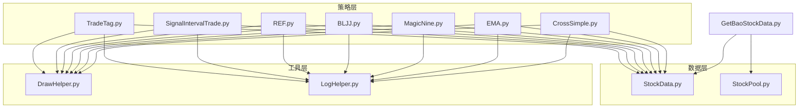
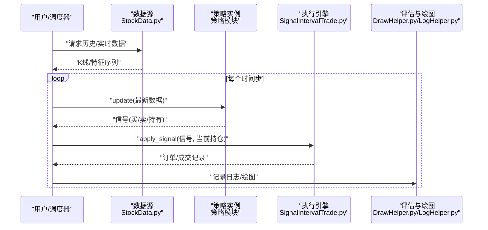
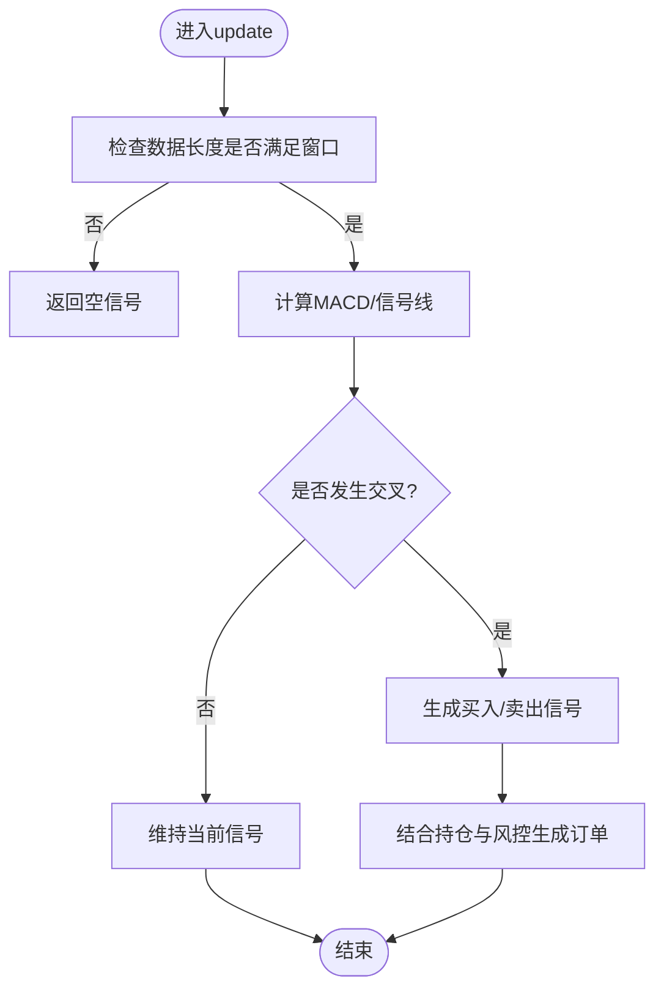
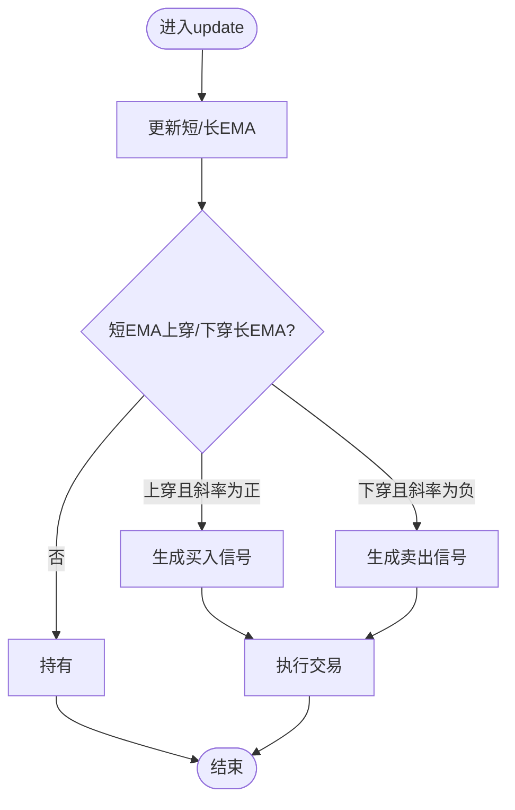
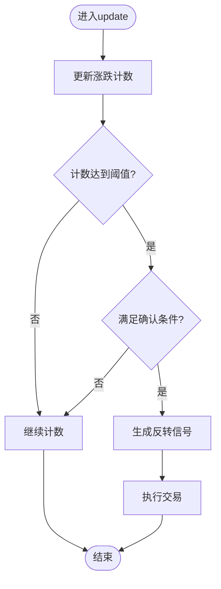
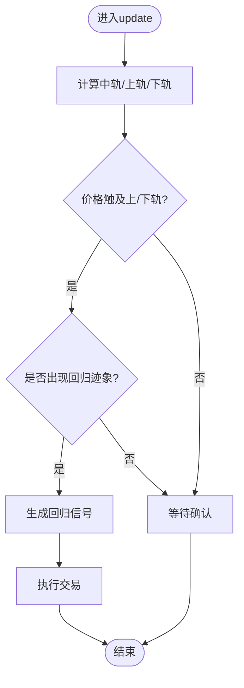
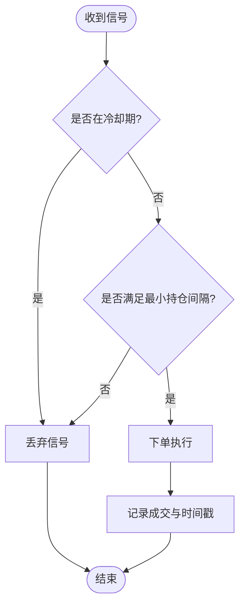
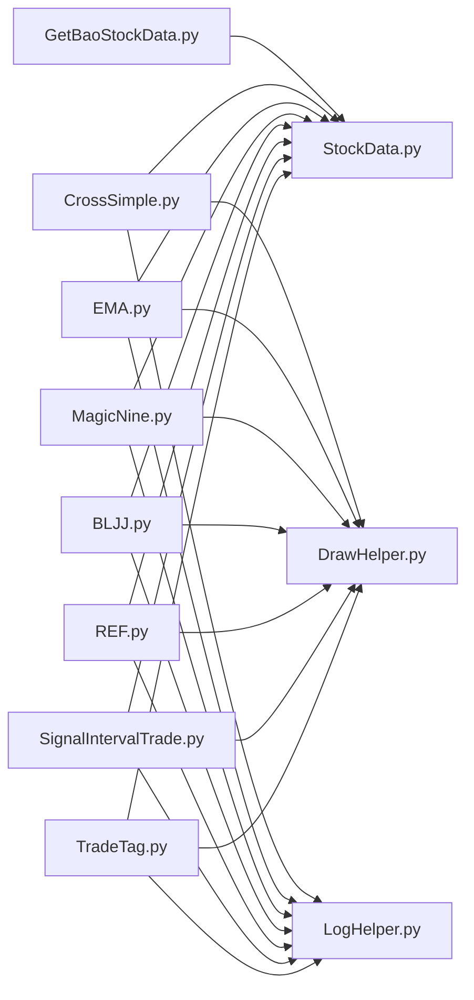

# 交易策略API

<cite>
**本文引用的文件**   
- [MyProject/Model/Strategy/CrossSimple.py](file://MyProject/Model/Strategy/CrossSimple.py)
- [MyProject/Model/Strategy/EMA.py](file://MyProject/Model/Strategy/EMA.py)
- [MyProject/Model/Strategy/MagicNine.py](file://MyProject/Model/Strategy/MagicNine.py)
- [MyProject/Model/Strategy/BLJJ.py](file://MyProject/Model/Strategy/BLJJ.py)
- [MyProject/Model/Strategy/REF.py](file://MyProject/Model/Strategy/REF.py)
- [MyProject/Model/Strategy/SignalIntervalTrade.py](file://MyProject/Model/Strategy/SignalIntervalTrade.py)
- [MyProject/Model/Strategy/TradeTag.py](file://MyProject/Model/Strategy/TradeTag.py)
- [MyProject/DataBase/StockData.py](file://MyProject/DataBase/StockData.py)
- [MyProject/DataBase/StockPool.py](file://MyProject/DataBase/StockPool.py)
- [MyProject/Helper/DrawHelper.py](file://MyProject/Helper/DrawHelper.py)
- [MyProject/Helper/LogHelper.py](file://MyProject/Helper/LogHelper.py)
- [GetBaoStockData.py](file://GetBaoStockData.py)
</cite>

## 目录
1. [简介](#简介)
2. [项目结构](#项目结构)
3. [核心组件](#核心组件)
4. [架构总览](#架构总览)
5. [详细组件分析](#详细组件分析)
6. [依赖关系分析](#依赖关系分析)
7. [性能考虑](#性能考虑)
8. [故障排查指南](#故障排查指南)
9. [结论](#结论)
10. [附录](#附录)

## 简介
本文件为交易策略系统的完整API参考文档，覆盖信号生成、交易执行与策略评估方法；记录MACD交叉、EMA均线、九转序列、布林带等策略的配置参数与接口；提供历史数据回测与实时模拟交易的API说明；包含策略组合与集成使用示例路径、性能指标计算与结果分析方法，以及策略优化与参数调优指导。

## 项目结构
本项目采用分层组织：
- 策略层（Strategy）：封装各类技术指标与交易信号逻辑
- 数据层（DataBase）：负责行情数据获取、存储与池化
- 工具层（Helper）：绘图、日志、随机数等通用能力
- 入口脚本：用于数据准备与实验流程编排

图表来源
- [MyProject/Model/Strategy/CrossSimple.py](file://MyProject/Model/Strategy/CrossSimple.py)
- [MyProject/Model/Strategy/EMA.py](file://MyProject/Model/Strategy/EMA.py)
- [MyProject/Model/Strategy/MagicNine.py](file://MyProject/Model/Strategy/MagicNine.py)
- [MyProject/Model/Strategy/BLJJ.py](file://MyProject/Model/Strategy/BLJJ.py)
- [MyProject/Model/Strategy/REF.py](file://MyProject/Model/Strategy/REF.py)
- [MyProject/Model/Strategy/SignalIntervalTrade.py](file://MyProject/Model/Strategy/SignalIntervalTrade.py)
- [MyProject/Model/Strategy/TradeTag.py](file://MyProject/Model/Strategy/TradeTag.py)
- [MyProject/DataBase/StockData.py](file://MyProject/DataBase/StockData.py)
- [MyProject/DataBase/StockPool.py](file://MyProject/DataBase/StockPool.py)
- [MyProject/Helper/DrawHelper.py](file://MyProject/Helper/DrawHelper.py)
- [MyProject/Helper/LogHelper.py](file://MyProject/Helper/LogHelper.py)
- [GetBaoStockData.py](file://GetBaoStockData.py)

章节来源
- [MyProject/Model/Strategy/CrossSimple.py](file://MyProject/Model/Strategy/CrossSimple.py)
- [MyProject/Model/Strategy/EMA.py](file://MyProject/Model/Strategy/EMA.py)
- [MyProject/Model/Strategy/MagicNine.py](file://MyProject/Model/Strategy/MagicNine.py)
- [MyProject/Model/Strategy/BLJJ.py](file://MyProject/Model/Strategy/BLJJ.py)
- [MyProject/Model/Strategy/REF.py](file://MyProject/Model/Strategy/REF.py)
- [MyProject/Model/Strategy/SignalIntervalTrade.py](file://MyProject/Model/Strategy/SignalIntervalTrade.py)
- [MyProject/Model/Strategy/TradeTag.py](file://MyProject/Model/Strategy/TradeTag.py)
- [MyProject/DataBase/StockData.py](file://MyProject/DataBase/StockData.py)
- [MyProject/DataBase/StockPool.py](file://MyProject/DataBase/StockPool.py)
- [MyProject/Helper/DrawHelper.py](file://MyProject/Helper/DrawHelper.py)
- [MyProject/Helper/LogHelper.py](file://MyProject/Helper/LogHelper.py)
- [GetBaoStockData.py](file://GetBaoStockData.py)

## 核心组件
本节概述策略系统的关键抽象与公共接口，便于统一理解各策略的输入输出与调用方式。

- 策略基类与通用接口
  - 初始化：接收配置字典（如周期、阈值、滑点、手续费等）
  - 更新：按时间步推进，接收最新K线或特征向量
  - 信号生成：返回买卖信号及置信度/强度
  - 交易执行：根据信号与仓位状态生成订单
  - 评估：统计收益、回撤、胜率、盈亏比等指标
  - 可视化：绘制价格、指标与交易标记

- 数据接口
  - 标准K线字段：日期、开盘、最高、最低、收盘、成交量
  - 批量加载：支持多标的与时间窗口切片
  - 增量更新：支持流式推送最新数据

- 工具与辅助
  - 日志：记录关键事件与异常
  - 绘图：输出策略曲线、买卖点、指标图
  - 标签与评估：交易标签生成与绩效统计

章节来源
- [MyProject/Model/Strategy/CrossSimple.py](file://MyProject/Model/Strategy/CrossSimple.py)
- [MyProject/Model/Strategy/EMA.py](file://MyProject/Model/Strategy/EMA.py)
- [MyProject/Model/Strategy/MagicNine.py](file://MyProject/Model/Strategy/MagicNine.py)
- [MyProject/Model/Strategy/BLJJ.py](file://MyProject/Model/Strategy/BLJJ.py)
- [MyProject/Model/Strategy/REF.py](file://MyProject/Model/Strategy/REF.py)
- [MyProject/Model/Strategy/SignalIntervalTrade.py](file://MyProject/Model/Strategy/SignalIntervalTrade.py)
- [MyProject/Model/Strategy/TradeTag.py](file://MyProject/Model/Strategy/TradeTag.py)
- [MyProject/DataBase/StockData.py](file://MyProject/DataBase/StockData.py)
- [MyProject/Helper/DrawHelper.py](file://MyProject/Helper/DrawHelper.py)
- [MyProject/Helper/LogHelper.py](file://MyProject/Helper/LogHelper.py)

## 架构总览
下图展示从数据到信号再到交易执行的端到端流程，以及回测与实盘模拟的统一入口。

图表来源
- [MyProject/DataBase/StockData.py](file://MyProject/DataBase/StockData.py)
- [MyProject/Model/Strategy/CrossSimple.py](file://MyProject/Model/Strategy/CrossSimple.py)
- [MyProject/Model/Strategy/EMA.py](file://MyProject/Model/Strategy/EMA.py)
- [MyProject/Model/Strategy/MagicNine.py](file://MyProject/Model/Strategy/MagicNine.py)
- [MyProject/Model/Strategy/BLJJ.py](file://MyProject/Model/Strategy/BLJJ.py)
- [MyProject/Model/Strategy/SignalIntervalTrade.py](file://MyProject/Model/Strategy/SignalIntervalTrade.py)
- [MyProject/Helper/DrawHelper.py](file://MyProject/Helper/DrawHelper.py)
- [MyProject/Helper/LogHelper.py](file://MyProject/Helper/LogHelper.py)

## 详细组件分析

### MACD交叉策略（CrossSimple）
- 功能概述
  - 基于MACD快慢线与信号线的交叉产生买卖信号
  - 支持零轴穿越与金叉/死叉过滤
- 主要接口
  - 初始化：配置快慢周期、信号周期、零轴阈值、滑点与手续费
  - update：接收最新收盘价序列，维护MACD指标
  - get_signals：返回当前信号与强度
  - apply：结合持仓状态生成订单
- 关键参数
  - 快周期、慢周期、信号周期
  - 零轴穿越阈值
  - 最小持仓间隔、最大仓位比例
- 复杂度
  - 时间：O(n) 滚动计算
  - 空间：O(k) 缓存窗口
- 错误处理
  - 数据不足时返回空信号
  - 非法参数抛出异常并记录日志
- 可视化
  - 绘制MACD柱状图与交叉点

图表来源
- [MyProject/Model/Strategy/CrossSimple.py](file://MyProject/Model/Strategy/CrossSimple.py)

章节来源
- [MyProject/Model/Strategy/CrossSimple.py](file://MyProject/Model/Strategy/CrossSimple.py)

### EMA均线策略（EMA）
- 功能概述
  - 基于短期与长期EMA的相对位置与斜率判断趋势
- 主要接口
  - 初始化：短周期、长周期、斜率阈值、滑点与手续费
  - update：维护双EMA序列
  - get_signals：依据交叉与斜率方向输出信号
  - apply：执行交易
- 关键参数
  - 短周期、长周期
  - 斜率阈值、确认次数
  - 止损止盈比例
- 复杂度
  - 时间：O(n)
  - 空间：O(k)
- 可视化
  - 绘制双EMA曲线与交易点

图表来源
- [MyProject/Model/Strategy/EMA.py](file://MyProject/Model/Strategy/EMA.py)

章节来源
- [MyProject/Model/Strategy/EMA.py](file://MyProject/Model/Strategy/EMA.py)

### 九转序列策略（MagicNine）
- 功能概述
  - 基于连续涨跌计数与第9次触发反转信号的形态策略
- 主要接口
  - 初始化：计数阈值、确认条件、滑点与手续费
  - update：维护计数与最近高低点
  - get_signals：在第9次触发时输出反转信号
  - apply：执行交易
- 关键参数
  - 计数阈值（默认9）
  - 确认条件（如收盘价突破前高/低）
  - 最小持仓间隔
- 复杂度
  - 时间：O(n)
  - 空间：O(1)
- 可视化
  - 标注第9次触发点与后续走势

图表来源
- [MyProject/Model/Strategy/MagicNine.py](file://MyProject/Model/Strategy/MagicNine.py)

章节来源
- [MyProject/Model/Strategy/MagicNine.py](file://MyProject/Model/Strategy/MagicNine.py)

### 布林带策略（BLJJ）
- 功能概述
  - 基于均值与标准差构建上下轨，价格触及边界或回归均值时产生信号
- 主要接口
  - 初始化：周期、倍数、滑点与手续费
  - update：计算中轨、上轨、下轨
  - get_signals：触轨或回归信号
  - apply：执行交易
- 关键参数
  - 周期、标准差倍数
  - 触轨确认次数
  - 止盈止损比例
- 复杂度
  - 时间：O(n)
  - 空间：O(k)
- 可视化
  - 绘制布林带通道与交易点

图表来源
- [MyProject/Model/Strategy/BLJJ.py](file://MyProject/Model/Strategy/BLJJ.py)

章节来源
- [MyProject/Model/Strategy/BLJJ.py](file://MyProject/Model/Strategy/BLJJ.py)

### 引用与比较策略（REF）
- 功能概述
  - 基于指定滞后期或外部基准的比较信号
- 主要接口
  - 初始化：滞后期、比较基准、阈值
  - update：对齐时间戳并比较
  - get_signals：输出比较结果信号
  - apply：执行交易
- 关键参数
  - 滞后期、基准类型（自身/指数/其他标的）
  - 阈值与确认规则
- 复杂度
  - 时间：O(n)
  - 空间：O(k)
- 可视化
  - 对比曲线与信号点

章节来源
- [MyProject/Model/Strategy/REF.py](file://MyProject/Model/Strategy/REF.py)

### 信号间隔交易（SignalIntervalTrade）
- 功能概述
  - 在信号之间施加最小持仓间隔与冷却时间，避免频繁交易
- 主要接口
  - 初始化：最小间隔、冷却时间、最大仓位
  - update：接收上游信号
  - apply：根据间隔约束生成最终订单
- 关键参数
  - 最小持仓间隔（分钟/根）
  - 冷却时间
  - 最大仓位比例
- 复杂度
  - 时间：O(1)
  - 空间：O(1)
- 可视化
  - 标注被抑制的信号与实际成交点

图表来源
- [MyProject/Model/Strategy/SignalIntervalTrade.py](file://MyProject/Model/Strategy/SignalIntervalTrade.py)

章节来源
- [MyProject/Model/Strategy/SignalIntervalTrade.py](file://MyProject/Model/Strategy/SignalIntervalTrade.py)

### 交易标签生成（TradeTag）
- 功能概述
  - 将交易记录转化为可训练标签（如未来收益区间、方向标签）
- 主要接口
  - 初始化：标签定义、前瞻窗口、归一化方式
  - generate：基于成交与未来价格生成标签
  - export：导出CSV/数据库
- 关键参数
  - 前瞻窗口（根数）
  - 标签类别（二元/多类/回归）
  - 归一化（收益率/对数收益率）
- 复杂度
  - 时间：O(n)
  - 空间：O(n)
- 可视化
  - 标签分布直方图与时间序列

章节来源
- [MyProject/Model/Strategy/TradeTag.py](file://MyProject/Model/Strategy/TradeTag.py)

## 依赖关系分析
- 策略与数据
  - 所有策略均依赖StockData进行数据读取与切片
- 策略与执行
  - 通过SignalIntervalTrade统一执行与风控
- 策略与工具
  - DrawHelper用于可视化，LogHelper用于记录
- 数据源
  - GetBaoStockData作为外部数据接入入口

图表来源
- [GetBaoStockData.py](file://GetBaoStockData.py)
- [MyProject/DataBase/StockData.py](file://MyProject/DataBase/StockData.py)
- [MyProject/Model/Strategy/CrossSimple.py](file://MyProject/Model/Strategy/CrossSimple.py)
- [MyProject/Model/Strategy/EMA.py](file://MyProject/Model/Strategy/EMA.py)
- [MyProject/Model/Strategy/MagicNine.py](file://MyProject/Model/Strategy/MagicNine.py)
- [MyProject/Model/Strategy/BLJJ.py](file://MyProject/Model/Strategy/BLJJ.py)
- [MyProject/Model/Strategy/REF.py](file://MyProject/Model/Strategy/REF.py)
- [MyProject/Model/Strategy/SignalIntervalTrade.py](file://MyProject/Model/Strategy/SignalIntervalTrade.py)
- [MyProject/Model/Strategy/TradeTag.py](file://MyProject/Model/Strategy/TradeTag.py)
- [MyProject/Helper/DrawHelper.py](file://MyProject/Helper/DrawHelper.py)
- [MyProject/Helper/LogHelper.py](file://MyProject/Helper/LogHelper.py)

章节来源
- [GetBaoStockData.py](file://GetBaoStockData.py)
- [MyProject/DataBase/StockData.py](file://MyProject/DataBase/StockData.py)
- [MyProject/Model/Strategy/CrossSimple.py](file://MyProject/Model/Strategy/CrossSimple.py)
- [MyProject/Model/Strategy/EMA.py](file://MyProject/Model/Strategy/EMA.py)
- [MyProject/Model/Strategy/MagicNine.py](file://MyProject/Model/Strategy/MagicNine.py)
- [MyProject/Model/Strategy/BLJJ.py](file://MyProject/Model/Strategy/BLJJ.py)
- [MyProject/Model/Strategy/REF.py](file://MyProject/Model/Strategy/REF.py)
- [MyProject/Model/Strategy/SignalIntervalTrade.py](file://MyProject/Model/Strategy/SignalIntervalTrade.py)
- [MyProject/Model/Strategy/TradeTag.py](file://MyProject/Model/Strategy/TradeTag.py)
- [MyProject/Helper/DrawHelper.py](file://MyProject/Helper/DrawHelper.py)
- [MyProject/Helper/LogHelper.py](file://MyProject/Helper/LogHelper.py)

## 性能考虑
- 计算复杂度
  - 多数策略为线性时间复杂度，适合大规模回测
- 内存占用
  - 控制滑动窗口大小，避免全量加载
- 并行与批处理
  - 多标的回测可按标的并行
- 数值稳定性
  - 对EMA/Bollinger等指标做防溢出与NaN处理
- I/O优化
  - 使用列式存储与按需读取减少磁盘压力

[本节为通用建议，不直接分析具体文件]

## 故障排查指南
- 常见问题
  - 数据缺失或时间戳不一致：确保时间索引对齐与去重
  - 指标未收敛：增加预热期或使用足够长的初始窗口
  - 频繁交易：调整最小持仓间隔与冷却时间
  - 过拟合：简化策略、引入正则化或交叉验证
- 日志定位
  - 查看关键节点日志与异常堆栈
  - 使用绘图快速定位异常时段
- 复现步骤
  - 固定随机种子与数据版本
  - 逐步缩小问题范围至单标的与单根K线

章节来源
- [MyProject/Helper/LogHelper.py](file://MyProject/Helper/LogHelper.py)
- [MyProject/Helper/DrawHelper.py](file://MyProject/Helper/DrawHelper.py)

## 结论
本API参考文档系统化梳理了策略层的信号生成、执行与评估接口，提供了从数据到交易的全链路视图。通过统一的策略抽象与工具链，可实现高效回测、稳健执行与可扩展的策略开发。建议在实际使用中结合参数扫描与样本外验证，持续迭代优化。

[本节为总结性内容，不直接分析具体文件]

## 附录

### API速查表（策略）
- CrossSimple（MACD交叉）
  - 初始化：周期、零轴阈值、滑点、手续费
  - 接口：update、get_signals、apply
  - 输出：信号、订单、日志
- EMA（均线）
  - 初始化：短/长周期、斜率阈值、止损止盈
  - 接口：update、get_signals、apply
- MagicNine（九转序列）
  - 初始化：计数阈值、确认条件
  - 接口：update、get_signals、apply
- BLJJ（布林带）
  - 初始化：周期、倍数、触轨确认
  - 接口：update、get_signals、apply
- REF（引用比较）
  - 初始化：滞后期、基准、阈值
  - 接口：update、get_signals、apply
- SignalIntervalTrade（间隔执行）
  - 初始化：最小间隔、冷却时间、最大仓位
  - 接口：update、apply
- TradeTag（标签生成）
  - 初始化：前瞻窗口、标签定义、归一化
  - 接口：generate、export

章节来源
- [MyProject/Model/Strategy/CrossSimple.py](file://MyProject/Model/Strategy/CrossSimple.py)
- [MyProject/Model/Strategy/EMA.py](file://MyProject/Model/Strategy/EMA.py)
- [MyProject/Model/Strategy/MagicNine.py](file://MyProject/Model/Strategy/MagicNine.py)
- [MyProject/Model/Strategy/BLJJ.py](file://MyProject/Model/Strategy/BLJJ.py)
- [MyProject/Model/Strategy/REF.py](file://MyProject/Model/Strategy/REF.py)
- [MyProject/Model/Strategy/SignalIntervalTrade.py](file://MyProject/Model/Strategy/SignalIntervalTrade.py)
- [MyProject/Model/Strategy/TradeTag.py](file://MyProject/Model/Strategy/TradeTag.py)

### 回测与模拟交易API
- 历史回测
  - 数据准备：使用StockData加载历史K线
  - 策略运行：逐根K线调用update与apply
  - 结果统计：汇总收益、回撤、胜率、盈亏比
- 实时模拟
  - 数据推送：订阅实时数据流
  - 延迟与滑点：注入模拟延迟与滑点
  - 风控：仓位限制、止损止盈、熔断
- 可视化与报告
  - 绘制净值曲线、交易点、指标图
  - 导出CSV/HTML报告

章节来源
- [MyProject/DataBase/StockData.py](file://MyProject/DataBase/StockData.py)
- [MyProject/Helper/DrawHelper.py](file://MyProject/Helper/DrawHelper.py)
- [MyProject/Helper/LogHelper.py](file://MyProject/Helper/LogHelper.py)

### 策略组合与集成示例（路径）
- 组合思路
  - 多策略投票：多数决或加权评分
  - 动态切换：根据市场状态选择主策略
  - 风险预算：按波动率分配仓位
- 示例路径
  - 组合框架与调度：见项目中的策略编排脚本（参考项目根目录下的实验脚本）
  - 数据与绘图：复用StockData与DrawHelper

章节来源
- [GetBaoStockData.py](file://GetBaoStockData.py)
- [MyProject/DataBase/StockData.py](file://MyProject/DataBase/StockData.py)
- [MyProject/Helper/DrawHelper.py](file://MyProject/Helper/DrawHelper.py)

### 策略优化与参数调优
- 网格搜索与贝叶斯优化
  - 目标函数：夏普比率、Calmar比率、最大回撤
  - 约束：换手率、滑点、手续费
- 样本外验证
  - 滚动窗口与扩展窗口
  - 时间序列交叉验证
- 稳健性检验
  - 参数扰动敏感性
  - 不同市场阶段表现

[本节为通用指导，不直接分析具体文件]