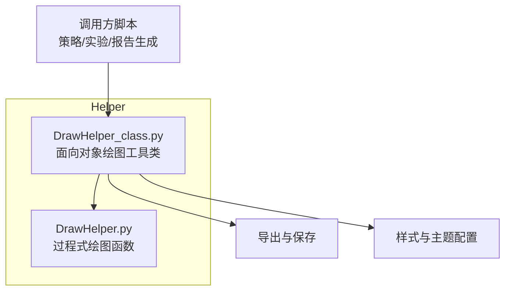
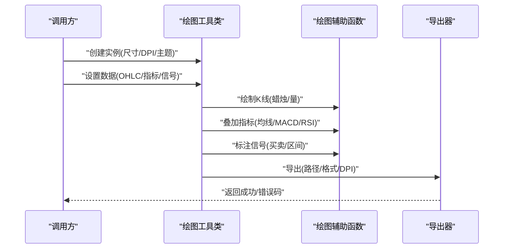
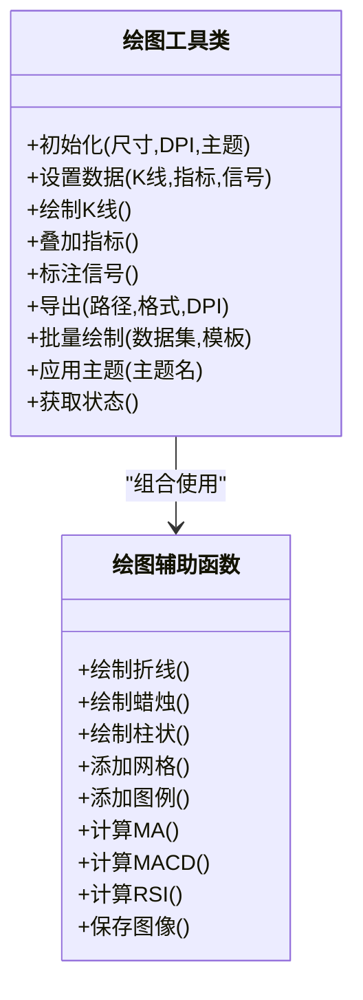
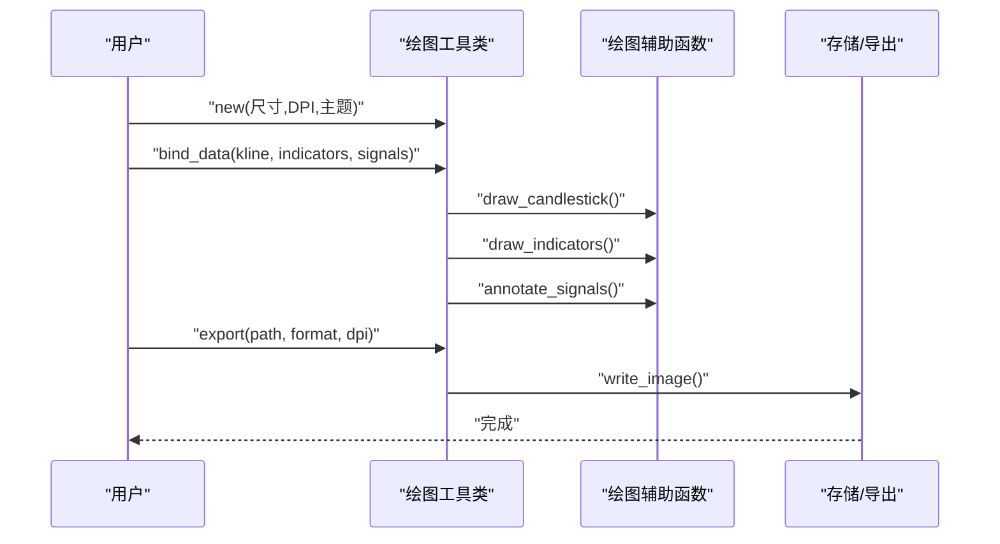
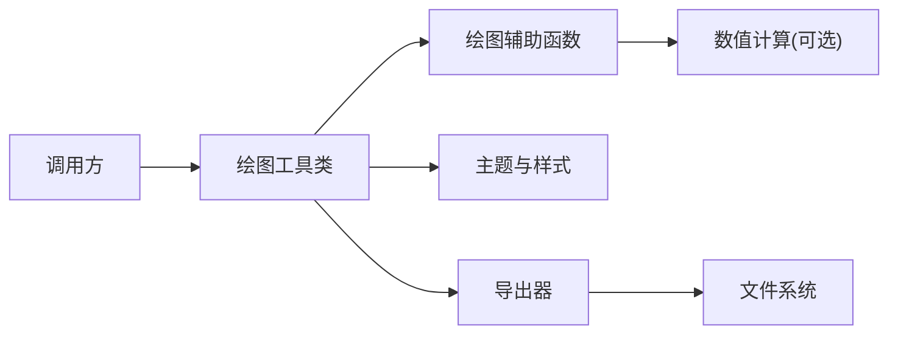

# 可视化API

<cite>
**本文引用的文件**   
- [DrawHelper.py](file://MyProject/Helper/DrawHelper.py)
- [DrawHelper_class.py](file://MyProject/Helper/DrawHelper_class.py)
</cite>

## 目录
1. [简介](#简介)
2. [项目结构](#项目结构)
3. [核心组件](#核心组件)
4. [架构总览](#架构总览)
5. [详细组件分析](#详细组件分析)
6. [依赖关系分析](#依赖关系分析)
7. [性能与内存优化](#性能与内存优化)
8. [故障排查指南](#故障排查指南)
9. [结论](#结论)
10. [附录：示例与最佳实践](#附录示例与最佳实践)

## 简介
本文件为“可视化模块”的完整API参考文档，聚焦于绘图工具类及其在股票K线图、技术指标图、交易信号图、性能分析与结果对比图等方面的能力。文档同时覆盖样式定制、主题配置、批量生成与报告自动化接口、导出格式与高分辨率输出方法，以及渲染性能与内存优化的实践建议。

## 项目结构
本项目中与可视化相关的代码集中在 Helper 目录下，主要包含两个文件：
- DrawHelper.py：面向过程的绘图辅助函数集合（如K线、指标、信号等）
- DrawHelper_class.py：面向对象封装的绘图工具类（提供统一入口、参数校验、样式与主题管理、批量与导出能力）

图表来源
- [DrawHelper.py](file://MyProject/Helper/DrawHelper.py)
- [DrawHelper_class.py](file://MyProject/Helper/DrawHelper_class.py)

章节来源
- [DrawHelper.py](file://MyProject/Helper/DrawHelper.py)
- [DrawHelper_class.py](file://MyProject/Helper/DrawHelper_class.py)

## 核心组件
- 绘图工具类（面向对象）
  - 职责：统一管理数据输入、坐标轴与网格、样式与主题、叠加图层（K线/指标/信号）、批量绘制、导出与分辨率控制。
  - 典型能力：
    - 初始化与上下文管理（画布尺寸、DPI、字体、颜色主题）
    - K线图绘制（OHLC、成交量、涨跌色）
    - 技术指标叠加（均线、MACD、RSI等）
    - 交易信号标注（买卖点、区间、注释）
    - 性能分析图表（耗时、吞吐、资源占用）
    - 结果对比图（多模型/多策略对比）
    - 批量生成（循环/并行、模板化布局）
    - 导出与高分辨率输出（PNG/SVG/PDF、矢量/位图）
- 绘图辅助函数（过程式）
  - 职责：提供细粒度绘图原语（如绘制蜡烛、柱状、折线、标注、网格、图例等），被工具类内部复用。

章节来源
- [DrawHelper_class.py](file://MyProject/Helper/DrawHelper_class.py)
- [DrawHelper.py](file://MyProject/Helper/DrawHelper.py)

## 架构总览
下图展示调用方通过工具类完成一次“K线+指标+信号”绘制的端到端流程，并体现导出与主题配置的参与点。

图表来源
- [DrawHelper_class.py](file://MyProject/Helper/DrawHelper_class.py)
- [DrawHelper.py](file://MyProject/Helper/DrawHelper.py)

## 详细组件分析

### 绘图工具类 API 参考（面向对象）
以下为面向对象的绘图工具类的主要方法与属性说明（以功能维度组织，便于快速定位）。

- 初始化与生命周期
  - 构造参数：画布尺寸、DPI、背景色、字体族/大小、边距、是否显示网格、时间轴格式化规则等
  - 上下文管理：进入/退出时自动清理资源（关闭图形窗口、释放缓存）
  - 状态查询：当前画布尺寸、已添加图层数量、主题名称、DPI 等

- 数据绑定
  - 绑定K线数据：要求包含日期、开盘、最高、最低、收盘、成交量；支持缺失值处理与排序
  - 绑定技术指标：支持多条序列（不同颜色/线型/透明度）
  - 绑定交易信号：支持买入/卖出/持有三类事件，可附加标签与箭头方向

- 绘图方法
  - 绘制K线图：蜡烛主体、影线、成交量柱、涨跌配色、时间轴刻度
  - 叠加指标：移动平均线、MACD（DIF/DEA/柱）、RSI、布林带等
  - 标注信号：买卖点标记、区间高亮、文本注释、自定义图标
  - 性能分析图：折线/柱状/热力图（耗时、吞吐、CPU/内存）
  - 结果对比图：多曲线对比、置信区间、误差棒、分组统计

- 样式与主题
  - 全局样式：线条宽度、点大小、填充透明度、网格线样式
  - 主题切换：内置浅色/深色/高对比度主题；支持自定义颜色板
  - 局部覆盖：对单个图层或元素进行样式覆盖

- 批量与自动化
  - 批量绘制：传入数据集列表与模板配置，循环生成多图
  - 布局管理：子图排列、共享坐标轴、统一图例
  - 报告集成：将生成的图片插入到报告模板中，按命名规范输出

- 导出与高分辨率
  - 导出格式：PNG、SVG、PDF
  - 分辨率控制：DPI 参数、矢量模式（SVG/PDF）
  - 质量与体积权衡：压缩选项、抗锯齿开关

- 错误处理与日志
  - 输入校验：类型检查、范围检查、缺失值提示
  - 异常捕获：记录详细堆栈与上下文信息，便于定位问题

章节来源
- [DrawHelper_class.py](file://MyProject/Helper/DrawHelper_class.py)

### 绘图辅助函数 API 参考（过程式）
以下为过程式函数的能力清单（供工具类内部或高级用户直接调用）。

- 基础绘图
  - 折线/散点/柱状/面积图绘制
  - 蜡烛图绘制（含涨跌色映射）
  - 网格、刻度、标签、标题、副标题
  - 图例、注释、箭头、矩形框

- 指标计算与绘制
  - 均线、MACD、RSI、布林带等指标计算与绘制
  - 多序列叠加与对齐（时间戳对齐、插值策略）

- 信号标注
  - 买卖点标记、区间高亮、文本注释
  - 自定义符号与颜色映射

- 导出与渲染
  - 保存为 PNG/SVG/PDF
  - 调整 DPI、边距、字体缩放
  - 批量导出与命名策略

章节来源
- [DrawHelper.py](file://MyProject/Helper/DrawHelper.py)

### 类关系与继承（面向对象）

图表来源
- [DrawHelper_class.py](file://MyProject/Helper/DrawHelper_class.py)
- [DrawHelper.py](file://MyProject/Helper/DrawHelper.py)

### 关键流程时序（K线+指标+信号）

图表来源
- [DrawHelper_class.py](file://MyProject/Helper/DrawHelper_class.py)
- [DrawHelper.py](file://MyProject/Helper/DrawHelper.py)

## 依赖关系分析
- 内聚性
  - 绘图工具类负责编排与状态管理，内聚度高
  - 绘图辅助函数专注具体绘制原语，职责清晰
- 耦合性
  - 工具类通过组合方式调用辅助函数，降低耦合
  - 导出与主题模块作为独立单元，便于替换与扩展
- 外部依赖
  - 图像处理与导出（位图/矢量）
  - 数值计算（可选，用于指标计算）
  - 文件系统（读写图片与报告模板）

图表来源
- [DrawHelper_class.py](file://MyProject/Helper/DrawHelper_class.py)
- [DrawHelper.py](file://MyProject/Helper/DrawHelper.py)

章节来源
- [DrawHelper_class.py](file://MyProject/Helper/DrawHelper_class.py)
- [DrawHelper.py](file://MyProject/Helper/DrawHelper.py)

## 性能与内存优化
- 渲染性能
  - 合理设置DPI与画布尺寸，避免过大像素导致渲染缓慢
  - 矢量格式（SVG/PDF）适合少量元素与高精度输出；位图（PNG）适合大量数据点
  - 启用抗锯齿与合适的线条宽度，平衡清晰度与速度
- 内存优化
  - 分批绘制大数据集，减少一次性加载
  - 及时释放中间变量与缓存对象
  - 使用增量更新而非全量重绘（当支持交互或动画时）
- 批量与并发
  - 批量任务采用队列或线程池，避免阻塞主进程
  - 共享只读资源（主题、字体）以减少重复开销
- 指标计算
  - 向量化计算优先，避免逐行循环
  - 预分配数组与复用缓冲区

[本节为通用指导，不直接分析具体文件]

## 故障排查指南
- 常见问题
  - 数据缺失或乱序：确保时间戳升序且无空值；必要时进行清洗与插值
  - 颜色不可见：检查主题对比度与透明度设置
  - 导出失败：确认目标路径权限与磁盘空间
  - 内存溢出：减小批次大小或改用流式处理
- 诊断建议
  - 开启详细日志，记录输入形状、数据类型与边界值
  - 分步执行并截图，定位问题阶段
  - 使用最小复现用例隔离问题

章节来源
- [DrawHelper_class.py](file://MyProject/Helper/DrawHelper_class.py)
- [DrawHelper.py](file://MyProject/Helper/DrawHelper.py)

## 结论
本可视化模块通过“工具类+辅助函数”的分层设计，提供了从K线、指标、信号到性能分析与结果对比的全链路绘图能力，并支持样式定制、批量生成与多格式导出。遵循本文档的API约定与最佳实践，可在保证可读性的同时获得良好的渲染性能与可扩展性。

[本节为总结性内容，不直接分析具体文件]

## 附录：示例与最佳实践

- 示例一：绘制单只股票的K线与均线
  - 步骤要点：初始化工具类→绑定K线与均线数据→设置主题→绘制→导出PNG
  - 参考实现位置：[DrawHelper_class.py](file://MyProject/Helper/DrawHelper_class.py)、[DrawHelper.py](file://MyProject/Helper/DrawHelper.py)

- 示例二：叠加MACD与RSI指标
  - 步骤要点：计算指标序列→绑定至工具类→分别绘制主图与子图→统一图例→导出
  - 参考实现位置：[DrawHelper_class.py](file://MyProject/Helper/DrawHelper_class.py)、[DrawHelper.py](file://MyProject/Helper/DrawHelper.py)

- 示例三：标注交易信号并生成对比图
  - 步骤要点：准备买卖信号→在K线上标注→叠加另一策略结果→对比布局→批量导出
  - 参考实现位置：[DrawHelper_class.py](file://MyProject/Helper/DrawHelper_class.py)、[DrawHelper.py](file://MyProject/Helper/DrawHelper.py)

- 示例四：性能分析图表
  - 步骤要点：收集耗时/吞吐/资源指标→选择合适图表类型→设置Y轴单位与阈值线→导出PDF
  - 参考实现位置：[DrawHelper_class.py](file://MyProject/Helper/DrawHelper_class.py)、[DrawHelper.py](file://MyProject/Helper/DrawHelper.py)

- 最佳实践
  - 数据先行：确保时间对齐与缺失值处理
  - 主题一致：统一颜色板与字体，提升报告一致性
  - 分层绘制：先背景与网格，再数据，最后标注与图例
  - 导出策略：大批量用PNG，小图用SVG/PDF；按需设置DPI
  - 批处理：使用模板与队列，避免重复初始化

章节来源
- [DrawHelper_class.py](file://MyProject/Helper/DrawHelper_class.py)
- [DrawHelper.py](file://MyProject/Helper/DrawHelper.py)