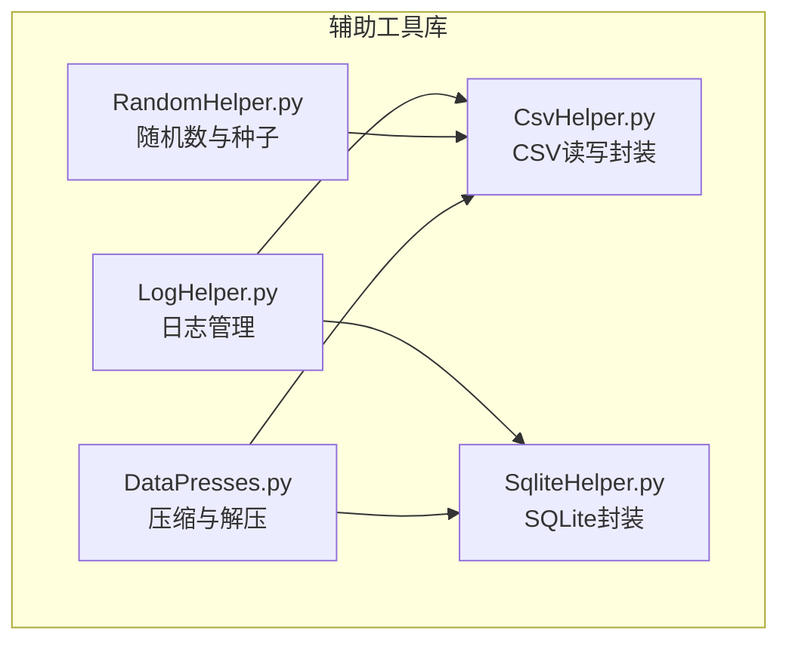
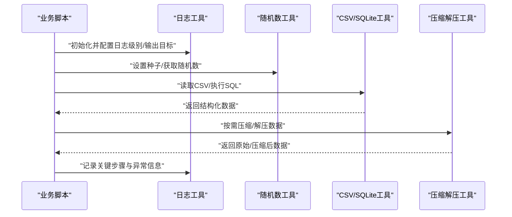
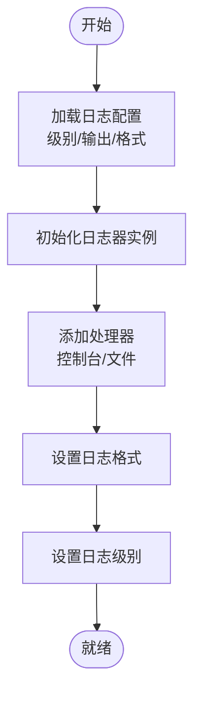
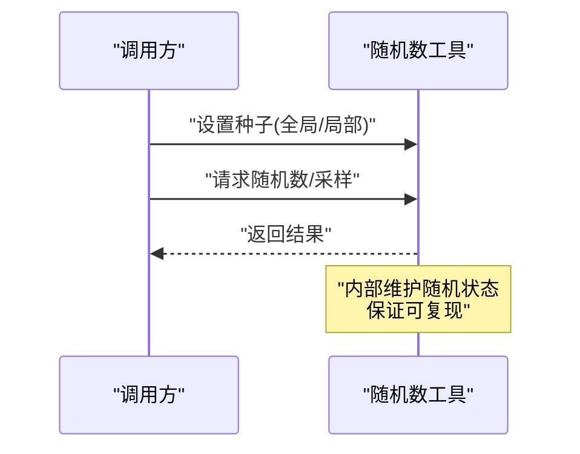
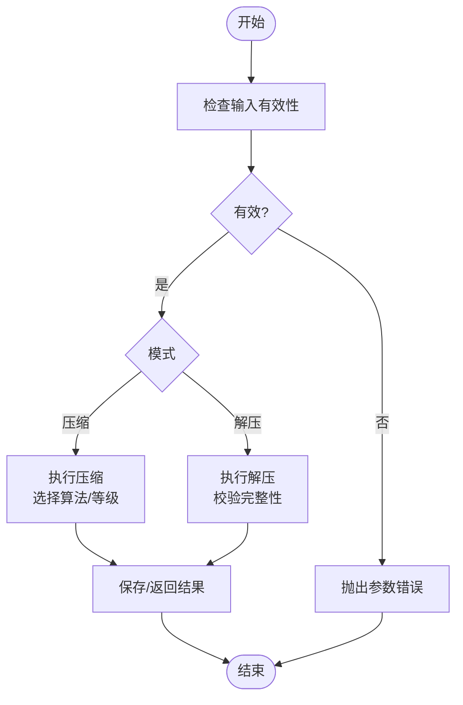
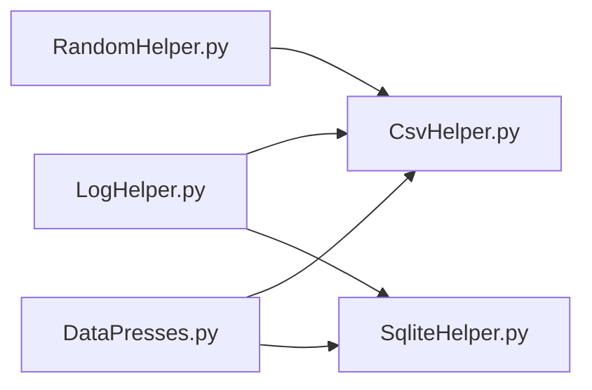

# 工具库API

<cite>
**本文引用的文件**   
- [LogHelper.py](file://MyProject/Helper/LogHelper.py)
- [RandomHelper.py](file://MyProject/Helper/RandomHelper.py)
- [DataPresses.py](file://MyProject/Helper/DataPresses.py)
- [CsvHelper.py](file://MyProject/Helper/CsvHelper.py)
- [SqliteHelper.py](file://MyProject/Helper/SqliteHelper.py)
</cite>

## 目录
1. [简介](#简介)
2. [项目结构](#项目结构)
3. [核心组件](#核心组件)
4. [架构总览](#架构总览)
5. [详细组件分析](#详细组件分析)
6. [依赖关系分析](#依赖关系分析)
7. [性能考虑](#性能考虑)
8. [故障排查指南](#故障排查指南)
9. [结论](#结论)
10. [附录](#附录) 

## 简介
本文件为辅助工具库的完整API参考文档，聚焦以下能力：
- 日志管理：日志级别配置、格式化输出与文件管理
- 随机数生成与种子控制
- 数据压缩与解压工具方法
- 通用工具函数：配置管理、路径操作、时间处理等
- 组合使用模式与最佳实践
- 自定义工具扩展开发指南

说明：
- 本文档以仓库中 Helper 目录下的工具模块为依据进行梳理。
- 为避免泄露实现细节，本文不直接粘贴代码片段，而是通过“章节来源”标注对应文件与行号范围，便于查阅源码。

## 项目结构
本项目中的工具类集中在 MyProject/Helper 目录下，主要包含：
- 日志工具：LogHelper.py
- 随机数工具：RandomHelper.py
- 压缩解压工具：DataPresses.py
- CSV 工具：CsvHelper.py
- SQLite 工具：SqliteHelper.py

图表来源
- [LogHelper.py](file://MyProject/Helper/LogHelper.py)
- [RandomHelper.py](file://MyProject/Helper/RandomHelper.py)
- [DataPresses.py](file://MyProject/Helper/DataPresses.py)
- [CsvHelper.py](file://MyProject/Helper/CsvHelper.py)
- [SqliteHelper.py](file://MyProject/Helper/SqliteHelper.py)

章节来源
- [LogHelper.py](file://MyProject/Helper/LogHelper.py)
- [RandomHelper.py](file://MyProject/Helper/RandomHelper.py)
- [DataPresses.py](file://MyProject/Helper/DataPresses.py)
- [CsvHelper.py](file://MyProject/Helper/CsvHelper.py)
- [SqliteHelper.py](file://MyProject/Helper/SqliteHelper.py)

## 核心组件
本节概述各工具模块的职责边界与对外暴露的主要能力（接口名称以实际源码为准）：
- 日志管理（LogHelper.py）
  - 日志级别配置与切换
  - 控制台与文件输出
  - 日志格式定制与轮转策略
- 随机数与种子（RandomHelper.py）
  - 随机数生成器封装
  - 全局/局部种子设置
  - 可复现实验的确定性保证
- 压缩与解压（DataPresses.py）
  - 常用压缩算法封装
  - 流式/内存压缩选项
  - 错误码与异常映射
- CSV 工具（CsvHelper.py）
  - 批量读写、编码处理、分隔符配置
  - 列类型推断与缺失值填充
- SQLite 工具（SqliteHelper.py）
  - 连接池与事务封装
  - 参数化查询与批处理
  - 索引与迁移辅助

章节来源
- [LogHelper.py](file://MyProject/Helper/LogHelper.py)
- [RandomHelper.py](file://MyProject/Helper/RandomHelper.py)
- [DataPresses.py](file://MyProject/Helper/DataPresses.py)
- [CsvHelper.py](file://MyProject/Helper/CsvHelper.py)
- [SqliteHelper.py](file://MyProject/Helper/SqliteHelper.py)

## 架构总览
下图展示工具库在典型数据处理流程中的协作关系：业务脚本调用日志与随机数工具，读取或写入CSV/SQLite，必要时对数据进行压缩/解压。

图表来源
- [LogHelper.py](file://MyProject/Helper/LogHelper.py)
- [RandomHelper.py](file://MyProject/Helper/RandomHelper.py)
- [CsvHelper.py](file://MyProject/Helper/CsvHelper.py)
- [SqliteHelper.py](file://MyProject/Helper/SqliteHelper.py)
- [DataPresses.py](file://MyProject/Helper/DataPresses.py)

## 详细组件分析

### 日志管理工具（LogHelper.py）
职责：
- 提供统一的日志入口，支持多输出目标（控制台、文件）
- 支持日志级别过滤、格式化模板、按大小/时间轮转
- 提供上下文管理器或便捷函数简化调用

主要能力（以源码为准）：
- 初始化与配置
  - 设置日志级别（如 DEBUG/INFO/WARNING/ERROR）
  - 指定输出目标（stdout/stderr/file）
  - 配置日志格式（时间戳、级别、模块名、消息体等）
- 写入与轮转
  - 单条写入、批量写入
  - 文件轮转策略（最大文件大小、保留份数）
- 线程安全与性能
  - 并发写入保护
  - 缓冲策略与异步落盘（若实现）

使用示例（示意）：
- 初始化时指定级别与输出文件
- 在关键路径记录 INFO/WARNING/ERROR
- 结合上下文记录耗时与异常堆栈

最佳实践：
- 启动阶段集中配置日志，避免重复初始化
- 生产环境默认关闭 DEBUG，按需开启
- 对大对象序列化前做截断，避免日志膨胀

章节来源
- [LogHelper.py](file://MyProject/Helper/LogHelper.py)

#### 日志初始化与配置流程图

图表来源
- [LogHelper.py](file://MyProject/Helper/LogHelper.py)

### 随机数与种子控制（RandomHelper.py）
职责：
- 封装常用随机数生成逻辑
- 提供全局/局部种子设置，确保实验可复现
- 统一随机源，避免多处 import 导致状态不一致

主要能力（以源码为准）：
- 种子设置
  - 全局种子：影响后续所有随机调用
  - 局部种子：在特定作用域内生效
- 随机数生成
  - 整数/浮点/序列采样
  - 正态/均匀/泊松等分布（若实现）
- 可复现性保障
  - 固定种子 + 固定依赖版本
  - 并行场景下的独立子种子分配

使用示例（示意）：
- 在实验入口处设置全局种子
- 在数据划分/模型初始化处使用局部种子
- 记录使用的种子以便回溯

最佳实践：
- 将种子作为配置项持久化
- 多线程/多进程下为每个工作进程设置独立种子
- 避免在热点路径频繁设置种子

章节来源
- [RandomHelper.py](file://MyProject/Helper/RandomHelper.py)

#### 随机数生成时序图

图表来源
- [RandomHelper.py](file://MyProject/Helper/RandomHelper.py)

### 数据压缩与解压（DataPresses.py）
职责：
- 封装常见压缩算法（如 gzip/zstd/lz4 等，视实现而定）
- 提供内存与流式两种模式
- 统一错误码与异常类型

主要能力（以源码为准）：
- 压缩
  - 输入：字节流/文件路径
  - 输出：压缩后字节/文件
  - 可选：压缩等级、块大小、是否校验
- 解压
  - 输入：压缩数据/文件路径
  - 输出：原始字节/文件
  - 可选：分块解压、进度回调
- 错误处理
  - 非法输入检测
  - 损坏数据提示
  - 资源释放保证

使用示例（示意）：
- 训练前后对中间结果进行压缩归档
- 在线服务中对传输负载进行压缩

最佳实践：
- 大数据集优先使用流式压缩，降低峰值内存
- 根据CPU/IO权衡选择压缩算法与等级
- 对压缩产物增加校验和，防止静默损坏

章节来源
- [DataPresses.py](file://MyProject/Helper/DataPresses.py)

#### 压缩/解压决策流程图

图表来源
- [DataPresses.py](file://MyProject/Helper/DataPresses.py)

### CSV 工具（CsvHelper.py）
职责：
- 简化 CSV 读写流程，统一编码与分隔符
- 提供列类型推断、缺失值处理、增量追加等能力

主要能力（以源码为准）：
- 读取
  - 指定分隔符、编码、表头行为
  - 列类型转换与空值策略
- 写入
  - 覆盖/追加模式
  - 自动创建目录与文件
- 批处理
  - 分块读取/写入，控制内存占用

使用示例（示意）：
- 从外部数据源导入 CSV 到 DataFrame/列表
- 将模型输出导出为 CSV 供下游消费

最佳实践：
- 明确编码（推荐 UTF-8），避免乱码
- 对大文件采用分块处理
- 写入前进行数据清洗与类型对齐

章节来源
- [CsvHelper.py](file://MyProject/Helper/CsvHelper.py)

### SQLite 工具（SqliteHelper.py）
职责：
- 封装数据库连接、事务、查询与批处理
- 提供参数化查询与简单迁移辅助

主要能力（以源码为准）：
- 连接管理
  - 连接复用/池化（若实现）
  - 超时与重试策略
- 数据访问
  - 增删改查、事务提交/回滚
  - 批量插入优化
- 元数据
  - 建表/索引/约束
  - 版本迁移（若实现）

使用示例（示意）：
- 初始化数据库与表结构
- 批量写入训练样本
- 条件查询与分页

最佳实践：
- 始终使用参数化查询，防范注入
- 长事务拆分为短事务，减少锁竞争
- 合理设计索引，避免全表扫描

章节来源
- [SqliteHelper.py](file://MyProject/Helper/SqliteHelper.py)

## 依赖关系分析
工具库内部耦合度较低，主要通过数据与日志进行交互。下图展示模块间依赖方向。

图表来源
- [LogHelper.py](file://MyProject/Helper/LogHelper.py)
- [RandomHelper.py](file://MyProject/Helper/RandomHelper.py)
- [DataPresses.py](file://MyProject/Helper/DataPresses.py)
- [CsvHelper.py](file://MyProject/Helper/CsvHelper.py)
- [SqliteHelper.py](file://MyProject/Helper/SqliteHelper.py)

章节来源
- [LogHelper.py](file://MyProject/Helper/LogHelper.py)
- [RandomHelper.py](file://MyProject/Helper/RandomHelper.py)
- [DataPresses.py](file://MyProject/Helper/DataPresses.py)
- [CsvHelper.py](file://MyProject/Helper/CsvHelper.py)
- [SqliteHelper.py](file://MyProject/Helper/SqliteHelper.py)

## 性能考虑
- 日志
  - 生产环境关闭 DEBUG；合理使用缓冲与异步落盘（若实现）
  - 避免在热路径打印大对象
- 随机数
  - 批量生成优于循环多次调用
  - 并行任务使用独立种子，避免相关性
- 压缩
  - 大文件优先流式；平衡压缩率与CPU开销
  - 对只读场景优先选择解压更快的算法
- CSV/SQLite
  - 大批量写入使用事务与批量接口
  - 合理设置页大小与缓存（若可配置）

[本节为通用指导，无需具体文件来源]

## 故障排查指南
常见问题与建议：
- 日志未输出或级别不生效
  - 检查初始化顺序与级别阈值
  - 确认输出路径权限与磁盘空间
- 随机结果不可复现
  - 核对全局/局部种子设置位置
  - 确认依赖库版本一致
- 压缩/解压失败
  - 检查输入是否为合法压缩格式
  - 查看错误码/异常信息定位原因
- CSV 乱码或列错位
  - 确认编码与分隔符配置
  - 检查首行表头与列数一致性
- SQLite 写入缓慢或锁冲突
  - 拆分事务、增加索引
  - 避免长事务与高并发写

章节来源
- [LogHelper.py](file://MyProject/Helper/LogHelper.py)
- [RandomHelper.py](file://MyProject/Helper/RandomHelper.py)
- [DataPresses.py](file://MyProject/Helper/DataPresses.py)
- [CsvHelper.py](file://MyProject/Helper/CsvHelper.py)
- [SqliteHelper.py](file://MyProject/Helper/SqliteHelper.py)

## 结论
本工具库围绕日志、随机数、压缩解压、CSV/SQLite 提供了稳定易用的封装。建议在生产环境中遵循最佳实践，结合业务需求选择合适的配置与组合方式，以获得更好的稳定性与性能表现。

[本节为总结性内容，无需具体文件来源]

## 附录

### API 速查（以源码为准）
- 日志管理（LogHelper.py）
  - 初始化与配置：设置级别、输出目标、格式
  - 写入接口：info/warning/error/debug 等
  - 文件管理：轮转策略、保留份数、路径创建
- 随机数（RandomHelper.py）
  - 种子设置：全局/局部
  - 随机生成：整数/浮点/采样/分布（若实现）
- 压缩解压（DataPresses.py）
  - 压缩：输入字节/路径，输出压缩数据/路径
  - 解压：输入压缩数据/路径，输出原始数据/路径
- CSV（CsvHelper.py）
  - 读取：分隔符、编码、类型转换、空值策略
  - 写入：覆盖/追加、批量写入
- SQLite（SqliteHelper.py）
  - 连接/事务：连接复用、提交/回滚
  - 查询/批处理：参数化查询、批量插入

章节来源
- [LogHelper.py](file://MyProject/Helper/LogHelper.py)
- [RandomHelper.py](file://MyProject/Helper/RandomHelper.py)
- [DataPresses.py](file://MyProject/Helper/DataPresses.py)
- [CsvHelper.py](file://MyProject/Helper/CsvHelper.py)
- [SqliteHelper.py](file://MyProject/Helper/SqliteHelper.py)

### 组合使用模式与最佳实践
- 标准实验流水线
  - 启动时初始化日志与随机种子
  - 读取CSV/SQLite构建数据集
  - 训练过程中记录关键指标
  - 结束后对产出物进行压缩归档
- 在线服务
  - 轻量日志（INFO+ERROR）
  - 流式压缩传输
  - 连接池与短事务
- 可复现实验
  - 固定种子与依赖版本
  - 记录运行环境与配置快照
  - 对关键中间结果进行哈希校验

[本节为通用指导，无需具体文件来源]

### 自定义工具扩展开发指南
- 新增工具模块
  - 在 Helper 目录下新建模块，保持单一职责
  - 提供清晰的初始化与配置接口
  - 统一错误类型与日志接入
- 与现有工具集成
  - 通过日志工具记录关键事件
  - 通过随机数工具保证可复现性
  - 通过CSV/SQLite工具完成数据存取
  - 通过压缩工具对中间产物归档
- 测试与文档
  - 编写单元测试覆盖边界情况
  - 补充使用示例与注意事项
  - 更新本文档的API速查与流程图

[本节为通用指导，无需具体文件来源]