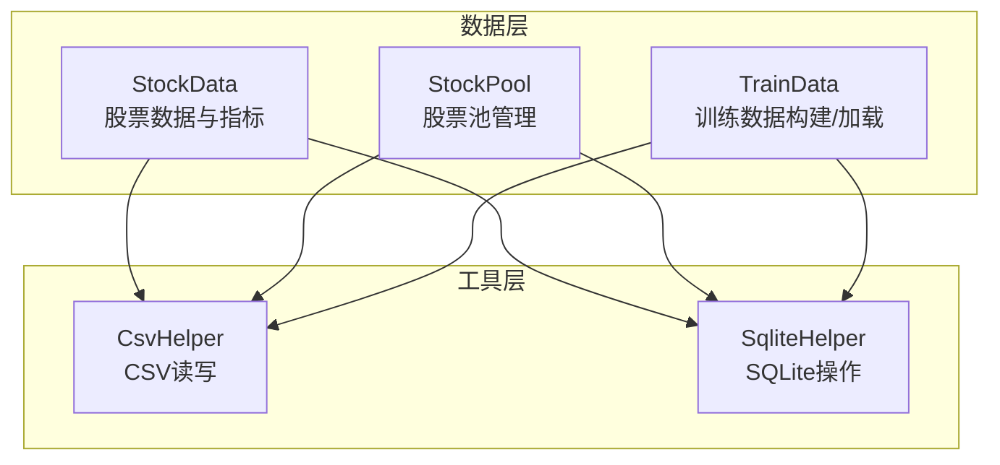
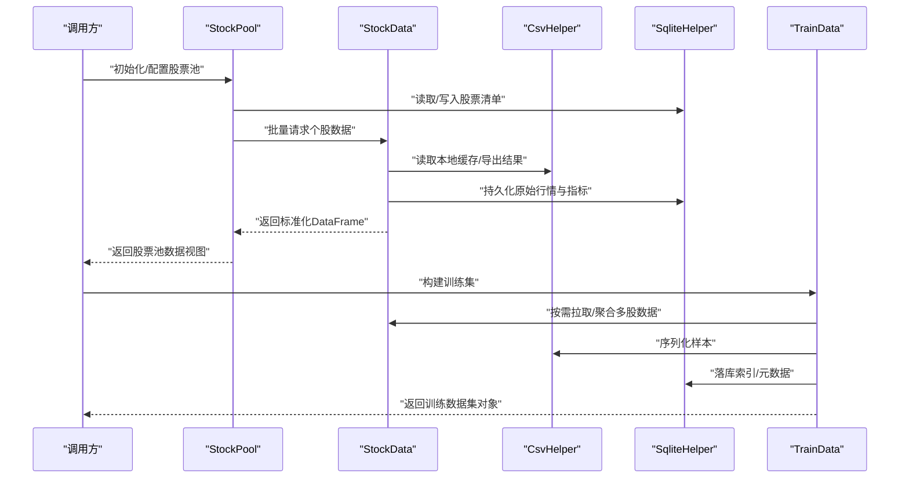
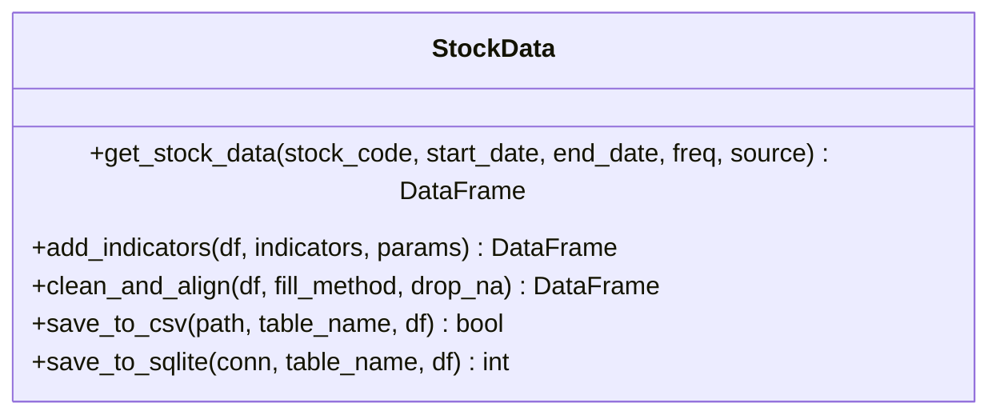
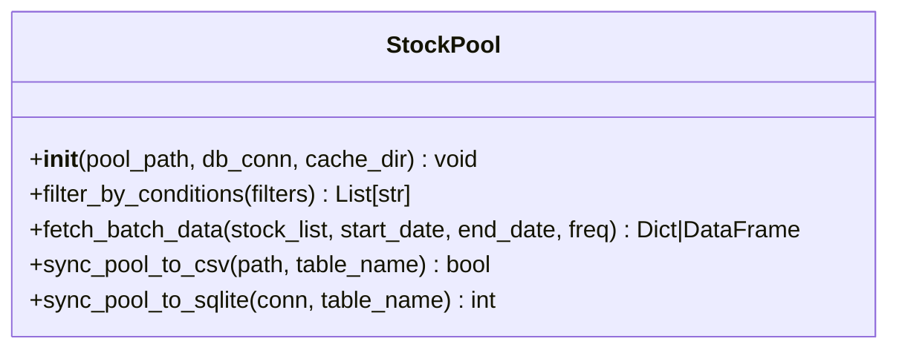
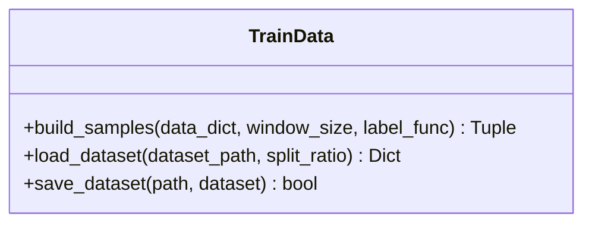
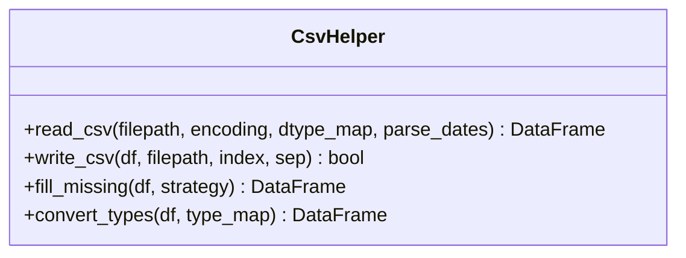
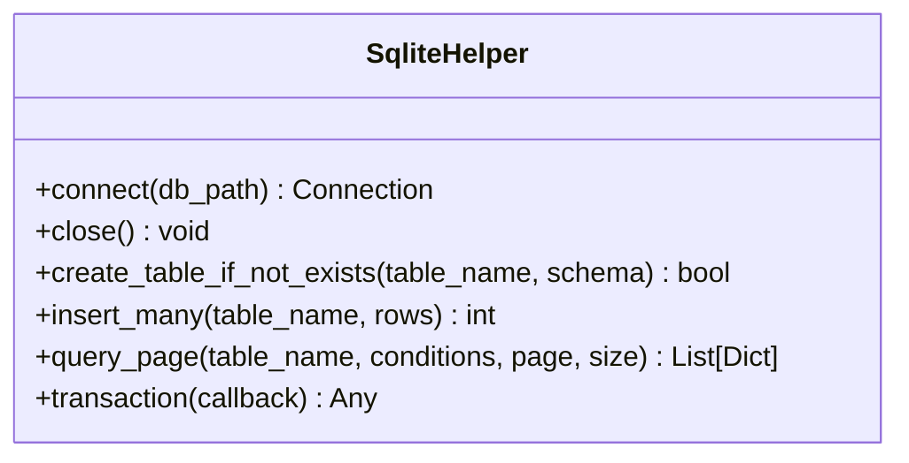
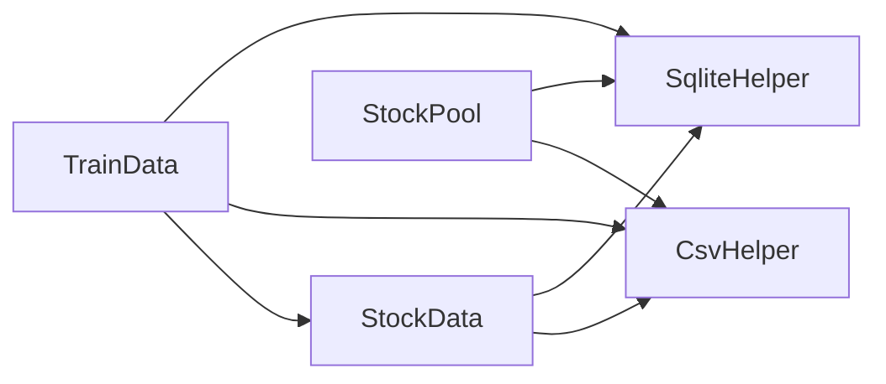

# 数据管理API

<cite>
**本文引用的文件**   
- [StockData.py](file://MyProject/DataBase/StockData.py)
- [StockPool.py](file://MyProject/DataBase/StockPool.py)
- [TrainData.py](file://MyProject/DataBase/TrainData.py)
- [CsvHelper.py](file://MyProject/Helper/CsvHelper.py)
- [SqliteHelper.py](file://MyProject/Helper/SqliteHelper.py)
</cite>

## 目录
1. [简介](#简介)
2. [项目结构](#项目结构)
3. [核心组件](#核心组件)
4. [架构总览](#架构总览)
5. [详细组件分析](#详细组件分析)
6. [依赖关系分析](#依赖关系分析)
7. [性能考虑](#性能考虑)
8. [故障排查指南](#故障排查指南)
9. [结论](#结论)
10. [附录](#附录)

## 简介
本文件为数据管理模块的完整API参考文档，覆盖以下核心类与工具：
- StockData：股票行情数据获取、技术指标计算与数据处理。
- StockPool：股票池管理与筛选接口。
- TrainData：训练数据的构建与加载方法。
- CsvHelper：CSV文件的读写与格式化工具。
- SqliteHelper：SQLite数据库的数据操作封装。

目标读者包括量化研究员、数据工程师与算法开发者，旨在提供清晰的方法签名说明、参数与返回值定义、使用示例路径、异常处理建议以及数据格式与校验规则。

## 项目结构
数据管理相关代码主要位于 MyProject/DataBase 与 MyProject/Helper 两个子包中：
- DataBase：包含业务数据模型与数据处理逻辑（StockData、StockPool、TrainData）。
- Helper：通用数据工具（CsvHelper、SqliteHelper）及辅助功能。

图表来源
- [StockData.py](file://MyProject/DataBase/StockData.py)
- [StockPool.py](file://MyProject/DataBase/StockPool.py)
- [TrainData.py](file://MyProject/DataBase/TrainData.py)
- [CsvHelper.py](file://MyProject/Helper/CsvHelper.py)
- [SqliteHelper.py](file://MyProject/Helper/SqliteHelper.py)

章节来源
- [StockData.py](file://MyProject/DataBase/StockData.py)
- [StockPool.py](file://MyProject/DataBase/StockPool.py)
- [TrainData.py](file://MyProject/DataBase/TrainData.py)
- [CsvHelper.py](file://MyProject/Helper/CsvHelper.py)
- [SqliteHelper.py](file://MyProject/Helper/SqliteHelper.py)

## 核心组件
本节概述各组件的职责边界与交互方式：
- StockData：负责从外部源（如BaoStock或本地缓存）拉取个股历史行情，清洗并生成常用技术指标（如均线、MACD、RSI等），并提供统一的数据访问接口。
- StockPool：维护可交易股票列表及其元信息，支持按条件筛选、批量拉取数据与增量更新。
- TrainData：将多只股票的时序特征与标签组织成图节点/边或序列样本，供下游GNN或时序模型训练。
- CsvHelper：对CSV进行高效读写、列类型转换、缺失值处理与编码处理。
- SqliteHelper：对SQLite进行连接管理、表结构DDL、增删改查与事务封装。

章节来源
- [StockData.py](file://MyProject/DataBase/StockData.py)
- [StockPool.py](file://MyProject/DataBase/StockPool.py)
- [TrainData.py](file://MyProject/DataBase/TrainData.py)
- [CsvHelper.py](file://MyProject/Helper/CsvHelper.py)
- [SqliteHelper.py](file://MyProject/Helper/SqliteHelper.py)

## 架构总览
下图展示了数据从外部源到训练样本的整体流程，以及各组件之间的调用关系。

图表来源
- [StockPool.py](file://MyProject/DataBase/StockPool.py)
- [StockData.py](file://MyProject/DataBase/StockData.py)
- [CsvHelper.py](file://MyProject/Helper/CsvHelper.py)
- [SqliteHelper.py](file://MyProject/Helper/SqliteHelper.py)
- [TrainData.py](file://MyProject/DataBase/TrainData.py)

## 详细组件分析

### StockData 类
职责：
- 获取单只或多只股票的历史行情数据。
- 计算并附加技术指标列。
- 数据清洗、对齐与标准化。
- 与CSV/SQLite进行读写交互。

关键方法与属性（以实际实现为准）：
- 数据获取
  - 方法名：get_stock_data
    - 参数：
      - stock_code: 股票代码字符串
      - start_date: 起始日期（YYYY-MM-DD）
      - end_date: 结束日期（YYYY-MM-DD）
      - freq: 频率（如日K、周K）
      - source: 数据来源（本地/网络）
    - 返回：标准化后的DataFrame，包含OHLCV等字段
    - 异常：网络错误、数据缺失、时间范围非法
- 技术指标
  - 方法名：add_indicators
    - 参数：
      - df: 输入DataFrame
      - indicators: 指标列表（如MA、MACD、RSI）
      - params: 各指标参数映射
    - 返回：带指标列的DataFrame
    - 异常：参数不合法、NaN传播控制失败
- 数据清洗
  - 方法名：clean_and_align
    - 参数：
      - df: 输入DataFrame
      - fill_method: 缺失值填充策略
      - drop_na: 是否删除含NA行
    - 返回：清洗后的DataFrame
    - 异常：列缺失、类型不一致
- 持久化
  - 方法名：save_to_csv / save_to_sqlite
    - 参数：文件路径/数据库连接、表名、数据帧
    - 返回：成功标志或影响行数
    - 异常：IO错误、权限不足、约束冲突

数据格式与字段说明（常见）：
- 日期时间：datetime 或 str(YYYY-MM-DD)
- OHLCV：open/high/low/close/volume
- 复权因子：adj_factor（可选）
- 指标列：根据指标动态添加，命名规范见实现

数据验证规则：
- 日期区间合法且非空
- OHLCV数值为正数
- 成交量为非负整数
- 指标计算窗口满足最小长度要求

使用示例路径：
- [StockData.py](file://MyProject/DataBase/StockData.py)

章节来源
- [StockData.py](file://MyProject/DataBase/StockData.py)

#### 类关系图（概念性）

图表来源
- [StockData.py](file://MyProject/DataBase/StockData.py)

### StockPool 类
职责：
- 维护股票池清单与元信息。
- 支持按行业、板块、上市状态等条件筛选。
- 批量拉取并缓存个股数据。
- 与CSV/SQLite同步股票清单。

关键方法与属性（以实际实现为准）：
- 初始化与配置
  - 方法名：__init__
    - 参数：pool_path, db_conn, cache_dir
    - 行为：加载股票清单、建立缓存目录
- 筛选与查询
  - 方法名：filter_by_conditions
    - 参数：filters字典（如行业、市值区间）
    - 返回：符合条件的股票代码列表
- 批量数据获取
  - 方法名：fetch_batch_data
    - 参数：stock_list, start_date, end_date, freq
    - 返回：按股票分组的DataFrame集合或合并后的长表
- 持久化
  - 方法名：sync_pool_to_csv / sync_pool_to_sqlite
    - 参数：路径/连接、表名
    - 返回：成功标志或影响行数

数据格式与字段说明（股票清单）：
- stock_code: 股票代码
- name: 名称
- industry: 行业
- list_date: 上市日期
- status: 上市状态

使用示例路径：
- [StockPool.py](file://MyProject/DataBase/StockPool.py)

章节来源
- [StockPool.py](file://MyProject/DataBase/StockPool.py)

#### 类关系图（概念性）

图表来源
- [StockPool.py](file://MyProject/DataBase/StockPool.py)

### TrainData 类
职责：
- 将多只股票的时序特征与标签组织为训练样本。
- 支持滑动窗口、序列切分与图结构构建。
- 提供训练集的加载、划分与序列化。

关键方法与属性（以实际实现为准）：
- 构建样本
  - 方法名：build_samples
    - 参数：
      - data_dict: 股票数据映射
      - window_size: 窗口大小
      - label_func: 标签函数
    - 返回：X, y 或图对象集合
- 加载与划分
  - 方法名：load_dataset
    - 参数：dataset_path, split_ratio
    - 返回：train/val/test 数据集
- 序列化
  - 方法名：save_dataset
    - 参数：path, dataset
    - 返回：成功标志

数据格式与字段说明（训练样本）：
- X: 特征矩阵或图邻接结构
- y: 标签向量或图标签
- meta: 样本元信息（股票ID、时间戳等）

使用示例路径：
- [TrainData.py](file://MyProject/DataBase/TrainData.py)

章节来源
- [TrainData.py](file://MyProject/DataBase/TrainData.py)

#### 类关系图（概念性）

图表来源
- [TrainData.py](file://MyProject/DataBase/TrainData.py)

### CsvHelper 工具类
职责：
- 提供CSV的高效读写、列类型转换、缺失值处理与编码处理。
- 支持大文件分块读取与写入优化。

关键方法与属性（以实际实现为准）：
- 读取
  - 方法名：read_csv
    - 参数：filepath, encoding, dtype_map, parse_dates
    - 返回：DataFrame
- 写入
  - 方法名：write_csv
    - 参数：df, filepath, index, sep
    - 返回：成功标志
- 预处理
  - 方法名：fill_missing / convert_types
    - 参数：df, strategy, type_map
    - 返回：处理后的DataFrame

使用示例路径：
- [CsvHelper.py](file://MyProject/Helper/CsvHelper.py)

章节来源
- [CsvHelper.py](file://MyProject/Helper/CsvHelper.py)

#### 类关系图（概念性）

图表来源
- [CsvHelper.py](file://MyProject/Helper/CsvHelper.py)

### SqliteHelper 工具类
职责：
- 封装SQLite连接管理、DDL执行、CRUD操作与事务。
- 提供批量插入、分页查询与索引优化。

关键方法与属性（以实际实现为准）：
- 连接管理
  - 方法名：connect / close
    - 参数：db_path
    - 返回：连接对象/无
- DDL
  - 方法名：create_table_if_not_exists
    - 参数：table_name, schema
    - 返回：成功标志
- CRUD
  - 方法名：insert_many / query_page
    - 参数：表名、数据列表/查询条件、分页参数
    - 返回：影响行数/记录列表
- 事务
  - 方法名：transaction
    - 参数：回调函数
    - 返回：回调返回值

使用示例路径：
- [SqliteHelper.py](file://MyProject/Helper/SqliteHelper.py)

章节来源
- [SqliteHelper.py](file://MyProject/Helper/SqliteHelper.py)

#### 类关系图（概念性）

图表来源
- [SqliteHelper.py](file://MyProject/Helper/SqliteHelper.py)

## 依赖关系分析
组件间依赖如下：
- StockData 依赖 CsvHelper 与 SqliteHelper 进行数据持久化与格式化。
- StockPool 依赖 CsvHelper 与 SqliteHelper 管理股票清单。
- TrainData 依赖 StockData 获取多股数据，并使用 CsvHelper/SqliteHelper 保存中间产物。

图表来源
- [StockData.py](file://MyProject/DataBase/StockData.py)
- [StockPool.py](file://MyProject/DataBase/StockPool.py)
- [TrainData.py](file://MyProject/DataBase/TrainData.py)
- [CsvHelper.py](file://MyProject/Helper/CsvHelper.py)
- [SqliteHelper.py](file://MyProject/Helper/SqliteHelper.py)

章节来源
- [StockData.py](file://MyProject/DataBase/StockData.py)
- [StockPool.py](file://MyProject/DataBase/StockPool.py)
- [TrainData.py](file://MyProject/DataBase/TrainData.py)
- [CsvHelper.py](file://MyProject/Helper/CsvHelper.py)
- [SqliteHelper.py](file://MyProject/Helper/SqliteHelper.py)

## 性能考虑
- 批量操作：优先使用批量插入与分块读取，减少IO次数。
- 内存管理：对大表采用流式处理与分页查询，避免一次性加载全量数据。
- 索引优化：在高频查询列上建立索引（如日期、股票代码）。
- 缓存策略：对热点股票数据设置本地缓存，降低重复请求开销。
- 并发控制：合理限制并发度，避免数据库连接耗尽。

## 故障排查指南
常见问题与定位步骤：
- 数据缺失或NaN过多
  - 检查数据清洗流程与填充策略
  - 确认指标计算窗口是否满足最小长度
- 指标计算异常
  - 核对参数合法性与数据类型
  - 查看中间结果分布与极值
- IO错误
  - 检查文件路径权限与磁盘空间
  - 确认CSV编码与分隔符一致
- 数据库错误
  - 检查表结构与约束
  - 查看事务回滚日志与锁等待

章节来源
- [StockData.py](file://MyProject/DataBase/StockData.py)
- [CsvHelper.py](file://MyProject/Helper/CsvHelper.py)
- [SqliteHelper.py](file://MyProject/Helper/SqliteHelper.py)

## 结论
本API参考文档系统化梳理了数据管理模块的核心能力与使用方法。通过统一的StockData、StockPool、TrainData与CsvHelper、SqliteHelper，可实现从数据采集、清洗、指标计算到训练样本构建的端到端流水线。建议在工程中遵循数据验证与异常处理的最佳实践，并结合性能优化策略提升整体吞吐与稳定性。

## 附录
- 数据格式约定
  - 日期时间：优先使用datetime类型；若为字符串，需符合YYYY-MM-DD
  - 数值列：确保正数与非负约束
  - 指标列：命名清晰，避免与基础字段冲突
- 使用示例路径
  - [StockData.py](file://MyProject/DataBase/StockData.py)
  - [StockPool.py](file://MyProject/DataBase/StockPool.py)
  - [TrainData.py](file://MyProject/DataBase/TrainData.py)
  - [CsvHelper.py](file://MyProject/Helper/CsvHelper.py)
  - [SqliteHelper.py](file://MyProject/Helper/SqliteHelper.py)