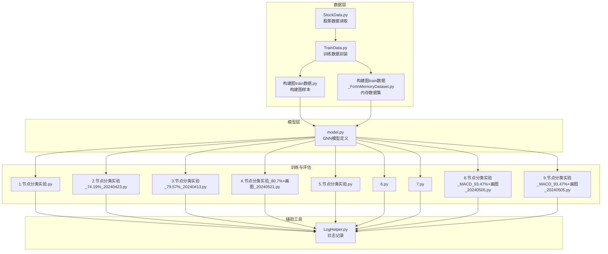
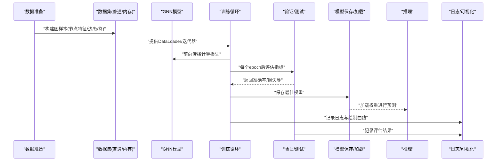
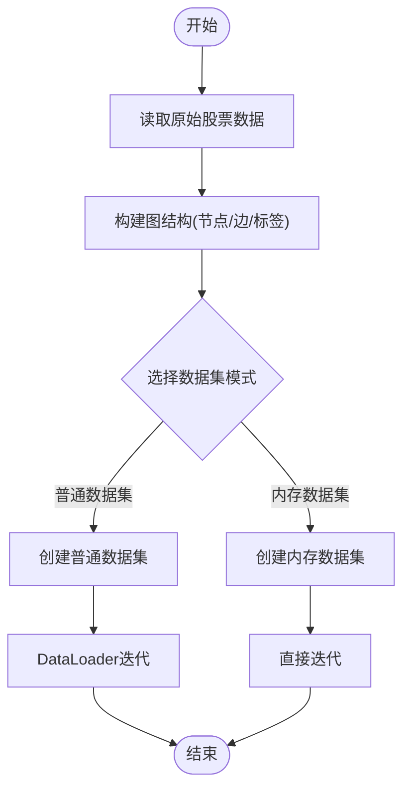
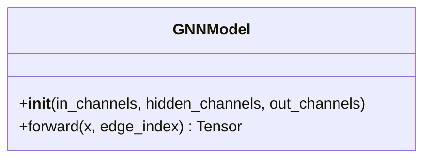
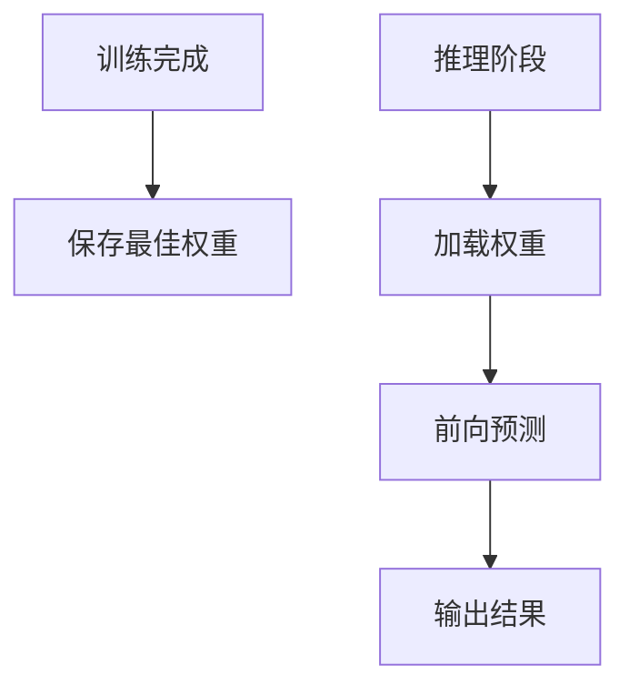
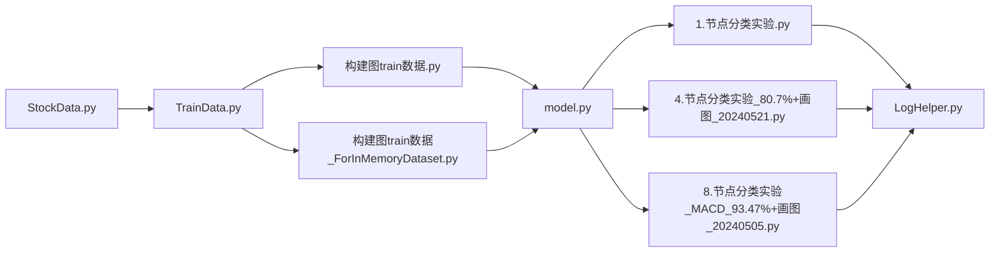

# 模型训练API

<cite>
**本文引用的文件**   
- [MyProject/Model/1.节点分类实验.py](file://MyProject/Model/1.节点分类实验.py)
- [MyProject/Model/2.节点分类实验_74.19%_20240423.py](file://MyProject/Model/2.节点分类实验_74.19%_20240423.py)
- [MyProject/Model/3.节点分类实验_79.57%_20240413.py](file://MyProject/Model/3.节点分类实验_79.57%_20240413.py)
- [MyProject/Model/4.节点分类实验_80.7%+画图_20240521.py](file://MyProject/Model/4.节点分类实验_80.7%+画图_20240521.py)
- [MyProject/Model/5.节点分类实验.py](file://MyProject/Model/5.节点分类实验.py)
- [MyProject/Model/6.py](file://MyProject/Model/6.py)
- [MyProject/Model/7.py](file://MyProject/Model/7.py)
- [MyProject/Model/8.节点分类实验_MACD_93.47%+画图_20240505.py](file://MyProject/Model/8.节点分类实验_MACD_93.47%+画图_20240505.py)
- [MyProject/Model/9.节点分类实验_MACD_93.47%+画图_20240505.py](file://MyProject/Model/9.节点分类实验_MACD_93.47%+画图_20240505.py)
- [生成train数据/model.py](file://生成train数据/model.py)
- [生成train数据/构建图train数据.py](file://生成train数据/构建图train数据.py)
- [生成train数据/构建图train数据_ForInMemoryDataset.py](file://生成train数据/构建图train数据_ForInMemoryDataset.py)
- [MyProject/DataBase/TrainData.py](file://MyProject/DataBase/TrainData.py)
- [MyProject/DataBase/StockData.py](file://MyProject/DataBase/StockData.py)
- [MyProject/Helper/LogHelper.py](file://MyProject/Helper/LogHelper.py)
</cite>

## 目录
1. [简介](#简介)
2. [项目结构](#项目结构)
3. [核心组件](#核心组件)
4. [架构总览](#架构总览)
5. [详细组件分析](#详细组件分析)
6. [依赖关系分析](#依赖关系分析)
7. [性能考虑](#性能考虑)
8. [故障排查指南](#故障排查指南)
9. [结论](#结论)
10. [附录](#附录)

## 简介
本文件面向图神经网络（GNN）在股票节点分类任务中的“模型训练模块”，提供完整的API参考与使用指南。内容覆盖：
- 图数据准备与加载（含内存数据集）
- GNN模型构建、训练、验证与测试接口
- 模型保存、加载与推理流程
- 超参数配置与调优建议
- 模型架构选择指南与性能优化技巧
- 完整训练脚本示例与最佳实践
- 错误处理与调试方法

目标读者包括算法工程师与量化研究者，既需要快速上手，也关注工程化落地与可复现实验。

## 项目结构
本项目围绕“数据准备—模型定义—训练评估—可视化”的流水线组织代码，主要目录与职责如下：
- 生成train数据：负责从原始行情数据构建图结构样本，并封装为PyTorch Geometric的数据集对象；包含内存数据集版本以支持大规模或交互式实验。
- MyProject/Model：存放多版节点分类实验脚本，涵盖不同特征组合（如MACD）、可视化输出与迭代优化过程。
- MyProject/DataBase：提供股票数据与训练数据的读写封装。
- MyProject/Helper：日志、绘图等通用工具。



图表来源
- [MyProject/DataBase/StockData.py](file://MyProject/DataBase/StockData.py)
- [MyProject/DataBase/TrainData.py](file://MyProject/DataBase/TrainData.py)
- [生成train数据/构建图train数据.py](file://生成train数据/构建图train数据.py)
- [生成train数据/构建图train数据_ForInMemoryDataset.py](file://生成train数据/构建图train数据_ForInMemoryDataset.py)
- [生成train数据/model.py](file://生成train数据/model.py)
- [MyProject/Model/1.节点分类实验.py](file://MyProject/Model/1.节点分类实验.py)
- [MyProject/Model/2.节点分类实验_74.19%_20240423.py](file://MyProject/Model/2.节点分类实验_74.19%_20240423.py)
- [MyProject/Model/3.节点分类实验_79.57%_20240413.py](file://MyProject/Model/3.节点分类实验_79.57%_20240413.py)
- [MyProject/Model/4.节点分类实验_80.7%+画图_20240521.py](file://MyProject/Model/4.节点分类实验_80.7%+画图_20240521.py)
- [MyProject/Model/5.节点分类实验.py](file://MyProject/Model/5.节点分类实验.py)
- [MyProject/Model/6.py](file://MyProject/Model/6.py)
- [MyProject/Model/7.py](file://MyProject/Model/7.py)
- [MyProject/Model/8.节点分类实验_MACD_93.47%+画图_20240505.py](file://MyProject/Model/8.节点分类实验_MACD_93.47%+画图_20240505.py)
- [MyProject/Model/9.节点分类实验_MACD_93.47%+画图_20240505.py](file://MyProject/Model/9.节点分类实验_MACD_93.47%+画图_20240505.py)
- [MyProject/Helper/LogHelper.py](file://MyProject/Helper/LogHelper.py)

章节来源
- [MyProject/DataBase/StockData.py](file://MyProject/DataBase/StockData.py)
- [MyProject/DataBase/TrainData.py](file://MyProject/DataBase/TrainData.py)
- [生成train数据/构建图train数据.py](file://生成train数据/构建图train数据.py)
- [生成train数据/构建图train数据_ForInMemoryDataset.py](file://生成train数据/构建图train数据_ForInMemoryDataset.py)
- [生成train数据/model.py](file://生成train数据/model.py)
- [MyProject/Model/1.节点分类实验.py](file://MyProject/Model/1.节点分类实验.py)
- [MyProject/Model/2.节点分类实验_74.19%_20240423.py](file://MyProject/Model/2.节点分类实验_74.19%_20240423.py)
- [MyProject/Model/3.节点分类实验_79.57%_20240413.py](file://MyProject/Model/3.节点分类实验_79.57%_20240413.py)
- [MyProject/Model/4.节点分类实验_80.7%+画图_20240521.py](file://MyProject/Model/4.节点分类实验_80.7%+画图_20240521.py)
- [MyProject/Model/5.节点分类实验.py](file://MyProject/Model/5.节点分类实验.py)
- [MyProject/Model/6.py](file://MyProject/Model/6.py)
- [MyProject/Model/7.py](file://MyProject/Model/7.py)
- [MyProject/Model/8.节点分类实验_MACD_93.47%+画图_20240505.py](file://MyProject/Model/8.节点分类实验_MACD_93.47%+画图_20240505.py)
- [MyProject/Model/9.节点分类实验_MACD_93.47%+画图_20240505.py](file://MyProject/Model/9.节点分类实验_MACD_93.47%+画图_20240505.py)
- [MyProject/Helper/LogHelper.py](file://MyProject/Helper/LogHelper.py)

## 核心组件
本节聚焦于“模型训练模块”的关键API与调用点，按功能域划分：

- 数据准备与加载
  - 从股票数据到图样本的构建流程，支持普通数据集与内存数据集两种模式。
  - 关键入口：
    - [构建图train数据.py](file://生成train数据/构建图train数据.py)
    - [构建图train数据_ForInMemoryDataset.py](file://生成train数据/构建图train数据_ForInMemoryDataset.py)
    - [TrainData.py](file://MyProject/DataBase/TrainData.py)
    - [StockData.py](file://MyProject/DataBase/StockData.py)

- 模型定义
  - GNN模型类定义与层堆叠方式，用于节点分类任务。
  - 关键入口：
    - [model.py](file://生成train数据/model.py)

- 训练、验证与测试
  - 多版实验脚本实现训练循环、验证、测试与可视化。
  - 关键入口：
    - [1.节点分类实验.py](file://MyProject/Model/1.节点分类实验.py)
    - [2.节点分类实验_74.19%_20240423.py](file://MyProject/Model/2.节点分类实验_74.19%_20240423.py)
    - [3.节点分类实验_79.57%_20240413.py](file://MyProject/Model/3.节点分类实验_79.57%_20240413.py)
    - [4.节点分类实验_80.7%+画图_20240521.py](file://MyProject/Model/4.节点分类实验_80.7%+画图_20240521.py)
    - [5.节点分类实验.py](file://MyProject/Model/5.节点分类实验.py)
    - [6.py](file://MyProject/Model/6.py)
    - [7.py](file://MyProject/Model/7.py)
    - [8.节点分类实验_MACD_93.47%+画图_20240505.py](file://MyProject/Model/8.节点分类实验_MACD_93.47%+画图_20240505.py)
    - [9.节点分类实验_MACD_93.47%+画图_20240505.py](file://MyProject/Model/9.节点分类实验_MACD_93.47%+画图_20240505.py)

- 模型持久化与推理
  - 保存/加载权重与进行推理预测的接口通常位于各实验脚本中，结合模型定义文件完成。
  - 参考路径：
    - [model.py](file://生成train数据/model.py)
    - [任意实验脚本（例如4.节点分类实验_80.7%+画图_20240521.py）](file://MyProject/Model/4.节点分类实验_80.7%+画图_20240521.py)

- 日志与可视化
  - 训练过程中的日志记录与结果可视化。
  - 参考路径：
    - [LogHelper.py](file://MyProject/Helper/LogHelper.py)
    - 各实验脚本中的绘图逻辑

章节来源
- [生成train数据/构建图train数据.py](file://生成train数据/构建图train数据.py)
- [生成train数据/构建图train数据_ForInMemoryDataset.py](file://生成train数据/构建图train数据_ForInMemoryDataset.py)
- [MyProject/DataBase/TrainData.py](file://MyProject/DataBase/TrainData.py)
- [MyProject/DataBase/StockData.py](file://MyProject/DataBase/StockData.py)
- [生成train数据/model.py](file://生成train数据/model.py)
- [MyProject/Model/1.节点分类实验.py](file://MyProject/Model/1.节点分类实验.py)
- [MyProject/Model/2.节点分类实验_74.19%_20240423.py](file://MyProject/Model/2.节点分类实验_74.19%_20240423.py)
- [MyProject/Model/3.节点分类实验_79.57%_20240413.py](file://MyProject/Model/3.节点分类实验_79.57%_20240413.py)
- [MyProject/Model/4.节点分类实验_80.7%+画图_20240521.py](file://MyProject/Model/4.节点分类实验_80.7%+画图_20240521.py)
- [MyProject/Model/5.节点分类实验.py](file://MyProject/Model/5.节点分类实验.py)
- [MyProject/Model/6.py](file://MyProject/Model/6.py)
- [MyProject/Model/7.py](file://MyProject/Model/7.py)
- [MyProject/Model/8.节点分类实验_MACD_93.47%+画图_20240505.py](file://MyProject/Model/8.节点分类实验_MACD_93.47%+画图_20240505.py)
- [MyProject/Model/9.节点分类实验_MACD_93.47%+画图_20240505.py](file://MyProject/Model/9.节点分类实验_MACD_93.47%+画图_20240505.py)
- [MyProject/Helper/LogHelper.py](file://MyProject/Helper/LogHelper.py)

## 架构总览
下图展示了从数据到训练、评估与推理的整体流程，以及各模块之间的交互关系。



图表来源
- [生成train数据/构建图train数据.py](file://生成train数据/构建图train数据.py)
- [生成train数据/构建图train数据_ForInMemoryDataset.py](file://生成train数据/构建图train数据_ForInMemoryDataset.py)
- [生成train数据/model.py](file://生成train数据/model.py)
- [MyProject/Model/1.节点分类实验.py](file://MyProject/Model/1.节点分类实验.py)
- [MyProject/Model/4.节点分类实验_80.7%+画图_20240521.py](file://MyProject/Model/4.节点分类实验_80.7%+画图_20240521.py)
- [MyProject/Helper/LogHelper.py](file://MyProject/Helper/LogHelper.py)

## 详细组件分析

### 数据准备与加载API
- 目标
  - 将股票时序特征转换为图结构样本，供GNN训练使用。
  - 支持普通数据集与内存数据集两种模式，便于不同规模与交互需求。
- 关键接口与流程
  - 从原始数据到图样本的构建：
    - [构建图train数据.py](file://生成train数据/构建图train数据.py)
    - [构建图train数据_ForInMemoryDataset.py](file://生成train数据/构建图train数据_ForInMemoryDataset.py)
  - 训练数据封装与访问：
    - [TrainData.py](file://MyProject/DataBase/TrainData.py)
    - [StockData.py](file://MyProject/DataBase/StockData.py)
- 典型用法
  - 初始化数据集对象，获取节点特征、边索引与标签。
  - 通过DataLoader或内存数据集直接迭代。
- 注意事项
  - 内存数据集适合小规模或频繁随机访问场景，注意显存占用。
  - 普通数据集适合大规模离线训练，需确保磁盘I/O效率。



图表来源
- [生成train数据/构建图train数据.py](file://生成train数据/构建图train数据.py)
- [生成train数据/构建图train数据_ForInMemoryDataset.py](file://生成train数据/构建图train数据_ForInMemoryDataset.py)
- [MyProject/DataBase/TrainData.py](file://MyProject/DataBase/TrainData.py)
- [MyProject/DataBase/StockData.py](file://MyProject/DataBase/StockData.py)

章节来源
- [生成train数据/构建图train数据.py](file://生成train数据/构建图train数据.py)
- [生成train数据/构建图train数据_ForInMemoryDataset.py](file://生成train数据/构建图train数据_ForInMemoryDataset.py)
- [MyProject/DataBase/TrainData.py](file://MyProject/DataBase/TrainData.py)
- [MyProject/DataBase/StockData.py](file://MyProject/DataBase/StockData.py)

### 模型定义API
- 目标
  - 定义用于节点分类的GNN模型，包含卷积层、激活函数与分类头。
- 关键接口
  - 模型类定义与前向传播：
    - [model.py](file://生成train数据/model.py)
- 设计要点
  - 输入维度与类别数应匹配任务设置。
  - 层数与隐藏维度影响表达能力与过拟合风险。
  - 建议使用批归一化或残差连接提升稳定性（根据实际实现）。



图表来源
- [生成train数据/model.py](file://生成train数据/model.py)

章节来源
- [生成train数据/model.py](file://生成train数据/model.py)

### 训练、验证与测试API
- 目标
  - 提供完整的训练循环、验证与测试流程，支持多版本实验对比。
- 关键接口与流程
  - 训练循环（前向、损失、反向、优化器更新）：
    - [1.节点分类实验.py](file://MyProject/Model/1.节点分类实验.py)
    - [2.节点分类实验_74.19%_20240423.py](file://MyProject/Model/2.节点分类实验_74.19%_20240423.py)
    - [3.节点分类实验_79.57%_20240413.py](file://MyProject/Model/3.节点分类实验_79.57%_20240413.py)
    - [4.节点分类实验_80.7%+画图_20240521.py](file://MyProject/Model/4.节点分类实验_80.7%+画图_20240521.py)
    - [5.节点分类实验.py](file://MyProject/Model/5.节点分类实验.py)
    - [6.py](file://MyProject/Model/6.py)
    - [7.py](file://MyProject/Model/7.py)
    - [8.节点分类实验_MACD_93.47%+画图_20240505.py](file://MyProject/Model/8.节点分类实验_MACD_93.47%+画图_20240505.py)
    - [9.节点分类实验_MACD_93.47%+画图_20240505.py](file://MyProject/Model/9.节点分类实验_MACD_93.47%+画图_20240505.py)
  - 验证与测试：在每个epoch或固定步数后进行指标统计。
  - 可视化：记录训练曲线与结果图。
- 典型用法
  - 初始化模型与优化器，加载数据集，进入训练循环。
  - 每轮结束后执行验证，保存最佳模型。
  - 最终在测试集上报告指标。

```mermaid
sequenceDiagram
participant Script as "实验脚本"
participant Loader as "数据加载器"
participant Model as "GNN模型"
participant Opt as "优化器"
participant Eval as "评估器"
participant Log as "日志/可视化"
Script->>Loader : "获取批次数据"
Script->>Model : "前向传播"
Model-->>Script : "预测与损失"
Script->>Opt : "反向传播与参数更新"
Script->>Eval : "计算验证/测试指标"
Eval-->>Script : "返回指标"
Script->>Log : "记录日志与绘图"
```

图表来源
- [MyProject/Model/1.节点分类实验.py](file://MyProject/Model/1.节点分类实验.py)
- [MyProject/Model/4.节点分类实验_80.7%+画图_20240521.py](file://MyProject/Model/4.节点分类实验_80.7%+画图_20240521.py)
- [MyProject/Model/8.节点分类实验_MACD_93.47%+画图_20240505.py](file://MyProject/Model/8.节点分类实验_MACD_93.47%+画图_20240505.py)
- [MyProject/Helper/LogHelper.py](file://MyProject/Helper/LogHelper.py)

章节来源
- [MyProject/Model/1.节点分类实验.py](file://MyProject/Model/1.节点分类实验.py)
- [MyProject/Model/2.节点分类实验_74.19%_20240423.py](file://MyProject/Model/2.节点分类实验_74.19%_20240423.py)
- [MyProject/Model/3.节点分类实验_79.57%_20240413.py](file://MyProject/Model/3.节点分类实验_79.57%_20240413.py)
- [MyProject/Model/4.节点分类实验_80.7%+画图_20240521.py](file://MyProject/Model/4.节点分类实验_80.7%+画图_20240521.py)
- [MyProject/Model/5.节点分类实验.py](file://MyProject/Model/5.节点分类实验.py)
- [MyProject/Model/6.py](file://MyProject/Model/6.py)
- [MyProject/Model/7.py](file://MyProject/Model/7.py)
- [MyProject/Model/8.节点分类实验_MACD_93.47%+画图_20240505.py](file://MyProject/Model/8.节点分类实验_MACD_93.47%+画图_20240505.py)
- [MyProject/Model/9.节点分类实验_MACD_93.47%+画图_20240505.py](file://MyProject/Model/9.节点分类实验_MACD_93.47%+画图_20240505.py)
- [MyProject/Helper/LogHelper.py](file://MyProject/Helper/LogHelper.py)

### 模型保存、加载与推理API
- 目标
  - 保存训练得到的最佳权重，并在后续推理阶段加载使用。
- 关键接口与流程
  - 保存/加载权重通常在实验脚本中实现，结合模型定义文件完成。
  - 参考路径：
    - [model.py](file://生成train数据/model.py)
    - [4.节点分类实验_80.7%+画图_20240521.py](file://MyProject/Model/4.节点分类实验_80.7%+画图_20240521.py)
- 典型用法
  - 训练过程中保存最佳验证指标的权重。
  - 推理时加载权重，对测试集或新数据进行预测。



图表来源
- [生成train数据/model.py](file://生成train数据/model.py)
- [MyProject/Model/4.节点分类实验_80.7%+画图_20240521.py](file://MyProject/Model/4.节点分类实验_80.7%+画图_20240521.py)

章节来源
- [生成train数据/model.py](file://生成train数据/model.py)
- [MyProject/Model/4.节点分类实验_80.7%+画图_20240521.py](file://MyProject/Model/4.节点分类实验_80.7%+画图_20240521.py)

### 超参数配置与调优建议
- 常见超参数
  - 学习率、优化器类型、批次大小、训练轮数、隐藏维度、层数、正则化强度等。
- 调优建议
  - 从小规模数据与简单模型起步，逐步增加复杂度。
  - 使用早停策略防止过拟合。
  - 针对股票序列特征，尝试引入时间相关特征（如MACD）以提升表现。
- 参考实现
  - 各实验脚本中的超参数设置与调整逻辑：
    - [1.节点分类实验.py](file://MyProject/Model/1.节点分类实验.py)
    - [4.节点分类实验_80.7%+画图_20240521.py](file://MyProject/Model/4.节点分类实验_80.7%+画图_20240521.py)
    - [8.节点分类实验_MACD_93.47%+画图_20240505.py](file://MyProject/Model/8.节点分类实验_MACD_93.47%+画图_20240505.py)

章节来源
- [MyProject/Model/1.节点分类实验.py](file://MyProject/Model/1.节点分类实验.py)
- [MyProject/Model/4.节点分类实验_80.7%+画图_20240521.py](file://MyProject/Model/4.节点分类实验_80.7%+画图_20240521.py)
- [MyProject/Model/8.节点分类实验_MACD_93.47%+画图_20240505.py](file://MyProject/Model/8.节点分类实验_MACD_93.47%+画图_20240505.py)

### 模型架构选择指南
- 基础GCN/GAT等图卷积层的选择取决于图的稀疏性与特征分布。
- 对于股票节点分类，建议：
  - 先使用较浅的网络避免过拟合。
  - 逐步增加层数与隐藏维度，观察验证集表现。
  - 引入领域知识特征（如技术指标）作为节点特征。
- 参考实现
  - [model.py](file://生成train数据/model.py)

章节来源
- [生成train数据/model.py](file://生成train数据/model.py)

### 性能优化技巧
- 数据侧
  - 使用内存数据集减少I/O开销（小数据量）。
  - 合理设置DataLoader的并行工作进程数。
- 模型侧
  - 控制网络深度与宽度，避免不必要的计算。
  - 使用梯度累积或混合精度训练（若框架支持）。
- 训练侧
  - 采用合适的学习率调度与早停策略。
  - 监控训练曲线，及时调整超参数。
- 参考实现
  - [构建图train数据_ForInMemoryDataset.py](file://生成train数据/构建图train数据_ForInMemoryDataset.py)
  - [4.节点分类实验_80.7%+画图_20240521.py](file://MyProject/Model/4.节点分类实验_80.7%+画图_20240521.py)

章节来源
- [生成train数据/构建图train数据_ForInMemoryDataset.py](file://生成train数据/构建图train数据_ForInMemoryDataset.py)
- [MyProject/Model/4.节点分类实验_80.7%+画图_20240521.py](file://MyProject/Model/4.节点分类实验_80.7%+画图_20240521.py)

### 完整训练脚本示例与最佳实践
- 推荐从以下脚本入手，理解端到端流程：
  - [1.节点分类实验.py](file://MyProject/Model/1.节点分类实验.py)
  - [4.节点分类实验_80.7%+画图_20240521.py](file://MyProject/Model/4.节点分类实验_80.7%+画图_20240521.py)
  - [8.节点分类实验_MACD_93.47%+画图_20240505.py](file://MyProject/Model/8.节点分类实验_MACD_93.47%+画图_20240505.py)
- 最佳实践
  - 明确数据划分（训练/验证/测试），避免数据泄露。
  - 记录每次实验的超参数与结果，便于回溯与对比。
  - 使用日志与可视化辅助诊断训练问题。

章节来源
- [MyProject/Model/1.节点分类实验.py](file://MyProject/Model/1.节点分类实验.py)
- [MyProject/Model/4.节点分类实验_80.7%+画图_20240521.py](file://MyProject/Model/4.节点分类实验_80.7%+画图_20240521.py)
- [MyProject/Model/8.节点分类实验_MACD_93.47%+画图_20240505.py](file://MyProject/Model/8.节点分类实验_MACD_93.47%+画图_20240505.py)

### 错误处理与调试方法
- 常见问题
  - 数据形状不匹配、边索引越界、类别数不一致等。
  - 显存不足导致OOM。
- 调试建议
  - 打印关键张量形状与范围，确认数据管道正确。
  - 降低批次大小或网络复杂度缓解显存压力。
  - 使用日志工具记录关键步骤与异常信息。
- 参考实现
  - [LogHelper.py](file://MyProject/Helper/LogHelper.py)
  - 各实验脚本中的异常捕获与日志输出逻辑

章节来源
- [MyProject/Helper/LogHelper.py](file://MyProject/Helper/LogHelper.py)
- [MyProject/Model/4.节点分类实验_80.7%+画图_20240521.py](file://MyProject/Model/4.节点分类实验_80.7%+画图_20240521.py)

## 依赖关系分析
下图展示核心模块间的依赖关系，帮助理解耦合与内聚性。



图表来源
- [MyProject/DataBase/StockData.py](file://MyProject/DataBase/StockData.py)
- [MyProject/DataBase/TrainData.py](file://MyProject/DataBase/TrainData.py)
- [生成train数据/构建图train数据.py](file://生成train数据/构建图train数据.py)
- [生成train数据/构建图train数据_ForInMemoryDataset.py](file://生成train数据/构建图train数据_ForInMemoryDataset.py)
- [生成train数据/model.py](file://生成train数据/model.py)
- [MyProject/Model/1.节点分类实验.py](file://MyProject/Model/1.节点分类实验.py)
- [MyProject/Model/4.节点分类实验_80.7%+画图_20240521.py](file://MyProject/Model/4.节点分类实验_80.7%+画图_20240521.py)
- [MyProject/Model/8.节点分类实验_MACD_93.47%+画图_20240505.py](file://MyProject/Model/8.节点分类实验_MACD_93.47%+画图_20240505.py)
- [MyProject/Helper/LogHelper.py](file://MyProject/Helper/LogHelper.py)

章节来源
- [MyProject/DataBase/StockData.py](file://MyProject/DataBase/StockData.py)
- [MyProject/DataBase/TrainData.py](file://MyProject/DataBase/TrainData.py)
- [生成train数据/构建图train数据.py](file://生成train数据/构建图train数据.py)
- [生成train数据/构建图train数据_ForInMemoryDataset.py](file://生成train数据/构建图train数据_ForInMemoryDataset.py)
- [生成train数据/model.py](file://生成train数据/model.py)
- [MyProject/Model/1.节点分类实验.py](file://MyProject/Model/1.节点分类实验.py)
- [MyProject/Model/4.节点分类实验_80.7%+画图_20240521.py](file://MyProject/Model/4.节点分类实验_80.7%+画图_20240521.py)
- [MyProject/Model/8.节点分类实验_MACD_93.47%+画图_20240505.py](file://MyProject/Model/8.节点分类实验_MACD_93.47%+画图_20240505.py)
- [MyProject/Helper/LogHelper.py](file://MyProject/Helper/LogHelper.py)

## 性能考虑
- 数据I/O优化
  - 优先使用内存数据集以减少磁盘访问延迟。
  - 合理设置DataLoader的num_workers与pin_memory。
- 模型计算优化
  - 控制网络深度与宽度，避免过度参数化。
  - 使用稀疏矩阵运算与GPU加速。
- 训练稳定性
  - 采用学习率预热与衰减策略。
  - 使用早停与权重保存机制。
- 资源管理
  - 监控显存使用，必要时减小批次大小或启用梯度累积。

[本节为通用指导，无需特定文件引用]

## 故障排查指南
- 数据问题
  - 检查节点特征维度与边索引是否一致。
  - 确认标签编码与类别数匹配。
- 训练问题
  - 观察损失曲线是否收敛，是否存在NaN或Inf。
  - 调整学习率与正则化强度。
- 推理问题
  - 确保加载的权重与模型结构一致。
  - 输入数据预处理与训练时保持一致。
- 日志与可视化
  - 使用日志工具记录关键信息，定位问题。
  - 绘制训练与验证曲线辅助诊断。

章节来源
- [MyProject/Helper/LogHelper.py](file://MyProject/Helper/LogHelper.py)
- [MyProject/Model/4.节点分类实验_80.7%+画图_20240521.py](file://MyProject/Model/4.节点分类实验_80.7%+画图_20240521.py)

## 结论
本API参考文档围绕图神经网络在股票节点分类任务中的训练全流程，提供了从数据准备、模型定义、训练评估到保存推理的完整说明。通过多版实验脚本与可视化辅助，用户可快速搭建与优化自己的GNN训练管线。建议在实际项目中结合业务特征与数据特性，持续迭代模型与超参数，以获得更稳健的性能。

[本节为总结性内容，无需特定文件引用]

## 附录
- 术语表
  - 节点分类：对图中每个节点进行类别预测的任务。
  - 内存数据集：将所有样本加载至内存的数据集形式，适合小规模或高频访问。
  - 早停：当验证集指标不再提升时提前终止训练的策略。
- 参考路径汇总
  - 数据准备：
    - [构建图train数据.py](file://生成train数据/构建图train数据.py)
    - [构建图train数据_ForInMemoryDataset.py](file://生成train数据/构建图train数据_ForInMemoryDataset.py)
    - [TrainData.py](file://MyProject/DataBase/TrainData.py)
    - [StockData.py](file://MyProject/DataBase/StockData.py)
  - 模型定义：
    - [model.py](file://生成train数据/model.py)
  - 训练与评估：
    - [1.节点分类实验.py](file://MyProject/Model/1.节点分类实验.py)
    - [4.节点分类实验_80.7%+画图_20240521.py](file://MyProject/Model/4.节点分类实验_80.7%+画图_20240521.py)
    - [8.节点分类实验_MACD_93.47%+画图_20240505.py](file://MyProject/Model/8.节点分类实验_MACD_93.47%+画图_20240505.py)
  - 日志与可视化：
    - [LogHelper.py](file://MyProject/Helper/LogHelper.py)

[本节为补充信息，无需特定文件引用]