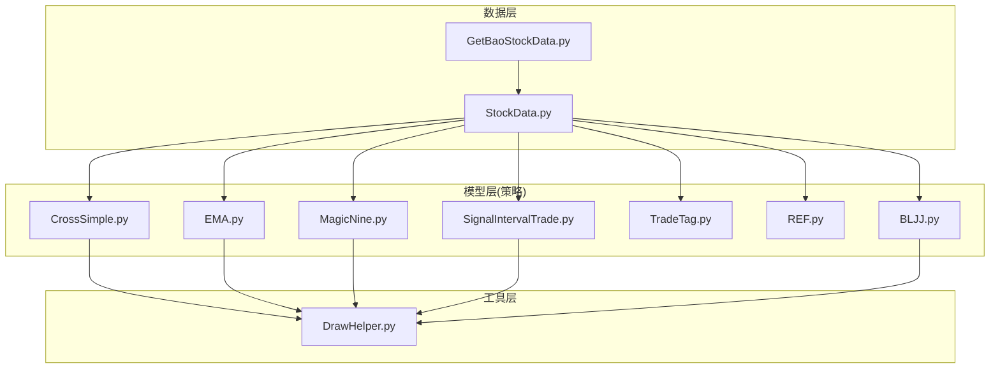
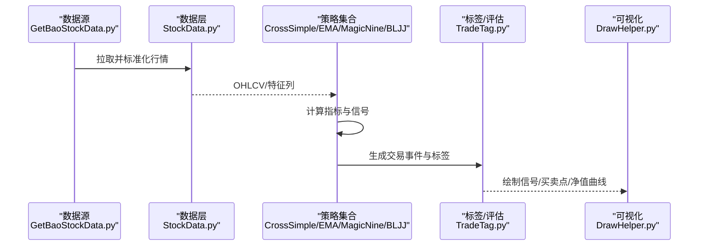
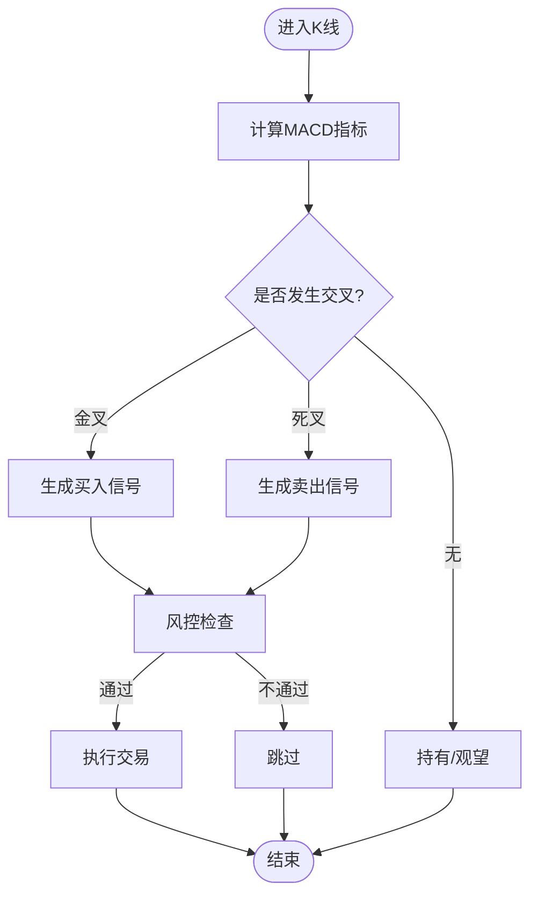
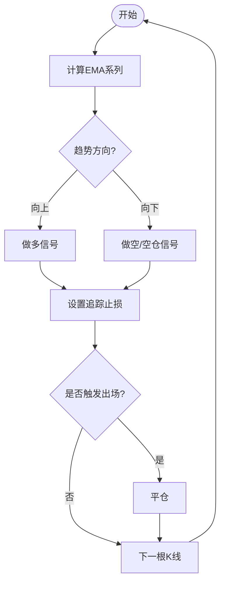
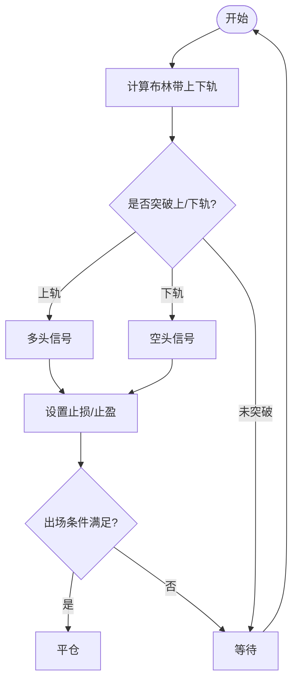
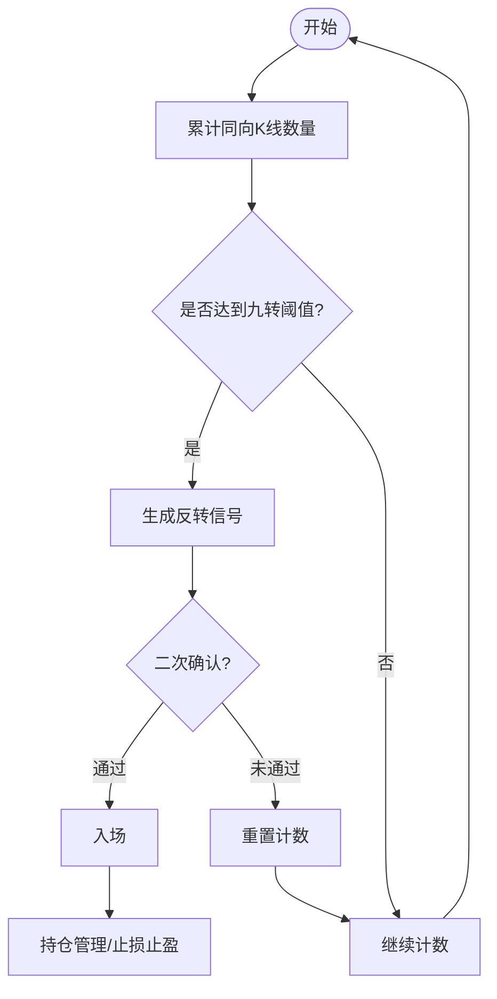
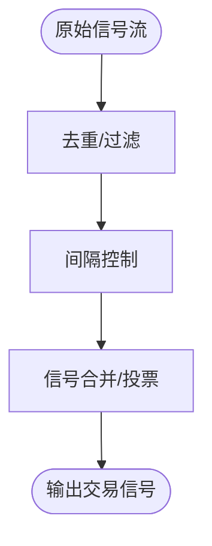
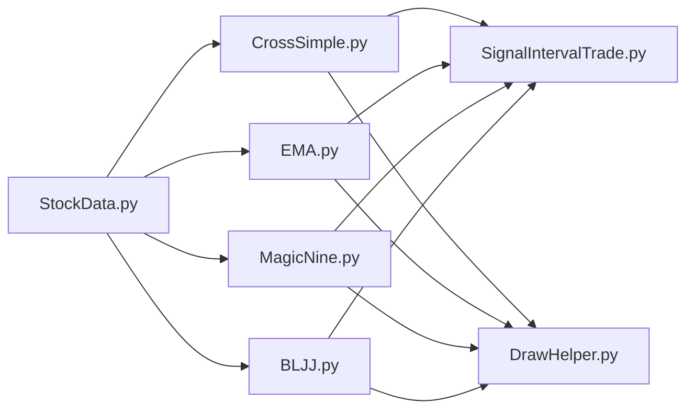

# 交易策略系统

<cite>
**本文引用的文件**   
- [MyProject/Model/Strategy/CrossSimple.py](file://MyProject/Model/Strategy/CrossSimple.py)
- [MyProject/Model/Strategy/EMA.py](file://MyProject/Model/Strategy/EMA.py)
- [MyProject/Model/Strategy/MagicNine.py](file://MyProject/Model/Strategy/MagicNine.py)
- [MyProject/Model/Strategy/SignalIntervalTrade.py](file://MyProject/Model/Strategy/SignalIntervalTrade.py)
- [MyProject/Model/Strategy/TradeTag.py](file://MyProject/Model/Strategy/TradeTag.py)
- [MyProject/Model/Strategy/REF.py](file://MyProject/Model/Strategy/REF.py)
- [MyProject/Model/Strategy/BLJJ.py](file://MyProject/Model/Strategy/BLJJ.py)
- [MyProject/DataBase/StockData.py](file://MyProject/DataBase/StockData.py)
- [MyProject/Helper/DrawHelper.py](file://MyProject/Helper/DrawHelper.py)
- [GetBaoStockData.py](file://GetBaoStockData.py)
</cite>

## 目录
1. [简介](#简介)
2. [项目结构](#项目结构)
3. [核心组件](#核心组件)
4. [架构总览](#架构总览)
5. [详细组件分析](#详细组件分析)
6. [依赖关系分析](#依赖关系分析)
7. [性能与回测评估](#性能与回测评估)
8. [参数调优与最佳实践](#参数调优与最佳实践)
9. [故障排查指南](#故障排查指南)
10. [结论](#结论)
11. [附录：自定义策略开发示例](#附录自定义策略开发示例)

## 简介
本文件面向交易策略系统的开发者与使用者，系统性梳理技术分析策略的实现原理、信号生成机制、入场出场条件与风险管理规则；阐述策略回测框架的设计思路与常用评估指标；提供参数调优方法与最佳实践；并给出在现有代码库中扩展自定义策略的集成路径。文档覆盖MACD交叉、EMA趋势跟踪、布林带突破、九转序列等典型策略，以及策略组合、动态调参与实盘注意事项。

## 项目结构
仓库采用“数据-工具-模型（策略）”分层组织方式：
- 数据层：行情与标的池数据获取与存储
- 工具层：绘图、日志、CSV/SQLite辅助
- 模型层：策略实现与标签构建、训练数据准备

图表来源
- [MyProject/DataBase/StockData.py](file://MyProject/DataBase/StockData.py)
- [GetBaoStockData.py](file://GetBaoStockData.py)
- [MyProject/Model/Strategy/CrossSimple.py](file://MyProject/Model/Strategy/CrossSimple.py)
- [MyProject/Model/Strategy/EMA.py](file://MyProject/Model/Strategy/EMA.py)
- [MyProject/Model/Strategy/MagicNine.py](file://MyProject/Model/Strategy/MagicNine.py)
- [MyProject/Model/Strategy/SignalIntervalTrade.py](file://MyProject/Model/Strategy/SignalIntervalTrade.py)
- [MyProject/Model/Strategy/TradeTag.py](file://MyProject/Model/Strategy/TradeTag.py)
- [MyProject/Model/Strategy/REF.py](file://MyProject/Model/Strategy/Strategy/REF.py)
- [MyProject/Model/Strategy/BLJJ.py](file://MyProject/Model/Strategy/BLJJ.py)
- [MyProject/Helper/DrawHelper.py](file://MyProject/Helper/DrawHelper.py)

章节来源
- [MyProject/DataBase/StockData.py](file://MyProject/DataBase/StockData.py)
- [GetBaoStockData.py](file://GetBaoStockData.py)
- [MyProject/Helper/DrawHelper.py](file://MyProject/Helper/DrawHelper.py)

## 核心组件
- 数据接入与预处理
  - 通过外部接口拉取行情数据，统一清洗、对齐时间戳，输出标准OHLCV格式供策略消费。
  - 关键职责：数据源适配、缺失值处理、复权处理、频率转换。
- 策略引擎
  - 以“指标计算 + 信号判定 + 交易记录”为主线，支持多周期、多标的并行回测。
  - 关键职责：指标流水线、信号合并、订单生成、滑点与手续费模拟、持仓管理。
- 标签与评估
  - 基于信号与价格路径生成交易标签，用于后续机器学习或统计评估。
  - 关键职责：持有期收益、胜率、盈亏比、最大回撤、夏普比率等指标计算。
- 可视化与调试
  - 将信号、买卖点、指标曲线绘制到同一图表，便于人工校验与复盘。

章节来源
- [MyProject/DataBase/StockData.py](file://MyProject/DataBase/StockData.py)
- [MyProject/Model/Strategy/TradeTag.py](file://MyProject/Model/Strategy/TradeTag.py)
- [MyProject/Helper/DrawHelper.py](file://MyProject/Helper/DrawHelper.py)

## 架构总览
整体采用“数据→指标→信号→交易→评估→可视化”的流水线式架构，各模块松耦合，便于替换与扩展。

图表来源
- [GetBaoStockData.py](file://GetBaoStockData.py)
- [MyProject/DataBase/StockData.py](file://MyProject/DataBase/StockData.py)
- [MyProject/Model/Strategy/CrossSimple.py](file://MyProject/Model/Strategy/CrossSimple.py)
- [MyProject/Model/Strategy/EMA.py](file://MyProject/Model/Strategy/EMA.py)
- [MyProject/Model/Strategy/MagicNine.py](file://MyProject/Model/Strategy/MagicNine.py)
- [MyProject/Model/Strategy/BLJJ.py](file://MyProject/Model/Strategy/BLJJ.py)
- [MyProject/Model/Strategy/TradeTag.py](file://MyProject/Model/Strategy/TradeTag.py)
- [MyProject/Helper/DrawHelper.py](file://MyProject/Helper/DrawHelper.py)

## 详细组件分析

### MACD交叉策略（CrossSimple）
- 设计要点
  - 使用快慢均线差值与信号线进行金叉/死叉判定，作为多头/空头信号。
  - 可叠加成交量过滤或波动率阈值以降低假信号。
- 信号生成
  - 金叉：短期动量上穿长期动量，视为买入信号。
  - 死叉：短期动量下穿长期动量，视为卖出信号。
- 入场/出场
  - 入场：金叉确认后开多；死叉确认后平仓或反手做空（视策略配置）。
  - 出场：反向信号触发、固定止损止盈、或时间止损。
- 风险管理
  - 单笔风险比例、移动止损、波动率自适应仓位。
- 适用场景
  - 趋势中期波段、震荡市需配合过滤条件。

图表来源
- [MyProject/Model/Strategy/CrossSimple.py](file://MyProject/Model/Strategy/CrossSimple.py)

章节来源
- [MyProject/Model/Strategy/CrossSimple.py](file://MyProject/Model/Strategy/CrossSimple.py)

### EMA趋势跟踪策略（EMA）
- 设计要点
  - 利用指数移动平均线的斜率与相对位置判断趋势方向。
  - 可结合双EMA或多EMA层级形成趋势强度评分。
- 信号生成
  - 短EMA上穿长EMA且斜率为正：做多；反之做空或空仓。
- 入场/出场
  - 入场：趋势确认后的回调买点或突破位。
  - 出场：趋势反转信号、追踪止损、或目标收益。
- 风险管理
  - ATR追踪止损、分批建仓/减仓、趋势强度加权仓位。
- 适用场景
  - 中长期趋势行情，震荡市易产生反复止损。

图表来源
- [MyProject/Model/Strategy/EMA.py](file://MyProject/Model/Strategy/EMA.py)

章节来源
- [MyProject/Model/Strategy/EMA.py](file://MyProject/Model/Strategy/EMA.py)

### 布林带突破策略（BLJJ）
- 设计要点
  - 基于均值±倍标准差形成的通道，捕捉价格突破上轨/下轨的动能。
  - 常配合带宽变化识别波动率扩张/收缩。
- 信号生成
  - 收盘价突破上轨：看多；跌破下轨：看空。
  - 带宽收窄后放量突破更具参考价值。
- 入场/出场
  - 入场：突破确认（如收盘站稳）；出场：回归中轨或反向突破。
- 风险管理
  - 突破失败止损、波动率自适应仓位、假突破过滤（成交量/时间窗口）。
- 适用场景
  - 高波动品种的趋势启动阶段。

图表来源
- [MyProject/Model/Strategy/BLJJ.py](file://MyProject/Model/Strategy/BLJJ.py)

章节来源
- [MyProject/Model/Strategy/BLJJ.py](file://MyProject/Model/Strategy/BLJJ.py)

### 九转序列策略（MagicNine）
- 设计要点
  - 依据连续N根K线收盘价相对前序某参考价的单调性计数，达到阈值时提示潜在转折。
- 信号生成
  - 上升九转完成：看空信号；下降九转完成：看多信号。
- 入场/出场
  - 入场：序列完成后配合次级确认（如小级别反转形态）。
  - 出场：反向序列出现或固定止损止盈。
- 风险管理
  - 强趋势中九转可能失效，需结合趋势过滤器。
- 适用场景
  - 震荡偏反转环境，配合趋势过滤效果更佳。

图表来源
- [MyProject/Model/Strategy/MagicNine.py](file://MyProject/Model/Strategy/MagicNine.py)

章节来源
- [MyProject/Model/Strategy/MagicNine.py](file://MyProject/Model/Strategy/MagicNine.py)

### 信号间隔与交易控制（SignalIntervalTrade）
- 设计要点
  - 对原始信号进行去噪与节流，避免频繁交易。
  - 可加入冷却时间、最小交易间隔、信号一致性投票。
- 功能
  - 信号合并、重复信号过滤、跨周期信号对齐。
- 适用场景
  - 任何高频信号策略的后置处理器。

图表来源
- [MyProject/Model/Strategy/SignalIntervalTrade.py](file://MyProject/Model/Strategy/SignalIntervalTrade.py)

章节来源
- [MyProject/Model/Strategy/SignalIntervalTrade.py](file://MyProject/Model/Strategy/SignalIntervalTrade.py)

### 参考与标签（REF、TradeTag）
- REF
  - 提供引用类函数或通用参考逻辑，便于其他策略复用。
- TradeTag
  - 根据交易事件与价格路径生成标签，用于回测评估或机器学习训练。
  - 包含持有期收益、胜率、盈亏比、回撤等统计字段。

章节来源
- [MyProject/Model/Strategy/REF.py](file://MyProject/Model/Strategy/REF.py)
- [MyProject/Model/Strategy/TradeTag.py](file://MyProject/Model/Strategy/TradeTag.py)

## 依赖关系分析
- 数据依赖
  - 所有策略均依赖标准化的OHLCV数据，由数据层统一提供。
- 工具依赖
  - 绘图模块用于可视化信号与净值曲线，便于调试与展示。
- 策略间关系
  - 信号节流器可作为通用后置模块，被多个策略共用。

图表来源
- [MyProject/DataBase/StockData.py](file://MyProject/DataBase/StockData.py)
- [MyProject/Model/Strategy/CrossSimple.py](file://MyProject/Model/Strategy/CrossSimple.py)
- [MyProject/Model/Strategy/EMA.py](file://MyProject/Model/Strategy/EMA.py)
- [MyProject/Model/Strategy/MagicNine.py](file://MyProject/Model/Strategy/MagicNine.py)
- [MyProject/Model/Strategy/BLJJ.py](file://MyProject/Model/Strategy/BLJJ.py)
- [MyProject/Model/Strategy/SignalIntervalTrade.py](file://MyProject/Model/Strategy/SignalIntervalTrade.py)
- [MyProject/Helper/DrawHelper.py](file://MyProject/Helper/DrawHelper.py)

章节来源
- [MyProject/DataBase/StockData.py](file://MyProject/DataBase/StockData.py)
- [MyProject/Helper/DrawHelper.py](file://MyProject/Helper/DrawHelper.py)

## 性能与回测评估
- 回测流程
  - 数据准备 → 指标计算 → 信号生成 → 交易撮合（含手续费/滑点） → 净值曲线 → 指标统计。
- 评估指标
  - 年化收益、最大回撤、夏普比率、索提诺比率、Calmar比率、胜率、盈亏比、交易次数、换手率。
- 稳健性检验
  - 样本外测试、滚动窗口回测、蒙特卡洛扰动、参数敏感性分析。
- 可视化
  - 信号图、买卖点标注、资金曲线、回撤区间、指标叠加图。

章节来源
- [MyProject/Model/Strategy/TradeTag.py](file://MyProject/Model/Strategy/TradeTag.py)
- [MyProject/Helper/DrawHelper.py](file://MyProject/Helper/DrawHelper.py)

## 参数调优与最佳实践
- 参数范围与网格搜索
  - 为每个策略定义合理参数空间，采用网格或随机搜索，结合交叉验证选择稳健参数。
- 过拟合防范
  - 限制参数复杂度、引入正则化思想（如平滑参数）、样本外验证。
- 动态调参
  - 基于市场状态（趋势/震荡、波动率高低）切换参数集或权重。
- 组合策略
  - 多策略信号融合（投票/加权），降低单一策略失效风险。
- 实战注意
  - 考虑流动性、冲击成本、涨跌停、停牌、分红除权等现实约束。

[本节为通用指导，无需具体文件来源]

## 故障排查指南
- 常见问题
  - 数据缺失或不齐：检查时间索引对齐与复权处理。
  - 信号过于频繁：启用信号间隔模块或增加过滤条件。
  - 回测收益异常：核对手续费、滑点、成交规则与资金曲线计算。
  - 绘图异常：确认数据长度与坐标轴范围。
- 定位方法
  - 分步打印中间变量（指标、信号、订单）。
  - 缩小样本至单只股票与短时间窗口快速验证。
  - 使用可视化对比不同参数下的信号差异。

章节来源
- [MyProject/Model/Strategy/SignalIntervalTrade.py](file://MyProject/Model/Strategy/SignalIntervalTrade.py)
- [MyProject/Helper/DrawHelper.py](file://MyProject/Helper/DrawHelper.py)

## 结论
本系统以模块化方式实现了多种经典技术指标策略，并通过统一的信号节流与标签评估模块，形成从数据到决策再到可视化的完整闭环。建议在实盘前充分进行样本外检验与压力测试，结合动态调参与组合策略提升稳健性。

[本节为总结性内容，无需具体文件来源]

## 附录：自定义策略开发示例
- 步骤概览
  - 新建策略文件：在策略目录下新增Python文件，定义指标计算与信号生成逻辑。
  - 接入数据：读取标准化OHLCV数据，确保时间戳对齐。
  - 生成信号：输出每根K线的买卖信号或持仓状态。
  - 集成回测：将新策略接入回测主循环，与其他策略并列运行。
  - 可视化：调用绘图模块输出信号与净值曲线。
- 参考路径
  - 参考现有策略结构与命名约定，保持接口一致以便统一调度。
  - 使用信号节流模块对原始信号进行后处理，减少噪音。
  - 使用标签模块生成评估所需字段，便于横向比较。

章节来源
- [MyProject/Model/Strategy/CrossSimple.py](file://MyProject/Model/Strategy/CrossSimple.py)
- [MyProject/Model/Strategy/EMA.py](file://MyProject/Model/Strategy/EMA.py)
- [MyProject/Model/Strategy/MagicNine.py](file://MyProject/Model/Strategy/MagicNine.py)
- [MyProject/Model/Strategy/BLJJ.py](file://MyProject/Model/Strategy/BLJJ.py)
- [MyProject/Model/Strategy/SignalIntervalTrade.py](file://MyProject/Model/Strategy/SignalIntervalTrade.py)
- [MyProject/Model/Strategy/TradeTag.py](file://MyProject/Model/Strategy/TradeTag.py)
- [MyProject/Helper/DrawHelper.py](file://MyProject/Helper/DrawHelper.py)