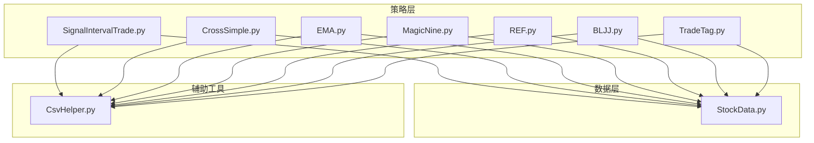
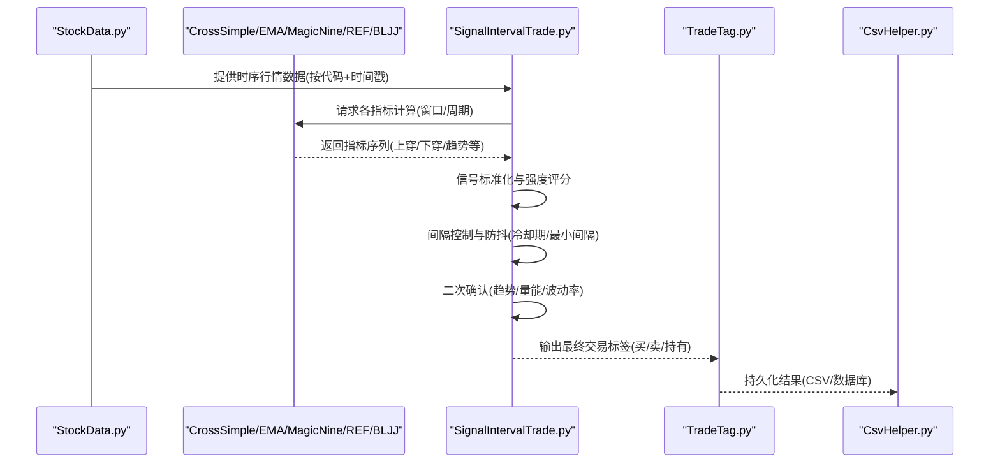
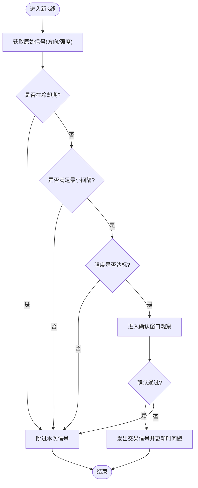
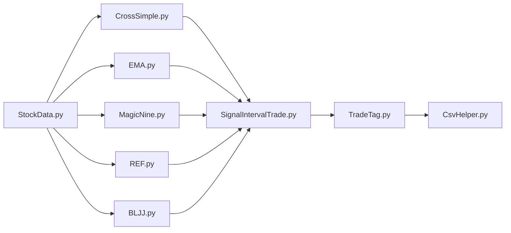

# 信号生成机制

<cite>
**本文引用的文件**   
- [SignalIntervalTrade.py](file://MyProject/Model/Strategy/SignalIntervalTrade.py)
- [CrossSimple.py](file://MyProject/Model/Strategy/CrossSimple.py)
- [EMA.py](file://MyProject/Model/Strategy/EMA.py)
- [MagicNine.py](file://MyProject/Model/Strategy/MagicNine.py)
- [REF.py](file://MyProject/Model/Strategy/REF.py)
- [BLJJ.py](file://MyProject/Model/Strategy/BLJJ.py)
- [TradeTag.py](file://MyProject/Model/Strategy/TradeTag.py)
- [StockData.py](file://MyProject/DataBase/StockData.py)
- [CsvHelper.py](file://MyProject/Helper/CsvHelper.py)
</cite>

## 目录
1. [简介](#简介)
2. [项目结构](#项目结构)
3. [核心组件](#核心组件)
4. [架构总览](#架构总览)
5. [详细组件分析](#详细组件分析)
6. [依赖关系分析](#依赖关系分析)
7. [性能考虑](#性能考虑)
8. [故障排查指南](#故障排查指南)
9. [结论](#结论)
10. [附录](#附录)

## 简介
本文件围绕“信号生成机制”展开，聚焦于交易信号的生成算法与过滤逻辑、技术指标融合方法、时间窗口处理、信号强度评估、信号间隔控制（防抖）、信号确认流程、与股票数据的关联方式以及实时信号更新机制。同时提供信号质量评估指标与优化建议，并给出参数配置示例路径，帮助读者快速落地与调优。

## 项目结构
本项目采用分层组织：策略层位于 Model/Strategy，数据层位于 DataBase，辅助工具位于 Helper。信号生成主要分布在策略模块中，并通过数据模块获取行情数据，借助辅助工具进行读写与可视化。

图表来源
- [SignalIntervalTrade.py](file://MyProject/Model/Strategy/SignalIntervalTrade.py)
- [CrossSimple.py](file://MyProject/Model/Strategy/CrossSimple.py)
- [EMA.py](file://MyProject/Model/Strategy/EMA.py)
- [MagicNine.py](file://MyProject/Model/Strategy/MagicNine.py)
- [REF.py](file://MyProject/Model/Strategy/REF.py)
- [BLJJ.py](file://MyProject/Model/Strategy/BLJJ.py)
- [TradeTag.py](file://MyProject/Model/Strategy/TradeTag.py)
- [StockData.py](file://MyProject/DataBase/StockData.py)
- [CsvHelper.py](file://MyProject/Helper/CsvHelper.py)

章节来源
- [SignalIntervalTrade.py](file://MyProject/Model/Strategy/SignalIntervalTrade.py)
- [CrossSimple.py](file://MyProject/Model/Strategy/CrossSimple.py)
- [EMA.py](file://MyProject/Model/Strategy/EMA.py)
- [MagicNine.py](file://MyProject/Model/Strategy/MagicNine.py)
- [REF.py](file://MyProject/Model/Strategy/REF.py)
- [BLJJ.py](file://MyProject/Model/Strategy/BLJJ.py)
- [TradeTag.py](file://MyProject/Model/Strategy/TradeTag.py)
- [StockData.py](file://MyProject/DataBase/StockData.py)
- [CsvHelper.py](file://MyProject/Helper/CsvHelper.py)

## 核心组件
- 信号间隔控制与防抖：通过统一的间隔控制策略对原始信号进行去重与冷却，避免频繁交易。
- 多指标融合：将交叉类、均线类、形态类等指标输出统一为标准化信号，再进行加权或投票融合。
- 时间窗口处理：基于滑动窗口计算指标与信号强度，支持不同频率的输入序列。
- 信号确认流程：引入二次确认条件（如趋势延续、量能配合）降低假信号。
- 与数据关联：以股票代码为键，按时间戳对齐K线数据，保证信号与行情的时序一致性。
- 实时更新：增量计算最新K线的指标与信号，仅刷新受影响的时间点。

章节来源
- [SignalIntervalTrade.py](file://MyProject/Model/Strategy/SignalIntervalTrade.py)
- [CrossSimple.py](file://MyProject/Model/Strategy/CrossSimple.py)
- [EMA.py](file://MyProject/Model/Strategy/EMA.py)
- [MagicNine.py](file://MyProject/Model/Strategy/MagicNine.py)
- [REF.py](file://MyProject/Model/Strategy/REF.py)
- [BLJJ.py](file://MyProject/Model/Strategy/BLJJ.py)
- [TradeTag.py](file://MyProject/Model/Strategy/TradeTag.py)
- [StockData.py](file://MyProject/DataBase/StockData.py)
- [CsvHelper.py](file://MyProject/Helper/CsvHelper.py)

## 架构总览
下图展示了从数据读取到信号生成的端到端流程，包括指标计算、信号融合、间隔控制与确认流程。

图表来源
- [StockData.py](file://MyProject/DataBase/StockData.py)
- [CrossSimple.py](file://MyProject/Model/Strategy/CrossSimple.py)
- [EMA.py](file://MyProject/Model/Strategy/EMA.py)
- [MagicNine.py](file://MyProject/Model/Strategy/MagicNine.py)
- [REF.py](file://MyProject/Model/Strategy/REF.py)
- [BLJJ.py](file://MyProject/Model/Strategy/BLJJ.py)
- [SignalIntervalTrade.py](file://MyProject/Model/Strategy/SignalIntervalTrade.py)
- [TradeTag.py](file://MyProject/Model/Strategy/TradeTag.py)
- [CsvHelper.py](file://MyProject/Helper/CsvHelper.py)

## 详细组件分析

### 信号间隔控制与防抖（SignalIntervalTrade）
- 目标：在原始信号基础上施加最小交易间隔与冷却期，抑制震荡市中的高频反转信号。
- 关键逻辑要点：
  - 维护最近一次交易时间与类型，用于判断是否满足最小间隔。
  - 对连续反向信号进行合并或丢弃，避免来回切换。
  - 可选加入“信号强度阈值”，仅在强度超过阈值时允许触发。
  - 支持“确认窗口”：在触发后若干周期内观察后续信号是否一致，再决定是否执行。
- 复杂度：O(N)，N为K线数量；空间O(1)额外状态。
- 可配置项：最小间隔周期、冷却期、强度阈值、确认窗口长度。

图表来源
- [SignalIntervalTrade.py](file://MyProject/Model/Strategy/SignalIntervalTrade.py)

章节来源
- [SignalIntervalTrade.py](file://MyProject/Model/Strategy/SignalIntervalTrade.py)

### 交叉类信号（CrossSimple）
- 用途：检测两条指标的交叉（如快慢线、价格与均线），产生方向性信号。
- 关键点：
  - 前一刻与当前时刻的相对位置变化决定上穿/下穿。
  - 可叠加平滑滤波以减少噪声导致的频繁交叉。
  - 可与成交量或波动率结合做二次过滤。
- 适用场景：趋势跟随与均值回归策略的基础构件。

章节来源
- [CrossSimple.py](file://MyProject/Model/Strategy/CrossSimple.py)

### 均线类信号（EMA）
- 用途：基于指数移动平均的趋势跟踪，常用短中长期组合形成多头/空头排列。
- 关键点：
  - EMA对近期价格更敏感，适合捕捉短期趋势转折。
  - 多周期EMA组合可构建趋势强度与斜率特征。
  - 可结合ATR或波动率动态调整周期或阈值。
- 融合方式：与交叉信号联合使用，提升稳定性。

章节来源
- [EMA.py](file://MyProject/Model/Strategy/EMA.py)

### 形态/规则类信号（MagicNine、REF、BLJJ）
- MagicNine：基于特定形态或规则集的组合信号，常用于识别阶段性拐点。
- REF：参考历史值或基准线（如昨日收盘、固定阈值）进行对比判断。
- BLJJ：自定义规则或指标组合，可能包含量价关系、支撑阻力等。
- 共同点：均为可插拔的信号源，便于与通用融合框架集成。

章节来源
- [MagicNine.py](file://MyProject/Model/Strategy/MagicNine.py)
- [REF.py](file://MyProject/Model/Strategy/REF.py)
- [BLJJ.py](file://MyProject/Model/Strategy/BLJJ.py)

### 标签生成与持久化（TradeTag）
- 职责：将最终信号映射为交易标签（买入/卖出/持有），并写入存储。
- 关键点：
  - 与间隔控制后的信号一一对应，确保时序一致。
  - 支持批量写入与追加模式，便于回测与在线运行。
  - 可与CSV助手协作完成落盘。

章节来源
- [TradeTag.py](file://MyProject/Model/Strategy/TradeTag.py)
- [CsvHelper.py](file://MyProject/Helper/CsvHelper.py)

### 数据接入与时序对齐（StockData）
- 职责：提供按股票代码与时间戳组织的行情数据，供策略计算。
- 关键点：
  - 保证时间戳单调递增与缺失值处理（填充/剔除）。
  - 支持增量拉取与本地缓存，减少重复IO。
  - 与信号输出保持严格的时间对齐，避免未来函数。

章节来源
- [StockData.py](file://MyProject/DataBase/StockData.py)

## 依赖关系分析
- 松耦合设计：各指标策略独立实现，通过统一接口输出标准化信号，由间隔控制与融合模块聚合。
- 数据依赖：所有策略依赖 StockData 提供的时序数据；输出经 TradeTag 持久化，必要时借助 CsvHelper。
- 潜在循环：无直接循环依赖；若扩展需确保新增模块不引入环状引用。

图表来源
- [StockData.py](file://MyProject/DataBase/StockData.py)
- [CrossSimple.py](file://MyProject/Model/Strategy/CrossSimple.py)
- [EMA.py](file://MyProject/Model/Strategy/EMA.py)
- [MagicNine.py](file://MyProject/Model/Strategy/MagicNine.py)
- [REF.py](file://MyProject/Model/Strategy/REF.py)
- [BLJJ.py](file://MyProject/Model/Strategy/BLJJ.py)
- [SignalIntervalTrade.py](file://MyProject/Model/Strategy/SignalIntervalTrade.py)
- [TradeTag.py](file://MyProject/Model/Strategy/TradeTag.py)
- [CsvHelper.py](file://MyProject/Helper/CsvHelper.py)

章节来源
- [StockData.py](file://MyProject/DataBase/StockData.py)
- [SignalIntervalTrade.py](file://MyProject/Model/Strategy/SignalIntervalTrade.py)
- [TradeTag.py](file://MyProject/Model/Strategy/TradeTag.py)
- [CsvHelper.py](file://MyProject/Helper/CsvHelper.py)

## 性能考虑
- 向量化计算：优先使用数组/矩阵运算替代逐条循环，降低Python解释器开销。
- 增量更新：仅对最新K线重新计算受影响的指标，避免全量重算。
- 内存管理：大样本滚动窗口采用环形缓冲或滑动窗口数据结构，限制峰值内存。
- I/O优化：批量写入CSV/数据库，减少频繁磁盘操作。
- 并行化：多股票并行计算，注意线程安全与资源隔离。

[本节为通用指导，无需源码引用]

## 故障排查指南
- 常见问题
  - 信号过于频繁：检查最小间隔与冷却期设置，适当提高强度阈值。
  - 信号滞后明显：缩短EMA周期或放宽交叉判定容差，但需警惕噪声。
  - 时序错乱：核对时间戳排序与缺失值处理，确保无未来函数。
  - 写入失败：检查CSV路径权限与格式，确认字段名与数据类型一致。
- 定位步骤
  - 打印中间指标序列与原始信号，逐步缩小问题范围。
  - 对单只股票进行回放验证，复现问题后再扩展到全市场。
  - 记录关键参数与版本信息，便于回溯。

章节来源
- [SignalIntervalTrade.py](file://MyProject/Model/Strategy/SignalIntervalTrade.py)
- [TradeTag.py](file://MyProject/Model/Strategy/TradeTag.py)
- [CsvHelper.py](file://MyProject/Helper/CsvHelper.py)

## 结论
本信号生成机制以模块化指标为基础，通过标准化、融合、间隔控制与二次确认，构建了稳健的交易信号流水线。合理的参数配置与持续的质量评估是提升实战表现的关键。建议在回测环境中系统性地扫描参数空间，并结合样本外检验与交易成本约束进行优化。

[本节为总结性内容，无需源码引用]

## 附录

### 参数配置示例（路径指引）
- 信号间隔与防抖
  - 最小间隔周期、冷却期、强度阈值、确认窗口长度
  - 参考路径：[SignalIntervalTrade.py](file://MyProject/Model/Strategy/SignalIntervalTrade.py)
- 交叉类指标
  - 快慢线周期、平滑系数、交叉容差
  - 参考路径：[CrossSimple.py](file://MyProject/Model/Strategy/CrossSimple.py)
- 均线类指标
  - EMA周期、多周期组合、斜率阈值
  - 参考路径：[EMA.py](file://MyProject/Model/Strategy/EMA.py)
- 形态/规则类
  - 形态定义、参考基准、规则权重
  - 参考路径：[MagicNine.py](file://MyProject/Model/Strategy/MagicNine.py)、[REF.py](file://MyProject/Model/Strategy/REF.py)、[BLJJ.py](file://MyProject/Model/Strategy/BLJJ.py)
- 标签与输出
  - 标签映射、写入路径、追加/覆盖模式
  - 参考路径：[TradeTag.py](file://MyProject/Model/Strategy/TradeTag.py)、[CsvHelper.py](file://MyProject/Helper/CsvHelper.py)

### 信号质量评估指标
- 胜率与盈亏比：衡量单次交易的期望收益。
- 最大回撤与夏普比率：评估风险调整后收益。
- 换手率与滑点损耗：反映交易成本对净收益的影响。
- 信号延迟与命中率：评估信号及时性与准确性。
- 区间稳定性：在不同市场环境下的鲁棒性。

[本节为通用指导，无需源码引用]

### 信号优化方法
- 参数搜索：网格/随机/贝叶斯优化，结合交叉验证与样本外测试。
- 特征工程：引入波动率、成交量、宏观因子作为过滤器或强度权重。
- 自适应机制：根据波动率或趋势强度动态调整周期与阈值。
- 集成学习：多策略信号投票或加权融合，降低单一策略过拟合风险。
- 成本控制：纳入手续费、滑点与冲击成本，优化实际收益。

[本节为通用指导，无需源码引用]