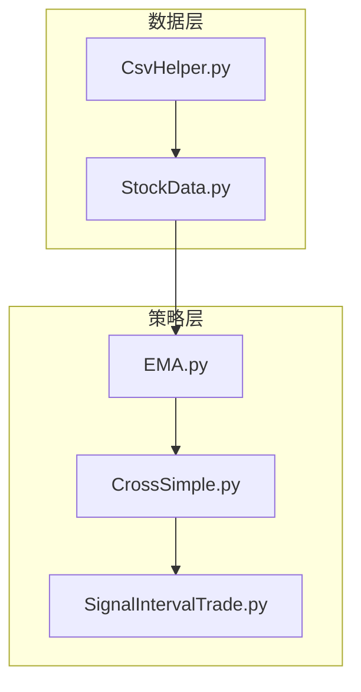
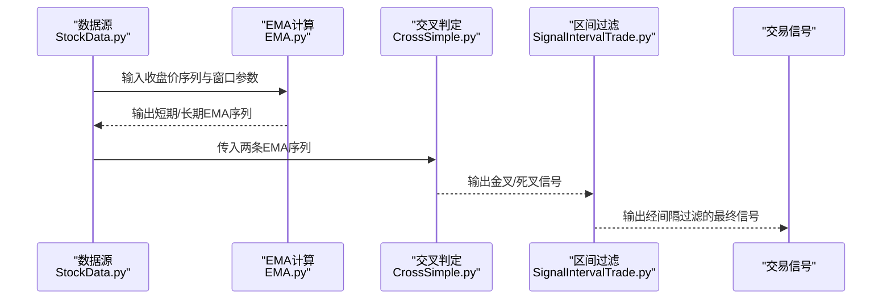
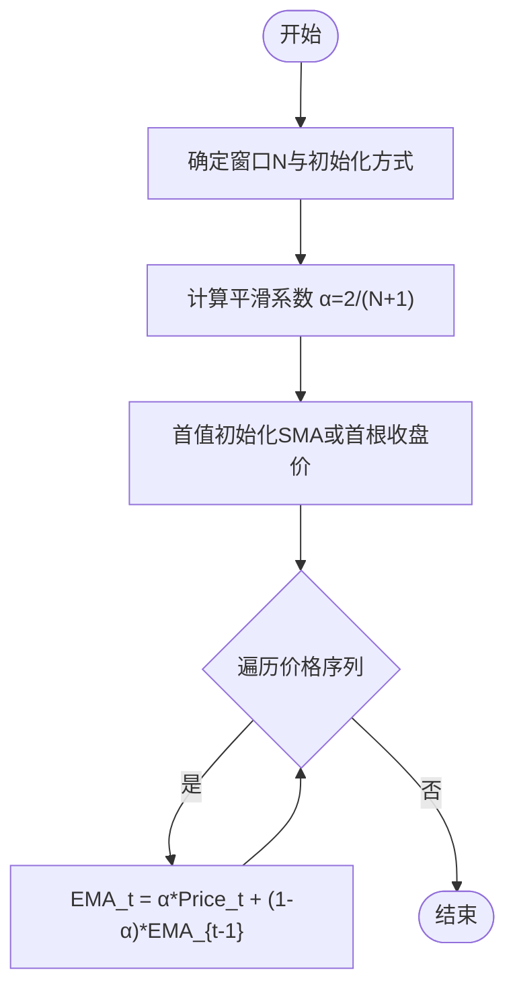
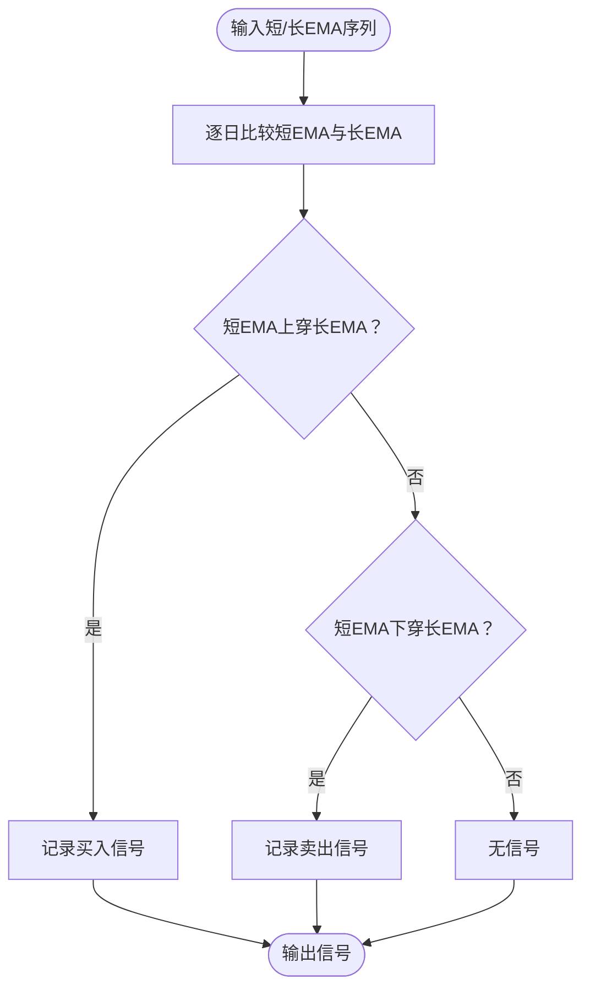
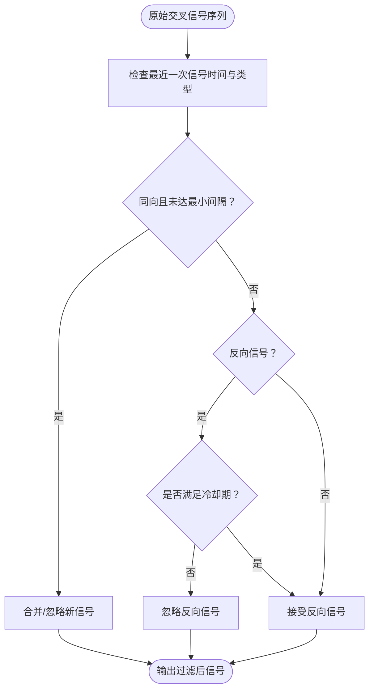
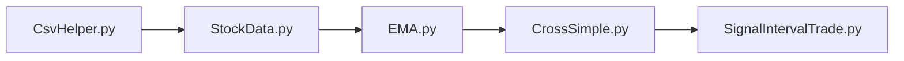

# EMA趋势跟踪策略

<cite>
**本文引用的文件**   
- [EMA.py](file://MyProject/Model/Strategy/EMA.py)
- [CrossSimple.py](file://MyProject/Model/Strategy/CrossSimple.py)
- [SignalIntervalTrade.py](file://MyProject/Model/Strategy/SignalIntervalTrade.py)
- [StockData.py](file://MyProject/DataBase/StockData.py)
- [CsvHelper.py](file://MyProject/Helper/CsvHelper.py)
</cite>

## 目录
1. [简介](#简介)
2. [项目结构](#项目结构)
3. [核心组件](#核心组件)
4. [架构总览](#架构总览)
5. [详细组件分析](#详细组件分析)
6. [依赖关系分析](#依赖关系分析)
7. [性能与参数优化](#性能与参数优化)
8. [故障排查指南](#故障排查指南)
9. [结论](#结论)
10. [附录](#附录)

## 简介
本文件围绕EMA（指数平滑移动平均）趋势跟踪策略，结合仓库中现有实现，系统阐述：
- EMA相比SMA的优势、计算方法、平滑系数与权重分配机制
- 多周期EMA组合的趋势判断逻辑与灵敏度控制
- 实战案例：价格突破与均线排列的组合信号生成
- 参数优化方法与回测性能分析要点
- 最佳实践建议，帮助开发者快速落地并迭代策略

## 项目结构
本项目采用分层组织方式：
- 数据层：负责行情数据的读取与预处理
- 策略层：封装技术指标计算与交易信号生成
- 辅助工具：CSV读写、绘图、日志等通用能力

图表来源
- [StockData.py](file://MyProject/DataBase/StockData.py)
- [CsvHelper.py](file://MyProject/Helper/CsvHelper.py)
- [EMA.py](file://MyProject/Model/Strategy/EMA.py)
- [CrossSimple.py](file://MyProject/Model/Strategy/CrossSimple.py)
- [SignalIntervalTrade.py](file://MyProject/Model/Strategy/SignalIntervalTrade.py)

章节来源
- [EMA.py](file://MyProject/Model/Strategy/EMA.py)
- [CrossSimple.py](file://MyProject/Model/Strategy/CrossSimple.py)
- [SignalIntervalTrade.py](file://MyProject/Model/Strategy/SignalIntervalTrade.py)
- [StockData.py](file://MyProject/DataBase/StockData.py)
- [CsvHelper.py](file://MyProject/Helper/CsvHelper.py)

## 核心组件
- EMA指标计算：提供单条序列的EMA计算接口，支持不同窗口长度与初始化方式
- 交叉信号：基于两条均线的金叉/死叉判定
- 区间过滤：在信号基础上增加时间或事件间隔约束，降低频繁交易

章节来源
- [EMA.py](file://MyProject/Model/Strategy/EMA.py)
- [CrossSimple.py](file://MyProject/Model/Strategy/CrossSimple.py)
- [SignalIntervalTrade.py](file://MyProject/Model/Strategy/SignalIntervalTrade.py)

## 架构总览
整体流程从原始K线数据出发，依次计算短期与长期EMA，再根据交叉与排列条件产生买卖信号，最后通过区间过滤模块输出最终可执行信号。

图表来源
- [StockData.py](file://MyProject/DataBase/StockData.py)
- [EMA.py](file://MyProject/Model/Strategy/EMA.py)
- [CrossSimple.py](file://MyProject/Model/Strategy/CrossSimple.py)
- [SignalIntervalTrade.py](file://MyProject/Model/Strategy/SignalIntervalTrade.py)

## 详细组件分析

### EMA指标组件
- 功能职责
  - 计算给定窗口的EMA序列
  - 支持不同的初始化方式（如首值取SMA或首根收盘价）
  - 提供向量化或逐点更新两种模式（按实现选择）
- 关键概念
  - 平滑系数α：通常由窗口N决定，α=2/(N+1)，窗口越小α越大，对近期价格越敏感
  - 权重分配：距离当前越近的价格权重越高，呈指数衰减
  - 与SMA对比：SMA对历史等权处理，滞后较大；EMA对近期赋予更高权重，响应更快，适合趋势跟踪
- 复杂度与稳定性
  - 时间复杂度O(n)，空间复杂度O(1)（在线更新）或O(n)（全量数组）
  - 初始段存在“冷启动”偏差，可通过SMA预热或忽略前若干根

图表来源
- [EMA.py](file://MyProject/Model/Strategy/EMA.py)

章节来源
- [EMA.py](file://MyProject/Model/Strategy/EMA.py)

### 交叉信号组件
- 功能职责
  - 比较短期与长期EMA，识别金叉（短上穿长）与死叉（短下穿长）
  - 可选加入阈值或斜率过滤以减少假信号
- 使用场景
  - 作为基础趋势跟随信号
  - 与均线排列、波动率过滤等组合增强稳健性

图表来源
- [CrossSimple.py](file://MyProject/Model/Strategy/CrossSimple.py)

章节来源
- [CrossSimple.py](file://MyProject/Model/Strategy/CrossSimple.py)

### 区间过滤组件
- 功能职责
  - 对交叉信号施加时间或事件间隔约束，避免连续反向信号导致的频繁交易
  - 可配置最小持有期、冷却时间、最大交易次数等
- 典型规则
  - 相邻同向信号合并
  - 反向信号需满足一定间隔才生效
  - 结合ATR或波动率动态调整间隔

图表来源
- [SignalIntervalTrade.py](file://MyProject/Model/Strategy/SignalIntervalTrade.py)

章节来源
- [SignalIntervalTrade.py](file://MyProject/Model/Strategy/SignalIntervalTrade.py)

### 数据与工具组件
- StockData：提供行情数据加载、清洗与标准化接口，供策略层消费
- CsvHelper：CSV文件的读写与格式校验，便于批量回测与结果导出

章节来源
- [StockData.py](file://MyProject/DataBase/StockData.py)
- [CsvHelper.py](file://MyProject/Helper/CsvHelper.py)

## 依赖关系分析
- 低耦合设计：策略层仅依赖数据层的统一接口，便于替换数据源
- 信号链清晰：EMA→交叉→区间过滤，形成可插拔的信号流水线
- 外部依赖：主要依赖数值计算库（如pandas/numpy），便于向量化加速

图表来源
- [CsvHelper.py](file://MyProject/Helper/CsvHelper.py)
- [StockData.py](file://MyProject/DataBase/StockData.py)
- [EMA.py](file://MyProject/Model/Strategy/EMA.py)
- [CrossSimple.py](file://MyProject/Model/Strategy/CrossSimple.py)
- [SignalIntervalTrade.py](file://MyProject/Model/Strategy/SignalIntervalTrade.py)

章节来源
- [EMA.py](file://MyProject/Model/Strategy/EMA.py)
- [CrossSimple.py](file://MyProject/Model/Strategy/CrossSimple.py)
- [SignalIntervalTrade.py](file://MyProject/Model/Strategy/SignalIntervalTrade.py)
- [StockData.py](file://MyProject/DataBase/StockData.py)
- [CsvHelper.py](file://MyProject/Helper/CsvHelper.py)

## 性能与参数优化
- 参数含义与影响
  - 短期窗口N1：越小越灵敏，易受噪声干扰；越大越稳定但滞后明显
  - 长期窗口N2：用于定义趋势基准，N2/N1比值越大，趋势确认越强，但入场更晚
  - 平滑系数α：由窗口决定，α越大对近期价格越敏感
- 多周期组合建议
  - 双均线：N1=5~13，N2=20~60，适用于日线级别趋势跟踪
  - 三均线：短/中/长（如13/21/55），配合排列过滤提升胜率
- 实战信号组合
  - 价格突破：收盘价突破短期EMA或前高，叠加金叉确认
  - 均线排列：短>中>长为多头排列，反之为空头排列
  - 区间过滤：设置最小持有期与冷却期，降低震荡市损耗
- 参数优化方法
  - 网格搜索：在合理范围内枚举(N1,N2,冷却期)组合，以夏普比率、最大回撤、胜率为主要目标
  - 滚动窗口优化：按时间分片进行样本外验证，防止过拟合
  - 正则化思路：对过于敏感的窗口组合施加惩罚，优先选择稳健参数
- 回测要点
  - 滑点与手续费：务必计入交易成本
  - 资金曲线与风险指标：关注年化收益、夏普、索提诺、最大回撤、回撤持续时间
  - 样本内外一致性：确保参数在不同市场阶段表现稳定

[本节为通用指导，不直接分析具体文件]

## 故障排查指南
- 常见错误
  - 数据缺失或NaN导致EMA计算异常：需在数据层做前向填充或剔除无效日期
  - 冷启动偏差：前若干根EMA不稳定，建议在回测中忽略初始段或使用SMA预热
  - 过度交易：交叉过于频繁，应增大窗口或引入区间过滤与波动率阈值
  - 信号延迟：窗口过大导致入场过晚，可适当缩短短期窗口并结合价格突破
- 定位步骤
  - 打印关键序列：收盘价、短/长EMA、交叉信号、过滤后信号
  - 可视化诊断：绘制价格与均线、信号标记，观察金叉/死叉与价格行为的关系
  - 分段统计：按市场状态（趋势/震荡）分别评估胜率与盈亏比

章节来源
- [EMA.py](file://MyProject/Model/Strategy/EMA.py)
- [CrossSimple.py](file://MyProject/Model/Strategy/CrossSimple.py)
- [SignalIntervalTrade.py](file://MyProject/Model/Strategy/SignalIntervalTrade.py)

## 结论
- EMA相较SMA具备更快的响应速度与合理的权重分配，更适合趋势跟踪
- 通过短中长期EMA组合、价格突破与均线排列的多重确认，可显著提升信号质量
- 区间过滤与参数优化是控制交易频率与提升稳健性的关键
- 建议以滚动窗口与样本外验证为核心，持续迭代参数与过滤规则

[本节为总结性内容，不直接分析具体文件]

## 附录
- 术语表
  - SMA：简单移动平均
  - EMA：指数平滑移动平均
  - 金叉/死叉：短期均线上穿/下穿长期均线
  - 均线排列：多条均线按长短顺序排列，指示趋势方向
- 参考实现路径
  - EMA计算：[EMA.py](file://MyProject/Model/Strategy/EMA.py)
  - 交叉信号：[CrossSimple.py](file://MyProject/Model/Strategy/CrossSimple.py)
  - 区间过滤：[SignalIntervalTrade.py](file://MyProject/Model/Strategy/SignalIntervalTrade.py)
  - 数据与工具：[StockData.py](file://MyProject/DataBase/StockData.py)、[CsvHelper.py](file://MyProject/Helper/CsvHelper.py)