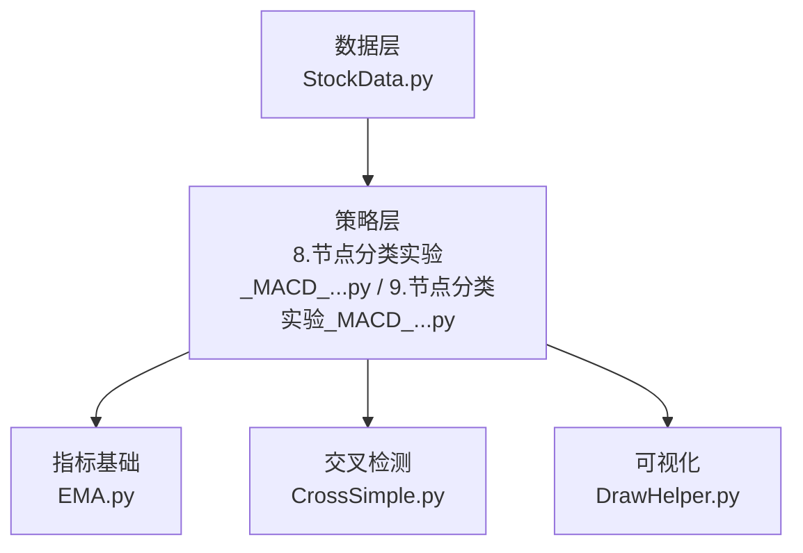
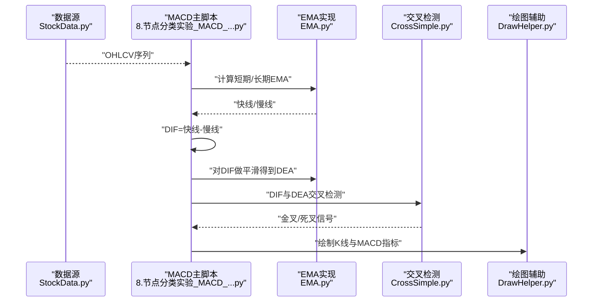
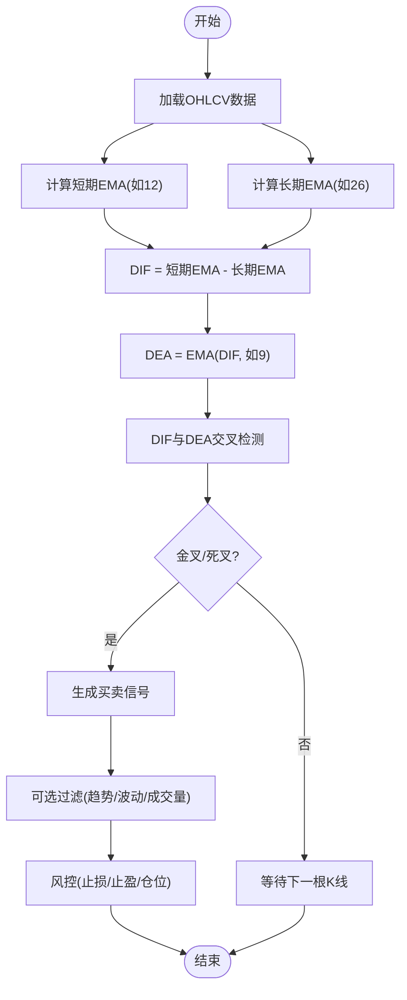
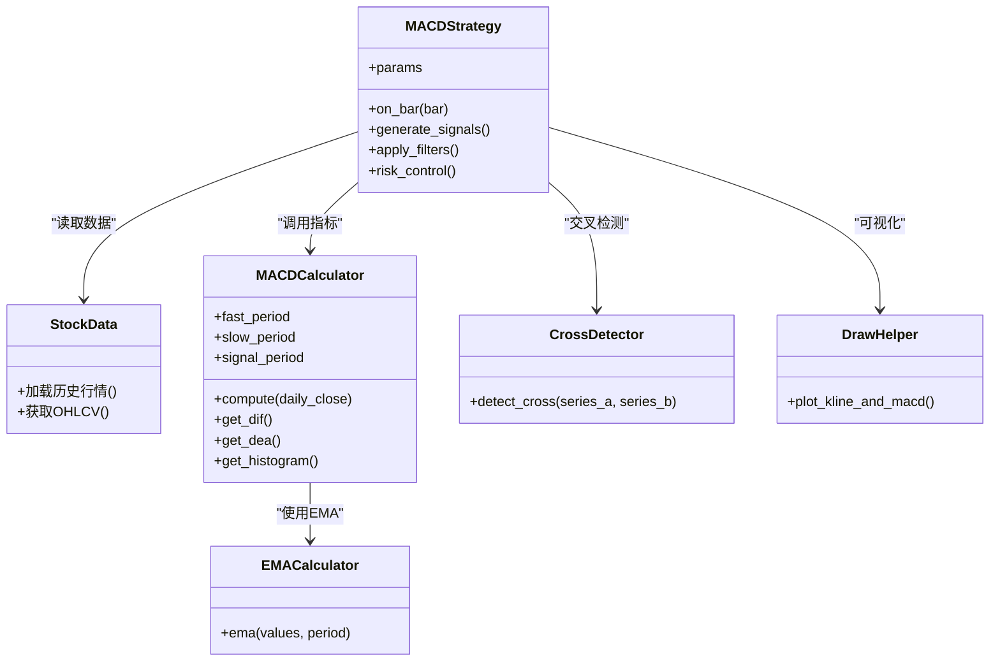
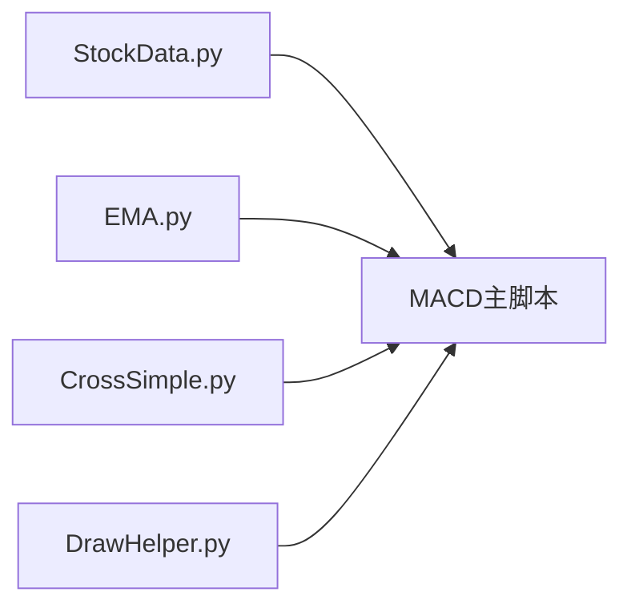

# MACD交叉策略

<cite>
**本文档引用的文件**   
- [8.节点分类实验_MACD_93.47%+画图_20240505.py](file://MyProject/Model/8.节点分类实验_MACD_93.47%+画图_20240505.py)
- [9.节点分类实验_MACD_93.47%+画图_20240505.py](file://MyProject/Model/9.节点分类实验_MACD_93.47%+画图_20240505.py)
- [EMA.py](file://MyProject/Model/Strategy/EMA.py)
- [CrossSimple.py](file://MyProject/Model/Strategy/CrossSimple.py)
- [StockData.py](file://MyProject/DataBase/StockData.py)
- [DrawHelper.py](file://MyProject/Helper/DrawHelper.py)
</cite>

## 目录
1. [简介](#简介)
2. [项目结构](#项目结构)
3. [核心组件](#核心组件)
4. [架构总览](#架构总览)
5. [详细组件分析](#详细组件分析)
6. [依赖关系分析](#依赖关系分析)
7. [性能与实现要点](#性能与实现要点)
8. [故障排查指南](#故障排查指南)
9. [结论](#结论)
10. [附录](#附录)

## 简介
本文件围绕MACD（移动平均收敛发散）交叉策略，系统阐述其计算原理、信号生成逻辑、参数配置与风险控制方法，并结合仓库中现有代码给出可落地的实现路径。文档面向不同技术背景的读者，既提供概念性说明，也给出与源码对应的章节来源与图示，便于快速定位与复现。

## 项目结构
本项目在“模型/策略”目录下包含多个技术指标与交易策略实现，其中与MACD相关的核心文件包括：
- 指标与策略脚本：用于计算MACD并生成金叉/死叉信号，以及可视化输出
- EMA策略模块：提供指数移动平均的通用实现，可作为MACD的基础构件
- 简单交叉检测模块：提供通用的均线交叉判定工具
- 数据与绘图辅助：提供行情数据读取与图表绘制能力

**图示来源**
- [8.节点分类实验_MACD_93.47%+画图_20240505.py](file://MyProject/Model/8.节点分类实验_MACD_93.47%+画图_20240505.py)
- [9.节点分类实验_MACD_93.47%+画图_20240505.py](file://MyProject/Model/9.节点分类实验_MACD_93.47%+画图_20240505.py)
- [EMA.py](file://MyProject/Model/Strategy/EMA.py)
- [CrossSimple.py](file://MyProject/Model/Strategy/CrossSimple.py)
- [StockData.py](file://MyProject/DataBase/StockData.py)
- [DrawHelper.py](file://MyProject/Helper/DrawHelper.py)

**章节来源**
- [8.节点分类实验_MACD_93.47%+画图_20240505.py](file://MyProject/Model/8.节点分类实验_MACD_93.47%+画图_20240505.py)
- [9.节点分类实验_MACD_93.47%+画图_20240505.py](file://MyProject/Model/9.节点分类实验_MACD_93.47%+画图_20240505.py)
- [EMA.py](file://MyProject/Model/Strategy/EMA.py)
- [CrossSimple.py](file://MyProject/Model/Strategy/CrossSimple.py)
- [StockData.py](file://MyProject/DataBase/StockData.py)
- [DrawHelper.py](file://MyProject/Helper/DrawHelper.py)

## 核心组件
- MACD指标计算
  - 快线：基于短期EMA（常用12日）
  - 慢线：基于长期EMA（常用26日）
  - 差离值（DIF）：快线减慢线
  - 信号线（DEA）：对DIF进行平滑（常用9日EMA）
  - MACD柱状图：DIF与DEA之差
- 信号生成
  - 金叉：DIF自下而上穿越DEA，视为买入信号
  - 死叉：DIF自上而下穿越DEA，视为卖出信号
- 周期确认与过滤
  - 多时间框架共振：例如日线出现信号后，用周线或小时线二次确认
  - 趋势过滤：结合更长周期的EMA方向或波动率阈值，避免震荡市频繁交易
  - 成交量/ATR过滤：仅在放量或波动放大时执行，降低假信号
- 风险控制
  - 固定止损止盈、追踪止损
  - 仓位管理：按波动率或账户风险比例动态调整头寸
  - 最大回撤控制与单标的暴露上限

**章节来源**
- [8.节点分类实验_MACD_93.47%+画图_20240505.py](file://MyProject/Model/8.节点分类实验_MACD_93.47%+画图_20240505.py)
- [9.节点分类实验_MACD_93.47%+画图_20240505.py](file://MyProject/Model/9.节点分类实验_MACD_93.47%+画图_20240505.py)
- [EMA.py](file://MyProject/Model/Strategy/EMA.py)
- [CrossSimple.py](file://MyProject/Model/Strategy/CrossSimple.py)

## 架构总览
下图展示了从数据到信号再到可视化的端到端流程，并与具体源码文件对应。

**图示来源**
- [8.节点分类实验_MACD_93.47%+画图_20240505.py](file://MyProject/Model/8.节点分类实验_MACD_93.47%+画图_20240505.py)
- [9.节点分类实验_MACD_93.47%+画图_20240505.py](file://MyProject/Model/9.节点分类实验_MACD_93.47%+画图_20240505.py)
- [EMA.py](file://MyProject/Model/Strategy/EMA.py)
- [CrossSimple.py](file://MyProject/Model/Strategy/CrossSimple.py)
- [StockData.py](file://MyProject/DataBase/StockData.py)
- [DrawHelper.py](file://MyProject/Helper/DrawHelper.py)

## 详细组件分析

### 指标计算与信号生成流程
该流程将价格序列转换为MACD指标，并通过交叉检测产生交易信号。

**图示来源**
- [8.节点分类实验_MACD_93.47%+画图_20240505.py](file://MyProject/Model/8.节点分类实验_MACD_93.47%+画图_20240505.py)
- [9.节点分类实验_MACD_93.47%+画图_20240505.py](file://MyProject/Model/9.节点分类实验_MACD_93.47%+画图_20240505.py)
- [EMA.py](file://MyProject/Model/Strategy/EMA.py)
- [CrossSimple.py](file://MyProject/Model/Strategy/CrossSimple.py)

**章节来源**
- [8.节点分类实验_MACD_93.47%+画图_20240505.py](file://MyProject/Model/8.节点分类实验_MACD_93.47%+画图_20240505.py)
- [9.节点分类实验_MACD_93.47%+画图_20240505.py](file://MyProject/Model/9.节点分类实验_MACD_93.47%+画图_20240505.py)
- [EMA.py](file://MyProject/Model/Strategy/EMA.py)
- [CrossSimple.py](file://MyProject/Model/Strategy/CrossSimple.py)

### 关键类与函数关系（面向对象视角）
若将策略模块化，常见的设计如下：

**图示来源**
- [8.节点分类实验_MACD_93.47%+画图_20240505.py](file://MyProject/Model/8.节点分类实验_MACD_93.47%+画图_20240505.py)
- [9.节点分类实验_MACD_93.47%+画图_20240505.py](file://MyProject/Model/9.节点分类实验_MACD_93.47%+画图_20240505.py)
- [EMA.py](file://MyProject/Model/Strategy/EMA.py)
- [CrossSimple.py](file://MyProject/Model/Strategy/CrossSimple.py)
- [StockData.py](file://MyProject/DataBase/StockData.py)
- [DrawHelper.py](file://MyProject/Helper/DrawHelper.py)

**章节来源**
- [8.节点分类实验_MACD_93.47%+画图_20240505.py](file://MyProject/Model/8.节点分类实验_MACD_93.47%+画图_20240505.py)
- [9.节点分类实验_MACD_93.47%+画图_20240505.py](file://MyProject/Model/9.节点分类实验_MACD_93.47%+画图_20240505.py)
- [EMA.py](file://MyProject/Model/Strategy/EMA.py)
- [CrossSimple.py](file://MyProject/Model/Strategy/CrossSimple.py)
- [StockData.py](file://MyProject/DataBase/StockData.py)
- [DrawHelper.py](file://MyProject/Helper/DrawHelper.py)

### 参数配置与示例路径
- 常用默认参数
  - 快线周期：12
  - 慢线周期：26
  - 信号线周期：9
- 参数扩展建议
  - 短周期组合（如6/13/5）适合短线高频
  - 长周期组合（如24/52/18）适合中长线趋势跟踪
- 示例位置
  - 主策略脚本中的参数定义与调用处
  - EMA模块中的周期参数传递
  - 交叉检测模块中的阈值与窗口设置

**章节来源**
- [8.节点分类实验_MACD_93.47%+画图_20240505.py](file://MyProject/Model/8.节点分类实验_MACD_93.47%+画图_20240505.py)
- [9.节点分类实验_MACD_93.47%+画图_20240505.py](file://MyProject/Model/9.节点分类实验_MACD_93.47%+画图_20240505.py)
- [EMA.py](file://MyProject/Model/Strategy/EMA.py)
- [CrossSimple.py](file://MyProject/Model/Strategy/CrossSimple.py)

### 信号过滤与风险控制
- 趋势过滤
  - 以更长周期EMA方向作为背景趋势，仅顺趋势交易
- 波动过滤
  - 使用ATR或标准差阈值，仅在波动放大时入场
- 成交量过滤
  - 要求突破当日成交量高于近期均值
- 风险控制
  - 固定止损/止盈比（如1:2）
  - 追踪止损（如基于ATR倍数）
  - 单笔风险不超过账户净值的一定比例（如1%-2%）
  - 最大回撤熔断与持仓集中度限制

**章节来源**
- [8.节点分类实验_MACD_93.47%+画图_20240505.py](file://MyProject/Model/8.节点分类实验_MACD_93.47%+画图_20240505.py)
- [9.节点分类实验_MACD_93.47%+画图_20240505.py](file://MyProject/Model/9.节点分类实验_MACD_93.47%+画图_20240505.py)

### 多时间周期确认机制
- 主信号：日线MACD金叉/死叉
- 次级确认：周线同向趋势或小时线回踩不破前低/前高
- 共振规则：当多周期同时满足条件时提高胜率；任一周期不满足则放弃或减仓

**章节来源**
- [8.节点分类实验_MACD_93.47%+画图_20240505.py](file://MyProject/Model/8.节点分类实验_MACD_93.47%+画图_20240505.py)
- [9.节点分类实验_MACD_93.47%+画图_20240505.py](file://MyProject/Model/9.节点分类实验_MACD_93.47%+画图_20240505.py)

### 在不同市场环境下的表现与适用场景
- 趋势市场
  - MACD交叉策略通常具备较好的跟随性与收益潜力
  - 配合趋势过滤可降低假信号
- 震荡市场
  - 易出现频繁交叉导致亏损
  - 需引入波动率与成交量过滤，或切换至均值回归策略
- 高波动事件期
  - 注意滑点与跳空风险，适当放宽止损或降低仓位

[本节为概念性总结，无需列出具体文件来源]

## 依赖关系分析
- 数据依赖
  - 从StockData读取OHLCV序列，确保时间戳连续与缺失值处理
- 指标依赖
  - MACD依赖EMA模块计算快慢线与信号线
- 信号依赖
  - 交叉检测模块负责DIF与DEA的穿越判断
- 可视化依赖
  - 通过绘图模块输出K线与MACD叠加图，便于人工复核

**图示来源**
- [StockData.py](file://MyProject/DataBase/StockData.py)
- [8.节点分类实验_MACD_93.47%+画图_20240505.py](file://MyProject/Model/8.节点分类实验_MACD_93.47%+画图_20240505.py)
- [9.节点分类实验_MACD_93.47%+画图_20240505.py](file://MyProject/Model/9.节点分类实验_MACD_93.47%+画图_20240505.py)
- [EMA.py](file://MyProject/Model/Strategy/EMA.py)
- [CrossSimple.py](file://MyProject/Model/Strategy/CrossSimple.py)
- [DrawHelper.py](file://MyProject/Helper/DrawHelper.py)

**章节来源**
- [StockData.py](file://MyProject/DataBase/StockData.py)
- [8.节点分类实验_MACD_93.47%+画图_20240505.py](file://MyProject/Model/8.节点分类实验_MACD_93.47%+画图_20240505.py)
- [9.节点分类实验_MACD_93.47%+画图_20240505.py](file://MyProject/Model/9.节点分类实验_MACD_93.47%+画图_20240505.py)
- [EMA.py](file://MyProject/Model/Strategy/EMA.py)
- [CrossSimple.py](file://MyProject/Model/Strategy/CrossSimple.py)
- [DrawHelper.py](file://MyProject/Helper/DrawHelper.py)

## 性能与实现要点
- 数值稳定性
  - EMA初始值选择与预热期长度会影响早期信号质量
- 计算效率
  - 使用向量化计算替代循环，减少重复计算
- 内存占用
  - 大周期数据分块处理，避免一次性加载过多历史
- 信号延迟
  - 合理设置参数，平衡灵敏度与滞后性
- 回测一致性
  - 严格对齐时间戳，避免未来函数与重绘问题

[本节为通用指导，无需列出具体文件来源]

## 故障排查指南
- 常见问题
  - 数据缺失或不连续：检查数据清洗与重采样逻辑
  - 信号异常频繁：调大周期或增加过滤条件
  - 绘图错位：核对时间索引与数据对齐
- 定位步骤
  - 逐步打印中间变量（快线、慢线、DIF、DEA）
  - 对比不同参数下的信号差异
  - 使用绘图模块可视化关键阶段

**章节来源**
- [8.节点分类实验_MACD_93.47%+画图_20240505.py](file://MyProject/Model/8.节点分类实验_MACD_93.47%+画图_20240505.py)
- [9.节点分类实验_MACD_93.47%+画图_20240505.py](file://MyProject/Model/9.节点分类实验_MACD_93.47%+画图_20240505.py)
- [DrawHelper.py](file://MyProject/Helper/DrawHelper.py)

## 结论
MACD交叉策略在趋势市场中具备良好表现，但需通过多周期确认、趋势与波动过滤以及完善的风险控制提升稳健性。结合本仓库的EMA与交叉检测模块，可以快速搭建可解释、可扩展的MACD交易系统，并通过可视化手段持续优化参数与规则。

[本节为总结性内容，无需列出具体文件来源]

## 附录
- 参考实现路径
  - 指标计算与信号生成：参见MACD主脚本
  - EMA基础实现：参见EMA模块
  - 交叉检测：参见CrossSimple模块
  - 数据与绘图：参见StockData与DrawHelper

**章节来源**
- [8.节点分类实验_MACD_93.47%+画图_20240505.py](file://MyProject/Model/8.节点分类实验_MACD_93.47%+画图_20240505.py)
- [9.节点分类实验_MACD_93.47%+画图_20240505.py](file://MyProject/Model/9.节点分类实验_MACD_93.47%+画图_20240505.py)
- [EMA.py](file://MyProject/Model/Strategy/EMA.py)
- [CrossSimple.py](file://MyProject/Model/Strategy/CrossSimple.py)
- [StockData.py](file://MyProject/DataBase/StockData.py)
- [DrawHelper.py](file://MyProject/Helper/DrawHelper.py)