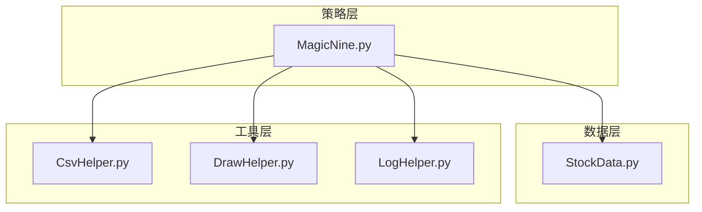
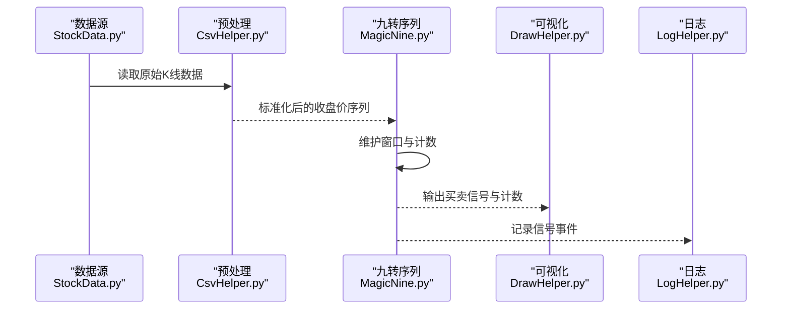
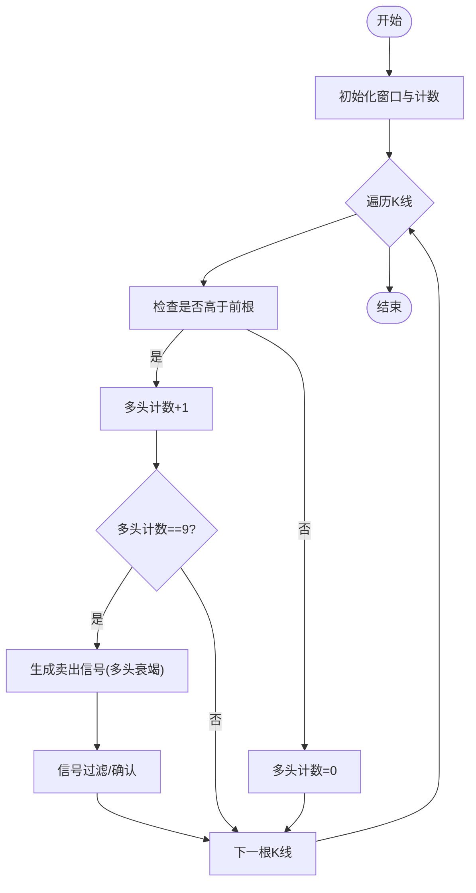
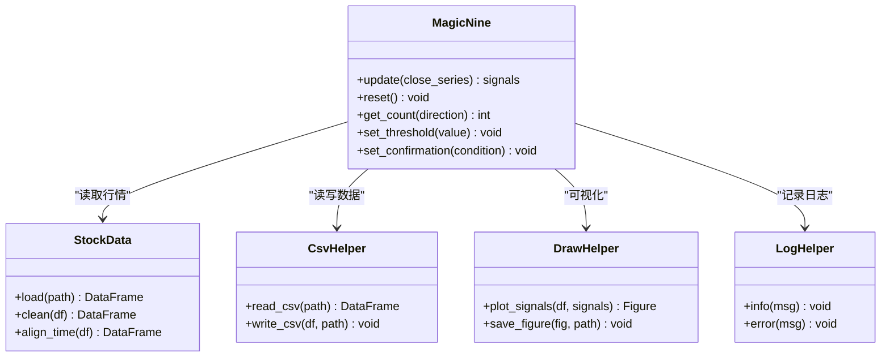
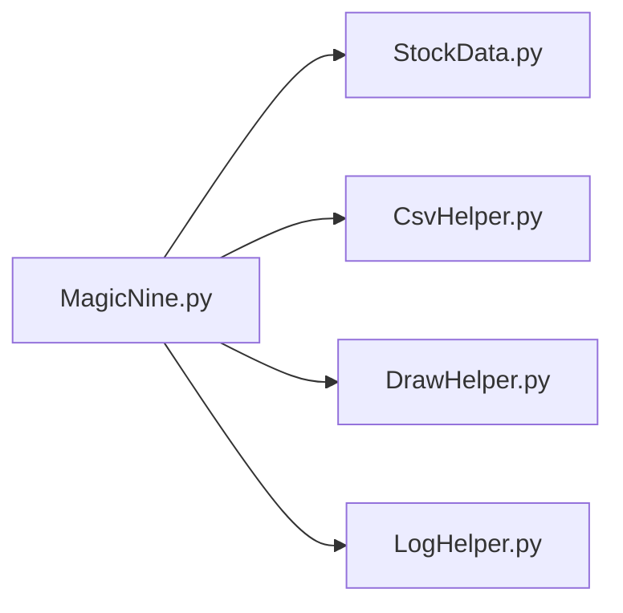

# 九转序列策略

<cite>
**本文引用的文件**   
- [MagicNine.py](file://MyProject/Model/Strategy/MagicNine.py)
- [StockData.py](file://MyProject/DataBase/StockData.py)
- [CsvHelper.py](file://MyProject/Helper/CsvHelper.py)
- [DrawHelper.py](file://MyProject/Helper/DrawHelper.py)
- [LogHelper.py](file://MyProject/Helper/LogHelper.py)
</cite>

## 目录
1. [引言](#引言)
2. [项目结构](#项目结构)
3. [核心组件](#核心组件)
4. [架构总览](#架构总览)
5. [详细组件分析](#详细组件分析)
6. [依赖关系分析](#依赖关系分析)
7. [性能与实现要点](#性能与实现要点)
8. [故障排查指南](#故障排查指南)
9. [结论](#结论)
10. [附录：集成示例路径](#附录集成示例路径)

## 引言
本文件围绕“九转序列”（也称TD Sequential）策略，结合仓库中现有实现进行系统化文档化。内容涵盖：
- 理论来源与核心思想：高低点计数规则、转折点识别逻辑
- 信号形成与确认机制：连续高点/低点的形成条件与反转确认
- 工程实现：数据窗口管理、计数重置条件、信号过滤规则
- 实战案例与参数优化建议、风险控制措施
- 在量化系统中的集成方式与参考路径

说明：本仓库包含一个名为“MagicNine”的策略模块，其命名与“九转序列”高度一致，且具备典型的高/低点计数与信号输出特征。下文将基于该模块的实现进行解读与扩展，帮助读者快速理解并落地应用。

## 项目结构
本项目采用分层组织方式：
- 策略层：位于 Model/Strategy，包含多种技术指标与交易策略实现
- 数据层：位于 DataBase，负责行情数据的读取、缓存与预处理
- 工具层：位于 Helper，提供CSV读写、绘图、日志等通用能力

图表来源
- [MagicNine.py](file://MyProject/Model/Strategy/MagicNine.py)
- [StockData.py](file://MyProject/DataBase/StockData.py)
- [CsvHelper.py](file://MyProject/Helper/CsvHelper.py)
- [DrawHelper.py](file://MyProject/Helper/DrawHelper.py)
- [LogHelper.py](file://MyProject/Helper/LogHelper.py)

章节来源
- [MagicNine.py](file://MyProject/Model/Strategy/MagicNine.py)
- [StockData.py](file://MyProject/DataBase/StockData.py)
- [CsvHelper.py](file://MyProject/Helper/CsvHelper.py)
- [DrawHelper.py](file://MyProject/Helper/DrawHelper.py)
- [LogHelper.py](file://MyProject/Helper/LogHelper.py)

## 核心组件
- 九转序列信号生成器（MagicNine）
  - 输入：收盘价序列（或OHLCV中的Close）
  - 输出：多头序列信号（买入）、空头序列信号（卖出），以及可选的计数状态
  - 关键特性：滑动窗口维护、计数递增/重置、信号去重与过滤
- 数据接入与预处理（StockData）
  - 提供历史K线数据加载、清洗与对齐
- 辅助工具（CsvHelper/DrawHelper/LogHelper）
  - CSV读写、可视化绘制、日志记录

章节来源
- [MagicNine.py](file://MyProject/Model/Strategy/MagicNine.py)
- [StockData.py](file://MyProject/DataBase/StockData.py)
- [CsvHelper.py](file://MyProject/Helper/CsvHelper.py)
- [DrawHelper.py](file://MyProject/Helper/DrawHelper.py)
- [LogHelper.py](file://MyProject/Helper/LogHelper.py)

## 架构总览
下图展示从数据到信号的端到端流程：数据读取→预处理→九转序列计算→信号输出→可视化/日志。

图表来源
- [StockData.py](file://MyProject/DataBase/StockData.py)
- [CsvHelper.py](file://MyProject/Helper/CsvHelper.py)
- [MagicNine.py](file://MyProject/Model/Strategy/MagicNine.py)
- [DrawHelper.py](file://MyProject/Helper/DrawHelper.py)
- [LogHelper.py](file://MyProject/Helper/LogHelper.py)

## 详细组件分析

### 九转序列理论与算法
- 理论来源
  - 九转序列由Tom DeMark提出，用于识别趋势衰竭与潜在反转点。核心在于对连续更高高点或更低低点计数，当达到阈值（通常为9）时提示反转概率提升。
- 核心思想
  - 多头序列：逐根K线的最高价（或收盘价）相较前一根是否满足“更高”的条件，若满足则计数+1；否则计数重置为0。当计数达到9时，视为多头衰竭，可能触发卖出信号。
  - 空头序列：逐根K线的最低价格相较前一根是否满足“更低”的条件，若满足则计数+1；否则计数重置为0。当计数达到9时，视为空头衰竭，可能触发买入信号。
- 转折点识别与确认
  - 计数到达9是“预警”，实际交易中常加入确认条件，例如下一根K线突破前高/前低、或短期均线交叉、或成交量放大等，以降低假信号。

章节来源
- [MagicNine.py](file://MyProject/Model/Strategy/MagicNine.py)

### 数据窗口管理与计数重置
- 数据窗口
  - 使用滑动窗口维护最近若干根K线，便于比较当前与前一K线的高低点关系
- 计数重置条件
  - 当不满足“更高/更低”条件时，对应方向计数立即归零
  - 某些实现会在出现反向信号后清空另一方向的计数，避免双向同时有效
- 信号过滤规则
  - 去重：同一方向连续多根K线仅保留首次到达阈值的信号
  - 确认：可引入下一根K线确认、波动率过滤、时间窗口限制等

章节来源
- [MagicNine.py](file://MyProject/Model/Strategy/MagicNine.py)

### 信号生成流程图

图表来源
- [MagicNine.py](file://MyProject/Model/Strategy/MagicNine.py)

### 类与职责（代码级视图）

图表来源
- [MagicNine.py](file://MyProject/Model/Strategy/MagicNine.py)
- [StockData.py](file://MyProject/DataBase/StockData.py)
- [CsvHelper.py](file://MyProject/Helper/CsvHelper.py)
- [DrawHelper.py](file://MyProject/Helper/DrawHelper.py)
- [LogHelper.py](file://MyProject/Helper/LogHelper.py)

章节来源
- [MagicNine.py](file://MyProject/Model/Strategy/MagicNine.py)
- [StockData.py](file://MyProject/DataBase/StockData.py)
- [CsvHelper.py](file://MyProject/Helper/CsvHelper.py)
- [DrawHelper.py](file://MyProject/Helper/DrawHelper.py)
- [LogHelper.py](file://MyProject/Helper/LogHelper.py)

### 实战案例与有效性评估
- 适用场景
  - 震荡市与趋势末端：九转序列在趋势衰竭阶段表现较好，但在强单边趋势中可能出现多次“伪9”
- 评估方法
  - 回测指标：胜率、盈亏比、最大回撤、夏普比率
  - 样本外验证：滚动窗口或时间切分，避免过拟合
- 常见改进
  - 增加确认条件（如下一根K线突破、均线交叉）
  - 结合波动率过滤（ATR阈值）
  - 与趋势过滤器组合（如长周期均线方向）

[本节为概念性分析与实践建议，不直接分析具体文件]

### 参数优化建议
- 阈值调整
  - 默认9可作为基准，但可根据品种波动性与交易周期微调（如7~11）
- 确认条件
  - 下一根K线确认、突破前高/前低、MACD/RSI背离等
- 过滤规则
  - 波动率过滤（ATR）、成交量过滤、时间窗口限制（避免尾盘噪音）
- 组合策略
  - 与趋势跟踪策略互补，降低逆势风险

[本节为概念性分析与实践建议，不直接分析具体文件]

### 风险控制措施
- 仓位管理
  - 固定比例或基于波动率的动态仓位
- 止损止盈
  - 固定点数/百分比止损，或基于ATR的动态止损
- 信号质量监控
  - 统计近期胜率与回撤，低于阈值时暂停开仓
- 极端行情保护
  - 涨跌停、流动性不足、跳空缺口处理

[本节为概念性分析与实践建议，不直接分析具体文件]

## 依赖关系分析
- 内部依赖
  - 策略模块依赖数据层与工具层，保持松耦合
- 外部依赖
  - 数据处理库（如pandas）、可视化库（如matplotlib）
- 循环依赖
  - 通过分层设计避免循环引用

图表来源
- [MagicNine.py](file://MyProject/Model/Strategy/MagicNine.py)
- [StockData.py](file://MyProject/DataBase/StockData.py)
- [CsvHelper.py](file://MyProject/Helper/CsvHelper.py)
- [DrawHelper.py](file://MyProject/Helper/DrawHelper.py)
- [LogHelper.py](file://MyProject/Helper/LogHelper.py)

章节来源
- [MagicNine.py](file://MyProject/Model/Strategy/MagicNine.py)
- [StockData.py](file://MyProject/DataBase/StockData.py)
- [CsvHelper.py](file://MyProject/Helper/CsvHelper.py)
- [DrawHelper.py](file://MyProject/Helper/DrawHelper.py)
- [LogHelper.py](file://MyProject/Helper/LogHelper.py)

## 性能与实现要点
- 时间复杂度
  - 单根K线O(1)，整体O(N)
- 空间复杂度
  - 滑动窗口大小固定，O(W)
- 内存优化
  - 流式更新，避免全量复制
- 并发与批处理
  - 多标的并行计算时注意锁与队列管理

[本节为通用性能讨论，不直接分析具体文件]

## 故障排查指南
- 常见问题
  - 数据缺失或不连续：导致窗口错位与计数异常
  - 信号频繁触发：需加强过滤与确认条件
  - 可视化异常：坐标轴范围、时间索引格式问题
- 定位步骤
  - 打印窗口与计数变化轨迹
  - 校验输入数据的时间戳与排序
  - 逐步关闭过滤条件以定位问题
- 日志与调试
  - 使用日志记录关键事件与中间变量
  - 保存最小复现数据集以便回归测试

章节来源
- [LogHelper.py](file://MyProject/Helper/LogHelper.py)
- [DrawHelper.py](file://MyProject/Helper/DrawHelper.py)
- [CsvHelper.py](file://MyProject/Helper/CsvHelper.py)

## 结论
九转序列是一种简洁而有效的趋势衰竭识别工具。通过合理的窗口管理、计数重置与信号过滤，可以在不同市场环境中稳定输出高质量的反转信号。结合趋势过滤与风险管理，能够进一步提升策略的稳健性与收益风险比。

[本节为总结性内容，不直接分析具体文件]

## 附录：集成示例路径
以下为在量化系统中集成九转序列策略的关键实现位置与参考路径（不包含具体代码内容）：
- 策略主逻辑与信号输出
  - [MagicNine.py](file://MyProject/Model/Strategy/MagicNine.py)
- 数据读取与预处理
  - [StockData.py](file://MyProject/DataBase/StockData.py)
  - [CsvHelper.py](file://MyProject/Helper/CsvHelper.py)
- 可视化与日志
  - [DrawHelper.py](file://MyProject/Helper/DrawHelper.py)
  - [LogHelper.py](file://MyProject/Helper/LogHelper.py)

章节来源
- [MagicNine.py](file://MyProject/Model/Strategy/MagicNine.py)
- [StockData.py](file://MyProject/DataBase/StockData.py)
- [CsvHelper.py](file://MyProject/Helper/CsvHelper.py)
- [DrawHelper.py](file://MyProject/Helper/DrawHelper.py)
- [LogHelper.py](file://MyProject/Helper/LogHelper.py)