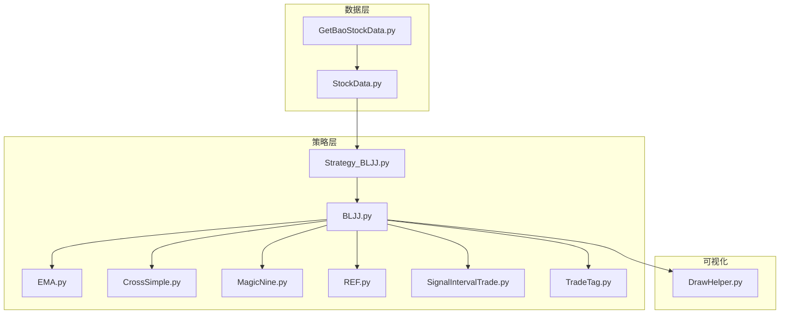
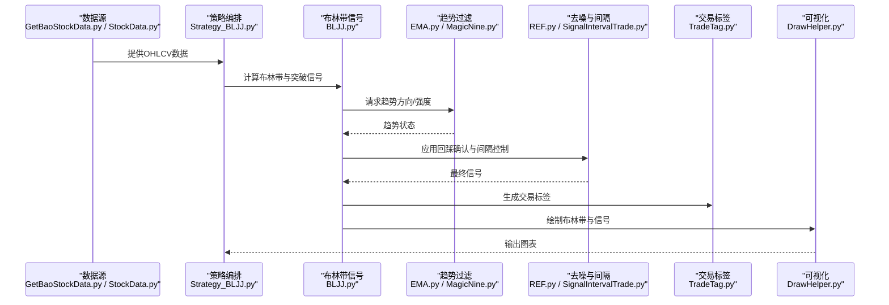
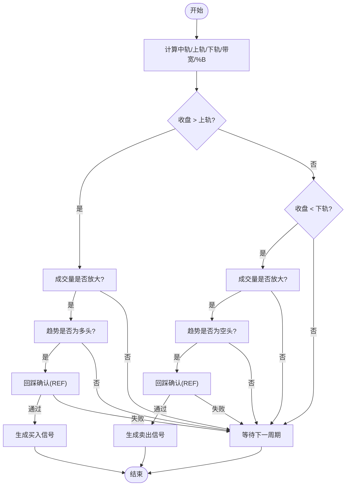
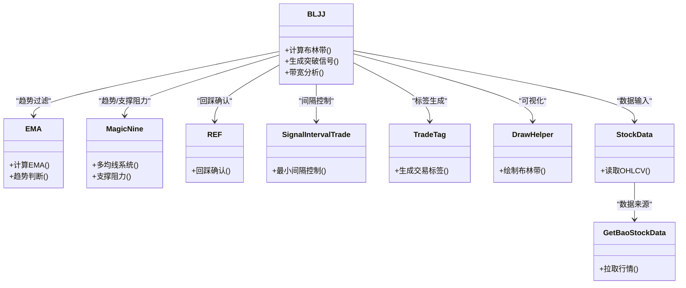

# 布林带突破策略

<cite>
**本文引用的文件**   
- [MyProject/Model/Strategy/BLJJ.py](file://MyProject/Model/Strategy/BLJJ.py)
- [MyProject/Model/Strategy/CrossSimple.py](file://MyProject/Model/Strategy/CrossSimple.py)
- [MyProject/Model/Strategy/EMA.py](file://MyProject/Model/Strategy/EMA.py)
- [MyProject/Model/Strategy/MagicNine.py](file://MyProject/Model/Strategy/MagicNine.py)
- [MyProject/Model/Strategy/REF.py](file://MyProject/Model/Strategy/REF.py)
- [MyProject/Model/Strategy/SignalIntervalTrade.py](file://MyProject/Model/Strategy/SignalIntervalTrade.py)
- [MyProject/Model/Strategy/TradeTag.py](file://MyProject/Model/Strategy/TradeTag.py)
- [MyProject/Model/Strategy_BLJJ.py](file://MyProject/Model/Strategy_BLJJ.py)
- [MyProject/DataBase/StockData.py](file://MyProject/DataBase/StockData.py)
- [MyProject/Helper/DrawHelper.py](file://MyProject/Helper/DrawHelper.py)
- [GetBaoStockData.py](file://GetBaoStockData.py)
</cite>

## 目录
1. [引言](#引言)
2. [项目结构](#项目结构)
3. [核心组件](#核心组件)
4. [架构总览](#架构总览)
5. [详细组件分析](#详细组件分析)
6. [依赖关系分析](#依赖关系分析)
7. [性能与实现要点](#性能与实现要点)
8. [故障排查指南](#故障排查指南)
9. [结论](#结论)
10. [附录：实战示例与参数建议](#附录实战示例与参数建议)

## 引言
本文件围绕“布林带突破策略”提供系统化、可落地的专业文档。内容涵盖：
- 理论基础：标准差、上下轨构建、带宽（Bandwidth）与百分比带宽（%B）等指标含义
- 信号逻辑：价格突破上轨/下轨的买卖条件，结合成交量与其他指标的过滤
- 波动率自适应：基于ATR或滚动标准差的参数调整方法
- 假突破过滤：回踩确认、时间窗口、量价配合、趋势方向约束
- 市场形态差异：震荡市与趋势市的适用性与表现差异
- 代码落地：结合仓库现有策略模块，给出可复用的工程化思路与参考路径

## 项目结构
仓库中与策略相关的核心位置如下：
- 策略实现与组合：
  - MyProject/Model/Strategy/BLJJ.py：布林带相关策略实现
  - MyProject/Model/Strategy/CrossSimple.py：简单交叉信号（可用于辅助过滤）
  - MyProject/Model/Strategy/EMA.py：指数移动平均（趋势过滤）
  - MyProject/Model/Strategy/MagicNine.py：多均线系统（趋势与支撑阻力）
  - MyProject/Model/Strategy/REF.py：引用/滞后值工具（用于回踩确认）
  - MyProject/Model/Strategy/SignalIntervalTrade.py：信号间隔控制（防频繁交易）
  - MyProject/Model/Strategy/TradeTag.py：交易标签生成（便于回测统计）
  - MyProject/Model/Strategy_BLJJ.py：布林带策略入口/编排脚本
- 数据与可视化：
  - MyProject/DataBase/StockData.py：行情数据读取与预处理
  - MyProject/Helper/DrawHelper.py：绘图辅助（含布林带绘制）
  - GetBaoStockData.py：外部数据源获取（如BaoStock）

图表来源
- [MyProject/Model/Strategy/BLJJ.py](file://MyProject/Model/Strategy/BLJJ.py)
- [MyProject/Model/Strategy/EMA.py](file://MyProject/Model/Strategy/EMA.py)
- [MyProject/Model/Strategy/CrossSimple.py](file://MyProject/Model/Strategy/CrossSimple.py)
- [MyProject/Model/Strategy/MagicNine.py](file://MyProject/Model/Strategy/MagicNine.py)
- [MyProject/Model/Strategy/REF.py](file://MyProject/Model/Strategy/REF.py)
- [MyProject/Model/Strategy/SignalIntervalTrade.py](file://MyProject/Model/Strategy/SignalIntervalTrade.py)
- [MyProject/Model/Strategy/TradeTag.py](file://MyProject/Model/Strategy/TradeTag.py)
- [MyProject/Model/Strategy_BLJJ.py](file://MyProject/Model/Strategy_BLJJ.py)
- [MyProject/DataBase/StockData.py](file://MyProject/DataBase/StockData.py)
- [MyProject/Helper/DrawHelper.py](file://MyProject/Helper/DrawHelper.py)
- [GetBaoStockData.py](file://GetBaoStockData.py)

章节来源
- [MyProject/Model/Strategy/BLJJ.py](file://MyProject/Model/Strategy/BLJJ.py)
- [MyProject/Model/Strategy/EMA.py](file://MyProject/Model/Strategy/EMA.py)
- [MyProject/Model/Strategy/CrossSimple.py](file://MyProject/Model/Strategy/CrossSimple.py)
- [MyProject/Model/Strategy/MagicNine.py](file://MyProject/Model/Strategy/MagicNine.py)
- [MyProject/Model/Strategy/REF.py](file://MyProject/Model/Strategy/REF.py)
- [MyProject/Model/Strategy/SignalIntervalTrade.py](file://MyProject/Model/Strategy/SignalIntervalTrade.py)
- [MyProject/Model/Strategy/TradeTag.py](file://MyProject/Model/Strategy/TradeTag.py)
- [MyProject/Model/Strategy_BLJJ.py](file://MyProject/Model/Strategy_BLJJ.py)
- [MyProject/DataBase/StockData.py](file://MyProject/DataBase/StockData.py)
- [MyProject/Helper/DrawHelper.py](file://MyProject/Helper/DrawHelper.py)
- [GetBaoStockData.py](file://GetBaoStockData.py)

## 核心组件
- 布林带计算与信号生成
  - 负责计算中轨（N日简单移动平均）、标准差、上下轨，并输出突破信号
  - 关键路径：[MyProject/Model/Strategy/BLJJ.py](file://MyProject/Model/Strategy/BLJJ.py)
- 趋势与交叉过滤
  - 使用EMA或多均线系统判断趋势方向，减少逆势交易
  - 关键路径：[MyProject/Model/Strategy/EMA.py](file://MyProject/Model/Strategy/EMA.py)、[MyProject/Model/Strategy/MagicNine.py](file://MyProject/Model/Strategy/MagicNine.py)
- 信号去噪与间隔控制
  - 通过REF进行回踩确认，SignalIntervalTrade控制最小交易间隔
  - 关键路径：[MyProject/Model/Strategy/REF.py](file://MyProject/Model/Strategy/REF.py)、[MyProject/Model/Strategy/SignalIntervalTrade.py](file://MyProject/Model/Strategy/SignalIntervalTrade.py)
- 交易标签与回测统计
  - TradeTag生成交易事件标签，便于后续统计与评估
  - 关键路径：[MyProject/Model/Strategy/TradeTag.py](file://MyProject/Model/Strategy/TradeTag.py)
- 数据与可视化
  - StockData提供OHLCV数据；DrawHelper支持绘制布林带与信号
  - 关键路径：[MyProject/DataBase/StockData.py](file://MyProject/DataBase/StockData.py)、[MyProject/Helper/DrawHelper.py](file://MyProject/Helper/DrawHelper.py)

章节来源
- [MyProject/Model/Strategy/BLJJ.py](file://MyProject/Model/Strategy/BLJJ.py)
- [MyProject/Model/Strategy/EMA.py](file://MyProject/Model/Strategy/EMA.py)
- [MyProject/Model/Strategy/MagicNine.py](file://MyProject/Model/Strategy/MagicNine.py)
- [MyProject/Model/Strategy/REF.py](file://MyProject/Model/Strategy/REF.py)
- [MyProject/Model/Strategy/SignalIntervalTrade.py](file://MyProject/Model/Strategy/SignalIntervalTrade.py)
- [MyProject/Model/Strategy/TradeTag.py](file://MyProject/Model/Strategy/TradeTag.py)
- [MyProject/DataBase/StockData.py](file://MyProject/DataBase/StockData.py)
- [MyProject/Helper/DrawHelper.py](file://MyProject/Helper/DrawHelper.py)

## 架构总览
整体流程从数据接入到信号生成、再到可视化与回测标签，形成闭环。

图表来源
- [MyProject/Model/Strategy_BLJJ.py](file://MyProject/Model/Strategy_BLJJ.py)
- [MyProject/Model/Strategy/BLJJ.py](file://MyProject/Model/Strategy/BLJJ.py)
- [MyProject/Model/Strategy/EMA.py](file://MyProject/Model/Strategy/EMA.py)
- [MyProject/Model/Strategy/MagicNine.py](file://MyProject/Model/Strategy/MagicNine.py)
- [MyProject/Model/Strategy/REF.py](file://MyProject/Model/Strategy/REF.py)
- [MyProject/Model/Strategy/SignalIntervalTrade.py](file://MyProject/Model/Strategy/SignalIntervalTrade.py)
- [MyProject/Model/Strategy/TradeTag.py](file://MyProject/Model/Strategy/TradeTag.py)
- [MyProject/Helper/DrawHelper.py](file://MyProject/Helper/DrawHelper.py)
- [MyProject/DataBase/StockData.py](file://MyProject/DataBase/StockData.py)
- [GetBaoStockData.py](file://GetBaoStockData.py)

## 详细组件分析

### 布林带理论与信号逻辑
- 基础定义
  - 中轨：N日简单移动平均
  - 上轨：中轨 + k × 标准差
  - 下轨：中轨 − k × 标准差
  - 带宽（Bandwidth）= (上轨 − 下轨) / 中轨，衡量波动率宽度
  - %B = (价格 − 下轨) / (上轨 − 下轨)，衡量价格在通道中的相对位置
- 突破信号
  - 买入：收盘价向上突破上轨，且满足趋势过滤与成交量放大
  - 卖出：收盘价向下跌破下轨，且满足趋势过滤与成交量放大
- 收窄与扩张
  - 收窄：带宽持续下降，预示波动率压缩，可能即将出现大行情
  - 扩张：带宽上升，表明波动率放大，趋势延续概率提高
- 假突破过滤
  - 回踩确认：突破后若干周期内未回到通道内
  - 时间窗口：要求突破后连续N根K线保持在通道外
  - 量价配合：突破当日或随后1-2日成交量显著高于近期均值
  - 趋势约束：仅在上升趋势中做多突破，在下降趋势中做空突破

章节来源
- [MyProject/Model/Strategy/BLJJ.py](file://MyProject/Model/Strategy/BLJJ.py)
- [MyProject/Model/Strategy/EMA.py](file://MyProject/Model/Strategy/EMA.py)
- [MyProject/Model/Strategy/MagicNine.py](file://MyProject/Model/Strategy/MagicNine.py)
- [MyProject/Model/Strategy/REF.py](file://MyProject/Model/Strategy/REF.py)
- [MyProject/Model/Strategy/SignalIntervalTrade.py](file://MyProject/Model/Strategy/SignalIntervalTrade.py)
- [MyProject/Model/Strategy/TradeTag.py](file://MyProject/Model/Strategy/TradeTag.py)

#### 算法流程图（突破+过滤）

图表来源
- [MyProject/Model/Strategy/BLJJ.py](file://MyProject/Model/Strategy/BLJJ.py)
- [MyProject/Model/Strategy/REF.py](file://MyProject/Model/Strategy/REF.py)
- [MyProject/Model/Strategy/EMA.py](file://MyProject/Model/Strategy/EMA.py)
- [MyProject/Model/Strategy/MagicNine.py](file://MyProject/Model/Strategy/MagicNine.py)

### 波动率自适应参数调整
- 动态N与k
  - 使用滚动标准差或ATR估计当前波动率，反向调节N（短周期在高波时缩短，低波时延长）
  - 根据带宽分位数对k进行微调，避免在极端波动中过度敏感
- 带宽阈值
  - 当带宽低于历史低位分位时，放宽突破阈值（例如要求收盘价超过上轨一定比例）
  - 当带宽处于高位时，收紧条件（要求成交量更强或趋势更明确）
- 实施建议
  - 将波动率估计作为输入，驱动N与k的在线更新
  - 引入平滑机制（如指数加权）防止参数抖动

章节来源
- [MyProject/Model/Strategy/BLJJ.py](file://MyProject/Model/Strategy/BLJJ.py)

### 结合成交量与其他指标提升准确性
- 成交量过滤
  - 突破当日或随后1-2日成交量高于近M日均量的倍数阈值
  - 若为缩量突破，则视为弱信号，延迟入场或降低仓位
- 其他指标辅助
  - RSI/KDJ：在超买/超卖区域谨慎追涨杀跌
  - MACD：趋势动能确认，避免逆动能交易
  - ATR：动态止损与目标位设置
- 信号融合
  - 采用投票或加权评分机制，综合多个指标决定最终信号

章节来源
- [MyProject/Model/Strategy/BLJJ.py](file://MyProject/Model/Strategy/BLJJ.py)
- [MyProject/Model/Strategy/CrossSimple.py](file://MyProject/Model/Strategy/CrossSimple.py)
- [MyProject/Model/Strategy/EMA.py](file://MyProject/Model/Strategy/EMA.py)
- [MyProject/Model/Strategy/MagicNine.py](file://MyProject/Model/Strategy/MagicNine.py)

### 震荡市与趋势市的表现差异
- 趋势市
  - 布林带扩张阶段，突破信号有效性强，适合顺势交易
  - 建议放宽回踩确认时间，允许更大回撤以捕捉趋势延续
- 震荡市
  - 布林带收窄阶段，假突破较多，需强化过滤（成交量、趋势、时间窗口）
  - 建议缩小仓位或暂停交易，等待带宽重新扩张
- 自适应切换
  - 依据带宽与斜率自动识别市场状态，动态调整参数与风控

章节来源
- [MyProject/Model/Strategy/BLJJ.py](file://MyProject/Model/Strategy/BLJJ.py)

## 依赖关系分析
- 模块耦合
  - BLJJ为核心，依赖EMA/MagicNine进行趋势过滤，依赖REF进行回踩确认，依赖SignalIntervalTrade控制交易频率，依赖TradeTag生成标签，依赖DrawHelper进行可视化
- 外部依赖
  - StockData与GetBaoStockData提供数据源，确保数据质量与一致性

图表来源
- [MyProject/Model/Strategy/BLJJ.py](file://MyProject/Model/Strategy/BLJJ.py)
- [MyProject/Model/Strategy/EMA.py](file://MyProject/Model/Strategy/EMA.py)
- [MyProject/Model/Strategy/MagicNine.py](file://MyProject/Model/Strategy/MagicNine.py)
- [MyProject/Model/Strategy/REF.py](file://MyProject/Model/Strategy/REF.py)
- [MyProject/Model/Strategy/SignalIntervalTrade.py](file://MyProject/Model/Strategy/SignalIntervalTrade.py)
- [MyProject/Model/Strategy/TradeTag.py](file://MyProject/Model/Strategy/TradeTag.py)
- [MyProject/Helper/DrawHelper.py](file://MyProject/Helper/DrawHelper.py)
- [MyProject/DataBase/StockData.py](file://MyProject/DataBase/StockData.py)
- [GetBaoStockData.py](file://GetBaoStockData.py)

章节来源
- [MyProject/Model/Strategy/BLJJ.py](file://MyProject/Model/Strategy/BLJJ.py)
- [MyProject/Model/Strategy/EMA.py](file://MyProject/Model/Strategy/EMA.py)
- [MyProject/Model/Strategy/MagicNine.py](file://MyProject/Model/Strategy/MagicNine.py)
- [MyProject/Model/Strategy/REF.py](file://MyProject/Model/Strategy/REF.py)
- [MyProject/Model/Strategy/SignalIntervalTrade.py](file://MyProject/Model/Strategy/SignalIntervalTrade.py)
- [MyProject/Model/Strategy/TradeTag.py](file://MyProject/Model/Strategy/TradeTag.py)
- [MyProject/Helper/DrawHelper.py](file://MyProject/Helper/DrawHelper.py)
- [MyProject/DataBase/StockData.py](file://MyProject/DataBase/StockData.py)
- [GetBaoStockData.py](file://GetBaoStockData.py)

## 性能与实现要点
- 计算复杂度
  - 布林带与标准差为O(N)滑动窗口，适合向量化实现
  - 带宽与%B为常数时间操作
- 内存与缓存
  - 对长序列数据建议使用滚动聚合与增量更新，避免重复计算
- 数值稳定性
  - 标准差接近零时的除零保护（带宽与%B计算）
  - 缺失值处理与对齐（日期索引一致）
- 并行与批处理
  - 多标的批量计算可采用向量化或并行框架加速

章节来源
- [MyProject/Model/Strategy/BLJJ.py](file://MyProject/Model/Strategy/BLJJ.py)
- [MyProject/Helper/DrawHelper.py](file://MyProject/Helper/DrawHelper.py)

## 故障排查指南
- 常见问题
  - 数据缺失或时间戳不一致导致信号错位
  - 标准差过小造成带宽异常，触发误报
  - 成交量数据异常或缺失影响过滤效果
- 定位步骤
  - 检查数据清洗与对齐逻辑（StockData）
  - 打印关键中间变量（中轨、上轨、下轨、带宽、%B）
  - 逐步关闭过滤条件，观察信号变化（EMA/MagicNine/REF/SignalIntervalTrade）
- 修复建议
  - 增加前值填充与缺失值插补
  - 对带宽设置下限阈值，避免除零
  - 对成交量进行平滑与异常值剔除

章节来源
- [MyProject/DataBase/StockData.py](file://MyProject/DataBase/StockData.py)
- [MyProject/Model/Strategy/BLJJ.py](file://MyProject/Model/Strategy/BLJJ.py)
- [MyProject/Model/Strategy/SignalIntervalTrade.py](file://MyProject/Model/Strategy/SignalIntervalTrade.py)

## 结论
布林带突破策略在趋势市中具备较强有效性，但在震荡市中需要严格的过滤与自适应参数。通过结合成交量、趋势指标与回踩确认，可显著提升信号质量。工程化落地应注重数据质量、数值稳定与性能优化，并通过可视化与标签体系进行持续评估与迭代。

## 附录：实战示例与参数建议
- 示例路径
  - 布林带策略主入口：[MyProject/Model/Strategy_BLJJ.py](file://MyProject/Model/Strategy_BLJJ.py)
  - 布林带实现：[MyProject/Model/Strategy/BLJJ.py](file://MyProject/Model/Strategy/BLJJ.py)
  - 趋势过滤：[MyProject/Model/Strategy/EMA.py](file://MyProject/Model/Strategy/EMA.py)、[MyProject/Model/Strategy/MagicNine.py](file://MyProject/Model/Strategy/MagicNine.py)
  - 回踩确认与间隔控制：[MyProject/Model/Strategy/REF.py](file://MyProject/Model/Strategy/REF.py)、[MyProject/Model/Strategy/SignalIntervalTrade.py](file://MyProject/Model/Strategy/SignalIntervalTrade.py)
  - 交易标签与可视化：[MyProject/Model/Strategy/TradeTag.py](file://MyProject/Model/Strategy/TradeTag.py)、[MyProject/Helper/DrawHelper.py](file://MyProject/Helper/DrawHelper.py)
  - 数据源：[MyProject/DataBase/StockData.py](file://MyProject/DataBase/StockData.py)、[GetBaoStockData.py](file://GetBaoStockData.py)
- 参数建议
  - N=20，k=2为基础配置；高波期缩短N至15-20，低波期延长至20-30
  - 成交量阈值：突破日成交量≥近20日均量的1.5倍
  - 回踩确认：突破后3-5根K线未回到通道内
  - 趋势过滤：EMA多头排列或MACD金叉确认
- 回测与评估
  - 使用TradeTag生成交易事件，统计胜率、盈亏比、最大回撤
  - 对比带宽分位下的收益分布，验证自适应参数的有效性

章节来源
- [MyProject/Model/Strategy_BLJJ.py](file://MyProject/Model/Strategy_BLJJ.py)
- [MyProject/Model/Strategy/BLJJ.py](file://MyProject/Model/Strategy/BLJJ.py)
- [MyProject/Model/Strategy/EMA.py](file://MyProject/Model/Strategy/EMA.py)
- [MyProject/Model/Strategy/MagicNine.py](file://MyProject/Model/Strategy/MagicNine.py)
- [MyProject/Model/Strategy/REF.py](file://MyProject/Model/Strategy/REF.py)
- [MyProject/Model/Strategy/SignalIntervalTrade.py](file://MyProject/Model/Strategy/SignalIntervalTrade.py)
- [MyProject/Model/Strategy/TradeTag.py](file://MyProject/Model/Strategy/TradeTag.py)
- [MyProject/Helper/DrawHelper.py](file://MyProject/Helper/DrawHelper.py)
- [MyProject/DataBase/StockData.py](file://MyProject/DataBase/StockData.py)
- [GetBaoStockData.py](file://GetBaoStockData.py)