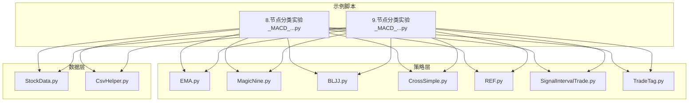
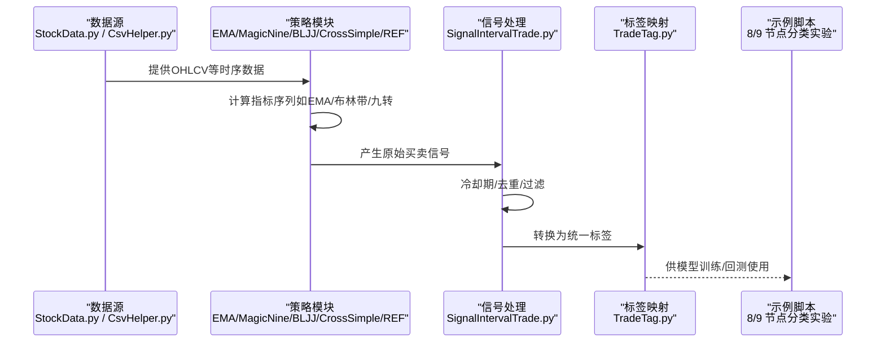
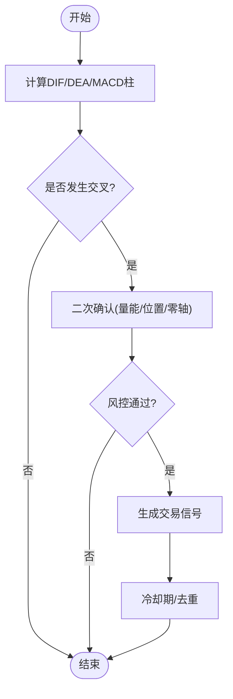
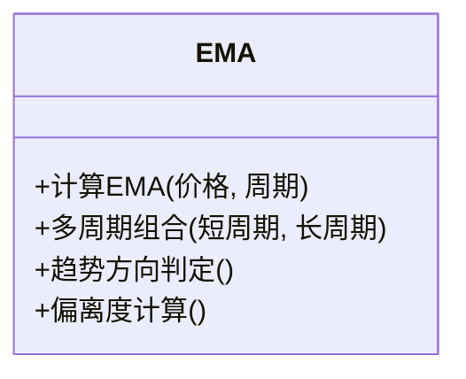
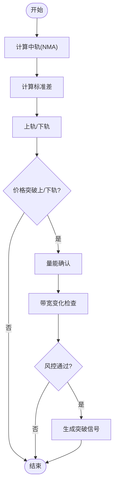
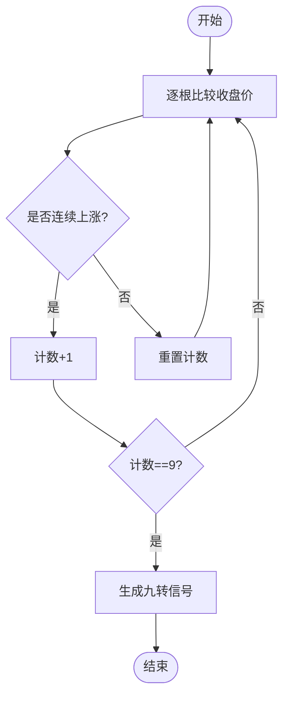
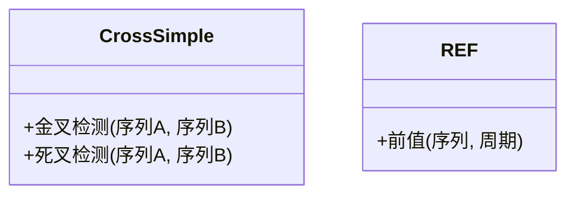
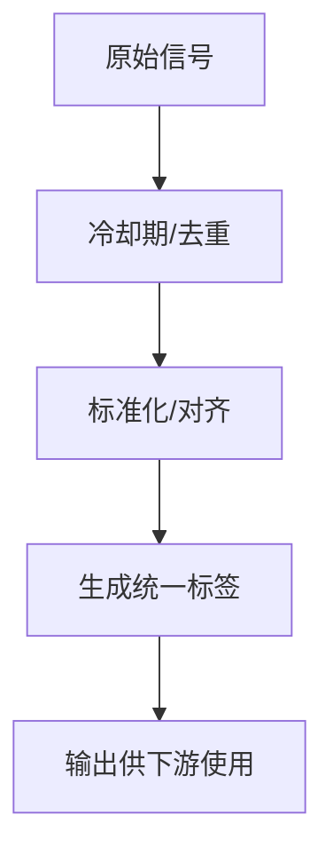
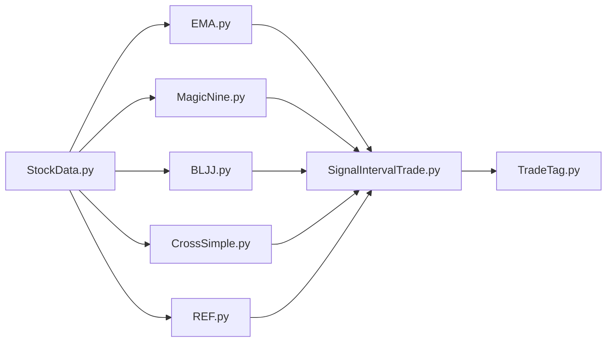

# 技术指标策略

<cite>
**本文引用的文件**   
- [EMA.py](file://MyProject/Model/Strategy/EMA.py)
- [MagicNine.py](file://MyProject/Model/Strategy/MagicNine.py)
- [BLJJ.py](file://MyProject/Model/Strategy/BLJJ.py)
- [CrossSimple.py](file://MyProject/Model/Strategy/CrossSimple.py)
- [REF.py](file://MyProject/Model/Strategy/REF.py)
- [SignalIntervalTrade.py](file://MyProject/Model/Strategy/SignalIntervalTrade.py)
- [TradeTag.py](file://MyProject/Model/Strategy/TradeTag.py)
- [8.节点分类实验_MACD_93.47%+画图_20240505.py](file://MyProject/Model/8.节点分类实验_MACD_93.47%+画图_20240505.py)
- [9.节点分类实验_MACD_93.47%+画图_20240505.py](file://MyProject/Model/9.节点分类实验_MACD_93.47%+画图_20240505.py)
- [StockData.py](file://MyProject/DataBase/StockData.py)
- [CsvHelper.py](file://MyProject/Helper/CsvHelper.py)
</cite>

## 目录
1. [简介](#简介)
2. [项目结构](#项目结构)
3. [核心组件](#核心组件)
4. [架构总览](#架构总览)
5. [详细组件分析](#详细组件分析)
6. [依赖关系分析](#依赖关系分析)
7. [性能与回测建议](#性能与回测建议)
8. [故障排查指南](#故障排查指南)
9. [结论](#结论)
10. [附录：参数调优清单](#附录参数调优清单)

## 简介
本文件围绕经典技术分析策略在工程中的落地实现，系统梳理并文档化以下策略：MACD交叉、EMA趋势跟踪、布林带突破、九转序列。内容覆盖指标计算方法、信号确认条件、风险控制机制、参数优化方法与历史回测要点，并提供各策略的使用方式与参数配置技巧的“代码片段路径”，便于快速定位与复用。

## 项目结构
本项目将策略逻辑集中在 MyProject/Model/Strategy 目录下，数据与辅助工具分别位于 DataBase 与 Helper 目录；示例脚本展示了如何组合策略进行节点分类与可视化。

图表来源
- [EMA.py](file://MyProject/Model/Strategy/EMA.py)
- [MagicNine.py](file://MyProject/Model/Strategy/MagicNine.py)
- [BLJJ.py](file://MyProject/Model/Strategy/BLJJ.py)
- [CrossSimple.py](file://MyProject/Model/Strategy/CrossSimple.py)
- [REF.py](file://MyProject/Model/Strategy/REF.py)
- [SignalIntervalTrade.py](file://MyProject/Model/Strategy/SignalIntervalTrade.py)
- [TradeTag.py](file://MyProject/Model/Strategy/TradeTag.py)
- [8.节点分类实验_MACD_93.47%+画图_20240505.py](file://MyProject/Model/8.节点分类实验_MACD_93.47%+画图_20240505.py)
- [9.节点分类实验_MACD_93.47%+画图_20240505.py](file://MyProject/Model/Model/9.节点分类实验_MACD_93.47%+画图_20240505.py)
- [StockData.py](file://MyProject/DataBase/StockData.py)
- [CsvHelper.py](file://MyProject/Helper/CsvHelper.py)

章节来源
- [EMA.py](file://MyProject/Model/Strategy/EMA.py)
- [MagicNine.py](file://MyProject/Model/Strategy/MagicNine.py)
- [BLJJ.py](file://MyProject/Model/Strategy/BLJJ.py)
- [CrossSimple.py](file://MyProject/Model/Strategy/CrossSimple.py)
- [REF.py](file://MyProject/Model/Strategy/REF.py)
- [SignalIntervalTrade.py](file://MyProject/Model/Strategy/SignalIntervalTrade.py)
- [TradeTag.py](file://MyProject/Model/Strategy/TradeTag.py)
- [8.节点分类实验_MACD_93.47%+画图_20240505.py](file://MyProject/Model/8.节点分类实验_MACD_93.47%+画图_20240505.py)
- [9.节点分类实验_MACD_93.47%+画图_20240505.py](file://MyProject/Model/9.节点分类实验_MACD_93.47%+画图_20240505.py)
- [StockData.py](file://MyProject/DataBase/StockData.py)
- [CsvHelper.py](file://MyProject/Helper/CsvHelper.py)

## 核心组件
- EMA（指数移动平均）：用于趋势跟踪与过滤震荡，支持多周期组合与动态权重。
- 九转序列（MagicNine）：基于连续同向收盘价计数识别潜在转折点。
- 布林带（BLJJ）：基于均值与标准差构建通道，捕捉波动率扩张与收缩。
- 简单交叉（CrossSimple）：通用金叉/死叉检测器，可复用于任意两条序列。
- 引用（REF）：提供固定周期前值引用，常用于滞后比较与形态构造。
- 信号间隔交易（SignalIntervalTrade）：对原始信号做去重与冷却期控制，降低频繁交易。
- 交易标签（TradeTag）：将策略输出映射为统一标签，便于后续模型训练或回测统计。

章节来源
- [EMA.py](file://MyProject/Model/Strategy/EMA.py)
- [MagicNine.py](file://MyProject/Model/Strategy/MagicNine.py)
- [BLJJ.py](file://MyProject/Model/Strategy/BLJJ.py)
- [CrossSimple.py](file://MyProject/Model/Strategy/CrossSimple.py)
- [REF.py](file://MyProject/Model/Strategy/REF.py)
- [SignalIntervalTrade.py](file://MyProject/Model/Strategy/SignalIntervalTrade.py)
- [TradeTag.py](file://MyProject/Model/Strategy/TradeTag.py)

## 架构总览
下图展示从数据读取到策略计算、信号生成与标签输出的整体流程。

图表来源
- [StockData.py](file://MyProject/DataBase/StockData.py)
- [CsvHelper.py](file://MyProject/Helper/CsvHelper.py)
- [EMA.py](file://MyProject/Model/Strategy/EMA.py)
- [MagicNine.py](file://MyProject/Model/Strategy/MagicNine.py)
- [BLJJ.py](file://MyProject/Model/Strategy/BLJJ.py)
- [CrossSimple.py](file://MyProject/Model/Strategy/CrossSimple.py)
- [REF.py](file://MyProject/Model/Strategy/REF.py)
- [SignalIntervalTrade.py](file://MyProject/Model/Strategy/SignalIntervalTrade.py)
- [TradeTag.py](file://MyProject/Model/Strategy/TradeTag.py)
- [8.节点分类实验_MACD_93.47%+画图_20240505.py](file://MyProject/Model/8.节点分类实验_MACD_93.47%+画图_20240505.py)
- [9.节点分类实验_MACD_93.47%+画图_20240505.py](file://MyProject/Model/9.节点分类实验_MACD_93.47%+画图_20240505.py)

## 详细组件分析

### MACD交叉策略（结合示例脚本）
- 指标计算
  - DIF：短期EMA与长期EMA之差
  - DEA：DIF的平滑（通常为EMA）
  - MACD柱：DIF与DEA之差的倍数
- 信号规则
  - 金叉：DIF上穿DEA
  - 死叉：DIF下穿DEA
  - 零轴穿越：作为二次确认或趋势强度参考
- 信号确认与风控
  - 结合成交量放大或价格位置（如相对均线）进行二次确认
  - 设置止损位（ATR或固定百分比）、止盈目标（风险回报比）
  - 冷却期避免连续反向信号导致频繁交易
- 参数优化
  - 短/长EMA窗口与DEA平滑窗口的网格搜索
  - 以夏普比率、最大回撤、胜率、盈亏比为目标函数
- 历史回测要点
  - 考虑滑点与手续费
  - 分样本外验证（滚动窗口或时间切分）
  - 关注不同市场状态下的稳定性

图表来源
- [8.节点分类实验_MACD_93.47%+画图_20240505.py](file://MyProject/Model/8.节点分类实验_MACD_93.47%+画图_20240505.py)
- [9.节点分类实验_MACD_93.47%+画图_20240505.py](file://MyProject/Model/9.节点分类实验_MACD_93.47%+画图_20240505.py)
- [CrossSimple.py](file://MyProject/Model/Strategy/CrossSimple.py)
- [SignalIntervalTrade.py](file://MyProject/Model/Strategy/SignalIntervalTrade.py)

章节来源
- [8.节点分类实验_MACD_93.47%+画图_20240505.py](file://MyProject/Model/8.节点分类实验_MACD_93.47%+画图_20240505.py)
- [9.节点分类实验_MACD_93.47%+画图_20240505.py](file://MyProject/Model/9.节点分类实验_MACD_93.47%+画图_20240505.py)
- [CrossSimple.py](file://MyProject/Model/Strategy/CrossSimple.py)
- [SignalIntervalTrade.py](file://MyProject/Model/Strategy/SignalIntervalTrade.py)

### EMA趋势跟踪策略
- 指标计算
  - EMA(t) = α·Price(t) + (1-α)·EMA(t-1)，其中 α=2/(N+1)
  - 多周期EMA组合用于趋势方向与斜率判断
- 信号规则
  - 短EMA上穿长EMA为多头信号，反之为空头
  - 价格相对EMA的偏离度可作为入场/出场阈值
- 参数优化
  - 短/长周期窗口、斜率阈值、偏离度阈值
  - 以波动率自适应调整（如基于ATR）
- 风险控制
  - 移动止损（追踪止损）
  - 趋势反转退出（EMA再次交叉或跌破支撑）
- 使用方式与参数配置技巧
  - 参考路径：[EMA.py](file://MyProject/Model/Strategy/EMA.py)
  - 典型参数范围：短周期5-20，长周期20-60；根据标的波动性微调

图表来源
- [EMA.py](file://MyProject/Model/Strategy/EMA.py)

章节来源
- [EMA.py](file://MyProject/Model/Strategy/EMA.py)

### 布林带突破策略
- 指标计算
  - 中轨：N日简单移动平均
  - 上/下轨：中轨 ± k×标准差
  - 带宽：(上轨-下轨)/中轨，衡量波动率
- 信号规则
  - 向上突破上轨且放量：做多信号
  - 向下突破下轨且放量：做空信号
  - 带宽收缩后扩张：趋势启动确认
- 参数优化
  - N（通常20）、k（通常2），结合ATR或历史波动率自适应
- 风险控制
  - 以中轨或下轨作为止损参考
  - 突破失败的回撤过滤（如收盘价重新回到通道内）
- 使用方式与参数配置技巧
  - 参考路径：[BLJJ.py](file://MyProject/Model/Strategy/BLJJ.py)
  - 在低波动环境中提高k或延长N以降低假突破

图表来源
- [BLJJ.py](file://MyProject/Model/Strategy/BLJJ.py)

章节来源
- [BLJJ.py](file://MyProject/Model/Strategy/BLJJ.py)

### 九转序列策略（转折点识别）
- 指标计算
  - 连续N根K线收盘价逐根递增（或递减）时计数至9
  - 计数达到9视为潜在转折信号
- 信号规则
  - 上升九转：见顶概率提升，考虑减仓或做空
  - 下降九转：见底概率提升，考虑加仓或做多
- 参数优化
  - 计数长度（常见为9），可结合相邻区间过滤
  - 配合趋势过滤器（如EMA方向）减少逆势信号
- 风险控制
  - 以最近波段高低点作为止损
  - 等待次级确认（如小级别反转形态）
- 使用方式与参数配置技巧
  - 参考路径：[MagicNine.py](file://MyProject/Model/Strategy/MagicNine.py)

图表来源
- [MagicNine.py](file://MyProject/Model/Strategy/MagicNine.py)

章节来源
- [MagicNine.py](file://MyProject/Model/Strategy/MagicNine.py)

### 通用交叉与引用工具
- 简单交叉（CrossSimple）
  - 功能：检测任意两条序列的金叉/死叉
  - 适用：MACD/DIF与DEA、双均线、RSI与阈值等
  - 参考路径：[CrossSimple.py](file://MyProject/Model/Strategy/CrossSimple.py)
- 引用（REF）
  - 功能：获取固定周期前的值，用于滞后比较与形态构造
  - 参考路径：[REF.py](file://MyProject/Model/Strategy/REF.py)

图表来源
- [CrossSimple.py](file://MyProject/Model/Strategy/CrossSimple.py)
- [REF.py](file://MyProject/Model/Strategy/REF.py)

章节来源
- [CrossSimple.py](file://MyProject/Model/Strategy/CrossSimple.py)
- [REF.py](file://MyProject/Model/Strategy/REF.py)

### 信号处理与标签映射
- 信号间隔交易（SignalIntervalTrade）
  - 作用：对原始信号施加冷却期、去重与频率限制，降低过度交易
  - 参考路径：[SignalIntervalTrade.py](file://MyProject/Model/Strategy/SignalIntervalTrade.py)
- 交易标签（TradeTag）
  - 作用：将策略输出标准化为统一标签，便于模型训练与回测统计
  - 参考路径：[TradeTag.py](file://MyProject/Model/Strategy/TradeTag.py)

图表来源
- [SignalIntervalTrade.py](file://MyProject/Model/Strategy/SignalIntervalTrade.py)
- [TradeTag.py](file://MyProject/Model/Strategy/TradeTag.py)

章节来源
- [SignalIntervalTrade.py](file://MyProject/Model/Strategy/SignalIntervalTrade.py)
- [TradeTag.py](file://MyProject/Model/Strategy/TradeTag.py)

## 依赖关系分析
- 策略模块之间耦合度较低，主要通过输入/输出序列交互
- 示例脚本聚合多个策略，形成特征工程管线
- 数据层提供统一的行情接口，便于替换数据源

图表来源
- [StockData.py](file://MyProject/DataBase/StockData.py)
- [EMA.py](file://MyProject/Model/Strategy/EMA.py)
- [MagicNine.py](file://MyProject/Model/Strategy/MagicNine.py)
- [BLJJ.py](file://MyProject/Model/Strategy/BLJJ.py)
- [CrossSimple.py](file://MyProject/Model/Strategy/CrossSimple.py)
- [REF.py](file://MyProject/Model/Strategy/REF.py)
- [SignalIntervalTrade.py](file://MyProject/Model/Strategy/SignalIntervalTrade.py)
- [TradeTag.py](file://MyProject/Model/Strategy/TradeTag.py)

章节来源
- [StockData.py](file://MyProject/DataBase/StockData.py)
- [EMA.py](file://MyProject/Model/Strategy/EMA.py)
- [MagicNine.py](file://MyProject/Model/Strategy/MagicNine.py)
- [BLJJ.py](file://MyProject/Model/Strategy/BLJJ.py)
- [CrossSimple.py](file://MyProject/Model/Strategy/CrossSimple.py)
- [REF.py](file://MyProject/Model/Strategy/REF.py)
- [SignalIntervalTrade.py](file://MyProject/Model/Strategy/SignalIntervalTrade.py)
- [TradeTag.py](file://MyProject/Model/Strategy/TradeTag.py)

## 性能与回测建议
- 指标计算复杂度
  - EMA/OHLC相关线性扫描 O(n)
  - 布林带标准差滑动窗口 O(n)
  - 九转序列线性扫描 O(n)
- 回测注意事项
  - 滑点与手续费建模
  - 样本外验证（时间切分/滚动窗口）
  - 不同市场状态（趋势/震荡）下的稳健性评估
- 参数优化方法
  - 网格搜索/随机搜索/贝叶斯优化
  - 目标函数：夏普比率、索提诺比率、最大回撤、收益回撤比
  - 正则化：惩罚过拟合参数组合（如最小周期约束）

## 故障排查指南
- 常见问题
  - 数据缺失或异常值导致指标失真：使用前进行清洗与填充
  - 信号过于频繁：增加冷却期或引入趋势过滤器
  - 回测结果不稳定：扩大样本量、加入样本外验证
- 调试建议
  - 打印关键中间序列（如EMA、DIF/DEA、布林带上下轨）
  - 可视化信号与止损/止盈点位，定位失效场景
  - 逐步启用策略模块，隔离问题来源

## 结论
本项目将经典技术指标策略模块化，提供了从指标计算、信号生成到标签输出的完整链路。通过合理的参数优化与风控机制，可在不同市场环境下获得更稳健的交易信号。建议在实盘前完成充分的样本外验证与压力测试。

## 附录：参数调优清单
- MACD交叉
  - 短/长EMA窗口、DEA平滑窗口、零轴穿越确认、冷却期
- EMA趋势跟踪
  - 短/长周期、斜率阈值、偏离度阈值、追踪止损步长
- 布林带突破
  - 窗口N、倍数k、带宽阈值、量能确认阈值
- 九转序列
  - 计数长度（默认9）、趋势过滤器开关、次级确认条件
- 信号处理
  - 冷却期长度、去重规则、频率上限
- 标签映射
  - 标签定义、持有期、收益口径（绝对/相对）