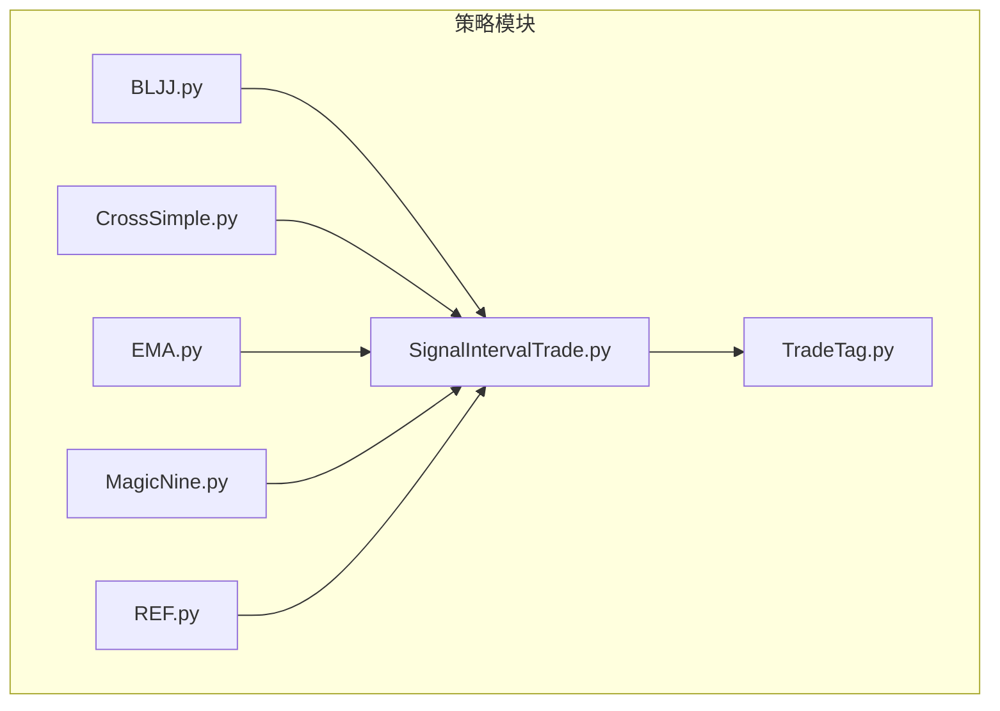
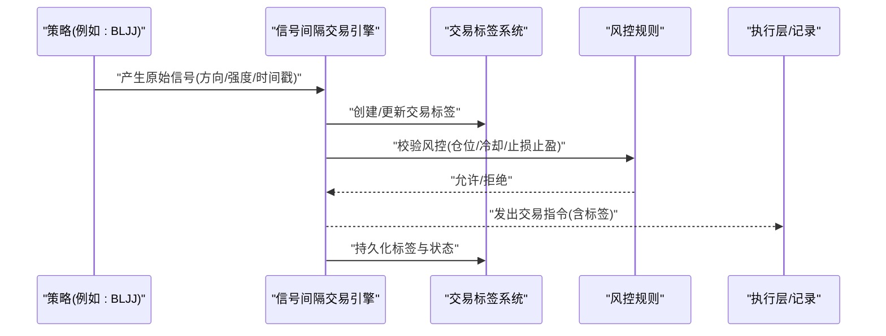
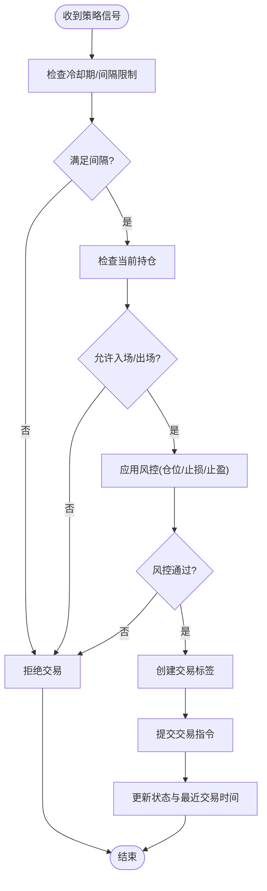
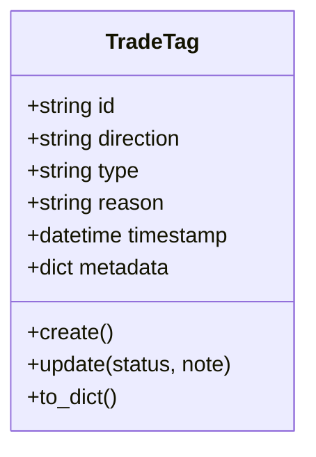
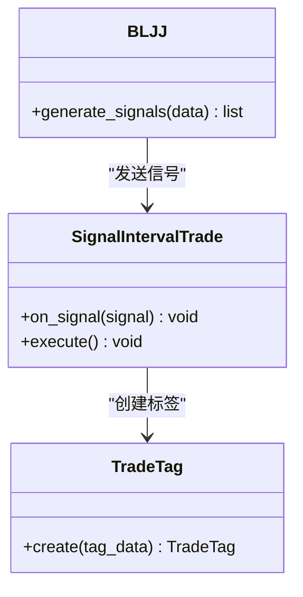
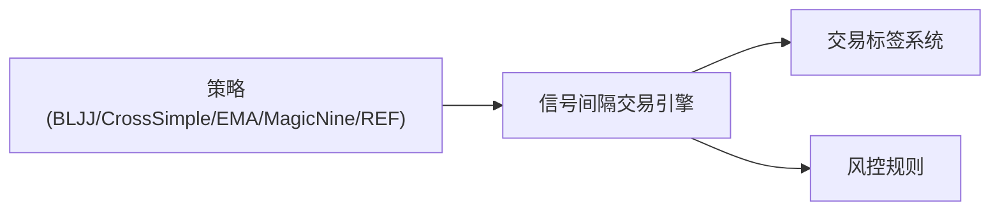

# 策略框架设计

<cite>
**本文引用的文件**   
- [SignalIntervalTrade.py](file://MyProject/Model/Strategy/SignalIntervalTrade.py)
- [TradeTag.py](file://MyProject/Model/Strategy/TradeTag.py)
- [BLJJ.py](file://MyProject/Model/Strategy/BLJJ.py)
- [CrossSimple.py](file://MyProject/Model/Strategy/CrossSimple.py)
- [EMA.py](file://MyProject/Model/Strategy/EMA.py)
- [MagicNine.py](file://MyProject/Model/Strategy/MagicNine.py)
- [REF.py](file://MyProject/Model/Strategy/REF.py)
</cite>

## 目录
1. [简介](#简介)
2. [项目结构](#项目结构)
3. [核心组件](#核心组件)
4. [架构总览](#架构总览)
5. [详细组件分析](#详细组件分析)
6. [依赖关系分析](#依赖关系分析)
7. [性能考量](#性能考量)
8. [故障排查指南](#故障排查指南)
9. [结论](#结论)
10. [附录](#附录)

## 简介
本文件面向策略框架的设计与实现，聚焦于交易策略系统的整体架构、策略基类与接口规范、信号生成机制、入场出场条件判断逻辑、风险管理规则、参数配置与生命周期管理。重点阐述“信号间隔交易”的核心算法与“TradeTag标签系统”的工作原理，并提供策略开发的最佳实践与设计模式，以及策略与主系统集成方式的说明。

## 项目结构
策略相关代码集中在 MyProject/Model/Strategy 目录下，包含若干具体策略实现与通用基础设施：
- SignalIntervalTrade.py：信号间隔交易核心算法与调度器
- TradeTag.py：交易标签系统与状态机
- BLJJ.py / CrossSimple.py / EMA.py / MagicNine.py / REF.py：基于不同指标或规则的示例策略

图表来源
- [SignalIntervalTrade.py](file://MyProject/Model/Strategy/SignalIntervalTrade.py)
- [TradeTag.py](file://MyProject/Model/Strategy/TradeTag.py)
- [BLJJ.py](file://MyProject/Model/Strategy/BLJJ.py)
- [CrossSimple.py](file://MyProject/Model/Strategy/CrossSimple.py)
- [EMA.py](file://MyProject/Model/Strategy/EMA.py)
- [MagicNine.py](file://MyProject/Model/Strategy/MagicNine.py)
- [REF.py](file://MyProject/Model/Strategy/REF.py)

章节来源
- [SignalIntervalTrade.py](file://MyProject/Model/Strategy/SignalIntervalTrade.py)
- [TradeTag.py](file://MyProject/Model/Strategy/TradeTag.py)
- [BLJJ.py](file://MyProject/Model/Strategy/BLJJ.py)
- [CrossSimple.py](file://MyProject/Model/Strategy/CrossSimple.py)
- [EMA.py](file://MyProject/Model/Strategy/EMA.py)
- [MagicNine.py](file://MyProject/Model/Strategy/MagicNine.py)
- [REF.py](file://MyProject/Model/Strategy/REF.py)

## 核心组件
- 信号间隔交易引擎（SignalIntervalTrade）
  - 负责接收外部策略产生的信号，结合时间间隔约束与风控规则，决定是否执行交易动作。
  - 维护当前持仓状态、最近一次交易时间、冷却期等关键变量。
- 交易标签系统（TradeTag）
  - 提供统一的交易标签定义与状态机，用于标记交易方向、原因、阶段与元数据。
  - 支持在回测与实盘中对交易进行追踪、统计与可视化。
- 策略实现（BLJJ、CrossSimple、EMA、MagicNine、REF）
  - 各策略通过统一接口产生原始信号（如买入/卖出/持有），由信号间隔交易引擎进行二次过滤与执行控制。

章节来源
- [SignalIntervalTrade.py](file://MyProject/Model/Strategy/SignalIntervalTrade.py)
- [TradeTag.py](file://MyProject/Model/Strategy/TradeTag.py)
- [BLJJ.py](file://MyProject/Model/Strategy/BLJJ.py)
- [CrossSimple.py](file://MyProject/Model/Strategy/CrossSimple.py)
- [EMA.py](file://MyProject/Model/Strategy/EMA.py)
- [MagicNine.py](file://MyProject/Model/Strategy/MagicNine.py)
- [REF.py](file://MyProject/Model/Strategy/REF.py)

## 架构总览
下图展示了策略框架的整体交互流程：上层策略产生信号，信号进入间隔交易引擎，引擎依据标签系统与风控规则输出最终交易指令，并更新内部状态。

图表来源
- [SignalIntervalTrade.py](file://MyProject/Model/Strategy/SignalIntervalTrade.py)
- [TradeTag.py](file://MyProject/Model/Strategy/TradeTag.py)
- [BLJJ.py](file://MyProject/Model/Strategy/BLJJ.py)

## 详细组件分析

### 信号间隔交易引擎（SignalIntervalTrade）
职责与能力
- 接收策略信号并进行时间间隔控制，避免频繁交易。
- 根据当前持仓与冷却期判断是否允许入场或出场。
- 将交易决策与标签系统对接，确保每笔交易可追溯。
- 暴露统一的接口供上层策略调用。

关键流程（入场）

图表来源
- [SignalIntervalTrade.py](file://MyProject/Model/Strategy/SignalIntervalTrade.py)

章节来源
- [SignalIntervalTrade.py](file://MyProject/Model/Strategy/SignalIntervalTrade.py)

### 交易标签系统（TradeTag）
职责与能力
- 定义交易标签的字段与枚举值（如方向、类型、原因、阶段）。
- 提供标签的创建、查询、更新与序列化方法。
- 与信号间隔交易引擎协作，为每笔交易打上唯一标识与上下文信息。

标签数据结构（概念性）

图表来源
- [TradeTag.py](file://MyProject/Model/Strategy/TradeTag.py)

章节来源
- [TradeTag.py](file://MyProject/Model/Strategy/TradeTag.py)

### 示例策略：BLJJ
职责与能力
- 基于特定指标或规则计算买卖信号。
- 将信号以统一格式返回给信号间隔交易引擎。

与其他组件的关系

图表来源
- [BLJJ.py](file://MyProject/Model/Strategy/BLJJ.py)
- [SignalIntervalTrade.py](file://MyProject/Model/Strategy/SignalIntervalTrade.py)
- [TradeTag.py](file://MyProject/Model/Strategy/TradeTag.py)

章节来源
- [BLJJ.py](file://MyProject/Model/Strategy/BLJJ.py)

### 其他示例策略（CrossSimple、EMA、MagicNine、REF）
这些策略遵循相同的信号生成接口，便于替换与组合。它们各自封装不同的指标或交叉逻辑，最终都通过统一接口向信号间隔交易引擎输出信号。

章节来源
- [CrossSimple.py](file://MyProject/Model/Strategy/CrossSimple.py)
- [EMA.py](file://MyProject/Model/Strategy/EMA.py)
- [MagicNine.py](file://MyProject/Model/Strategy/MagicNine.py)
- [REF.py](file://MyProject/Model/Strategy/REF.py)

## 依赖关系分析
- 策略到引擎：所有策略均依赖信号间隔交易引擎的统一接口，保证一致的信号处理流程。
- 引擎到标签系统：引擎在每次交易决策时创建或更新标签，确保交易可追踪。
- 引擎到风控：引擎在执行前调用风控规则，防止过度交易与风险失控。

图表来源
- [SignalIntervalTrade.py](file://MyProject/Model/Strategy/SignalIntervalTrade.py)
- [TradeTag.py](file://MyProject/Model/Strategy/TradeTag.py)
- [BLJJ.py](file://MyProject/Model/Strategy/BLJJ.py)
- [CrossSimple.py](file://MyProject/Model/Strategy/CrossSimple.py)
- [EMA.py](file://MyProject/Model/Strategy/EMA.py)
- [MagicNine.py](file://MyProject/Model/Strategy/MagicNine.py)
- [REF.py](file://MyProject/Model/Strategy/REF.py)

章节来源
- [SignalIntervalTrade.py](file://MyProject/Model/Strategy/SignalIntervalTrade.py)
- [TradeTag.py](file://MyProject/Model/Strategy/TradeTag.py)
- [BLJJ.py](file://MyProject/Model/Strategy/BLJJ.py)
- [CrossSimple.py](file://MyProject/Model/Strategy/CrossSimple.py)
- [EMA.py](file://MyProject/Model/Strategy/EMA.py)
- [MagicNine.py](file://MyProject/Model/Strategy/MagicNine.py)
- [REF.py](file://MyProject/Model/Strategy/REF.py)

## 性能考量
- 信号去重与合并：在高频场景下，建议对相邻时间步的信号进行去重或合并，降低引擎压力。
- 批量处理：若策略批量生成信号，应使用批处理方法减少函数调用开销。
- 标签序列化优化：标签对象在持久化时应按需序列化，避免不必要的I/O。
- 缓存最近状态：缓存最近交易时间与持仓状态，减少重复计算。

## 故障排查指南
常见问题与建议
- 信号未触发交易
  - 检查冷却期与间隔限制是否过短导致被拒绝。
  - 确认风控规则是否阻止了交易（如仓位上限、止损止盈触发）。
- 标签缺失或不一致
  - 核对标签创建时机与字段完整性。
  - 确认标签ID的唯一性与更新逻辑。
- 策略信号异常
  - 验证输入数据的长度与有效性。
  - 打印关键中间变量，定位指标计算错误。

章节来源
- [SignalIntervalTrade.py](file://MyProject/Model/Strategy/SignalIntervalTrade.py)
- [TradeTag.py](file://MyProject/Model/Strategy/TradeTag.py)

## 结论
本策略框架通过“信号间隔交易引擎 + 交易标签系统”的组合，实现了从策略信号到交易执行的标准化流程。该设计具备良好的扩展性与可观测性，便于快速集成多种策略并统一管理交易生命周期。建议在后续迭代中完善风控规则库与监控告警，进一步提升系统的稳健性与可维护性。

## 附录
- 策略接口规范（概念性）
  - generate_signals(data) -> list[signal]
  - signal 字段包括：方向、强度、时间戳、附加元数据
- 参数配置方法（概念性）
  - 通过配置文件或命令行参数注入策略与引擎参数
  - 支持热重载与动态切换策略
- 生命周期管理（概念性）
  - 初始化：加载数据与参数
  - 运行：逐周期生成信号并交由引擎处理
  - 收尾：汇总标签与统计结果，输出报告