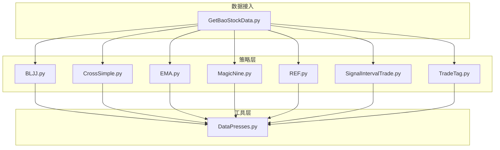
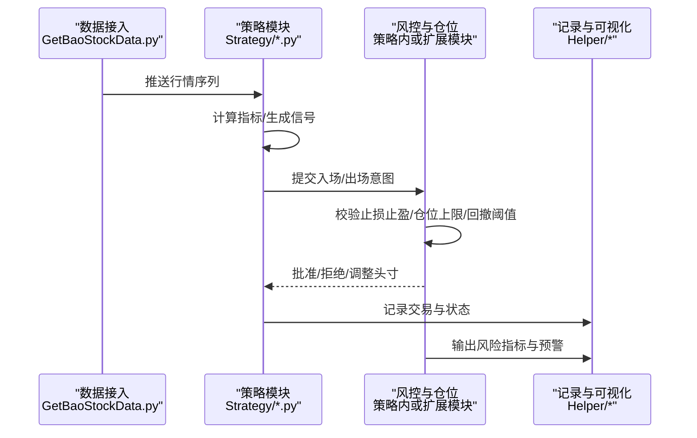
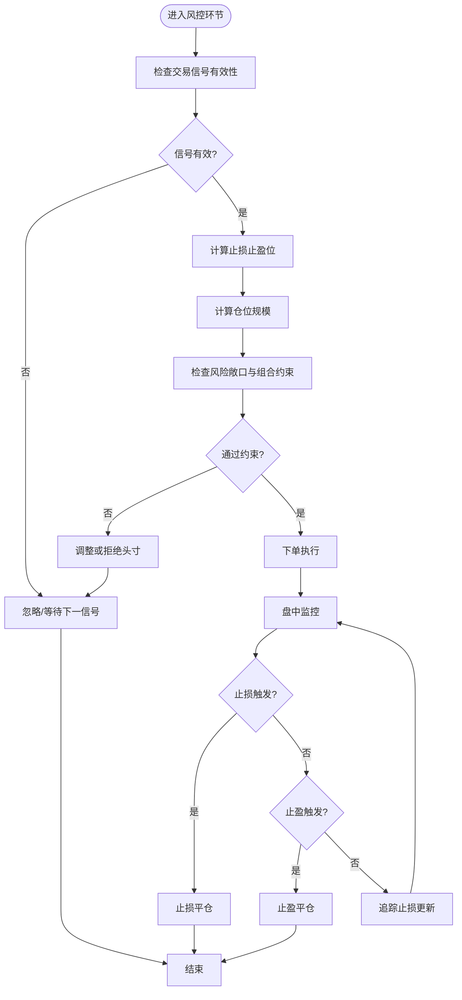
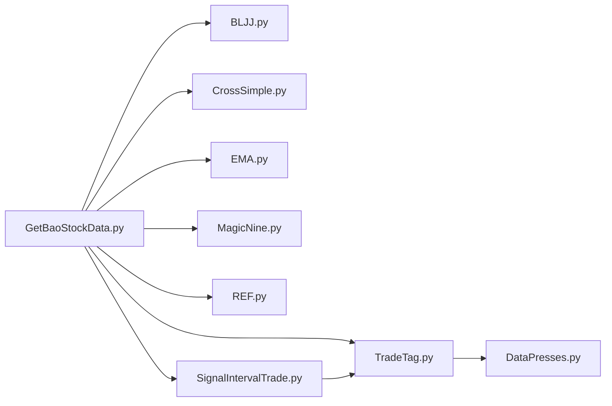

# 风险管理与仓位控制

<cite>
**本文引用的文件**   
- [MyProject/Model/Strategy/BLJJ.py](file://MyProject/Model/Strategy/BLJJ.py)
- [MyProject/Model/Strategy/CrossSimple.py](file://MyProject/Model/Strategy/CrossSimple.py)
- [MyProject/Model/Strategy/EMA.py](file://MyProject/Model/Strategy/EMA.py)
- [MyProject/Model/Strategy/MagicNine.py](file://MyProject/Model/Strategy/MagicNine.py)
- [MyProject/Model/Strategy/REF.py](file://MyProject/Model/Strategy/REF.py)
- [MyProject/Model/Strategy/SignalIntervalTrade.py](file://MyProject/Model/Strategy/SignalIntervalTrade.py)
- [MyProject/Model/Strategy/TradeTag.py](file://MyProject/Model/Strategy/TradeTag.py)
- [MyProject/Helper/DataPresses.py](file://MyProject/Helper/DataPresses.py)
- [GetBaoStockData.py](file://GetBaoStockData.py)
</cite>

## 目录
1. [简介](#简介)
2. [项目结构](#项目结构)
3. [核心组件](#核心组件)
4. [架构总览](#架构总览)
5. [详细组件分析](#详细组件分析)
6. [依赖关系分析](#依赖关系分析)
7. [性能与稳定性考量](#性能与稳定性考量)
8. [故障排查指南](#故障排查指南)
9. [结论](#结论)
10. [附录：参数配置与示例路径](#附录参数配置与示例路径)

## 简介
本文件面向交易系统的风险管理与仓位控制，围绕止损止盈、仓位大小计算、资金分配原则、动态仓位调整、最大回撤控制、风险敞口管理、压力测试与极端行情应对、以及风险指标监控预警等方面提供系统化说明。文档同时给出在现有代码库中的定位与参考路径，帮助读者快速落地实施。

## 项目结构
本项目采用“策略 + 工具”的模块化组织方式：
- 策略层位于 MyProject/Model/Strategy，包含多种信号生成与交易逻辑实现；
- 辅助工具位于 MyProject/Helper，涵盖数据处理、绘图、日志等能力；
- 数据获取入口位于根目录 GetBaoStockData.py。

图表来源
- [MyProject/Model/Strategy/BLJJ.py](file://MyProject/Model/Strategy/BLJJ.py)
- [MyProject/Model/Strategy/CrossSimple.py](file://MyProject/Model/Strategy/CrossSimple.py)
- [MyProject/Model/Strategy/EMA.py](file://MyProject/Model/Strategy/EMA.py)
- [MyProject/Model/Strategy/MagicNine.py](file://MyProject/Model/Strategy/MagicNine.py)
- [MyProject/Model/Strategy/REF.py](file://MyProject/Model/Strategy/REF.py)
- [MyProject/Model/Strategy/SignalIntervalTrade.py](file://MyProject/Model/Strategy/SignalIntervalTrade.py)
- [MyProject/Model/Strategy/TradeTag.py](file://MyProject/Model/Strategy/TradeTag.py)
- [MyProject/Helper/DataPresses.py](file://MyProject/Helper/DataPresses.py)
- [GetBaoStockData.py](file://GetBaoStockData.py)

章节来源
- [MyProject/Model/Strategy/BLJJ.py](file://MyProject/Model/Strategy/BLJJ.py)
- [MyProject/Model/Strategy/CrossSimple.py](file://MyProject/Model/Strategy/CrossSimple.py)
- [MyProject/Model/Strategy/EMA.py](file://MyProject/Model/Strategy/EMA.py)
- [MyProject/Model/Strategy/MagicNine.py](file://MyProject/Model/Strategy/MagicNine.py)
- [MyProject/Model/Strategy/REF.py](file://MyProject/Model/Strategy/REF.py)
- [MyProject/Model/Strategy/SignalIntervalTrade.py](file://MyProject/Model/Strategy/SignalIntervalTrade.py)
- [MyProject/Model/Strategy/TradeTag.py](file://MyProject/Model/Strategy/TradeTag.py)
- [MyProject/Helper/DataPresses.py](file://MyProject/Helper/DataPresses.py)
- [GetBaoStockData.py](file://GetBaoStockData.py)

## 核心组件
- 信号与交易策略模块：负责产生买卖信号、标记交易事件、处理交易间隔与条件过滤。
- 数据与压力测试工具：用于构建市场压力场景、评估策略稳健性。
- 数据接入模块：统一从外部数据源拉取行情，为策略与风控提供输入。

章节来源
- [MyProject/Model/Strategy/SignalIntervalTrade.py](file://MyProject/Model/Strategy/SignalIntervalTrade.py)
- [MyProject/Model/Strategy/TradeTag.py](file://MyProject/Model/Strategy/TradeTag.py)
- [MyProject/Helper/DataPresses.py](file://MyProject/Helper/DataPresses.py)
- [GetBaoStockData.py](file://GetBaoStockData.py)

## 架构总览
下图展示从数据接入到策略信号、再到风控与仓位管理的端到端流程。

图表来源
- [GetBaoStockData.py](file://GetBaoStockData.py)
- [MyProject/Model/Strategy/SignalIntervalTrade.py](file://MyProject/Model/Strategy/SignalIntervalTrade.py)
- [MyProject/Model/Strategy/TradeTag.py](file://MyProject/Model/Strategy/TradeTag.py)
- [MyProject/Helper/DataPresses.py](file://MyProject/Helper/DataPresses.py)

## 详细组件分析

### 止损止盈与出场逻辑
- 目标：在信号确认后，依据价格行为或波动率设定止损止盈位，并在触发时自动平仓或减仓。
- 建议实现要点：
  - 基于ATR或固定百分比设置初始止损；
  - 使用追踪止损跟随趋势，保护利润；
  - 多时间框架确认，避免假突破导致的频繁止损。
- 在本仓库中的可参考位置：
  - 信号与交易间隔控制：[SignalIntervalTrade.py](file://MyProject/Model/Strategy/SignalIntervalTrade.py)
  - 交易标签与事件标记：[TradeTag.py](file://MyProject/Model/Strategy/TradeTag.py)

章节来源
- [MyProject/Model/Strategy/SignalIntervalTrade.py](file://MyProject/Model/Strategy/SignalIntervalTrade.py)
- [MyProject/Model/Strategy/TradeTag.py](file://MyProject/Model/Strategy/TradeTag.py)

### 仓位大小计算与资金分配
- 目标：根据账户净值、风险预算与标的波动率确定每笔交易的头寸规模，并在全组合层面进行资金分配。
- 建议实现要点：
  - 单笔风险法：按账户净值的固定比例（如1%）作为单笔最大亏损；
  - 波动率倒数加权：高波动标的降低仓位，低波动标的提高仓位；
  - 组合约束：单标的/行业/风格暴露上限，避免集中度风险。
- 在本仓库中的可参考位置：
  - 策略通用接口与参数化设计（便于注入仓位规则）：[BLJJ.py](file://MyProject/Model/Strategy/BLJJ.py)、[CrossSimple.py](file://MyProject/Model/Strategy/CrossSimple.py)、[EMA.py](file://MyProject/Model/Strategy/EMA.py)、[MagicNine.py](file://MyProject/Model/Strategy/MagicNine.py)、[REF.py](file://MyProject/Model/Strategy/REF.py)

章节来源
- [MyProject/Model/Strategy/BLJJ.py](file://MyProject/Model/Strategy/BLJJ.py)
- [MyProject/Model/Strategy/CrossSimple.py](file://MyProject/Model/Strategy/CrossSimple.py)
- [MyProject/Model/Strategy/EMA.py](file://MyProject/Model/Strategy/EMA.py)
- [MyProject/Model/Strategy/MagicNine.py](file://MyProject/Model/Strategy/MagicNine.py)
- [MyProject/Model/Strategy/REF.py](file://MyProject/Model/Strategy/REF.py)

### 动态仓位调整算法
- 目标：根据实时风险指标（如波动率、相关性、回撤）动态增减仓位，平滑收益曲线。
- 建议实现要点：
  - 波动率缩放：当 realized volatility 上升时按比例降仓；
  - 回撤熔断：累计回撤超过阈值时暂停开新仓或强制减仓；
  - 信号置信度加权：对高质量信号给予更高权重。
- 在本仓库中的可参考位置：
  - 信号与交易间隔控制：[SignalIntervalTrade.py](file://MyProject/Model/Strategy/SignalIntervalTrade.py)
  - 交易标签与事件标记：[TradeTag.py](file://MyProject/Model/Strategy/TradeTag.py)

章节来源
- [MyProject/Model/Strategy/SignalIntervalTrade.py](file://MyProject/Model/Strategy/SignalIntervalTrade.py)
- [MyProject/Model/Strategy/TradeTag.py](file://MyProject/Model/Strategy/TradeTag.py)

### 最大回撤控制与风险敞口管理
- 目标：限制组合层面的最大回撤与单一方向的风险暴露。
- 建议实现要点：
  - 全局回撤阈值与恢复期机制；
  - 多头/空头净敞口上限；
  - 行业/因子暴露限额。
- 在本仓库中的可参考位置：
  - 交易标签与事件标记（可用于统计与聚合）：[TradeTag.py](file://MyProject/Model/Strategy/TradeTag.py)

章节来源
- [MyProject/Model/Strategy/TradeTag.py](file://MyProject/Model/Strategy/TradeTag.py)

### 压力测试与极端市场应对
- 目标：通过历史回测与合成冲击场景评估策略韧性。
- 建议实现要点：
  - 使用历史极端时段（如流动性枯竭、跳空缺口）进行重放；
  - 构造冲击情景（波动率飙升、价差扩大、滑点增加）；
  - 评估在极端条件下的最大回撤、胜率、盈亏比变化。
- 在本仓库中的可参考位置：
  - 数据压力与场景构造工具：[DataPresses.py](file://MyProject/Helper/DataPresses.py)

章节来源
- [MyProject/Helper/DataPresses.py](file://MyProject/Helper/DataPresses.py)

### 风险指标监控与预警系统
- 目标：实时监控关键风险指标，触发预警与自动干预。
- 建议实现要点：
  - 指标包括：VaR、CVaR、波动率、相关性、换手率、持仓集中度、回撤；
  - 预警分级：提示、减仓、清仓；
  - 记录与可视化：将指标写入日志并绘制时序图。
- 在本仓库中的可参考位置：
  - 数据压力与场景构造（可作为监控输入）：[DataPresses.py](file://MyProject/Helper/DataPresses.py)
  - 交易标签与事件标记（用于统计指标）：[TradeTag.py](file://MyProject/Model/Strategy/TradeTag.py)

章节来源
- [MyProject/Helper/DataPresses.py](file://MyProject/Helper/DataPresses.py)
- [MyProject/Model/Strategy/TradeTag.py](file://MyProject/Model/Strategy/TradeTag.py)

### 关键流程图：止损止盈与动态调仓

图表来源
- [MyProject/Model/Strategy/SignalIntervalTrade.py](file://MyProject/Model/Strategy/SignalIntervalTrade.py)
- [MyProject/Model/Strategy/TradeTag.py](file://MyProject/Model/Strategy/TradeTag.py)

## 依赖关系分析
- 数据接入层：GetBaoStockData.py 为各策略提供统一的行情输入。
- 策略层：多个策略文件各自封装信号生成逻辑，便于并行回测与对比。
- 工具层：DataPresses.py 提供数据压力与场景构造能力，支撑风控与压力测试。

图表来源
- [GetBaoStockData.py](file://GetBaoStockData.py)
- [MyProject/Model/Strategy/BLJJ.py](file://MyProject/Model/Strategy/BLJJ.py)
- [MyProject/Model/Strategy/CrossSimple.py](file://MyProject/Model/Strategy/CrossSimple.py)
- [MyProject/Model/Strategy/EMA.py](file://MyProject/Model/Strategy/EMA.py)
- [MyProject/Model/Strategy/MagicNine.py](file://MyProject/Model/Strategy/MagicNine.py)
- [MyProject/Model/Strategy/REF.py](file://MyProject/Model/Strategy/REF.py)
- [MyProject/Model/Strategy/SignalIntervalTrade.py](file://MyProject/Model/Strategy/SignalIntervalTrade.py)
- [MyProject/Model/Strategy/TradeTag.py](file://MyProject/Model/Strategy/TradeTag.py)
- [MyProject/Helper/DataPresses.py](file://MyProject/Helper/DataPresses.py)

章节来源
- [GetBaoStockData.py](file://GetBaoStockData.py)
- [MyProject/Model/Strategy/BLJJ.py](file://MyProject/Model/Strategy/BLJJ.py)
- [MyProject/Model/Strategy/CrossSimple.py](file://MyProject/Model/Strategy/CrossSimple.py)
- [MyProject/Model/Strategy/EMA.py](file://MyProject/Model/Strategy/EMA.py)
- [MyProject/Model/Strategy/MagicNine.py](file://MyProject/Model/Strategy/MagicNine.py)
- [MyProject/Model/Strategy/REF.py](file://MyProject/Model/Strategy/REF.py)
- [MyProject/Model/Strategy/SignalIntervalTrade.py](file://MyProject/Model/Strategy/SignalIntervalTrade.py)
- [MyProject/Model/Strategy/TradeTag.py](file://MyProject/Model/Strategy/TradeTag.py)
- [MyProject/Helper/DataPresses.py](file://MyProject/Helper/DataPresses.py)

## 性能与稳定性考量
- 计算效率：指标与信号计算尽量向量化，减少循环；批量处理订单与风控校验。
- I/O优化：日志与指标落盘采用异步写入，避免阻塞主流程。
- 内存管理：大样本回测中分块加载数据，及时释放中间变量。
- 鲁棒性：对缺失值、异常价格、停牌等做前置清洗与容错处理。

## 故障排查指南
- 常见问题
  - 信号频繁触发导致过度交易：检查信号过滤与交易间隔逻辑。
  - 止损过紧被噪音击穿：结合波动率自适应调整止损距离。
  - 仓位过大引发回撤超标：引入波动率缩放与组合约束。
  - 极端行情下滑点与流动性不足：在压力测试中加入滑点与冲击成本假设。
- 定位方法
  - 利用交易标签与事件标记进行归因分析：[TradeTag.py](file://MyProject/Model/Strategy/TradeTag.py)
  - 使用数据压力工具复现问题场景：[DataPresses.py](file://MyProject/Helper/DataPresses.py)
  - 核对数据接入质量与完整性：[GetBaoStockData.py](file://GetBaoStockData.py)

章节来源
- [MyProject/Model/Strategy/TradeTag.py](file://MyProject/Model/Strategy/TradeTag.py)
- [MyProject/Helper/DataPresses.py](file://MyProject/Helper/DataPresses.py)
- [GetBaoStockData.py](file://GetBaoStockData.py)

## 结论
通过将信号生成、风控与仓位管理解耦，并以数据压力测试与指标监控为抓手，可在保证策略收益的同时有效控制下行风险。建议在现有策略文件中逐步注入仓位与风控规则，并通过标签与日志完善可观测性与可回溯性。

## 附录：参数配置与示例路径
- 止损止盈参数
  - 参考路径：[SignalIntervalTrade.py](file://MyProject/Model/Strategy/SignalIntervalTrade.py)、[TradeTag.py](file://MyProject/Model/Strategy/TradeTag.py)
- 仓位大小与资金分配
  - 参考路径：[BLJJ.py](file://MyProject/Model/Strategy/BLJJ.py)、[CrossSimple.py](file://MyProject/Model/Strategy/CrossSimple.py)、[EMA.py](file://MyProject/Model/Strategy/EMA.py)、[MagicNine.py](file://MyProject/Model/Strategy/MagicNine.py)、[REF.py](file://MyProject/Model/Strategy/REF.py)
- 动态仓位调整与回撤熔断
  - 参考路径：[SignalIntervalTrade.py](file://MyProject/Model/Strategy/SignalIntervalTrade.py)、[TradeTag.py](file://MyProject/Model/Strategy/TradeTag.py)
- 压力测试与极端场景
  - 参考路径：[DataPresses.py](file://MyProject/Helper/DataPresses.py)
- 数据接入与清洗
  - 参考路径：[GetBaoStockData.py](file://GetBaoStockData.py)