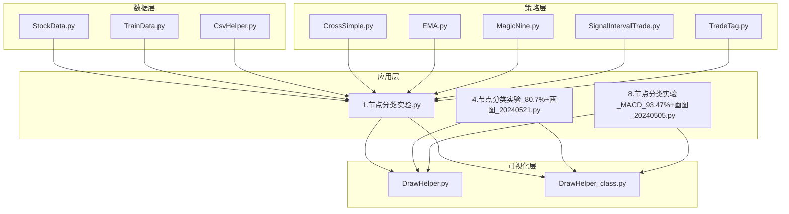
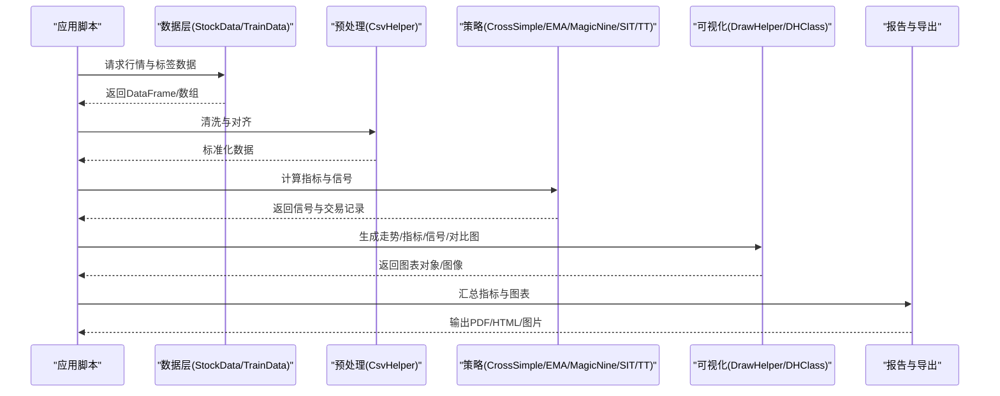
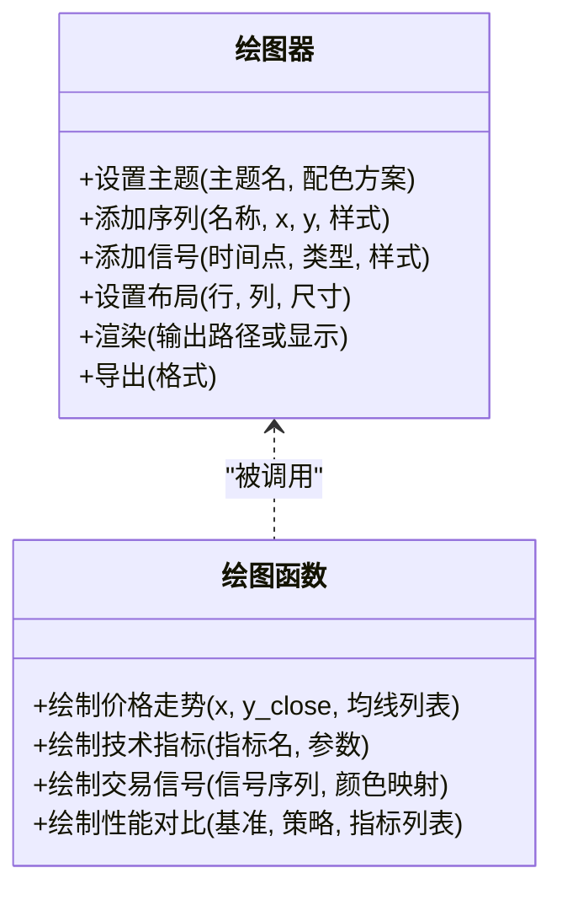
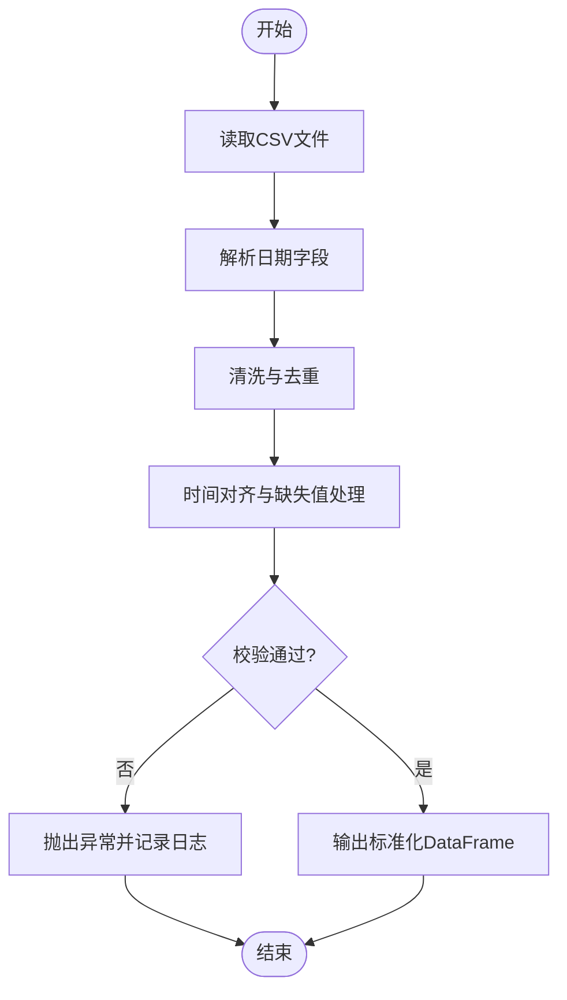
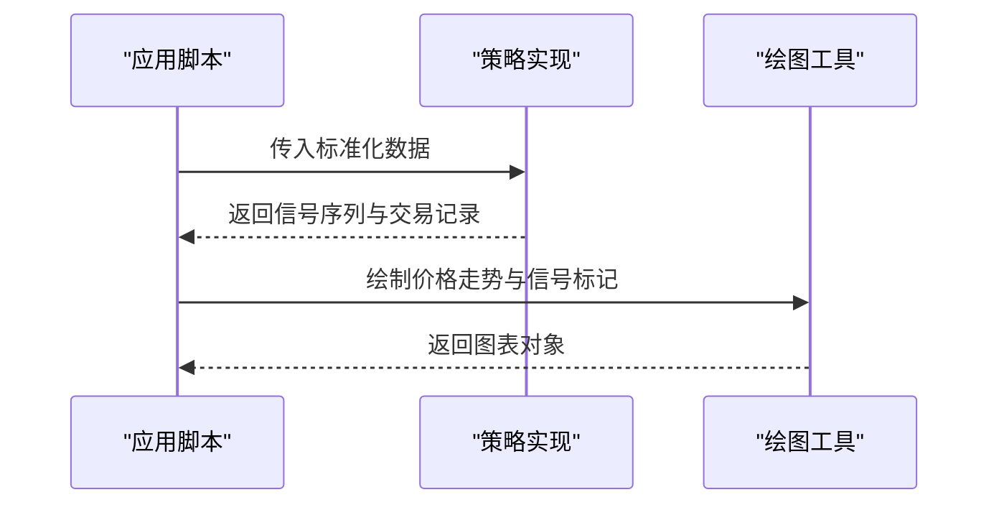
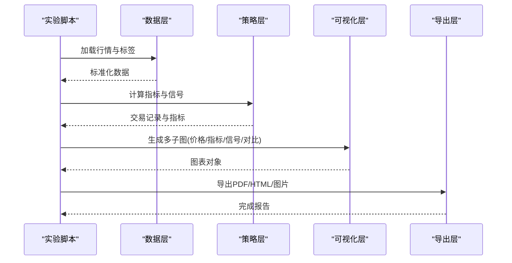

# 可视化与结果分析

<cite>
**本文引用的文件**   
- [DrawHelper.py](file://MyProject/Helper/DrawHelper.py)
- [DrawHelper_class.py](file://MyProject/Helper/DrawHelper_class.py)
- [CsvHelper.py](file://MyProject/Helper/CsvHelper.py)
- [StockData.py](file://MyProject/DataBase/StockData.py)
- [TrainData.py](file://MyProject/DataBase/TrainData.py)
- [CrossSimple.py](file://MyProject/Model/Strategy/CrossSimple.py)
- [EMA.py](file://MyProject/Model/Strategy/EMA.py)
- [MagicNine.py](file://MyProject/Model/Strategy/MagicNine.py)
- [SignalIntervalTrade.py](file://MyProject/Model/Strategy/SignalIntervalTrade.py)
- [TradeTag.py](file://MyProject/Model/Strategy/TradeTag.py)
- [1.节点分类实验.py](file://MyProject/Model/1.节点分类实验.py)
- [4.节点分类实验_80.7%+画图_20240521.py](file://MyProject/Model/4.节点分类实验_80.7%+画图_20240521.py)
- [8.节点分类实验_MACD_93.47%+画图_20240505.py](file://MyProject/Model/8.节点分类实验_MACD_93.47%+画图_20240505.py)
</cite>

## 目录
1. [简介](#简介)
2. [项目结构](#项目结构)
3. [核心组件](#核心组件)
4. [架构总览](#架构总览)
5. [详细组件分析](#详细组件分析)
6. [依赖关系分析](#依赖关系分析)
7. [性能考虑](#性能考虑)
8. [故障排查指南](#故障排查指南)
9. [结论](#结论)
10. [附录](#附录)

## 简介
本章节面向“可视化与结果分析”模块，目标是帮助读者快速掌握：
- 如何使用图表绘制工具生成股价走势图、技术指标图、交易信号图和性能对比图
- 如何配置可视化组件的样式与布局
- 如何进行策略收益曲线、回撤分析、夏普比率计算与风险指标评估
- 如何实现交互式可视化并与Web界面集成
- 如何在大数据量场景下优化渲染性能并适配移动端
- 如何通过示例脚本创建专业分析报告与自动化报表

## 项目结构
本项目将数据、策略、辅助工具与可视化能力分层组织。与可视化与结果分析直接相关的代码主要位于 Helper 与 Model 子目录中：
- Helper/DrawHelper.py、Helper/DrawHelper_class.py：封装绘图函数与类，提供统一绘图接口
- Helper/CsvHelper.py：CSV读写与数据预处理，为可视化提供标准化输入
- DataBase/StockData.py、DataBase/TrainData.py：行情与训练数据加载，支撑可视化数据源
- Model/Strategy/*：策略实现（如均线交叉、MACD等），输出交易信号与绩效指标
- Model/*.py：实验脚本，串联数据、策略、可视化与分析流程

图示来源
- [DrawHelper.py](file://MyProject/Helper/DrawHelper.py)
- [DrawHelper_class.py](file://MyProject/Helper/DrawHelper_class.py)
- [CsvHelper.py](file://MyProject/Helper/CsvHelper.py)
- [StockData.py](file://MyProject/DataBase/StockData.py)
- [TrainData.py](file://MyProject/DataBase/TrainData.py)
- [CrossSimple.py](file://MyProject/Model/Strategy/CrossSimple.py)
- [EMA.py](file://MyProject/Model/Strategy/EMA.py)
- [MagicNine.py](file://MyProject/Model/Strategy/MagicNine.py)
- [SignalIntervalTrade.py](file://MyProject/Model/Strategy/SignalIntervalTrade.py)
- [TradeTag.py](file://MyProject/Model/Strategy/TradeTag.py)
- [1.节点分类实验.py](file://MyProject/Model/1.节点分类实验.py)
- [4.节点分类实验_80.7%+画图_20240521.py](file://MyProject/Model/4.节点分类实验_80.7%+画图_20240521.py)
- [8.节点分类实验_MACD_93.47%+画图_20240505.py](file://MyProject/Model/8.节点分类实验_MACD_93.47%+画图_20240505.py)

章节来源
- [DrawHelper.py](file://MyProject/Helper/DrawHelper.py)
- [DrawHelper_class.py](file://MyProject/Helper/DrawHelper_class.py)
- [CsvHelper.py](file://MyProject/Helper/CsvHelper.py)
- [StockData.py](file://MyProject/DataBase/StockData.py)
- [TrainData.py](file://MyProject/DataBase/TrainData.py)
- [CrossSimple.py](file://MyProject/Model/Strategy/CrossSimple.py)
- [EMA.py](file://MyProject/Model/Strategy/EMA.py)
- [MagicNine.py](file://MyProject/Model/Strategy/MagicNine.py)
- [SignalIntervalTrade.py](file://MyProject/Model/Strategy/SignalIntervalTrade.py)
- [TradeTag.py](file://MyProject/Model/Strategy/TradeTag.py)
- [1.节点分类实验.py](file://MyProject/Model/1.节点分类实验.py)
- [4.节点分类实验_80.7%+画图_20240521.py](file://MyProject/Model/4.节点分类实验_80.7%+画图_20240521.py)
- [8.节点分类实验_MACD_93.47%+画图_20240505.py](file://MyProject/Model/8.节点分类实验_MACD_93.47%+画图_20240505.py)

## 核心组件
- 绘图工具集
  - DrawHelper.py：提供面向函数的绘图API，用于快速生成K线、均线、成交量、MACD、RSI、布林带、交易信号标记与多指标叠加图
  - DrawHelper_class.py：以面向对象方式封装绘图器，支持主题、样式、布局与交互配置的集中管理
- 数据准备
  - CsvHelper.py：负责CSV读取、清洗、时间索引对齐与缺失值处理，确保可视化输入稳定
  - StockData.py、TrainData.py：从数据库或本地缓存加载股票行情与训练数据，提供统一的数据访问接口
- 策略与信号
  - CrossSimple.py、EMA.py、MagicNine.py、SignalIntervalTrade.py、TradeTag.py：实现不同策略逻辑，输出买卖信号、持仓状态与交易记录
- 应用脚本
  - 1.节点分类实验.py、4.节点分类实验_80.7%+画图_20240521.py、8.节点分类实验_MACD_93.47%+画图_20240505.py：串联数据、策略、分析与可视化，形成端到端工作流

章节来源
- [DrawHelper.py](file://MyProject/Helper/DrawHelper.py)
- [DrawHelper_class.py](file://MyProject/Helper/DrawHelper_class.py)
- [CsvHelper.py](file://MyProject/Helper/CsvHelper.py)
- [StockData.py](file://MyProject/DataBase/StockData.py)
- [TrainData.py](file://MyProject/DataBase/TrainData.py)
- [CrossSimple.py](file://MyProject/Model/Strategy/CrossSimple.py)
- [EMA.py](file://MyProject/Model/Strategy/EMA.py)
- [MagicNine.py](file://MyProject/Model/Strategy/MagicNine.py)
- [SignalIntervalTrade.py](file://MyProject/Model/Strategy/SignalIntervalTrade.py)
- [TradeTag.py](file://MyProject/Model/Strategy/TradeTag.py)
- [1.节点分类实验.py](file://MyProject/Model/1.节点分类实验.py)
- [4.节点分类实验_80.7%+画图_20240521.py](file://MyProject/Model/4.节点分类实验_80.7%+画图_20240521.py)
- [8.节点分类实验_MACD_93.47%+画图_20240505.py](file://MyProject/Model/8.节点分类实验_MACD_93.47%+画图_20240505.py)

## 架构总览
可视化与结果分析的整体流程如下：
- 数据接入：通过 StockData.py 与 TrainData.py 获取原始行情与标签数据；使用 CsvHelper.py 进行格式统一与预处理
- 策略执行：在策略文件中计算技术指标与交易信号，生成交易记录与绩效指标
- 可视化输出：调用 DrawHelper.py 与 DrawHelper_class.py 生成静态图表与可交互图表
- 结果分析：基于交易记录计算收益曲线、最大回撤、夏普比率、胜率、盈亏比等指标，并以图表形式呈现

图示来源
- [StockData.py](file://MyProject/DataBase/StockData.py)
- [TrainData.py](file://MyProject/DataBase/TrainData.py)
- [CsvHelper.py](file://MyProject/Helper/CsvHelper.py)
- [CrossSimple.py](file://MyProject/Model/Strategy/CrossSimple.py)
- [EMA.py](file://MyProject/Model/Strategy/EMA.py)
- [MagicNine.py](file://MyProject/Model/Strategy/MagicNine.py)
- [SignalIntervalTrade.py](file://MyProject/Model/Strategy/SignalIntervalTrade.py)
- [TradeTag.py](file://MyProject/Model/Strategy/TradeTag.py)
- [DrawHelper.py](file://MyProject/Helper/DrawHelper.py)
- [DrawHelper_class.py](file://MyProject/Helper/DrawHelper_class.py)
- [1.节点分类实验.py](file://MyProject/Model/1.节点分类实验.py)
- [4.节点分类实验_80.7%+画图_20240521.py](file://MyProject/Model/4.节点分类实验_80.7%+画图_20240521.py)
- [8.节点分类实验_MACD_93.47%+画图_20240505.py](file://MyProject/Model/8.节点分类实验_MACD_93.47%+画图_20240505.py)

## 详细组件分析

### 绘图工具类与函数
- 面向对象绘图器（DrawHelper_class.py）
  - 职责：封装画布、坐标轴、图例、网格、主题与样式；提供统一的 add_series、add_signal、set_layout、render 等方法
  - 配置项：标题、副标题、颜色主题、线条宽度、点标记大小、透明度、背景色、字体族与字号、刻度格式、日期格式化
  - 扩展性：支持自定义回调函数，便于在渲染前后注入额外元素（如标注框、阈值线）
- 函数式绘图API（DrawHelper.py）
  - 职责：提供便捷函数，如绘制价格序列、均线、成交量柱状图、MACD/RSI/BOLL等指标、交易信号箭头与区间高亮
  - 组合能力：支持多图拼接、共享X轴、双Y轴、子图布局与批量导出

图示来源
- [DrawHelper_class.py](file://MyProject/Helper/DrawHelper_class.py)
- [DrawHelper.py](file://MyProject/Helper/DrawHelper.py)

章节来源
- [DrawHelper_class.py](file://MyProject/Helper/DrawHelper_class.py)
- [DrawHelper.py](file://MyProject/Helper/DrawHelper.py)

### 数据准备与预处理
- CsvHelper.py
  - 功能：读取CSV、解析日期、填充缺失值、去重、排序与索引对齐；提供标准化字段映射（如开盘、收盘、最高、最低、成交量）
  - 适用场景：批量导入历史行情、合并多源数据、构建回测数据集
- StockData.py、TrainData.py
  - 功能：从数据库或缓存加载数据，提供按时间窗口切片、按标的筛选、按标签过滤等接口
  - 适用场景：为策略与可视化提供一致的数据视图

图示来源
- [CsvHelper.py](file://MyProject/Helper/CsvHelper.py)
- [StockData.py](file://MyProject/DataBase/StockData.py)
- [TrainData.py](file://MyProject/DataBase/TrainData.py)

章节来源
- [CsvHelper.py](file://MyProject/Helper/CsvHelper.py)
- [StockData.py](file://MyProject/DataBase/StockData.py)
- [TrainData.py](file://MyProject/DataBase/TrainData.py)

### 策略与交易信号
- CrossSimple.py：简单均线交叉策略，产生买入/卖出信号
- EMA.py：指数移动平均策略，结合趋势跟踪与动量过滤
- MagicNine.py：九转序列策略，捕捉短期反转机会
- SignalIntervalTrade.py：基于信号间隔的交易规则，控制入场与出场条件
- TradeTag.py：交易标签生成，用于后续可视化标注与绩效归因

图示来源
- [CrossSimple.py](file://MyProject/Model/Strategy/CrossSimple.py)
- [EMA.py](file://MyProject/Model/Strategy/EMA.py)
- [MagicNine.py](file://MyProject/Model/Strategy/MagicNine.py)
- [SignalIntervalTrade.py](file://MyProject/Model/Strategy/SignalIntervalTrade.py)
- [TradeTag.py](file://MyProject/Model/Strategy/TradeTag.py)
- [DrawHelper.py](file://MyProject/Helper/DrawHelper.py)
- [DrawHelper_class.py](file://MyProject/Helper/DrawHelper_class.py)

章节来源
- [CrossSimple.py](file://MyProject/Model/Strategy/CrossSimple.py)
- [EMA.py](file://MyProject/Model/Strategy/EMA.py)
- [MagicNine.py](file://MyProject/Model/Strategy/MagicNine.py)
- [SignalIntervalTrade.py](file://MyProject/Model/Strategy/SignalIntervalTrade.py)
- [TradeTag.py](file://MyProject/Model/Strategy/TradeTag.py)
- [DrawHelper.py](file://MyProject/Helper/DrawHelper.py)
- [DrawHelper_class.py](file://MyProject/Helper/DrawHelper_class.py)

### 应用脚本与端到端工作流
- 1.节点分类实验.py：基础实验脚本，演示数据加载、策略运行与可视化输出
- 4.节点分类实验_80.7%+画图_20240521.py：增强版，包含更多指标与更丰富的图表组合
- 8.节点分类实验_MACD_93.47%+画图_20240505.py：引入MACD策略，展示技术指标与信号叠加的可视化效果

图示来源
- [1.节点分类实验.py](file://MyProject/Model/1.节点分类实验.py)
- [4.节点分类实验_80.7%+画图_20240521.py](file://MyProject/Model/4.节点分类实验_80.7%+画图_20240521.py)
- [8.节点分类实验_MACD_93.47%+画图_20240505.py](file://MyProject/Model/8.节点分类实验_MACD_93.47%+画图_20240505.py)
- [DrawHelper.py](file://MyProject/Helper/DrawHelper.py)
- [DrawHelper_class.py](file://MyProject/Helper/DrawHelper_class.py)

章节来源
- [1.节点分类实验.py](file://MyProject/Model/1.节点分类实验.py)
- [4.节点分类实验_80.7%+画图_20240521.py](file://MyProject/Model/4.节点分类实验_80.7%+画图_20240521.py)
- [8.节点分类实验_MACD_93.47%+画图_20240505.py](file://MyProject/Model/8.节点分类实验_MACD_93.47%+画图_20240505.py)

## 依赖关系分析
- 数据到策略：StockData.py 与 TrainData.py 为策略提供统一数据接口；CsvHelper.py 保证数据质量
- 策略到可视化：策略输出的信号与交易记录由 DrawHelper.py 与 DrawHelper_class.py 渲染为图表
- 应用脚本编排：实验脚本协调数据、策略与可视化，形成完整的工作流

图示来源
- [StockData.py](file://MyProject/DataBase/StockData.py)
- [TrainData.py](file://MyProject/DataBase/TrainData.py)
- [CsvHelper.py](file://MyProject/Helper/CsvHelper.py)
- [CrossSimple.py](file://MyProject/Model/Strategy/CrossSimple.py)
- [EMA.py](file://MyProject/Model/Strategy/EMA.py)
- [MagicNine.py](file://MyProject/Model/Strategy/MagicNine.py)
- [SignalIntervalTrade.py](file://MyProject/Model/Strategy/SignalIntervalTrade.py)
- [TradeTag.py](file://MyProject/Model/Strategy/TradeTag.py)
- [DrawHelper.py](file://MyProject/Helper/DrawHelper.py)
- [DrawHelper_class.py](file://MyProject/Helper/DrawHelper_class.py)

章节来源
- [StockData.py](file://MyProject/DataBase/StockData.py)
- [TrainData.py](file://MyProject/DataBase/TrainData.py)
- [CsvHelper.py](file://MyProject/Helper/CsvHelper.py)
- [CrossSimple.py](file://MyProject/Model/Strategy/CrossSimple.py)
- [EMA.py](file://MyProject/Model/Strategy/EMA.py)
- [MagicNine.py](file://MyProject/Model/Strategy/MagicNine.py)
- [SignalIntervalTrade.py](file://MyProject/Model/Strategy/SignalIntervalTrade.py)
- [TradeTag.py](file://MyProject/Model/Strategy/TradeTag.py)
- [DrawHelper.py](file://MyProject/Helper/DrawHelper.py)
- [DrawHelper_class.py](file://MyProject/Helper/DrawHelper_class.py)

## 性能考虑
- 大数据量可视化优化
  - 降采样与分块渲染：对长序列数据进行等距或自适应降采样，避免一次性绘制过多点
  - 矢量转位图：在导出高分辨率图片时，优先使用位图格式减少内存占用
  - 延迟加载与按需更新：在交互式场景中仅渲染当前视窗内的数据段
- 内存与CPU优化
  - 向量化计算：尽量使用NumPy/Pandas向量化操作替代循环
  - 复用绘图对象：避免重复创建画布与样式对象，提升批量导出效率
- 移动端适配
  - 简化布局：减少子图数量，采用单图滚动或分页展示
  - 触控交互：放大、平移、点击提示等交互需适配小屏设备
  - 字体与颜色：提高可读性与对比度，确保弱网环境下加载速度

[本节为通用指导，不直接分析具体文件]

## 故障排查指南
- 数据问题
  - 日期解析失败：检查CsvHelper.py中的日期格式配置与本地化设置
  - 缺失值与异常值：确认预处理阶段的填充与过滤逻辑是否覆盖所有字段
- 策略问题
  - 信号过密或过稀：调整策略参数（如均线周期、阈值）以减少噪声或增加灵敏度
  - 交易记录不一致：核对TradeTag.py的标签生成逻辑与信号对齐方式
- 可视化问题
  - 图表重叠或遮挡：调整DrawHelper_class.py中的布局参数与图例位置
  - 导出失败：检查输出路径权限与文件格式兼容性

章节来源
- [CsvHelper.py](file://MyProject/Helper/CsvHelper.py)
- [TradeTag.py](file://MyProject/Model/Strategy/TradeTag.py)
- [DrawHelper_class.py](file://MyProject/Helper/DrawHelper_class.py)

## 结论
本模块通过清晰的分层设计与统一的绘图接口，实现了从数据到策略再到可视化的完整闭环。借助标准化的数据预处理、灵活的策略实现与强大的绘图工具，用户能够快速生成专业的分析报告与自动化报表。同时，针对大数据量与移动端场景的性能优化建议，有助于在实际生产环境中获得稳定高效的体验。

[本节为总结性内容，不直接分析具体文件]

## 附录

### 图表绘制工具使用方法
- 股价走势图
  - 输入：标准化后的收盘价序列与可选均线列表
  - 输出：价格曲线与均线叠加图，支持标注关键事件
  - 参考路径：[DrawHelper.py](file://MyProject/Helper/DrawHelper.py)、[DrawHelper_class.py](file://MyProject/Helper/DrawHelper_class.py)
- 技术指标图
  - 输入：指标计算结果（如MACD、RSI、BOLL）
  - 输出：独立指标子图或叠加在主图下方
  - 参考路径：[DrawHelper.py](file://MyProject/Helper/DrawHelper.py)
- 交易信号图
  - 输入：信号序列与交易记录
  - 输出：在价格图上标注买卖点与持仓区间
  - 参考路径：[TradeTag.py](file://MyProject/Model/Strategy/TradeTag.py)、[DrawHelper_class.py](file://MyProject/Helper/DrawHelper_class.py)
- 性能对比图
  - 输入：基准与策略的收益序列
  - 输出：累计收益曲线、日收益分布与风险指标摘要
  - 参考路径：[DrawHelper.py](file://MyProject/Helper/DrawHelper.py)

章节来源
- [DrawHelper.py](file://MyProject/Helper/DrawHelper.py)
- [DrawHelper_class.py](file://MyProject/Helper/DrawHelper_class.py)
- [TradeTag.py](file://MyProject/Model/Strategy/TradeTag.py)

### 可视化组件配置与自定义样式
- 主题与配色：支持多种预设主题与自定义配色方案
- 布局与尺寸：行列布局、宽高比例、边距与留白可调
- 字体与刻度：字体族、字号、日期格式、数值精度与单位
- 交互与导出：缩放、平移、悬停提示；导出PNG/PDF/HTML

章节来源
- [DrawHelper_class.py](file://MyProject/Helper/DrawHelper_class.py)

### 结果分析方法论
- 策略收益曲线：累计净值曲线与基准对比
- 回撤分析：最大回撤、回撤持续时间与恢复期
- 夏普比率：年化收益与波动率的比值
- 风险指标评估：胜率、盈亏比、换手率、滑点影响

章节来源
- [1.节点分类实验.py](file://MyProject/Model/1.节点分类实验.py)
- [4.节点分类实验_80.7%+画图_20240521.py](file://MyProject/Model/4.节点分类实验_80.7%+画图_20240521.py)
- [8.节点分类实验_MACD_93.47%+画图_20240505.py](file://MyProject/Model/8.节点分类实验_MACD_93.47%+画图_20240505.py)

### 交互式可视化与Web集成建议
- 前端库选择：Plotly.js、ECharts、Bokeh Server
- 后端服务：FastAPI/Flask提供数据接口，返回JSON或Parquet片段
- 实时刷新：WebSocket推送增量数据，前端按需更新
- 移动端适配：响应式布局与触控交互优化

[本节为概念性内容，不直接分析具体文件]

### 代码示例路径（用于创建专业报告与自动化报表）
- 基础报告生成：[1.节点分类实验.py](file://MyProject/Model/1.节点分类实验.py)
- 丰富图表组合：[4.节点分类实验_80.7%+画图_20240521.py](file://MyProject/Model/4.节点分类实验_80.7%+画图_20240521.py)
- MACD策略可视化：[8.节点分类实验_MACD_93.47%+画图_20240505.py](file://MyProject/Model/8.节点分类实验_MACD_93.47%+画图_20240505.py)

章节来源
- [1.节点分类实验.py](file://MyProject/Model/1.节点分类实验.py)
- [4.节点分类实验_80.7%+画图_20240521.py](file://MyProject/Model/4.节点分类实验_80.7%+画图_20240521.py)
- [8.节点分类实验_MACD_93.47%+画图_20240505.py](file://MyProject/Model/8.节点分类实验_MACD_93.47%+画图_20240505.py)