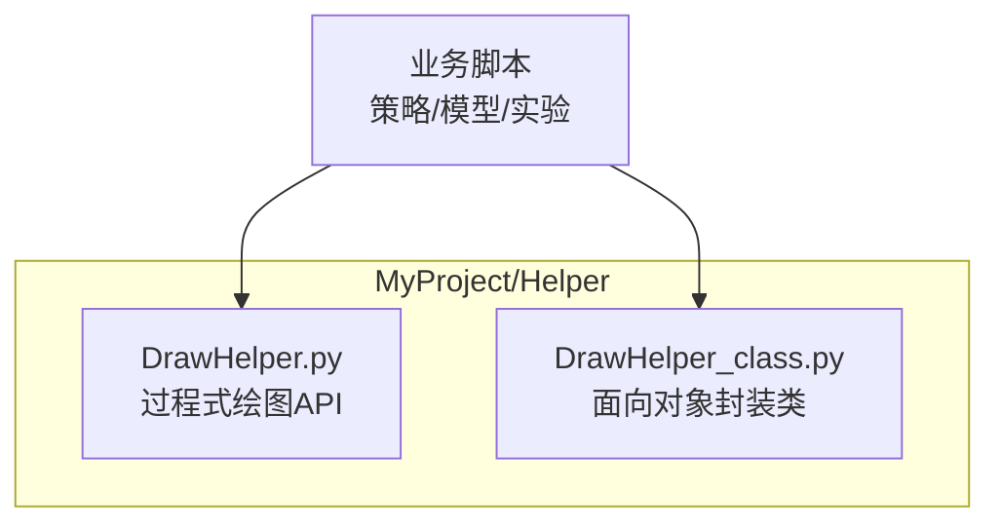
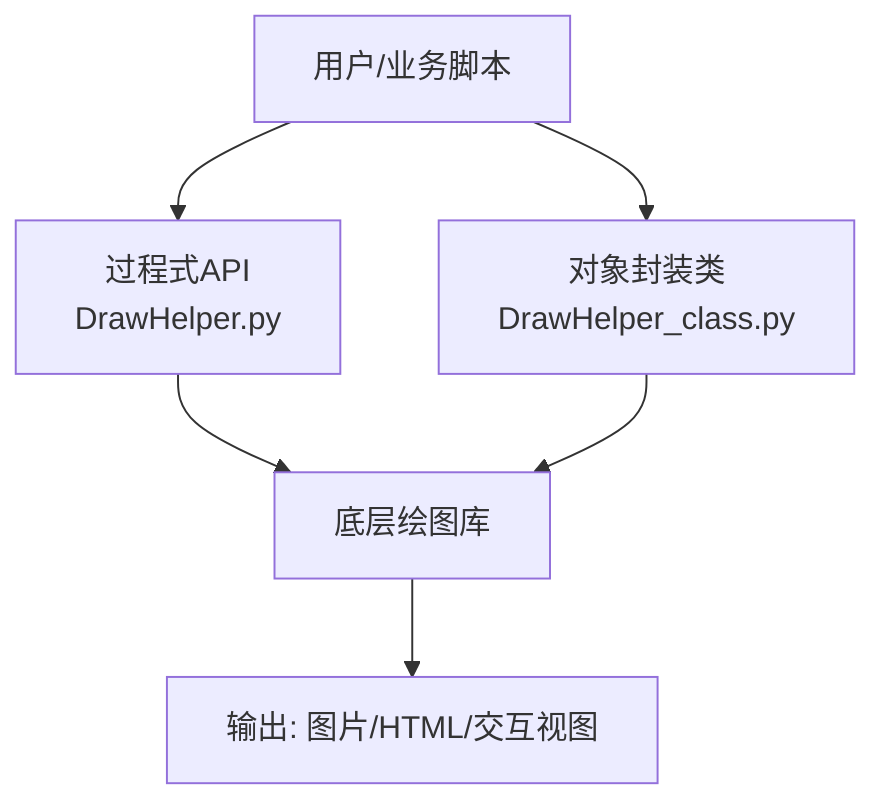
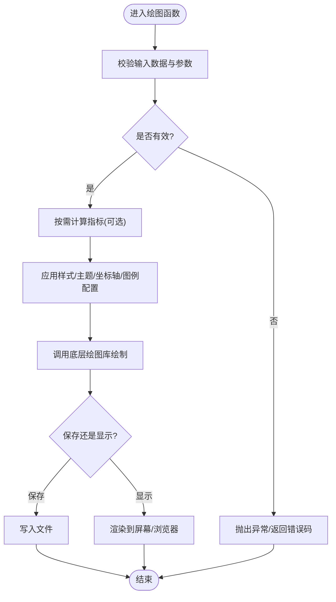
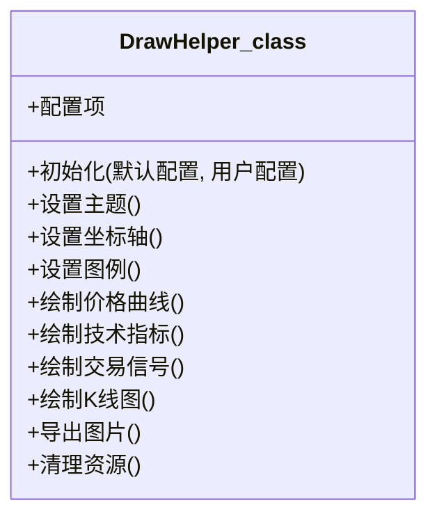
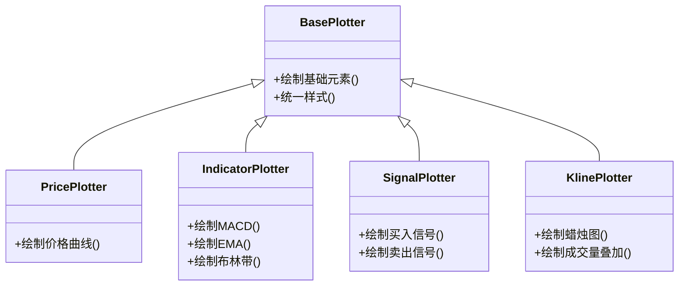
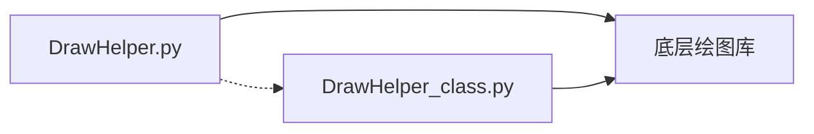

# 图表绘制工具

<cite>
**本文引用的文件**   
- [DrawHelper.py](file://MyProject/Helper/DrawHelper.py)
- [DrawHelper_class.py](file://MyProject/Helper/DrawHelper_class.py)
</cite>

## 目录
1. [简介](#简介)
2. [项目结构](#项目结构)
3. [核心组件](#核心组件)
4. [架构总览](#架构总览)
5. [详细组件分析](#详细组件分析)
6. [依赖关系分析](#依赖关系分析)
7. [性能考虑](#性能考虑)
8. [故障排查指南](#故障排查指南)
9. [结论](#结论)
10. [附录：API参考与示例](#附录api参考与示例)

## 简介
本技术文档围绕仓库中的图表绘制能力，聚焦于 MyProject/Helper 下的绘图模块。目标是帮助读者快速理解并高效使用绘图功能，包括股价走势图、技术指标图（MACD、EMA、布林带等）、交易信号标注图以及K线图的绘制方法；同时深入解析面向对象封装类的设计模式、API参数与返回值、样式与主题配置、批量生成优化策略、内存管理技巧，以及交互式图表与Web集成方案。

## 项目结构
本项目采用按功能域组织的方式，绘图相关代码集中在 Helper 目录下：
- DrawHelper.py：面向过程的绘图辅助函数集合，提供便捷的一键式绘图接口。
- DrawHelper_class.py：面向对象的绘图封装类，提供可复用的绘图上下文与配置管理。

**图示来源** 
- [DrawHelper.py](file://MyProject/Helper/DrawHelper.py)
- [DrawHelper_class.py](file://MyProject/Helper/DrawHelper_class.py)

**章节来源**
- [DrawHelper.py](file://MyProject/Helper/DrawHelper.py)
- [DrawHelper_class.py](file://MyProject/Helper/DrawHelper_class.py)

## 核心组件
- 过程式绘图API（DrawHelper）
  - 职责：暴露一组高层绘图函数，用于快速绘制股价走势、技术指标、交易信号和K线图。
  - 特点：调用简单、适合一次性或脚本化绘图场景。
- 面向对象封装类（DrawHelper_class）
  - 职责：封装绘图上下文、样式主题、坐标轴与图例配置，支持复用与组合。
  - 特点：通过实例状态管理配置，便于批量生成与统一风格控制。

**章节来源**
- [DrawHelper.py](file://MyProject/Helper/DrawHelper.py)
- [DrawHelper_class.py](file://MyProject/Helper/DrawHelper_class.py)

## 架构总览
下图展示了两种使用方式在系统中的位置与交互关系：上层业务脚本可直接调用过程式API，或通过对象实例进行更精细的控制。

[此图为概念性架构图，不直接映射具体源码文件]

## 详细组件分析

### 过程式绘图API（DrawHelper）
- 设计要点
  - 以函数为单位暴露绘图能力，参数集中传入，返回绘图结果或保存路径。
  - 常见能力覆盖：价格曲线、均线/指数平滑、MACD、布林带、成交量叠加、买卖信号标记、K线蜡烛图。
- 典型流程
  - 输入校验与数据准备 → 计算指标（如需要）→ 设置样式与布局 → 调用底层绘图库 → 渲染输出。
- 适用场景
  - 单图快速生成、批处理流水线中的独立绘图步骤、临时分析可视化。

**图示来源** 
- [DrawHelper.py](file://MyProject/Helper/DrawHelper.py)

**章节来源**
- [DrawHelper.py](file://MyProject/Helper/DrawHelper.py)

### 面向对象封装类（DrawHelper_class）
- 设计要点
  - 将“画布/上下文”、“样式主题”、“坐标轴与图例”、“图层管理”等抽象为类的属性与方法，形成可复用的绘图引擎。
  - 通过实例化对象统一管理配置，避免全局状态污染，提升批量绘制的稳定性与一致性。
- 关键职责
  - 初始化与配置合并：默认配置 + 用户覆盖。
  - 图层绘制：分层绘制价格、指标、信号、K线等，保证顺序正确。
  - 输出与导出：支持多种格式与分辨率。
- 扩展点
  - 自定义主题、自定义指标绘制器、自定义标注器。

**图示来源** 
- [DrawHelper_class.py](file://MyProject/Helper/DrawHelper_class.py)

**章节来源**
- [DrawHelper_class.py](file://MyProject/Helper/DrawHelper_class.py)

### 面向对象类关系与继承（若存在）
- 若存在基类/接口定义，子类通过继承复用通用绘制逻辑，实现特定指标或样式的差异化。
- 建议遵循单一职责原则：每个类只负责一类绘制任务（如价格、指标、信号、K线）。

[若实际代码未包含上述类，则此图为概念示意，不代表现有实现]

## 依赖关系分析
- 内部依赖
  - 过程式API可能复用对象封装类的公共能力，或将配置转换为对象实例后委托其完成绘制。
- 外部依赖
  - 底层绘图库（例如常见的Python绘图库）负责实际的图形渲染与导出。
- 耦合与内聚
  - 对象封装类提高内聚性，降低跨模块重复配置；过程式API保持低耦合，便于快速调用。

**图示来源** 
- [DrawHelper.py](file://MyProject/Helper/DrawHelper.py)
- [DrawHelper_class.py](file://MyProject/Helper/DrawHelper_class.py)

**章节来源**
- [DrawHelper.py](file://MyProject/Helper/DrawHelper.py)
- [DrawHelper_class.py](file://MyProject/Helper/DrawHelper_class.py)

## 性能考虑
- 批量生成优化
  - 复用对象实例：减少重复初始化开销。
  - 预分配与向量化：尽量使用数组操作，避免逐点循环。
  - 分块渲染：大图数据分段绘制，降低峰值内存。
- 内存管理
  - 及时释放中间变量与大对象引用。
  - 关闭不再使用的图形句柄或后端资源。
- I/O优化
  - 批量导出时复用同一后端会话。
  - 选择合适的图像格式与压缩级别。

[本节为通用指导，不直接分析具体文件]

## 故障排查指南
- 常见问题定位
  - 数据维度不一致：检查时间序列对齐与长度一致。
  - 颜色/主题冲突：确认主题覆盖顺序与默认值。
  - 坐标轴范围异常：检查数据极值与缩放比例。
  - 信号重叠：调整标注偏移与透明度。
- 调试建议
  - 打印关键中间变量与形状信息。
  - 逐步注释掉图层，定位问题所在。
  - 使用最小数据集复现问题。

[本节为通用指导，不直接分析具体文件]

## 结论
通过过程式API与面向对象封装类的结合，本绘图模块既满足快速出图的需求，又具备可扩展与可维护的架构优势。建议在复杂项目中优先使用对象封装类进行统一配置与批量生成，在简单脚本中直接使用过程式API以提升效率。

[本节为总结性内容，不直接分析具体文件]

## 附录：API参考与示例

### API概览（基于模块职责）
- 过程式API（DrawHelper）
  - 常用函数类别：
    - 价格走势图绘制
    - 技术指标图绘制（MACD、EMA、布林带等）
    - 交易信号标注图绘制
    - K线图绘制
  - 通用参数（示例说明）：
    - 数据：时间戳、收盘价、开盘价、最高价、最低价、成交量等
    - 指标参数：窗口期、标准差倍数等
    - 样式：线条颜色、宽度、透明度、填充色
    - 坐标轴：标签、刻度、范围、网格
    - 图例：标题、位置、字体大小
    - 输出：保存路径、分辨率、格式
  - 返回值：
    - 绘图对象句柄或保存路径（依实现而定）
- 对象封装类（DrawHelper_class）
  - 构造与配置：
    - 初始化：传入默认配置与用户覆盖配置
    - 主题设置：颜色主题、背景、字体
    - 坐标轴与图例：统一设置
  - 绘制方法：
    - 价格曲线、技术指标、交易信号、K线
  - 导出与清理：
    - 导出图片/HTML
    - 释放资源

**章节来源**
- [DrawHelper.py](file://MyProject/Helper/DrawHelper.py)
- [DrawHelper_class.py](file://MyProject/Helper/DrawHelper_class.py)

### 自定义样式与主题
- 主题切换：通过对象实例的主题设置方法统一应用。
- 颜色定制：为不同图层指定颜色与透明度，确保对比度与可读性。
- 字体与字号：统一设置标题、坐标轴标签与图例字体。

**章节来源**
- [DrawHelper_class.py](file://MyProject/Helper/DrawHelper_class.py)

### 坐标轴与图例配置
- 坐标轴：
  - 时间轴格式化（日期/时间）
  - 数值轴范围与主副刻度
  - 网格线与背景色
- 图例：
  - 多系列图例自动/手动生成
  - 图例位置与样式

**章节来源**
- [DrawHelper_class.py](file://MyProject/Helper/DrawHelper_class.py)

### 批量图表生成与内存管理
- 复用对象实例，避免重复初始化。
- 分批处理大数据集，控制内存峰值。
- 异步或并行导出（注意线程安全与资源竞争）。

**章节来源**
- [DrawHelper_class.py](file://MyProject/Helper/DrawHelper_class.py)

### 交互式图表与Web集成
- 交互能力：缩放、平移、悬停提示、点击事件。
- Web集成：
  - 导出为HTML嵌入页面
  - 通过后端服务动态生成并返回图片/HTML
  - 前端框架集成（React/Vue等）展示交互图表

[本节为通用指导，不直接分析具体文件]

### 实战示例指引（路径而非代码）
- 示例A：绘制股价走势与均线
  - 参考：[DrawHelper.py](file://MyProject/Helper/DrawHelper.py)
- 示例B：叠加MACD与信号柱
  - 参考：[DrawHelper.py](file://MyProject/Helper/DrawHelper.py)
- 示例C：布林带上轨/下轨与价格通道
  - 参考：[DrawHelper.py](file://MyProject/Helper/DrawHelper.py)
- 示例D：K线蜡烛图与成交量叠加
  - 参考：[DrawHelper.py](file://MyProject/Helper/DrawHelper.py)
- 示例E：使用对象封装类统一主题与批量导出
  - 参考：[DrawHelper_class.py](file://MyProject/Helper/DrawHelper_class.py)

**章节来源**
- [DrawHelper.py](file://MyProject/Helper/DrawHelper.py)
- [DrawHelper_class.py](file://MyProject/Helper/DrawHelper_class.py)