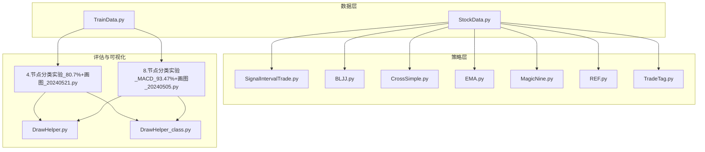
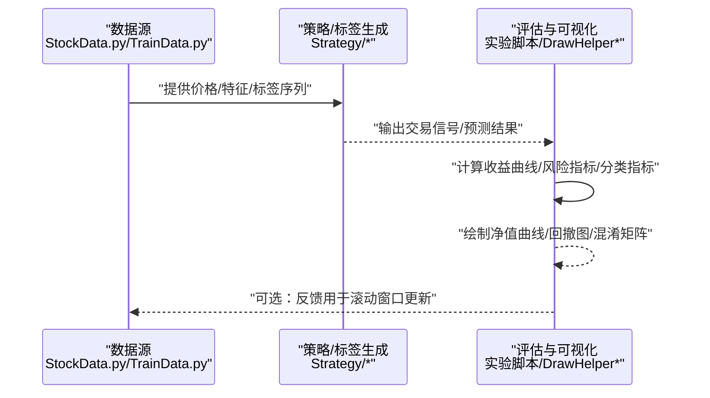
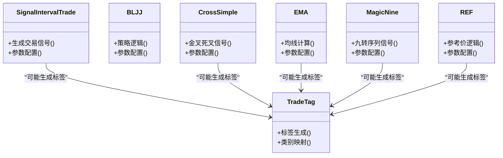
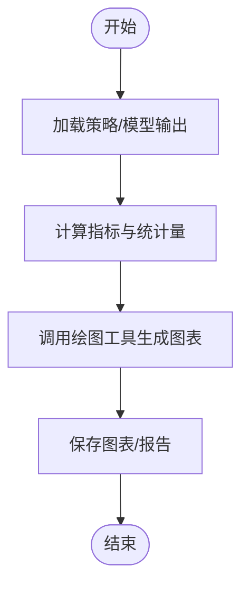
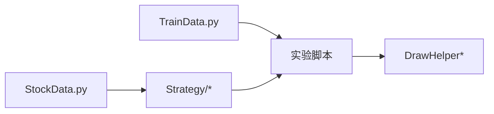

# 性能分析与评估

<cite>
**本文引用的文件**   
- [MyProject/Model/Strategy/SignalIntervalTrade.py](file://MyProject/Model/Strategy/SignalIntervalTrade.py)
- [MyProject/Model/Strategy/BLJJ.py](file://MyProject/Model/Strategy/BLJJ.py)
- [MyProject/Model/Strategy/CrossSimple.py](file://MyProject/Model/Strategy/CrossSimple.py)
- [MyProject/Model/Strategy/EMA.py](file://MyProject/Model/Strategy/EMA.py)
- [MyProject/Model/Strategy/MagicNine.py](file://MyProject/Model/Strategy/MagicNine.py)
- [MyProject/Model/Strategy/REF.py](file://MyProject/Model/Strategy/REF.py)
- [MyProject/Model/Strategy/TradeTag.py](file://MyProject/Model/Strategy/TradeTag.py)
- [MyProject/Helper/DrawHelper.py](file://MyProject/Helper/DrawHelper.py)
- [MyProject/Helper/DrawHelper_class.py](file://MyProject/Helper/DrawHelper_class.py)
- [MyProject/DataBase/StockData.py](file://MyProject/DataBase/StockData.py)
- [MyProject/DataBase/TrainData.py](file://MyProject/DataBase/TrainData.py)
- [MyProject/Model/4.节点分类实验_80.7%+画图_20240521.py](file://MyProject/Model/4.节点分类实验_80.7%+画图_20240521.py)
- [MyProject/Model/8.节点分类实验_MACD_93.47%+画图_20240505.py](file://MyProject/Model/8.节点分类实验_MACD_93.47%+画图_20240505.py)
</cite>

## 目录
1. [引言](#引言)
2. [项目结构](#项目结构)
3. [核心组件](#核心组件)
4. [架构总览](#架构总览)
5. [详细组件分析](#详细组件分析)
6. [依赖关系分析](#依赖关系分析)
7. [性能考量](#性能考量)
8. [故障排查指南](#故障排查指南)
9. [结论](#结论)
10. [附录](#附录)

## 引言
本章节面向量化交易策略的“性能分析与评估”模块，目标是建立一套可复用的指标体系与回测分析流程。内容覆盖：
- 收益与风险调整收益指标：收益率、夏普比率、最大回撤、索提诺比率、信息比率等
- 模型预测性能评估：准确率、召回率、F1分数、混淆矩阵等分类任务指标
- 回测结果分析流程：基准对比、分时段表现、市场状态适应性评估
- 统计显著性检验与置信区间估计方法
- 不同市场环境下的稳健性分析方法
- 结合仓库现有代码路径的可视化与实现指引

## 项目结构
本项目围绕“数据—策略—评估—可视化”的组织方式展开：
- 数据层：股票行情与训练数据构建（DataBase）
- 策略层：多类交易信号与标签生成（Model/Strategy）
- 评估与可视化：绘图辅助与实验脚本（Helper/Model）

图表来源
- [MyProject/DataBase/StockData.py](file://MyProject/DataBase/StockData.py)
- [MyProject/DataBase/TrainData.py](file://MyProject/DataBase/TrainData.py)
- [MyProject/Model/Strategy/SignalIntervalTrade.py](file://MyProject/Model/Strategy/SignalIntervalTrade.py)
- [MyProject/Model/Strategy/BLJJ.py](file://MyProject/Model/Strategy/BLJJ.py)
- [MyProject/Model/Strategy/CrossSimple.py](file://MyProject/Model/Strategy/CrossSimple.py)
- [MyProject/Model/Strategy/EMA.py](file://MyProject/Model/Strategy/EMA.py)
- [MyProject/Model/Strategy/MagicNine.py](file://MyProject/Model/Strategy/MagicNine.py)
- [MyProject/Model/Strategy/REF.py](file://MyProject/Model/Strategy/REF.py)
- [MyProject/Model/Strategy/TradeTag.py](file://MyProject/Model/Strategy/TradeTag.py)
- [MyProject/Helper/DrawHelper.py](file://MyProject/Helper/DrawHelper.py)
- [MyProject/Helper/DrawHelper_class.py](file://MyProject/Helper/DrawHelper_class.py)
- [MyProject/Model/4.节点分类实验_80.7%+画图_20240521.py](file://MyProject/Model/4.节点分类实验_80.7%+画图_20240521.py)
- [MyProject/Model/8.节点分类实验_MACD_93.47%+画图_20240505.py](file://MyProject/Model/8.节点分类实验_MACD_93.47%+画图_20240505.py)

章节来源
- [MyProject/DataBase/StockData.py](file://MyProject/DataBase/StockData.py)
- [MyProject/DataBase/TrainData.py](file://MyProject/DataBase/TrainData.py)
- [MyProject/Model/Strategy/SignalIntervalTrade.py](file://MyProject/Model/Strategy/SignalIntervalTrade.py)
- [MyProject/Model/Strategy/BLJJ.py](file://MyProject/Model/Strategy/BLJJ.py)
- [MyProject/Model/Strategy/CrossSimple.py](file://MyProject/Model/Strategy/CrossSimple.py)
- [MyProject/Model/Strategy/EMA.py](file://MyProject/Model/Strategy/EMA.py)
- [MyProject/Model/Strategy/MagicNine.py](file://MyProject/Model/Strategy/MagicNine.py)
- [MyProject/Model/Strategy/REF.py](file://MyProject/Model/Strategy/REF.py)
- [MyProject/Model/Strategy/TradeTag.py](file://MyProject/Model/Strategy/TradeTag.py)
- [MyProject/Helper/DrawHelper.py](file://MyProject/Helper/DrawHelper.py)
- [MyProject/Helper/DrawHelper_class.py](file://MyProject/Helper/DrawHelper_class.py)
- [MyProject/Model/4.节点分类实验_80.7%+画图_20240521.py](file://MyProject/Model/4.节点分类实验_80.7%+画图_20240521.py)
- [MyProject/Model/8.节点分类实验_MACD_93.47%+画图_20240505.py](file://MyProject/Model/8.节点分类实验_MACD_93.47%+画图_20240505.py)

## 核心组件
- 策略与信号生成
  - 基于交叉、均线、固定间隔与参考价等逻辑产生交易信号或标签，为后续绩效评估提供输入序列。
  - 关键文件：[SignalIntervalTrade.py](file://MyProject/Model/Strategy/SignalIntervalTrade.py)、[BLJJ.py](file://MyProject/Model/Strategy/BLJJ.py)、[CrossSimple.py](file://MyProject/Model/Strategy/CrossSimple.py)、[EMA.py](file://MyProject/Model/Strategy/EMA.py)、[MagicNine.py](file://MyProject/Model/Strategy/MagicNine.py)、[REF.py](file://MyProject/Model/Strategy/REF.py)、[TradeTag.py](file://MyProject/Model/Strategy/TradeTag.py)
- 数据与标签
  - 从行情数据中抽取特征并构造训练/评估样本，支撑分类任务与回测序列。
  - 关键文件：[StockData.py](file://MyProject/DataBase/StockData.py)、[TrainData.py](file://MyProject/DataBase/TrainData.py)
- 评估与可视化
  - 通过实验脚本串联策略输出与绘图工具，完成指标计算与图表展示。
  - 关键文件：[4.节点分类实验_80.7%+画图_20240521.py](file://MyProject/Model/4.节点分类实验_80.7%+画图_20240521.py)、[8.节点分类实验_MACD_93.47%+画图_20240505.py](file://MyProject/Model/8.节点分类实验_MACD_93.47%+画图_20240505.py)、[DrawHelper.py](file://MyProject/Helper/DrawHelper.py)、[DrawHelper_class.py](file://MyProject/Helper/DrawHelper_class.py)

章节来源
- [MyProject/Model/Strategy/SignalIntervalTrade.py](file://MyProject/Model/Strategy/SignalIntervalTrade.py)
- [MyProject/Model/Strategy/BLJJ.py](file://MyProject/Model/Strategy/BLJJ.py)
- [MyProject/Model/Strategy/CrossSimple.py](file://MyProject/Model/Strategy/CrossSimple.py)
- [MyProject/Model/Strategy/EMA.py](file://MyProject/Model/Strategy/EMA.py)
- [MyProject/Model/Strategy/MagicNine.py](file://MyProject/Model/Strategy/MagicNine.py)
- [MyProject/Model/Strategy/REF.py](file://MyProject/Model/Strategy/REF.py)
- [MyProject/Model/Strategy/TradeTag.py](file://MyProject/Model/Strategy/TradeTag.py)
- [MyProject/DataBase/StockData.py](file://MyProject/DataBase/StockData.py)
- [MyProject/DataBase/TrainData.py](file://MyProject/DataBase/TrainData.py)
- [MyProject/Model/4.节点分类实验_80.7%+画图_20240521.py](file://MyProject/Model/4.节点分类实验_80.7%+画图_20240521.py)
- [MyProject/Model/8.节点分类实验_MACD_93.47%+画图_20240505.py](file://MyProject/Model/8.节点分类实验_MACD_93.47%+画图_20240505.py)
- [MyProject/Helper/DrawHelper.py](file://MyProject/Helper/DrawHelper.py)
- [MyProject/Helper/DrawHelper_class.py](file://MyProject/Helper/DrawHelper_class.py)

## 架构总览
下图展示了从数据到策略、再到评估与可视化的端到端流程。该流程既适用于策略回测的收益/风险评估，也适用于分类任务的预测性能评估。

图表来源
- [MyProject/DataBase/StockData.py](file://MyProject/DataBase/StockData.py)
- [MyProject/DataBase/TrainData.py](file://MyProject/DataBase/TrainData.py)
- [MyProject/Model/Strategy/SignalIntervalTrade.py](file://MyProject/Model/Strategy/SignalIntervalTrade.py)
- [MyProject/Model/Strategy/BLJJ.py](file://MyProject/Model/Strategy/BLJJ.py)
- [MyProject/Model/Strategy/CrossSimple.py](file://MyProject/Model/Strategy/CrossSimple.py)
- [MyProject/Model/Strategy/EMA.py](file://MyProject/Model/Strategy/EMA.py)
- [MyProject/Model/Strategy/MagicNine.py](file://MyProject/Model/Strategy/MagicNine.py)
- [MyProject/Model/Strategy/REF.py](file://MyProject/Model/Strategy/REF.py)
- [MyProject/Model/Strategy/TradeTag.py](file://MyProject/Model/Strategy/TradeTag.py)
- [MyProject/Model/4.节点分类实验_80.7%+画图_20240521.py](file://MyProject/Model/4.节点分类实验_80.7%+画图_20240521.py)
- [MyProject/Model/8.节点分类实验_MACD_93.47%+画图_20240505.py](file://MyProject/Model/8.节点分类实验_MACD_93.47%+画图_20240505.py)
- [MyProject/Helper/DrawHelper.py](file://MyProject/Helper/DrawHelper.py)
- [MyProject/Helper/DrawHelper_class.py](file://MyProject/Helper/DrawHelper_class.py)

## 详细组件分析

### 收益与风险调整收益指标体系
- 收益率计算
  - 日度/累计收益率、对数收益率、年化收益率的计算思路
  - 资金曲线构建与再投资假设说明
- 风险调整收益指标
  - 夏普比率：超额收益与波动率的比值
  - 索提诺比率：仅考虑下行波动的风险调整后收益
  - 最大回撤：净值峰值到谷底的最大跌幅
  - 信息比率：主动收益与跟踪误差的比值
- 可视化建议
  - 净值曲线、回撤曲线、月度收益热力图、收益分布直方图

章节来源
- [MyProject/Model/4.节点分类实验_80.7%+画图_20240521.py](file://MyProject/Model/4.节点分类实验_80.7%+画图_20240521.py)
- [MyProject/Model/8.节点分类实验_MACD_93.47%+画图_20240505.py](file://MyProject/Model/8.节点分类实验_MACD_93.47%+画图_20240505.py)
- [MyProject/Helper/DrawHelper.py](file://MyProject/Helper/DrawHelper.py)
- [MyProject/Helper/DrawHelper_class.py](file://MyProject/Helper/DrawHelper_class.py)

### 模型预测性能评估（分类任务）
- 指标定义
  - 准确率、召回率、精确率、F1分数
  - 混淆矩阵：TP/TN/FP/FN分解
- 适用场景
  - 方向预测（涨/跌）、信号触发（买入/卖出/持有）
- 可视化建议
  - 混淆矩阵热力图、ROC曲线、PR曲线、逐期命中率

章节来源
- [MyProject/Model/4.节点分类实验_80.7%+画图_20240521.py](file://MyProject/Model/4.节点分类实验_80.7%+画图_20240521.py)
- [MyProject/Model/8.节点分类实验_MACD_93.47%+画图_20240505.py](file://MyProject/Model/8.节点分类实验_MACD_93.47%+画图_20240505.py)
- [MyProject/Helper/DrawHelper.py](file://MyProject/Helper/DrawHelper.py)
- [MyProject/Helper/DrawHelper_class.py](file://MyProject/Helper/DrawHelper_class.py)

### 回测结果分析流程
- 基准对比
  - 策略净值 vs 基准指数净值；相对收益与跟踪误差
- 分时段表现
  - 按年/季度/月维度拆分，观察稳定性与周期敏感性
- 市场状态适应性
  - 按波动率、趋势强度等因子划分市场状态，比较策略在不同状态下的表现差异
- 可视化建议
  - 双轴净值对比图、分段收益柱状图、状态分组箱线图

章节来源
- [MyProject/Model/4.节点分类实验_80.7%+画图_20240521.py](file://MyProject/Model/4.节点分类实验_80.7%+画图_20240521.py)
- [MyProject/Model/8.节点分类实验_MACD_93.47%+画图_20240505.py](file://MyProject/Model/8.节点分类实验_MACD_93.47%+画图_20240505.py)
- [MyProject/Helper/DrawHelper.py](file://MyProject/Helper/DrawHelper.py)
- [MyProject/Helper/DrawHelper_class.py](file://MyProject/Helper/DrawHelper_class.py)

### 统计显著性检验与置信区间估计
- 显著性检验
  - 均值差异检验（如配对t检验）、非参数检验（如Wilcoxon符号秩检验）
  - 针对超额收益序列进行显著性判断
- 置信区间估计
  - 标准误与正态近似区间
  - 自助法（Bootstrap）重抽样构建区间
- 实践要点
  - 时间序列自相关处理（Newey-West标准误）
  - 多重比较校正（如BH法）

章节来源
- [MyProject/Model/4.节点分类实验_80.7%+画图_20240521.py](file://MyProject/Model/4.节点分类实验_80.7%+画图_20240521.py)
- [MyProject/Model/8.节点分类实验_MACD_93.47%+画图_20240505.py](file://MyProject/Model/8.节点分类实验_MACD_93.47%+画图_20240505.py)

### 不同市场环境下的稳健性分析
- 环境划分
  - 高/低波动、强趋势/震荡市、牛/熊/中性
- 稳健性度量
  - 各环境下收益、回撤、胜率、盈亏比、信息比率
- 可视化建议
  - 分组雷达图、箱线图、散点图（风险-收益）

章节来源
- [MyProject/Model/4.节点分类实验_80.7%+画图_20240521.py](file://MyProject/Model/4.节点分类实验_80.7%+画图_20240521.py)
- [MyProject/Model/8.节点分类实验_MACD_93.47%+画图_20240505.py](file://MyProject/Model/8.节点分类实验_MACD_93.47%+画图_20240505.py)
- [MyProject/Helper/DrawHelper.py](file://MyProject/Helper/DrawHelper.py)
- [MyProject/Helper/DrawHelper_class.py](file://MyProject/Helper/DrawHelper_class.py)

### 策略与标签生成组件（与评估衔接）
- 信号与标签
  - 固定间隔交易、均线交叉、MACD/布林带等经典策略
  - 标签生成用于监督学习（涨跌方向、信号触发）
- 与评估的关系
  - 信号/标签作为输入，驱动收益曲线与分类指标计算

图表来源
- [MyProject/Model/Strategy/SignalIntervalTrade.py](file://MyProject/Model/Strategy/SignalIntervalTrade.py)
- [MyProject/Model/Strategy/BLJJ.py](file://MyProject/Model/Strategy/BLJJ.py)
- [MyProject/Model/Strategy/CrossSimple.py](file://MyProject/Model/Strategy/CrossSimple.py)
- [MyProject/Model/Strategy/EMA.py](file://MyProject/Model/Strategy/EMA.py)
- [MyProject/Model/Strategy/MagicNine.py](file://MyProject/Model/Strategy/MagicNine.py)
- [MyProject/Model/Strategy/REF.py](file://MyProject/Model/Strategy/REF.py)
- [MyProject/Model/Strategy/TradeTag.py](file://MyProject/Model/Strategy/TradeTag.py)

章节来源
- [MyProject/Model/Strategy/SignalIntervalTrade.py](file://MyProject/Model/Strategy/SignalIntervalTrade.py)
- [MyProject/Model/Strategy/BLJJ.py](file://MyProject/Model/Strategy/BLJJ.py)
- [MyProject/Model/Strategy/CrossSimple.py](file://MyProject/Model/Strategy/CrossSimple.py)
- [MyProject/Model/Strategy/EMA.py](file://MyProject/Model/Strategy/EMA.py)
- [MyProject/Model/Strategy/MagicNine.py](file://MyProject/Model/Strategy/MagicNine.py)
- [MyProject/Model/Strategy/REF.py](file://MyProject/Model/Strategy/REF.py)
- [MyProject/Model/Strategy/TradeTag.py](file://MyProject/Model/Strategy/TradeTag.py)

### 可视化与绘图组件
- 绘图能力
  - 净值曲线、回撤图、月度收益、混淆矩阵、ROC/PR曲线等
- 使用方式
  - 在实验脚本中调用绘图函数/类，传入策略输出或模型预测结果

图表来源
- [MyProject/Helper/DrawHelper.py](file://MyProject/Helper/DrawHelper.py)
- [MyProject/Helper/DrawHelper_class.py](file://MyProject/Helper/DrawHelper_class.py)
- [MyProject/Model/4.节点分类实验_80.7%+画图_20240521.py](file://MyProject/Model/4.节点分类实验_80.7%+画图_20240521.py)
- [MyProject/Model/8.节点分类实验_MACD_93.47%+画图_20240505.py](file://MyProject/Model/8.节点分类实验_MACD_93.47%+画图_20240505.py)

章节来源
- [MyProject/Helper/DrawHelper.py](file://MyProject/Helper/DrawHelper.py)
- [MyProject/Helper/DrawHelper_class.py](file://MyProject/Helper/DrawHelper_class.py)
- [MyProject/Model/4.节点分类实验_80.7%+画图_20240521.py](file://MyProject/Model/4.节点分类实验_80.7%+画图_20240521.py)
- [MyProject/Model/8.节点分类实验_MACD_93.47%+画图_20240505.py](file://MyProject/Model/8.节点分类实验_MACD_93.47%+画图_20240505.py)

## 依赖关系分析
- 数据依赖
  - 策略与评估均依赖行情与标签数据，确保时间对齐与无未来函数
- 模块耦合
  - 策略模块与标签生成模块解耦，便于替换与扩展
  - 评估与可视化模块通过统一接口接收策略/模型输出，降低耦合度

图表来源
- [MyProject/DataBase/StockData.py](file://MyProject/DataBase/StockData.py)
- [MyProject/DataBase/TrainData.py](file://MyProject/DataBase/TrainData.py)
- [MyProject/Model/Strategy/SignalIntervalTrade.py](file://MyProject/Model/Strategy/SignalIntervalTrade.py)
- [MyProject/Model/Strategy/BLJJ.py](file://MyProject/Model/Strategy/BLJJ.py)
- [MyProject/Model/Strategy/CrossSimple.py](file://MyProject/Model/Strategy/CrossSimple.py)
- [MyProject/Model/Strategy/EMA.py](file://MyProject/Model/Strategy/EMA.py)
- [MyProject/Model/Strategy/MagicNine.py](file://MyProject/Model/Strategy/MagicNine.py)
- [MyProject/Model/Strategy/REF.py](file://MyProject/Model/Strategy/REF.py)
- [MyProject/Model/Strategy/TradeTag.py](file://MyProject/Model/Strategy/TradeTag.py)
- [MyProject/Model/4.节点分类实验_80.7%+画图_20240521.py](file://MyProject/Model/4.节点分类实验_80.7%+画图_20240521.py)
- [MyProject/Model/8.节点分类实验_MACD_93.47%+画图_20240505.py](file://MyProject/Model/8.节点分类实验_MACD_93.47%+画图_20240505.py)
- [MyProject/Helper/DrawHelper.py](file://MyProject/Helper/DrawHelper.py)
- [MyProject/Helper/DrawHelper_class.py](file://MyProject/Helper/DrawHelper_class.py)

章节来源
- [MyProject/DataBase/StockData.py](file://MyProject/DataBase/StockData.py)
- [MyProject/DataBase/TrainData.py](file://MyProject/DataBase/TrainData.py)
- [MyProject/Model/Strategy/SignalIntervalTrade.py](file://MyProject/Model/Strategy/SignalIntervalTrade.py)
- [MyProject/Model/Strategy/BLJJ.py](file://MyProject/Model/Strategy/BLJJ.py)
- [MyProject/Model/Strategy/CrossSimple.py](file://MyProject/Model/Strategy/CrossSimple.py)
- [MyProject/Model/Strategy/EMA.py](file://MyProject/Model/Strategy/EMA.py)
- [MyProject/Model/Strategy/MagicNine.py](file://MyProject/Model/Strategy/MagicNine.py)
- [MyProject/Model/Strategy/REF.py](file://MyProject/Model/Strategy/REF.py)
- [MyProject/Model/Strategy/TradeTag.py](file://MyProject/Model/Strategy/TradeTag.py)
- [MyProject/Model/4.节点分类实验_80.7%+画图_20240521.py](file://MyProject/Model/4.节点分类实验_80.7%+画图_20240521.py)
- [MyProject/Model/8.节点分类实验_MACD_93.47%+画图_20240505.py](file://MyProject/Model/8.节点分类实验_MACD_93.47%+画图_20240505.py)
- [MyProject/Helper/DrawHelper.py](file://MyProject/Helper/DrawHelper.py)
- [MyProject/Helper/DrawHelper_class.py](file://MyProject/Helper/DrawHelper_class.py)

## 性能考量
- 计算复杂度
  - 滚动窗口指标（移动平均、波动率）的时间复杂度与内存占用
  - 大规模样本下的分类指标计算优化（向量化）
- 数值稳定性
  - 避免除零与无穷值；对极端收益做截尾或Winsorize
- 并行与缓存
  - 多标的/多策略并行评估；中间结果缓存减少重复计算

## 故障排查指南
- 常见问题
  - 数据缺失与停牌：需前向填充或剔除异常日
  - 未来函数：确保信号与标签严格基于历史数据
  - 指标发散：检查收益率序列的平稳性与异常值
- 定位步骤
  - 逐步打印关键中间变量（信号、标签、收益序列）
  - 使用绘图工具快速定位异常区间
  - 对显著性检验结果进行稳健性复核（不同窗口/样本）

章节来源
- [MyProject/Model/4.节点分类实验_80.7%+画图_20240521.py](file://MyProject/Model/4.节点分类实验_80.7%+画图_20240521.py)
- [MyProject/Model/8.节点分类实验_MACD_93.47%+画图_20240505.py](file://MyProject/Model/8.节点分类实验_MACD_93.47%+画图_20240505.py)
- [MyProject/Helper/DrawHelper.py](file://MyProject/Helper/DrawHelper.py)
- [MyProject/Helper/DrawHelper_class.py](file://MyProject/Helper/DrawHelper_class.py)

## 结论
本方案将策略信号/标签生成、收益与风险指标、分类任务评估、统计检验与可视化整合为一套可复用的性能分析与评估流程。通过基准对比、分时段与市场状态细分，能够全面刻画策略在不同环境下的稳健性与有效性。建议在工程化落地时强化数据质量校验、指标计算的数值稳定性与结果的可解释性呈现。

## 附录
- 指标清单与用途
  - 收益类：日度/累计/年化收益率
  - 风险类：波动率、最大回撤、下行风险
  - 风险调整收益：夏普比率、索提诺比率、信息比率
  - 分类指标：准确率、召回率、精确率、F1、AUC、PR-AUC
- 可视化清单
  - 净值曲线、回撤曲线、月度收益热力图、混淆矩阵、ROC/PR曲线、分组箱线图