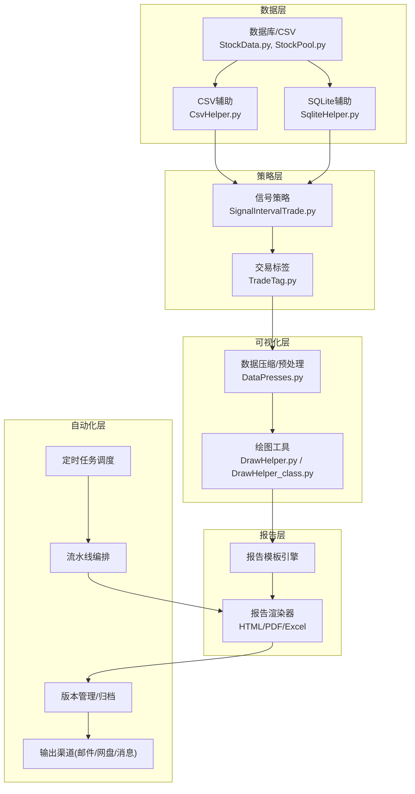
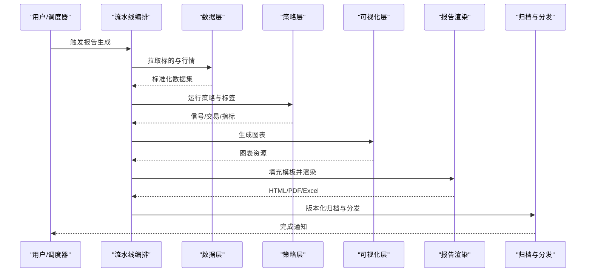
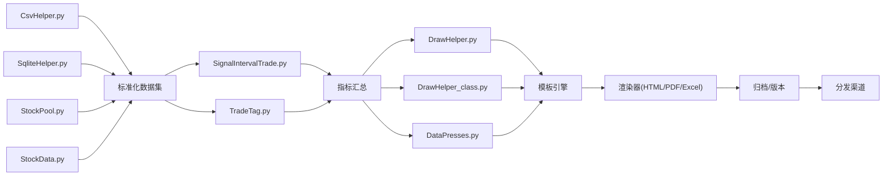

# 报告生成与自动化

<cite>
**本文引用的文件**   
- [MyProject/Helper/DrawHelper.py](file://MyProject/Helper/DrawHelper.py)
- [MyProject/Helper/DrawHelper_class.py](file://MyProject/Helper/DrawHelper_class.py)
- [MyProject/Helper/CsvHelper.py](file://MyProject/Helper/CsvHelper.py)
- [MyProject/Helper/DataPresses.py](file://MyProject/Helper/DataPresses.py)
- [MyProject/Helper/LogHelper.py](file://MyProject/Helper/LogHelper.py)
- [MyProject/Helper/SqliteHelper.py](file://MyProject/Helper/SqliteHelper.py)
- [MyProject/DataBase/StockData.py](file://MyProject/DataBase/StockData.py)
- [MyProject/DataBase/StockPool.py](file://MyProject/DataBase/StockPool.py)
- [MyProject/Model/Strategy/SignalIntervalTrade.py](file://MyProject/Model/Strategy/SignalIntervalTrade.py)
- [MyProject/Model/Strategy/TradeTag.py](file://MyProject/Model/Strategy/TradeTag.py)
- [GetBaoStockData.py](file://GetBaoStockData.py)
</cite>

## 目录
1. [引言](#引言)
2. [项目结构](#项目结构)
3. [核心组件](#核心组件)
4. [架构总览](#架构总览)
5. [详细组件分析](#详细组件分析)
6. [依赖关系分析](#依赖关系分析)
7. [性能考虑](#性能考虑)
8. [故障排查指南](#故障排查指南)
9. [结论](#结论)
10. [附录](#附录)

## 引言
本文件面向“报告生成与自动化”模块，目标是说明如何基于现有数据与策略结果，自动生成结构化的分析报告。报告应包含执行摘要、策略表现概览、风险评估、详细图表与分析结论；支持模板设计与动态内容填充；提供PDF、HTML、Excel等多格式导出；并给出定时任务调度与批量生成的工作流设计、版本管理与历史归档策略、个性化定制与输出渠道配置，以及端到端的流水线示例（从数据处理到最终报告输出）。

本项目当前仓库未直接包含报告生成代码，但提供了绘图、CSV/SQLite数据读写、日志记录、策略信号与交易标签等关键能力。本文将基于这些能力，设计并描述一套可落地的报告生成与自动化方案，并在需要时引用相关源文件作为实现参考点。

## 项目结构
围绕报告生成与自动化，建议将现有能力整合为如下层次：
- 数据层：从数据库或外部接口获取行情与标的池，清洗与聚合指标
- 策略层：运行策略，产出信号与交易标签，计算收益与风险指标
- 可视化层：复用绘图工具生成K线、收益曲线、回撤、分布等图表
- 报告层：按模板组装文本、表格与图表，渲染为HTML/PDF/Excel
- 自动化层：定时任务触发、批量生成、版本管理、归档与分发

[此图为概念性架构图，不直接映射具体源码文件]

## 核心组件
- 数据接入与处理
  - 使用CsvHelper与SqliteHelper进行CSV与SQLite数据的读取、写入与基础操作
  - 通过StockData与StockPool加载标的池与行情序列，完成时间对齐、缺失值处理与特征工程
- 策略与指标
  - 基于SignalIntervalTrade产生交易信号，结合TradeTag对交易事件打标
  - 汇总收益、胜率、盈亏比、最大回撤、波动率、夏普比率等指标
- 可视化
  - 使用DrawHelper与DrawHelper_class生成K线、净值曲线、回撤图、收益分布等
  - DataPresses用于数据压缩与快速预览，提升渲染效率
- 报告模板与渲染
  - 定义结构化模板（执行摘要、策略概览、风险、图表、结论）
  - 动态填充文本、表格与图片，渲染为HTML，再转换为PDF或Excel
- 自动化与调度
  - 使用系统级调度（如cron/schedule）或任务队列触发流水线
  - 批量生成多标的或多策略报告，统一命名与归档
- 版本管理与归档
  - 以日期+版本号组织输出目录，保留历史快照与元数据
- 个性化与输出渠道
  - 支持主题、语言、图表风格、受众视角等定制项
  - 支持邮件、企业微信/钉钉、对象存储等分发方式

**章节来源**
- [MyProject/Helper/CsvHelper.py](file://MyProject/Helper/CsvHelper.py)
- [MyProject/Helper/SqliteHelper.py](file://MyProject/Helper/SqliteHelper.py)
- [MyProject/DataBase/StockData.py](file://MyProject/DataBase/StockData.py)
- [MyProject/DataBase/StockPool.py](file://MyProject/DataBase/StockPool.py)
- [MyProject/Model/Strategy/SignalIntervalTrade.py](file://MyProject/Model/Strategy/SignalIntervalTrade.py)
- [MyProject/Model/Strategy/TradeTag.py](file://MyProject/Model/Strategy/TradeTag.py)
- [MyProject/Helper/DrawHelper.py](file://MyProject/Helper/DrawHelper.py)
- [MyProject/Helper/DrawHelper_class.py](file://MyProject/Helper/DrawHelper_class.py)
- [MyProject/Helper/DataPresses.py](file://MyProject/Helper/DataPresses.py)

## 架构总览
报告生成流水线采用分层解耦设计：数据→策略→可视化→模板→渲染→归档→分发。各层通过明确的数据契约交互，便于替换实现与扩展。

[此图为概念性流程图，不直接映射具体源码文件]

## 详细组件分析

### 数据接入与处理组件
- 职责
  - 从CSV/SQLite加载原始数据，合并标的池，清洗与对齐时间序列
  - 输出标准化的DataFrame/Record集合供后续使用
- 关键点
  - 字段规范：日期、代码、开高低收、成交量、成交额等
  - 异常处理：缺失值插补、重复行去重、停牌日过滤
  - 性能：分批读取、列裁剪、索引优化
- 参考实现
  - CSV读写与基础操作：[CsvHelper.py](file://MyProject/Helper/CsvHelper.py)
  - SQLite读写与查询封装：[SqliteHelper.py](file://MyProject/Helper/SqliteHelper.py)
  - 标的池与行情数据结构：[StockPool.py](file://MyProject/DataBase/StockPool.py), [StockData.py](file://MyProject/DataBase/StockData.py)

**章节来源**
- [MyProject/Helper/CsvHelper.py](file://MyProject/Helper/CsvHelper.py)
- [MyProject/Helper/SqliteHelper.py](file://MyProject/Helper/SqliteHelper.py)
- [MyProject/DataBase/StockPool.py](file://MyProject/DataBase/StockPool.py)
- [MyProject/DataBase/StockData.py](file://MyProject/DataBase/StockData.py)

### 策略与指标组件
- 职责
  - 根据规则或模型产生交易信号，并对交易事件打标
  - 汇总统计指标：收益率、回撤、波动率、夏普、胜率、盈亏比等
- 关键点
  - 信号一致性：避免未来函数、滑点与手续费建模
  - 标签语义：入场/出场、止损/止盈、持仓周期等
  - 指标口径：年化、滚动窗口、基准对比
- 参考实现
  - 信号策略：[SignalIntervalTrade.py](file://MyProject/Model/Strategy/SignalIntervalTrade.py)
  - 交易标签：[TradeTag.py](file://MyProject/Model/Strategy/TradeTag.py)

**章节来源**
- [MyProject/Model/Strategy/SignalIntervalTrade.py](file://MyProject/Model/Strategy/SignalIntervalTrade.py)
- [MyProject/Model/Strategy/TradeTag.py](file://MyProject/Model/Strategy/TradeTag.py)

### 可视化组件
- 职责
  - 生成K线、净值曲线、回撤、收益分布、热力图等
  - 控制样式、分辨率、布局，适配不同输出介质
- 关键点
  - 大图分块渲染、缓存中间图、按需加载
  - 颜色与字体国际化、无障碍可读性
- 参考实现
  - 绘图工具与类封装：[DrawHelper.py](file://MyProject/Helper/DrawHelper.py), [DrawHelper_class.py](file://MyProject/Helper/DrawHelper_class.py)
  - 数据压缩与预处理：[DataPresses.py](file://MyProject/Helper/DataPresses.py)

**章节来源**
- [MyProject/Helper/DrawHelper.py](file://MyProject/Helper/DrawHelper.py)
- [MyProject/Helper/DrawHelper_class.py](file://MyProject/Helper/DrawHelper_class.py)
- [MyProject/Helper/DataPresses.py](file://MyProject/Helper/DataPresses.py)

### 报告模板与渲染组件
- 职责
  - 维护模板结构与占位符，动态填充文本、表格与图片
  - 渲染为HTML，再转换为PDF/Excel
- 关键点
  - 模板分层：全局头尾、章节片段、图表容器
  - 渲染管线：HTML→PDF（如wkhtmltopdf）、HTML→Excel（如openpyxl/xlsxwriter）
  - 资源管理：图片路径、字体嵌入、分页控制
- 参考实现
  - 本仓库未直接包含模板与渲染代码，建议在报告层新增模块，复用上述绘图与数据能力

[本节为概念性说明，不直接分析具体源码文件]

### 自动化与调度组件
- 职责
  - 定时触发报告生成，支持单标的/多标的/多策略批量任务
  - 失败重试、断点续跑、任务监控与告警
- 关键点
  - 调度器选择：系统cron、APScheduler、Celery等
  - 幂等设计：相同输入不重复生成，增量更新
  - 资源隔离：进程/线程池限制并发
- 参考实现
  - 日志记录：[LogHelper.py](file://MyProject/Helper/LogHelper.py)
  - 外部数据获取（可选）：[GetBaoStockData.py](file://GetBaoStockData.py)

**章节来源**
- [MyProject/Helper/LogHelper.py](file://MyProject/Helper/LogHelper.py)
- [GetBaoStockData.py](file://GetBaoStockData.py)

### 版本管理与历史归档策略
- 目录结构
  - reports/YYYYMMDD_vN/{html,pdf,xlsx,assets}
- 元数据
  - manifest.json：版本、策略参数、数据范围、生成时间、哈希校验
- 归档策略
  - 热数据保留最近N期，冷数据转存对象存储
  - 清理策略：按容量/时间阈值自动回收
- 回滚与追溯
  - 通过manifest定位对应数据快照与模板版本

[本节为概念性说明，不直接分析具体源码文件]

### 个性化定制与输出渠道
- 个性化
  - 主题/配色、语言、图表密度、受众视角（高管/投研/风控）
  - 指标口径切换（含/不含费用、复权方式）
- 输出渠道
  - 本地磁盘、企业网盘、邮件、即时通讯机器人
  - 权限控制与审计日志

[本节为概念性说明，不直接分析具体源码文件]

## 依赖关系分析
报告生成涉及多层依赖，建议保持松耦合并通过接口约束交互。

**图示来源**
- [MyProject/Helper/CsvHelper.py](file://MyProject/Helper/CsvHelper.py)
- [MyProject/Helper/SqliteHelper.py](file://MyProject/Helper/SqliteHelper.py)
- [MyProject/DataBase/StockPool.py](file://MyProject/DataBase/StockPool.py)
- [MyProject/DataBase/StockData.py](file://MyProject/DataBase/StockData.py)
- [MyProject/Model/Strategy/SignalIntervalTrade.py](file://MyProject/Model/Strategy/SignalIntervalTrade.py)
- [MyProject/Model/Strategy/TradeTag.py](file://MyProject/Model/Strategy/TradeTag.py)
- [MyProject/Helper/DrawHelper.py](file://MyProject/Helper/DrawHelper.py)
- [MyProject/Helper/DrawHelper_class.py](file://MyProject/Helper/DrawHelper_class.py)
- [MyProject/Helper/DataPresses.py](file://MyProject/Helper/DataPresses.py)

**章节来源**
- [MyProject/Helper/CsvHelper.py](file://MyProject/Helper/CsvHelper.py)
- [MyProject/Helper/SqliteHelper.py](file://MyProject/Helper/SqliteHelper.py)
- [MyProject/DataBase/StockPool.py](file://MyProject/DataBase/StockPool.py)
- [MyProject/DataBase/StockData.py](file://MyProject/DataBase/StockData.py)
- [MyProject/Model/Strategy/SignalIntervalTrade.py](file://MyProject/Model/Strategy/SignalIntervalTrade.py)
- [MyProject/Model/Strategy/TradeTag.py](file://MyProject/Model/Strategy/TradeTag.py)
- [MyProject/Helper/DrawHelper.py](file://MyProject/Helper/DrawHelper.py)
- [MyProject/Helper/DrawHelper_class.py](file://MyProject/Helper/DrawHelper_class.py)
- [MyProject/Helper/DataPresses.py](file://MyProject/Helper/DataPresses.py)

## 性能考虑
- 数据层
  - 列裁剪与分区读取，减少内存占用
  - 使用SQLite索引与预编译SQL，降低IO瓶颈
- 策略层
  - 向量化计算优先，避免逐行循环
  - 并行化多标的/多策略任务，注意锁与共享状态
- 可视化层
  - 大图降采样、分块渲染、缓存中间产物
  - 控制图表数量与复杂度，按需加载
- 渲染层
  - HTML先行，PDF/Excel按需转换
  - 字体与资源内嵌，避免运行时下载
- 调度层
  - 限流与退避，避免雪崩
  - 任务幂等与断点续跑

[本节为通用指导，不直接分析具体源码文件]

## 故障排查指南
- 常见问题
  - 数据缺失/错位：检查时间对齐与复权方式
  - 策略未来函数：确认信号生成逻辑无前瞻信息
  - 渲染失败：检查字体、图片路径、PDF引擎可用性
  - 调度失败：检查权限、网络、依赖服务状态
- 诊断手段
  - 日志分级与上下文注入：在关键节点记录输入摘要与耗时
  - 指标埋点：CPU/内存/GC、IO吞吐、任务排队时长
  - 最小复现：抽取单标的/短周期数据验证
- 参考实现
  - 日志辅助：[LogHelper.py](file://MyProject/Helper/LogHelper.py)

**章节来源**
- [MyProject/Helper/LogHelper.py](file://MyProject/Helper/LogHelper.py)

## 结论
通过将数据、策略、可视化、模板与渲染解耦，并结合调度、版本管理与归档，可以构建稳定高效的报告生成与自动化体系。现有仓库中的绘图、数据与日志能力可作为落地支撑，报告模板与渲染可在上层新增模块实现，以满足PDF/HTML/Excel多格式输出与多渠道分发需求。

[本节为总结性内容，不直接分析具体源码文件]

## 附录

### 端到端流水线示例（步骤指引）
- 步骤1：准备数据
  - 从CSV/SQLite加载标的与行情，清洗与对齐
  - 参考：[CsvHelper.py](file://MyProject/Helper/CsvHelper.py), [SqliteHelper.py](file://MyProject/Helper/SqliteHelper.py), [StockData.py](file://MyProject/DataBase/StockData.py), [StockPool.py](file://MyProject/DataBase/StockPool.py)
- 步骤2：运行策略与打标
  - 生成信号与交易标签，汇总指标
  - 参考：[SignalIntervalTrade.py](file://MyProject/Model/Strategy/SignalIntervalTrade.py), [TradeTag.py](file://MyProject/Model/Strategy/TradeTag.py)
- 步骤3：生成图表
  - 绘制净值、回撤、分布等图，保存资源
  - 参考：[DrawHelper.py](file://MyProject/Helper/DrawHelper.py), [DrawHelper_class.py](file://MyProject/Helper/DrawHelper_class.py), [DataPresses.py](file://MyProject/Helper/DataPresses.py)
- 步骤4：填充模板并渲染
  - 组装执行摘要、策略概览、风险、图表与结论
  - 输出HTML，按需转为PDF/Excel
- 步骤5：归档与分发
  - 版本化目录与元数据，推送至目标渠道
- 步骤6：调度与监控
  - 配置定时任务，记录日志与告警
  - 参考：[LogHelper.py](file://MyProject/Helper/LogHelper.py), [GetBaoStockData.py](file://GetBaoStockData.py)

[本节为流程性说明，不直接分析具体源码文件]