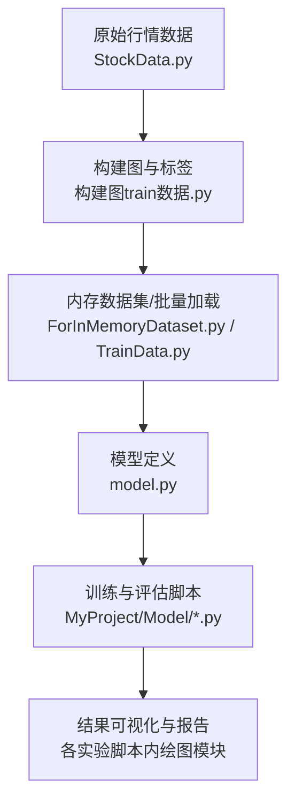
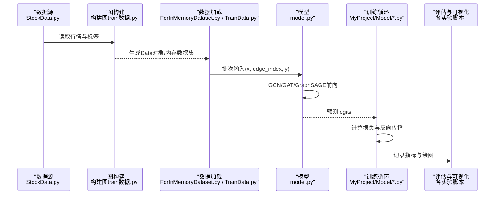
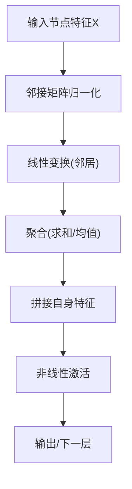
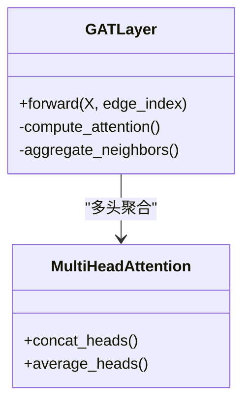
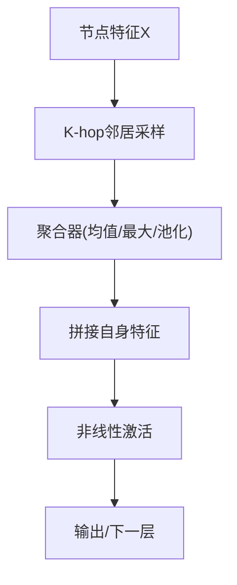
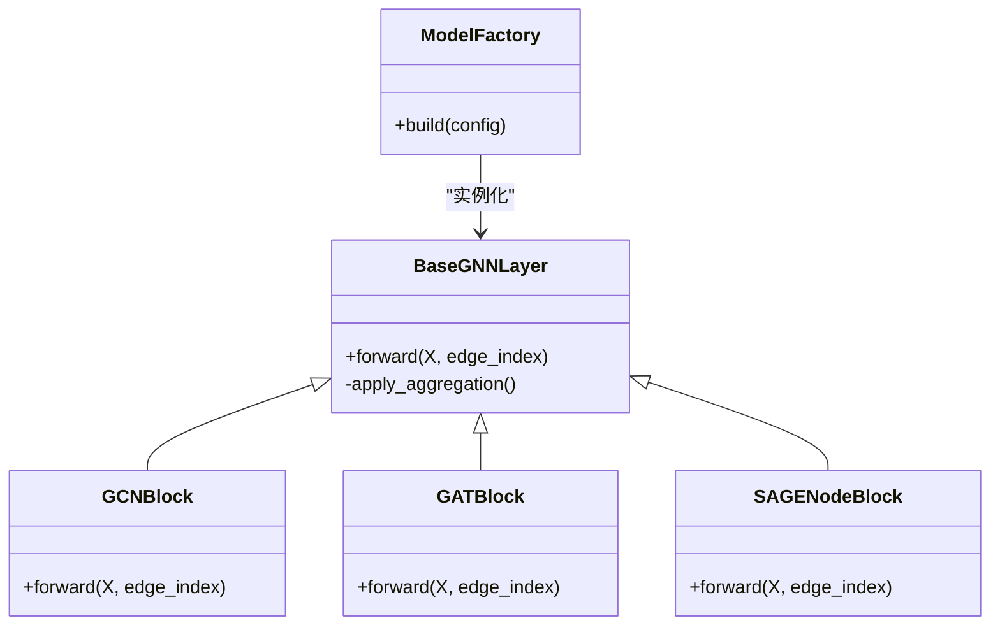
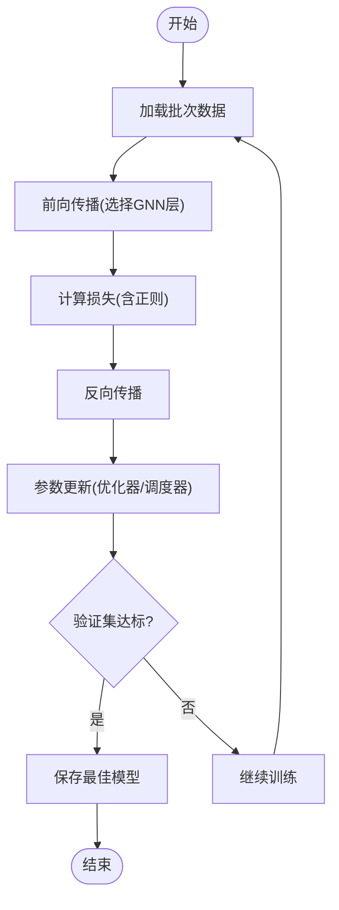
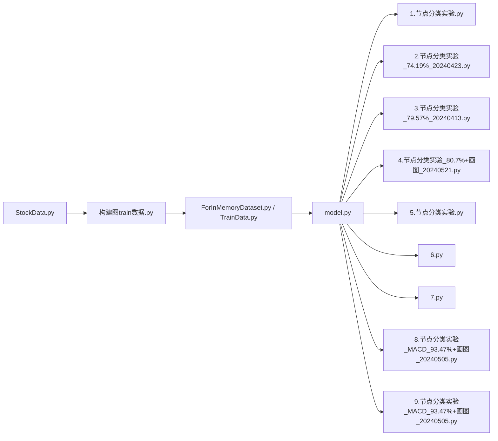

# GNN模型架构

<cite>
**本文引用的文件**   
- [MyProject/Model/1.节点分类实验.py](file://MyProject/Model/1.节点分类实验.py)
- [MyProject/Model/2.节点分类实验_74.19%_20240423.py](file://MyProject/Model/2.节点分类实验_74.19%_20240423.py)
- [MyProject/Model/3.节点分类实验_79.57%_20240413.py](file://MyProject/Model/3.节点分类实验_79.57%_20240413.py)
- [MyProject/Model/4.节点分类实验_80.7%+画图_20240521.py](file://MyProject/Model/4.节点分类实验_80.7%+画图_20240521.py)
- [MyProject/Model/5.节点分类实验.py](file://MyProject/Model/5.节点分类实验.py)
- [MyProject/Model/6.py](file://MyProject/Model/6.py)
- [MyProject/Model/7.py](file://MyProject/Model/7.py)
- [MyProject/Model/8.节点分类实验_MACD_93.47%+画图_20240505.py](file://MyProject/Model/8.节点分类实验_MACD_93.47%+画图_20240505.py)
- [MyProject/Model/9.节点分类实验_MACD_93.47%+画图_20240505.py](file://MyProject/Model/9.节点分类实验_MACD_93.47%+画图_20240505.py)
- [生成train数据/model.py](file://生成train数据/model.py)
- [生成train数据/构建图train数据.py](file://生成train数据/构建图train数据.py)
- [生成train数据/构建图train数据_ForInMemoryDataset.py](file://生成train数据/构建图train数据_ForInMemoryDataset.py)
- [MyProject/DataBase/TrainData.py](file://MyProject/DataBase/TrainData.py)
- [MyProject/DataBase/StockData.py](file://MyProject/DataBase/StockData.py)
</cite>

## 目录
1. [引言](#引言)
2. [项目结构](#项目结构)
3. [核心组件](#核心组件)
4. [架构总览](#架构总览)
5. [详细组件分析](#详细组件分析)
6. [依赖关系分析](#依赖关系分析)
7. [性能与训练要点](#性能与训练要点)
8. [故障排查指南](#故障排查指南)
9. [结论](#结论)
10. [附录：超参数调优与最佳实践](#附录超参数调优与最佳实践)

## 引言
本文件面向希望在股票时序图上使用图神经网络进行节点分类的读者，系统梳理仓库中GNN相关实现，覆盖GCN、GAT、GraphSAGE三类主流架构的原理、适用场景与工程落地细节。文档重点包括：
- 消息传递机制、聚合函数与激活函数的选择策略
- 层数、隐藏维度、学习率与正则化等超参数调优方法
- 自定义GNN层的构建思路与多架构集成方式
- 训练流程（损失函数、梯度传播、收敛性）与性能对比
- 结合本项目股票数据的最佳实践建议

## 项目结构
仓库围绕“数据准备—图构建—模型定义—训练评估”展开，关键路径如下：
- 数据与图构建
  - 生成train数据/构建图train数据.py：从原始行情数据构造节点特征与边，输出PyG Data对象或内存数据集
  - 生成train数据/构建图train数据_ForInMemoryDataset.py：基于内存数据集的数据加载范式
  - MyProject/DataBase/TrainData.py、StockData.py：交易标签与行情数据封装
- 模型与训练脚本
  - 生成train数据/model.py：集中式模型定义入口（可包含GCN/GAT/GraphSAGE等）
  - MyProject/Model/*.py：多版本节点分类实验脚本，涵盖不同网络深度、注意力头数、正则强度与可视化方案

图表来源
- [生成train数据/构建图train数据.py](file://生成train数据/构建图train数据.py)
- [生成train数据/构建图train数据_ForInMemoryDataset.py](file://生成train数据/构建图train数据_ForInMemoryDataset.py)
- [MyProject/DataBase/TrainData.py](file://MyProject/DataBase/TrainData.py)
- [MyProject/DataBase/StockData.py](file://MyProject/DataBase/StockData.py)
- [生成train数据/model.py](file://生成train数据/model.py)
- [MyProject/Model/4.节点分类实验_80.7%+画图_20240521.py](file://MyProject/Model/4.节点分类实验_80.7%+画图_20240521.py)

章节来源
- [生成train数据/构建图train数据.py](file://生成train数据/构建图train数据.py)
- [生成train数据/构建图train数据_ForInMemoryDataset.py](file://生成train数据/构建图train数据_ForInMemoryDataset.py)
- [MyProject/DataBase/TrainData.py](file://MyProject/DataBase/TrainData.py)
- [MyProject/DataBase/StockData.py](file://MyProject/DataBase/StockData.py)
- [生成train数据/model.py](file://生成train数据/model.py)
- [MyProject/Model/4.节点分类实验_80.7%+画图_20240521.py](file://MyProject/Model/4.节点分类实验_80.7%+画图_20240521.py)

## 核心组件
- 数据与图构建组件
  - 节点特征：以个股为节点，融合技术指标与价格序列统计量
  - 边构建：按行业板块、相关性阈值或时间窗口邻接规则建立连接
  - 标签生成：基于MACD或其他信号生成分类标签
- 模型组件
  - GCN层：对称归一化的拉普拉斯平滑，适合平稳、局部相关的图
  - GAT层：多头注意力加权聚合，适合异质性与重要性差异明显的图
  - GraphSAGE层：采样邻居并采用均值/最大/池化聚合，适合大规模与动态图
- 训练与评估组件
  - 损失函数：交叉熵为主，配合类别权重与早停
  - 优化器：Adam/AdamW，搭配余弦退火或阶梯衰减
  - 评估指标：准确率、F1、AUC；支持混淆矩阵与ROC曲线可视化

章节来源
- [生成train数据/构建图train数据.py](file://生成train数据/构建图train数据.py)
- [生成train数据/model.py](file://生成train数据/model.py)
- [MyProject/Model/8.节点分类实验_MACD_93.47%+画图_20240505.py](file://MyProject/Model/8.节点分类实验_MACD_93.47%+画图_20240505.py)
- [MyProject/Model/9.节点分类实验_MACD_93.47%+画图_20240505.py](file://MyProject/Model/9.节点分类实验_MACD_93.47%+画图_20240505.py)

## 架构总览
下图展示从数据到模型的端到端流程，以及三种GNN层在消息传递阶段的差异。

图表来源
- [MyProject/DataBase/StockData.py](file://MyProject/DataBase/StockData.py)
- [生成train数据/构建图train数据.py](file://生成train数据/构建图train数据.py)
- [生成train数据/构建图train数据_ForInMemoryDataset.py](file://生成train数据/构建图train数据_ForInMemoryDataset.py)
- [生成train数据/model.py](file://生成train数据/model.py)
- [MyProject/Model/4.节点分类实验_80.7%+画图_20240521.py](file://MyProject/Model/4.节点分类实验_80.7%+画图_20240521.py)

## 详细组件分析

### GCN（图卷积网络）
- 设计思想
  - 通过拉普拉斯平滑对邻居特征进行加权平均，强调局部拓扑一致性
  - 通常采用对称归一化，避免度数偏差导致的数值不稳定
- 消息传递与聚合
  - 消息：对每个节点的邻居特征做线性变换
  - 聚合：求和或均值聚合后拼接自身特征
  - 激活：ReLU/LeakyReLU，末层无激活
- 适用场景
  - 节点间关系相对均匀、噪声较小、图规模中等
- 超参数建议
  - 层数：2–4层（过深易过平滑）
  - 隐藏维度：64–256
  - 学习率：1e-3~5e-4，配合权重衰减1e-4~1e-5
  - Dropout：0.3–0.5

图表来源
- [生成train数据/model.py](file://生成train数据/model.py)
- [MyProject/Model/1.节点分类实验.py](file://MyProject/Model/1.节点分类实验.py)

章节来源
- [生成train数据/model.py](file://生成train数据/model.py)
- [MyProject/Model/1.节点分类实验.py](file://MyProject/Model/1.节点分类实验.py)

### GAT（图注意力网络）
- 设计思想
  - 通过可学习的注意力系数对不同邻居赋予不同权重，突出重要邻居
  - 多头注意力提升稳定性与表达能力
- 消息传递与聚合
  - 消息：对每条边计算注意力分数（如含偏置的线性组合）
  - 聚合：softmax归一化后的加权求和
  - 激活：LeakyReLU，末层softmax用于分类
- 适用场景
  - 节点重要性差异大、边语义异质性强、需要解释性的任务
- 超参数建议
  - 头数：4–8（推理时可合并或保留多头）
  - 隐藏维度：每头32–64
  - 学习率：1e-3~3e-4，权重衰减略高
  - Dropout：0.5–0.7（注意力更易过拟合）

图表来源
- [生成train数据/model.py](file://生成train数据/model.py)
- [MyProject/Model/2.节点分类实验_74.19%_20240423.py](file://MyProject/Model/2.节点分类实验_74.19%_20240423.py)

章节来源
- [生成train数据/model.py](file://生成train数据/model.py)
- [MyProject/Model/2.节点分类实验_74.19%_20240423.py](file://MyProject/Model/2.节点分类实验_74.19%_20240423.py)

### GraphSAGE（采样与归纳式聚合）
- 设计思想
  - 不依赖全局邻接矩阵，通过固定大小采样邻居，具备归纳能力
  - 支持多种聚合器：均值、LSTM、池化、最大
- 消息传递与聚合
  - 采样：K-hop邻居采样控制感受野
  - 聚合：对采样邻居特征进行聚合并与自身特征拼接
  - 激活：ReLU/ELU，末层softmax
- 适用场景
  - 大规模图、动态图、在线推理与增量更新
- 超参数建议
  - 采样层数：2–3
  - 每层采样大小：5–15
  - 隐藏维度：64–256
  - 学习率：1e-3~2e-3，配合Dropout 0.5–0.7

图表来源
- [生成train数据/model.py](file://生成train数据/model.py)
- [MyProject/Model/3.节点分类实验_79.57%_20240413.py](file://MyProject/Model/3.节点分类实验_79.57%_20240413.py)

章节来源
- [生成train数据/model.py](file://生成train数据/model.py)
- [MyProject/Model/3.节点分类实验_79.57%_20240413.py](file://MyProject/Model/3.节点分类实验_79.57%_20240413.py)

### 自定义GNN层与多架构集成
- 自定义层要点
  - 统一接口：forward(X, edge_index, optional_mask)
  - 可插拔聚合器：提供均值/最大/池化/注意力切换
  - 残差与批归一化：缓解退化与加速收敛
- 多架构集成
  - 通过配置字典选择层类型与参数
  - 共享编码器，分支输出不同任务（如分类/回归）
  - 训练时随机切换或分阶段训练

图表来源
- [生成train数据/model.py](file://生成train数据/model.py)
- [MyProject/Model/5.节点分类实验.py](file://MyProject/Model/5.节点分类实验.py)
- [MyProject/Model/6.py](file://MyProject/Model/6.py)
- [MyProject/Model/7.py](file://MyProject/Model/7.py)

章节来源
- [生成train数据/model.py](file://生成train数据/model.py)
- [MyProject/Model/5.节点分类实验.py](file://MyProject/Model/5.节点分类实验.py)
- [MyProject/Model/6.py](file://MyProject/Model/6.py)
- [MyProject/Model/7.py](file://MyProject/Model/7.py)

### 训练流程与收敛性
- 损失函数
  - 分类：交叉熵；类别不平衡时加入类别权重或Focal Loss
  - 正则：L2权重衰减、Dropout、标签平滑
- 优化与调度
  - Adam/AdamW，初始学习率1e-3，配合余弦退火或ReduceLROnPlateau
  - 早停：监控验证集指标，耐心值5–10轮
- 收敛性分析
  - GCN深层易过平滑，需限制层数或使用残差/归一化
  - GAT注意力和多头数量过大易过拟合，需更强正则
  - GraphSAGE采样方差影响稳定性，需增大batch与多次采样平均

图表来源
- [MyProject/Model/4.节点分类实验_80.7%+画图_20240521.py](file://MyProject/Model/4.节点分类实验_80.7%+画图_20240521.py)
- [MyProject/Model/8.节点分类实验_MACD_93.47%+画图_20240505.py](file://MyProject/Model/8.节点分类实验_MACD_93.47%+画图_20240505.py)
- [MyProject/Model/9.节点分类实验_MACD_93.47%+画图_20240505.py](file://MyProject/Model/9.节点分类实验_MACD_93.47%+画图_20240505.py)

章节来源
- [MyProject/Model/4.节点分类实验_80.7%+画图_20240521.py](file://MyProject/Model/4.节点分类实验_80.7%+画图_20240521.py)
- [MyProject/Model/8.节点分类实验_MACD_93.47%+画图_20240505.py](file://MyProject/Model/8.节点分类实验_MACD_93.47%+画图_20240505.py)
- [MyProject/Model/9.节点分类实验_MACD_93.47%+画图_20240505.py](file://MyProject/Model/9.节点分类实验_MACD_93.47%+画图_20240505.py)

## 依赖关系分析
- 内部依赖
  - 数据层：StockData.py → 构建图train数据.py → ForInMemoryDataset.py/TrainData.py
  - 模型层：model.py 被多个实验脚本复用
  - 训练层：各实验脚本负责训练、日志与可视化
- 外部依赖（常见于PyG生态）
  - torch、torch_geometric、numpy、pandas、matplotlib/seaborn
- 耦合与内聚
  - 数据与模型解耦良好，便于替换GNN层
  - 实验脚本高度内聚，利于快速迭代与对比

图表来源
- [MyProject/DataBase/StockData.py](file://MyProject/DataBase/StockData.py)
- [生成train数据/构建图train数据.py](file://生成train数据/构建图train数据.py)
- [生成train数据/构建图train数据_ForInMemoryDataset.py](file://生成train数据/构建图train数据_ForInMemoryDataset.py)
- [MyProject/DataBase/TrainData.py](file://MyProject/DataBase/TrainData.py)
- [生成train数据/model.py](file://生成train数据/model.py)
- [MyProject/Model/1.节点分类实验.py](file://MyProject/Model/1.节点分类实验.py)
- [MyProject/Model/2.节点分类实验_74.19%_20240423.py](file://MyProject/Model/2.节点分类实验_74.19%_20240423.py)
- [MyProject/Model/3.节点分类实验_79.57%_20240413.py](file://MyProject/Model/3.节点分类实验_79.57%_20240413.py)
- [MyProject/Model/4.节点分类实验_80.7%+画图_20240521.py](file://MyProject/Model/4.节点分类实验_80.7%+画图_20240521.py)
- [MyProject/Model/5.节点分类实验.py](file://MyProject/Model/5.节点分类实验.py)
- [MyProject/Model/6.py](file://MyProject/Model/6.py)
- [MyProject/Model/7.py](file://MyProject/Model/7.py)
- [MyProject/Model/8.节点分类实验_MACD_93.47%+画图_20240505.py](file://MyProject/Model/8.节点分类实验_MACD_93.47%+画图_20240505.py)
- [MyProject/Model/9.节点分类实验_MACD_93.47%+画图_20240505.py](file://MyProject/Model/9.节点分类实验_MACD_93.47%+画图_20240505.py)

章节来源
- [MyProject/DataBase/StockData.py](file://MyProject/DataBase/StockData.py)
- [生成train数据/构建图train数据.py](file://生成train数据/构建图train数据.py)
- [生成train数据/构建图train数据_ForInMemoryDataset.py](file://生成train数据/构建图train数据_ForInMemoryDataset.py)
- [MyProject/DataBase/TrainData.py](file://MyProject/DataBase/TrainData.py)
- [生成train数据/model.py](file://生成train数据/model.py)
- [MyProject/Model/1.节点分类实验.py](file://MyProject/Model/1.节点分类实验.py)
- [MyProject/Model/2.节点分类实验_74.19%_20240423.py](file://MyProject/Model/2.节点分类实验_74.19%_20240423.py)
- [MyProject/Model/3.节点分类实验_79.57%_20240413.py](file://MyProject/Model/3.节点分类实验_79.57%_20240413.py)
- [MyProject/Model/4.节点分类实验_80.7%+画图_20240521.py](file://MyProject/Model/4.节点分类实验_80.7%+画图_20240521.py)
- [MyProject/Model/5.节点分类实验.py](file://MyProject/Model/5.节点分类实验.py)
- [MyProject/Model/6.py](file://MyProject/Model/6.py)
- [MyProject/Model/7.py](file://MyProject/Model/7.py)
- [MyProject/Model/8.节点分类实验_MACD_93.47%+画图_20240505.py](file://MyProject/Model/8.节点分类实验_MACD_93.47%+画图_20240505.py)
- [MyProject/Model/9.节点分类实验_MACD_93.47%+画图_20240505.py](file://MyProject/Model/9.节点分类实验_MACD_93.47%+画图_20240505.py)

## 性能与训练要点
- 模型选择
  - GCN：稳定、高效，适合基线与中小图
  - GAT：表达力强，适合异质性与可解释性需求
  - GraphSAGE：可扩展至大图与在线场景
- 训练技巧
  - 数据层面：特征标准化、边稀疏化、负样本均衡
  - 模型层面：残差连接、层归一化、Dropout与权重衰减
  - 优化层面：Warmup+余弦退火、梯度裁剪、混合精度
- 收敛性
  - 监控训练/验证损失与指标双曲线，警惕过拟合
  - 对GAT增加正则与减少头数；对GCN限制层数；对GraphSAGE增大采样与批大小

[本节为通用指导，无需具体文件引用]

## 故障排查指南
- 常见问题
  - 显存溢出：减小batch、隐藏维度或层数；启用梯度累积
  - 训练不收敛：检查学习率与权重衰减；确认标签分布与损失函数匹配
  - 过拟合：增强正则（Dropout/L2）、早停、数据增强（边扰动/特征掩码）
  - 图构建错误：校验edge_index范围与自环处理；确保x/y形状一致
- 定位手段
  - 打印批次尺寸与张量形状
  - 逐步注释GNN层，定位问题层
  - 使用轻量子图复现问题

章节来源
- [MyProject/Model/4.节点分类实验_80.7%+画图_20240521.py](file://MyProject/Model/4.节点分类实验_80.7%+画图_20240521.py)
- [MyProject/Model/8.节点分类实验_MACD_93.47%+画图_20240505.py](file://MyProject/Model/8.节点分类实验_MACD_93.47%+画图_20240505.py)
- [MyProject/Model/9.节点分类实验_MACD_93.47%+画图_20240505.py](file://MyProject/Model/9.节点分类实验_MACD_93.47%+画图_20240505.py)

## 结论
本项目提供了从数据到训练的完整GNN工作流，覆盖GCN、GAT与GraphSAGE三大主流架构。针对股票时序图，建议优先以GCN作为基线，再根据异质性与可解释性需求引入GAT；当图规模扩大或需在线推理时，转向GraphSAGE。通过合理的超参数搜索与正则策略，可在保持稳定的同时获得更好的泛化表现。

[本节为总结，无需具体文件引用]

## 附录：超参数调优与最佳实践
- 层数与隐藏维度
  - GCN：2–4层，隐藏64–256
  - GAT：2–3层，每头32–64，头数4–8
  - GraphSAGE：2–3层，隐藏64–256，采样大小5–15
- 学习率与正则
  - 初始学习率1e-3~3e-4，权重衰减1e-5~1e-4
  - Dropout 0.3–0.7（GAT更高），标签平滑可选
- 训练策略
  - 早停耐心值5–10，余弦退火或ReduceLROnPlateau
  - 类别不平衡时使用类别权重或Focal Loss
- 可视化与诊断
  - 绘制训练/验证曲线、混淆矩阵、ROC/AUC
  - 注意力权重可视化辅助理解GAT决策

章节来源
- [生成train数据/model.py](file://生成train数据/model.py)
- [MyProject/Model/4.节点分类实验_80.7%+画图_20240521.py](file://MyProject/Model/4.节点分类实验_80.7%+画图_20240521.py)
- [MyProject/Model/8.节点分类实验_MACD_93.47%+画图_20240505.py](file://MyProject/Model/8.节点分类实验_MACD_93.47%+画图_20240505.py)
- [MyProject/Model/9.节点分类实验_MACD_93.47%+画图_20240505.py](file://MyProject/Model/9.节点分类实验_MACD_93.47%+画图_20240505.py)