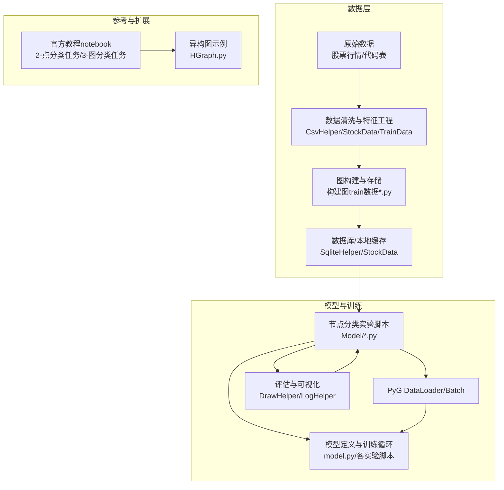
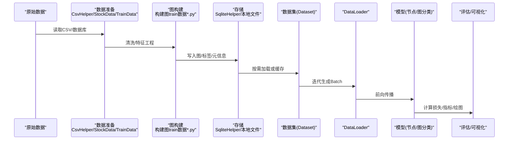
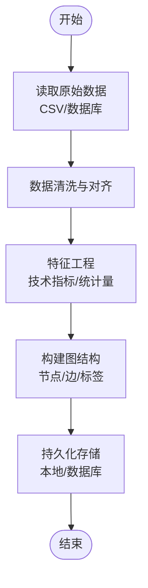
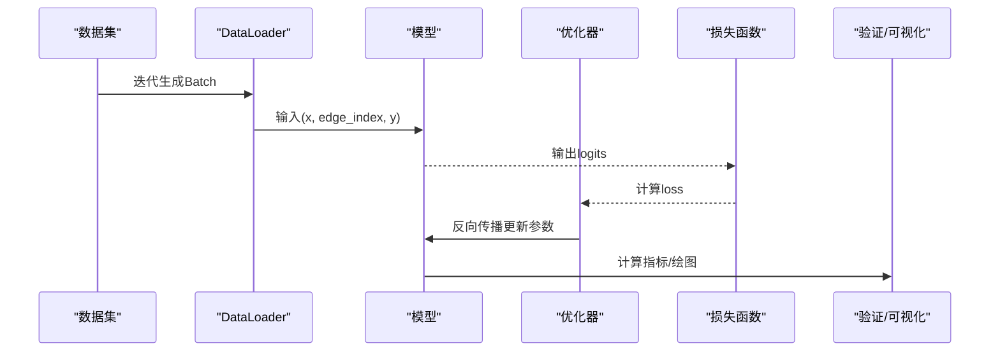

# PyTorch Geometric框架使用

<cite>
**本文引用的文件**   
- [1.节点分类实验.py](file://MyProject/Model/1.节点分类实验.py)
- [2.节点分类实验_74.19%_20240423.py](file://MyProject/Model/2.节点分类实验_74.19%_20240423.py)
- [3.节点分类实验_79.57%_20240413.py](file://MyProject/Model/3.节点分类实验_79.57%_20240413.py)
- [4.节点分类实验_80.7%+画图_20240521.py](file://MyProject/Model/4.节点分类实验_80.7%+画图_20240521.py)
- [5.节点分类实验.py](file://MyProject/Model/5.节点分类实验.py)
- [6.py](file://MyProject/Model/6.py)
- [7.py](file://MyProject/Model/7.py)
- [8.节点分类实验_MACD_93.47%+画图_20240505.py](file://MyProject/Model/8.节点分类实验_MACD_93.47%+画图_20240505.py)
- [9.节点分类实验_MACD_93.47%+画图_20240505.py](file://MyProject/Model/9.节点分类实验_MACD_93.47%+画图_20240505.py)
- [构建图train数据.py](file://生成train数据/构建图train数据.py)
- [构建图train数据_ForInMemoryDataset.py](file://生成train数据/构建图train数据_ForInMemoryDataset.py)
- [do.py](file://生成train数据/do.py)
- [do1.py](file://生成train数据/do1.py)
- [model.py](file://生成train数据/model.py)
- [获取个股票行情.py](file://生成train数据/获取个股票行情.py)
- [获取股市码表.py](file://生成train数据/获取股市码表.py)
- [StockData.py](file://MyProject/DataBase/StockData.py)
- [TrainData.py](file://MyProject/DataBase/TrainData.py)
- [CsvHelper.py](file://MyProject/Helper/CsvHelper.py)
- [DrawHelper.py](file://MyProject/Helper/DrawHelper.py)
- [LogHelper.py](file://MyProject/Helper/LogHelper.py)
- [RandomHelper.py](file://MyProject/Helper/RandomHelper.py)
- [SqliteHelper.py](file://MyProject/Helper/SqliteHelper.py)
- [2-点分类任务.ipynb](file://网络资料/3-图模型必备神器PyTorch Geometric安装与使用/工具包使用/2-点分类任务.ipynb)
- [3-图分类任务.ipynb](file://网络资料/3-图模型必备神器PyTorch Geometric安装与使用/工具包使用/3-图分类任务.ipynb)
- [HGraph.py](file://网络资料/HeterogeneousGraph/HGraph.py)
</cite>

## 目录
1. [简介](#简介)
2. [项目结构](#项目结构)
3. [核心组件](#核心组件)
4. [架构总览](#架构总览)
5. [详细组件分析](#详细组件分析)
6. [依赖关系分析](#依赖关系分析)
7. [性能考虑](#性能考虑)
8. [故障排查指南](#故障排查指南)
9. [结论](#结论)
10. [附录](#附录)

## 简介
本文件面向希望在PyTorch Geometric（PyG）上开展图神经网络实践的用户，结合仓库中的节点分类与图分类示例、数据构建脚本以及辅助工具，系统讲解PyG的核心概念与数据流：Data类、Batch类、Dataset类的用法；图数据的加载、处理与批处理机制；内存管理与性能优化；节点分类与图分类任务的差异（标签定义、损失函数、评估指标）；自定义数据集与数据管道；GPU加速与多卡训练配置；常见问题与调试技巧。文档以“循序渐进”的方式组织，既适合初学者快速上手，也便于有经验的开发者深入优化。

## 项目结构
仓库围绕“数据准备—模型训练—可视化与日志”的流水线组织，主要包含以下模块：
- 数据准备与图构建：位于“生成train数据”和“MyProject/DataBase”，负责从原始行情/代码表等源数据构建图结构、特征与标签，并持久化到数据库或本地文件。
- 模型与训练：位于“MyProject/Model”，提供多个节点分类实验脚本，涵盖不同特征工程、模型结构与训练流程。
- 辅助工具：位于“MyProject/Helper”，提供CSV读写、绘图、日志、随机数、SQLite访问等通用能力。
- 参考资料：位于“网络资料”，包含官方教程notebook与异构图示例，便于对照学习。

图表来源
- [构建图train数据.py](file://生成train数据/构建图train数据.py)
- [构建图train数据_ForInMemoryDataset.py](file://生成train数据/构建图train数据_ForInMemoryDataset.py)
- [StockData.py](file://MyProject/DataBase/StockData.py)
- [TrainData.py](file://MyProject/DataBase/TrainData.py)
- [CsvHelper.py](file://MyProject/Helper/CsvHelper.py)
- [SqliteHelper.py](file://MyProject/Helper/SqliteHelper.py)
- [DrawHelper.py](file://MyProject/Helper/DrawHelper.py)
- [LogHelper.py](file://MyProject/Helper/LogHelper.py)
- [2-点分类任务.ipynb](file://网络资料/3-图模型必备神器PyTorch Geometric安装与使用/工具包使用/2-点分类任务.ipynb)
- [3-图分类任务.ipynb](file://网络资料/3-图模型必备神器PyTorch Geometric安装与使用/工具包使用/3-图分类任务.ipynb)
- [HGraph.py](file://网络资料/HeterogeneousGraph/HGraph.py)

章节来源
- [构建图train数据.py](file://生成train数据/构建图train数据.py)
- [构建图train数据_ForInMemoryDataset.py](file://生成train数据/构建图train数据_ForInMemoryDataset.py)
- [StockData.py](file://MyProject/DataBase/StockData.py)
- [TrainData.py](file://MyProject/DataBase/TrainData.py)
- [CsvHelper.py](file://MyProject/Helper/CsvHelper.py)
- [SqliteHelper.py](file://MyProject/Helper/SqliteHelper.py)
- [DrawHelper.py](file://MyProject/Helper/DrawHelper.py)
- [LogHelper.py](file://MyProject/Helper/LogHelper.py)
- [2-点分类任务.ipynb](file://网络资料/3-图模型必备神器PyTorch Geometric安装与使用/工具包使用/2-点分类任务.ipynb)
- [3-图分类任务.ipynb](file://网络资料/3-图模型必备神器PyTorch Geometric安装与使用/工具包使用/3-图分类任务.ipynb)
- [HGraph.py](file://网络资料/HeterogeneousGraph/HGraph.py)

## 核心组件
本节聚焦PyG在仓库中的关键抽象与使用方式：Data、Batch、Dataset及其在数据管道中的作用。

- Data类
  - 作用：封装单张图的节点特征、边索引、边特征、节点/图级标签等。
  - 典型属性：x（节点特征）、edge_index（CSC格式的边索引）、y（节点或图级标签）、edge_attr（可选边特征）。
  - 在本仓库中的应用：图构建脚本中构造Data对象，将时序/技术指标转化为节点特征，将交易信号或类别作为标签。
  - 参考路径：[构建图train数据.py](file://生成train数据/构建图train数据.py)、[构建图train数据_ForInMemoryDataset.py](file://生成train数据/构建图train数据_ForInMemoryDataset.py)。

- Batch类
  - 作用：将多个Data对象合并为批次，自动拼接x、y、edge_index等，并维护batch向量用于区分样本归属。
  - 典型用法：通过DataLoader进行迭代时，返回的即为Batch对象。
  - 参考路径：各节点分类实验脚本中使用DataLoader与Batch进行训练循环。

- Dataset类
  - 作用：实现可迭代的数据集接口，支持懒加载或内存缓存（如InMemoryDataset），便于大规模数据处理。
  - 在本仓库中的应用：ForInMemoryDataset变体用于演示内存缓存策略，提升小/中等规模数据读取效率。
  - 参考路径：[构建图train数据_ForInMemoryDataset.py](file://生成train数据/构建图train数据_ForInMemoryDataset.py)。

- DataLoader
  - 作用：基于Dataset批量采样，支持多线程预取、打乱顺序、动态批处理等。
  - 参考路径：各训练脚本中创建DataLoader并迭代训练。

章节来源
- [构建图train数据.py](file://生成train数据/构建图train数据.py)
- [构建图train数据_ForInMemoryDataset.py](file://生成train数据/构建图train数据_ForInMemoryDataset.py)
- [1.节点分类实验.py](file://MyProject/Model/1.节点分类实验.py)
- [2.节点分类实验_74.19%_20240423.py](file://MyProject/Model/2.节点分类实验_74.19%_20240423.py)
- [3.节点分类实验_79.57%_20240413.py](file://MyProject/Model/3.节点分类实验_79.57%_20240413.py)
- [4.节点分类实验_80.7%+画图_20240521.py](file://MyProject/Model/4.节点分类实验_80.7%+画图_20240521.py)
- [5.节点分类实验.py](file://MyProject/Model/5.节点分类实验.py)
- [6.py](file://MyProject/Model/6.py)
- [7.py](file://MyProject/Model/7.py)
- [8.节点分类实验_MACD_93.47%+画图_20240505.py](file://MyProject/Model/8.节点分类实验_MACD_93.47%+画图_20240505.py)
- [9.节点分类实验_MACD_93.47%+画图_20240505.py](file://MyProject/Model/9.节点分类实验_MACD_93.47%+画图_20240505.py)

## 架构总览
下图展示从原始数据到模型训练的端到端流程，突出PyG在其中的角色与数据流转。

图表来源
- [构建图train数据.py](file://生成train数据/构建图train数据.py)
- [构建图train数据_ForInMemoryDataset.py](file://生成train数据/构建图train数据_ForInMemoryDataset.py)
- [StockData.py](file://MyProject/DataBase/StockData.py)
- [TrainData.py](file://MyProject/DataBase/TrainData.py)
- [CsvHelper.py](file://MyProject/Helper/CsvHelper.py)
- [SqliteHelper.py](file://MyProject/Helper/SqliteHelper.py)
- [1.节点分类实验.py](file://MyProject/Model/1.节点分类实验.py)
- [2.节点分类实验_74.19%_20240423.py](file://MyProject/Model/2.节点分类实验_74.19%_20240423.py)
- [3.节点分类实验_79.57%_20240413.py](file://MyProject/Model/3.节点分类实验_79.57%_20240413.py)
- [4.节点分类实验_80.7%+画图_20240521.py](file://MyProject/Model/4.节点分类实验_80.7%+画图_20240521.py)
- [5.节点分类实验.py](file://MyProject/Model/5.节点分类实验.py)
- [6.py](file://MyProject/Model/6.py)
- [7.py](file://MyProject/Model/7.py)
- [8.节点分类实验_MACD_93.47%+画图_20240505.py](file://MyProject/Model/8.节点分类实验_MACD_93.47%+画图_20240505.py)
- [9.节点分类实验_MACD_93.47%+画图_20240505.py](file://MyProject/Model/9.节点分类实验_MACD_93.47%+画图_20240505.py)

## 详细组件分析

### 数据构建与存储组件
- 功能要点
  - 从CSV/数据库读取原始行情与代码表，进行清洗与对齐。
  - 根据业务规则构建图结构（节点=标的/时间片，边=关联/时序关系），提取节点特征（技术指标等）与标签（交易信号/类别）。
  - 将图与元信息持久化，供后续训练阶段按需加载或缓存。
- 关键文件
  - [构建图train数据.py](file://生成train数据/构建图train数据.py)
  - [构建图train数据_ForInMemoryDataset.py](file://生成train数据/构建图train数据_ForInMemoryDataset.py)
  - [StockData.py](file://MyProject/DataBase/StockData.py)
  - [TrainData.py](file://MyProject/DataBase/TrainData.py)
  - [CsvHelper.py](file://MyProject/Helper/CsvHelper.py)
  - [SqliteHelper.py](file://MyProject/Helper/SqliteHelper.py)
- 流程图（数据构建）

图表来源
- [构建图train数据.py](file://生成train数据/构建图train数据.py)
- [构建图train数据_ForInMemoryDataset.py](file://生成train数据/构建图train数据_ForInMemoryDataset.py)
- [StockData.py](file://MyProject/DataBase/StockData.py)
- [TrainData.py](file://MyProject/DataBase/TrainData.py)
- [CsvHelper.py](file://MyProject/Helper/CsvHelper.py)
- [SqliteHelper.py](file://MyProject/Helper/SqliteHelper.py)

章节来源
- [构建图train数据.py](file://生成train数据/构建图train数据.py)
- [构建图train数据_ForInMemoryDataset.py](file://生成train数据/构建图train数据_ForInMemoryDataset.py)
- [StockData.py](file://MyProject/DataBase/StockData.py)
- [TrainData.py](file://MyProject/DataBase/TrainData.py)
- [CsvHelper.py](file://MyProject/Helper/CsvHelper.py)
- [SqliteHelper.py](file://MyProject/Helper/SqliteHelper.py)

### 节点分类任务组件
- 任务说明
  - 目标：对图中每个节点预测类别（例如交易信号）。
  - 标签：节点级标签y，形状通常为[N]或[N, C]。
  - 损失函数：交叉熵损失（含权重或忽略未知类别）。
  - 评估指标：准确率、F1、混淆矩阵等。
- 关键文件
  - [1.节点分类实验.py](file://MyProject/Model/1.节点分类实验.py)
  - [2.节点分类实验_74.19%_20240423.py](file://MyProject/Model/2.节点分类实验_74.19%_20240423.py)
  - [3.节点分类实验_79.57%_20240413.py](file://MyProject/Model/3.节点分类实验_79.57%_20240413.py)
  - [4.节点分类实验_80.7%+画图_20240521.py](file://MyProject/Model/4.节点分类实验_80.7%+画图_20240521.py)
  - [5.节点分类实验.py](file://MyProject/Model/5.节点分类实验.py)
  - [6.py](file://MyProject/Model/6.py)
  - [7.py](file://MyProject/Model/7.py)
  - [8.节点分类实验_MACD_93.47%+画图_20240505.py](file://MyProject/Model/8.节点分类实验_MACD_93.47%+画图_20240505.py)
  - [9.节点分类实验_MACD_93.47%+画图_20240505.py](file://MyProject/Model/9.节点分类实验_MACD_93.47%+画图_20240505.py)
- 训练序列（简化）

图表来源
- [1.节点分类实验.py](file://MyProject/Model/1.节点分类实验.py)
- [2.节点分类实验_74.19%_20240423.py](file://MyProject/Model/2.节点分类实验_74.19%_20240423.py)
- [3.节点分类实验_79.57%_20240413.py](file://MyProject/Model/3.节点分类实验_79.57%_20240413.py)
- [4.节点分类实验_80.7%+画图_20240521.py](file://MyProject/Model/4.节点分类实验_80.7%+画图_20240521.py)
- [5.节点分类实验.py](file://MyProject/Model/5.节点分类实验.py)
- [6.py](file://MyProject/Model/6.py)
- [7.py](file://MyProject/Model/7.py)
- [8.节点分类实验_MACD_93.47%+画图_20240505.py](file://MyProject/Model/8.节点分类实验_MACD_93.47%+画图_20240505.py)
- [9.节点分类实验_MACD_93.47%+画图_20240505.py](file://MyProject/Model/9.节点分类实验_MACD_93.47%+画图_20240505.py)

章节来源
- [1.节点分类实验.py](file://MyProject/Model/1.节点分类实验.py)
- [2.节点分类实验_74.19%_20240423.py](file://MyProject/Model/2.节点分类实验_74.19%_20240423.py)
- [3.节点分类实验_79.57%_20240413.py](file://MyProject/Model/3.节点分类实验_79.57%_20240413.py)
- [4.节点分类实验_80.7%+画图_20240521.py](file://MyProject/Model/4.节点分类实验_80.7%+画图_20240521.py)
- [5.节点分类实验.py](file://MyProject/Model/5.节点分类实验.py)
- [6.py](file://MyProject/Model/6.py)
- [7.py](file://MyProject/Model/7.py)
- [8.节点分类实验_MACD_93.47%+画图_20240505.py](file://MyProject/Model/8.节点分类实验_MACD_93.47%+画图_20240505.py)
- [9.节点分类实验_MACD_93.47%+画图_20240505.py](file://MyProject/Model/9.节点分类实验_MACD_93.47%+画图_20240505.py)

### 图分类任务组件
- 任务说明
  - 目标：对整张图预测类别（分子性质、图相似度等）。
  - 标签：图级标签y，形状通常为[1]或[C]。
  - 常见池化：全局平均池化/最大池化/SumPool等，将节点表示聚合为图表示。
  - 损失函数：交叉熵损失。
  - 评估指标：准确率、AUC等。
- 参考路径
  - [3-图分类任务.ipynb](file://网络资料/3-图模型必备神器PyTorch Geometric安装与使用/工具包使用/3-图分类任务.ipynb)
- 对比节点分类
  - 标签维度与位置不同（节点级vs图级）。
  - 需要图池化层或全局操作。
  - 评估通常在图级别进行。

章节来源
- [3-图分类任务.ipynb](file://网络资料/3-图模型必备神器PyTorch Geometric安装与使用/工具包使用/3-图分类任务.ipynb)

### 异构图组件（扩展）
- 功能要点
  - 支持多种节点/边类型，分别建模与消息传递。
  - 适用于推荐系统、知识图谱等场景。
- 参考路径
  - [HGraph.py](file://网络资料/HeterogeneousGraph/HGraph.py)

章节来源
- [HGraph.py](file://网络资料/HeterogeneousGraph/HGraph.py)

## 依赖关系分析
- 内部依赖
  - 数据准备模块被图构建脚本调用，后者产出Data/Dataset供训练脚本使用。
  - 训练脚本依赖PyG的Data、Batch、DataLoader及模型库。
  - 可视化与日志模块贯穿训练与评估阶段。
- 外部依赖
  - PyTorch与PyG核心库。
  - 数据处理库（如pandas、numpy）与可视化工具。
- 潜在耦合点
  - 数据格式约定（x、edge_index、y字段名与dtype）。
  - 设备管理（CPU/GPU）与数据类型一致性。

图表来源
- [CsvHelper.py](file://MyProject/Helper/CsvHelper.py)
- [SqliteHelper.py](file://MyProject/Helper/SqliteHelper.py)
- [StockData.py](file://MyProject/DataBase/StockData.py)
- [TrainData.py](file://MyProject/DataBase/TrainData.py)
- [构建图train数据.py](file://生成train数据/构建图train数据.py)
- [构建图train数据_ForInMemoryDataset.py](file://生成train数据/构建图train数据_ForInMemoryDataset.py)
- [1.节点分类实验.py](file://MyProject/Model/1.节点分类实验.py)
- [2.节点分类实验_74.19%_20240423.py](file://MyProject/Model/2.节点分类实验_74.19%_20240423.py)
- [3-图分类任务.ipynb](file://网络资料/3-图模型必备神器PyTorch Geometric安装与使用/工具包使用/3-图分类任务.ipynb)

章节来源
- [CsvHelper.py](file://MyProject/Helper/CsvHelper.py)
- [SqliteHelper.py](file://MyProject/Helper/SqliteHelper.py)
- [StockData.py](file://MyProject/DataBase/StockData.py)
- [TrainData.py](file://MyProject/DataBase/TrainData.py)
- [构建图train数据.py](file://生成train数据/构建图train数据.py)
- [构建图train数据_ForInMemoryDataset.py](file://生成train数据/构建图train数据_ForInMemoryDataset.py)
- [1.节点分类实验.py](file://MyProject/Model/1.节点分类实验.py)
- [2.节点分类实验_74.19%_20240423.py](file://MyProject/Model/2.节点分类实验_74.19%_20240423.py)
- [3-图分类任务.ipynb](file://网络资料/3-图模型必备神器PyTorch Geometric安装与使用/工具包使用/3-图分类任务.ipynb)

## 性能考虑
- 内存管理
  - 使用InMemoryDataset缓存中小规模图，减少I/O开销。
  - 对超大规模图采用分块/子图采样（如NeighborSampler）以降低显存占用。
- 批处理优化
  - 合理设置batch_size与num_workers，平衡吞吐与内存。
  - 避免在DataLoader中进行重型预处理，尽量离线完成。
- 设备与数据类型
  - 统一x、edge_index、y的设备与dtype，减少频繁to()调用。
  - 使用半精度（float16/bfloat16）在支持的硬件上加速。
- 并行与分布式
  - 多进程DataLoader提高数据加载速度。
  - 多卡训练可使用DDP或PyG内置分布式采样器。

[本节为通用指导，不直接分析具体文件]

## 故障排查指南
- 常见问题
  - 维度不匹配：检查x、edge_index、y的形状与dtype是否与模型期望一致。
  - 设备不一致：确保所有张量在同一设备上（CPU/GPU）。
  - 内存溢出：减小batch_size、启用分块采样、关闭不必要的梯度保存。
  - 数据加载慢：增加num_workers、减少DataLoader内计算、使用InMemoryDataset。
- 调试技巧
  - 打印中间张量形状与取值范围，定位异常。
  - 使用最小复现样例隔离问题。
  - 借助日志记录关键步骤耗时与资源占用。
- 相关工具
  - 日志：[LogHelper.py](file://MyProject/Helper/LogHelper.py)
  - 绘图：[DrawHelper.py](file://MyProject/Helper/DrawHelper.py)
  - 随机性控制：[RandomHelper.py](file://MyProject/Helper/RandomHelper.py)

章节来源
- [LogHelper.py](file://MyProject/Helper/LogHelper.py)
- [DrawHelper.py](file://MyProject/Helper/DrawHelper.py)
- [RandomHelper.py](file://MyProject/Helper/RandomHelper.py)

## 结论
本项目围绕PyG构建了从数据准备到模型训练的完整链路，覆盖节点分类与图分类两类任务。通过规范化的Data/Batch/Dataset设计与合理的性能优化策略，可在保证可解释性的同时获得良好的训练效率。建议在实际工程中结合业务需求选择合适的数据缓存与采样策略，并持续监控内存与显存占用，逐步迭代模型与数据管道。

[本节为总结性内容，不直接分析具体文件]

## 附录
- 参考教程
  - 节点分类：[2-点分类任务.ipynb](file://网络资料/3-图模型必备神器PyTorch Geometric安装与使用/工具包使用/2-点分类任务.ipynb)
  - 图分类：[3-图分类任务.ipynb](file://网络资料/3-图模型必备神器PyTorch Geometric安装与使用/工具包使用/3-图分类任务.ipynb)
  - 异构图：[HGraph.py](file://网络资料/HeterogeneousGraph/HGraph.py)
- 数据与模型脚本
  - 数据构建：[构建图train数据.py](file://生成train数据/构建图train数据.py)、[构建图train数据_ForInMemoryDataset.py](file://生成train数据/构建图train数据_ForInMemoryDataset.py)
  - 训练实验：[1.节点分类实验.py](file://MyProject/Model/1.节点分类实验.py)至[9.节点分类实验_MACD_93.47%+画图_20240505.py](file://MyProject/Model/9.节点分类实验_MACD_93.47%+画图_20240505.py)
  - 模型定义：[model.py](file://生成train数据/model.py)
  - 数据获取：[获取个股票行情.py](file://生成train数据/获取个股票行情.py)、[获取股市码表.py](file://生成train数据/获取股市码表.py)
  - 运行入口：[do.py](file://生成train数据/do.py)、[do1.py](file://生成train数据/do1.py)

[本节为参考清单，不直接分析具体文件]