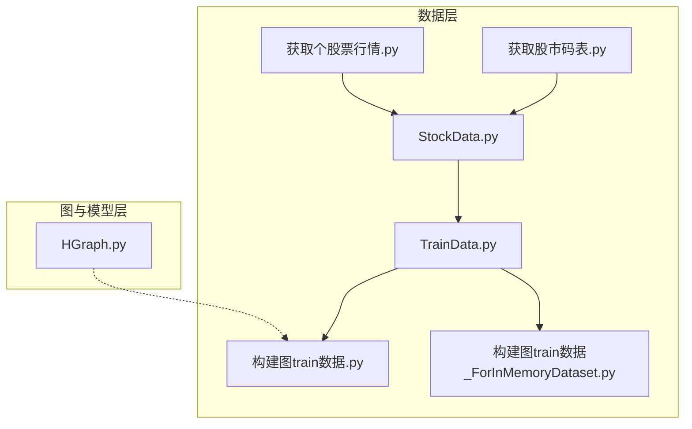
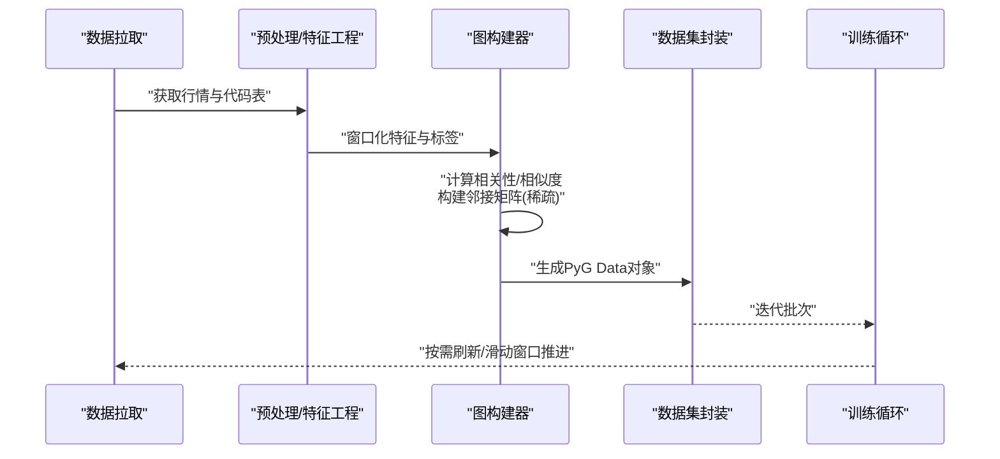
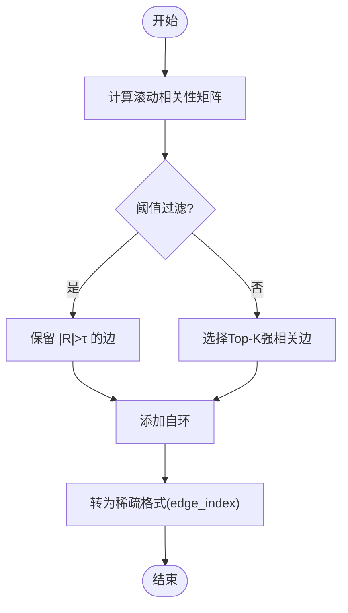
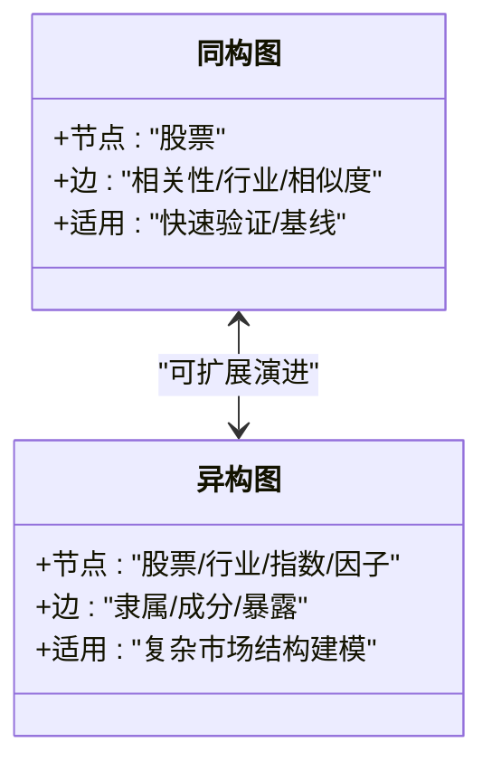
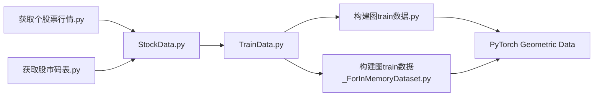

# 图理论基础与应用

<cite>
**本文引用的文件**   
- [构建图train数据.py](file://MyProject/DataBase/构建图train数据.py)
- [StockData.py](file://MyProject/DataBase/StockData.py)
- [TrainData.py](file://MyProject/DataBase/TrainData.py)
- [构建图train数据_ForInMemoryDataset.py](file://生成train数据/构建图train数据_ForInMemoryDataset.py)
- [获取个股票行情.py](file://生成train数据/获取个股票行情.py)
- [获取股市码表.py](file://生成train数据/获取股市码表.py)
- [HGraph.py](file://网络资料/HeterogeneousGraph/HGraph.py)
</cite>

## 目录
1. [引言](#引言)
2. [项目结构](#项目结构)
3. [核心组件](#核心组件)
4. [架构总览](#架构总览)
5. [详细组件分析](#详细组件分析)
6. [依赖关系分析](#依赖关系分析)
7. [性能与优化](#性能与优化)
8. [故障排查指南](#故障排查指南)
9. [结论](#结论)
10. [附录](#附录)

## 引言
本文件面向希望在金融市场中应用图神经网络（GNN）的读者，系统阐述图理论在股票市场建模中的基础概念与实践方法。内容涵盖：
- 图的基本数学表示：节点、边、邻接矩阵与特征张量
- 股票市场建模中节点与边的定义策略：相关性、行业分类、技术相似性
- 邻接矩阵构建与稀疏化优化，以及动态图更新机制
- 使用 PyTorch Geometric 将股票数据转换为图结构的流程与示例路径
- 同构图与异构图在金融场景中的应用差异与选择建议

## 项目结构
仓库围绕“数据准备—图构建—训练实验”的主线组织，关键目录与职责如下：
- MyProject/DataBase：原始数据处理、交易标签与图训练数据构建
- 生成train数据：面向内存数据集的图构建脚本与行情/代码表获取工具
- 网络资料：PyTorch Geometric 教程与异构图示例
- Model：策略与实验脚本（与本图文档关联度较低）

图表来源
- [StockData.py:1-200](file://MyProject/DataBase/StockData.py#L1-L200)
- [TrainData.py:1-200](file://MyProject/DataBase/TrainData.py#L1-L200)
- [构建图train数据.py:1-200](file://MyProject/DataBase/构建图train数据.py#L1-L200)
- [构建图train数据_ForInMemoryDataset.py:1-200](file://生成train数据/构建图train数据_ForInMemoryDataset.py#L1-L200)
- [获取个股票行情.py:1-200](file://生成train数据/获取个股票行情.py#L1-L200)
- [获取股市码表.py:1-200](file://生成train数据/获取股市码表.py#L1-L200)
- [HGraph.py:1-200](file://网络资料/HeterogeneousGraph/HGraph.py#L1-L200)

章节来源
- [构建图train数据.py:1-200](file://MyProject/DataBase/构建图train数据.py#L1-L200)
- [构建图train数据_ForInMemoryDataset.py:1-200](file://生成train数据/构建图train数据_ForInMemoryDataset.py#L1-L200)
- [StockData.py:1-200](file://MyProject/DataBase/StockData.py#L1-L200)
- [TrainData.py:1-200](file://MyProject/DataBase/TrainData.py#L1-L200)
- [获取个股票行情.py:1-200](file://生成train数据/获取个股票行情.py#L1-L200)
- [获取股市码表.py:1-200](file://生成train数据/获取股市码表.py#L1-L200)
- [HGraph.py:1-200](file://网络资料/HeterogeneousGraph/HGraph.py#L1-L200)

## 核心组件
- 数据源与预处理
  - 个股行情与代码表获取：用于拉取历史价格、技术指标与标的清单
  - 标准化与窗口切分：构造时间序列窗口，计算滚动统计与技术指标
- 图构建器
  - 节点特征：以多窗口技术指标或价格衍生特征拼接为节点特征向量
  - 边构建：基于相关性阈值、行业分组或技术相似度筛选连接
  - 邻接矩阵：采用稀疏格式存储，支持动态更新
- 数据集封装
  - 传统 Dataset：按索引返回单个样本图
  - InMemoryDataset：将所有图缓存到内存，加速训练
- 异构图示例
  - 提供多类型节点与边的参考实现，便于扩展至“股票-板块-指数”等异构结构

章节来源
- [构建图train数据.py:1-200](file://MyProject/DataBase/构建图train数据.py#L1-L200)
- [构建图train数据_ForInMemoryDataset.py:1-200](file://生成train数据/构建图train数据_ForInMemoryDataset.py#L1-L200)
- [StockData.py:1-200](file://MyProject/DataBase/StockData.py#L1-L200)
- [TrainData.py:1-200](file://MyProject/DataBase/TrainData.py#L1-L200)
- [HGraph.py:1-200](file://网络资料/HeterogeneousGraph/HGraph.py#L1-L200)

## 架构总览
下图展示了从原始数据到图训练样本的整体流水线，并标注了关键模块与数据流向。

图表来源
- [构建图train数据.py:1-200](file://MyProject/DataBase/构建图train数据.py#L1-L200)
- [构建图train数据_ForInMemoryDataset.py:1-200](file://生成train数据/构建图train数据_ForInMemoryDataset.py#L1-L200)
- [StockData.py:1-200](file://MyProject/DataBase/StockData.py#L1-L200)
- [TrainData.py:1-200](file://MyProject/DataBase/TrainData.py#L1-L200)

## 详细组件分析

### 图理论基础与数学表示
- 节点与边
  - 节点：代表单只股票，携带时序窗口内的特征向量
  - 边：刻画股票间关系，如收益率相关性、行业归属、技术形态相似性等
- 图的数学表示
  - 邻接矩阵 A：描述节点间的连接关系，通常采用稀疏存储
  - 节点特征 X：形状为 (N, F)，N 为节点数，F 为特征维度
  - 边索引 edge_index：形状为 (2, E)，E 为边数，常用于 PyG
  - 标签 y：节点级任务（涨跌分类）、边级任务（关系预测）或图级任务（组合收益）
- 复杂度与空间
  - 邻接矩阵稀疏化后空间 O(E)，消息传递每层 O(E·d)，d 为隐藏维

章节来源
- [构建图train数据.py:1-200](file://MyProject/DataBase/构建图train数据.py#L1-L200)
- [构建图train数据_ForInMemoryDataset.py:1-200](file://生成train数据/构建图train数据_ForInMemoryDataset.py#L1-L200)

### 股票市场建模：节点与边的定义策略
- 节点定义
  - 节点集合：全市场或子池（如沪深300成分股）
  - 节点特征：多窗口技术指标（MA、MACD、RSI、波动率等）拼接；可加入基本面或资金流特征
- 边定义策略
  - 相关性：滚动窗口内收益率皮尔逊相关系数超过阈值则连边
  - 行业分类：同一申万/证监会行业内部连边，或跨行业弱连接
  - 技术相似性：基于形态学或动量轨迹的距离度量
- 权重与方向
  - 无向/有向：相关性可带符号，但GCN常用对称归一化
  - 权重：可用相关系数绝对值或互信息作为边权

章节来源
- [构建图train数据.py:1-200](file://MyProject/DataBase/构建图train数据.py#L1-L200)
- [构建图train数据_ForInMemoryDataset.py:1-200](file://生成train数据/构建图train数据_ForInMemoryDataset.py#L1-L200)

### 邻接矩阵构建与稀疏优化
- 构建步骤
  - 计算两两相关性矩阵 R
  - 阈值过滤：|R_ij| > τ 保留边
  - 可选：Top-K 连接或行业内全连接+跨行业稀疏连接
  - 自环处理：对角置1，便于聚合自身信息
- 稀疏优化
  - 使用 COO/CSC/CSR 等稀疏格式存储 A
  - 在 PyG 中以 edge_index 形式传入，避免稠密矩阵
- 动态图更新
  - 滑动窗口推进时，仅增量更新受影响行/列的相关性
  - 定期重算全局相关性，保持时效性与稳定性平衡

图表来源
- [构建图train数据.py:1-200](file://MyProject/DataBase/构建图train数据.py#L1-L200)
- [构建图train数据_ForInMemoryDataset.py:1-200](file://生成train数据/构建图train数据_ForInMemoryDataset.py#L1-L200)

章节来源
- [构建图train数据.py:1-200](file://MyProject/DataBase/构建图train数据.py#L1-L200)
- [构建图train数据_ForInMemoryDataset.py:1-200](file://生成train数据/构建图train数据_ForInMemoryDataset.py#L1-L200)

### 将股票数据转换为图结构（PyTorch Geometric）
- 输入
  - 节点特征 X：形状 (N, F)
  - 标签 y：形状 (N,) 或 (N, C)
  - 边索引 edge_index：形状 (2, E)
- 输出
  - torch_geometric.data.Data 对象，包含 x, edge_index, y 等属性
- 典型流程
  - 读取窗口化后的特征与标签
  - 根据策略生成 edge_index
  - 构造 Data 对象并放入数据集
- 参考实现路径
  - 传统数据集：[构建图train数据.py](file://MyProject/DataBase/构建图train数据.py)
  - 内存数据集：[构建图train数据_ForInMemoryDataset.py](file://生成train数据/构建图train数据_ForInMemoryDataset.py)

章节来源
- [构建图train数据.py:1-200](file://MyProject/DataBase/构建图train数据.py#L1-L200)
- [构建图train数据_ForInMemoryDataset.py:1-200](file://生成train数据/构建图train数据_ForInMemoryDataset.py#L1-L200)

### 异构图与同构图在金融场景的应用
- 同构图
  - 所有节点类型一致（均为股票），边关系单一（如相关性）
  - 适合快速验证与基线模型
- 异构图
  - 多类型节点：股票、行业、指数、因子等
  - 多类型边：股票-行业隶属、股票-指数成分、因子-股票暴露
  - 优势：更贴近真实市场结构，利于引入先验知识
- 参考实现
  - 异构图示例：[HGraph.py](file://网络资料/HeterogeneousGraph/HGraph.py)

图表来源
- [HGraph.py:1-200](file://网络资料/HeterogeneousGraph/HGraph.py#L1-L200)

章节来源
- [HGraph.py:1-200](file://网络资料/HeterogeneousGraph/HGraph.py#L1-L200)

## 依赖关系分析
- 数据到图的依赖链
  - 行情与代码表 → 预处理/特征工程 → 图构建器 → 数据集封装
- 外部库
  - PyTorch Geometric：Data 对象与训练循环
  - 数值计算：numpy/pandas/scipy（稀疏矩阵）
  - 可视化：matplotlib/seaborn（可选）

图表来源
- [获取个股票行情.py:1-200](file://生成train数据/获取个股票行情.py#L1-L200)
- [获取股市码表.py:1-200](file://生成train数据/获取股市码表.py#L1-L200)
- [StockData.py:1-200](file://MyProject/DataBase/StockData.py#L1-L200)
- [TrainData.py:1-200](file://MyProject/DataBase/TrainData.py#L1-L200)
- [构建图train数据.py:1-200](file://MyProject/DataBase/构建图train数据.py#L1-L200)
- [构建图train数据_ForInMemoryDataset.py:1-200](file://生成train数据/构建图train数据_ForInMemoryDataset.py#L1-L200)

章节来源
- [获取个股票行情.py:1-200](file://生成train数据/获取个股票行情.py#L1-L200)
- [获取股市码表.py:1-200](file://生成train数据/获取股市码表.py#L1-L200)
- [StockData.py:1-200](file://MyProject/DataBase/StockData.py#L1-L200)
- [TrainData.py:1-200](file://MyProject/DataBase/TrainData.py#L1-L200)
- [构建图train数据.py:1-200](file://MyProject/DataBase/构建图train数据.py#L1-L200)
- [构建图train数据_ForInMemoryDataset.py:1-200](file://生成train数据/构建图train数据_ForInMemoryDataset.py#L1-L200)

## 性能与优化
- 邻接矩阵稀疏化
  - 使用稀疏格式存储与运算，显著降低内存占用与传播开销
- 边剪枝
  - 阈值过滤与Top-K策略控制边密度，避免过密导致噪声放大
- 增量更新
  - 滑动窗口推进时局部更新相关性，减少重复计算
- 批处理与采样
  - 大图中使用邻居采样/分层采样提升训练效率
- 数值稳定
  - 相关性计算前对异常值进行去极值或稳健估计

## 故障排查指南
- 常见错误
  - 维度不匹配：X 的行数与节点数不一致；edge_index 越界
  - 空图：阈值过高导致无边；需调低阈值或放宽Top-K
  - 内存溢出：全量邻接矩阵未稀疏化；改用 edge_index 与稀疏格式
- 定位建议
  - 打印节点数、边数与特征维度
  - 检查 edge_index 是否包含自环与重复边
  - 逐步关闭边策略（仅行业/仅相关性）定位问题来源

章节来源
- [构建图train数据.py:1-200](file://MyProject/DataBase/构建图train数据.py#L1-L200)
- [构建图train数据_ForInMemoryDataset.py:1-200](file://生成train数据/构建图train数据_ForInMemoryDataset.py#L1-L200)

## 结论
通过将股票及其关系建模为图，GNN能够有效聚合多资产交互信息，提升节点级预测能力。实践中应重视：
- 合理的节点特征与边策略设计
- 邻接矩阵的稀疏化与动态更新
- 同构图到异构图的渐进式扩展
- 性能优化与工程化落地

## 附录
- 术语
  - 同构图：节点与边类型单一的图
  - 异构图：包含多种节点与边类型的图
  - 邻接矩阵：描述节点连接的矩阵
  - 稀疏矩阵：非零元素较少的矩阵高效存储格式
- 实践清单
  - 明确任务目标（节点/边/图级）
  - 确定节点特征集与窗口长度
  - 设计边策略（相关性/行业/相似度）
  - 构建稀疏邻接矩阵与 edge_index
  - 封装数据集并训练评估