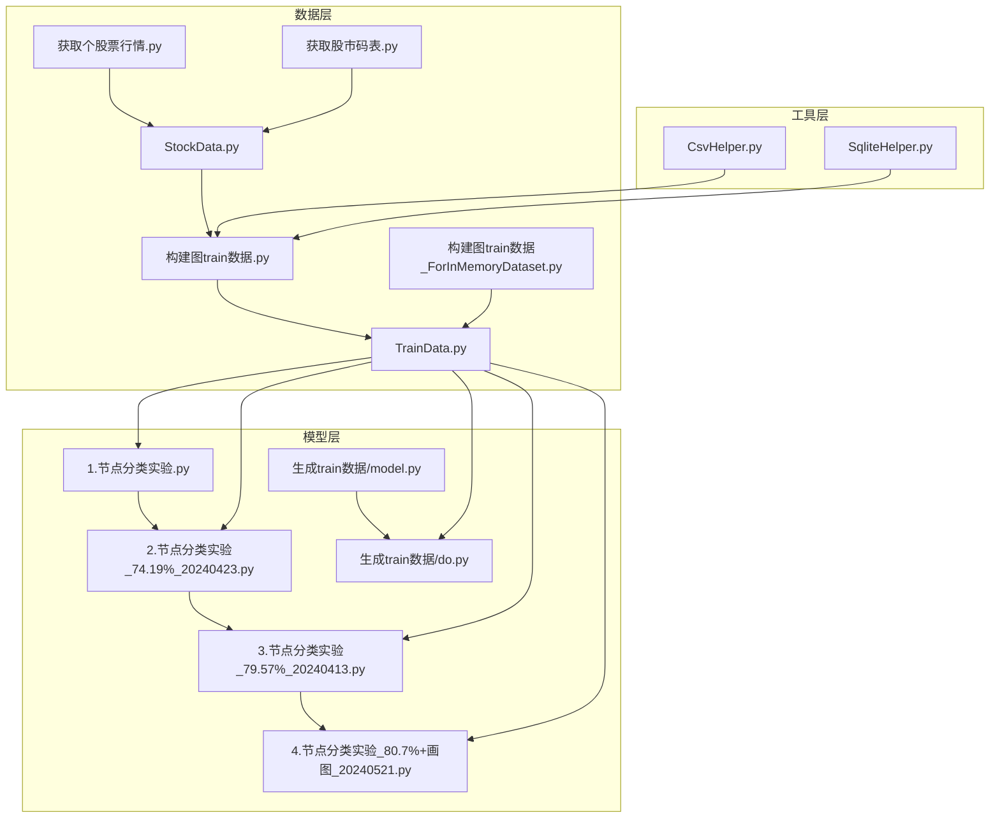
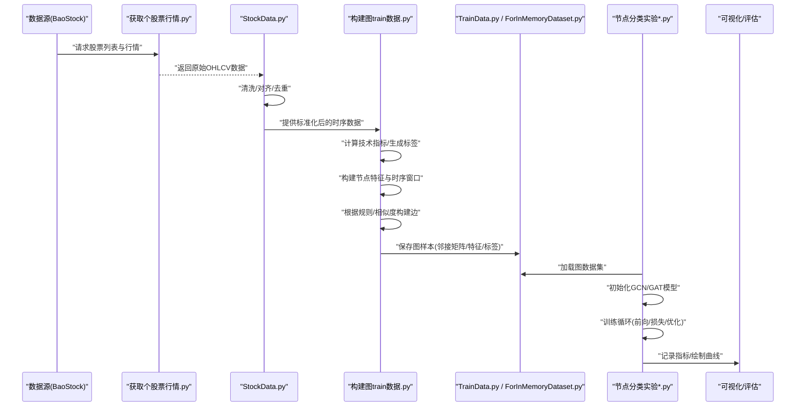
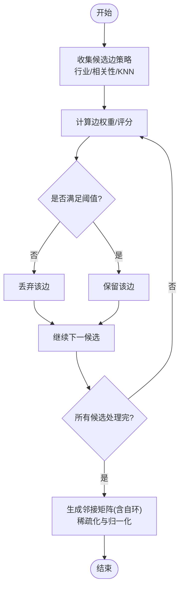
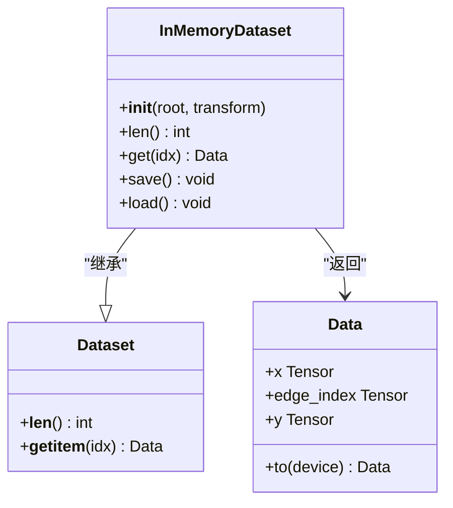
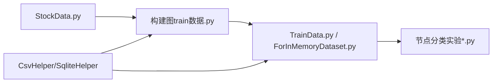

# 图神经网络建模

<cite>
**本文引用的文件**   
- [构建图train数据.py](file://MyProject/DataBase/构建图train数据.py)
- [StockData.py](file://MyProject/DataBase/StockData.py)
- [TrainData.py](file://MyProject/DataBase/TrainData.py)
- [1.节点分类实验.py](file://MyProject/Model/1.节点分类实验.py)
- [2.节点分类实验_74.19%_20240423.py](file://MyProject/Model/2.节点分类实验_74.19%_20240423.py)
- [3.节点分类实验_79.57%_20240413.py](file://MyProject/Model/3.节点分类实验_79.57%_20240413.py)
- [4.节点分类实验_80.7%+画图_20240521.py](file://MyProject/Model/4.节点分类实验_80.7%+画图_20240521.py)
- [获取个股票行情.py](file://生成train数据/获取个股票行情.py)
- [获取股市码表.py](file://生成train数据/获取股市码表.py)
- [构建图train数据_ForInMemoryDataset.py](file://生成train数据/构建图train数据_ForInMemoryDataset.py)
- [model.py](file://生成train数据/model.py)
- [do.py](file://生成train数据/do.py)
- [CsvHelper.py](file://MyProject/Helper/CsvHelper.py)
- [SqliteHelper.py](file://MyProject/Helper/SqliteHelper.py)
</cite>

## 目录
1. [简介](#简介)
2. [项目结构](#项目结构)
3. [核心组件](#核心组件)
4. [架构总览](#架构总览)
5. [详细组件分析](#详细组件分析)
6. [依赖关系分析](#依赖关系分析)
7. [性能与优化建议](#性能与优化建议)
8. [故障排查指南](#故障排查指南)
9. [结论](#结论)
10. [附录：端到端示例路径](#附录端到端示例路径)

## 简介
本项目围绕“基于图神经网络的股票预测”展开，目标是将多只股票及其历史行情、技术指标等序列信息建模为图结构，利用PyTorch Geometric（PyG）进行训练与推理。文档将系统阐述：
- 图理论基础在股票预测中的映射：节点定义、边关系构建、邻接矩阵生成
- PyG框架使用与自定义图数据结构实现
- 节点特征工程：技术指标选择、标准化、时间窗口处理
- GNN架构（GCN、GAT等）的实现要点与适用场景
- 图构建最佳实践与性能优化
- 完整代码示例路径（以仓库内脚本为准）

## 项目结构
仓库按功能分层组织：
- 数据层：从行情源拉取数据、计算指标、构造图样本并持久化
- 模型层：基于PyG的节点分类任务（涨跌方向或信号），包含多个实验脚本
- 工具层：CSV/SQLite读写、绘图、日志、随机数等辅助模块



图表来源
- [获取个股票行情.py:1-200](file://生成train数据/获取个股票行情.py#L1-L200)
- [StockData.py:1-200](file://MyProject/DataBase/StockData.py#L1-L200)
- [构建图train数据.py:1-200](file://MyProject/DataBase/构建图train数据.py#L1-L200)
- [TrainData.py:1-200](file://MyProject/DataBase/TrainData.py#L1-L200)
- [获取股市码表.py:1-200](file://生成train数据/获取股市码表.py#L1-L200)
- [构建图train数据_ForInMemoryDataset.py:1-200](file://生成train数据/构建图train数据_ForInMemoryDataset.py#L1-L200)
- [1.节点分类实验.py:1-200](file://MyProject/Model/1.节点分类实验.py#L1-L200)
- [2.节点分类实验_74.19%_20240423.py:1-200](file://MyProject/Model/2.节点分类实验_74.19%_20240423.py#L1-L200)
- [3.节点分类实验_79.57%_20240413.py:1-200](file://MyProject/Model/3.节点分类实验_79.57%_20240413.py#L1-L200)
- [4.节点分类实验_80.7%+画图_20240521.py:1-200](file://MyProject/Model/4.节点分类实验_80.7%+画图_20240521.py#L1-L200)
- [model.py:1-200](file://生成train数据/model.py#L1-L200)
- [do.py:1-200](file://生成train数据/do.py#L1-L200)
- [CsvHelper.py:1-200](file://MyProject/Helper/CsvHelper.py#L1-L200)
- [SqliteHelper.py:1-200](file://MyProject/Helper/SqliteHelper.py#L1-L200)

章节来源
- [构建图train数据.py:1-200](file://MyProject/DataBase/构建图train数据.py#L1-L200)
- [StockData.py:1-200](file://MyProject/DataBase/StockData.py#L1-L200)
- [TrainData.py:1-200](file://MyProject/DataBase/TrainData.py#L1-L200)
- [1.节点分类实验.py:1-200](file://MyProject/Model/1.节点分类实验.py#L1-L200)
- [获取个股票行情.py:1-200](file://生成train数据/获取个股票行情.py#L1-L200)
- [获取股市码表.py:1-200](file://生成train数据/获取股市码表.py#L1-L200)
- [构建图train数据_ForInMemoryDataset.py:1-200](file://生成train数据/构建图train数据_ForInMemoryDataset.py#L1-L200)
- [model.py:1-200](file://生成train数据/model.py#L1-L200)
- [do.py:1-200](file://生成train数据/do.py#L1-L200)
- [CsvHelper.py:1-200](file://MyProject/Helper/CsvHelper.py#L1-L200)
- [SqliteHelper.py:1-200](file://MyProject/Helper/SqliteHelper.py#L1-L200)

## 核心组件
- 数据获取与预处理
  - 行情采集：从BaoStock或其他源拉取个股日线/分钟线，清洗对齐
  - 指标计算：MACD、RSI、布林带、均线等，形成时序特征
  - 标签生成：未来N日涨跌方向或收益区间，作为节点分类标签
- 图构建
  - 节点：每个股票在每个时间窗口的切片作为一个节点
  - 边：行业/概念关联、相关性阈值、K近邻等策略构建
  - 邻接矩阵：稀疏CSR格式存储，支持大规模图
- 数据集封装
  - 基于PyG的InMemoryDataset或自定义Dataset，批量加载图样本
- 模型训练
  - GCN/GAT等多层图卷积，结合MLP头输出分类概率
  - 训练循环：前向传播、交叉熵损失、反向传播、评估

章节来源
- [StockData.py:1-200](file://MyProject/DataBase/StockData.py#L1-L200)
- [构建图train数据.py:1-200](file://MyProject/DataBase/构建图train数据.py#L1-L200)
- [TrainData.py:1-200](file://MyProject/DataBase/TrainData.py#L1-L200)
- [构建图train数据_ForInMemoryDataset.py:1-200](file://生成train数据/构建图train数据_ForInMemoryDataset.py#L1-L200)
- [1.节点分类实验.py:1-200](file://MyProject/Model/1.节点分类实验.py#L1-L200)
- [2.节点分类实验_74.19%_20240423.py:1-200](file://MyProject/Model/2.节点分类实验_74.19%_20240423.py#L1-L200)
- [3.节点分类实验_79.57%_20240413.py:1-200](file://MyProject/Model/3.节点分类实验_79.57%_20240413.py#L1-L200)
- [4.节点分类实验_80.7%+画图_20240521.py:1-200](file://MyProject/Model/4.节点分类实验_80.7%+画图_20240521.py#L1-L200)

## 架构总览
下图展示从原始行情到模型训练的端到端流程，以及关键模块之间的交互。



图表来源
- [获取个股票行情.py:1-200](file://生成train数据/获取个股票行情.py#L1-L200)
- [StockData.py:1-200](file://MyProject/DataBase/StockData.py#L1-L200)
- [构建图train数据.py:1-200](file://MyProject/DataBase/构建图train数据.py#L1-L200)
- [TrainData.py:1-200](file://MyProject/DataBase/TrainData.py#L1-L200)
- [构建图train数据_ForInMemoryDataset.py:1-200](file://生成train数据/构建图train数据_ForInMemoryDataset.py#L1-L200)
- [1.节点分类实验.py:1-200](file://MyProject/Model/1.节点分类实验.py#L1-L200)
- [2.节点分类实验_74.19%_20240423.py:1-200](file://MyProject/Model/2.节点分类实验_74.19%_20240423.py#L1-L200)
- [3.节点分类实验_79.57%_20240413.py:1-200](file://MyProject/Model/3.节点分类实验_79.57%_20240413.py#L1-L200)
- [4.节点分类实验_80.7%+画图_20240521.py:1-200](file://MyProject/Model/4.节点分类实验_80.7%+画图_20240521.py#L1-L200)

## 详细组件分析

### 节点定义与特征工程
- 节点语义
  - 单节点表示某只股票在某时间窗口内的状态向量
  - 时间窗口滑动：固定长度窗口（如过去N个交易日）聚合为一次观测
- 特征维度
  - 基础量价：开盘/最高/最低/收盘/成交量/成交额
  - 技术指标：MACD、RSI、布林带上下轨、均线偏离度、波动率等
  - 衍生特征：对数收益率、换手率、相对强度、动量/均值回归指标
- 标准化与缺失值
  - 滚动Z-Score或分位数缩放，避免跨期分布漂移
  - 前视偏差控制：仅使用t时刻及之前信息
  - 缺失值填充：线性插值/前值填充，并在掩码中记录
- 标签设计
  - 二分类：未来M日累计收益是否大于阈值
  - 多分类：收益分位数桶（如低/中/高）
  - 平滑标签：考虑交易成本与滑点后的净收益

章节来源
- [StockData.py:1-200](file://MyProject/DataBase/StockData.py#L1-L200)
- [构建图train数据.py:1-200](file://MyProject/DataBase/构建图train数据.py#L1-L200)
- [构建图train数据_ForInMemoryDataset.py:1-200](file://生成train数据/构建图train数据_ForInMemoryDataset.py#L1-L200)

### 边关系构建与邻接矩阵生成
- 边策略
  - 行业/概念同属：同一申万一级/二级行业的股票互连
  - 价格相关性：滚动窗口Pearson/Spearman相关系数超过阈值
  - K近邻：基于多维特征空间距离（欧氏/余弦）选取Top-K邻居
  - 资金流联动：北向资金/主力资金净流入相关性
- 邻接矩阵
  - 稀疏存储：COO转CSR，减少内存占用
  - 自环添加：便于保留自身信息
  - 归一化：对称归一化或行归一化，稳定训练
- 动态图
  - 时间步级邻接：不同时间窗口可拥有不同邻接矩阵
  - 批处理：按时间切片的Batched Graph，提升吞吐



图表来源
- [构建图train数据.py:1-200](file://MyProject/DataBase/构建图train数据.py#L1-L200)
- [构建图train数据_ForInMemoryDataset.py:1-200](file://生成train数据/构建图train数据_ForInMemoryDataset.py#L1-L200)

章节来源
- [构建图train数据.py:1-200](file://MyProject/DataBase/构建图train数据.py#L1-L200)
- [构建图train数据_ForInMemoryDataset.py:1-200](file://生成train数据/构建图train数据_ForInMemoryDataset.py#L1-L200)

### PyTorch Geometric使用与自定义图数据
- InMemoryDataset
  - 重写__init__/len/get，缓存图对象到内存，适合中小规模
  - 支持自动批处理collate，加速训练
- 自定义Dataset
  - 按需读取磁盘上的邻接矩阵与特征，适合超大规模
- 图对象字段
  - x: 节点特征矩阵
  - edge_index: 边索引(2, E)
  - y: 节点标签
  - 可选：edge_attr、mask、time_id等



图表来源
- [构建图train数据_ForInMemoryDataset.py:1-200](file://生成train数据/构建图train数据_ForInMemoryDataset.py#L1-L200)
- [TrainData.py:1-200](file://MyProject/DataBase/TrainData.py#L1-L200)

章节来源
- [构建图train数据_ForInMemoryDataset.py:1-200](file://生成train数据/构建图train数据_ForInMemoryDataset.py#L1-L200)
- [TrainData.py:1-200](file://MyProject/DataBase/TrainData.py#L1-L200)

### GNN架构与训练流程
- GCN
  - 原理：谱域图卷积近似，邻接矩阵对称归一化后做消息传递
  - 适用：静态图、节点分类、特征平滑性较强
- GAT
  - 原理：注意力机制学习邻居重要性，自适应聚合
  - 适用：异质性强、需要解释性的场景
- 多层堆叠与残差
  - 2-4层常见；过深易过平滑
  - 残差连接缓解梯度消失
- 训练细节
  - 优化器：Adam/AdamW，学习率调度
  - 正则：Dropout、权重衰减、早停
  - 类别不平衡：加权交叉熵、Focal Loss

```mermaid
sequenceDiagram
participant Loader as "DataLoader"
participant Model as "GCN/GAT模型"
participant Head as "分类头(MLP)"
participant Loss as "交叉熵/FocalLoss"
participant Opt as "优化器"
Loader->>Model : "批次图(x, edge_index, y)"
Model->>Model : "图卷积层堆叠"
Model->>Head : "节点嵌入"
Head-->>Model : "预测logits"
Model->>Loss : "计算损失"
Loss->>Opt : "反向传播"
Opt-->>Model : "更新参数"
```

图表来源
- [1.节点分类实验.py:1-200](file://MyProject/Model/1.节点分类实验.py#L1-L200)
- [2.节点分类实验_74.19%_20240423.py:1-200](file://MyProject/Model/2.节点分类实验_74.19%_20240423.py#L1-L200)
- [3.节点分类实验_79.57%_20240413.py:1-200](file://MyProject/Model/3.节点分类实验_79.57%_20240413.py#L1-L200)
- [4.节点分类实验_80.7%+画图_20240521.py:1-200](file://MyProject/Model/4.节点分类实验_80.7%+画图_20240521.py#L1-L200)
- [model.py:1-200](file://生成train数据/model.py#L1-L200)

章节来源
- [1.节点分类实验.py:1-200](file://MyProject/Model/1.节点分类实验.py#L1-L200)
- [2.节点分类实验_74.19%_20240423.py:1-200](file://MyProject/Model/2.节点分类实验_74.19%_20240423.py#L1-L200)
- [3.节点分类实验_79.57%_20240413.py:1-200](file://MyProject/Model/3.节点分类实验_79.57%_20240413.py#L1-L200)
- [4.节点分类实验_80.7%+画图_20240521.py:1-200](file://MyProject/Model/4.节点分类实验_80.7%+画图_20240521.py#L1-L200)
- [model.py:1-200](file://生成train数据/model.py#L1-L200)

### 数据管道与持久化
- CSV/SQLite读写
  - 批量写入/分页读取，避免一次性加载导致OOM
  - 索引设计：股票代码、日期、时间窗口ID
- 中间结果缓存
  - 指标计算结果缓存，避免重复计算
  - 图样本序列化：torch.save或HDF5

章节来源
- [CsvHelper.py:1-200](file://MyProject/Helper/CsvHelper.py#L1-L200)
- [SqliteHelper.py:1-200](file://MyProject/Helper/SqliteHelper.py#L1-L200)
- [构建图train数据.py:1-200](file://MyProject/DataBase/构建图train数据.py#L1-L200)

## 依赖关系分析
- 模块耦合
  - 数据层强依赖StockData与构建脚本；模型层依赖数据集封装
  - 工具层被多处复用，保持低耦合
- 外部依赖
  - PyTorch、PyTorch Geometric、pandas/numpy、sqlite3/csv
- 潜在循环依赖
  - 通过拆分职责与接口抽象避免



图表来源
- [StockData.py:1-200](file://MyProject/DataBase/StockData.py#L1-L200)
- [构建图train数据.py:1-200](file://MyProject/DataBase/构建图train数据.py#L1-L200)
- [TrainData.py:1-200](file://MyProject/DataBase/TrainData.py#L1-L200)
- [构建图train数据_ForInMemoryDataset.py:1-200](file://生成train数据/构建图train数据_ForInMemoryDataset.py#L1-L200)
- [CsvHelper.py:1-200](file://MyProject/Helper/CsvHelper.py#L1-L200)
- [SqliteHelper.py:1-200](file://MyProject/Helper/SqliteHelper.py#L1-L200)

章节来源
- [StockData.py:1-200](file://MyProject/DataBase/StockData.py#L1-L200)
- [构建图train数据.py:1-200](file://MyProject/DataBase/构建图train数据.py#L1-L200)
- [TrainData.py:1-200](file://MyProject/DataBase/TrainData.py#L1-L200)
- [构建图train数据_ForInMemoryDataset.py:1-200](file://生成train数据/构建图train数据_ForInMemoryDataset.py#L1-L200)
- [CsvHelper.py:1-200](file://MyProject/Helper/CsvHelper.py#L1-L200)
- [SqliteHelper.py:1-200](file://MyProject/Helper/SqliteHelper.py#L1-L200)

## 性能与优化建议
- 图构建
  - 使用稀疏矩阵与向量化操作，避免Python循环
  - 并行计算相关性/距离矩阵（多进程/多线程）
  - 邻接裁剪：限制最大度数，降低显存
- 数据加载
  - DataLoader设置num_workers>0，pin_memory=True
  - 预取与缓存热点图片段
- 模型训练
  - 混合精度训练（AMP）
  - 梯度累积应对大batch
  - 分布式训练（DDP）扩展至多卡
- 存储
  - 列式存储（Parquet/HDF5）替代CSV，提升IO吞吐
  - SQLite分区表与索引优化查询

[本节为通用指导，不直接分析具体文件]

## 故障排查指南
- 常见问题
  - 内存溢出：检查邻接矩阵规模与batch大小，启用稀疏与裁剪
  - 标签泄露：确认时间窗口与前视信息隔离
  - 类别不平衡：调整损失权重或采样策略
  - 训练不稳定：降低学习率、增加Dropout、归一化输入
- 定位方法
  - 打印各层输出范数与梯度范数，检测爆炸/消失
  - 记录训练/验证曲线，观察过拟合
  - 最小复现：单股票小图验证链路

章节来源
- [构建图train数据.py:1-200](file://MyProject/DataBase/构建图train数据.py#L1-L200)
- [1.节点分类实验.py:1-200](file://MyProject/Model/1.节点分类实验.py#L1-L200)
- [4.节点分类实验_80.7%+画图_20240521.py:1-200](file://MyProject/Model/4.节点分类实验_80.7%+画图_20240521.py#L1-L200)

## 结论
本项目提供了从数据到模型的完整闭环：以股票为节点、以行业/相关性等为边，构建动态图并用GCN/GAT进行节点分类预测。通过合理的特征工程、邻接策略与训练技巧，可在有限资源下取得稳健表现。后续可扩展至异构图、时空图与强化学习结合的交易策略。

[本节为总结性内容，不直接分析具体文件]

## 附录：端到端示例路径
- 数据获取与准备
  - [获取股市码表.py](file://生成train数据/获取股市码表.py)
  - [获取个股票行情.py](file://生成train数据/获取个股票行情.py)
  - [StockData.py](file://MyProject/DataBase/StockData.py)
- 图构建与数据集
  - [构建图train数据.py](file://MyProject/DataBase/构建图train数据.py)
  - [构建图train数据_ForInMemoryDataset.py](file://生成train数据/构建图train数据_ForInMemoryDataset.py)
  - [TrainData.py](file://MyProject/DataBase/TrainData.py)
- 模型与训练
  - [model.py](file://生成train数据/model.py)
  - [do.py](file://生成train数据/do.py)
  - [1.节点分类实验.py](file://MyProject/Model/1.节点分类实验.py)
  - [2.节点分类实验_74.19%_20240423.py](file://MyProject/Model/2.节点分类实验_74.19%_20240423.py)
  - [3.节点分类实验_79.57%_20240413.py](file://MyProject/Model/3.节点分类实验_79.57%_20240413.py)
  - [4.节点分类实验_80.7%+画图_20240521.py](file://MyProject/Model/4.节点分类实验_80.7%+画图_20240521.py)
- 工具库
  - [CsvHelper.py](file://MyProject/Helper/CsvHelper.py)
  - [SqliteHelper.py](file://MyProject/Helper/SqliteHelper.py)