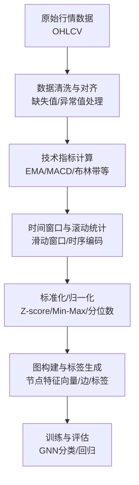
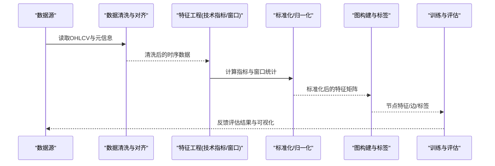
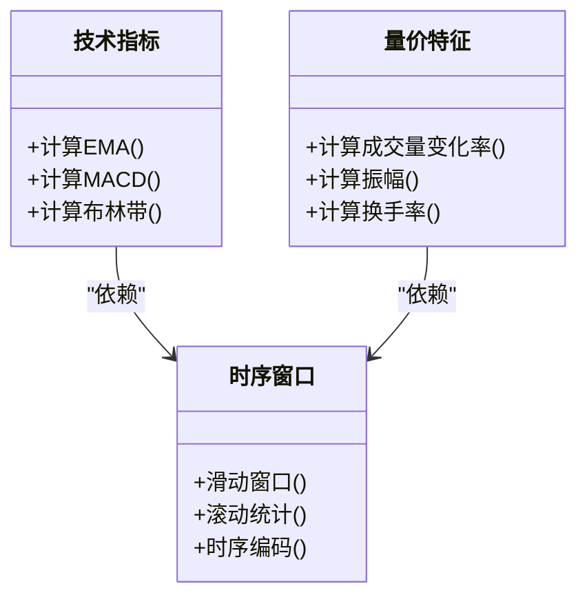
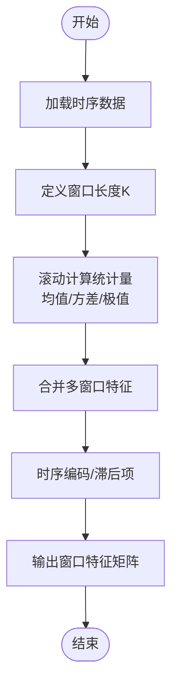
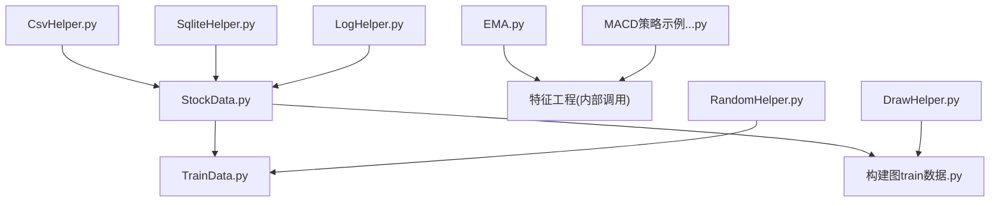

# 节点特征工程

<cite>
**本文引用的文件**   
- [StockData.py](file://MyProject/DataBase/StockData.py)
- [StockData_20241001.py](file://MyProject/DataBase/StockData_20241001.py)
- [TrainData.py](file://MyProject/DataBase/TrainData.py)
- [构建图train数据.py](file://MyProject/DataBase/构建图train数据.py)
- [CsvHelper.py](file://MyProject/Helper/CsvHelper.py)
- [DrawHelper.py](file://MyProject/Helper/DrawHelper.py)
- [LogHelper.py](file://MyProject/Helper/LogHelper.py)
- [RandomHelper.py](file://MyProject/Helper/RandomHelper.py)
- [SqliteHelper.py](file://MyProject/Helper/SqliteHelper.py)
- [EMA.py](file://MyProject/Model/Strategy/EMA.py)
- [MACD策略示例_8.节点分类实验_MACD_93.47%+画图_20240505.py](file://MyProject/Model/8.节点分类实验_MACD_93.47%+画图_20240505.py)
- [获取个股票行情.py](file://生成train数据/获取个股票行情.py)
- [构建图train数据_ForInMemoryDataset.py](file://生成train数据/构建图train数据_ForInMemoryDataset.py)
</cite>

## 目录
1. [引言](#引言)
2. [项目结构](#项目结构)
3. [核心组件](#核心组件)
4. [架构总览](#架构总览)
5. [详细组件分析](#详细组件分析)
6. [依赖关系分析](#依赖关系分析)
7. [性能考虑](#性能考虑)
8. [故障排查指南](#故障排查指南)
9. [结论](#结论)
10. [附录](#附录)

## 引言
本章节聚焦于“节点特征工程”，面向以股票为节点的图学习任务，系统阐述：
- 技术指标与量价特征的提取与构造（如MACD、EMA、布林带等）
- 时间窗口处理技术（滑动窗口、滚动统计、时序编码）
- 特征标准化与归一化（Z-score、Min-Max、分位数变换）
- 缺失值、异常值与数据不平衡的处理策略
- 高质量特征向量的构建流程、特征选择与降维
- 特征重要性评估与可视化分析方法

目标是为读者提供从原始行情到可训练图模型输入的全链路特征工程方案。

## 项目结构
本项目围绕“数据准备—特征工程—图构建—训练与评估”展开，关键路径包括：
- 数据源与清洗：从行情数据中抽取OHLCV及衍生指标
- 特征工程：计算技术指标、构造量价组合、进行时间窗口与标准化
- 图构建：将个股作为节点，按规则或相关性建立边，形成训练样本
- 辅助工具：CSV读写、日志记录、随机种子控制、SQLite存取、绘图展示

[此图为概念性流程图，不直接映射具体源码文件]

## 核心组件
本节概述与节点特征工程密切相关的模块职责与协作方式：
- 数据层：负责读取、清洗、对齐与持久化（CSV/SQLite），并输出统一格式的时间序列
- 策略与指标层：封装常用技术指标与交易信号逻辑，便于复用与扩展
- 图构建层：基于时间窗口与标签规则，组装节点特征矩阵与邻接结构
- 辅助工具层：提供日志、随机、绘图与数据库访问能力，保障可复现性与可观测性

**章节来源**
- [StockData.py](file://MyProject/DataBase/StockData.py)
- [StockData_20241001.py](file://MyProject/DataBase/StockData_20241001.py)
- [TrainData.py](file://MyProject/DataBase/TrainData.py)
- [构建图train数据.py](file://MyProject/DataBase/构建图train数据.py)
- [CsvHelper.py](file://MyProject/Helper/CsvHelper.py)
- [SqliteHelper.py](file://MyProject/Helper/SqliteHelper.py)
- [EMA.py](file://MyProject/Model/Strategy/EMA.py)
- [MACD策略示例_8.节点分类实验_MACD_93.47%+画图_20240505.py](file://MyProject/Model/8.节点分类实验_MACD_93.47%+画图_20240505.py)

## 架构总览
下图展示了从原始数据到图训练样本的端到端流程，以及各模块之间的调用关系。

**图表来源**
- [StockData.py:1-200](file://MyProject/DataBase/StockData.py#L1-L200)
- [构建图train数据.py:1-200](file://MyProject/DataBase/构建图train数据.py#L1-L200)
- [TrainData.py:1-200](file://MyProject/DataBase/TrainData.py#L1-L200)
- [EMA.py:1-120](file://MyProject/Model/Strategy/EMA.py#L1-L120)
- [MACD策略示例_8.节点分类实验_MACD_93.47%+画图_20240505.py:1-200](file://MyProject/Model/8.节点分类实验_MACD_93.47%+画图_20240505.py#L1-L200)

## 详细组件分析

### 技术指标与量价特征
- MACD：通过快慢EMA差值与信号线构成趋势跟踪与动量信号，常用于拐点识别与交叉信号
- EMA：对近期价格赋予更高权重，平滑噪声并突出短期趋势
- 布林带：基于移动均值与标准差构建上下轨，衡量波动率与超买超卖区间
- 量价组合：成交量变化率、量价背离、换手率、振幅、收益率分布特征等

实现要点：
- 使用滚动窗口计算均线与标准差，注意前导NaN的处理与填充策略
- 交叉信号需结合滞后项避免未来函数
- 量价特征建议做对数变换或比率形式，降低尺度差异影响

**章节来源**
- [EMA.py:1-120](file://MyProject/Model/Strategy/EMA.py#L1-L120)
- [MACD策略示例_8.节点分类实验_MACD_93.47%+画图_20240505.py:1-200](file://MyProject/Model/8.节点分类实验_MACD_93.47%+画图_20240505.py#L1-L200)

#### 类与方法关系（概念示意）

[此图为概念性类图，不直接映射具体源码文件]

### 时间窗口处理技术
- 滑动窗口：固定长度窗口内聚合（均值、方差、极值、偏度、峰度）
- 滚动统计：多周期叠加（短中长期窗口组合），捕捉不同频率的信号
- 时序编码：位置编码、相对时间偏移、事件标记（涨跌、放量、突破）

注意事项：
- 窗口起始点需对齐交易日，避免跨日/停牌导致的错位
- 长窗口易引入噪声，短窗口易过拟合，需结合验证集调参
- 对非平稳序列，优先使用差分或比率特征

**章节来源**
- [StockData.py:1-200](file://MyProject/DataBase/StockData.py#L1-L200)
- [构建图train数据.py:1-200](file://MyProject/DataBase/构建图train数据.py#L1-L200)

#### 算法流程（滑动窗口与滚动统计）

[此图为概念性流程图，不直接映射具体源码文件]

### 特征标准化与归一化
- Z-score标准化：减去均值除以标准差，适用于近似正态分布的特征
- Min-Max缩放：线性映射至[0,1]或[-1,1]，对异常值敏感
- 分位数变换：将特征映射到均匀或正态分布，提升鲁棒性

实践建议：
- 在时间序列上严格遵循“仅用历史数据拟合参数”，防止未来泄露
- 对含极端值的特征优先采用分位数变换或稳健缩放（去极值后再标准化）
- 不同股票间可使用分组标准化，减少跨标的尺度差异

**章节来源**
- [StockData.py:1-200](file://MyProject/DataBase/StockData.py#L1-L200)
- [构建图train数据.py:1-200](file://MyProject/DataBase/构建图train数据.py#L1-L200)

### 缺失值、异常值与数据不平衡
- 缺失值：
  - 前向填充/后向填充用于连续型指标
  - 插值（线性/样条）用于稀疏缺失
  - 对开盘/收盘缺失可采用最近有效值或剔除当日
- 异常值：
  - 基于分位数或IQR裁剪
  - 对收益率/波动率采用对数或Winsorize处理
- 数据不平衡：
  - 类别不平衡时采用重采样（过采样/欠采样）、代价敏感学习或阈值调整
  - 时间序列场景下避免随机打乱，保持时序一致性

**章节来源**
- [StockData.py:1-200](file://MyProject/DataBase/StockData.py#L1-L200)
- [构建图train数据.py:1-200](file://MyProject/DataBase/构建图train数据.py#L1-L200)

### 高质量特征向量构建与特征选择/降维
- 特征构建：
  - 基础价量：收盘价、开盘价、最高价、最低价、成交量、成交额
  - 技术指标：EMA、MACD、布林带、RSI、ATR等
  - 量价组合：量价比、放量上涨/下跌、突破信号
  - 市场情绪：板块联动、涨跌家数、北向资金、波动率指数（若可用）
- 特征选择：
  - 过滤法：方差阈值、相关系数、互信息
  - 包裹法：递归特征消除（RFE）、基于树模型的重要性
  - 嵌入法：L1正则、树模型内置重要性
- 降维：
  - PCA/ICA用于线性/非线性投影
  - UMAP/t-SNE用于可视化与探索
  - 自编码器用于非线性压缩

**章节来源**
- [构建图train数据.py:1-200](file://MyProject/DataBase/构建图train数据.py#L1-L200)
- [TrainData.py:1-200](file://MyProject/DataBase/TrainData.py#L1-L200)

### 特征重要性评估与可视化
- 重要性评估：
  - 基于树模型的Feature Importance
  - Permutation Importance
  - SHAP值解释（局部与全局）
- 可视化：
  - 特征分布直方图/箱线图
  - 相关性热力图
  - 时间序列轨迹对比（信号与价格）
  - 重要特征随时间演化曲线

**章节来源**
- [DrawHelper.py:1-200](file://MyProject/Helper/DrawHelper.py#L1-L200)

## 依赖关系分析
下图展示主要模块间的依赖关系与数据流向，帮助理解特征工程的集成点。

**图表来源**
- [StockData.py:1-200](file://MyProject/DataBase/StockData.py#L1-L200)
- [TrainData.py:1-200](file://MyProject/DataBase/TrainData.py#L1-L200)
- [构建图train数据.py:1-200](file://MyProject/DataBase/构建图train数据.py#L1-L200)
- [EMA.py:1-120](file://MyProject/Model/Strategy/EMA.py#L1-L120)
- [MACD策略示例_8.节点分类实验_MACD_93.47%+画图_20240505.py:1-200](file://MyProject/Model/8.节点分类实验_MACD_93.47%+画图_20240505.py#L1-L200)
- [CsvHelper.py:1-200](file://MyProject/Helper/CsvHelper.py#L1-L200)
- [SqliteHelper.py:1-200](file://MyProject/Helper/SqliteHelper.py#L1-L200)
- [LogHelper.py:1-200](file://MyProject/Helper/LogHelper.py#L1-L200)
- [RandomHelper.py:1-200](file://MyProject/Helper/RandomHelper.py#L1-L200)
- [DrawHelper.py:1-200](file://MyProject/Helper/DrawHelper.py#L1-L200)

**章节来源**
- [StockData.py:1-200](file://MyProject/DataBase/StockData.py#L1-L200)
- [构建图train数据.py:1-200](file://MyProject/DataBase/构建图train数据.py#L1-L200)
- [TrainData.py:1-200](file://MyProject/DataBase/TrainData.py#L1-L200)

## 性能考虑
- 批量计算：利用向量化操作与并行化（多进程/多线程）加速指标与窗口统计
- 内存管理：大样本滚动计算采用流式处理或分块写入磁盘
- 缓存机制：对重复计算的指标与窗口结果进行缓存
- 精度与稳定性：数值溢出与除零保护，避免极端值导致不稳定

[本节为通用指导，无需特定文件引用]

## 故障排查指南
- 数据问题：
  - 检查日期索引是否连续、是否存在停牌或缺失
  - 确认OHLCV字段类型与范围合理
- 指标异常：
  - 观察EMA/MACD/布林带的边界情况与NaN传播
  - 校验窗口长度与数据长度匹配
- 标准化泄漏：
  - 确保训练集参数仅在训练阶段拟合
  - 验证测试集未使用未来信息
- 图构建错误：
  - 核对节点ID与边列表的一致性
  - 检查标签生成是否符合前瞻期要求

**章节来源**
- [LogHelper.py:1-200](file://MyProject/Helper/LogHelper.py#L1-L200)
- [RandomHelper.py:1-200](file://MyProject/Helper/RandomHelper.py#L1-L200)
- [构建图train数据.py:1-200](file://MyProject/DataBase/构建图train数据.py#L1-L200)

## 结论
通过系统化的技术指标计算、时间窗口处理、标准化与异常处理，并结合合理的特征选择与降维，可以构建高质量的股票节点特征向量。配合严谨的数据划分与可视化分析，有助于提升图神经网络的泛化能力与可解释性。

[本节为总结性内容，无需特定文件引用]

## 附录
- 参考脚本与示例：
  - 行情获取与预处理：[获取个股票行情.py](file://生成train数据/获取个股票行情.py)
  - InMemory数据集构建：[构建图train数据_ForInMemoryDataset.py](file://生成train数据/构建图train数据_ForInMemoryDataset.py)
  - 指标与策略示例：[EMA.py](file://MyProject/Model/Strategy/EMA.py)、[MACD策略示例_8.节点分类实验_MACD_93.47%+画图_20240505.py](file://MyProject/Model/8.节点分类实验_MACD_93.47%+画图_20240505.py)

**章节来源**
- [获取个股票行情.py:1-200](file://生成train数据/获取个股票行情.py#L1-L200)
- [构建图train数据_ForInMemoryDataset.py:1-200](file://生成train数据/构建图train数据_ForInMemoryDataset.py#L1-L200)
- [EMA.py:1-120](file://MyProject/Model/Strategy/EMA.py#L1-L120)
- [MACD策略示例_8.节点分类实验_MACD_93.47%+画图_20240505.py:1-200](file://MyProject/Model/8.节点分类实验_MACD_93.47%+画图_20240505.py#L1-L200)