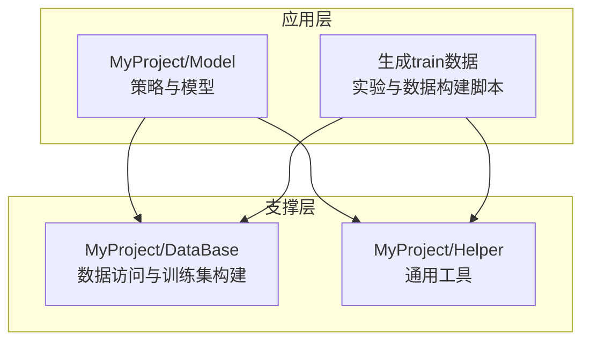
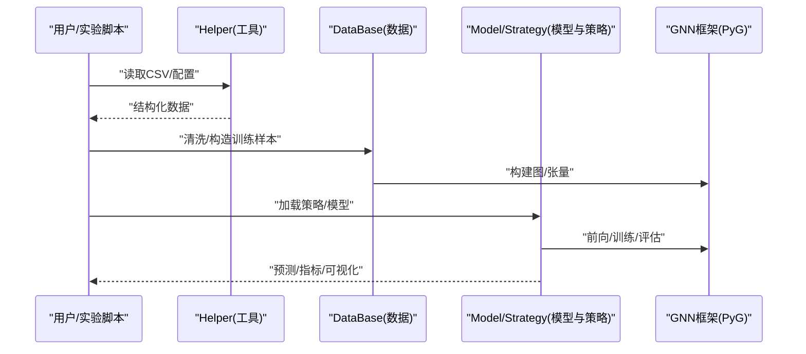
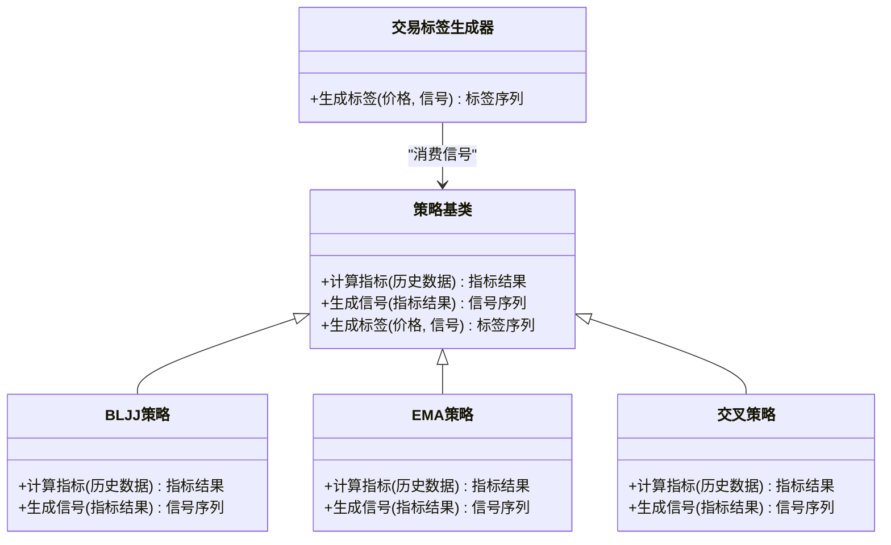
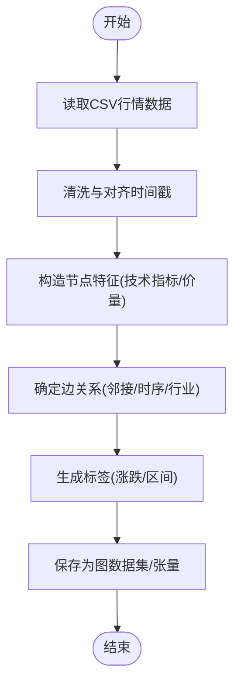
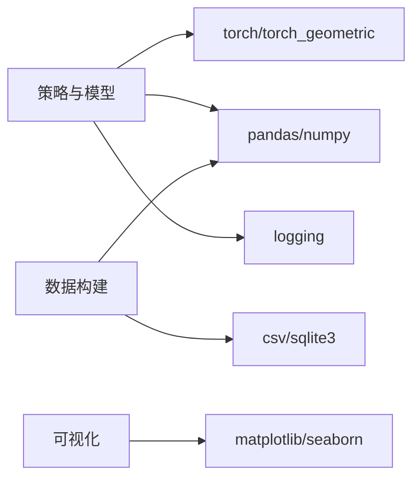

# 代码规范与约定

<cite>
**本文档引用的文件**   
- [MyProject/DataBase/StockData.py](file://MyProject/DataBase/StockData.py)
- [MyProject/DataBase/TrainData.py](file://MyProject/DataBase/TrainData.py)
- [MyProject/Helper/CsvHelper.py](file://MyProject/Helper/CsvHelper.py)
- [MyProject/Helper/LogHelper.py](file://MyProject/Helper/LogHelper.py)
- [MyProject/Model/Strategy/BLJJ.py](file://MyProject/Model/Strategy/BLJJ.py)
- [MyProject/Model/Strategy/CrossSimple.py](file://MyProject/Model/Strategy/CrossSimple.py)
- [MyProject/Model/Strategy/EMA.py](file://MyProject/Model/Strategy/EMA.py)
- [MyProject/Model/Strategy/MagicNine.py](file://MyProject/Model/Strategy/MagicNine.py)
- [MyProject/Model/Strategy/REF.py](file://MyProject/Model/Strategy/REF.py)
- [MyProject/Model/Strategy/SignalIntervalTrade.py](file://MyProject/Model/Strategy/SignalIntervalTrade.py)
- [MyProject/Model/Strategy/TradeTag.py](file://MyProject/Model/Strategy/TradeTag.py)
- [生成train数据/model.py](file://生成train数据/model.py)
- [生成train数据/构建图train数据.py](file://生成train数据/构建图train数据.py)
</cite>

## 目录
1. [简介](#简介)
2. [项目结构](#项目结构)
3. [核心组件](#核心组件)
4. [架构总览](#架构总览)
5. [详细组件分析](#详细组件分析)
6. [依赖分析](#依赖分析)
7. [性能考虑](#性能考虑)
8. [故障排查指南](#故障排查指南)
9. [结论](#结论)
10. [附录](#附录)

## 简介
本规范面向本项目（基于PyTorch Geometric的图神经网络与量化策略研究）的Python代码风格、命名约定、注释规范、文件组织与导入顺序、包依赖管理，以及代码质量检查工具配置。目标是在保证可读性与可维护性的同时，统一团队编码风格，降低协作成本，提升代码质量与稳定性。

## 项目结构
项目采用“按功能域分层 + 子领域模块”的组织方式：
- MyProject/DataBase：数据访问与训练数据准备
- MyProject/Helper：通用辅助工具（CSV、日志、绘图、随机数、SQLite等）
- MyProject/Model：模型与策略实现（含Strategy子模块）
- 生成train数据：实验脚本与数据构建流程
- 网络资料：参考资料与示例数据

图表来源
- [MyProject/DataBase/StockData.py](file://MyProject/DataBase/StockData.py)
- [MyProject/Helper/CsvHelper.py](file://MyProject/Helper/CsvHelper.py)
- [MyProject/Model/Strategy/BLJJ.py](file://MyProject/Model/Strategy/BLJJ.py)
- [生成train数据/构建图train数据.py](file://生成train数据/构建图train数据.py)

章节来源
- [MyProject/DataBase/StockData.py](file://MyProject/DataBase/StockData.py)
- [MyProject/Helper/CsvHelper.py](file://MyProject/Helper/CsvHelper.py)
- [MyProject/Model/Strategy/BLJJ.py](file://MyProject/Model/Strategy/BLJJ.py)
- [生成train数据/构建图train数据.py](file://生成train数据/构建图train数据.py)

## 核心组件
- 数据层（DataBase）
  - 负责从外部源读取股票行情、清洗与构造训练样本，输出供GNN使用的图或张量格式数据。
  - 关键职责：数据加载、预处理、持久化、版本化文件名（如日期后缀）。
- 工具层（Helper）
  - 提供CSV读写、日志记录、绘图、随机种子控制、SQLite存取等通用能力。
  - 关键职责：I/O封装、日志标准化、可视化辅助、随机性控制。
- 模型与策略层（Model/Strategy）
  - 策略函数与交易信号逻辑，部分文件包含策略标签生成与区间交易逻辑。
  - 关键职责：指标计算、信号生成、标签标注、策略组合。
- 实验与数据构建（生成train数据）
  - 将原始数据转换为GNN可用的图结构数据集，包含节点特征、边关系与标签。

章节来源
- [MyProject/DataBase/StockData.py](file://MyProject/DataBase/StockData.py)
- [MyProject/DataBase/TrainData.py](file://MyProject/DataBase/TrainData.py)
- [MyProject/Helper/CsvHelper.py](file://MyProject/Helper/CsvHelper.py)
- [MyProject/Helper/LogHelper.py](file://MyProject/Helper/LogHelper.py)
- [MyProject/Model/Strategy/BLJJ.py](file://MyProject/Model/Strategy/BLJJ.py)
- [MyProject/Model/Strategy/TradeTag.py](file://MyProject/Model/Strategy/TradeTag.py)
- [生成train数据/构建图train数据.py](file://生成train数据/构建图train数据.py)

## 架构总览
下图展示了数据流与模块交互：原始数据经工具层处理，进入数据层形成训练样本；模型与策略层消费训练样本进行训练与推理；实验脚本串联端到端流程。

图表来源
- [MyProject/Helper/CsvHelper.py](file://MyProject/Helper/CsvHelper.py)
- [MyProject/DataBase/StockData.py](file://MyProject/DataBase/StockData.py)
- [MyProject/Model/Strategy/BLJJ.py](file://MyProject/Model/Strategy/BLJJ.py)
- [生成train数据/构建图train数据.py](file://生成train数据/构建图train数据.py)

## 详细组件分析

### 命名规范
- 模块与包
  - 使用小写加下划线命名，避免中文文件名（除临时脚本），例如：stock_data.py、csv_helper.py。
  - 包名全小写，层级清晰，如：myproject.data、myproject.helper、myproject.model.strategy。
- 类与接口
  - 使用大驼峰命名，类名表达实体或抽象概念，如：StockDataLoader、CsvReader、LogWriter。
- 函数与方法
  - 使用小写加下划线，动词开头，语义明确，如：load_stock_data、build_graph、compute_signal。
- 变量与常量
  - 局部变量与实例属性：小写加下划线，如：node_features、edge_index。
  - 常量：全大写加下划线，如：MAX_EPOCHS、DEFAULT_WINDOW。
- 图神经网络相关命名模式
  - 节点特征：node_features 或 x
  - 边索引：edge_index
  - 图标签：y 或 graph_label
  - 批次信息：batch
  - 掩码：mask
  - 建议优先使用具名变量，必要时在文档字符串中说明别名。

章节来源
- [MyProject/DataBase/StockData.py](file://MyProject/DataBase/StockData.py)
- [MyProject/Helper/CsvHelper.py](file://MyProject/Helper/CsvHelper.py)
- [MyProject/Model/Strategy/BLJJ.py](file://MyProject/Model/Strategy/BLJJ.py)

### 缩进与格式标准
- 缩进：4空格，禁止Tab。
- 行宽：建议不超过120字符，超过时合理换行。
- 引号：字符串统一使用单引号，除非内部包含单引号。
- 空行：模块级两个空行，类定义前后各一个空行，方法内逻辑块之间一个空行。
- 运算符与逗号：二元运算符两侧各保留一个空格；逗号后保留一个空格。
- 列表推导与字典推导：保持简洁，复杂表达式拆分为多行。
- 类型注解：推荐为函数参数与返回值添加类型注解，提高可读性与IDE支持。

章节来源
- [MyProject/Helper/LogHelper.py](file://MyProject/Helper/LogHelper.py)
- [MyProject/Model/Strategy/CrossSimple.py](file://MyProject/Model/Strategy/CrossSimple.py)

### 注释与文档字符串规范
- 模块级文档字符串：说明模块用途、依赖、主要类与函数。
- 类文档字符串：说明类的职责、关键属性、使用示例。
- 函数文档字符串：至少包含参数、返回值、异常说明与简要示例。
- 复杂算法注释：解释输入输出含义、时间/空间复杂度、边界条件与注意事项。
- 代码内注释：仅解释“为什么”，不重复“是什么”。

章节来源
- [MyProject/Model/Strategy/EMA.py](file://MyProject/Model/Strategy/EMA.py)
- [MyProject/Model/Strategy/MagicNine.py](file://MyProject/Model/Strategy/MagicNine.py)

### 文件组织结构约定
- 模块导入顺序
  1) 标准库
  2) 第三方库
  3) 本地项目模块（相对导入或绝对导入，保持一致）
- 包依赖管理
  - 集中声明依赖到requirements文件或pyproject.toml，避免隐式依赖。
  - 对大型依赖（如torch、torch_geometric）在README中给出安装指引与环境要求。
- 数据与模型分离
  - 数据准备与模型训练脚本分目录存放，避免耦合。
  - 策略与模型解耦，便于替换与对比。

章节来源
- [生成train数据/model.py](file://生成train数据/model.py)
- [生成train数据/构建图train数据.py](file://生成train数据/构建图train数据.py)

### 策略函数设计模式
- 策略函数应遵循单一职责原则，输入输出明确，便于单元测试与回测。
- 推荐以纯函数形式实现指标与信号计算，状态通过参数显式传递。
- 标签生成与交易逻辑分离，便于组合与扩展。

图表来源
- [MyProject/Model/Strategy/BLJJ.py](file://MyProject/Model/Strategy/BLJJ.py)
- [MyProject/Model/Strategy/EMA.py](file://MyProject/Model/Strategy/EMA.py)
- [MyProject/Model/Strategy/CrossSimple.py](file://MyProject/Model/Strategy/CrossSimple.py)
- [MyProject/Model/Strategy/TradeTag.py](file://MyProject/Model/Strategy/TradeTag.py)

章节来源
- [MyProject/Model/Strategy/BLJJ.py](file://MyProject/Model/Strategy/BLJJ.py)
- [MyProject/Model/Strategy/EMA.py](file://MyProject/Model/Strategy/EMA.py)
- [MyProject/Model/Strategy/CrossSimple.py](file://MyProject/Model/Strategy/CrossSimple.py)
- [MyProject/Model/Strategy/TradeTag.py](file://MyProject/Model/Strategy/TradeTag.py)

### 数据构建流程（图训练数据）

图表来源
- [生成train数据/构建图train数据.py](file://生成train数据/构建图train数据.py)
- [MyProject/DataBase/StockData.py](file://MyProject/DataBase/StockData.py)

章节来源
- [生成train数据/构建图train数据.py](file://生成train数据/构建图train数据.py)
- [MyProject/DataBase/StockData.py](file://MyProject/DataBase/StockData.py)

### 常见错误与避免方法
- 避免硬编码路径与超参，统一使用配置文件或环境变量。
- 避免全局可变状态，尽量使用函数式设计与显式参数传递。
- 避免在循环中频繁创建对象，提前分配内存或使用批处理。
- 避免忽略异常与警告，统一捕获并记录日志。
- 避免混用不同风格的命名与缩进，统一格式化与检查。

章节来源
- [MyProject/Helper/LogHelper.py](file://MyProject/Helper/LogHelper.py)
- [MyProject/Model/Strategy/SignalIntervalTrade.py](file://MyProject/Model/Strategy/SignalIntervalTrade.py)

## 依赖分析
- 直接依赖
  - 数据处理：pandas、numpy
  - 数据库与存储：sqlite3、csv
  - 深度学习：torch、torch_geometric
  - 可视化：matplotlib、seaborn
- 间接依赖
  - 日志与调试：logging、warnings
  - 测试与质量：pytest、flake8、pylint、black、isort

图表来源
- [生成train数据/model.py](file://生成train数据/model.py)
- [MyProject/DataBase/StockData.py](file://MyProject/DataBase/StockData.py)
- [MyProject/Helper/CsvHelper.py](file://MyProject/Helper/CsvHelper.py)

章节来源
- [生成train数据/model.py](file://生成train数据/model.py)
- [MyProject/DataBase/StockData.py](file://MyProject/DataBase/StockData.py)
- [MyProject/Helper/CsvHelper.py](file://MyProject/Helper/CsvHelper.py)

## 性能考虑
- 批量处理与向量化：优先使用NumPy/Pandas向量化操作，减少Python循环。
- 内存管理：大图数据分批加载，及时释放中间变量，避免内存泄漏。
- I/O优化：使用缓冲写入、压缩存储，减少磁盘IO次数。
- GPU利用：确保数据类型与设备一致，避免不必要的CPU-GPU拷贝。
- 缓存与复用：对昂贵计算结果进行缓存，避免重复计算。

[本节为通用指导，无需具体文件引用]

## 故障排查指南
- 日志规范
  - 使用统一日志模块，区分INFO/WARNING/ERROR级别。
  - 记录关键上下文（股票代码、时间窗口、超参、异常堆栈）。
- 常见问题定位
  - 数据维度不一致：打印形状与dtype，核对特征与标签对齐。
  - 内存溢出：监控峰值内存，拆分批次，减少中间副本。
  - 训练不稳定：检查学习率、梯度裁剪、初始化策略。
- 断点与诊断
  - 在关键路径插入断点与日志，逐步缩小问题范围。
  - 使用可视化工具检查数据分布与损失曲线。

章节来源
- [MyProject/Helper/LogHelper.py](file://MyProject/Helper/LogHelper.py)
- [MyProject/Model/Strategy/SignalIntervalTrade.py](file://MyProject/Model/Strategy/SignalIntervalTrade.py)

## 结论
本规范围绕命名、格式、注释、结构与依赖等方面，结合本项目在图神经网络与量化策略领域的特点，提供了统一的编码约定与实践建议。通过严格执行规范与引入质量检查工具，可有效提升代码可读性、可维护性与运行稳定性。

[本节为总结性内容，无需具体文件引用]

## 附录

### 代码质量检查工具配置建议
- flake8
  - 启用规则：E/W/F/N/B/C901（根据团队偏好选择）
  - 忽略规则：E501（行宽）、W503（换行符）可按需调整
  - 最大行宽：120
- pylint
  - 启用常用检查：C/R/W/E/F
  - 自定义评分阈值与忽略模块
- black/isort
  - 统一格式化与导入排序，集成到CI流水线
- pytest
  - 为关键函数编写单元测试，覆盖边界条件与异常路径

[本节为通用配置建议，无需具体文件引用]

### 正确实践与反例对照（路径参考）
- 正确的函数文档字符串与类型注解
  - 参考：[MyProject/Model/Strategy/EMA.py](file://MyProject/Model/Strategy/EMA.py)
- 清晰的策略函数与标签生成分离
  - 参考：[MyProject/Model/Strategy/BLJJ.py](file://MyProject/Model/Strategy/BLJJ.py)、[MyProject/Model/Strategy/TradeTag.py](file://MyProject/Model/Strategy/TradeTag.py)
- 规范的日志记录与异常处理
  - 参考：[MyProject/Helper/LogHelper.py](file://MyProject/Helper/LogHelper.py)
- 数据构建流程的可读性与可复现性
  - 参考：[生成train数据/构建图train数据.py](file://生成train数据/构建图train数据.py)

章节来源
- [MyProject/Model/Strategy/EMA.py](file://MyProject/Model/Strategy/EMA.py)
- [MyProject/Model/Strategy/BLJJ.py](file://MyProject/Model/Strategy/BLJJ.py)
- [MyProject/Model/Strategy/TradeTag.py](file://MyProject/Model/Strategy/TradeTag.py)
- [MyProject/Helper/LogHelper.py](file://MyProject/Helper/LogHelper.py)
- [生成train数据/构建图train数据.py](file://生成train数据/构建图train数据.py)