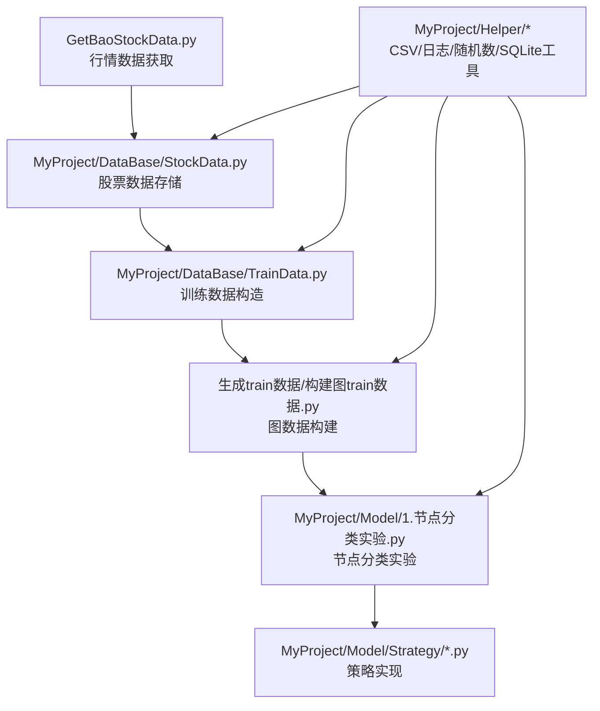
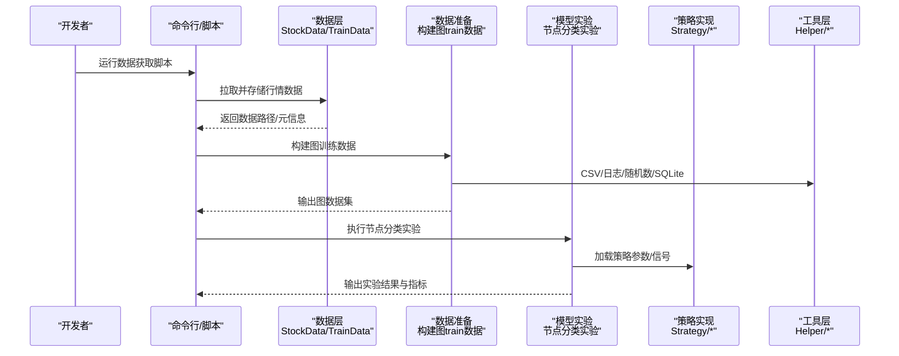
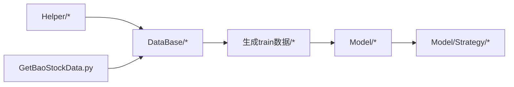

# Git工作流规范

<cite>
**本文档引用的文件**   
- [StockData.py](file://MyProject/DataBase/StockData.py)
- [TrainData.py](file://MyProject/DataBase/TrainData.py)
- [CsvHelper.py](file://MyProject/Helper/CsvHelper.py)
- [LogHelper.py](file://MyProject/Helper/LogHelper.py)
- [BLJJ.py](file://MyProject/Model/Strategy/BLJJ.py)
- [CrossSimple.py](file://MyProject/Model/Strategy/CrossSimple.py)
- [EMA.py](file://MyProject/Model/Strategy/EMA.py)
- [1.节点分类实验.py](file://MyProject/Model/1.节点分类实验.py)
- [构建图train数据.py](file://生成train数据/构建图train数据.py)
- [GetBaoStockData.py](file://GetBaoStockData.py)
</cite>

## 目录
1. [简介](#简介)
2. [项目结构分析](#项目结构分析)
3. [核心组件](#核心组件)
4. [架构总览](#架构总览)
5. [详细组件分析](#详细组件分析)
6. [依赖关系分析](#依赖关系分析)
7. [性能与可维护性建议](#性能与可维护性建议)
8. [故障排查指南](#故障排查指南)
9. [结论](#结论)
10. [附录：Git工作流规范（分支、提交、合并、标签、钩子与自动化）](#附录git工作流规范分支提交合并标签钩子与自动化)

## 简介
本规范面向本仓库的团队协作与持续交付，目标是统一Git版本控制工作流，确保代码质量、可追溯性与发布稳定性。结合本项目“图神经网络+股票交易策略”的特点，规范覆盖以下方面：
- 分支管理策略：主分支保护、功能分支命名、发布分支与热修复流程
- 提交信息格式：commit message模板、变更类型标识、关联issue引用
- 代码合并策略：PR/MR审查、冲突解决、回滚策略
- 版本标签管理：语义化版本、标签命名与发布清单
- Git钩子与自动化：pre-commit检查、CI流水线、测试与打包

## 项目结构分析
仓库采用按功能域组织的方式，主要包含：
- MyProject/DataBase：原始与训练数据的读写与处理
- MyProject/Helper：通用工具（CSV、日志、随机数、SQLite等）
- MyProject/Model/Strategy：交易策略与信号实现
- 生成train数据：数据准备脚本与实验脚本
- GetBaoStockData.py：行情数据获取入口

图表来源
- [GetBaoStockData.py](file://GetBaoStockData.py)
- [StockData.py](file://MyProject/DataBase/StockData.py)
- [TrainData.py](file://MyProject/DataBase/TrainData.py)
- [构建图train数据.py](file://生成train数据/构建图train数据.py)
- [1.节点分类实验.py](file://MyProject/Model/1.节点分类实验.py)
- [BLJJ.py](file://MyProject/Model/Strategy/BLJJ.py)
- [CrossSimple.py](file://MyProject/Model/Strategy/CrossSimple.py)
- [EMA.py](file://MyProject/Model/Strategy/EMA.py)
- [CsvHelper.py](file://MyProject/Helper/CsvHelper.py)
- [LogHelper.py](file://MyProject/Helper/LogHelper.py)

章节来源
- [StockData.py](file://MyProject/DataBase/StockData.py)
- [TrainData.py](file://MyProject/DataBase/TrainData.py)
- [CsvHelper.py](file://MyProject/Helper/CsvHelper.py)
- [LogHelper.py](file://MyProject/Helper/LogHelper.py)
- [BLJJ.py](file://MyProject/Model/Strategy/BLJJ.py)
- [CrossSimple.py](file://MyProject/Model/Strategy/CrossSimple.py)
- [EMA.py](file://MyProject/Model/Strategy/EMA.py)
- [1.节点分类实验.py](file://MyProject/Model/1.节点分类实验.py)
- [构建图train数据.py](file://生成train数据/构建图train数据.py)
- [GetBaoStockData.py](file://GetBaoStockData.py)

## 核心组件
- 数据层
  - StockData.py：负责股票基础数据的读取、清洗与持久化
  - TrainData.py：将原始数据转换为模型训练所需的数据集格式
- 工具层
  - CsvHelper.py：CSV读写封装
  - LogHelper.py：结构化日志输出
  - RandomHelper.py：随机种子与采样工具
  - SqliteHelper.py：SQLite数据库操作封装
- 模型与策略层
  - 1.节点分类实验.py：节点分类实验入口
  - Strategy/*.py：具体交易策略实现（如BLJJ、CrossSimple、EMA等）
- 数据准备
  - 构建图train数据.py：图结构训练数据构建脚本
  - GetBaoStockData.py：外部行情数据拉取

章节来源
- [StockData.py](file://MyProject/DataBase/StockData.py)
- [TrainData.py](file://MyProject/DataBase/TrainData.py)
- [CsvHelper.py](file://MyProject/Helper/CsvHelper.py)
- [LogHelper.py](file://MyProject/Helper/LogHelper.py)
- [1.节点分类实验.py](file://MyProject/Model/1.节点分类实验.py)
- [BLJJ.py](file://MyProject/Model/Strategy/BLJJ.py)
- [CrossSimple.py](file://MyProject/Model/Strategy/CrossSimple.py)
- [EMA.py](file://MyProject/Model/Strategy/EMA.py)
- [构建图train数据.py](file://生成train数据/构建图train数据.py)
- [GetBaoStockData.py](file://GetBaoStockData.py)

## 架构总览
下图展示从数据获取到模型训练与策略评估的整体流程，以及各模块之间的调用关系。

图表来源
- [GetBaoStockData.py](file://GetBaoStockData.py)
- [StockData.py](file://MyProject/DataBase/StockData.py)
- [TrainData.py](file://MyProject/DataBase/TrainData.py)
- [构建图train数据.py](file://生成train数据/构建图train数据.py)
- [1.节点分类实验.py](file://MyProject/Model/1.节点分类实验.py)
- [BLJJ.py](file://MyProject/Model/Strategy/BLJJ.py)
- [CrossSimple.py](file://MyProject/Model/Strategy/CrossSimple.py)
- [EMA.py](file://MyProject/Model/Strategy/EMA.py)
- [CsvHelper.py](file://MyProject/Helper/CsvHelper.py)
- [LogHelper.py](file://MyProject/Helper/LogHelper.py)

## 详细组件分析
### 数据层（StockData / TrainData）
- 职责
  - StockData：统一数据访问接口，屏蔽底层存储差异（CSV/SQLite）
  - TrainData：将时序数据转换为图结构或张量格式，便于模型消费
- 复杂度与优化
  - I/O密集：建议批量读写、缓存热点数据、使用惰性加载
  - 内存占用：对大表进行分块处理，避免一次性加载全量数据
- 错误处理
  - 输入校验（字段缺失、类型不匹配）
  - 异常重试与降级（网络失败、磁盘空间不足）
- 依赖关系
  - 依赖Helper中的CSV/SQLite/日志工具

章节来源
- [StockData.py](file://MyProject/DataBase/StockData.py)
- [TrainData.py](file://MyProject/DataBase/TrainData.py)
- [CsvHelper.py](file://MyProject/Helper/CsvHelper.py)
- [LogHelper.py](file://MyProject/Helper/LogHelper.py)

### 工具层（Helper）
- 职责
  - CsvHelper：CSV读写、编码处理、列映射
  - LogHelper：分级日志、结构化输出、日志轮转
  - RandomHelper：固定随机种子、可复现实验
  - SqliteHelper：连接池、事务、SQL封装
- 设计要点
  - 单一职责、接口稳定、异常明确
  - 提供配置项（路径、超时、缓冲大小）

章节来源
- [CsvHelper.py](file://MyProject/Helper/CsvHelper.py)
- [LogHelper.py](file://MyProject/Helper/LogHelper.py)

### 模型与策略层（实验与策略）
- 职责
  - 1.节点分类实验.py：实验编排、参数配置、结果记录
  - Strategy/*：策略逻辑与信号计算，支持组合与回测
- 设计要点
  - 策略可插拔：通过配置切换不同策略
  - 指标标准化：统一评估口径（准确率、收益、回撤等）
- 依赖关系
  - 依赖数据层提供的训练数据与工具层日志

章节来源
- [1.节点分类实验.py](file://MyProject/Model/1.节点分类实验.py)
- [BLJJ.py](file://MyProject/Model/Strategy/BLJJ.py)
- [CrossSimple.py](file://MyProject/Model/Strategy/CrossSimple.py)
- [EMA.py](file://MyProject/Model/Strategy/EMA.py)

### 数据准备（构建图train数据）
- 职责
  - 将时序行情数据转换为图结构（节点、边、特征）
  - 划分训练/验证/测试集，保证时间顺序一致性
- 关键流程
  - 数据清洗 → 特征工程 → 图构建 → 序列化保存

章节来源
- [构建图train数据.py](file://生成train数据/构建图train数据.py)

## 依赖关系分析
- 模块耦合
  - 数据层与工具层强耦合（I/O与日志）
  - 实验与策略弱耦合（通过配置与接口解耦）
- 外部依赖
  - 行情数据源（网络请求）
  - 本地存储（CSV/SQLite）
- 潜在风险
  - 数据源不稳定导致数据准备失败
  - 大文件I/O造成性能瓶颈

图表来源
- [CsvHelper.py](file://MyProject/Helper/CsvHelper.py)
- [LogHelper.py](file://MyProject/Helper/LogHelper.py)
- [StockData.py](file://MyProject/DataBase/StockData.py)
- [TrainData.py](file://MyProject/DataBase/TrainData.py)
- [构建图train数据.py](file://生成train数据/构建图train数据.py)
- [1.节点分类实验.py](file://MyProject/Model/1.节点分类实验.py)
- [BLJJ.py](file://MyProject/Model/Strategy/BLJJ.py)
- [CrossSimple.py](file://MyProject/Model/Strategy/CrossSimple.py)
- [EMA.py](file://MyProject/Model/Strategy/EMA.py)
- [GetBaoStockData.py](file://GetBaoStockData.py)

## 性能与可维护性建议
- 数据层
  - 使用增量更新与断点续传
  - 引入缓存与索引加速查询
- 工具层
  - 日志异步写入，避免阻塞主流程
  - 配置集中化管理，减少硬编码
- 模型与策略
  - 参数外置（YAML/JSON），支持一键切换
  - 实验结果自动归档，便于回溯

[本节为通用建议，不直接分析具体文件]

## 故障排查指南
- 常见问题
  - 数据拉取失败：检查网络、代理、API限频
  - 数据格式不一致：校验字段名、类型与范围
  - 训练崩溃：检查内存、GPU显存、随机种子
- 定位方法
  - 启用详细日志（DEBUG级别）
  - 最小化复现（隔离问题模块）
  - 对比历史版本（二分法定位）

[本节为通用建议，不直接分析具体文件]

## 结论
通过统一的分支策略、提交规范、合并流程与自动化检查，可以显著提升本项目的协作效率与发布质量。建议在团队内推广本规范，并结合CI/CD持续改进。

[本节为总结，不直接分析具体文件]

## 附录：Git工作流规范（分支、提交、合并、标签、钩子与自动化）
- 分支管理策略
  - 主分支保护
    - main/master：仅允许受保护的推送，需至少1人审查通过
    - develop：集成分支，日常开发合并目标
  - 功能分支命名
    - 格式：feature/<编号>-<简述>，例如 feature/123-add-ema-strategy
    - 任务结束即删除远程分支
  - 发布分支管理
    - release/vX.Y.Z：用于冻结与回归测试，禁止新功能
    - 合并回main与develop，打标签后删除
  - 热修复流程
    - hotfix/<编号>-<简述>：从release或main切出
    - 修复后合并回main、develop与当前release，打补丁标签
- 提交信息格式规范
  - 模板
    - <type>(<scope>): <subject>
    - <body>（可选）
    - <footer>（可选，含BREAKING CHANGE与Issue引用）
  - 变更类型标识
    - feat：新功能
    - fix：缺陷修复
    - docs：文档变更
    - style：代码风格（不影响逻辑）
    - refactor：重构
    - perf：性能优化
    - test：测试相关
    - build：构建系统或依赖变更
    - ci：CI配置变更
    - chore：其他杂项
  - Issue引用
    - 在footer中注明：Closes #123、Refs #456
- 代码合并策略与冲突解决
  - 强制Pull Request/Merge Request
  - 至少1名Reviewer批准，CI全部通过
  - 冲突解决优先rebase，必要时merge；保留清晰历史
  - 禁止force-push到受保护分支
- 版本标签管理
  - 语义化版本：MAJOR.MINOR.PATCH
  - 标签命名：vX.Y.Z，对应release分支最终状态
  - 发布清单：变更记录、已知问题、升级说明
- Git钩子与自动化检查
  - pre-commit
    - 代码格式化（black/isort/pylint/flake8）
    - 提交信息校验（commitlint）
    - 简单静态检查（import排序、未使用变量）
  - CI流水线
    - 单元测试与集成测试
    - 数据脚本冒烟测试（小样本）
    - 构建产物与文档生成
    - 安全扫描（依赖漏洞）
  - 发布自动化
    - 打标签触发构建与发布
    - 自动生成Changelog与Release Notes

[本节为规范定义，不直接分析具体文件]