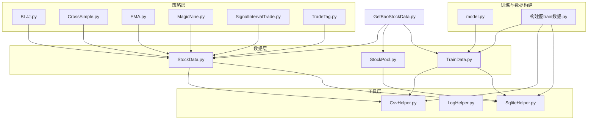
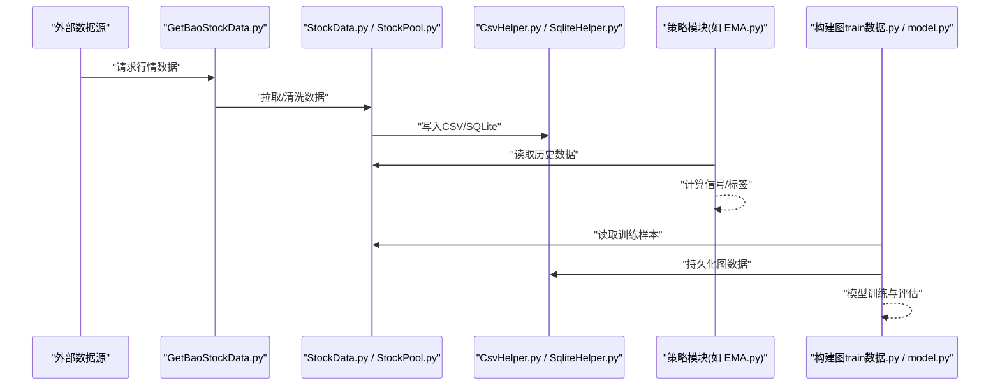
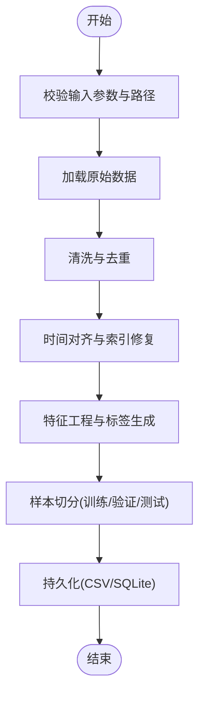
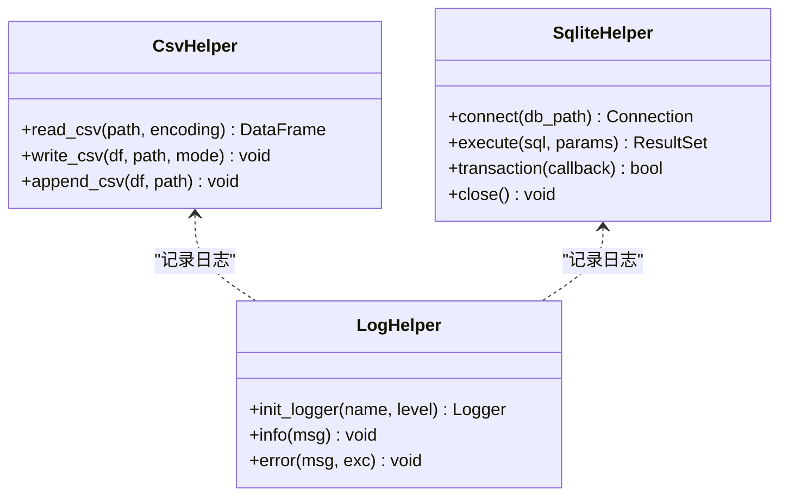
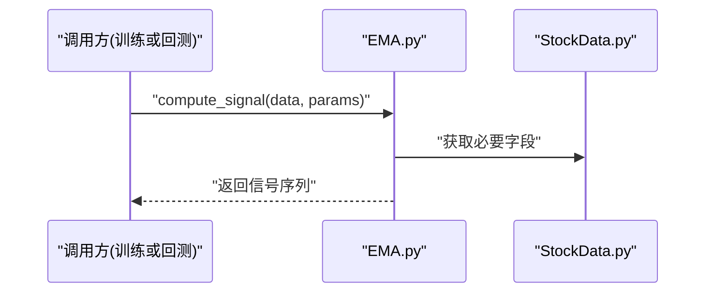
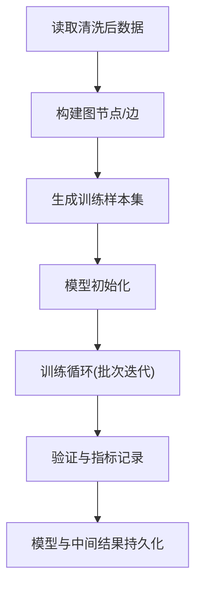
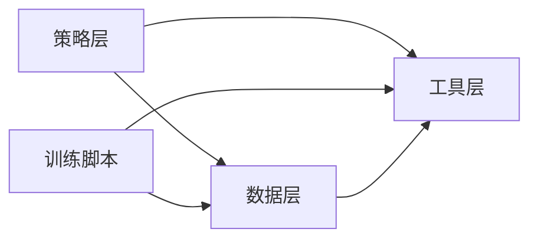

# 代码审查流程

<cite>
**本文引用的文件**   
- [MyProject/DataBase/StockData.py](file://MyProject/DataBase/StockData.py)
- [MyProject/DataBase/StockPool.py](file://MyProject/DataBase/StockPool.py)
- [MyProject/DataBase/TrainData.py](file://MyProject/DataBase/TrainData.py)
- [MyProject/Helper/CsvHelper.py](file://MyProject/Helper/CsvHelper.py)
- [MyProject/Helper/LogHelper.py](file://MyProject/Helper/LogHelper.py)
- [MyProject/Helper/SqliteHelper.py](file://MyProject/Helper/SqliteHelper.py)
- [MyProject/Model/Strategy/BLJJ.py](file://MyProject/Model/Strategy/BLJJ.py)
- [MyProject/Model/Strategy/CrossSimple.py](file://MyProject/Model/Strategy/CrossSimple.py)
- [MyProject/Model/Strategy/EMA.py](file://MyProject/Model/Strategy/EMA.py)
- [MyProject/Model/Strategy/MagicNine.py](file://MyProject/Model/Strategy/MagicNine.py)
- [MyProject/Model/Strategy/SignalIntervalTrade.py](file://MyProject/Model/Strategy/SignalIntervalTrade.py)
- [MyProject/Model/Strategy/TradeTag.py](file://MyProject/Model/Strategy/TradeTag.py)
- [生成train数据/model.py](file://生成train数据/model.py)
- [生成train数据/构建图train数据.py](file://生成train数据/构建图train数据.py)
- [GetBaoStockData.py](file://GetBaoStockData.py)
</cite>

## 目录
1. [引言](#引言)
2. [项目结构](#项目结构)
3. [核心组件](#核心组件)
4. [架构总览](#架构总览)
5. [详细组件分析](#详细组件分析)
6. [依赖分析](#依赖分析)
7. [性能考量](#性能考量)
8. [故障排查指南](#故障排查指南)
9. [结论](#结论)
10. [附录](#附录)

## 引言
本文件为“代码审查流程”规范，面向本项目（GNN与量化策略相关）的Python工程。目标包括：
- 制定统一的审查清单：覆盖代码质量、安全漏洞扫描、性能评估、文档完整性验证
- 明确审查标准：可读性、架构一致性、错误处理、边界条件
- 建立反馈处理机制：意见分类、修改跟踪、最终验收标准
- 集成自动化审查工具：静态分析、覆盖率检查、依赖安全扫描

本规范适用于所有提交至主干分支的代码变更，确保可维护性与稳定性。

## 项目结构
仓库采用按功能域划分的目录组织方式：
- MyProject/DataBase：数据访问与训练数据准备
- MyProject/Helper：通用工具（CSV、日志、SQLite等）
- MyProject/Model/Strategy：交易策略实现
- 生成train数据：模型与数据构建脚本
- GetBaoStockData.py：外部数据获取入口

图表来源
- [MyProject/DataBase/StockData.py](file://MyProject/DataBase/StockData.py)
- [MyProject/DataBase/StockPool.py](file://MyProject/DataBase/StockPool.py)
- [MyProject/DataBase/TrainData.py](file://MyProject/DataBase/TrainData.py)
- [MyProject/Helper/CsvHelper.py](file://MyProject/Helper/CsvHelper.py)
- [MyProject/Helper/LogHelper.py](file://MyProject/Helper/LogHelper.py)
- [MyProject/Helper/SqliteHelper.py](file://MyProject/Helper/SqliteHelper.py)
- [MyProject/Model/Strategy/BLJJ.py](file://MyProject/Model/Strategy/BLJJ.py)
- [MyProject/Model/Strategy/CrossSimple.py](file://MyProject/Model/Strategy/CrossSimple.py)
- [MyProject/Model/Strategy/EMA.py](file://MyProject/Model/Strategy/EMA.py)
- [MyProject/Model/Strategy/MagicNine.py](file://MyProject/Model/Strategy/MagicNine.py)
- [MyProject/Model/Strategy/SignalIntervalTrade.py](file://MyProject/Model/Strategy/SignalIntervalTrade.py)
- [MyProject/Model/Strategy/TradeTag.py](file://MyProject/Model/Strategy/TradeTag.py)
- [生成train数据/model.py](file://生成train数据/model.py)
- [生成train数据/构建图train数据.py](file://生成train数据/构建图train数据.py)
- [GetBaoStockData.py](file://GetBaoStockData.py)

章节来源
- [MyProject/DataBase/StockData.py](file://MyProject/DataBase/StockData.py)
- [MyProject/DataBase/StockPool.py](file://MyProject/DataBase/StockPool.py)
- [MyProject/DataBase/TrainData.py](file://MyProject/DataBase/TrainData.py)
- [MyProject/Helper/CsvHelper.py](file://MyProject/Helper/CsvHelper.py)
- [MyProject/Helper/LogHelper.py](file://MyProject/Helper/LogHelper.py)
- [MyProject/Helper/SqliteHelper.py](file://MyProject/Helper/SqliteHelper.py)
- [MyProject/Model/Strategy/BLJJ.py](file://MyProject/Model/Strategy/BLJJ.py)
- [MyProject/Model/Strategy/CrossSimple.py](file://MyProject/Model/Strategy/CrossSimple.py)
- [MyProject/Model/Strategy/EMA.py](file://MyProject/Model/Strategy/EMA.py)
- [MyProject/Model/Strategy/MagicNine.py](file://MyProject/Model/Strategy/MagicNine.py)
- [MyProject/Model/Strategy/SignalIntervalTrade.py](file://MyProject/Model/Strategy/SignalIntervalTrade.py)
- [MyProject/Model/Strategy/TradeTag.py](file://MyProject/Model/Strategy/TradeTag.py)
- [生成train数据/model.py](file://生成train数据/model.py)
- [生成train数据/构建图train数据.py](file://生成train数据/构建图train数据.py)
- [GetBaoStockData.py](file://GetBaoStockData.py)

## 核心组件
- 数据访问与准备
  - StockData.py：股票行情数据读取与预处理
  - StockPool.py：股票池管理与筛选
  - TrainData.py：训练数据集构建与导出
- 工具库
  - CsvHelper.py：CSV读写封装
  - LogHelper.py：日志记录封装
  - SqliteHelper.py：SQLite数据库操作封装
- 策略模块
  - BLJJ.py、CrossSimple.py、EMA.py、MagicNine.py、SignalIntervalTrade.py、TradeTag.py：不同交易信号与标签生成逻辑
- 训练与数据构建
  - model.py：模型定义与训练流程
  - 构建图train数据.py：图数据构建与保存
- 外部数据接入
  - GetBaoStockData.py：从外部源拉取数据并落库

章节来源
- [MyProject/DataBase/StockData.py](file://MyProject/DataBase/StockData.py)
- [MyProject/DataBase/StockPool.py](file://MyProject/DataBase/StockPool.py)
- [MyProject/DataBase/TrainData.py](file://MyProject/DataBase/TrainData.py)
- [MyProject/Helper/CsvHelper.py](file://MyProject/Helper/CsvHelper.py)
- [MyProject/Helper/LogHelper.py](file://MyProject/Helper/LogHelper.py)
- [MyProject/Helper/SqliteHelper.py](file://MyProject/Helper/SqliteHelper.py)
- [MyProject/Model/Strategy/BLJJ.py](file://MyProject/Model/Strategy/BLJJ.py)
- [MyProject/Model/Strategy/CrossSimple.py](file://MyProject/Model/Strategy/CrossSimple.py)
- [MyProject/Model/Strategy/EMA.py](file://MyProject/Model/Strategy/EMA.py)
- [MyProject/Model/Strategy/MagicNine.py](file://MyProject/Model/Strategy/MagicNine.py)
- [MyProject/Model/Strategy/SignalIntervalTrade.py](file://MyProject/Model/Strategy/SignalIntervalTrade.py)
- [MyProject/Model/Strategy/TradeTag.py](file://MyProject/Model/Strategy/TradeTag.py)
- [生成train数据/model.py](file://生成train数据/model.py)
- [生成train数据/构建图train数据.py](file://生成train数据/构建图train数据.py)
- [GetBaoStockData.py](file://GetBaoStockData.py)

## 架构总览
整体分层清晰：外部数据接入 -> 数据层 -> 工具层 -> 策略层 -> 训练与数据构建。各层通过明确的接口交互，便于独立测试与替换实现。

图表来源
- [GetBaoStockData.py](file://GetBaoStockData.py)
- [MyProject/DataBase/StockData.py](file://MyProject/DataBase/StockData.py)
- [MyProject/DataBase/StockPool.py](file://MyProject/DataBase/StockPool.py)
- [MyProject/Helper/CsvHelper.py](file://MyProject/Helper/CsvHelper.py)
- [MyProject/Helper/SqliteHelper.py](file://MyProject/Helper/SqliteHelper.py)
- [MyProject/Model/Strategy/EMA.py](file://MyProject/Model/Strategy/EMA.py)
- [生成train数据/构建图train数据.py](file://生成train数据/构建图train数据.py)
- [生成train数据/model.py](file://生成train数据/model.py)

## 详细组件分析

### 数据层组件分析（StockData.py / StockPool.py / TrainData.py）
- 职责划分
  - StockData.py：负责原始数据的加载、清洗、标准化
  - StockPool.py：管理标的集合与过滤规则
  - TrainData.py：将清洗后的数据转换为训练样本，支持批量导出
- 关键流程
  - 输入校验 -> 数据清洗 -> 特征构造 -> 样本切分 -> 持久化
- 风险点
  - 大文件I/O阻塞、内存溢出
  - 缺失值与异常值未统一处理
  - 时间序列对齐问题

图表来源
- [MyProject/DataBase/StockData.py](file://MyProject/DataBase/StockData.py)
- [MyProject/DataBase/StockPool.py](file://MyProject/DataBase/StockPool.py)
- [MyProject/DataBase/TrainData.py](file://MyProject/DataBase/TrainData.py)

章节来源
- [MyProject/DataBase/StockData.py](file://MyProject/DataBase/StockData.py)
- [MyProject/DataBase/StockPool.py](file://MyProject/DataBase/StockPool.py)
- [MyProject/DataBase/TrainData.py](file://MyProject/DataBase/TrainData.py)

### 工具层组件分析（CsvHelper.py / LogHelper.py / SqliteHelper.py）
- 设计要点
  - 统一异常包装与日志输出
  - 连接复用与事务控制（SQLite）
  - CSV编码与分隔符配置
- 建议
  - 增加重试与超时机制
  - 提供只读模式开关以提升安全性

图表来源
- [MyProject/Helper/CsvHelper.py](file://MyProject/Helper/CsvHelper.py)
- [MyProject/Helper/LogHelper.py](file://MyProject/Helper/LogHelper.py)
- [MyProject/Helper/SqliteHelper.py](file://MyProject/Helper/SqliteHelper.py)

章节来源
- [MyProject/Helper/CsvHelper.py](file://MyProject/Helper/CsvHelper.py)
- [MyProject/Helper/LogHelper.py](file://MyProject/Helper/LogHelper.py)
- [MyProject/Helper/SqliteHelper.py](file://MyProject/Helper/SqliteHelper.py)

### 策略层组件分析（EMA.py / CrossSimple.py / SignalIntervalTrade.py / TradeTag.py）
- 设计要点
  - 每个策略应遵循统一接口：输入DataFrame，输出信号/标签
  - 参数集中管理，避免硬编码
  - 边界条件处理（空序列、NaN、单元素）
- 典型调用链

图表来源
- [MyProject/Model/Strategy/EMA.py](file://MyProject/Model/Strategy/EMA.py)
- [MyProject/Model/Strategy/CrossSimple.py](file://MyProject/Model/Strategy/CrossSimple.py)
- [MyProject/Model/Strategy/SignalIntervalTrade.py](file://MyProject/Model/Strategy/SignalIntervalTrade.py)
- [MyProject/Model/Strategy/TradeTag.py](file://MyProject/Model/Strategy/TradeTag.py)
- [MyProject/DataBase/StockData.py](file://MyProject/DataBase/StockData.py)

章节来源
- [MyProject/Model/Strategy/EMA.py](file://MyProject/Model/Strategy/EMA.py)
- [MyProject/Model/Strategy/CrossSimple.py](file://MyProject/Model/Strategy/CrossSimple.py)
- [MyProject/Model/Strategy/SignalIntervalTrade.py](file://MyProject/Model/Strategy/SignalIntervalTrade.py)
- [MyProject/Model/Strategy/TradeTag.py](file://MyProject/Model/Strategy/TradeTag.py)

### 训练与数据构建（构建图train数据.py / model.py）
- 职责
  - 构建图结构节点与边，生成训练样本
  - 模型定义、训练循环、指标统计
- 关键流程

图表来源
- [生成train数据/构建图train数据.py](file://生成train数据/构建图train数据.py)
- [生成train数据/model.py](file://生成train数据/model.py)

章节来源
- [生成train数据/构建图train数据.py](file://生成train数据/构建图train数据.py)
- [生成train数据/model.py](file://生成train数据/model.py)

### 外部数据接入（GetBaoStockData.py）
- 职责
  - 从外部源拉取数据，进行基础校验与落库
- 注意事项
  - 网络异常重试与限流
  - 幂等写入（避免重复插入）
  - 敏感信息（API密钥）使用环境变量

章节来源
- [GetBaoStockData.py](file://GetBaoStockData.py)

## 依赖分析
- 内部依赖
  - 策略层依赖数据层提供的标准化DataFrame
  - 训练脚本依赖数据层与工具层
- 外部依赖
  - pandas/numpy用于数据处理
  - sqlite3用于本地存储
  - 可能的第三方库（如PyTorch Geometric）用于图模型

图表来源
- [MyProject/Model/Strategy/EMA.py](file://MyProject/Model/Strategy/EMA.py)
- [MyProject/DataBase/StockData.py](file://MyProject/DataBase/StockData.py)
- [MyProject/Helper/CsvHelper.py](file://MyProject/Helper/CsvHelper.py)
- [生成train数据/构建图train数据.py](file://生成train数据/构建图train数据.py)

章节来源
- [MyProject/Model/Strategy/EMA.py](file://MyProject/Model/Strategy/EMA.py)
- [MyProject/DataBase/StockData.py](file://MyProject/DataBase/StockData.py)
- [MyProject/Helper/CsvHelper.py](file://MyProject/Helper/CsvHelper.py)
- [生成train数据/构建图train数据.py](file://生成train数据/构建图train数据.py)

## 性能考量
- I/O优化
  - 批量写入CSV/SQLite，减少频繁磁盘操作
  - 使用只读连接与游标分页读取大数据集
- 内存管理
  - 对超大DataFrame进行分块处理
  - 及时释放不再使用的对象引用
- 计算优化
  - 向量化运算优先于逐行循环
  - 缓存中间结果，避免重复计算
- 并发与并行
  - 多进程并行构建样本（注意共享内存与序列化开销）
  - 异步网络请求拉取数据（需限制并发数）

[本节为通用指导，不直接分析具体文件]

## 故障排查指南
- 常见问题定位
  - 数据缺失/异常：在数据清洗阶段增加断言与告警日志
  - SQLite锁冲突：使用事务与短事务窗口，避免长时间持有连接
  - 策略信号异常：打印关键中间变量与边界情况
- 日志与监控
  - 统一日志格式，包含时间戳、级别、模块名、上下文
  - 关键步骤埋点，记录耗时与异常堆栈
- 快速恢复
  - 幂等写入与增量更新
  - 失败任务自动重试与死信队列

章节来源
- [MyProject/Helper/LogHelper.py](file://MyProject/Helper/LogHelper.py)
- [MyProject/Helper/SqliteHelper.py](file://MyProject/Helper/SqliteHelper.py)

## 结论
通过分层清晰的架构与严格的审查流程，可有效提升代码质量、安全性与可维护性。结合自动化审查工具与完善的反馈闭环，能显著降低缺陷流入生产环境的概率。

[本节为总结性内容，不直接分析具体文件]

## 附录

### 一、审查清单
- 代码质量检查
  - PEP8风格一致、命名规范、函数长度与圈复杂度阈值
  - 类型注解与Docstring完整
  - 单元测试覆盖率达标（建议≥80%）
- 安全漏洞扫描
  - 依赖漏洞扫描（CVE）
  - 敏感信息（密钥、密码）不得硬编码
  - SQL注入防护（参数化查询）
- 性能评估
  - 热点路径基准测试
  - 内存峰值与CPU占用监控
- 文档完整性验证
  - README与模块说明更新
  - API/接口变更记录

### 二、审查标准
- 可读性
  - 单一职责、清晰命名、合理拆分
  - 注释解释“为什么”，而非“是什么”
- 架构一致性
  - 遵循分层与模块化约定
  - 接口契约稳定，向后兼容
- 错误处理
  - 异常分类与捕获，避免吞异常
  - 失败路径有降级与告警
- 边界条件
  - 空输入、极值、缺失值、重复键
  - 时间序列对齐与跨日处理

### 三、反馈处理机制
- 意见分类
  - 必须修改（阻断合并）
  - 建议修改（限期整改）
  - 参考意见（可选改进）
- 修改跟踪
  - 使用Issue/PR评论追踪
  - 每个问题关联到具体文件与行号
- 最终验收标准
  - 所有“必须修改”项已解决
  - 自动化检查全部通过
  - 至少一名具备权限的审查者批准

### 四、自动化审查工具集成
- 静态代码分析
  - flake8/pylint：风格与潜在错误
  - mypy：类型检查
- 代码覆盖率
  - pytest-cov：生成覆盖率报告
- 依赖安全扫描
  - safety/safety-cli：检测已知漏洞
- 集成建议
  - CI流水线中执行上述工具
  - 设置阈值与门禁，未达标阻止合并

[本节为流程与工具建议，不直接分析具体文件]