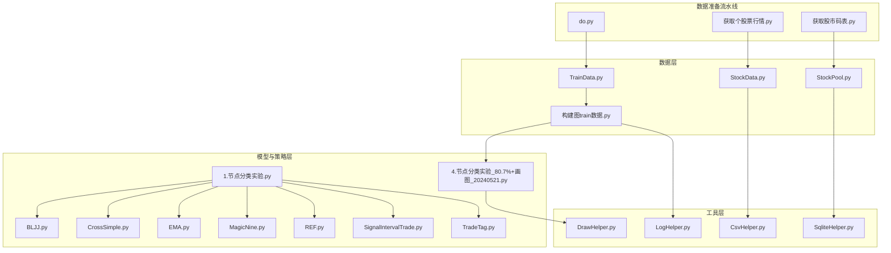
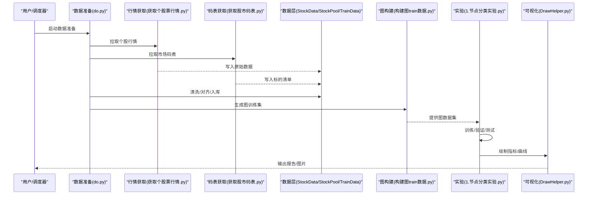
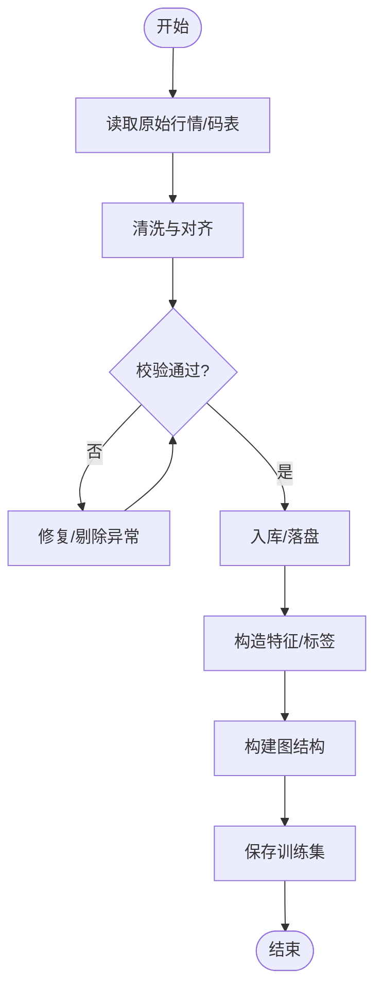
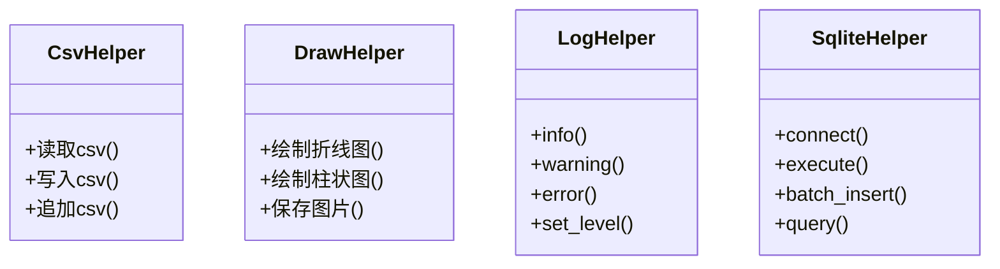
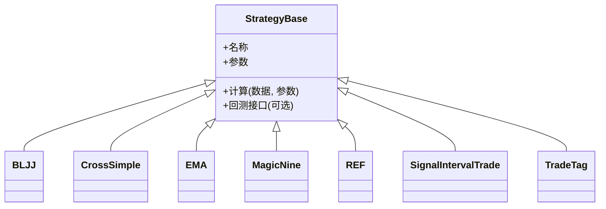
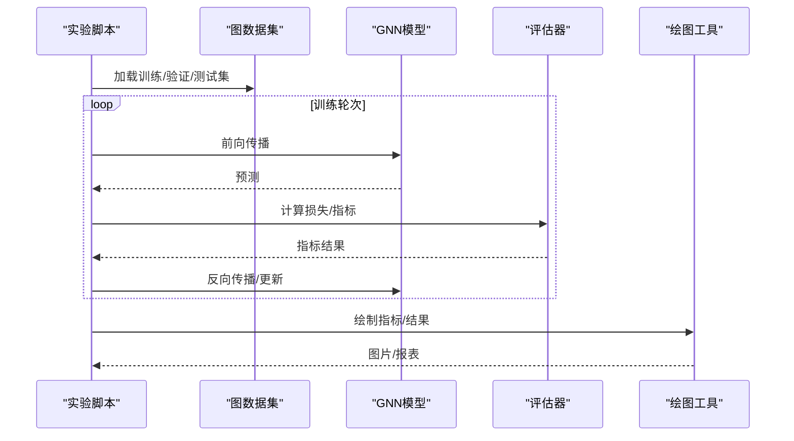
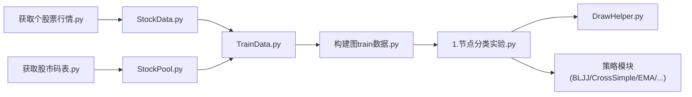

# 代码开发流程

<cite>
**本文引用的文件**   
- [StockData.py](file://MyProject/DataBase/StockData.py)
- [StockPool.py](file://MyProject/DataBase/StockPool.py)
- [TrainData.py](file://MyProject/DataBase/TrainData.py)
- [构建图train数据.py](file://MyProject/DataBase/构建图train数据.py)
- [CsvHelper.py](file://MyProject/Helper/CsvHelper.py)
- [DrawHelper.py](file://MyProject/Helper/DrawHelper.py)
- [LogHelper.py](file://MyProject/Helper/LogHelper.py)
- [SqliteHelper.py](file://MyProject/Helper/SqliteHelper.py)
- [BLJJ.py](file://MyProject/Model/Strategy/BLJJ.py)
- [CrossSimple.py](file://MyProject/Model/Strategy/CrossSimple.py)
- [EMA.py](file://MyProject/Model/Strategy/EMA.py)
- [MagicNine.py](file://MyProject/Model/Strategy/MagicNine.py)
- [REF.py](file://MyProject/Model/Strategy/REF.py)
- [SignalIntervalTrade.py](file://MyProject/Model/Strategy/SignalIntervalTrade.py)
- [TradeTag.py](file://MyProject/Model/Strategy/TradeTag.py)
- [1.节点分类实验.py](file://MyProject/Model/1.节点分类实验.py)
- [4.节点分类实验_80.7%+画图_20240521.py](file://MyProject/Model/4.节点分类实验_80.7%+画图_20240521.py)
- [do.py](file://生成train数据/do.py)
- [获取个股票行情.py](file://生成train数据/获取个股票行情.py)
- [获取股市码表.py](file://生成train数据/获取股市码表.py)
</cite>

## 目录
1. [引言](#引言)
2. [项目结构](#项目结构)
3. [核心组件](#核心组件)
4. [架构总览](#架构总览)
5. [详细组件分析](#详细组件分析)
6. [依赖分析](#依赖分析)
7. [性能考虑](#性能考虑)
8. [故障排查指南](#故障排查指南)
9. [结论](#结论)
10. [附录](#附录)

## 引言
本规范面向本项目（基于图神经网络的量化交易与策略研究）的代码开发与维护，覆盖从需求分析到上线的全生命周期，明确编码风格、命名约定、文档注释标准，并提供模块扩展指南（新增交易策略、数据模型、可视化组件）、重构最佳实践与性能优化建议。目标是在保证质量的前提下提升交付效率与可维护性。

## 项目结构
仓库采用按领域分层与功能域组织的方式：
- MyProject/DataBase：数据层，负责原始数据读取、清洗、入库与训练集构建
- MyProject/Helper：工具层，提供CSV、绘图、日志、SQLite等通用能力
- MyProject/Model：模型与策略层，包含交易策略实现与GNN节点分类实验脚本
- 生成train数据：数据准备流水线脚本集合
- 网络资料：参考资料与示例数据（非生产代码）

图表来源
- [StockData.py](file://MyProject/DataBase/StockData.py)
- [StockPool.py](file://MyProject/DataBase/StockPool.py)
- [TrainData.py](file://MyProject/DataBase/TrainData.py)
- [构建图train数据.py](file://MyProject/DataBase/构建图train数据.py)
- [CsvHelper.py](file://MyProject/Helper/CsvHelper.py)
- [DrawHelper.py](file://MyProject/Helper/DrawHelper.py)
- [LogHelper.py](file://MyProject/Helper/LogHelper.py)
- [SqliteHelper.py](file://MyProject/DataBase/StockPool.py)
- [BLJJ.py](file://MyProject/Model/Strategy/BLJJ.py)
- [CrossSimple.py](file://MyProject/Model/Strategy/CrossSimple.py)
- [EMA.py](file://MyProject/Model/Strategy/EMA.py)
- [MagicNine.py](file://MyProject/Model/Strategy/MagicNine.py)
- [REF.py](file://MyProject/Model/Strategy/REF.py)
- [SignalIntervalTrade.py](file://MyProject/Model/Strategy/SignalIntervalTrade.py)
- [TradeTag.py](file://MyProject/Model/Strategy/TradeTag.py)
- [1.节点分类实验.py](file://MyProject/Model/1.节点分类实验.py)
- [4.节点分类实验_80.7%+画图_20240521.py](file://MyProject/Model/4.节点分类实验_80.7%+画图_20240521.py)
- [do.py](file://生成train数据/do.py)
- [获取个股票行情.py](file://生成train数据/获取个股票行情.py)
- [获取股市码表.py](file://生成train数据/获取股市码表.py)

章节来源
- [StockData.py](file://MyProject/DataBase/StockData.py)
- [StockPool.py](file://MyProject/DataBase/StockPool.py)
- [TrainData.py](file://MyProject/DataBase/TrainData.py)
- [构建图train数据.py](file://MyProject/DataBase/构建图train数据.py)
- [CsvHelper.py](file://MyProject/Helper/CsvHelper.py)
- [DrawHelper.py](file://MyProject/Helper/DrawHelper.py)
- [LogHelper.py](file://MyProject/Helper/LogHelper.py)
- [SqliteHelper.py](file://MyProject/Helper/SqliteHelper.py)
- [BLJJ.py](file://MyProject/Model/Strategy/Strategy/BLJJ.py)
- [CrossSimple.py](file://MyProject/Model/Strategy/CrossSimple.py)
- [EMA.py](file://MyProject/Model/Strategy/EMA.py)
- [MagicNine.py](file://MyProject/Model/Strategy/MagicNine.py)
- [REF.py](file://MyProject/Model/Strategy/REF.py)
- [SignalIntervalTrade.py](file://MyProject/Model/Strategy/SignalIntervalTrade.py)
- [TradeTag.py](file://MyProject/Model/Strategy/TradeTag.py)
- [1.节点分类实验.py](file://MyProject/Model/1.节点分类实验.py)
- [4.节点分类实验_80.7%+画图_20240521.py](file://MyProject/Model/4.节点分类实验_80.7%+画图_20240521.py)
- [do.py](file://生成train数据/do.py)
- [获取个股票行情.py](file://生成train数据/获取个股票行情.py)
- [获取股市码表.py](file://生成train数据/获取股市码表.py)

## 核心组件
- 数据层
  - StockData：行情数据读取与基础处理
  - StockPool：股票池管理与元数据
  - TrainData：训练样本构造与特征工程
  - 构建图train数据：将时序/截面数据转换为图结构训练集
- 工具层
  - CsvHelper：CSV读写封装
  - DrawHelper：图表绘制封装
  - LogHelper：统一日志输出
  - SqliteHelper：SQLite数据库操作封装
- 策略层
  - BLJJ、CrossSimple、EMA、MagicNine、REF、SignalIntervalTrade、TradeTag：各类交易信号与标签生成策略
- 实验脚本
  - 1.节点分类实验.py：GNN节点分类主流程
  - 4.节点分类实验_80.7%+画图_20240521.py：含可视化的节点分类实验

章节来源
- [StockData.py](file://MyProject/DataBase/StockData.py)
- [StockPool.py](file://MyProject/DataBase/StockPool.py)
- [TrainData.py](file://MyProject/DataBase/TrainData.py)
- [构建图train数据.py](file://MyProject/DataBase/构建图train数据.py)
- [CsvHelper.py](file://MyProject/Helper/CsvHelper.py)
- [DrawHelper.py](file://MyProject/Helper/DrawHelper.py)
- [LogHelper.py](file://MyProject/Helper/LogHelper.py)
- [SqliteHelper.py](file://MyProject/Helper/SqliteHelper.py)
- [BLJJ.py](file://MyProject/Model/Strategy/BLJJ.py)
- [CrossSimple.py](file://MyProject/Model/Strategy/CrossSimple.py)
- [EMA.py](file://MyProject/Model/Strategy/EMA.py)
- [MagicNine.py](file://MyProject/Model/Strategy/MagicNine.py)
- [REF.py](file://MyProject/Model/Strategy/REF.py)
- [SignalIntervalTrade.py](file://MyProject/Model/Strategy/SignalIntervalTrade.py)
- [TradeTag.py](file://MyProject/Model/Strategy/TradeTag.py)
- [1.节点分类实验.py](file://MyProject/Model/1.节点分类实验.py)
- [4.节点分类实验_80.7%+画图_20240521.py](file://MyProject/Model/4.节点分类实验_80.7%+画图_20240521.py)

## 架构总览
系统围绕“数据→特征/标签→图训练集→模型训练/评估→可视化”的流水线展开。数据准备阶段通过行情与码表拉取、清洗入库；特征与标签由策略模块生成；图构建将多资产关系建模为图；实验脚本驱动训练与评估；绘图工具用于结果展示。

图表来源
- [do.py](file://生成train数据/do.py)
- [获取个股票行情.py](file://生成train数据/获取个股票行情.py)
- [获取股市码表.py](file://生成train数据/获取股市码表.py)
- [StockData.py](file://MyProject/DataBase/StockData.py)
- [StockPool.py](file://MyProject/DataBase/StockPool.py)
- [TrainData.py](file://MyProject/DataBase/TrainData.py)
- [构建图train数据.py](file://MyProject/DataBase/构建图train数据.py)
- [1.节点分类实验.py](file://MyProject/Model/1.节点分类实验.py)
- [DrawHelper.py](file://MyProject/Helper/DrawHelper.py)

## 详细组件分析

### 数据层组件
- StockData：负责行情数据的读取、字段校验、缺失值处理、时间序列对齐等
- StockPool：管理股票池、行业/板块映射、动态增删标的
- TrainData：根据业务规则构造训练样本，包括窗口切分、特征标准化、标签对齐
- 构建图train数据：将多资产序列或截面特征组装为图结构（节点/边/属性），并持久化

图表来源
- [StockData.py](file://MyProject/DataBase/StockData.py)
- [StockPool.py](file://MyProject/DataBase/StockPool.py)
- [TrainData.py](file://MyProject/DataBase/TrainData.py)
- [构建图train数据.py](file://MyProject/DataBase/构建图train数据.py)

章节来源
- [StockData.py](file://MyProject/DataBase/StockData.py)
- [StockPool.py](file://MyProject/DataBase/StockPool.py)
- [TrainData.py](file://MyProject/DataBase/TrainData.py)
- [构建图train数据.py](file://MyProject/DataBase/构建图train数据.py)

### 工具层组件
- CsvHelper：封装CSV读写、分隔符/编码配置、批量写入
- DrawHelper：封装折线/柱状/散点等常用图表绘制，统一样式与导出路径
- LogHelper：统一日志格式、分级输出、文件/控制台双写
- SqliteHelper：连接管理、事务封装、SQL参数化查询与批量插入

图表来源
- [CsvHelper.py](file://MyProject/Helper/CsvHelper.py)
- [DrawHelper.py](file://MyProject/Helper/DrawHelper.py)
- [LogHelper.py](file://MyProject/Helper/LogHelper.py)
- [SqliteHelper.py](file://MyProject/Helper/SqliteHelper.py)

章节来源
- [CsvHelper.py](file://MyProject/Helper/CsvHelper.py)
- [DrawHelper.py](file://MyProject/Helper/DrawHelper.py)
- [LogHelper.py](file://MyProject/Helper/LogHelper.py)
- [SqliteHelper.py](file://MyProject/Helper/SqliteHelper.py)

### 策略层组件
策略模块以“输入行情/特征 → 输出信号/标签”的形式被实验脚本调用。典型策略包括均线交叉、趋势跟踪、区间突破、标签生成等。

图表来源
- [BLJJ.py](file://MyProject/Model/Strategy/BLJJ.py)
- [CrossSimple.py](file://MyProject/Model/Strategy/CrossSimple.py)
- [EMA.py](file://MyProject/Model/Strategy/EMA.py)
- [MagicNine.py](file://MyProject/Model/Strategy/MagicNine.py)
- [REF.py](file://MyProject/Model/Strategy/REF.py)
- [SignalIntervalTrade.py](file://MyProject/Model/Strategy/SignalIntervalTrade.py)
- [TradeTag.py](file://MyProject/Model/Strategy/TradeTag.py)

章节来源
- [BLJJ.py](file://MyProject/Model/Strategy/BLJJ.py)
- [CrossSimple.py](file://MyProject/Model/Strategy/CrossSimple.py)
- [EMA.py](file://MyProject/Model/Strategy/EMA.py)
- [MagicNine.py](file://MyProject/Model/Strategy/MagicNine.py)
- [REF.py](file://MyProject/Model/Strategy/REF.py)
- [SignalIntervalTrade.py](file://MyProject/Model/Strategy/SignalIntervalTrade.py)
- [TradeTag.py](file://MyProject/Model/Strategy/TradeTag.py)

### 实验脚本与可视化
- 1.节点分类实验.py：加载图数据集、定义模型、训练循环、评估与保存权重
- 4.节点分类实验_80.7%+画图_20240521.py：在实验基础上集成绘图，输出关键指标曲线与对比图

图表来源
- [1.节点分类实验.py](file://MyProject/Model/1.节点分类实验.py)
- [4.节点分类实验_80.7%+画图_20240521.py](file://MyProject/Model/4.节点分类实验_80.7%+画图_20240521.py)
- [构建图train数据.py](file://MyProject/DataBase/构建图train数据.py)
- [DrawHelper.py](file://MyProject/Helper/DrawHelper.py)

章节来源
- [1.节点分类实验.py](file://MyProject/Model/1.节点分类实验.py)
- [4.节点分类实验_80.7%+画图_20240521.py](file://MyProject/Model/4.节点分类实验_80.7%+画图_20240521.py)

## 依赖分析
- 数据准备依赖外部行情源与码表接口，内部依赖CsvHelper/SqliteHelper进行落库
- 图构建依赖数据层产物，输出供实验脚本消费
- 实验脚本依赖策略模块与绘图工具
- 工具层被上层多处复用，耦合度低、内聚度高

图表来源
- [获取个股票行情.py](file://生成train数据/获取个股票行情.py)
- [获取股市码表.py](file://生成train数据/获取股市码表.py)
- [StockData.py](file://MyProject/DataBase/StockData.py)
- [StockPool.py](file://MyProject/DataBase/StockPool.py)
- [TrainData.py](file://MyProject/DataBase/TrainData.py)
- [构建图train数据.py](file://MyProject/DataBase/构建图train数据.py)
- [1.节点分类实验.py](file://MyProject/Model/1.节点分类实验.py)
- [DrawHelper.py](file://MyProject/Helper/DrawHelper.py)
- [BLJJ.py](file://MyProject/Model/Strategy/BLJJ.py)
- [CrossSimple.py](file://MyProject/Model/Strategy/CrossSimple.py)
- [EMA.py](file://MyProject/Model/Strategy/EMA.py)

章节来源
- [获取个股票行情.py](file://生成train数据/获取个股票行情.py)
- [获取股市码表.py](file://生成train数据/获取股市码表.py)
- [StockData.py](file://MyProject/DataBase/StockData.py)
- [StockPool.py](file://MyProject/DataBase/StockPool.py)
- [TrainData.py](file://MyProject/DataBase/TrainData.py)
- [构建图train数据.py](file://MyProject/DataBase/构建图train数据.py)
- [1.节点分类实验.py](file://MyProject/Model/1.节点分类实验.py)
- [DrawHelper.py](file://MyProject/Helper/DrawHelper.py)
- [BLJJ.py](file://MyProject/Model/Strategy/BLJJ.py)
- [CrossSimple.py](file://MyProject/Model/Strategy/CrossSimple.py)
- [EMA.py](file://MyProject/Model/Strategy/EMA.py)

## 性能考虑
- 数据I/O
  - 使用批处理写入与索引优化，减少频繁小写入
  - CSV/SQLite读写尽量使用参数化与批量接口
- 内存与计算
  - 大数组操作优先使用向量化，避免逐行循环
  - 对重复计算的特征进行缓存或增量更新
- 图构建
  - 稀疏矩阵/邻接表表示，按需构建边
  - 分批构建与持久化，避免一次性加载全量图
- 训练
  - 合理设置批次大小与学习率，启用早停与梯度裁剪
  - 使用混合精度与GPU加速（如适用）
- 可视化
  - 延迟渲染与按需导出，避免阻塞主流程

[本节为通用指导，不直接分析具体文件]

## 故障排查指南
- 数据问题
  - 检查字段完整性、时间戳连续性、空值与异常值
  - 核对入库前后记录数一致性与主键唯一性
- 策略问题
  - 打印中间信号/标签分布，确认逻辑分支
  - 对极端行情做边界用例验证
- 训练问题
  - 监控损失曲线与指标收敛情况
  - 检查过拟合/欠拟合，调整正则化与数据增强
- 工具层问题
  - 日志级别调至debug定位错误堆栈
  - SQLite连接泄漏、锁等待需显式关闭与重试

章节来源
- [LogHelper.py](file://MyProject/Helper/LogHelper.py)
- [SqliteHelper.py](file://MyProject/Helper/SqliteHelper.py)
- [CsvHelper.py](file://MyProject/Helper/CsvHelper.py)

## 结论
本规范明确了从数据到模型再到可视化的端到端开发流程，定义了各层职责与协作方式，提供了策略与数据模型的扩展方法、重构与性能优化建议。遵循本规范有助于提升代码一致性、可维护性与交付质量。

## 附录

### 新功能开发生命周期
- 需求分析
  - 明确业务目标、输入输出、约束条件与验收标准
- 技术设计
  - 确定模块边界、接口契约、数据结构与依赖关系
  - 输出设计文档与流程图/时序图
- 编码实现
  - 遵循编码风格与命名约定，编写单元测试
  - 提交前完成静态检查与本地回归
- 单元测试
  - 覆盖正常路径、边界条件与异常场景
  - 断言清晰、可复现、执行快速
- 集成测试
  - 串联数据→图构建→训练→评估→可视化全流程
  - 使用固定种子与最小数据集保障稳定性
- 评审与合并
  - 同行评审通过后合并，更新文档与变更日志

### 代码风格与命名约定
- Python风格
  - 遵循PEP8，缩进4空格，行宽建议不超过120字符
  - 函数/变量使用小写下划线，类名使用大驼峰
- 模块与包
  - 模块名小写，包名小写，常量全大写
- 类型与注解
  - 关键函数添加类型注解与返回值说明
- 注释与文档
  - 模块级docstring说明用途、依赖与用法
  - 函数级docstring描述参数、返回值、异常与示例路径
  - 复杂逻辑添加行内注释解释意图而非语法

### 文档注释标准
- 模块docstring：目的、主要类/函数、对外接口、依赖
- 类docstring：职责、状态、关键方法与注意事项
- 函数docstring：参数类型与含义、返回值、异常、副作用
- 示例：提供可运行的示例路径或伪调用链

### 模块扩展指南
- 新增交易策略
  - 在策略目录创建新文件，继承统一基类（如有）
  - 实现计算接口，返回信号/标签，保持幂等与可测试
  - 补充单元测试与示例调用
- 新增数据模型
  - 在数据层新增模型类，定义字段、校验与转换
  - 提供迁移/初始化脚本与样例数据
  - 在训练管线中注册并使用
- 新增可视化组件
  - 在工具层新增绘图函数，统一样式与导出路径
  - 在实验脚本中按需调用，避免硬编码路径

### 重构最佳实践
- 小步快跑：每次只改一处，配合单测保障正确性
- 提取公共逻辑：识别重复代码，抽取为工具函数/类
- 降低耦合：通过接口/配置注入依赖，避免全局状态
- 提升内聚：将相关行为聚合到同一模块/类
- 持续清理：删除死代码、废弃接口与过时注释

### 性能优化建议
- 数据侧：向量化、预分配、惰性加载、分区存储
- 算法侧：近似计算、早停、剪枝、缓存
- 系统侧：并发I/O、连接池、资源回收、监控埋点