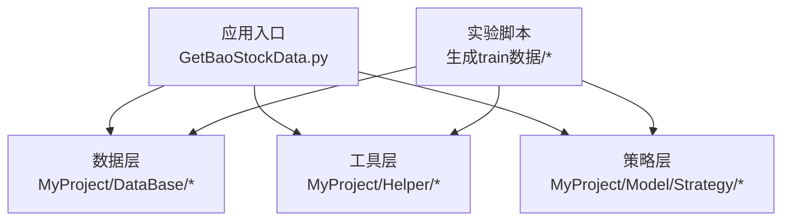
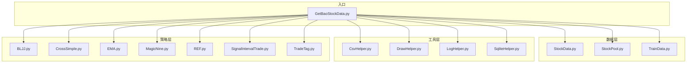
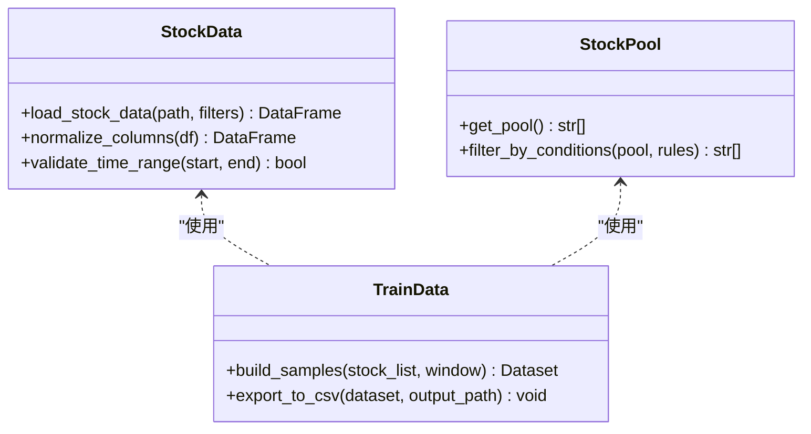
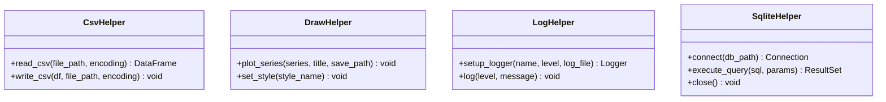
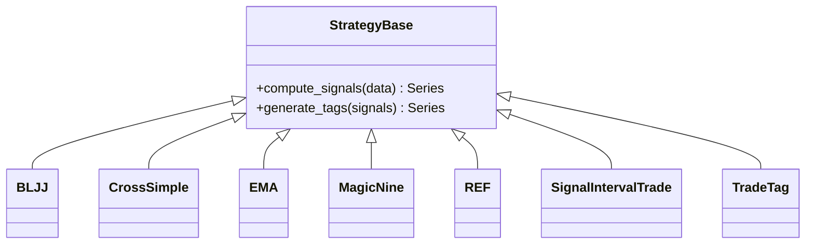
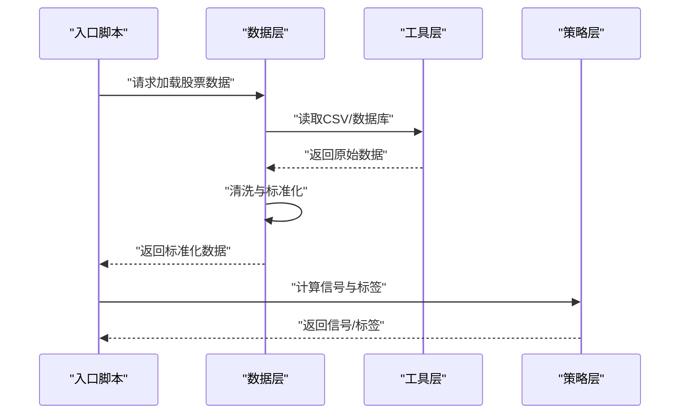
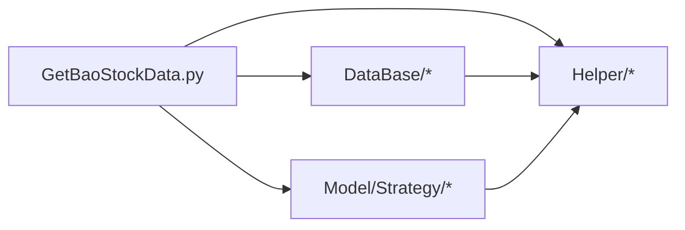

# 代码规范与风格

<cite>
**本文引用的文件**   
- [MyProject/DataBase/StockData.py](file://MyProject/DataBase/StockData.py)
- [MyProject/DataBase/StockPool.py](file://MyProject/DataBase/StockPool.py)
- [MyProject/DataBase/TrainData.py](file://MyProject/DataBase/TrainData.py)
- [MyProject/Helper/CsvHelper.py](file://MyProject/Helper/CsvHelper.py)
- [MyProject/Helper/DrawHelper.py](file://MyProject/Helper/DrawHelper.py)
- [MyProject/Helper/LogHelper.py](file://MyProject/Helper/LogHelper.py)
- [MyProject/Helper/SqliteHelper.py](file://MyProject/Helper/SqliteHelper.py)
- [MyProject/Model/Strategy/BLJJ.py](file://MyProject/Model/Strategy/BLJJ.py)
- [MyProject/Model/Strategy/CrossSimple.py](file://MyProject/Model/Strategy/CrossSimple.py)
- [MyProject/Model/Strategy/EMA.py](file://MyProject/Model/Strategy/EMA.py)
- [MyProject/Model/Strategy/MagicNine.py](file://MyProject/Model/Strategy/MagicNine.py)
- [MyProject/Model/Strategy/REF.py](file://MyProject/Model/Strategy/REF.py)
- [MyProject/Model/Strategy/SignalIntervalTrade.py](file://MyProject/Model/Strategy/SignalIntervalTrade.py)
- [MyProject/Model/Strategy/TradeTag.py](file://MyProject/Model/Strategy/TradeTag.py)
- [生成train数据/构建图train数据.py](file://生成train数据/构建图train数据.py)
- [生成train数据/model.py](file://生成train数据/model.py)
- [GetBaoStockData.py](file://GetBaoStockData.py)
</cite>

## 目录
1. [简介](#简介)
2. [项目结构](#项目结构)
3. [核心组件](#核心组件)
4. [架构总览](#架构总览)
5. [详细组件分析](#详细组件分析)
6. [依赖分析](#依赖分析)
7. [性能考虑](#性能考虑)
8. [故障排查指南](#故障排查指南)
9. [结论](#结论)
10. [附录](#附录)

## 简介
本规范旨在统一团队Python代码编写标准，覆盖命名约定、缩进格式、注释规范、文件组织结构、类与方法设计模式（参数传递、返回值处理、异常处理）、代码审查清单与质量检查工具配置。通过明确的规则与示例对照，确保代码风格一致性与可维护性，降低协作成本，提升交付质量。

## 项目结构
本项目采用按功能域划分的目录组织方式：
- MyProject/DataBase：数据访问与训练数据准备
- MyProject/Helper：通用工具（CSV、绘图、日志、SQLite等）
- MyProject/Model/Strategy：策略实现
- 生成train数据：实验脚本与模型定义
- GetBaoStockData.py：外部数据获取入口

图表来源
- [GetBaoStockData.py](file://GetBaoStockData.py)
- [MyProject/DataBase/StockData.py](file://MyProject/DataBase/StockData.py)
- [MyProject/Helper/CsvHelper.py](file://MyProject/Helper/CsvHelper.py)
- [MyProject/Model/Strategy/BLJJ.py](file://MyProject/Model/Strategy/BLJJ.py)
- [生成train数据/构建图train数据.py](file://生成train数据/构建图train数据.py)

章节来源
- [GetBaoStockData.py](file://GetBaoStockData.py)
- [生成train数据/构建图train数据.py](file://生成train数据/构建图train数据.py)

## 核心组件
- 数据层
  - StockData：行情数据读取与封装
  - StockPool：股票池管理
  - TrainData：训练数据构建与导出
- 工具层
  - CsvHelper：CSV读写封装
  - DrawHelper：绘图辅助
  - LogHelper：日志记录
  - SqliteHelper：SQLite数据库操作
- 策略层
  - BLJJ、CrossSimple、EMA、MagicNine、REF、SignalIntervalTrade、TradeTag：交易信号与标签生成

章节来源
- [MyProject/DataBase/StockData.py](file://MyProject/DataBase/StockData.py)
- [MyProject/DataBase/StockPool.py](file://MyProject/DataBase/StockPool.py)
- [MyProject/DataBase/TrainData.py](file://MyProject/DataBase/TrainData.py)
- [MyProject/Helper/CsvHelper.py](file://MyProject/Helper/CsvHelper.py)
- [MyProject/Helper/DrawHelper.py](file://MyProject/Helper/DrawHelper.py)
- [MyProject/Helper/LogHelper.py](file://MyProject/Helper/LogHelper.py)
- [MyProject/Helper/SqliteHelper.py](file://MyProject/Helper/SqliteHelper.py)
- [MyProject/Model/Strategy/BLJJ.py](file://MyProject/Model/Strategy/BLJJ.py)
- [MyProject/Model/Strategy/CrossSimple.py](file://MyProject/Model/Strategy/CrossSimple.py)
- [MyProject/Model/Strategy/EMA.py](file://MyProject/Model/Strategy/EMA.py)
- [MyProject/Model/Strategy/MagicNine.py](file://MyProject/Model/Strategy/MagicNine.py)
- [MyProject/Model/Strategy/REF.py](file://MyProject/Model/Strategy/REF.py)
- [MyProject/Model/Strategy/SignalIntervalTrade.py](file://MyProject/Model/Strategy/SignalIntervalTrade.py)
- [MyProject/Model/Strategy/TradeTag.py](file://MyProject/Model/Strategy/TradeTag.py)

## 架构总览
整体分层清晰：入口脚本调用数据层与工具层，策略层提供独立计算逻辑；实验脚本复用相同模块进行数据处理与模型训练。

图表来源
- [GetBaoStockData.py](file://GetBaoStockData.py)
- [MyProject/DataBase/StockData.py](file://MyProject/DataBase/StockData.py)
- [MyProject/DataBase/StockPool.py](file://MyProject/DataBase/StockPool.py)
- [MyProject/DataBase/TrainData.py](file://MyProject/DataBase/TrainData.py)
- [MyProject/Helper/CsvHelper.py](file://MyProject/Helper/CsvHelper.py)
- [MyProject/Helper/DrawHelper.py](file://MyProject/Helper/DrawHelper.py)
- [MyProject/Helper/LogHelper.py](file://MyProject/Helper/LogHelper.py)
- [MyProject/Helper/SqliteHelper.py](file://MyProject/Helper/SqliteHelper.py)
- [MyProject/Model/Strategy/BLJJ.py](file://MyProject/Model/Strategy/BLJJ.py)
- [MyProject/Model/Strategy/CrossSimple.py](file://MyProject/Model/Strategy/CrossSimple.py)
- [MyProject/Model/Strategy/EMA.py](file://MyProject/Model/Strategy/EMA.py)
- [MyProject/Model/Strategy/MagicNine.py](file://MyProject/Model/Strategy/MagicNine.py)
- [MyProject/Model/Strategy/REF.py](file://MyProject/Model/Strategy/REF.py)
- [MyProject/Model/Strategy/SignalIntervalTrade.py](file://MyProject/Model/Strategy/SignalIntervalTrade.py)
- [MyProject/Model/Strategy/TradeTag.py](file://MyProject/Model/Strategy/TradeTag.py)

## 详细组件分析

### 数据层组件
- 职责边界
  - StockData：负责从源数据加载并标准化字段
  - StockPool：维护标的集合与过滤条件
  - TrainData：将原始数据转换为模型可用的训练样本
- 设计要点
  - 输入校验：对路径、时间范围、股票代码等进行前置校验
  - 错误处理：IO异常、空结果集、类型不匹配等明确抛出
  - 返回约定：优先返回结构化对象或DataFrame，避免隐式副作用

图表来源
- [MyProject/DataBase/StockData.py](file://MyProject/DataBase/StockData.py)
- [MyProject/DataBase/StockPool.py](file://MyProject/DataBase/StockPool.py)
- [MyProject/DataBase/TrainData.py](file://MyProject/DataBase/TrainData.py)

章节来源
- [MyProject/DataBase/StockData.py](file://MyProject/DataBase/StockData.py)
- [MyProject/DataBase/StockPool.py](file://MyProject/DataBase/StockPool.py)
- [MyProject/DataBase/TrainData.py](file://MyProject/DataBase/TrainData.py)

### 工具层组件
- 职责边界
  - CsvHelper：CSV读写、编码处理、列映射
  - DrawHelper：统一绘图接口、样式设置
  - LogHelper：日志级别、输出目标、格式化
  - SqliteHelper：连接管理、事务、查询封装
- 设计要点
  - 幂等性：重复调用不应产生副作用
  - 资源管理：文件句柄、数据库连接需显式关闭或使用上下文管理器
  - 错误传播：底层异常包装为领域相关异常

图表来源
- [MyProject/Helper/CsvHelper.py](file://MyProject/Helper/CsvHelper.py)
- [MyProject/Helper/DrawHelper.py](file://MyProject/Helper/DrawHelper.py)
- [MyProject/Helper/LogHelper.py](file://MyProject/Helper/LogHelper.py)
- [MyProject/Helper/SqliteHelper.py](file://MyProject/Helper/SqliteHelper.py)

章节来源
- [MyProject/Helper/CsvHelper.py](file://MyProject/Helper/CsvHelper.py)
- [MyProject/Helper/DrawHelper.py](file://MyProject/Helper/DrawHelper.py)
- [MyProject/Helper/LogHelper.py](file://MyProject/Helper/LogHelper.py)
- [MyProject/Helper/SqliteHelper.py](file://MyProject/Helper/SqliteHelper.py)

### 策略层组件
- 职责边界
  - 各策略文件实现独立的信号计算与标签生成逻辑
- 设计要点
  - 纯函数优先：输入数据与参数，输出信号/标签，避免全局状态
  - 参数校验：窗口大小、阈值、方向等参数需严格校验
  - 可测试性：每个策略暴露最小可测单元

图表来源
- [MyProject/Model/Strategy/BLJJ.py](file://MyProject/Model/Strategy/BLJJ.py)
- [MyProject/Model/Strategy/CrossSimple.py](file://MyProject/Model/Strategy/CrossSimple.py)
- [MyProject/Model/Strategy/EMA.py](file://MyProject/Model/Strategy/EMA.py)
- [MyProject/Model/Strategy/MagicNine.py](file://MyProject/Model/Strategy/MagicNine.py)
- [MyProject/Model/Strategy/REF.py](file://MyProject/Model/Strategy/REF.py)
- [MyProject/Model/Strategy/SignalIntervalTrade.py](file://MyProject/Model/Strategy/SignalIntervalTrade.py)
- [MyProject/Model/Strategy/TradeTag.py](file://MyProject/Model/Strategy/TradeTag.py)

章节来源
- [MyProject/Model/Strategy/BLJJ.py](file://MyProject/Model/Strategy/BLJJ.py)
- [MyProject/Model/Strategy/CrossSimple.py](file://MyProject/Model/Strategy/CrossSimple.py)
- [MyProject/Model/Strategy/EMA.py](file://MyProject/Model/Strategy/EMA.py)
- [MyProject/Model/Strategy/MagicNine.py](file://MyProject/Model/Strategy/MagicNine.py)
- [MyProject/Model/Strategy/REF.py](file://MyProject/Model/Strategy/REF.py)
- [MyProject/Model/Strategy/SignalIntervalTrade.py](file://MyProject/Model/Strategy/SignalIntervalTrade.py)
- [MyProject/Model/Strategy/TradeTag.py](file://MyProject/Model/Strategy/TradeTag.py)

### 关键流程时序（以数据构建为例）

图表来源
- [GetBaoStockData.py](file://GetBaoStockData.py)
- [MyProject/DataBase/StockData.py](file://MyProject/DataBase/StockData.py)
- [MyProject/Helper/CsvHelper.py](file://MyProject/Helper/CsvHelper.py)
- [MyProject/Model/Strategy/BLJJ.py](file://MyProject/Model/Strategy/BLJJ.py)

## 依赖分析
- 模块耦合
  - 入口脚本对数据层与工具层存在直接依赖
  - 策略层尽量保持无状态，仅依赖数据与工具
- 潜在循环依赖
  - 当前分层清晰，未见明显循环导入
- 外部依赖
  - CSV、SQLite、绘图库需在依赖管理中声明

图表来源
- [GetBaoStockData.py](file://GetBaoStockData.py)
- [MyProject/DataBase/StockData.py](file://MyProject/DataBase/StockData.py)
- [MyProject/Helper/CsvHelper.py](file://MyProject/Helper/CsvHelper.py)
- [MyProject/Model/Strategy/BLJJ.py](file://MyProject/Model/Strategy/BLJJ.py)

章节来源
- [GetBaoStockData.py](file://GetBaoStockData.py)
- [MyProject/DataBase/StockData.py](file://MyProject/DataBase/StockData.py)
- [MyProject/Helper/CsvHelper.py](file://MyProject/Helper/CsvHelper.py)
- [MyProject/Model/Strategy/BLJJ.py](file://MyProject/Model/Strategy/BLJJ.py)

## 性能考虑
- I/O优化
  - 批量写入CSV，避免逐行追加
  - SQLite使用事务包裹多条写入
- 内存控制
  - 大数据集分块处理，及时释放中间变量
- 计算加速
  - 向量化计算优先于循环
  - 缓存热点结果，避免重复计算

## 故障排查指南
- 常见问题定位
  - 路径与权限：确认文件路径正确且具备读写权限
  - 编码问题：统一UTF-8，必要时显式指定编码
  - 空数据：在数据加载后增加空值检查与日志记录
- 日志与调试
  - 使用LogHelper记录关键步骤与异常堆栈
  - 对关键分支添加断言与单元测试

章节来源
- [MyProject/Helper/LogHelper.py](file://MyProject/Helper/LogHelper.py)
- [MyProject/Helper/SqliteHelper.py](file://MyProject/Helper/SqliteHelper.py)
- [MyProject/Helper/CsvHelper.py](file://MyProject/Helper/CsvHelper.py)

## 结论
通过统一的命名、缩进、注释与文件组织规范，结合清晰的类与方法设计模式、完善的异常处理与日志记录，以及严格的代码审查与质量检查工具链，可显著提升团队协作效率与代码质量。建议将本规范纳入CI流程，持续自动化保障一致性。

## 附录

### Python代码编写标准
- 命名约定
  - 模块与包：全小写，下划线分隔（如 stock_data）
  - 类名：大驼峰（如 StockData）
  - 函数与方法：小写加下划线（如 load_stock_data）
  - 常量：大写加下划线（如 MAX_WINDOW）
  - 私有成员：单下划线前缀（如 _internal_cache）
- 缩进与行长
  - 使用4空格缩进，禁止Tab
  - 行长不超过88字符（遵循Black默认）
- 注释与文档字符串
  - 模块级：说明用途、作者、许可证
  - 类级：描述职责与使用示例
  - 方法级：参数、返回值、异常说明
  - 行内注释：解释“为什么”，而非“是什么”
- 文件组织结构
  - 单一职责：一个文件一个主题
  - 导入顺序：标准库、第三方库、本地模块，分组并空行分隔
  - __init__.py：仅暴露公共API，避免隐藏副作用

### 类与方法设计模式
- 参数传递
  - 位置参数用于必需且语义明确的参数
  - 关键字参数用于可选参数，提供合理默认值
  - 复杂参数使用命名元组或数据类
- 返回值处理
  - 成功返回结构化对象或DataFrame
  - 失败返回None或抛出异常，避免混合返回
- 异常处理
  - 自定义异常继承自内置异常
  - 捕获具体异常类型，记录上下文信息
  - 不在循环中频繁抛异常，尽量批量处理

### 代码审查清单
- 可读性
  - 命名是否清晰？是否有不必要的缩写？
  - 函数是否过长？是否可拆分为更小的单元？
- 健壮性
  - 是否处理了空输入与边界条件？
  - 是否对I/O与网络调用做了重试与超时控制？
- 可测试性
  - 是否可被单元测试覆盖？
  - 是否存在全局状态导致测试不稳定？
- 安全性
  - 是否避免了硬编码敏感信息？
  - 是否对用户输入进行了校验与清理？
- 性能
  - 是否存在N+1查询或重复计算？
  - 是否使用了合适的容器与算法复杂度？

### 质量检查工具配置建议
- 格式化
  - Black：统一代码风格
  - isort：导入排序
- 静态检查
  - flake8：基础语法与风格检查
  - pylint：深度静态分析与度量
  - mypy：类型检查（可选）
- 测试
  - pytest：运行测试用例
  - coverage：覆盖率统计
- 集成
  - pre-commit钩子：提交前自动执行格式化与检查
  - CI流水线：合并请求触发检查与测试

### 正误写法对比（路径引用）
- 命名与结构
  - 正确：参考 [MyProject/DataBase/StockData.py](file://MyProject/DataBase/StockData.py)
  - 错误：避免使用拼音或含糊命名，参见 [MyProject/Model/Strategy/BLJJ.py](file://MyProject/Model/Strategy/BLJJ.py)
- 参数与返回值
  - 正确：参考 [MyProject/Helper/CsvHelper.py](file://MyProject/Helper/CsvHelper.py)
  - 错误：避免返回多态类型，参见 [MyProject/Helper/SqliteHelper.py](file://MyProject/Helper/SqliteHelper.py)
- 异常与日志
  - 正确：参考 [MyProject/Helper/LogHelper.py](file://MyProject/Helper/LogHelper.py)
  - 错误：避免吞掉异常，参见 [生成train数据/构建图train数据.py](file://生成train数据/构建图train数据.py)
- 策略实现
  - 正确：参考 [MyProject/Model/Strategy/EMA.py](file://MyProject/Model/Strategy/EMA.py)
  - 错误：避免在策略中持有全局状态，参见 [MyProject/Model/Strategy/TradeTag.py](file://MyProject/Model/Strategy/TradeTag.py)