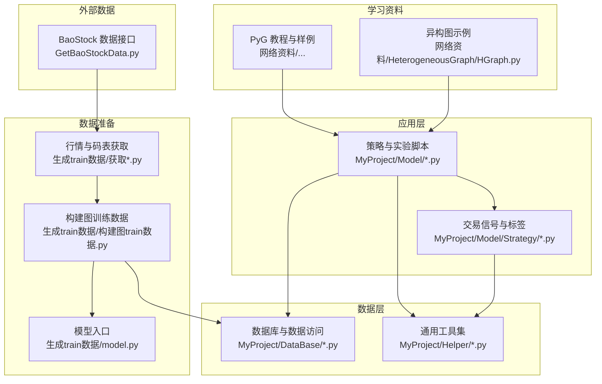
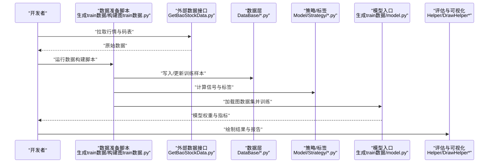
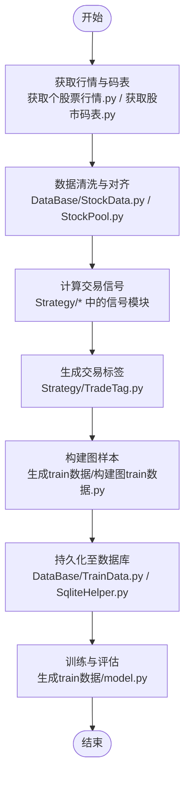
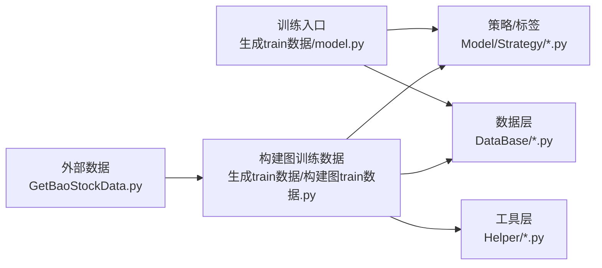

# 开发工作流程概览

<cite>
**本文引用的文件**   
- [MyProject/DataBase/StockData.py](file://MyProject/DataBase/StockData.py)
- [MyProject/DataBase/StockPool.py](file://MyProject/DataBase/StockPool.py)
- [MyProject/DataBase/TrainData.py](file://MyProject/DataBase/TrainData.py)
- [MyProject/Helper/CsvHelper.py](file://MyProject/Helper/CsvHelper.py)
- [MyProject/Helper/LogHelper.py](file://MyProject/Helper/LogHelper.py)
- [MyProject/Helper/SqliteHelper.py](file://MyProject/Helper/SqliteHelper.py)
- [MyProject/Model/Strategy/BLJJ.py](file://MyProject/Model/Strategy/BLJJ.py)
- [MyProject/Model/Strategy/CrossSimple.py](file://MyProject/Model/Strategy/CrossSimple.py)
- [MyProject/Model/Strategy/EMA.py](file://MyProject/Model/Strategy/EMA.py)
- [MyProject/Model/Strategy/MagicNine.py](file://MyProject/Model/Strategy/MagicNine.py)
- [MyProject/Model/Strategy/REF.py](file://MyProject/Model/Strategy/REF.py)
- [MyProject/Model/Strategy/SignalIntervalTrade.py](file://MyProject/Model/Strategy/SignalIntervalTrade.py)
- [MyProject/Model/Strategy/TradeTag.py](file://MyProject/Model/Strategy/TradeTag.py)
- [生成train数据/构建图train数据.py](file://生成train数据/构建图train数据.py)
- [生成train数据/model.py](file://生成train数据/model.py)
- [生成train数据/获取个股票行情.py](file://生成train数据/获取个股票行情.py)
- [生成train数据/获取股市码表.py](file://生成train数据/获取股市码表.py)
- [网络资料/3-图模型必备神器PyTorch Geometric安装与使用/工具包使用/2-点分类任务.ipynb](file://网络资料/3-图模型必备神器PyTorch Geometric安装与使用/工具包使用/2-点分类任务.ipynb)
- [网络资料/HeterogeneousGraph/HGraph.py](file://网络资料/HeterogeneousGraph/HGraph.py)
- [GetBaoStockData.py](file://GetBaoStockData.py)
</cite>

## 目录
1. [简介](#简介)
2. [项目结构](#项目结构)
3. [核心组件](#核心组件)
4. [架构总览](#架构总览)
5. [详细组件分析](#详细组件分析)
6. [依赖关系分析](#依赖关系分析)
7. [性能考虑](#性能考虑)
8. [故障排查指南](#故障排查指南)
9. [结论](#结论)
10. [附录](#附录)

## 简介
本文件面向本项目（基于图神经网络的股票策略研究）的开发者，提供从需求到上线的全流程工作指引。内容覆盖：
- 开发生命周期阶段：需求分析、技术设计、编码实现、测试验证、部署上线
- 开发模式与协作规范：分支管理、提交规范、代码评审、文档沉淀
- 环境配置与工具链：Python、PyTorch、PyG、数据源等
- 版本控制策略与分支约定：Git Flow 风格、标签与发布
- 初学者路径：从零到跑通实验的最小闭环

## 项目结构
仓库采用“按领域分层 + 脚本化实验”的组织方式：
- MyProject
  - DataBase：原始与训练数据的读写、清洗与持久化
  - Helper：通用工具（CSV、日志、SQLite、绘图、随机数等）
  - Model：策略与实验脚本；Strategy 子目录为可复用的交易信号与标签逻辑
- 生成train数据：数据准备与图构建脚本，含模型定义入口
- 网络资料：学习材料与样例（PyG 教程、异构图示例）
- GetBaoStockData.py：外部数据源接入脚本

图示来源
- [MyProject/Model/Strategy/BLJJ.py](file://MyProject/Model/Strategy/BLJJ.py)
- [MyProject/Model/Strategy/CrossSimple.py](file://MyProject/Model/Strategy/CrossSimple.py)
- [MyProject/Model/Strategy/EMA.py](file://MyProject/Model/Strategy/EMA.py)
- [MyProject/Model/Strategy/MagicNine.py](file://MyProject/Model/Strategy/MagicNine.py)
- [MyProject/Model/Strategy/REF.py](file://MyProject/Model/Strategy/REF.py)
- [MyProject/Model/Strategy/SignalIntervalTrade.py](file://MyProject/Model/Strategy/SignalIntervalTrade.py)
- [MyProject/Model/Strategy/TradeTag.py](file://MyProject/Model/Strategy/TradeTag.py)
- [MyProject/DataBase/StockData.py](file://MyProject/DataBase/StockData.py)
- [MyProject/DataBase/StockPool.py](file://MyProject/DataBase/StockPool.py)
- [MyProject/DataBase/TrainData.py](file://MyProject/DataBase/TrainData.py)
- [MyProject/Helper/CsvHelper.py](file://MyProject/Helper/CsvHelper.py)
- [MyProject/Helper/LogHelper.py](file://MyProject/Helper/LogHelper.py)
- [MyProject/Helper/SqliteHelper.py](file://MyProject/Helper/SqliteHelper.py)
- [生成train数据/构建图train数据.py](file://生成train数据/构建图train数据.py)
- [生成train数据/model.py](file://生成train数据/model.py)
- [生成train数据/获取个股票行情.py](file://生成train数据/获取个股票行情.py)
- [生成train数据/获取股市码表.py](file://生成train数据/获取股市码表.py)
- [GetBaoStockData.py](file://GetBaoStockData.py)
- [网络资料/3-图模型必备神器PyTorch Geometric安装与使用/工具包使用/2-点分类任务.ipynb](file://网络资料/3-图模型必备神器PyTorch Geometric安装与使用/工具包使用/2-点分类任务.ipynb)
- [网络资料/HeterogeneousGraph/HGraph.py](file://网络资料/HeterogeneousGraph/HGraph.py)

章节来源
- [MyProject/DataBase/StockData.py](file://MyProject/DataBase/StockData.py)
- [MyProject/DataBase/StockPool.py](file://MyProject/DataBase/StockPool.py)
- [MyProject/DataBase/TrainData.py](file://MyProject/DataBase/TrainData.py)
- [MyProject/Helper/CsvHelper.py](file://MyProject/Helper/CsvHelper.py)
- [MyProject/Helper/LogHelper.py](file://MyProject/Helper/LogHelper.py)
- [MyProject/Helper/SqliteHelper.py](file://MyProject/Helper/SqliteHelper.py)
- [MyProject/Model/Strategy/BLJJ.py](file://MyProject/Model/Strategy/BLJJ.py)
- [MyProject/Model/Strategy/CrossSimple.py](file://MyProject/Model/Strategy/CrossSimple.py)
- [MyProject/Model/Strategy/EMA.py](file://MyProject/Model/Strategy/EMA.py)
- [MyProject/Model/Strategy/MagicNine.py](file://MyProject/Model/Strategy/MagicNine.py)
- [MyProject/Model/Strategy/REF.py](file://MyProject/Model/Strategy/REF.py)
- [MyProject/Model/Strategy/SignalIntervalTrade.py](file://MyProject/Model/Strategy/SignalIntervalTrade.py)
- [MyProject/Model/Strategy/TradeTag.py](file://MyProject/Model/Strategy/TradeTag.py)
- [生成train数据/构建图train数据.py](file://生成train数据/构建图train数据.py)
- [生成train数据/model.py](file://生成train数据/model.py)
- [生成train数据/获取个股票行情.py](file://生成train数据/获取个股票行情.py)
- [生成train数据/获取股市码表.py](file://生成train数据/获取股市码表.py)
- [GetBaoStockData.py](file://GetBaoStockData.py)
- [网络资料/3-图模型必备神器PyTorch Geometric安装与使用/工具包使用/2-点分类任务.ipynb](file://网络资料/3-图模型必备神器PyTorch Geometric安装与使用/工具包使用/2-点分类任务.ipynb)
- [网络资料/HeterogeneousGraph/HGraph.py](file://网络资料/HeterogeneousGraph/HGraph.py)

## 核心组件
- 数据层
  - StockData/StockPool/TrainData：负责行情、标的池与训练样本的读取、清洗与存储
  - CsvHelper/SqliteHelper：CSV 与 SQLite 的通用封装，统一 IO 行为
  - LogHelper：结构化日志输出，便于问题定位与审计
- 策略与标签
  - Strategy 下各模块：交叉金叉/死叉、EMA 趋势、MACD 变体、区间信号、交易标签生成等
- 数据准备与建模
  - 构建图训练数据：将时序行情转换为图结构样本，供 PyG 训练
  - model.py：图模型入口与训练循环组织
- 外部数据
  - BaoStock 接口脚本：拉取个股行情与基础信息

章节来源
- [MyProject/DataBase/StockData.py](file://MyProject/DataBase/StockData.py)
- [MyProject/DataBase/StockPool.py](file://MyProject/DataBase/StockPool.py)
- [MyProject/DataBase/TrainData.py](file://MyProject/DataBase/TrainData.py)
- [MyProject/Helper/CsvHelper.py](file://MyProject/Helper/CsvHelper.py)
- [MyProject/Helper/SqliteHelper.py](file://MyProject/Helper/SqliteHelper.py)
- [MyProject/Helper/LogHelper.py](file://MyProject/Helper/LogHelper.py)
- [MyProject/Model/Strategy/BLJJ.py](file://MyProject/Model/Strategy/BLJJ.py)
- [MyProject/Model/Strategy/CrossSimple.py](file://MyProject/Model/Strategy/CrossSimple.py)
- [MyProject/Model/Strategy/EMA.py](file://MyProject/Model/Strategy/EMA.py)
- [MyProject/Model/Strategy/MagicNine.py](file://MyProject/Model/Strategy/MagicNine.py)
- [MyProject/Model/Strategy/REF.py](file://MyProject/Model/Strategy/REF.py)
- [MyProject/Model/Strategy/SignalIntervalTrade.py](file://MyProject/Model/Strategy/SignalIntervalTrade.py)
- [MyProject/Model/Strategy/TradeTag.py](file://MyProject/Model/Strategy/TradeTag.py)
- [生成train数据/构建图train数据.py](file://生成train数据/构建图train数据.py)
- [生成train数据/model.py](file://生成train数据/model.py)
- [GetBaoStockData.py](file://GetBaoStockData.py)

## 架构总览
下图展示从数据获取到训练与评估的整体流程，以及关键模块间的调用关系。

图示来源
- [生成train数据/构建图train数据.py](file://生成train数据/构建图train数据.py)
- [生成train数据/model.py](file://生成train数据/model.py)
- [GetBaoStockData.py](file://GetBaoStockData.py)
- [MyProject/DataBase/TrainData.py](file://MyProject/DataBase/TrainData.py)
- [MyProject/Model/Strategy/TradeTag.py](file://MyProject/Model/Strategy/TradeTag.py)
- [MyProject/Helper/DrawHelper.py](file://MyProject/Helper/DrawHelper.py)

## 详细组件分析

### 数据准备与图构建流程
该流程将多只股票的时序行情转化为图节点/边特征，并生成训练标签。

图示来源
- [生成train数据/获取个股票行情.py](file://生成train数据/获取个股票行情.py)
- [生成train数据/获取股市码表.py](file://生成train数据/获取股市码表.py)
- [MyProject/DataBase/StockData.py](file://MyProject/DataBase/StockData.py)
- [MyProject/DataBase/StockPool.py](file://MyProject/DataBase/StockPool.py)
- [MyProject/Model/Strategy/BLJJ.py](file://MyProject/Model/Strategy/BLJJ.py)
- [MyProject/Model/Strategy/CrossSimple.py](file://MyProject/Model/Strategy/CrossSimple.py)
- [MyProject/Model/Strategy/EMA.py](file://MyProject/Model/Strategy/EMA.py)
- [MyProject/Model/Strategy/MagicNine.py](file://MyProject/Model/Strategy/MagicNine.py)
- [MyProject/Model/Strategy/REF.py](file://MyProject/Model/Strategy/REF.py)
- [MyProject/Model/Strategy/SignalIntervalTrade.py](file://MyProject/Model/Strategy/SignalIntervalTrade.py)
- [MyProject/Model/Strategy/TradeTag.py](file://MyProject/Model/Strategy/TradeTag.py)
- [生成train数据/构建图train数据.py](file://生成train数据/构建图train数据.py)
- [MyProject/DataBase/TrainData.py](file://MyProject/DataBase/TrainData.py)
- [MyProject/Helper/SqliteHelper.py](file://MyProject/Helper/SqliteHelper.py)
- [生成train数据/model.py](file://生成train数据/model.py)

章节来源
- [生成train数据/构建图train数据.py](file://生成train数据/构建图train数据.py)
- [生成train数据/model.py](file://生成train数据/model.py)
- [生成train数据/获取个股票行情.py](file://生成train数据/获取个股票行情.py)
- [生成train数据/获取股市码表.py](file://生成train数据/获取股市码表.py)
- [MyProject/DataBase/StockData.py](file://MyProject/DataBase/StockData.py)
- [MyProject/DataBase/StockPool.py](file://MyProject/DataBase/StockPool.py)
- [MyProject/DataBase/TrainData.py](file://MyProject/DataBase/TrainData.py)
- [MyProject/Helper/SqliteHelper.py](file://MyProject/Helper/SqliteHelper.py)
- [MyProject/Model/Strategy/TradeTag.py](file://MyProject/Model/Strategy/TradeTag.py)

### 策略与标签模块
- 信号类：CrossSimple、EMA、MagicNine、REF、SignalIntervalTrade 等，用于生成买卖信号或趋势判断
- 标签类：TradeTag 根据未来收益或事件窗口生成监督信号
- 建议：每个策略以独立文件暴露统一的接口（如 compute_signals），便于组合与回测

章节来源
- [MyProject/Model/Strategy/CrossSimple.py](file://MyProject/Model/Strategy/CrossSimple.py)
- [MyProject/Model/Strategy/EMA.py](file://MyProject/Model/Strategy/EMA.py)
- [MyProject/Model/Strategy/MagicNine.py](file://MyProject/Model/Strategy/MagicNine.py)
- [MyProject/Model/Strategy/REF.py](file://MyProject/Model/Strategy/REF.py)
- [MyProject/Model/Strategy/SignalIntervalTrade.py](file://MyProject/Model/Strategy/SignalIntervalTrade.py)
- [MyProject/Model/Strategy/TradeTag.py](file://MyProject/Model/Strategy/TradeTag.py)

### 数据与工具层
- CSV/SQLite 封装：CsvHelper、SqliteHelper 提供一致的读写 API
- 日志：LogHelper 统一日志格式与级别，便于追踪
- 绘图：DrawHelper 系列用于可视化结果与诊断

章节来源
- [MyProject/Helper/CsvHelper.py](file://MyProject/Helper/CsvHelper.py)
- [MyProject/Helper/SqliteHelper.py](file://MyProject/Helper/SqliteHelper.py)
- [MyProject/Helper/LogHelper.py](file://MyProject/Helper/LogHelper.py)
- [MyProject/Helper/DrawHelper.py](file://MyProject/Helper/DrawHelper.py)

## 依赖关系分析
- 内部依赖
  - 数据准备脚本依赖数据层与策略模块
  - 训练入口依赖数据层与模型定义
  - 策略模块依赖工具层（CSV/日志/绘图）
- 外部依赖
  - PyTorch 与 PyTorch Geometric（参考网络资料中的教程）
  - 数据源接口（BaoStock 等）

图示来源
- [生成train数据/构建图train数据.py](file://生成train数据/构建图train数据.py)
- [生成train数据/model.py](file://生成train数据/model.py)
- [GetBaoStockData.py](file://GetBaoStockData.py)
- [MyProject/DataBase/StockData.py](file://MyProject/DataBase/StockData.py)
- [MyProject/DataBase/StockPool.py](file://MyProject/DataBase/StockPool.py)
- [MyProject/DataBase/TrainData.py](file://MyProject/DataBase/TrainData.py)
- [MyProject/Helper/CsvHelper.py](file://MyProject/Helper/CsvHelper.py)
- [MyProject/Helper/LogHelper.py](file://MyProject/Helper/LogHelper.py)
- [MyProject/Helper/SqliteHelper.py](file://MyProject/Helper/SqliteHelper.py)
- [MyProject/Model/Strategy/BLJJ.py](file://MyProject/Model/Strategy/BLJJ.py)
- [MyProject/Model/Strategy/CrossSimple.py](file://MyProject/Model/Strategy/CrossSimple.py)
- [MyProject/Model/Strategy/EMA.py](file://MyProject/Model/Strategy/EMA.py)
- [MyProject/Model/Strategy/MagicNine.py](file://MyProject/Model/Strategy/MagicNine.py)
- [MyProject/Model/Strategy/REF.py](file://MyProject/Model/Strategy/REF.py)
- [MyProject/Model/Strategy/SignalIntervalTrade.py](file://MyProject/Model/Strategy/SignalIntervalTrade.py)
- [MyProject/Model/Strategy/TradeTag.py](file://MyProject/Model/Strategy/TradeTag.py)

章节来源
- [生成train数据/构建图train数据.py](file://生成train数据/构建图train数据.py)
- [生成train数据/model.py](file://生成train数据/model.py)
- [GetBaoStockData.py](file://GetBaoStockData.py)
- [MyProject/DataBase/StockData.py](file://MyProject/DataBase/StockData.py)
- [MyProject/DataBase/StockPool.py](file://MyProject/DataBase/StockPool.py)
- [MyProject/DataBase/TrainData.py](file://MyProject/DataBase/TrainData.py)
- [MyProject/Helper/CsvHelper.py](file://MyProject/Helper/CsvHelper.py)
- [MyProject/Helper/LogHelper.py](file://MyProject/Helper/LogHelper.py)
- [MyProject/Helper/SqliteHelper.py](file://MyProject/Helper/SqliteHelper.py)
- [MyProject/Model/Strategy/BLJJ.py](file://MyProject/Model/Strategy/BLJJ.py)
- [MyProject/Model/Strategy/CrossSimple.py](file://MyProject/Model/Strategy/CrossSimple.py)
- [MyProject/Model/Strategy/EMA.py](file://MyProject/Model/Strategy/EMA.py)
- [MyProject/Model/Strategy/MagicNine.py](file://MyProject/Model/Strategy/MagicNine.py)
- [MyProject/Model/Strategy/REF.py](file://MyProject/Model/Strategy/REF.py)
- [MyProject/Model/Strategy/SignalIntervalTrade.py](file://MyProject/Model/Strategy/SignalIntervalTrade.py)
- [MyProject/Model/Strategy/TradeTag.py](file://MyProject/Model/Strategy/TradeTag.py)

## 性能考虑
- 数据预处理
  - 批量写入数据库，减少频繁 IO
  - 对大表建立必要索引（如股票代码、时间戳）
- 图构建
  - 按需构建邻接矩阵，避免全量内存占用
  - 使用稀疏表示与分块处理
- 训练
  - 合理设置 batch size 与 num_workers
  - 启用混合精度与梯度累积（视硬件条件）
- 日志与监控
  - 记录关键指标与资源占用，便于定位瓶颈

[本节为通用指导，不直接分析具体文件]

## 故障排查指南
- 常见问题
  - 数据缺失或时间戳不一致：检查数据清洗与对齐逻辑
  - 标签噪声：调整标签生成窗口与阈值
  - 训练不稳定：检查学习率、归一化与初始化
- 定位手段
  - 通过日志定位异常堆栈与关键中间变量
  - 使用绘图模块输出关键曲线进行对比
- 恢复策略
  - 保留中间产物与权重快照，支持断点续训
  - 对关键步骤增加幂等性校验

章节来源
- [MyProject/Helper/LogHelper.py](file://MyProject/Helper/LogHelper.py)
- [MyProject/Helper/DrawHelper.py](file://MyProject/Helper/DrawHelper.py)
- [生成train数据/model.py](file://生成train数据/model.py)

## 结论
本项目围绕“数据—策略—图构建—训练—评估”的主线展开，模块化程度较高，便于扩展新策略与数据源。建议在后续迭代中完善自动化测试、参数管理与实验追踪，进一步提升可重复性与工程化水平。

[本节为总结性内容，不直接分析具体文件]

## 附录

### 开发生命周期与工作流
- 需求分析
  - 明确业务目标（如选股、择时、风险因子挖掘）
  - 确定数据范围、指标口径与评估标准
- 技术设计
  - 数据模型与图结构定义
  - 策略与标签方案
  - 训练与评估流程
- 编码实现
  - 遵循模块边界与接口约定
  - 增量提交，保持单变更聚焦
- 测试验证
  - 单元测试（策略/标签/工具）
  - 集成测试（端到端数据构建与训练）
  - 回归测试（指标稳定性）
- 部署上线
  - 打包与依赖锁定
  - 监控与告警
  - 回滚预案

[本节为通用流程说明，不直接分析具体文件]

### 开发模式与协作规范
- 分支管理（Git Flow 风格）
  - main：稳定发布分支
  - develop：集成开发分支
  - feature/*：功能分支
  - hotfix/*：紧急修复分支
  - release/*：预发布分支
- 提交规范
  - 类型+描述（如 feat: 新增 EMA 信号模块）
  - 小步快跑，避免一次性大提交
- 代码评审
  - 至少一人审查后合并
  - 关注可读性、健壮性与性能
- 文档与知识沉淀
  - README/CHANGELOG 同步更新
  - 重要决策与实验结论归档

[本节为通用协作规范，不直接分析具体文件]

### 开发环境配置指南
- Python 与虚拟环境
  - 建议使用 venv/conda 隔离环境
- 深度学习框架
  - PyTorch（CPU/GPU 对应版本）
  - PyTorch Geometric（参考教程）
- 数据源
  - BaoStock 或其他数据接口
- 常用工具
  - 日志、绘图、CSV/SQLite 工具已在项目中封装

章节来源
- [网络资料/3-图模型必备神器PyTorch Geometric安装与使用/工具包使用/2-点分类任务.ipynb](file://网络资料/3-图模型必备神器PyTorch Geometric安装与使用/工具包使用/2-点分类任务.ipynb)
- [GetBaoStockData.py](file://GetBaoStockData.py)
- [MyProject/Helper/CsvHelper.py](file://MyProject/Helper/CsvHelper.py)
- [MyProject/Helper/SqliteHelper.py](file://MyProject/Helper/SqliteHelper.py)
- [MyProject/Helper/LogHelper.py](file://MyProject/Helper/LogHelper.py)

### 版本控制策略与分支约定
- 版本号语义化（主.次.修订）
- 标签发布（vX.Y.Z）
- 变更日志（CHANGELOG）维护
- 分支命名与合并策略

[本节为通用版本管理建议，不直接分析具体文件]

### 初学者入门路径
- 第一步：阅读 PyG 教程，理解点分类任务
- 第二步：运行数据准备脚本，生成最小训练集
- 第三步：在 model.py 中启动训练与评估
- 第四步：尝试替换或新增一个策略模块
- 第五步：完善日志与绘图，形成可复现实验报告

章节来源
- [网络资料/3-图模型必备神器PyTorch Geometric安装与使用/工具包使用/2-点分类任务.ipynb](file://网络资料/3-图模型必备神器PyTorch Geometric安装与使用/工具包使用/2-点分类任务.ipynb)
- [生成train数据/构建图train数据.py](file://生成train数据/构建图train数据.py)
- [生成train数据/model.py](file://生成train数据/model.py)
- [MyProject/Model/Strategy/BLJJ.py](file://MyProject/Model/Strategy/BLJJ.py)
- [MyProject/Model/Strategy/CrossSimple.py](file://MyProject/Model/Strategy/CrossSimple.py)
- [MyProject/Model/Strategy/EMA.py](file://MyProject/Model/Strategy/EMA.py)
- [MyProject/Model/Strategy/MagicNine.py](file://MyProject/Model/Strategy/MagicNine.py)
- [MyProject/Model/Strategy/REF.py](file://MyProject/Model/Strategy/REF.py)
- [MyProject/Model/Strategy/SignalIntervalTrade.py](file://MyProject/Model/Strategy/SignalIntervalTrade.py)
- [MyProject/Model/Strategy/TradeTag.py](file://MyProject/Model/Strategy/TradeTag.py)