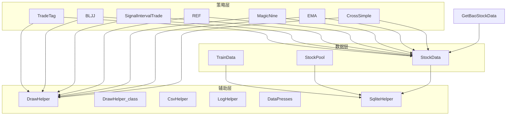
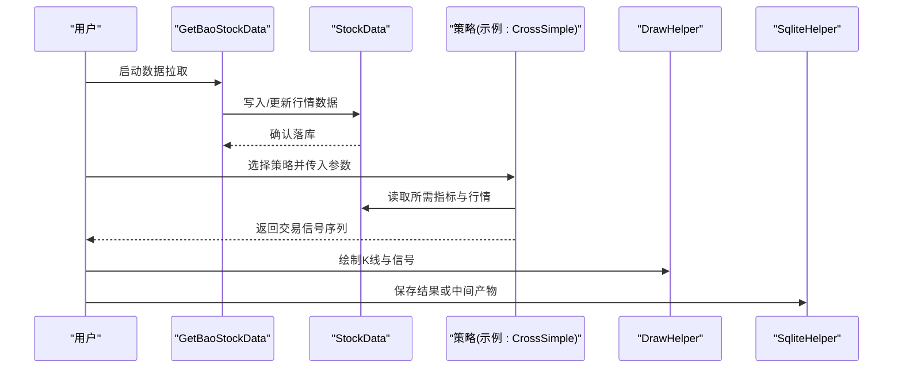
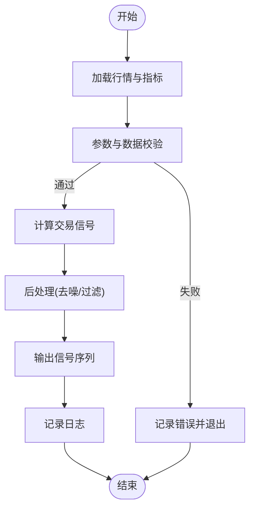
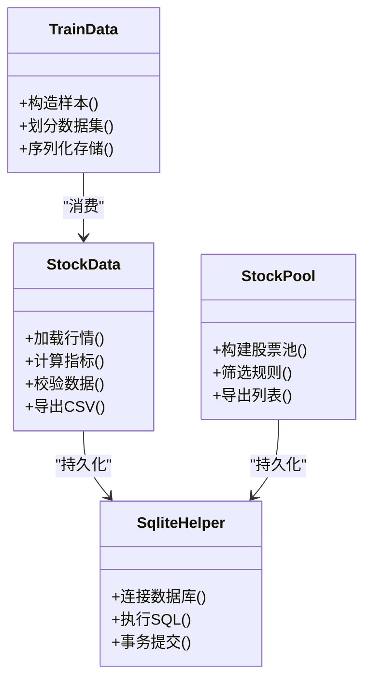
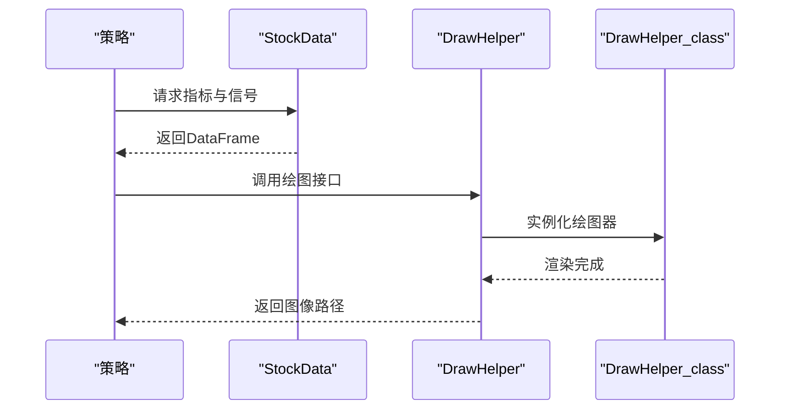
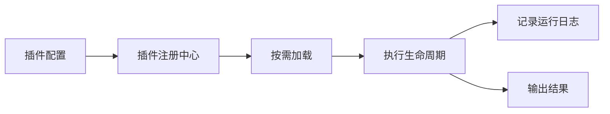
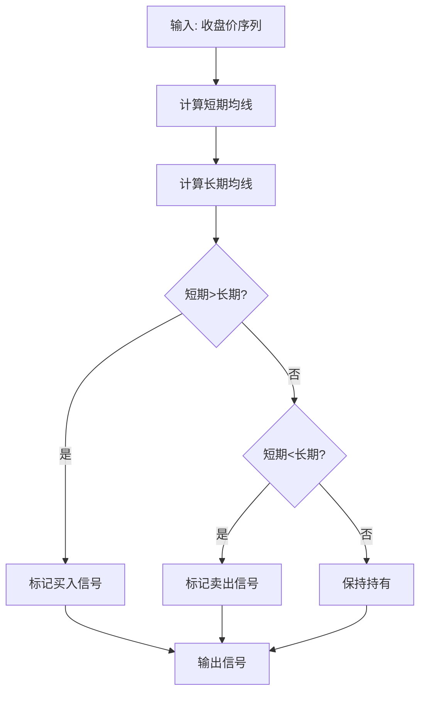
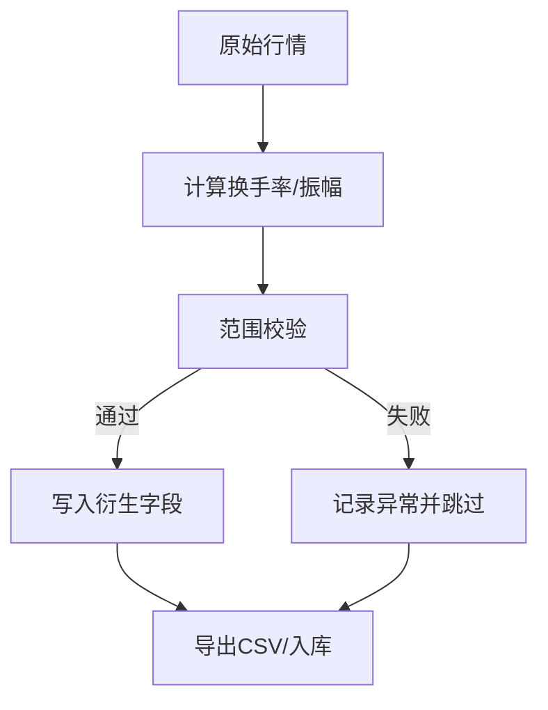
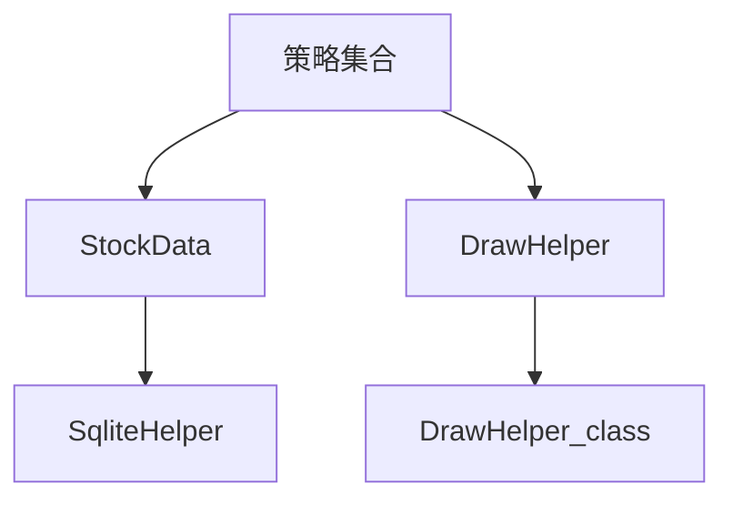

# 模块扩展指南

<cite>
**本文引用的文件**   
- [MyProject/Model/Strategy/CrossSimple.py](file://MyProject/Model/Strategy/CrossSimple.py)
- [MyProject/Model/Strategy/EMA.py](file://MyProject/Model/Strategy/EMA.py)
- [MyProject/Model/Strategy/MagicNine.py](file://MyProject/Model/Strategy/MagicNine.py)
- [MyProject/Model/Strategy/REF.py](file://MyProject/Model/Strategy/REF.py)
- [MyProject/Model/Strategy/SignalIntervalTrade.py](file://MyProject/Model/Strategy/Strategy/SignalIntervalTrade.py)
- [MyProject/Model/Strategy/BLJJ.py](file://MyProject/Model/Strategy/BLJJ.py)
- [MyProject/Model/Strategy/TradeTag.py](file://MyProject/Model/Strategy/TradeTag.py)
- [MyProject/DataBase/StockData.py](file://MyProject/DataBase/StockData.py)
- [MyProject/DataBase/StockPool.py](file://MyProject/DataBase/StockPool.py)
- [MyProject/DataBase/TrainData.py](file://MyProject/DataBase/TrainData.py)
- [MyProject/Helper/DrawHelper.py](file://MyProject/Helper/DrawHelper.py)
- [MyProject/Helper/DrawHelper_class.py](file://MyProject/Helper/DrawHelper_class.py)
- [MyProject/Helper/CsvHelper.py](file://MyProject/Helper/CsvHelper.py)
- [MyProject/Helper/LogHelper.py](file://MyProject/Helper/LogHelper.py)
- [MyProject/Helper/DataPresses.py](file://MyProject/Helper/DataPresses.py)
- [MyProject/Helper/SqliteHelper.py](file://MyProject/Helper/SqliteHelper.py)
- [GetBaoStockData.py](file://GetBaoStockData.py)
</cite>

## 目录
1. [简介](#简介)
2. [项目结构](#项目结构)
3. [核心组件](#核心组件)
4. [架构总览](#架构总览)
5. [详细组件分析](#详细组件分析)
6. [依赖关系分析](#依赖关系分析)
7. [性能考虑](#性能考虑)
8. [故障排查指南](#故障排查指南)
9. [结论](#结论)
10. [附录](#附录)

## 简介
本指南面向希望扩展该量化交易系统的开发者，聚焦以下目标：
- 新增交易策略：定义策略接口、参数配置与回测集成流程
- 扩展数据模型：增加新字段、实现数据验证与业务规则
- 可视化组件开发：扩展图表类型与样式定制
- 插件化架构：基于现有策略与工具模块的扩展方法与最佳实践
- 提供完整扩展示例与常见问题解决方案

## 项目结构
仓库采用按功能域分层组织的方式：
- 策略层（Strategy）：封装各类交易信号与买卖逻辑
- 数据层（DataBase）：行情、股票池、训练数据的加载与持久化
- 辅助层（Helper）：绘图、日志、CSV/SQLite 读写、数据压缩等通用能力
- 入口脚本：从外部数据源拉取并落库，供上层使用

图示来源
- [MyProject/Model/Strategy/CrossSimple.py](file://MyProject/Model/Strategy/CrossSimple.py)
- [MyProject/Model/Strategy/EMA.py](file://MyProject/Model/Strategy/EMA.py)
- [MyProject/Model/Strategy/MagicNine.py](file://MyProject/Model/Strategy/MagicNine.py)
- [MyProject/Model/Strategy/REF.py](file://MyProject/Model/Strategy/REF.py)
- [MyProject/Model/Strategy/SignalIntervalTrade.py](file://MyProject/Model/Strategy/SignalIntervalTrade.py)
- [MyProject/Model/Strategy/BLJJ.py](file://MyProject/Model/Strategy/BLJJ.py)
- [MyProject/Model/Strategy/TradeTag.py](file://MyProject/Model/Strategy/TradeTag.py)
- [MyProject/DataBase/StockData.py](file://MyProject/DataBase/StockData.py)
- [MyProject/DataBase/StockPool.py](file://MyProject/DataBase/StockPool.py)
- [MyProject/DataBase/TrainData.py](file://MyProject/DataBase/TrainData.py)
- [MyProject/Helper/DrawHelper.py](file://MyProject/Helper/DrawHelper.py)
- [MyProject/Helper/DrawHelper_class.py](file://MyProject/Helper/DrawHelper_class.py)
- [MyProject/Helper/CsvHelper.py](file://MyProject/Helper/CsvHelper.py)
- [MyProject/Helper/LogHelper.py](file://MyProject/Helper/LogHelper.py)
- [MyProject/Helper/DataPresses.py](file://MyProject/Helper/DataPresses.py)
- [MyProject/Helper/SqliteHelper.py](file://MyProject/Helper/SqliteHelper.py)
- [GetBaoStockData.py](file://GetBaoStockData.py)

章节来源
- [MyProject/Model/Strategy/CrossSimple.py](file://MyProject/Model/Strategy/CrossSimple.py)
- [MyProject/Model/Strategy/EMA.py](file://MyProject/Model/Strategy/EMA.py)
- [MyProject/Model/Strategy/MagicNine.py](file://MyProject/Model/Strategy/MagicNine.py)
- [MyProject/Model/Strategy/REF.py](file://MyProject/Model/Strategy/REF.py)
- [MyProject/Model/Strategy/SignalIntervalTrade.py](file://MyProject/Model/Strategy/SignalIntervalTrade.py)
- [MyProject/Model/Strategy/BLJJ.py](file://MyProject/Model/Strategy/BLJJ.py)
- [MyProject/Model/Strategy/TradeTag.py](file://MyProject/Model/Strategy/TradeTag.py)
- [MyProject/DataBase/StockData.py](file://MyProject/DataBase/StockData.py)
- [MyProject/DataBase/StockPool.py](file://MyProject/DataBase/StockPool.py)
- [MyProject/DataBase/TrainData.py](file://MyProject/DataBase/TrainData.py)
- [MyProject/Helper/DrawHelper.py](file://MyProject/Helper/DrawHelper.py)
- [MyProject/Helper/DrawHelper_class.py](file://MyProject/Helper/DrawHelper_class.py)
- [MyProject/Helper/CsvHelper.py](file://MyProject/Helper/CsvHelper.py)
- [MyProject/Helper/LogHelper.py](file://MyProject/Helper/LogHelper.py)
- [MyProject/Helper/DataPresses.py](file://MyProject/Helper/DataPresses.py)
- [MyProject/Helper/SqliteHelper.py](file://MyProject/Helper/SqliteHelper.py)
- [GetBaoStockData.py](file://GetBaoStockData.py)

## 核心组件
- 策略组件
  - 交叉类策略：通过指标金叉/死叉生成信号
  - 均线类策略：基于指数移动平均线趋势判断
  - 自定义形态策略：结合多指标或形态识别
  - 引用型策略：以历史值作为参考条件
  - 区间交易策略：在特定时间或价格区间内执行交易
  - 标签策略：为样本打标签，用于后续训练或评估
- 数据组件
  - 股票行情数据：OHLCV 及衍生指标
  - 股票池：标的集合与筛选规则
  - 训练数据：将行情与标签转换为模型输入
- 辅助组件
  - 绘图：K线、指标、交易信号的可视化
  - 日志：运行过程记录与错误追踪
  - CSV/SQLite：数据导入导出与持久化
  - 数据压缩：提升存储与传输效率

章节来源
- [MyProject/Model/Strategy/CrossSimple.py](file://MyProject/Model/Strategy/CrossSimple.py)
- [MyProject/Model/Strategy/EMA.py](file://MyProject/Model/Strategy/EMA.py)
- [MyProject/Model/Strategy/MagicNine.py](file://MyProject/Model/Strategy/MagicNine.py)
- [MyProject/Model/Strategy/REF.py](file://MyProject/Model/Strategy/REF.py)
- [MyProject/Model/Strategy/SignalIntervalTrade.py](file://MyProject/Model/Strategy/SignalIntervalTrade.py)
- [MyProject/Model/Strategy/BLJJ.py](file://MyProject/Model/Strategy/BLJJ.py)
- [MyProject/Model/Strategy/TradeTag.py](file://MyProject/Model/Strategy/TradeTag.py)
- [MyProject/DataBase/StockData.py](file://MyProject/DataBase/StockData.py)
- [MyProject/DataBase/StockPool.py](file://MyProject/DataBase/StockPool.py)
- [MyProject/DataBase/TrainData.py](file://MyProject/DataBase/TrainData.py)
- [MyProject/Helper/DrawHelper.py](file://MyProject/Helper/DrawHelper.py)
- [MyProject/Helper/DrawHelper_class.py](file://MyProject/Helper/DrawHelper_class.py)
- [MyProject/Helper/CsvHelper.py](file://MyProject/Helper/CsvHelper.py)
- [MyProject/Helper/LogHelper.py](file://MyProject/Helper/LogHelper.py)
- [MyProject/Helper/DataPresses.py](file://MyProject/Helper/DataPresses.py)
- [MyProject/Helper/SqliteHelper.py](file://MyProject/Helper/SqliteHelper.py)

## 架构总览
系统围绕“数据—策略—可视化”的主干展开。数据层负责获取与清洗；策略层消费数据并输出交易信号；辅助层提供绘图、日志与存储能力。

图示来源
- [GetBaoStockData.py](file://GetBaoStockData.py)
- [MyProject/DataBase/StockData.py](file://MyProject/DataBase/StockData.py)
- [MyProject/Model/Strategy/CrossSimple.py](file://MyProject/Model/Strategy/CrossSimple.py)
- [MyProject/Helper/DrawHelper.py](file://MyProject/Helper/DrawHelper.py)
- [MyProject/Helper/SqliteHelper.py](file://MyProject/Helper/SqliteHelper.py)

## 详细组件分析

### 策略接口与新增策略开发
- 策略接口约定
  - 输入：标准化后的行情与指标数据（如 OHLCV、MA、MACD 等）
  - 输出：交易信号序列（买入/卖出/持有），可附带置信度或强度
  - 参数：策略可调参数（周期、阈值、过滤条件等）
  - 副作用：可选地记录日志、缓存中间结果
- 新增策略步骤
  - 在策略目录下新建策略文件，遵循统一命名规范
  - 实现信号计算函数，确保对缺失值与异常值的鲁棒性
  - 暴露参数校验与默认值设置
  - 接入绘图与日志，便于调试与复盘
- 回测集成
  - 将策略输出与资金曲线、成交明细对接
  - 支持批量标的与滚动窗口回测
  - 输出关键绩效指标（收益、回撤、夏普等）

图示来源
- [MyProject/Model/Strategy/CrossSimple.py](file://MyProject/Model/Strategy/CrossSimple.py)
- [MyProject/Model/Strategy/EMA.py](file://MyProject/Model/Strategy/EMA.py)
- [MyProject/Model/Strategy/MagicNine.py](file://MyProject/Model/Strategy/MagicNine.py)
- [MyProject/Model/Strategy/REF.py](file://MyProject/Model/Strategy/REF.py)
- [MyProject/Model/Strategy/SignalIntervalTrade.py](file://MyProject/Model/Strategy/SignalIntervalTrade.py)
- [MyProject/Model/Strategy/BLJJ.py](file://MyProject/Model/Strategy/BLJJ.py)
- [MyProject/Helper/LogHelper.py](file://MyProject/Helper/LogHelper.py)

章节来源
- [MyProject/Model/Strategy/CrossSimple.py](file://MyProject/Model/Strategy/CrossSimple.py)
- [MyProject/Model/Strategy/EMA.py](file://MyProject/Model/Strategy/EMA.py)
- [MyProject/Model/Strategy/MagicNine.py](file://MyProject/Model/Strategy/MagicNine.py)
- [MyProject/Model/Strategy/REF.py](file://MyProject/Model/Strategy/REF.py)
- [MyProject/Model/Strategy/SignalIntervalTrade.py](file://MyProject/Model/Strategy/SignalIntervalTrade.py)
- [MyProject/Model/Strategy/BLJJ.py](file://MyProject/Model/Strategy/BLJJ.py)
- [MyProject/Helper/LogHelper.py](file://MyProject/Helper/LogHelper.py)

### 数据模型扩展（字段、验证与业务规则）
- 字段扩展建议
  - 基础字段：日期、代码、开盘、最高、最低、收盘、成交量、成交额
  - 衍生字段：技术指标（MA、MACD、RSI 等）、波动率、流动性指标
  - 元数据：市场、行业、上市日期、复权方式
- 数据验证
  - 非空与范围检查（价格>0、成交量>=0）
  - 时序完整性（连续交易日、无重复主键）
  - 一致性校验（高=Max(开,收), 低=Min(开,收) 等）
- 业务规则
  - 涨跌停限制、停牌过滤
  - 复权处理与除权日对齐
  - 缺失值插补策略（前向填充/线性插值/剔除）

图示来源
- [MyProject/DataBase/StockData.py](file://MyProject/DataBase/StockData.py)
- [MyProject/DataBase/StockPool.py](file://MyProject/DataBase/StockPool.py)
- [MyProject/DataBase/TrainData.py](file://MyProject/DataBase/TrainData.py)
- [MyProject/Helper/SqliteHelper.py](file://MyProject/Helper/SqliteHelper.py)

章节来源
- [MyProject/DataBase/StockData.py](file://MyProject/DataBase/StockData.py)
- [MyProject/DataBase/StockPool.py](file://MyProject/DataBase/StockPool.py)
- [MyProject/DataBase/TrainData.py](file://MyProject/DataBase/TrainData.py)
- [MyProject/Helper/SqliteHelper.py](file://MyProject/Helper/SqliteHelper.py)

### 可视化组件扩展（图表类型与样式定制）
- 图表类型扩展
  - K线图叠加指标（均线、布林带、MACD）
  - 信号标注（买卖点、持仓区间）
  - 多标的对比图（收益曲线、回撤曲线）
- 样式定制
  - 主题切换（明暗主题、配色方案）
  - 布局与尺寸（子图排列、坐标轴刻度）
  - 交互增强（缩放、悬停提示）
- 集成要点
  - 统一数据格式（时间戳、数值列名）
  - 异步渲染与大数据量优化
  - 导出图片与报告

图示来源
- [MyProject/Helper/DrawHelper.py](file://MyProject/Helper/DrawHelper.py)
- [MyProject/Helper/DrawHelper_class.py](file://MyProject/Helper/DrawHelper_class.py)
- [MyProject/DataBase/StockData.py](file://MyProject/DataBase/StockData.py)

章节来源
- [MyProject/Helper/DrawHelper.py](file://MyProject/Helper/DrawHelper.py)
- [MyProject/Helper/DrawHelper_class.py](file://MyProject/Helper/DrawHelper_class.py)

### 插件架构与最佳实践
- 插件边界
  - 策略插件：仅关注信号计算与参数管理
  - 数据插件：仅关注数据获取与清洗
  - 可视化插件：仅关注渲染与导出
- 注册与发现
  - 通过配置文件声明插件名称、版本与依赖
  - 运行时动态加载，避免硬编码耦合
- 生命周期管理
  - 初始化（参数校验、资源准备）
  - 运行（数据处理、信号生成）
  - 清理（释放资源、写日志）
- 兼容性与演进
  - 向后兼容的参数映射表
  - 弃用字段与版本的迁移脚本

[此图为概念性流程图，无需图示来源]

章节来源
- [MyProject/Model/Strategy/TradeTag.py](file://MyProject/Model/Strategy/TradeTag.py)
- [MyProject/Helper/LogHelper.py](file://MyProject/Helper/LogHelper.py)

### 扩展示例：新增一个均线突破策略
- 目标
  - 当短期均线上穿长期均线时发出买入信号，下穿时发出卖出信号
- 步骤
  - 在策略目录创建新文件，定义参数（短周期、长周期）
  - 计算两条均线，比较相邻时刻的相对位置变化
  - 输出信号序列，并记录关键事件到日志
  - 使用绘图组件叠加均线与买卖点
- 回测集成
  - 将信号与资金曲线对接，统计胜率、盈亏比、最大回撤
  - 输出报告与图表

[此图为概念性流程图，无需图示来源]

章节来源
- [MyProject/Model/Strategy/EMA.py](file://MyProject/Model/Strategy/EMA.py)
- [MyProject/Helper/DrawHelper.py](file://MyProject/Helper/DrawHelper.py)
- [MyProject/Helper/LogHelper.py](file://MyProject/Helper/LogHelper.py)

### 扩展示例：扩展数据模型并加入流动性指标
- 新增字段
  - 换手率、振幅、量价相关系数
- 数据验证
  - 换手率在合理区间（0~1）
  - 振幅非负且不超过涨停幅度
- 业务规则
  - 剔除流动性过低的标的
  - 对极端值进行缩尾处理

[此图为概念性流程图，无需图示来源]

章节来源
- [MyProject/DataBase/StockData.py](file://MyProject/DataBase/StockData.py)
- [MyProject/Helper/CsvHelper.py](file://MyProject/Helper/CsvHelper.py)
- [MyProject/Helper/SqliteHelper.py](file://MyProject/Helper/SqliteHelper.py)

## 依赖关系分析
- 策略对数据层的依赖
  - 所有策略均依赖 StockData 提供的行情与指标
- 数据层对存储的依赖
  - StockData、StockPool、TrainData 通过 SqliteHelper 进行持久化
- 可视化对数据与策略的解耦
  - DrawHelper 仅消费结构化数据，不直接依赖具体策略实现

图示来源
- [MyProject/Model/Strategy/CrossSimple.py](file://MyProject/Model/Strategy/CrossSimple.py)
- [MyProject/Model/Strategy/EMA.py](file://MyProject/Model/Strategy/EMA.py)
- [MyProject/Model/Strategy/MagicNine.py](file://MyProject/Model/Strategy/MagicNine.py)
- [MyProject/Model/Strategy/REF.py](file://MyProject/Model/Strategy/REF.py)
- [MyProject/Model/Strategy/SignalIntervalTrade.py](file://MyProject/Model/Strategy/SignalIntervalTrade.py)
- [MyProject/Model/Strategy/BLJJ.py](file://MyProject/Model/Strategy/BLJJ.py)
- [MyProject/DataBase/StockData.py](file://MyProject/DataBase/StockData.py)
- [MyProject/Helper/DrawHelper.py](file://MyProject/Helper/DrawHelper.py)
- [MyProject/Helper/DrawHelper_class.py](file://MyProject/Helper/DrawHelper_class.py)
- [MyProject/Helper/SqliteHelper.py](file://MyProject/Helper/SqliteHelper.py)

章节来源
- [MyProject/Model/Strategy/CrossSimple.py](file://MyProject/Model/Strategy/CrossSimple.py)
- [MyProject/Model/Strategy/EMA.py](file://MyProject/Model/Strategy/EMA.py)
- [MyProject/Model/Strategy/MagicNine.py](file://MyProject/Model/Strategy/MagicNine.py)
- [MyProject/Model/Strategy/REF.py](file://MyProject/Model/Strategy/REF.py)
- [MyProject/Model/Strategy/SignalIntervalTrade.py](file://MyProject/Model/Strategy/SignalIntervalTrade.py)
- [MyProject/Model/Strategy/BLJJ.py](file://MyProject/Model/Strategy/BLJJ.py)
- [MyProject/DataBase/StockData.py](file://MyProject/DataBase/StockData.py)
- [MyProject/Helper/DrawHelper.py](file://MyProject/Helper/DrawHelper.py)
- [MyProject/Helper/DrawHelper_class.py](file://MyProject/Helper/DrawHelper_class.py)
- [MyProject/Helper/SqliteHelper.py](file://MyProject/Helper/SqliteHelper.py)

## 性能考虑
- 数据读取与计算
  - 优先使用向量化计算，减少循环开销
  - 对大表查询增加索引与分区
- 存储与传输
  - 使用压缩格式（如 DataPresses）降低体积
  - 增量更新而非全量覆盖
- 可视化渲染
  - 大数据集采样与降采样
  - 延迟加载与分页渲染

[本节为通用指导，无需章节来源]

## 故障排查指南
- 常见错误
  - 数据缺失或异常导致指标计算失败
  - 参数越界或类型不匹配
  - 绘图时坐标轴时间戳不一致
- 定位方法
  - 启用详细日志，记录关键变量快照
  - 使用最小复现用例隔离问题
  - 分阶段断言（数据、指标、信号、绘图）
- 恢复策略
  - 自动重试与降级（例如回退到上一期数据）
  - 异常告警与人工复核通道

章节来源
- [MyProject/Helper/LogHelper.py](file://MyProject/Helper/LogHelper.py)
- [MyProject/Helper/DataPresses.py](file://MyProject/Helper/DataPresses.py)

## 结论
通过统一的策略接口、健壮的数据模型与灵活的可视化组件，本项目具备良好的可扩展性。建议在新增策略与数据字段时严格遵循校验与日志规范，并在回测中持续验证稳健性。插件化设计有助于团队协作与版本演进。

[本节为总结性内容，无需章节来源]

## 附录
- 快速上手清单
  - 新增策略：定义参数→计算信号→输出序列→绘图与日志
  - 扩展数据：新增字段→数据验证→业务规则→持久化
  - 可视化：统一数据格式→调用绘图接口→导出报告
- 参考入口
  - 数据拉取与落库：[GetBaoStockData.py](file://GetBaoStockData.py)
  - 策略示例：见各策略文件
  - 绘图与存储：见 Helper 目录

章节来源
- [GetBaoStockData.py](file://GetBaoStockData.py)
- [MyProject/Model/Strategy/CrossSimple.py](file://MyProject/Model/Strategy/CrossSimple.py)
- [MyProject/Model/Strategy/EMA.py](file://MyProject/Model/Strategy/EMA.py)
- [MyProject/Model/Strategy/MagicNine.py](file://MyProject/Model/Strategy/MagicNine.py)
- [MyProject/Model/Strategy/REF.py](file://MyProject/Model/Strategy/REF.py)
- [MyProject/Model/Strategy/SignalIntervalTrade.py](file://MyProject/Model/Strategy/SignalIntervalTrade.py)
- [MyProject/Model/Strategy/BLJJ.py](file://MyProject/Model/Strategy/BLJJ.py)
- [MyProject/Model/Strategy/TradeTag.py](file://MyProject/Model/Strategy/TradeTag.py)
- [MyProject/Helper/DrawHelper.py](file://MyProject/Helper/DrawHelper.py)
- [MyProject/Helper/DrawHelper_class.py](file://MyProject/Helper/DrawHelper_class.py)
- [MyProject/Helper/CsvHelper.py](file://MyProject/Helper/CsvHelper.py)
- [MyProject/Helper/LogHelper.py](file://MyProject/Helper/LogHelper.py)
- [MyProject/Helper/DataPresses.py](file://MyProject/Helper/DataPresses.py)
- [MyProject/Helper/SqliteHelper.py](file://MyProject/Helper/SqliteHelper.py)