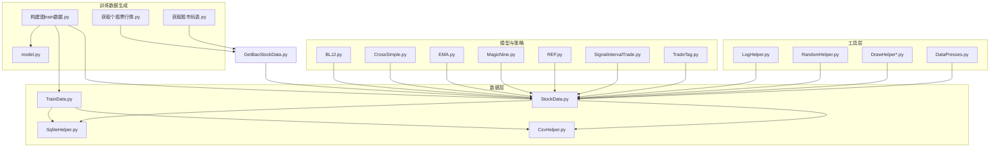
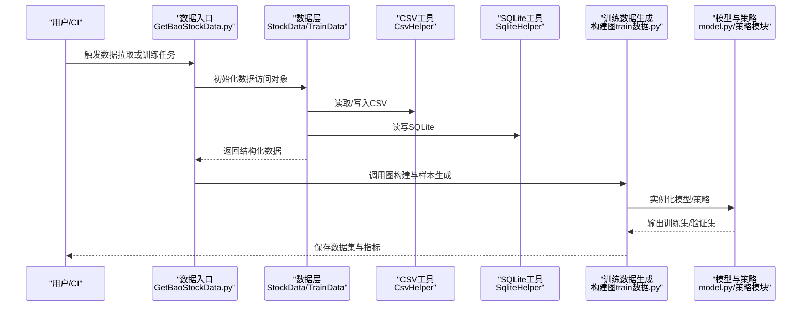
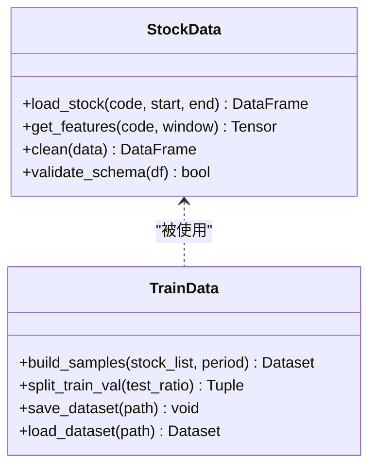
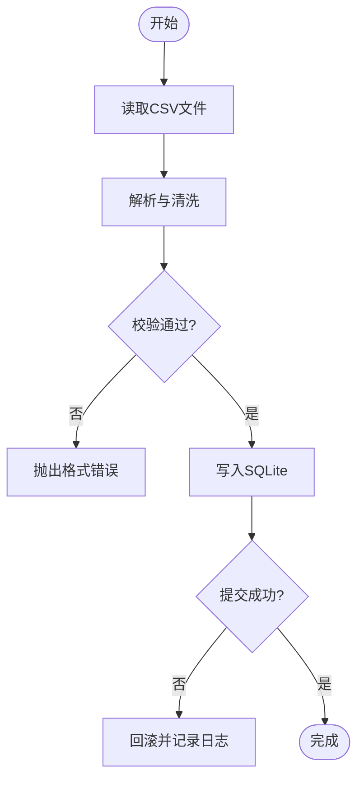
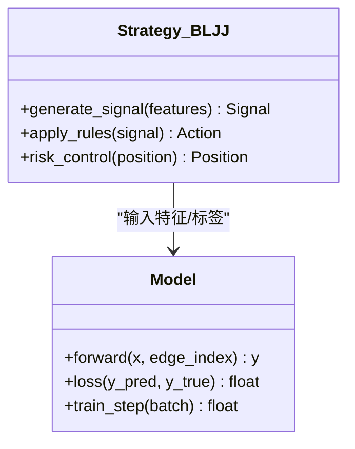
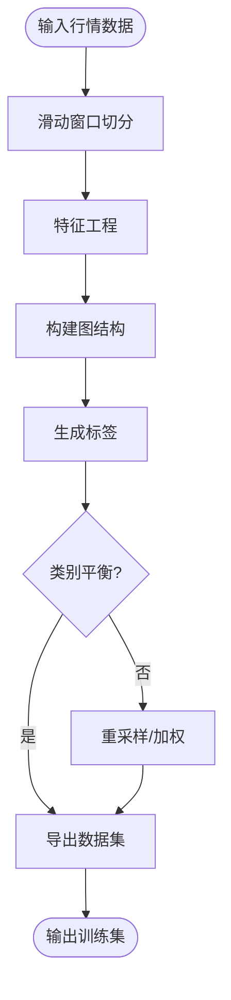
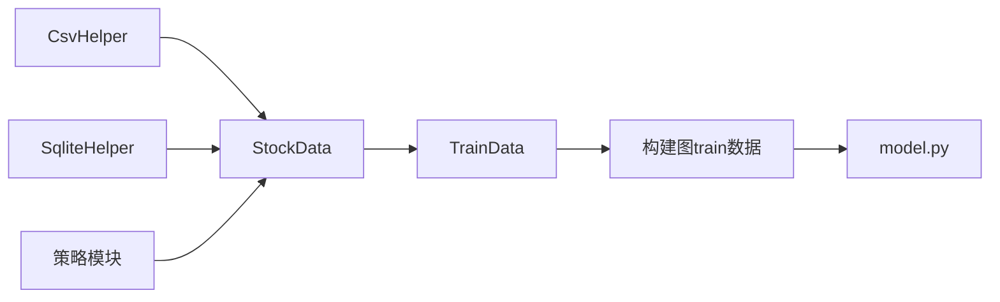

# 测试策略与实践

<cite>
**本文档中引用的文件**   
- [GetBaoStockData.py](file://GetBaoStockData.py)
- [MyProject/DataBase/StockData.py](file://MyProject/DataBase/StockData.py)
- [MyProject/DataBase/TrainData.py](file://MyProject/DataBase/TrainData.py)
- [MyProject/Helper/CsvHelper.py](file://MyProject/Helper/CsvHelper.py)
- [MyProject/Helper/SqliteHelper.py](file://MyProject/Helper/SqliteHelper.py)
- [MyProject/Model/Strategy/BLJJ.py](file://MyProject/Model/Strategy/BLJJ.py)
- [生成train数据/构建图train数据.py](file://生成train数据/构建图train数据.py)
- [生成train数据/model.py](file://生成train数据/model.py)
</cite>

## 目录
1. [简介](#简介)
2. [项目结构分析](#项目结构分析)
3. [核心组件](#核心组件)
4. [架构总览](#架构总览)
5. [详细组件分析](#详细组件分析)
6. [依赖关系分析](#依赖关系分析)
7. [性能与压力测试](#性能与压力测试)
8. [自动化测试流程与质量门禁](#自动化测试流程与质量门禁)
9. [故障排查指南](#故障排查指南)
10. [结论](#结论)
11. [附录：测试规范与覆盖率要求](#附录测试规范与覆盖率要求)

## 简介
本指南面向该GNN股票预测项目的测试体系建设，目标是建立分层清晰的测试策略（单元测试、集成测试、端到端测试），配套可执行的测试用例编写规范、Mock策略、性能与压力测试方法、自动化流水线与质量门禁，以及覆盖率目标与验收标准，确保代码质量与系统稳定性。

## 项目结构分析
从仓库结构可以看出，项目围绕“数据采集—数据处理—训练数据构建—模型与策略—可视化与工具”展开，主要模块包括：
- 数据层：数据库与CSV读写、SQLite辅助、行情数据获取
- 工具层：日志、随机数、绘图、数据压缩等通用工具
- 模型与策略层：节点分类实验脚本、交易信号与策略实现
- 训练数据生成：图结构构建、特征工程、数据集导出

图表来源
- [MyProject/DataBase/StockData.py:1-200](file://MyProject/DataBase/StockData.py#L1-L200)
- [MyProject/DataBase/TrainData.py:1-200](file://MyProject/DataBase/TrainData.py#L1-L200)
- [MyProject/Helper/CsvHelper.py:1-200](file://MyProject/Helper/CsvHelper.py#L1-L200)
- [MyProject/Helper/SqliteHelper.py:1-200](file://MyProject/Helper/SqliteHelper.py#L1-L200)
- [MyProject/Model/Strategy/BLJJ.py:1-200](file://MyProject/Model/Strategy/BLJJ.py#L1-L200)
- [生成train数据/构建图train数据.py:1-200](file://生成train数据/构建图train数据.py#L1-L200)
- [生成train数据/model.py:1-200](file://生成train数据/model.py#L1-L200)
- [GetBaoStockData.py:1-200](file://GetBaoStockData.py#L1-L200)

章节来源
- [MyProject/DataBase/StockData.py:1-200](file://MyProject/DataBase/StockData.py#L1-L200)
- [MyProject/DataBase/TrainData.py:1-200](file://MyProject/DataBase/TrainData.py#L1-L200)
- [MyProject/Helper/CsvHelper.py:1-200](file://MyProject/Helper/CsvHelper.py#L1-L200)
- [MyProject/Helper/SqliteHelper.py:1-200](file://MyProject/Helper/SqliteHelper.py#L1-L200)
- [MyProject/Model/Strategy/BLJJ.py:1-200](file://MyProject/Model/Strategy/BLJJ.py#L1-L200)
- [生成train数据/构建图train数据.py:1-200](file://生成train数据/构建图train数据.py#L1-L200)
- [生成train数据/model.py:1-200](file://生成train数据/model.py#L1-L200)
- [GetBaoStockData.py:1-200](file://GetBaoStockData.py#L1-L200)

## 核心组件
- 数据接入与持久化
  - StockData：封装股票数据的加载、清洗、索引与查询接口
  - TrainData：负责训练样本的构造、切分、缓存与导出
  - CsvHelper：CSV文件的读写、编码处理、列映射与批量导入
  - SqliteHelper：SQLite连接管理、事务、建表与CRUD操作
- 工具与支撑
  - LogHelper：统一日志输出与级别控制
  - RandomHelper：随机种子管理与可重复性保障
  - DrawHelper*：图表绘制与可视化辅助
  - DataPresses：数据压缩与存储优化
- 模型与策略
  - BLJJ、CrossSimple、EMA、MagicNine、REF、SignalIntervalTrade、TradeTag：各类技术指标与交易信号策略
- 训练数据生成
  - 构建图train数据：将时序行情转化为图结构样本，准备节点/边/标签
  - model.py：定义图模型结构与训练流程
  - 获取行情与码表：外部数据源对接

章节来源
- [MyProject/DataBase/StockData.py:1-200](file://MyProject/DataBase/StockData.py#L1-L200)
- [MyProject/DataBase/TrainData.py:1-200](file://MyProject/DataBase/TrainData.py#L1-L200)
- [MyProject/Helper/CsvHelper.py:1-200](file://MyProject/Helper/CsvHelper.py#L1-L200)
- [MyProject/Helper/SqliteHelper.py:1-200](file://MyProject/Helper/SqliteHelper.py#L1-L200)
- [MyProject/Model/Strategy/BLJJ.py:1-200](file://MyProject/Model/Strategy/BLJJ.py#L1-L200)
- [生成train数据/构建图train数据.py:1-200](file://生成train数据/构建图train数据.py#L1-L200)
- [生成train数据/model.py:1-200](file://生成train数据/model.py#1-L200)

## 架构总览
下图展示了从原始数据到训练样本与模型训练的主流程，以及测试在各层的落点。

图表来源
- [GetBaoStockData.py:1-200](file://GetBaoStockData.py#L1-L200)
- [MyProject/DataBase/StockData.py:1-200](file://MyProject/DataBase/StockData.py#L1-L200)
- [MyProject/DataBase/TrainData.py:1-200](file://MyProject/DataBase/TrainData.py#L1-L200)
- [MyProject/Helper/CsvHelper.py:1-200](file://MyProject/Helper/CsvHelper.py#L1-L200)
- [MyProject/Helper/SqliteHelper.py:1-200](file://MyProject/Helper/SqliteHelper.py#L1-L200)
- [生成train数据/构建图train数据.py:1-200](file://生成train数据/构建图train数据.py#L1-L200)
- [生成train数据/model.py:1-200](file://生成train数据/model.py#L1-L200)

## 详细组件分析

### 数据层：StockData与TrainData
- 职责边界
  - StockData：提供统一的行情数据访问接口，屏蔽底层存储差异（CSV/SQLite）
  - TrainData：负责训练样本构造、时间窗口划分、标签生成与缓存
- 关键测试点
  - 输入校验：日期范围、股票代码有效性、缺失值处理
  - 数据一致性：多源数据合并后的字段对齐与类型一致
  - 性能：批量读取、分页查询、内存占用
  - 可复现性：随机种子固定、数据版本化
- 推荐断言
  - 形状与类型：DataFrame/张量维度、dtype、空值比例
  - 业务规则：价格非负、时间单调递增、标签分布合理
  - 边界条件：单条记录、空集合、极端值、跨日切换

图表来源
- [MyProject/DataBase/StockData.py:1-200](file://MyProject/DataBase/StockData.py#L1-L200)
- [MyProject/DataBase/TrainData.py:1-200](file://MyProject/DataBase/TrainData.py#L1-L200)

章节来源
- [MyProject/DataBase/StockData.py:1-200](file://MyProject/DataBase/StockData.py#L1-L200)
- [MyProject/DataBase/TrainData.py:1-200](file://MyProject/DataBase/TrainData.py#L1-L200)

### 工具层：CsvHelper与SqliteHelper
- 职责边界
  - CsvHelper：CSV读写、编码处理、列映射、批量导入
  - SqliteHelper：连接池、事务、建表DDL、CRUD封装
- 关键测试点
  - 编码兼容：UTF-8/BOM、特殊字符
  - 大文件处理：流式读取、内存峰值控制
  - 事务回滚：异常时数据一致性
  - 并发安全：多线程读/写锁
- 推荐断言
  - 文件存在性与完整性校验
  - SQLite表结构与约束检查
  - 读写往返一致性

图表来源
- [MyProject/Helper/CsvHelper.py:1-200](file://MyProject/Helper/CsvHelper.py#L1-L200)
- [MyProject/Helper/SqliteHelper.py:1-200](file://MyProject/Helper/SqliteHelper.py#L1-L200)

章节来源
- [MyProject/Helper/CsvHelper.py:1-200](file://MyProject/Helper/CsvHelper.py#L1-L200)
- [MyProject/Helper/SqliteHelper.py:1-200](file://MyProject/Helper/SqliteHelper.py#L1-L200)

### 模型与策略：BLJJ与其他策略
- 职责边界
  - 策略模块：根据输入特征计算交易信号、买卖点、持仓状态
  - 模型模块：定义图网络结构、损失函数、训练循环
- 关键测试点
  - 数值稳定性：NaN/Inf处理、梯度爆炸检测
  - 策略逻辑：信号与标签的一致性、滑点与手续费模拟
  - 训练收敛：Loss下降、早停机制、过拟合检测
- 推荐断言
  - 信号序列合法（无未来信息泄露）
  - 损失曲线单调性或阈值判定
  - 权重更新方向正确

图表来源
- [MyProject/Model/Strategy/BLJJ.py:1-200](file://MyProject/Model/Strategy/BLJJ.py#L1-L200)
- [生成train数据/model.py:1-200](file://生成train数据/model.py#L1-L200)

章节来源
- [MyProject/Model/Strategy/BLJJ.py:1-200](file://MyProject/Model/Strategy/BLJJ.py#L1-L200)
- [生成train数据/model.py:1-200](file://生成train数据/model.py#L1-L200)

### 训练数据生成：构建图train数据
- 职责边界
  - 将时序行情转换为图结构样本，定义节点特征、边关系与标签
  - 支持多种窗口长度、采样策略与类别平衡
- 关键测试点
  - 图结构合法性：节点/边数量、连通性、自环处理
  - 标签合理性：正负样本比例、时间对齐
  - 数据版本：哈希校验、增量更新
- 推荐断言
  - 图的邻接矩阵对称性（如无向图）
  - 节点特征维度一致
  - 标签与特征时间戳一一对应

图表来源
- [生成train数据/构建图train数据.py:1-200](file://生成train数据/构建图train数据.py#L1-L200)

章节来源
- [生成train数据/构建图train数据.py:1-200](file://生成train数据/构建图train数据.py#L1-L200)

## 依赖关系分析
- 模块耦合
  - 数据层对工具层强依赖（CSV/SQLite）
  - 训练数据生成对数据层与模型/策略弱依赖（接口契约）
  - 策略模块对数据层提供特征输入
- 潜在风险
  - 外部数据源不稳定（行情接口限流/变更）
  - 大文件IO瓶颈
  - 随机性与版本不一致导致结果不可复现
- 解耦建议
  - 以接口隔离外部依赖（如数据源适配器）
  - 引入缓存与重试机制
  - 固定随机种子与数据版本哈希

图表来源
- [MyProject/Helper/CsvHelper.py:1-200](file://MyProject/Helper/CsvHelper.py#L1-L200)
- [MyProject/Helper/SqliteHelper.py:1-200](file://MyProject/Helper/SqliteHelper.py#L1-L200)
- [MyProject/DataBase/StockData.py:1-200](file://MyProject/DataBase/StockData.py#L1-L200)
- [MyProject/DataBase/TrainData.py:1-200](file://MyProject/DataBase/TrainData.py#L1-L200)
- [生成train数据/构建图train数据.py:1-200](file://生成train数据/构建图train数据.py#L1-L200)
- [生成train数据/model.py:1-200](file://生成train数据/model.py#L1-L200)
- [MyProject/Model/Strategy/BLJJ.py:1-200](file://MyProject/Model/Strategy/BLJJ.py#L1-L200)

章节来源
- [MyProject/Helper/CsvHelper.py:1-200](file://MyProject/Helper/CsvHelper.py#L1-L200)
- [MyProject/Helper/SqliteHelper.py:1-200](file://MyProject/Helper/SqliteHelper.py#L1-L200)
- [MyProject/DataBase/StockData.py:1-200](file://MyProject/DataBase/StockData.py#L1-L200)
- [MyProject/DataBase/TrainData.py:1-200](file://MyProject/DataBase/TrainData.py#L1-L200)
- [生成train数据/构建图train数据.py:1-200](file://生成train数据/构建图train数据.py#L1-L200)
- [生成train数据/model.py:1-200](file://生成train数据/model.py#L1-L200)
- [MyProject/Model/Strategy/BLJJ.py:1-200](file://MyProject/Model/Strategy/BLJJ.py#L1-L200)

## 性能与压力测试
- 性能测试目标
  - 数据读取吞吐：CSV/SQLite批量读取QPS与延迟
  - 内存峰值：大数据集构建时的内存占用上限
  - 训练耗时：单轮训练时间与GPU利用率
- 压力测试场景
  - 高并发数据拉取：模拟多进程/多线程并行请求
  - 大规模图构建：节点/边规模增长下的可扩展性
  - 长稳运行：长时间训练任务的稳定性与资源泄漏检测
- 实施方法
  - 使用基准测试框架（如pytest-benchmark）进行微基准
  - 使用JMeter/Locust模拟外部数据源压力
  - 使用内存分析工具（memory_profiler）定位热点
  - 使用分布式训练框架进行扩展性验证

[本节为通用指导，不直接分析具体文件]

## 自动化测试流程与质量门禁
- 测试分层与执行顺序
  - 单元测试：工具与数据层核心函数，快速反馈
  - 集成测试：数据层与训练数据生成链路，验证接口契约
  - 端到端测试：完整数据拉取—训练—评估流程，验证业务闭环
- CI/CD集成
  - 代码提交触发全量测试
  - 失败阻断合并（质量门禁）
  - 覆盖率报告与趋势监控
- 质量门禁指标
  - 单元测试通过率≥95%
  - 集成测试通过率≥90%
  - 端到端测试成功率≥85%
  - 代码覆盖率：语句覆盖≥80%，分支覆盖≥70%
  - 性能回归：关键路径耗时不超过基线+10%

[本节为通用指导，不直接分析具体文件]

## 故障排查指南
- 常见问题定位
  - 数据异常：缺失值、乱码、时间戳错位
  - 模型不收敛：学习率过大、标签噪声、特征尺度不一
  - 资源不足：OOM、磁盘空间不足、GPU显存溢出
- 诊断手段
  - 启用详细日志与Traceback
  - 快照保存中间结果（数据批次、图结构、模型权重）
  - 最小复现实例（缩小数据规模与模型复杂度）
- 恢复策略
  - 数据回滚与版本切换
  - 自动重试与熔断
  - 降级模式（跳过非关键步骤）

[本节为通用指导，不直接分析具体文件]

## 结论
通过分层测试体系、严格的用例规范、完善的Mock与数据准备策略、性能与压力测试、以及自动化质量门禁，可显著提升GNN股票预测项目的代码质量与稳定性。建议在迭代过程中持续完善测试资产与监控指标，形成质量闭环。

[本节为总结性内容，不直接分析具体文件]

## 附录：测试规范与覆盖率要求
- 测试用例编写规范
  - 命名：test_<模块>_<功能>_<场景>
  - 数据准备：固定随机种子、使用小样本与典型边界值
  - 断言方法：精确断言（相等/包含）、近似断言（allclose）、统计断言（分布检验）
  - Mock对象：隔离外部依赖（数据源、文件系统、数据库）
- 覆盖率要求
  - 语句覆盖≥80%
  - 分支覆盖≥70%
  - 关键路径（数据读取、图构建、训练循环）≥90%
- 示例清单（按模块）
  - 数据层：StockData.validate_schema、TrainData.split_train_val
  - 工具层：CsvHelper.read_csv、SqliteHelper.execute_transaction
  - 模型与策略：Strategy.generate_signal、Model.train_step
  - 训练数据生成：GraphBuilder.build_graph、LabelGenerator.create_labels

[本节为通用指导，不直接分析具体文件]