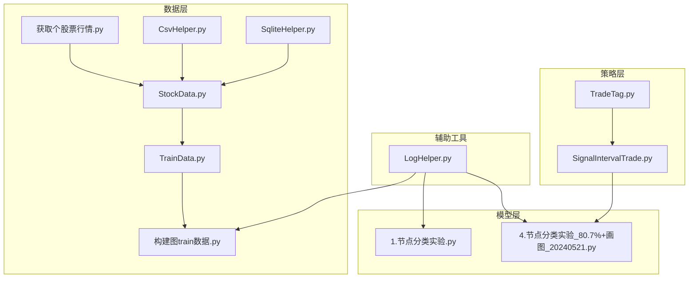
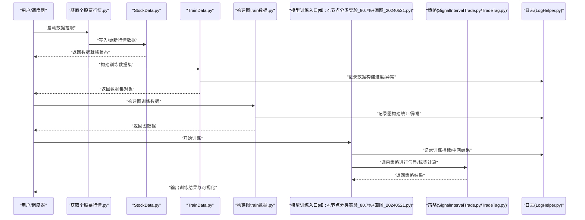
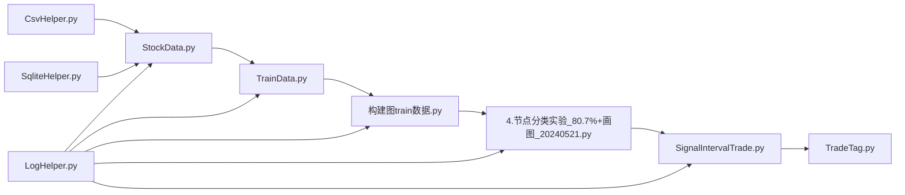

# 调试与故障排除

<cite>
**本文引用的文件**   
- [LogHelper.py](file://MyProject/Helper/LogHelper.py)
- [CsvHelper.py](file://MyProject/Helper/CsvHelper.py)
- [SqliteHelper.py](file://MyProject/Helper/SqliteHelper.py)
- [StockData.py](file://MyProject/DataBase/StockData.py)
- [TrainData.py](file://MyProject/DataBase/TrainData.py)
- [构建图train数据.py](file://MyProject/DataBase/构建图train数据.py)
- [1.节点分类实验.py](file://MyProject/Model/1.节点分类实验.py)
- [4.节点分类实验_80.7%+画图_20240521.py](file://MyProject/Model/4.节点分类实验_80.7%+画图_20240521.py)
- [SignalIntervalTrade.py](file://MyProject/Model/Strategy/SignalIntervalTrade.py)
- [TradeTag.py](file://MyProject/Model/Strategy/TradeTag.py)
- [获取个股票行情.py](file://生成train数据/获取个股票行情.py)
- [do.py](file://生成train数据/do.py)
</cite>

## 目录
1. [简介](#简介)
2. [项目结构](#项目结构)
3. [核心组件](#核心组件)
4. [架构总览](#架构总览)
5. [详细组件分析](#详细组件分析)
6. [依赖关系分析](#依赖关系分析)
7. [性能考虑](#性能考虑)
8. [故障排除指南](#故障排除指南)
9. [结论](#结论)
10. [附录](#附录)

## 简介
本指南面向本项目（基于PyTorch Geometric的图神经网络交易策略研究）的开发者与维护者，提供系统化的调试与故障排除方法。内容覆盖：
- 常用调试工具与技巧：日志记录、断点调试、性能分析
- 常见问题诊断与解决方案：数据问题、模型训练问题、策略执行问题
- 错误码对照表与异常处理最佳实践
- 远程调试与生产环境监控配置建议
- 问题上报与解决的标准流程

## 项目结构
本项目采用按功能分层组织的方式：
- 数据层：数据库与CSV读写、行情数据获取、训练数据构建
- 模型层：节点分类实验脚本、可视化辅助
- 策略层：交易信号与标签生成等策略实现
- 辅助工具：日志、绘图、随机数、SQLite/CSV操作等

图表来源
- [StockData.py](file://MyProject/DataBase/StockData.py)
- [TrainData.py](file://MyProject/DataBase/TrainData.py)
- [构建图train数据.py](file://MyProject/DataBase/构建图train数据.py)
- [CsvHelper.py](file://MyProject/Helper/CsvHelper.py)
- [SqliteHelper.py](file://MyProject/Helper/SqliteHelper.py)
- [1.节点分类实验.py](file://MyProject/Model/1.节点分类实验.py)
- [4.节点分类实验_80.7%+画图_20240521.py](file://MyProject/Model/4.节点分类实验_80.7%+画图_20240521.py)
- [SignalIntervalTrade.py](file://MyProject/Model/Strategy/SignalIntervalTrade.py)
- [TradeTag.py](file://MyProject/Model/Strategy/TradeTag.py)
- [获取个股票行情.py](file://生成train数据/获取个股票行情.py)
- [LogHelper.py](file://MyProject/Helper/LogHelper.py)

章节来源
- [LogHelper.py](file://MyProject/Helper/LogHelper.py)
- [CsvHelper.py](file://MyProject/Helper/CsvHelper.py)
- [SqliteHelper.py](file://MyProject/Helper/SqliteHelper.py)
- [StockData.py](file://MyProject/DataBase/StockData.py)
- [TrainData.py](file://MyProject/DataBase/TrainData.py)
- [构建图train数据.py](file://MyProject/DataBase/构建图train数据.py)
- [1.节点分类实验.py](file://MyProject/Model/1.节点分类实验.py)
- [4.节点分类实验_80.7%+画图_20240521.py](file://MyProject/Model/4.节点分类实验_80.7%+画图_20240521.py)
- [SignalIntervalTrade.py](file://MyProject/Model/Strategy/SignalIntervalTrade.py)
- [TradeTag.py](file://MyProject/Model/Strategy/TradeTag.py)
- [获取个股票行情.py](file://生成train数据/获取个股票行情.py)

## 核心组件
- 日志模块：统一日志输出、分级控制、文件/控制台双写，便于定位问题与审计
- 数据读取与存储：CSV与SQLite读写封装，保障数据一致性、容错与可重复性
- 数据准备流水线：从原始行情到训练图的构建，包含清洗、对齐、特征构造
- 模型训练入口：节点分类实验脚本，负责加载数据、定义模型、训练与评估、可视化
- 策略模块：交易信号与标签生成，用于回测与评估

章节来源
- [LogHelper.py](file://MyProject/Helper/LogHelper.py)
- [CsvHelper.py](file://MyProject/Helper/CsvHelper.py)
- [SqliteHelper.py](file://MyProject/Helper/SqliteHelper.py)
- [构建图train数据.py](file://MyProject/DataBase/构建图train数据.py)
- [1.节点分类实验.py](file://MyProject/Model/1.节点分类实验.py)
- [4.节点分类实验_80.7%+画图_20240521.py](file://MyProject/Model/4.节点分类实验_80.7%+画图_20240521.py)
- [SignalIntervalTrade.py](file://MyProject/Model/Strategy/SignalIntervalTrade.py)
- [TradeTag.py](file://MyProject/Model/Strategy/TradeTag.py)

## 架构总览
下图展示从数据获取到训练与策略执行的端到端流程，以及关键日志与异常落点。

图表来源
- [获取个股票行情.py](file://生成train数据/获取个股票行情.py)
- [StockData.py](file://MyProject/DataBase/StockData.py)
- [TrainData.py](file://MyProject/DataBase/TrainData.py)
- [构建图train数据.py](file://MyProject/DataBase/构建图train数据.py)
- [4.节点分类实验_80.7%+画图_20240521.py](file://MyProject/Model/4.节点分类实验_80.7%+画图_20240521.py)
- [SignalIntervalTrade.py](file://MyProject/Model/Strategy/SignalIntervalTrade.py)
- [TradeTag.py](file://MyProject/Model/Strategy/TradeTag.py)
- [LogHelper.py](file://MyProject/Helper/LogHelper.py)

## 详细组件分析

### 日志与异常处理（LogHelper）
- 职责：统一日志级别、格式化输出、文件与控制台双写；在关键路径埋点，便于追踪数据、训练与策略执行过程
- 建议用法：
  - 在数据IO、模型训练循环、策略计算的关键分支处记录INFO/WARNING/ERROR
  - 对异常捕获后追加上下文信息（时间、批次、样本ID、参数快照）
  - 使用结构化字段（如任务名、阶段、耗时）便于后续聚合分析

章节来源
- [LogHelper.py](file://MyProject/Helper/LogHelper.py)

### 数据访问封装（CsvHelper / SqliteHelper）
- 职责：封装CSV与SQLite的读写、事务、重试与错误恢复；保证数据一致性与幂等
- 常见风险与对策：
  - 并发写入冲突：加锁或串行化写入；失败重试与退避
  - 数据类型不一致：严格校验与转换；缺失值填充策略
  - 大文件I/O瓶颈：分块读写、缓冲优化、索引设计

章节来源
- [CsvHelper.py](file://MyProject/Helper/CsvHelper.py)
- [SqliteHelper.py](file://MyProject/Helper/SqliteHelper.py)

### 数据准备流水线（StockData / TrainData / 构建图train数据）
- 职责：从原始行情到训练集再到图数据的完整流水线；包括清洗、对齐、特征工程、图构建
- 关键检查点：
  - 时间戳对齐与缺失值处理
  - 特征维度一致性与数值范围检查
  - 图结构与标签的一致性校验
- 建议：
  - 在每个阶段输出统计摘要与分布直方图
  - 将中间产物持久化并附带版本标记，便于回溯

章节来源
- [StockData.py](file://MyProject/DataBase/StockData.py)
- [TrainData.py](file://MyProject/DataBase/TrainData.py)
- [构建图train数据.py](file://MyProject/DataBase/构建图train数据.py)

### 模型训练入口（节点分类实验脚本）
- 职责：加载数据、定义模型、训练循环、验证与测试、可视化输出
- 调试要点：
  - 学习率、批大小、梯度裁剪、早停策略的参数敏感性
  - 损失曲线与指标收敛性检查
  - 过拟合/欠拟合的诊断（训练/验证差距、正则化强度）
- 建议：
  - 在每轮/每步记录关键指标与超参快照
  - 保存最佳模型权重与对应配置

章节来源
- [1.节点分类实验.py](file://MyProject/Model/1.节点分类实验.py)
- [4.节点分类实验_80.7%+画图_20240521.py](file://MyProject/Model/4.节点分类实验_80.7%+画图_20240521.py)

### 策略模块（SignalIntervalTrade / TradeTag）
- 职责：根据模型预测或规则生成交易信号与标签，支撑回测与评估
- 调试要点：
  - 信号触发条件与时序逻辑正确性
  - 标签定义与未来函数规避
  - 边界条件（停牌、涨跌停、滑点）处理
- 建议：
  - 为每个策略增加单元测试与回归用例
  - 输出策略执行明细日志（入场/出场、持仓、盈亏）

章节来源
- [SignalIntervalTrade.py](file://MyProject/Model/Strategy/SignalIntervalTrade.py)
- [TradeTag.py](file://MyProject/Model/Strategy/TradeTag.py)

## 依赖关系分析
- 数据层依赖CSV/SQLite封装，向上提供标准化数据集与图数据
- 模型层依赖数据层与策略层，产出预测与评估结果
- 策略层依赖模型输出与历史数据，生成交易信号与标签
- 日志贯穿全链路，作为统一的观测面

图表来源
- [CsvHelper.py](file://MyProject/Helper/CsvHelper.py)
- [SqliteHelper.py](file://MyProject/Helper/SqliteHelper.py)
- [StockData.py](file://MyProject/DataBase/StockData.py)
- [TrainData.py](file://MyProject/DataBase/TrainData.py)
- [构建图train数据.py](file://MyProject/DataBase/构建图train数据.py)
- [4.节点分类实验_80.7%+画图_20240521.py](file://MyProject/Model/4.节点分类实验_80.7%+画图_20240521.py)
- [SignalIntervalTrade.py](file://MyProject/Model/Strategy/SignalIntervalTrade.py)
- [TradeTag.py](file://MyProject/Model/Strategy/TradeTag.py)
- [LogHelper.py](file://MyProject/Helper/LogHelper.py)

## 性能考虑
- I/O优化
  - 批量读写与流式处理，避免一次性加载超大文件
  - SQLite索引设计与查询优化，减少全表扫描
- 计算优化
  - 合理设置批大小与并行度，平衡内存与吞吐
  - 使用混合精度与梯度累积提升训练效率
- 监控与剖析
  - 使用性能剖析工具定位热点（CPU/GPU利用率、内存峰值）
  - 记录关键路径耗时，建立基线并持续对比

[本节为通用指导，不直接分析具体文件]

## 故障排除指南

### 数据问题
- 症状
  - 数据缺失、时间戳错位、列名不一致、类型错误
  - 图结构异常（节点/边数量不匹配、孤立节点过多）
- 排查步骤
  - 使用CSV/SQLite封装的校验接口检查完整性与一致性
  - 打印各阶段统计摘要与分布，定位异常区间
  - 复现实验时固定随机种子与数据版本
- 解决方案
  - 缺失值填充与异常值截断
  - 时间对齐与去重
  - 图构建前进行连通性与自环检查

章节来源
- [CsvHelper.py](file://MyProject/Helper/CsvHelper.py)
- [SqliteHelper.py](file://MyProject/Helper/SqliteHelper.py)
- [StockData.py](file://MyProject/DataBase/StockData.py)
- [TrainData.py](file://MyProject/DataBase/TrainData.py)
- [构建图train数据.py](file://MyProject/DataBase/构建图train数据.py)

### 模型训练问题
- 症状
  - 损失不降、震荡、NaN/Inf、过拟合/欠拟合、显存溢出
- 排查步骤
  - 检查学习率、批大小、梯度裁剪与归一化
  - 观察训练/验证曲线差异，调整正则化与早停
  - 启用梯度与激活值检查，定位爆炸/消失
- 解决方案
  - 降低学习率、增大批大小或使用梯度累积
  - 添加Dropout/L2正则，增强数据增强
  - 使用混合精度与更高效的优化器

章节来源
- [1.节点分类实验.py](file://MyProject/Model/1.节点分类实验.py)
- [4.节点分类实验_80.7%+画图_20240521.py](file://MyProject/Model/4.节点分类实验_80.7%+画图_20240521.py)

### 策略执行问题
- 症状
  - 信号频繁反转、未来函数嫌疑、回测收益异常
- 排查步骤
  - 核对信号触发条件与时间窗口
  - 确认标签定义不包含未来信息
  - 检查滑点、手续费、涨跌停限制等约束
- 解决方案
  - 引入延迟机制与过滤条件
  - 完善边界条件与风控规则
  - 增加策略单元测试与回归测试

章节来源
- [SignalIntervalTrade.py](file://MyProject/Model/Strategy/SignalIntervalTrade.py)
- [TradeTag.py](file://MyProject/Model/Strategy/TradeTag.py)

### 错误码对照表（示例）
说明：以下为建议的错误码规范，便于统一上报与检索。实际使用时请在各模块中定义并映射至日志与告警系统。

- D001 数据源不可达：外部数据服务连接失败或超时
- D002 数据格式错误：列缺失、类型不匹配、编码异常
- D003 数据不完整：时间序列断裂、关键指标缺失
- D004 数据一致性校验失败：主键冲突、重复记录
- D005 图构建失败：节点/边不匹配、非法拓扑
- T001 训练初始化失败：模型/数据加载异常
- T002 训练发散：损失NaN/Inf或梯度爆炸
- T003 训练资源不足：显存/内存溢出
- T004 训练中断：外部中断或早停触发
- S001 策略参数非法：阈值越界、周期不合法
- S002 信号逻辑错误：时序依赖违规、未来函数
- S003 执行异常：下单失败、滑点超限
- L001 日志写入失败：磁盘空间不足或权限问题
- L002 监控上报失败：网络异常或认证失败

[本节为通用规范，不直接分析具体文件]

### 异常处理最佳实践
- 明确异常层次：输入校验异常、业务异常、系统异常
- 捕获即记录：所有异常均记录上下文（时间、请求ID、参数快照）
- 幂等与重试：对外部依赖加重试与退避，确保可恢复
- 降级与熔断：关键路径失败时快速失败并返回安全默认值
- 可观测性：异常关联指标与追踪ID，便于跨系统排障

章节来源
- [LogHelper.py](file://MyProject/Helper/LogHelper.py)

### 远程调试与生产监控
- 远程调试
  - 本地IDE附加进程调试（Python内置调试器或第三方扩展）
  - 通过环境变量开启详细日志与调试开关
  - 使用断点与变量监视定位复杂逻辑
- 生产监控
  - 指标采集：训练损失、准确率、GPU/CPU/内存占用、I/O吞吐
  - 日志聚合：集中收集与分析，支持关键词检索与告警
  - 健康检查：数据就绪、模型可用、策略运行状态探针
  - 告警策略：阈值告警与趋势异常检测

[本节为通用指导，不直接分析具体文件]

### 问题上报与解决标准流程
- 发现与定级：依据影响范围与严重性划分P0-P3
- 信息收集：日志、指标、快照、复现步骤、环境信息
- 根因分析：分层定位（数据/模型/策略/基础设施）
- 修复与验证：最小改动原则，回归测试与灰度发布
- 复盘与沉淀：更新文档、补充监控与防护、知识库归档

[本节为通用流程，不直接分析具体文件]

## 结论
通过统一的日志与异常处理、完善的监控与剖析手段、标准化的问题上报流程，可以显著提升本项目的可维护性与稳定性。建议在数据、训练、策略三大环节分别建立检查清单与自动化测试，结合性能优化与容量规划，确保系统在开发与生产环境中均可高效稳定运行。

## 附录

### 常用调试工具与技巧
- 日志记录：分级输出、结构化字段、异步落盘
- 断点调试：条件断点、表达式求值、线程/协程切换
- 性能分析：火焰图、热点函数定位、内存泄漏检测
- 数据验证：Schema校验、分布对比、抽样回放

[本节为通用指导，不直接分析具体文件]

### 参考入口与脚本
- 数据拉取与入库：[获取个股票行情.py](file://生成train数据/获取个股票行情.py)
- 数据构建与图构建：[构建图train数据.py](file://MyProject/DataBase/构建图train数据.py)
- 训练入口与可视化：[4.节点分类实验_80.7%+画图_20240521.py](file://MyProject/Model/4.节点分类实验_80.7%+画图_20240521.py)
- 策略实现：[SignalIntervalTrade.py](file://MyProject/Model/Strategy/SignalIntervalTrade.py)、[TradeTag.py](file://MyProject/Model/Strategy/TradeTag.py)
- 辅助工具：[LogHelper.py](file://MyProject/Helper/LogHelper.py)、[CsvHelper.py](file://MyProject/Helper/CsvHelper.py)、[SqliteHelper.py](file://MyProject/Helper/SqliteHelper.py)