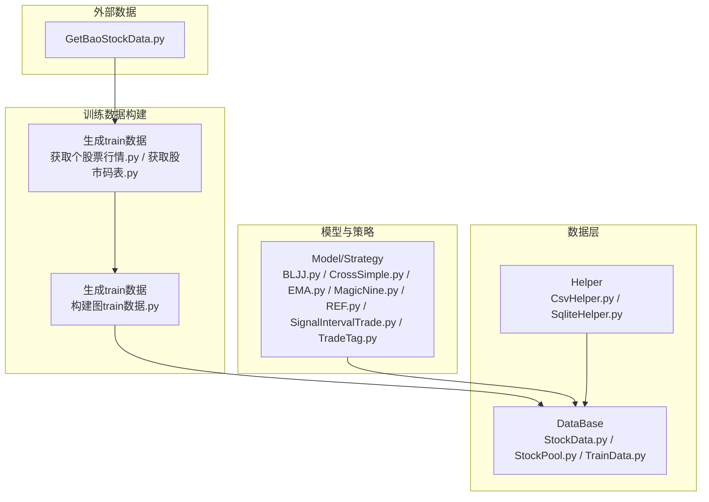
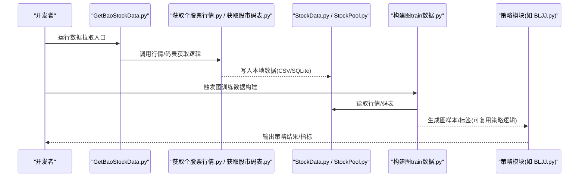
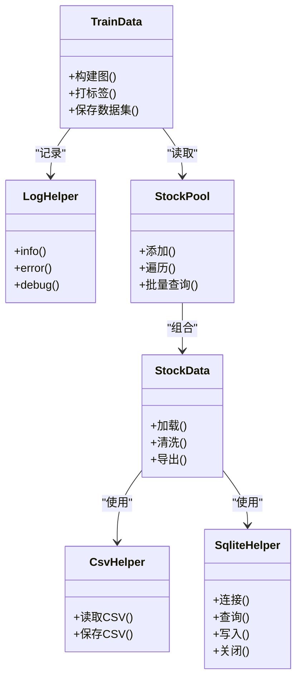
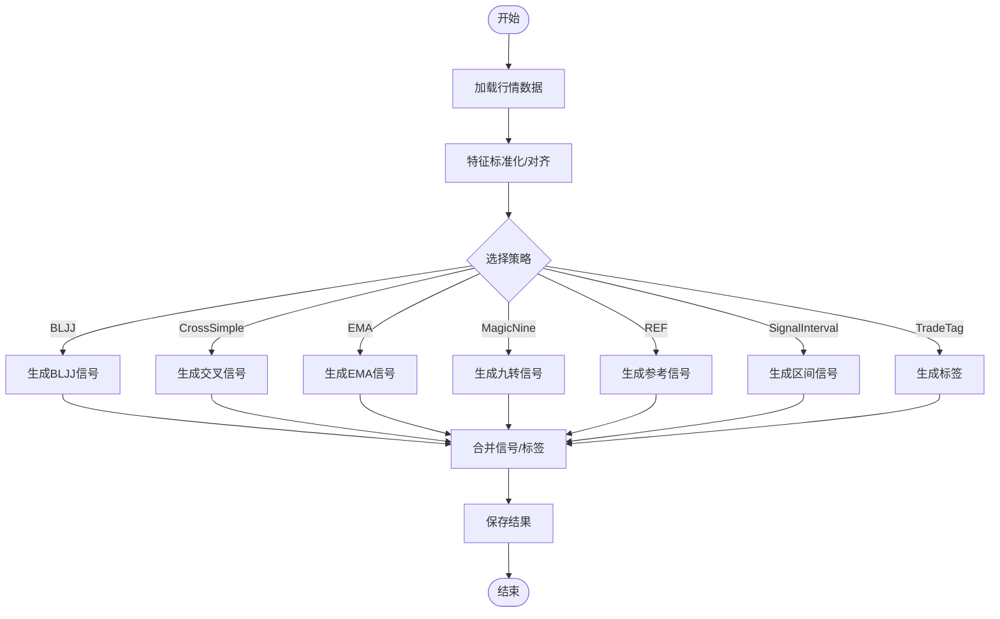
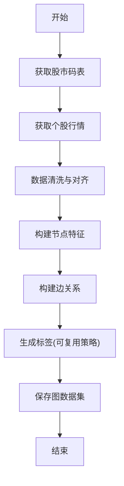
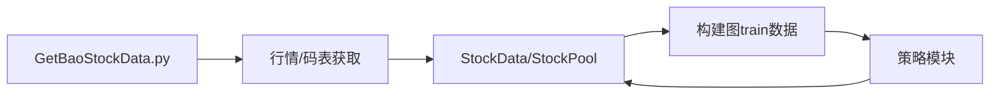

# 开发工作流程

<cite>
**本文引用的文件**   
- [MyProject/DataBase/StockData.py](file://MyProject/DataBase/StockData.py)
- [MyProject/DataBase/StockPool.py](file://MyProject/DataBase/StockPool.py)
- [MyProject/DataBase/TrainData.py](file://MyProject/DataBase/TrainData.py)
- [MyProject/Helper/CsvHelper.py](file://MyProject/Helper/CsvHelper.py)
- [MyProject/Helper/LogHelper.py](file://MyProject/Helper/LogHelper.py)
- [MyProject/Helper/SqliteHelper.py](file://MyProject/Helper/SqliteHelper.py)
- [MyProject/Model/Strategy/BLJJ.py](file://MyProject/Model/Strategy/BLJJ.py)
- [MyProject/Model/Strategy/CrossSimple.py](file://MyProject/Model/Strategy/CrossSimple.py)
- [MyProject/Model/Strategy/EMA.py](file://MyProject/Model/Strategy/EMA.py)
- [MyProject/Model/Strategy/MagicNine.py](file://MyProject/Model/Strategy/MagicNine.py)
- [MyProject/Model/Strategy/REF.py](file://MyProject/Model/Strategy/REF.py)
- [MyProject/Model/Strategy/SignalIntervalTrade.py](file://MyProject/Model/Strategy/Strategy/SignalIntervalTrade.py)
- [MyProject/Model/Strategy/TradeTag.py](file://MyProject/Model/Strategy/TradeTag.py)
- [生成train数据/构建图train数据.py](file://生成train数据/构建图train数据.py)
- [生成train数据/获取个股票行情.py](file://生成train数据/获取个股票行情.py)
- [生成train数据/获取股市码表.py](file://生成train数据/获取股市码表.py)
- [GetBaoStockData.py](file://GetBaoStockData.py)
</cite>

## 目录
1. [简介](#简介)
2. [项目结构](#项目结构)
3. [核心组件](#核心组件)
4. [架构总览](#架构总览)
5. [详细组件分析](#详细组件分析)
6. [依赖分析](#依赖分析)
7. [性能考虑](#性能考虑)
8. [故障排查指南](#故障排查指南)
9. [结论](#结论)
10. [附录](#附录)

## 简介
本指南面向本项目（基于PyTorch Geometric的图神经网络与量化策略研究）的开发人员，提供从需求分析、技术设计到实现与测试的完整工作流说明；定义Git分支与提交规范、代码审查流程、开发环境搭建、调试技巧、持续集成与自动化测试执行流程。文档同时结合仓库现有模块，给出与代码结构对应的可视化图示，帮助快速上手与协作。

## 项目结构
仓库采用按功能域划分的目录组织方式：
- MyProject/DataBase：数据存取与训练数据准备相关脚本
- MyProject/Helper：通用工具库（CSV、日志、SQLite等）
- MyProject/Model/Strategy：交易信号与标签策略实现
- 生成train数据：图训练数据构建与行情/码表获取脚本
- GetBaoStockData.py：外部数据源对接入口

图表来源
- [MyProject/DataBase/StockData.py](file://MyProject/DataBase/StockData.py)
- [MyProject/DataBase/StockPool.py](file://MyProject/DataBase/StockPool.py)
- [MyProject/DataBase/TrainData.py](file://MyProject/DataBase/TrainData.py)
- [MyProject/Helper/CsvHelper.py](file://MyProject/Helper/CsvHelper.py)
- [MyProject/Helper/SqliteHelper.py](file://MyProject/Helper/SqliteHelper.py)
- [MyProject/Model/Strategy/BLJJ.py](file://MyProject/Model/Strategy/BLJJ.py)
- [MyProject/Model/Strategy/CrossSimple.py](file://MyProject/Model/Strategy/CrossSimple.py)
- [MyProject/Model/Strategy/EMA.py](file://MyProject/Model/Strategy/EMA.py)
- [MyProject/Model/Strategy/MagicNine.py](file://MyProject/Model/Strategy/MagicNine.py)
- [MyProject/Model/Strategy/REF.py](file://MyProject/Model/Strategy/REF.py)
- [MyProject/Model/Strategy/SignalIntervalTrade.py](file://MyProject/Model/Strategy/Strategy/SignalIntervalTrade.py)
- [MyProject/Model/Strategy/TradeTag.py](file://MyProject/Model/Strategy/TradeTag.py)
- [生成train数据/构建图train数据.py](file://生成train数据/构建图train数据.py)
- [生成train数据/获取个股票行情.py](file://生成train数据/获取个股票行情.py)
- [生成train数据/获取股市码表.py](file://生成train数据/获取股市码表.py)
- [GetBaoStockData.py](file://GetBaoStockData.py)

章节来源
- [MyProject/DataBase/StockData.py](file://MyProject/DataBase/StockData.py)
- [MyProject/DataBase/StockPool.py](file://MyProject/DataBase/StockPool.py)
- [MyProject/DataBase/TrainData.py](file://MyProject/DataBase/TrainData.py)
- [MyProject/Helper/CsvHelper.py](file://MyProject/Helper/CsvHelper.py)
- [MyProject/Helper/SqliteHelper.py](file://MyProject/Helper/SqliteHelper.py)
- [MyProject/Model/Strategy/BLJJ.py](file://MyProject/Model/Strategy/BLJJ.py)
- [MyProject/Model/Strategy/CrossSimple.py](file://MyProject/Model/Strategy/CrossSimple.py)
- [MyProject/Model/Strategy/EMA.py](file://MyProject/Model/Strategy/EMA.py)
- [MyProject/Model/Strategy/MagicNine.py](file://MyProject/Model/Strategy/MagicNine.py)
- [MyProject/Model/Strategy/REF.py](file://MyProject/Model/Strategy/REF.py)
- [MyProject/Model/Strategy/SignalIntervalTrade.py](file://MyProject/Model/Strategy/Strategy/SignalIntervalTrade.py)
- [MyProject/Model/Strategy/TradeTag.py](file://MyProject/Model/Strategy/TradeTag.py)
- [生成train数据/构建图train数据.py](file://生成train数据/构建图train数据.py)
- [生成train数据/获取个股票行情.py](file://生成train数据/获取个股票行情.py)
- [生成train数据/获取股市码表.py](file://生成train数据/获取股市码表.py)
- [GetBaoStockData.py](file://GetBaoStockData.py)

## 核心组件
- 数据层
  - 股票基础数据与池管理：用于存储与查询标的列表及行情数据
  - 训练数据构造：将原始行情转换为GNN可用的图结构或节点特征
- 工具层
  - CSV读写封装：统一数据导入导出接口
  - SQLite封装：轻量本地数据库访问
  - 日志记录：结构化输出便于追踪
- 策略层
  - 多类交易信号与标签策略：如均线交叉、MACD、布林带、区间信号等
- 数据构建管线
  - 行情与码表获取：对接外部数据源
  - 图训练数据构建：将时序行情聚合为图样本

章节来源
- [MyProject/DataBase/StockData.py](file://MyProject/DataBase/StockData.py)
- [MyProject/DataBase/StockPool.py](file://MyProject/DataBase/StockPool.py)
- [MyProject/DataBase/TrainData.py](file://MyProject/DataBase/TrainData.py)
- [MyProject/Helper/CsvHelper.py](file://MyProject/Helper/CsvHelper.py)
- [MyProject/Helper/SqliteHelper.py](file://MyProject/Helper/SqliteHelper.py)
- [MyProject/Helper/LogHelper.py](file://MyProject/Helper/LogHelper.py)
- [MyProject/Model/Strategy/BLJJ.py](file://MyProject/Model/Strategy/BLJJ.py)
- [MyProject/Model/Strategy/CrossSimple.py](file://MyProject/Model/Strategy/CrossSimple.py)
- [MyProject/Model/Model/Strategy/EMA.py](file://MyProject/Model/Strategy/EMA.py)
- [MyProject/Model/Strategy/MagicNine.py](file://MyProject/Model/Strategy/MagicNine.py)
- [MyProject/Model/Strategy/REF.py](file://MyProject/Model/Strategy/REF.py)
- [MyProject/Model/Strategy/SignalIntervalTrade.py](file://MyProject/Model/Strategy/Strategy/SignalIntervalTrade.py)
- [MyProject/Model/Strategy/TradeTag.py](file://MyProject/Model/Strategy/TradeTag.py)
- [生成train数据/构建图train数据.py](file://生成train数据/构建图train数据.py)
- [生成train数据/获取个股票行情.py](file://生成train数据/获取个股票行情.py)
- [生成train数据/获取股市码表.py](file://生成train数据/获取股市码表.py)
- [GetBaoStockData.py](file://GetBaoStockData.py)

## 架构总览
下图展示了“外部数据 -> 数据获取 -> 数据入库 -> 训练数据构建 -> 策略/模型”的整体数据流与控制流。

图表来源
- [GetBaoStockData.py](file://GetBaoStockData.py)
- [生成train数据/获取个股票行情.py](file://生成train数据/获取个股票行情.py)
- [生成train数据/获取股市码表.py](file://生成train数据/获取股市码表.py)
- [MyProject/DataBase/StockData.py](file://MyProject/DataBase/StockData.py)
- [MyProject/DataBase/StockPool.py](file://MyProject/DataBase/StockPool.py)
- [生成train数据/构建图train数据.py](file://生成train数据/构建图train数据.py)
- [MyProject/Model/Strategy/BLJJ.py](file://MyProject/Model/Strategy/BLJJ.py)

## 详细组件分析

### 数据层组件分析
- 职责边界
  - StockData.py：负责单只股票数据的加载、清洗与基本统计
  - StockPool.py：维护股票池与批量数据访问
  - TrainData.py：将时序数据转换为GNN训练所需的图结构或张量格式
- 关键交互
  - 通过CsvHelper.py进行CSV读写
  - 通过SqliteHelper.py进行SQLite存取
  - 通过LogHelper.py记录关键步骤与异常

图表来源
- [MyProject/Helper/CsvHelper.py](file://MyProject/Helper/CsvHelper.py)
- [MyProject/Helper/SqliteHelper.py](file://MyProject/Helper/SqliteHelper.py)
- [MyProject/Helper/LogHelper.py](file://MyProject/Helper/LogHelper.py)
- [MyProject/DataBase/StockData.py](file://MyProject/DataBase/StockData.py)
- [MyProject/DataBase/StockPool.py](file://MyProject/DataBase/StockPool.py)
- [MyProject/DataBase/TrainData.py](file://MyProject/DataBase/TrainData.py)

章节来源
- [MyProject/DataBase/StockData.py](file://MyProject/DataBase/StockData.py)
- [MyProject/DataBase/StockPool.py](file://MyProject/DataBase/StockPool.py)
- [MyProject/DataBase/TrainData.py](file://MyProject/DataBase/TrainData.py)
- [MyProject/Helper/CsvHelper.py](file://MyProject/Helper/CsvHelper.py)
- [MyProject/Helper/SqliteHelper.py](file://MyProject/Helper/SqliteHelper.py)
- [MyProject/Helper/LogHelper.py](file://MyProject/Helper/LogHelper.py)

### 策略层组件分析
- 策略清单
  - BLJJ.py、CrossSimple.py、EMA.py、MagicNine.py、REF.py、SignalIntervalTrade.py、TradeTag.py
- 设计要点
  - 每个策略以独立模块暴露统一的信号/标签计算接口
  - 输入通常为标准化后的行情序列，输出为交易信号或标签
  - 可与训练数据构建流程解耦，便于回测与离线评估

图表来源
- [MyProject/Model/Strategy/BLJJ.py](file://MyProject/Model/Strategy/BLJJ.py)
- [MyProject/Model/Strategy/CrossSimple.py](file://MyProject/Model/Strategy/CrossSimple.py)
- [MyProject/Model/Strategy/EMA.py](file://MyProject/Model/Strategy/EMA.py)
- [MyProject/Model/Strategy/MagicNine.py](file://MyProject/Model/Strategy/MagicNine.py)
- [MyProject/Model/Strategy/REF.py](file://MyProject/Model/Strategy/REF.py)
- [MyProject/Model/Strategy/SignalIntervalTrade.py](file://MyProject/Model/Strategy/Strategy/SignalIntervalTrade.py)
- [MyProject/Model/Strategy/TradeTag.py](file://MyProject/Model/Strategy/TradeTag.py)

章节来源
- [MyProject/Model/Strategy/BLJJ.py](file://MyProject/Model/Strategy/BLJJ.py)
- [MyProject/Model/Strategy/CrossSimple.py](file://MyProject/Model/Strategy/CrossSimple.py)
- [MyProject/Model/Strategy/EMA.py](file://MyProject/Model/Strategy/EMA.py)
- [MyProject/Model/Strategy/MagicNine.py](file://MyProject/Model/Strategy/MagicNine.py)
- [MyProject/Model/Strategy/REF.py](file://MyProject/Model/Strategy/REF.py)
- [MyProject/Model/Strategy/SignalIntervalTrade.py](file://MyProject/Model/Strategy/Strategy/SignalIntervalTrade.py)
- [MyProject/Model/Strategy/TradeTag.py](file://MyProject/Model/Strategy/TradeTag.py)

### 训练数据构建流程
- 目标：将个股行情与行业/关联关系转化为GNN图样本
- 关键步骤
  - 获取码表与行情数据
  - 清洗与对齐时间戳
  - 构建节点特征与边关系
  - 生成标签并持久化

图表来源
- [生成train数据/获取股市码表.py](file://生成train数据/获取股市码表.py)
- [生成train数据/获取个股票行情.py](file://生成train数据/获取个股票行情.py)
- [生成train数据/构建图train数据.py](file://生成train数据/构建图train数据.py)
- [MyProject/Model/Strategy/TradeTag.py](file://MyProject/Model/Strategy/TradeTag.py)

章节来源
- [生成train数据/获取股市码表.py](file://生成train数据/获取股市码表.py)
- [生成train数据/获取个股票行情.py](file://生成train数据/获取个股票行情.py)
- [生成train数据/构建图train数据.py](file://生成train数据/构建图train数据.py)
- [MyProject/Model/Strategy/TradeTag.py](file://MyProject/Model/Strategy/TradeTag.py)

## 依赖分析
- 内部依赖
  - 数据层依赖工具层（CSV/SQLite/日志）
  - 训练数据构建依赖数据层与策略层（标签生成）
  - 策略层相对独立，便于替换与扩展
- 外部依赖
  - 外部数据源（通过GetBaoStockData.py与行情/码表脚本对接）
  - PyTorch Geometric（图数据处理与模型训练）

图表来源
- [GetBaoStockData.py](file://GetBaoStockData.py)
- [生成train数据/获取个股票行情.py](file://生成train数据/获取个股票行情.py)
- [生成train数据/获取股市码表.py](file://生成train数据/获取股市码表.py)
- [MyProject/DataBase/StockData.py](file://MyProject/DataBase/StockData.py)
- [MyProject/DataBase/StockPool.py](file://MyProject/DataBase/StockPool.py)
- [生成train数据/构建图train数据.py](file://生成train数据/构建图train数据.py)
- [MyProject/Model/Strategy/BLJJ.py](file://MyProject/Model/Strategy/BLJJ.py)

章节来源
- [GetBaoStockData.py](file://GetBaoStockData.py)
- [生成train数据/获取个股票行情.py](file://生成train数据/获取个股票行情.py)
- [生成train数据/获取股市码表.py](file://生成train数据/获取股市码表.py)
- [MyProject/DataBase/StockData.py](file://MyProject/DataBase/StockData.py)
- [MyProject/DataBase/StockPool.py](file://MyProject/DataBase/StockPool.py)
- [生成train数据/构建图train数据.py](file://生成train数据/构建图train数据.py)
- [MyProject/Model/Strategy/BLJJ.py](file://MyProject/Model/Strategy/BLJJ.py)

## 性能考虑
- 数据I/O优化
  - 优先使用列式存储或分块读取，避免一次性加载大表
  - 对频繁读写的热点数据使用SQLite索引
- 计算优化
  - 向量化操作替代循环，减少Python层开销
  - 对重复计算的中间结果进行缓存
- 内存管理
  - 大图构建时采用惰性加载与分批处理
  - 及时释放不再使用的张量与对象
- 并行与异步
  - 多进程/多线程用于数据拉取与预处理
  - GPU加速训练时注意显存占用与批大小调优

## 故障排查指南
- 常见问题定位
  - 数据缺失或时间戳未对齐：检查行情获取与清洗流程
  - 图结构异常：验证节点/边构建逻辑与索引一致性
  - 策略信号异常：核对参数与阈值设置
- 日志与断点
  - 使用LogHelper记录关键路径与异常堆栈
  - 在关键函数入口/出口增加断点与变量快照
- 复现与隔离
  - 固定随机种子与数据版本，确保问题可复现
  - 最小化复现场景，逐步缩小范围

章节来源
- [MyProject/Helper/LogHelper.py](file://MyProject/Helper/LogHelper.py)
- [生成train数据/构建图train数据.py](file://生成train数据/构建图train数据.py)
- [MyProject/Model/Strategy/TradeTag.py](file://MyProject/Model/Strategy/TradeTag.py)

## 结论
本指南围绕数据、策略与训练数据构建三大核心环节，给出了清晰的架构视图与开发工作流建议。遵循本文的分支管理、提交规范、代码审查与环境配置要求，可有效提升团队协作效率与交付质量。

## 附录

### 新功能开发全流程
- 需求分析
  - 明确业务目标与约束条件
  - 识别输入输出与验收标准
- 技术设计
  - 确定数据流向与模块边界
  - 设计接口契约与数据结构
  - 评估性能与风险点
- 实现
  - 在feature分支上完成编码与单元测试
  - 更新文档与示例
- 测试
  - 单元/集成/端到端测试覆盖关键路径
  - 回归测试与性能基准对比
- 发布
  - 合并至release分支并进行预发验证
  - 打版本标签并归档变更日志

### Git工作流规范
- 分支管理
  - main：稳定发布基线
  - develop：集成开发主干
  - feature/*：新功能开发分支
  - release/*：发布候选分支
  - hotfix/*：紧急修复分支
- 提交信息格式
  - 类型: 主题 (feat, fix, docs, style, refactor, test, chore)
  - 可选正文描述影响范围与动机
  - 可选关联Issue/任务编号
- 版本标签约定
  - 语义化版本：主版本.次版本.修订号
  - 发布前在release分支打tag，hotfix直接打tag并合并至main

### 代码审查流程
- 审查清单
  - 正确性：逻辑与边界条件
  - 可读性：命名、注释与结构
  - 可维护性：模块化与可扩展性
  - 安全性：敏感信息与权限控制
  - 性能：复杂度与资源占用
  - 测试：覆盖率与用例有效性
- 审查标准
  - 小步提交、清晰变更集
  - 变更需附带测试与文档更新
  - 高风险变更需额外评审
- 反馈处理机制
  - 评论分级（必须修改/建议/可选）
  - 逐项回复并闭环
  - 必要时发起二次评审

### 开发环境搭建
- 依赖安装
  - Python环境与包管理器
  - PyTorch与PyTorch Geometric
  - 其他第三方库（pandas、numpy、sqlite3等）
- 配置文件设置
  - 数据路径与外部API密钥
  - 日志级别与输出位置
- 初始数据准备
  - 运行码表与行情获取脚本
  - 构建基础图训练数据集

### 调试技巧与常用工具
- 调试技巧
  - 分层打印与结构化日志
  - 断点与变量监视
  - 最小复现脚本
- 常用工具
  - 代码格式化与静态检查
  - 单元测试框架与报告
  - 性能分析与可视化

### 持续集成与自动化测试
- CI配置要点
  - 触发条件（push/PR/tag）
  - 环境初始化与依赖缓存
  - 测试套件执行与产物上传
- 自动化测试流程
  - 单元测试 -> 集成测试 -> 端到端测试
  - 覆盖率阈值与质量门禁
  - 失败通知与回滚策略