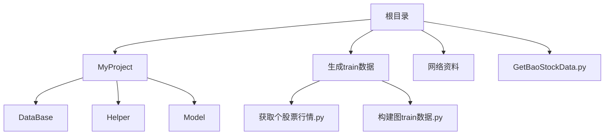
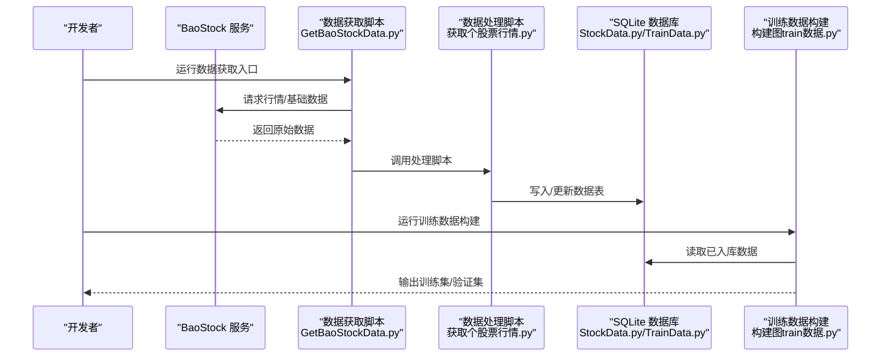
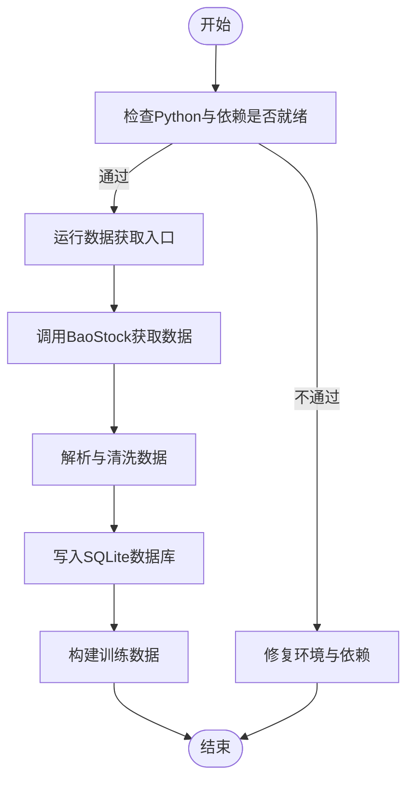
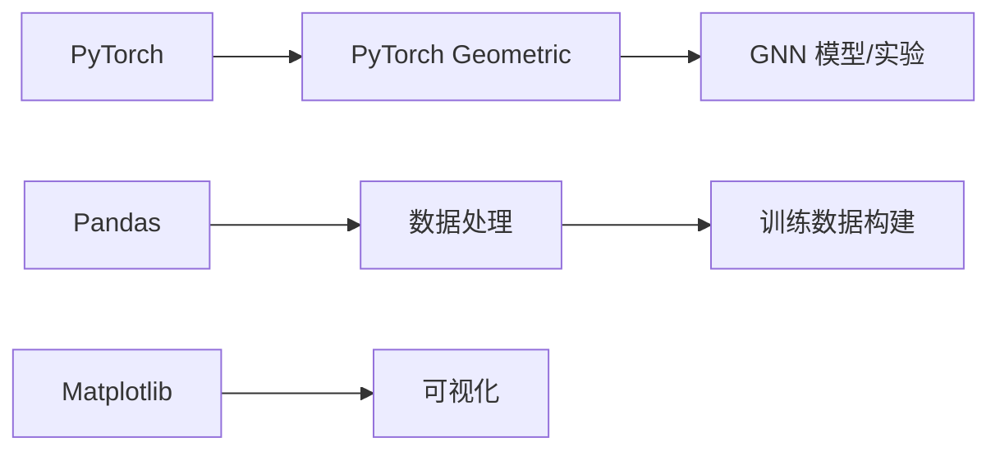

# 开发环境搭建

<cite>
**本文引用的文件**   
- [GetBaoStockData.py](file://GetBaoStockData.py)
- [MyProject/DataBase/StockData.py](file://MyProject/DataBase/StockData.py)
- [MyProject/DataBase/TrainData.py](file://MyProject/DataBase/TrainData.py)
- [MyProject/Helper/SqliteHelper.py](file://MyProject/Helper/SqliteHelper.py)
- [生成train数据/获取个股票行情.py](file://生成train数据/获取个股票行情.py)
- [生成train数据/构建图train数据.py](file://生成train数据/构建图train数据.py)
</cite>

## 目录
1. [简介](#简介)
2. [项目结构](#项目结构)
3. [核心组件](#核心组件)
4. [架构总览](#架构总览)
5. [详细组件分析](#详细组件分析)
6. [依赖关系分析](#依赖关系分析)
7. [性能考虑](#性能考虑)
8. [故障排查指南](#故障排查指南)
9. [结论](#结论)
10. [附录](#附录)

## 简介
本指南面向首次参与该图神经网络（GNN）股票预测项目的开发者，提供从零开始的本地开发环境搭建说明。内容涵盖：
- Python 版本要求与虚拟环境创建
- 关键依赖包安装（PyTorch Geometric、Pandas、Matplotlib 等）
- 数据库配置与初始数据准备
- Windows 与 Linux 的差异安装步骤
- BaoStock API 密钥获取与数据源配置方法
- 常见问题定位与解决思路

## 项目结构
仓库采用按功能模块划分的目录组织方式，核心目录与职责如下：
- MyProject/DataBase：数据库相关脚本与数据表定义（SQLite）
- MyProject/Helper：通用工具（CSV、绘图、日志、随机数、SQLite 封装等）
- MyProject/Model：策略与实验脚本（节点分类、信号策略等）
- 生成train数据：训练数据构建与行情拉取脚本
- GetBaoStockData.py：BaoStock 数据获取入口脚本

图表来源
- [GetBaoStockData.py](file://GetBaoStockData.py)
- [MyProject/DataBase/StockData.py](file://MyProject/DataBase/StockData.py)
- [MyProject/DataBase/TrainData.py](file://MyProject/DataBase/TrainData.py)
- [生成train数据/获取个股票行情.py](file://生成train数据/获取个股票行情.py)
- [生成train数据/构建图train数据.py](file://生成train数据/构建图train数据.py)

章节来源
- [GetBaoStockData.py](file://GetBaoStockData.py)
- [MyProject/DataBase/StockData.py](file://MyProject/DataBase/StockData.py)
- [MyProject/DataBase/TrainData.py](file://MyProject/DataBase/TrainData.py)
- [生成train数据/获取个股票行情.py](file://生成train数据/获取个股票行情.py)
- [生成train数据/构建图train数据.py](file://生成train数据/构建图train数据.py)

## 核心组件
- 数据获取层：通过 BaoStock 接口拉取个股行情与基础信息，供后续数据处理与建模使用
- 数据处理层：清洗、对齐时间序列、构造特征与标签，输出为 CSV 或 SQLite 表
- 数据库层：基于 SQLite 的轻量级持久化存储，提供建表、插入、查询等能力
- 工具层：CSV 读写、绘图、日志、随机种子控制、SQLite 封装等
- 模型与策略层：节点分类实验与交易策略脚本（不在本指南范围内）

章节来源
- [MyProject/DataBase/StockData.py](file://MyProject/DataBase/StockData.py)
- [MyProject/DataBase/TrainData.py](file://MyProject/DataBase/TrainData.py)
- [MyProject/Helper/SqliteHelper.py](file://MyProject/Helper/SqliteHelper.py)
- [生成train数据/获取个股票行情.py](file://生成train数据/获取个股票行情.py)
- [生成train数据/构建图train数据.py](file://生成train数据/构建图train数据.py)

## 架构总览
下图展示了从数据获取到入库与训练的端到端流程，便于理解各模块协作关系。

图表来源
- [GetBaoStockData.py](file://GetBaoStockData.py)
- [生成train数据/获取个股票行情.py](file://生成train数据/获取个股票行情.py)
- [MyProject/DataBase/StockData.py](file://MyProject/DataBase/StockData.py)
- [MyProject/DataBase/TrainData.py](file://MyProject/DataBase/TrainData.py)
- [生成train数据/构建图train数据.py](file://生成train数据/构建图train数据.py)

## 详细组件分析

### 数据获取与入库流程
- 数据获取入口：负责调用 BaoStock 接口并触发后续处理
- 数据处理脚本：对原始数据进行清洗、对齐、去重、缺失值处理等
- 数据库脚本：定义表结构与字段类型，提供批量写入与查询能力
- 训练数据构建：从数据库中抽取样本，构造图结构所需的节点/边/标签

图表来源
- [GetBaoStockData.py](file://GetBaoStockData.py)
- [生成train数据/获取个股票行情.py](file://生成train数据/获取个股票行情.py)
- [MyProject/DataBase/StockData.py](file://MyProject/DataBase/StockData.py)
- [MyProject/DataBase/TrainData.py](file://MyProject/DataBase/TrainData.py)
- [生成train数据/构建图train数据.py](file://生成train数据/构建图train数据.py)

章节来源
- [GetBaoStockData.py](file://GetBaoStockData.py)
- [生成train数据/获取个股票行情.py](file://生成train数据/获取个股票行情.py)
- [MyProject/DataBase/StockData.py](file://MyProject/DataBase/StockData.py)
- [MyProject/DataBase/TrainData.py](file://MyProject/DataBase/TrainData.py)
- [生成train数据/构建图train数据.py](file://生成train数据/构建图train数据.py)

### 数据库与数据表设计要点
- 存储引擎：SQLite（单文件数据库，适合单机开发与原型验证）
- 典型表：
  - 股票行情表：包含日期、代码、开高低收、成交量、成交额等字段
  - 训练样本表：包含节点特征、边关系、标签等用于 GNN 训练的数据
- 建议：
  - 统一时间戳与时区
  - 主键/唯一索引避免重复写入
  - 批量写入减少 I/O 开销

章节来源
- [MyProject/DataBase/StockData.py](file://MyProject/DataBase/StockData.py)
- [MyProject/DataBase/TrainData.py](file://MyProject/DataBase/TrainData.py)
- [MyProject/Helper/SqliteHelper.py](file://MyProject/Helper/SqliteHelper.py)

### 工具与辅助模块
- CSV 读写：用于中间结果导出与调试
- 绘图：可视化指标与曲线，辅助分析
- 日志：记录运行状态与错误堆栈
- 随机种子：保证实验可复现
- SQLite 封装：简化连接、事务与执行语句

章节来源
- [MyProject/Helper/CsvHelper.py](file://MyProject/Helper/CsvHelper.py)
- [MyProject/Helper/DrawHelper.py](file://MyProject/Helper/DrawHelper.py)
- [MyProject/Helper/LogHelper.py](file://MyProject/Helper/LogHelper.py)
- [MyProject/Helper/RandomHelper.py](file://MyProject/Helper/RandomHelper.py)
- [MyProject/Helper/SqliteHelper.py](file://MyProject/Helper/SqliteHelper.py)

## 依赖关系分析
- Python 版本：建议使用 3.8–3.11（根据 PyTorch 官方支持矩阵选择具体小版本）
- 关键依赖：
  - PyTorch 与 PyTorch Geometric（GNN 框架）
  - Pandas（数据处理）
  - Matplotlib（可视化）
  - 其他常用库（如 NumPy、SciPy、Scikit-learn 等，视具体脚本而定）
- 安装顺序建议：
  1) 先安装 CUDA 版 PyTorch（如需 GPU），再安装 PyTorch Geometric
  2) 安装数据处理与可视化库
  3) 安装项目内其它依赖

图表来源
- [生成train数据/构建图train数据.py](file://生成train数据/构建图train数据.py)
- [生成train数据/获取个股票行情.py](file://生成train数据/获取个股票行情.py)

章节来源
- [生成train数据/构建图train数据.py](file://生成train数据/构建图train数据.py)
- [生成train数据/获取个股票行情.py](file://生成train数据/获取个股票行情.py)

## 性能考虑
- 数据量较大时优先使用 SQLite 批量写入与事务提交
- 合理设置 Pandas 读取参数（如 dtype、usecols）降低内存占用
- 训练阶段启用 DataLoader 并行加载与缓存机制（若使用 PyG 内置数据集）
- 在 CPU 环境下适当减小 batch size 与图规模，避免 OOM

[本节为通用指导，无需列出具体文件来源]

## 故障排查指南
- 无法导入 PyTorch Geometric
  - 确认 PyTorch 与 PyG 版本匹配；CUDA/cuDNN 版本与驱动一致
  - 参考官方安装命令，确保 pip/conda 源可用
- 数据库写入失败
  - 检查 SQLite 文件路径权限与磁盘空间
  - 确认表结构变更已同步至数据库
- 数据为空或异常
  - 校验 BaoStock 接口返回码与限频策略
  - 检查时间范围与股票代码格式
- 绘图乱码或缺失字体
  - 安装中文字体并刷新 matplotlib 字体缓存

章节来源
- [MyProject/Helper/SqliteHelper.py](file://MyProject/Helper/SqliteHelper.py)
- [生成train数据/获取个股票行情.py](file://生成train数据/获取个股票行情.py)

## 结论
按照本指南完成 Python 环境、依赖包、数据库与数据源的配置后，即可顺利运行数据获取与训练数据构建流程。建议在正式训练前先用少量股票进行端到端验证，确保数据链路畅通后再扩大规模。

[本节为总结性内容，无需列出具体文件来源]

## 附录

### 一、Python 版本与虚拟环境
- 推荐 Python 版本：3.8–3.11（结合 PyTorch 官方支持矩阵选择）
- 虚拟环境创建（Windows）
  - 使用 venv：python -m venv .venv
  - 激活：.venv\Scripts\activate
- 虚拟环境创建（Linux）
  - 使用 venv：python3 -m venv .venv
  - 激活：source .venv/bin/activate

[本节为通用指导，无需列出具体文件来源]

### 二、依赖包安装
- 安装 PyTorch（CPU/GPU）
  - 参考 PyTorch 官网提供的安装命令，选择对应平台与 CUDA 版本
- 安装 PyTorch Geometric
  - 根据 PyTorch 版本选择匹配的 PyG 版本
- 安装数据处理与可视化
  - pandas、matplotlib、numpy、scipy、scikit-learn 等
- 安装顺序建议
  - 先 PyTorch，再 PyG，最后其余依赖

[本节为通用指导，无需列出具体文件来源]

### 三、数据库配置与初始数据准备
- 数据库类型：SQLite（单文件）
- 初始化步骤
  - 运行数据库初始化脚本以创建必要表结构
  - 使用数据获取脚本拉取历史行情并入库
  - 运行训练数据构建脚本生成训练/验证集
- 注意事项
  - 统一时间戳与时区
  - 避免重复写入（使用唯一键或幂等逻辑）
  - 定期备份数据库文件

章节来源
- [MyProject/DataBase/StockData.py](file://MyProject/DataBase/StockData.py)
- [MyProject/DataBase/TrainData.py](file://MyProject/DataBase/TrainData.py)
- [生成train数据/构建图train数据.py](file://生成train数据/构建图train数据.py)

### 四、BaoStock 数据源配置与密钥
- 注册与获取 API Key
  - 访问 BaoStock 官网并完成注册
  - 在控制台生成 API Key（部分功能可能需要付费或配额）
- 环境变量配置
  - Windows（PowerShell）：$env:BASTOCK_API_KEY="你的API密钥"
  - Linux/macOS：export BASTOCK_API_KEY="你的API密钥"
- 在项目中引用
  - 在数据获取脚本中读取环境变量并传入请求头
  - 建议将敏感信息放入配置文件或环境变量，不要硬编码
- 常见限制
  - 频率限制与并发限制
  - 数据延迟与可用性声明

章节来源
- [GetBaoStockData.py](file://GetBaoStockData.py)
- [生成train数据/获取个股票行情.py](file://生成train数据/获取个股票行情.py)

### 五、Windows 与 Linux 差异说明
- 路径分隔符与大小写
  - Windows 使用反斜杠，Linux 使用正斜杠
  - 注意文件名大小写敏感性
- 终端与激活命令
  - Windows：.venv\Scripts\activate
  - Linux：source .venv/bin/activate
- 字体与中文显示
  - Linux 需安装中文字体并刷新 matplotlib 缓存
- 权限与文件锁
  - Linux 注意文件读写权限
  - SQLite 多进程并发需谨慎，必要时加锁或使用只读副本

[本节为通用指导，无需列出具体文件来源]

### 六、快速上手清单
- 创建并激活虚拟环境
- 安装 PyTorch 与 PyTorch Geometric
- 安装 pandas、matplotlib 等依赖
- 配置 BaoStock API Key 环境变量
- 初始化数据库表结构
- 运行数据获取脚本拉取数据
- 运行训练数据构建脚本生成训练集
- 运行实验脚本进行验证

[本节为通用指导，无需列出具体文件来源]