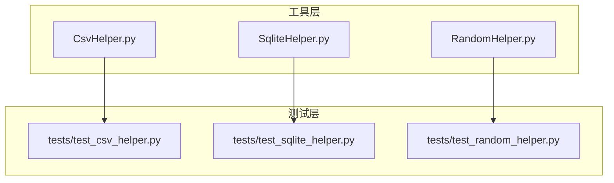
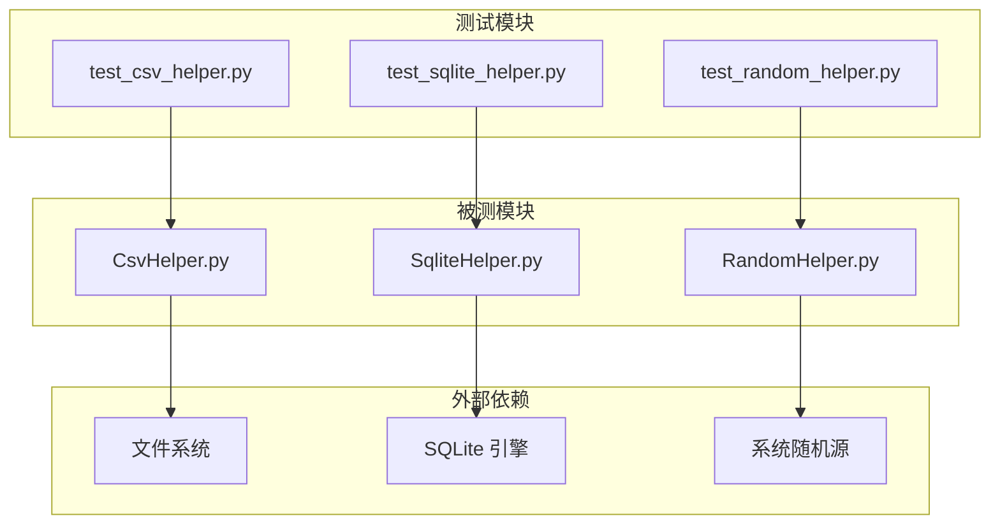
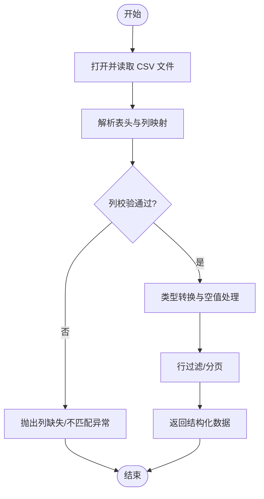
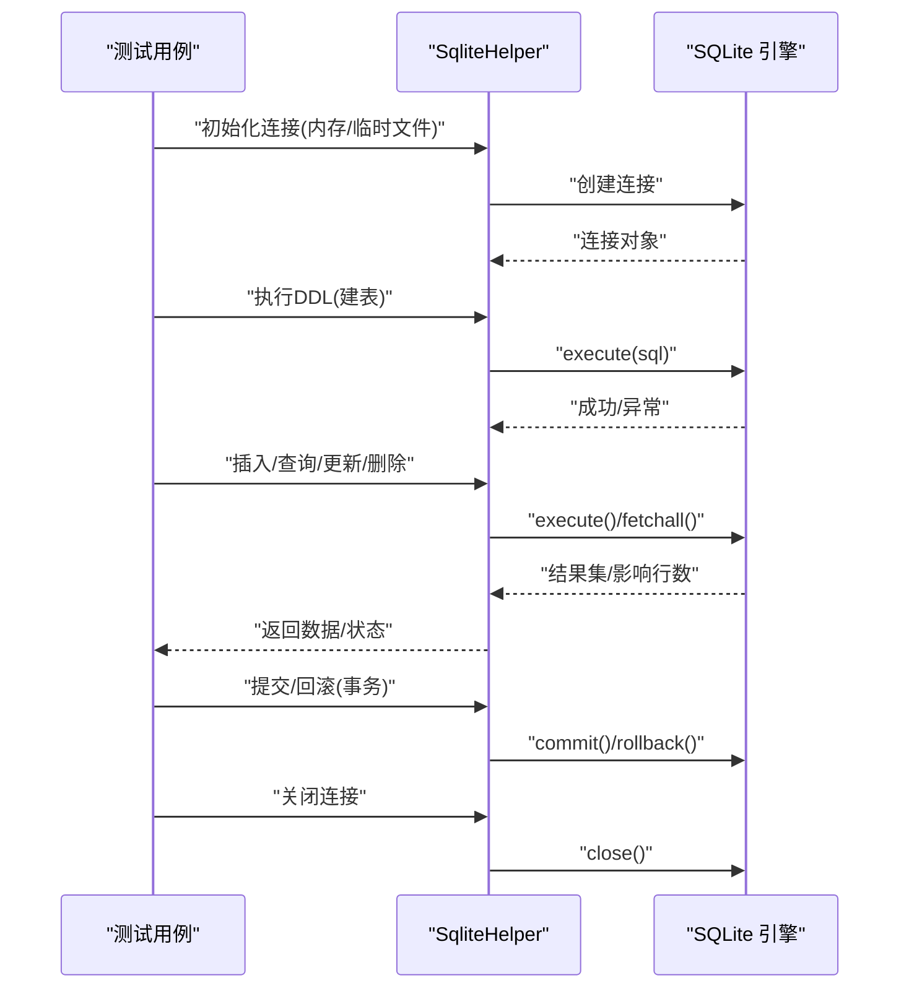
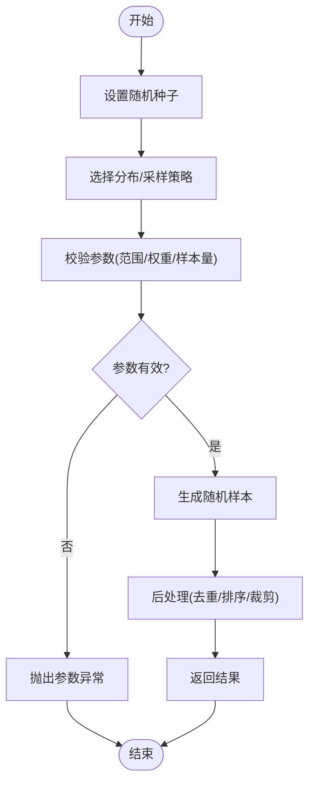
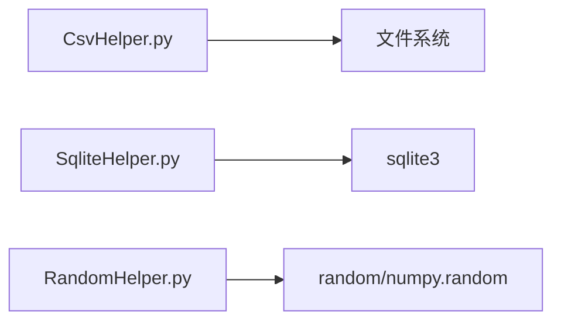

# 单元测试

<cite>
**本文引用的文件**   
- [CsvHelper.py](file://MyProject/Helper/CsvHelper.py)
- [SqliteHelper.py](file://MyProject/Helper/SqliteHelper.py)
- [RandomHelper.py](file://MyProject/Helper/RandomHelper.py)
</cite>

## 目录
1. [简介](#简介)
2. [项目结构](#项目结构)
3. [核心组件](#核心组件)
4. [架构总览](#架构总览)
5. [详细组件分析](#详细组件分析)
6. [依赖分析](#依赖分析)
7. [性能考虑](#性能考虑)
8. [故障排查指南](#故障排查指南)
9. [结论](#结论)
10. [附录](#附录)

## 简介
本指南面向 MyProject 工具层的单元测试实践，重点覆盖以下三个工具模块：
- CsvHelper：CSV 数据读写与格式校验
- SqliteHelper：SQLite 数据库连接、建表、增删改查等基础操作
- RandomHelper：随机数生成与采样相关能力

目标包括：
- 为上述工具函数提供可维护的测试用例设计方法
- 给出测试数据准备策略、外部依赖 Mock 方案与断言标准
- 基于 pytest 框架的配置与使用示例
- 覆盖率统计与持续集成（CI）配置建议

## 项目结构
本项目采用按功能域组织的方式，工具类集中在 Helper 目录下。本次单元测试聚焦于以下三个文件：
- MyProject/Helper/CsvHelper.py
- MyProject/Helper/SqliteHelper.py
- MyProject/Helper/RandomHelper.py

[无图表来源，因为该图为概念性结构示意]

## 核心组件
本节概述三大工具的职责边界与测试关注点：
- CsvHelper：负责 CSV 文件的读取、写入、列名映射、类型转换与异常处理。测试应覆盖正常路径、缺失字段、空值、编码问题、大文件流式处理等。
- SqliteHelper：封装 SQLite 连接、事务、SQL 执行、结果集解析与资源释放。测试需关注连接管理、并发安全、事务回滚、错误码与异常传播。
- RandomHelper：提供随机种子控制、分布采样、去重采样、范围约束等。测试应验证确定性（固定种子）、边界条件、输入校验与性能。

章节来源
- [CsvHelper.py](file://MyProject/Helper/CsvHelper.py)
- [SqliteHelper.py](file://MyProject/Helper/SqliteHelper.py)
- [RandomHelper.py](file://MyProject/Helper/RandomHelper.py)

## 架构总览
下图展示被测模块与其测试模块的关系，以及典型的外部依赖（文件系统、SQLite、随机源）。

图表来源
- [CsvHelper.py](file://MyProject/Helper/CsvHelper.py)
- [SqliteHelper.py](file://MyProject/Helper/SqliteHelper.py)
- [RandomHelper.py](file://MyProject/Helper/RandomHelper.py)

## 详细组件分析

### CsvHelper 测试指南
- 测试目标
  - 读：列头一致性、数据类型转换、空值处理、编码兼容、行过滤、分页/流式读取
  - 写：追加/覆盖模式、转义与特殊字符、批量写入、失败回滚或幂等
  - 校验：列存在性、必填项、取值范围、重复键检测
- 测试数据准备
  - 使用临时目录与临时文件（如 pytest tmp_path），避免污染磁盘
  - 构造最小可用数据集与边界数据集（空文件、仅表头、单行、含异常字符）
- Mock 策略
  - 若内部调用第三方库进行 IO，可使用 unittest.mock.patch 对底层 open/io 接口打桩
  - 对于网络下载或远程存储，通过 patch 返回内存字节流或本地临时文件路径
- 断言标准
  - 返回值结构与类型正确；列顺序与命名一致
  - 数值精度与舍入规则符合预期
  - 异常场景抛出明确异常类型并携带可读信息
  - 文件状态：大小、行数、列数、首尾行内容
- 参考实现位置
  - 读取逻辑入口与关键分支
  - 写入流程与异常处理
  - 校验器与转换器

图表来源
- [CsvHelper.py](file://MyProject/Helper/CsvHelper.py)

章节来源
- [CsvHelper.py](file://MyProject/Helper/CsvHelper.py)

### SqliteHelper 测试指南
- 测试目标
  - 连接与资源管理：建立连接、关闭连接、连接池（若有）
  - DDL/DML：建表、插入、查询、更新、删除、事务提交/回滚
  - 错误处理：非法 SQL、约束冲突、权限不足、连接丢失
- 测试数据准备
  - 使用内存数据库或临时文件数据库，确保每个用例前后环境隔离
  - 预置最小表结构与样例数据，必要时在 setUp/fixture 中初始化
- Mock 策略
  - 若封装了连接池或上层 ORM，可对底层 sqlite3 或连接工厂进行 patch
  - 模拟慢查询或超时，注入异常以验证重试与回滚逻辑
- 断言标准
  - 查询结果集的行数、列名、数据类型与排序稳定
  - 事务边界内的一致性：成功提交、失败回滚
  - 异常类型与错误消息清晰可定位
- 参考实现位置
  - 连接创建与配置
  - SQL 执行与游标管理
  - 事务与错误处理

图表来源
- [SqliteHelper.py](file://MyProject/Helper/SqliteHelper.py)

章节来源
- [SqliteHelper.py](file://MyProject/Helper/SqliteHelper.py)

### RandomHelper 测试指南
- 测试目标
  - 确定性：固定种子下输出可复现
  - 分布与范围：均匀/正态/离散分布的参数校验与边界行为
  - 采样：有放回/无放回、去重、权重采样
  - 输入校验：越界、负数、NaN、空序列等
- 测试数据准备
  - 无需持久化数据，使用参数化用例覆盖不同种子、分布、规模
- Mock 策略
  - 若内部依赖系统随机源，可通过 patch 替换 random 模块或 numpy.random 以注入可控序列
- 断言标准
  - 固定种子下的精确相等或近似相等（浮点容差）
  - 统计特性：均值、方差、直方图分布落在合理区间
  - 异常场景抛出明确异常类型
- 参考实现位置
  - 随机种子设置与分发器
  - 采样算法与约束检查

图表来源
- [RandomHelper.py](file://MyProject/Helper/RandomHelper.py)

章节来源
- [RandomHelper.py](file://MyProject/Helper/RandomHelper.py)

## 依赖分析
- 直接依赖
  - CsvHelper 依赖文件系统与可能的第三方 CSV 库
  - SqliteHelper 依赖 sqlite3 驱动与操作系统文件句柄
  - RandomHelper 依赖 Python 标准库随机源或数值计算库
- 间接依赖
  - 日志、配置、路径解析等通用工具
- 耦合与内聚
  - 各工具模块职责单一，内聚度高；通过清晰的接口降低耦合
- 循环依赖
  - 当前未见循环导入迹象，保持单向依赖关系

图表来源
- [CsvHelper.py](file://MyProject/Helper/CsvHelper.py)
- [SqliteHelper.py](file://MyProject/Helper/SqliteHelper.py)
- [RandomHelper.py](file://MyProject/Helper/RandomHelper.py)

章节来源
- [CsvHelper.py](file://MyProject/Helper/CsvHelper.py)
- [SqliteHelper.py](file://MyProject/Helper/SqliteHelper.py)
- [RandomHelper.py](file://MyProject/Helper/RandomHelper.py)

## 性能考虑
- CsvHelper
  - 大文件采用流式读取与分批处理，避免一次性加载到内存
  - 批量写入合并小事务，减少 I/O 次数
- SqliteHelper
  - 合理使用事务批量插入，提升吞吐
  - 查询尽量只取必要列，避免 N+1 问题
- RandomHelper
  - 大批量采样时优先使用向量化 API
  - 固定种子用于回归测试，但生产环境避免硬编码

[本节为通用指导，不涉及具体文件分析]

## 故障排查指南
- 常见问题
  - CSV 编码不一致导致解析失败：统一指定编码或使用自动探测
  - SQLite 锁竞争：确保单写多读模型，合理设置超时与重试
  - 随机结果不稳定：确认未意外重置种子或被其他模块干扰
- 定位手段
  - 开启详细日志，记录关键中间状态
  - 使用最小复现用例与参数化矩阵快速收敛问题
  - 借助覆盖率报告定位未覆盖分支

章节来源
- [CsvHelper.py](file://MyProject/Helper/CsvHelper.py)
- [SqliteHelper.py](file://MyProject/Helper/SqliteHelper.py)
- [RandomHelper.py](file://MyProject/Helper/RandomHelper.py)

## 结论
通过对 CsvHelper、SqliteHelper、RandomHelper 的针对性测试设计与规范落地，可有效提升工具层的稳定性与可维护性。结合 pytest 的 fixture、参数化与覆盖率插件，配合 CI 自动化，可在早期发现回归问题并保障质量基线。

[本节为总结性内容，不涉及具体文件分析]

## 附录

### pytest 配置与使用要点
- 安装与运行
  - 安装 pytest 及常用插件（如 coverage、pytest-mock、pytest-timeout）
  - 在项目根目录创建 pytest.ini 或 pyproject.toml 中的 [tool.pytest.ini_options] 段
- 推荐配置项
  - testpaths：指向 tests 目录
  - python_files：匹配 *_test.py 或 test_*.py
  - addopts：启用缓存、显示本地变量、并行执行等
- 示例片段（说明性）
  - 在 pyproject.toml 中添加 pytest 配置块，指定测试路径与默认选项
  - 使用命令行运行：pytest --cov=MyProject/Helper --cov-report=term-missing

[本节为通用配置说明，不涉及具体文件分析]

### 测试数据准备最佳实践
- 使用 pytest tmp_path 创建临时目录与文件，确保用例间隔离
- 将静态小数据集放在 fixtures 目录，按需加载
- 对大数据集采用分片与惰性加载，避免拖慢测试套件

[本节为通用实践说明，不涉及具体文件分析]

### Mock 外部依赖策略
- 文件系统：使用 pathlib.Path 与 io.StringIO/BytesIO 替代真实磁盘
- 数据库：使用内存数据库或临时文件，必要时 patch sqlite3.connect
- 随机源：patch random 或 numpy.random 以注入确定序列
- 网络请求：使用 responses 或 httpretty 拦截 HTTP 调用

[本节为通用策略说明，不涉及具体文件分析]

### 断言标准制定
- 结构断言：返回类型、字段完整性、顺序与命名
- 数值断言：整数精确相等，浮点数使用近似比较（容差）
- 集合断言：元素等价、去重、包含关系
- 异常断言：特定异常类型与消息片段
- 副作用断言：文件变更、数据库状态、日志输出

[本节为通用断言规范，不涉及具体文件分析]

### 覆盖率统计与阈值
- 使用 pytest-cov 生成行覆盖率与缺失行报告
- 设定最低覆盖率阈值并在 CI 中阻断低覆盖率提交
- 针对关键路径提高覆盖率要求，非关键路径放宽

[本节为通用指标说明，不涉及具体文件分析]

### 持续集成（CI）配置建议
- 触发条件：push、PR、定时任务
- 步骤：
  - 安装依赖
  - 运行测试套件（含覆盖率）
  - 上传覆盖率报告
  - 缓存 pip 包与构建产物加速流水线
- 失败策略：任一测试失败即中断，保留日志与产物供调试

[本节为通用 CI 建议，不涉及具体文件分析]