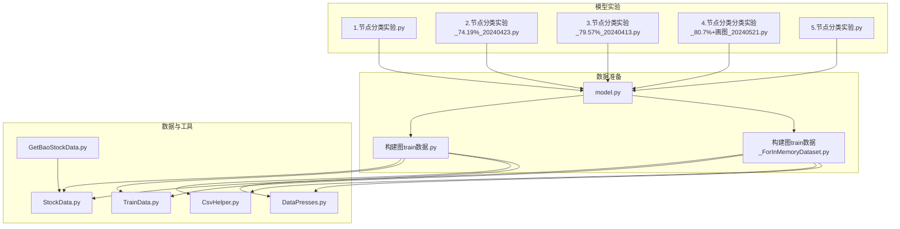
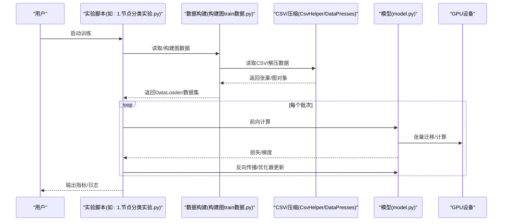
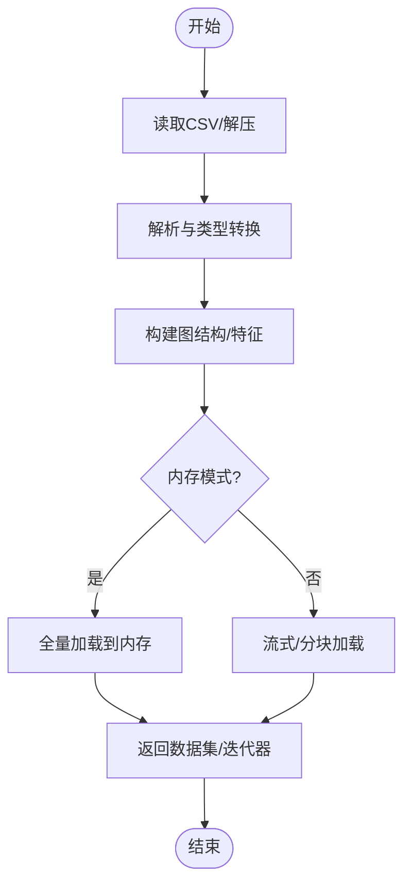
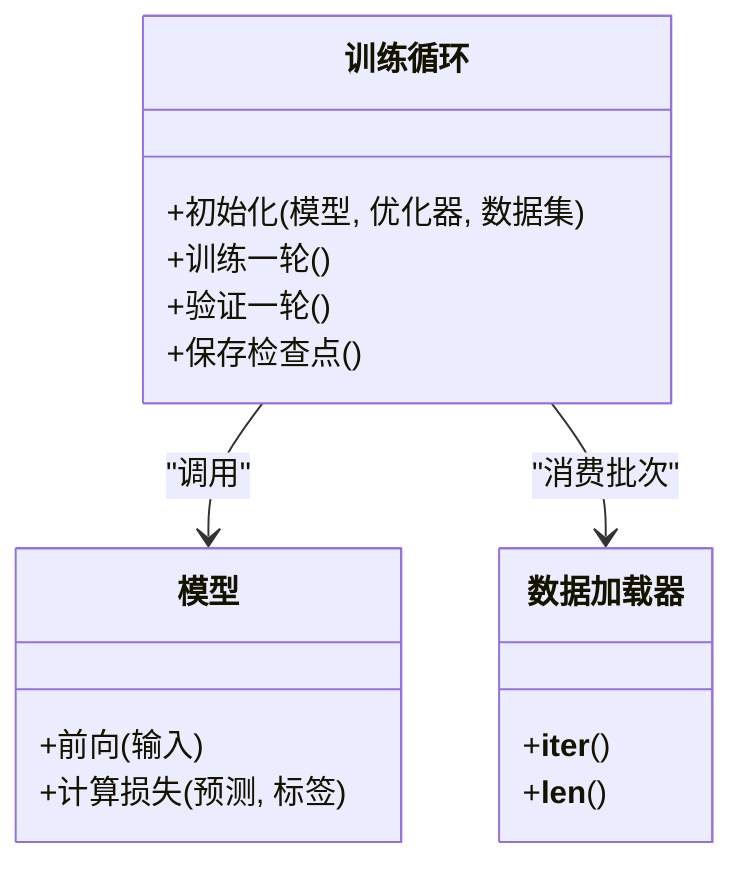
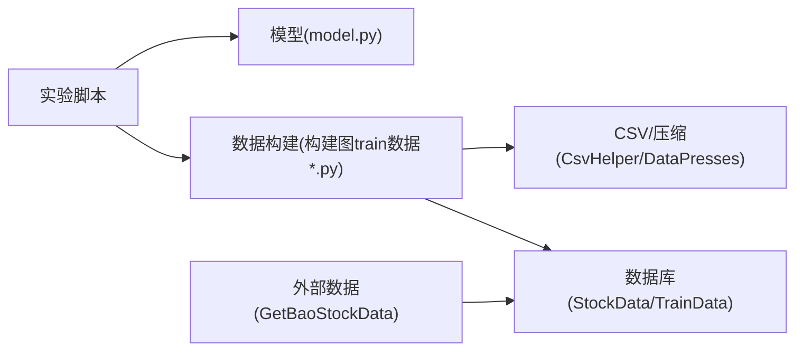

# 性能分析

<cite>
**本文引用的文件**   
- [MyProject/Model/1.节点分类实验.py](file://MyProject/Model/1.节点分类实验.py)
- [MyProject/Model/2.节点分类实验_74.19%_20240423.py](file://MyProject/Model/2.节点分类实验_74.19%_20240423.py)
- [MyProject/Model/3.节点分类实验_79.57%_20240413.py](file://MyProject/Model/3.节点分类实验_79.57%_20240413.py)
- [MyProject/Model/4.节点分类实验_80.7%+画图_20240521.py](file://MyProject/Model/4.节点分类实验_80.7%+画图_20240521.py)
- [MyProject/Model/5.节点分类实验.py](file://MyProject/Model/5.节点分类实验.py)
- [生成train数据/model.py](file://生成train数据/model.py)
- [生成train数据/构建图train数据.py](file://生成train数据/构建图train数据.py)
- [生成train数据/构建图train数据_ForInMemoryDataset.py](file://生成train数据/构建图train数据_ForInMemoryDataset.py)
- [MyProject/DataBase/StockData.py](file://MyProject/DataBase/StockData.py)
- [MyProject/DataBase/TrainData.py](file://MyProject/DataBase/TrainData.py)
- [MyProject/Helper/CsvHelper.py](file://MyProject/Helper/CsvHelper.py)
- [MyProject/Helper/DataPresses.py](file://MyProject/Helper/DataPresses.py)
- [GetBaoStockData.py](file://GetBaoStockData.py)
</cite>

## 目录
1. [简介](#简介)
2. [项目结构](#项目结构)
3. [核心组件](#核心组件)
4. [架构总览](#架构总览)
5. [详细组件分析](#详细组件分析)
6. [依赖分析](#依赖分析)
7. [性能考虑](#性能考虑)
8. [故障排查指南](#故障排查指南)
9. [结论](#结论)
10. [附录](#附录)

## 简介
本文件面向本项目（基于PyTorch Geometric的图神经网络训练与数据处理）建立系统性的性能分析体系，覆盖：
- Python级CPU瓶颈定位：cProfile、line_profiler使用指南
- GPU内存分析与优化：批大小调优、显存泄漏检测
- 大数据处理优化：数据加载、并行计算、缓存机制
- 基准测试编写与执行方法
- 结合仓库中现有脚本与模块给出落地建议与可视化流程

## 项目结构
从仓库结构看，代码按“模型实验脚本 + 数据准备 + 工具库”组织。关键路径包括：
- 模型实验入口：MyProject/Model/*.py
- 数据准备与图构建：生成train数据/*.py
- 数据库与CSV读写：MyProject/DataBase/*.py, MyProject/Helper/*.py
- 外部数据获取：GetBaoStockData.py

图表来源
- [MyProject/Model/1.节点分类实验.py](file://MyProject/Model/1.节点分类实验.py)
- [MyProject/Model/2.节点分类实验_74.19%_20240423.py](file://MyProject/Model/2.节点分类实验_74.19%_20240423.py)
- [MyProject/Model/3.节点分类实验_79.57%_20240413.py](file://MyProject/Model/3.节点分类实验_79.57%_20240413.py)
- [MyProject/Model/4.节点分类实验_80.7%+画图_20240521.py](file://MyProject/Model/4.节点分类实验_80.7%+画图_20240521.py)
- [MyProject/Model/5.节点分类实验.py](file://MyProject/Model/5.节点分类实验.py)
- [生成train数据/model.py](file://生成train数据/model.py)
- [生成train数据/构建图train数据.py](file://生成train数据/构建图train数据.py)
- [生成train数据/构建图train数据_ForInMemoryDataset.py](file://生成train数据/构建图train数据_ForInMemoryDataset.py)
- [MyProject/DataBase/StockData.py](file://MyProject/DataBase/StockData.py)
- [MyProject/DataBase/TrainData.py](file://MyProject/DataBase/TrainData.py)
- [MyProject/Helper/CsvHelper.py](file://MyProject/Helper/CsvHelper.py)
- [MyProject/Helper/DataPresses.py](file://MyProject/Helper/DataPresses.py)
- [GetBaoStockData.py](file://GetBaoStockData.py)

章节来源
- [MyProject/Model/1.节点分类实验.py](file://MyProject/Model/1.节点分类实验.py)
- [生成train数据/构建图train数据.py](file://生成train数据/构建图train数据.py)
- [MyProject/DataBase/StockData.py](file://MyProject/DataBase/StockData.py)
- [MyProject/Helper/CsvHelper.py](file://MyProject/Helper/CsvHelper.py)

## 核心组件
- 模型定义与训练循环：位于生成train数据/model.py与各实验脚本中，负责前向传播、损失计算、反向传播与参数更新。
- 数据集与图构建：构建图train数据.py与ForInMemoryDataset版本负责将原始行情数据转换为PyG图数据对象，并管理内存映射或全量加载策略。
- 数据IO与压缩：CsvHelper.py与DataPresses.py提供CSV读写与数据压缩能力，影响I/O吞吐与磁盘占用。
- 外部数据接入：GetBaoStockData.py用于拉取外部行情数据，是数据管道上游。

章节来源
- [生成train数据/model.py](file://生成train数据/model.py)
- [生成train数据/构建图train数据.py](file://生成train数据/构建图train数据.py)
- [生成train数据/构建图train数据_ForInMemoryDataset.py](file://生成train数据/构建图train数据_ForInMemoryDataset.py)
- [MyProject/Helper/CsvHelper.py](file://MyProject/Helper/CsvHelper.py)
- [MyProject/Helper/DataPresses.py](file://MyProject/Helper/DataPresses.py)
- [GetBaoStockData.py](file://GetBaoStockData.py)

## 架构总览
下图展示一次典型训练流程中的关键阶段与性能热点位置，便于后续针对性分析。

图表来源
- [MyProject/Model/1.节点分类实验.py](file://MyProject/Model/1.节点分类实验.py)
- [生成train数据/构建图train数据.py](file://生成train数据/构建图train数据.py)
- [生成train数据/model.py](file://生成train数据/model.py)
- [MyProject/Helper/CsvHelper.py](file://MyProject/Helper/CsvHelper.py)
- [MyProject/Helper/DataPresses.py](file://MyProject/Helper/DataPresses.py)

## 详细组件分析

### 组件A：数据加载与图构建（构建图train数据.py / ForInMemoryDataset.py）
- 职责：将股票时序特征组装为PyG图；支持全量内存加载或按需加载两种模式。
- 性能关注点：
  - I/O吞吐：CSV解析、解压、类型转换耗时
  - 内存峰值：全量加载时的图对象与特征矩阵叠加
  - 并行度：多进程数据加载配置
- 优化建议：
  - 优先使用ForInMemoryDataset进行小规模验证；大规模训练采用流式/分块加载
  - 预分配张量、避免在循环中频繁创建临时对象
  - 使用更快的序列化格式（如HDF5/Parquet）替代CSV，减少解析开销
  - DataLoader设置num_workers>0，pin_memory=True（若使用GPU）

图表来源
- [生成train数据/构建图train数据.py](file://生成train数据/构建图train数据.py)
- [生成train数据/构建图train数据_ForInMemoryDataset.py](file://生成train数据/构建图train数据_ForInMemoryDataset.py)
- [MyProject/Helper/CsvHelper.py](file://MyProject/Helper/CsvHelper.py)
- [MyProject/Helper/DataPresses.py](file://MyProject/Helper/DataPresses.py)

章节来源
- [生成train数据/构建图train数据.py](file://生成train数据/构建图train数据.py)
- [生成train数据/构建图train数据_ForInMemoryDataset.py](file://生成train数据/构建图train数据_ForInMemoryDataset.py)
- [MyProject/Helper/CsvHelper.py](file://MyProject/Helper/CsvHelper.py)
- [MyProject/Helper/DataPresses.py](file://MyProject/Helper/DataPresses.py)

### 组件B：模型与训练循环（model.py / 各实验脚本）
- 职责：定义网络层、前向逻辑、损失函数、优化器与训练/验证循环。
- 性能关注点：
  - GPU利用率：批大小过小导致GPU空闲
  - 显存占用：中间激活、图规模、混合精度
  - 同步开销：频繁的CPU-GPU拷贝与log打印
- 优化建议：
  - 增大batch_size直至显存接近上限
  - 使用梯度累积模拟更大批
  - 启用混合精度（AMP）降低显存与提升吞吐
  - 减少不必要的to(device)/detach()调用，合并操作
  - 使用torch.cuda.amp与GradScaler

图表来源
- [生成train数据/model.py](file://生成train数据/model.py)
- [MyProject/Model/1.节点分类实验.py](file://MyProject/Model/1.节点分类实验.py)
- [MyProject/Model/2.节点分类实验_74.19%_20240423.py](file://MyProject/Model/2.节点分类实验_74.19%_20240423.py)
- [MyProject/Model/3.节点分类实验_79.57%_20240413.py](file://MyProject/Model/3.节点分类实验_79.57%_20240413.py)
- [MyProject/Model/4.节点分类实验_80.7%+画图_20240521.py](file://MyProject/Model/4.节点分类实验_80.7%+画图_20240521.py)
- [MyProject/Model/5.节点分类实验.py](file://MyProject/Model/5.节点分类实验.py)

章节来源
- [生成train数据/model.py](file://生成train数据/model.py)
- [MyProject/Model/1.节点分类实验.py](file://MyProject/Model/1.节点分类实验.py)
- [MyProject/Model/2.节点分类实验_74.19%_20240423.py](file://MyProject/Model/2.节点分类实验_74.19%_20240423.py)
- [MyProject/Model/3.节点分类实验_79.57%_20240413.py](file://MyProject/Model/3.节点分类实验_79.57%_20240413.py)
- [MyProject/Model/4.节点分类实验_80.7%+画图_20240521.py](file://MyProject/Model/4.节点分类实验_80.7%+画图_20240521.py)
- [MyProject/Model/5.节点分类实验.py](file://MyProject/Model/5.节点分类实验.py)

### 组件C：外部数据接入（GetBaoStockData.py）
- 职责：从外部源拉取行情数据，作为数据管道上游。
- 性能关注点：网络延迟、重试与限流、落盘格式与压缩。
- 优化建议：
  - 批量请求、断点续传、并发下载（注意限速）
  - 写入时直接压缩存储，减少二次解压成本
  - 校验与去重，避免重复计算

章节来源
- [GetBaoStockData.py](file://GetBaoStockData.py)

## 依赖分析
- 模块耦合关系：
  - 实验脚本依赖模型与数据构建模块
  - 数据构建模块依赖CSV/压缩工具与数据库访问
  - 外部数据接入独立于训练链路，但影响整体端到端时延
- 潜在瓶颈：
  - CSV解析与解压成为I/O热点
  - 全量内存加载导致峰值显存/内存过高
  - 小批训练导致GPU利用率不足

图表来源
- [MyProject/Model/1.节点分类实验.py](file://MyProject/Model/1.节点分类实验.py)
- [生成train数据/model.py](file://生成train数据/model.py)
- [生成train数据/构建图train数据.py](file://生成train数据/构建图train数据.py)
- [MyProject/DataBase/StockData.py](file://MyProject/DataBase/StockData.py)
- [MyProject/DataBase/TrainData.py](file://MyProject/DataBase/TrainData.py)
- [MyProject/Helper/CsvHelper.py](file://MyProject/Helper/CsvHelper.py)
- [MyProject/Helper/DataPresses.py](file://MyProject/Helper/DataPresses.py)
- [GetBaoStockData.py](file://GetBaoStockData.py)

章节来源
- [生成train数据/构建图train数据.py](file://生成train数据/构建图train数据.py)
- [生成train数据/model.py](file://生成train数据/model.py)
- [MyProject/DataBase/StockData.py](file://MyProject/DataBase/StockData.py)
- [MyProject/Helper/CsvHelper.py](file://MyProject/Helper/CsvHelper.py)

## 性能考虑

### CPU性能分析（Python级）
- cProfile
  - 用法：以命令行方式对主脚本进行剖析，导出统计结果后使用可视化工具查看热点函数
  - 适用场景：定位训练循环、数据预处理、日志与绘图等慢点
- line_profiler
  - 用法：对关键函数添加装饰器，运行后生成逐行耗时报告
  - 适用场景：细粒度定位数据解析、图构建、特征工程中的热点行
- 实践建议
  - 先粗后细：先用cProfile定位Top函数，再用line_profiler聚焦具体函数
  - 关闭无关日志与绘图，确保测量的是核心路径
  - 多次运行取稳定值，排除冷启动与GC抖动

章节来源
- [MyProject/Model/1.节点分类实验.py](file://MyProject/Model/1.节点分类实验.py)
- [生成train数据/构建图train数据.py](file://生成train数据/构建图train数据.py)

### GPU内存分析与优化
- 监控与诊断
  - 使用nvidia-smi观察显存峰值与利用率
  - 使用torch.cuda.memory_summary与memory_allocated/memory_reserved辅助定位
  - 记录每步前后显存变化，识别异常增长
- 批大小调优
  - 逐步增大batch_size直到显存接近上限，同时保持较高GPU利用率
  - 若显存不足，使用梯度累积模拟大batch
- 显存泄漏检测
  - 常见原因：未释放的中间张量、跨step保留的引用、动态图结构未清理
  - 检测方法：在固定步数内循环训练，观察显存是否线性增长；必要时重启进程对比
- 优化手段
  - 启用混合精度（AMP），配合GradScaler
  - 及时detach/释放不再需要的张量，避免在backward图中保留长链
  - 减少频繁to(device)与print/log，合并操作

章节来源
- [生成train数据/model.py](file://生成train数据/model.py)
- [MyProject/Model/1.节点分类实验.py](file://MyProject/Model/1.节点分类实验.py)

### 大数据处理优化
- 数据加载优化
  - 使用更快的存储格式（HDF5/Parquet）替代CSV
  - 预分配数组、向量化操作，避免Python循环
  - 使用DataLoader的num_workers与pin_memory提升吞吐
- 并行计算
  - 数据预处理阶段使用多进程；训练阶段尽量让GPU满载
  - 合理划分任务，避免锁竞争与上下文切换过多
- 缓存机制
  - 对昂贵计算结果做LRU缓存或持久化缓存（如joblib/diskcache）
  - 对于图邻接表/索引等可复用结构，全局缓存避免重复构建

章节来源
- [生成train数据/构建图train数据.py](file://生成train数据/构建图train数据.py)
- [生成train数据/构建图train数据_ForInMemoryDataset.py](file://生成train数据/构建图train数据_ForInMemoryDataset.py)
- [MyProject/Helper/CsvHelper.py](file://MyProject/Helper/CsvHelper.py)
- [MyProject/Helper/DataPresses.py](file://MyProject/Helper/DataPresses.py)

### 基准测试编写与执行
- 目标
  - 建立稳定的端到端基准：数据加载、模型前向、训练一步、验证一步
- 设计要点
  - 固定随机种子，预热后再计时
  - 分别测量CPU与GPU路径，记录吞吐与时延分布
  - 输出结构化结果（JSON/CSV），便于回归比较
- 执行建议
  - 使用命令行参数控制不同配置（batch_size、workers、精度）
  - 自动化脚本驱动多组实验，汇总对比

章节来源
- [MyProject/Model/1.节点分类实验.py](file://MyProject/Model/1.节点分类实验.py)
- [生成train数据/model.py](file://生成train数据/model.py)

## 故障排查指南
- 现象：训练初期极慢
  - 排查：确认是否为首次数据构建/解压；增加缓存或改用更快格式
- 现象：显存持续增长
  - 排查：检查是否有跨step引用、未detach的张量、动态图未释放；使用显存快照定位
- 现象：GPU利用率低
  - 排查：增大batch_size、开启多进程数据加载、减少CPU-GPU同步点
- 现象：I/O瓶颈明显
  - 排查：评估CSV解析与解压耗时；尝试并行读取、预读缓冲、异步加载

章节来源
- [生成train数据/构建图train数据.py](file://生成train数据/构建图train数据.py)
- [生成train数据/构建图train数据_ForInMemoryDataset.py](file://生成train数据/构建图train数据_ForInMemoryDataset.py)
- [MyProject/Helper/CsvHelper.py](file://MyProject/Helper/CsvHelper.py)
- [MyProject/Helper/DataPresses.py](file://MyProject/Helper/DataPresses.py)

## 结论
通过分层剖析（cProfile/line_profiler）、GPU显存监控与批大小调优、数据加载与缓存优化，以及规范的基准测试，可在本项目中快速定位并消除性能瓶颈，显著提升训练吞吐与稳定性。建议将上述方法与流程固化为团队规范，持续跟踪回归。

## 附录
- 常用命令参考（概念性说明）
  - 使用cProfile对主脚本进行分析并导出结果
  - 使用line_profiler对关键函数进行逐行剖析
  - 使用nvidia-smi定时采样显存与利用率
  - 使用torch.cuda.memory_summary输出显存摘要
- 建议的基准项清单
  - 数据加载吞吐（样本/秒）
  - 单步训练时延（ms）
  - GPU利用率（%）
  - 显存峰值（MB）
  - 端到端收敛步数与时间