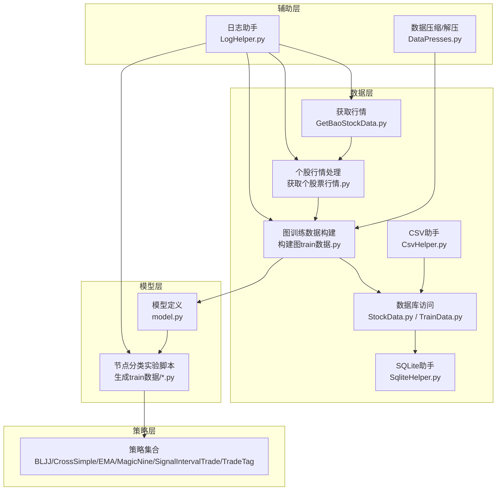
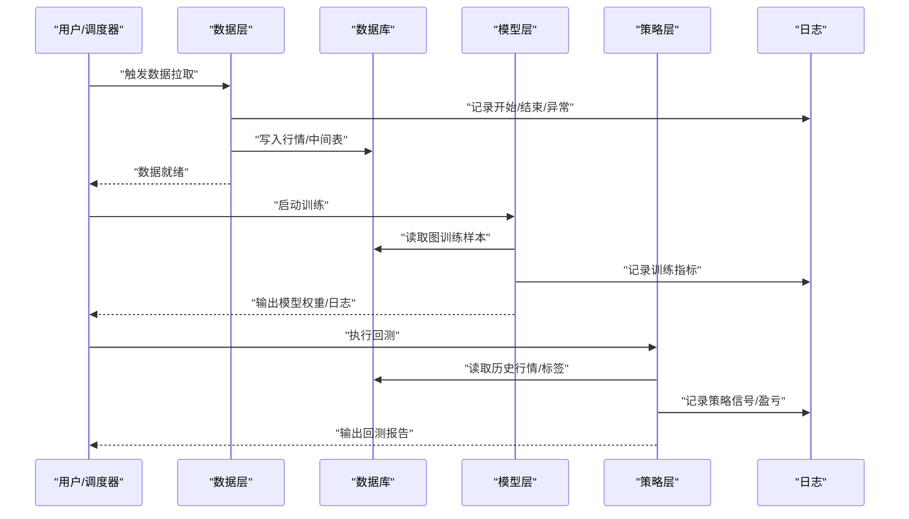
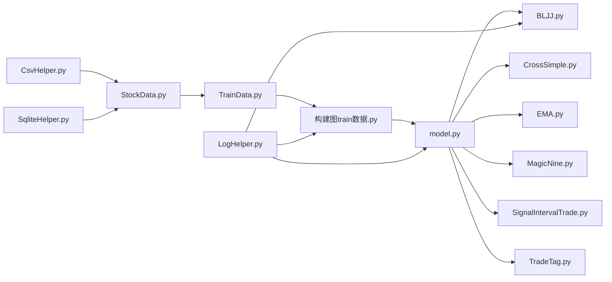

# 测试与调试

<cite>
**本文引用的文件**   
- [MyProject/Helper/LogHelper.py](file://MyProject/Helper/LogHelper.py)
- [MyProject/Helper/CsvHelper.py](file://MyProject/Helper/CsvHelper.py)
- [MyProject/Helper/DataPresses.py](file://MyProject/Helper/DataPresses.py)
- [MyProject/Helper/SqliteHelper.py](file://MyProject/Helper/SqliteHelper.py)
- [MyProject/DataBase/StockData.py](file://MyProject/DataBase/StockData.py)
- [MyProject/DataBase/TrainData.py](file://MyProject/DataBase/TrainData.py)
- [MyProject/Model/Strategy/BLJJ.py](file://MyProject/Model/Strategy/BLJJ.py)
- [MyProject/Model/Strategy/CrossSimple.py](file://MyProject/Model/Strategy/CrossSimple.py)
- [MyProject/Model/Strategy/EMA.py](file://MyProject/Model/Strategy/EMA.py)
- [MyProject/Model/Strategy/MagicNine.py](file://MyProject/Model/Strategy/MagicNine.py)
- [MyProject/Model/Strategy/SignalIntervalTrade.py](file://MyProject/Model/Strategy/SignalIntervalTrade.py)
- [MyProject/Model/Strategy/TradeTag.py](file://MyProject/Model/Strategy/TradeTag.py)
- [生成train数据/model.py](file://生成train数据/model.py)
- [生成train数据/构建图train数据.py](file://生成train数据/构建图train数据.py)
- [生成train数据/获取个股票行情.py](file://生成train数据/获取个股票行情.py)
- [GetBaoStockData.py](file://GetBaoStockData.py)
</cite>

## 目录
1. [引言](#引言)
2. [项目结构](#项目结构)
3. [核心组件](#核心组件)
4. [架构总览](#架构总览)
5. [详细组件分析](#详细组件分析)
6. [依赖分析](#依赖分析)
7. [性能考虑](#性能考虑)
8. [故障排查指南](#故障排查指南)
9. [结论](#结论)
10. [附录](#附录)

## 引言
本文件面向本项目（基于图神经网络的股票交易研究）建立一套完整的测试与调试体系，覆盖单元测试规范、集成测试策略、调试技巧与工具配置。目标包括：
- 定义可复用的单元测试编写规范（用例设计、Mock数据准备、断言标准）。
- 制定集成测试策略（数据管道、模型训练验证、策略回测）。
- 提供调试最佳实践（日志记录、性能分析、内存泄漏检测）。
- 给出常用调试工具的配置与使用建议（PyCharm、Jupyter Notebook、命令行）。

## 项目结构
仓库围绕“数据—模型—策略”的流水线组织：
- 数据层：从外部源拉取行情、清洗入库、构造训练样本与图数据。
- 模型层：GNN节点分类实验脚本与模型定义。
- 策略层：多套交易信号与标签生成策略。
- 辅助层：日志、CSV/SQLite读写、绘图等通用工具。

图表来源
- [GetBaoStockData.py](file://GetBaoStockData.py)
- [生成train数据/获取个股票行情.py](file://生成train数据/获取个股票行情.py)
- [生成train数据/构建图train数据.py](file://生成train数据/构建图train数据.py)
- [MyProject/DataBase/StockData.py](file://MyProject/DataBase/StockData.py)
- [MyProject/DataBase/TrainData.py](file://MyProject/DataBase/TrainData.py)
- [MyProject/Helper/SqliteHelper.py](file://MyProject/Helper/SqliteHelper.py)
- [MyProject/Helper/CsvHelper.py](file://MyProject/Helper/CsvHelper.py)
- [生成train数据/model.py](file://生成train数据/model.py)
- [MyProject/Model/Strategy/BLJJ.py](file://MyProject/Model/Strategy/BLJJ.py)
- [MyProject/Model/Strategy/CrossSimple.py](file://MyProject/Model/Strategy/CrossSimple.py)
- [MyProject/Model/Strategy/EMA.py](file://MyProject/Model/Strategy/EMA.py)
- [MyProject/Model/Strategy/MagicNine.py](file://MyProject/Model/Strategy/MagicNine.py)
- [MyProject/Model/Strategy/SignalIntervalTrade.py](file://MyProject/Model/Strategy/SignalIntervalTrade.py)
- [MyProject/Model/Strategy/TradeTag.py](file://MyProject/Model/Strategy/TradeTag.py)
- [MyProject/Helper/LogHelper.py](file://MyProject/Helper/LogHelper.py)
- [MyProject/Helper/DataPresses.py](file://MyProject/Helper/DataPresses.py)

章节来源
- [GetBaoStockData.py](file://GetBaoStockData.py)
- [生成train数据/获取个股票行情.py](file://生成train数据/获取个股票行情.py)
- [生成train数据/构建图train数据.py](file://生成train数据/构建图train数据.py)
- [MyProject/DataBase/StockData.py](file://MyProject/DataBase/StockData.py)
- [MyProject/DataBase/TrainData.py](file://MyProject/DataBase/TrainData.py)
- [MyProject/Helper/SqliteHelper.py](file://MyProject/Helper/SqliteHelper.py)
- [MyProject/Helper/CsvHelper.py](file://MyProject/Helper/CsvHelper.py)
- [生成train数据/model.py](file://生成train数据/model.py)
- [MyProject/Model/Strategy/BLJJ.py](file://MyProject/Model/Strategy/BLJJ.py)
- [MyProject/Model/Strategy/CrossSimple.py](file://MyProject/Model/Strategy/CrossSimple.py)
- [MyProject/Model/Strategy/EMA.py](file://MyProject/Model/Strategy/EMA.py)
- [MyProject/Model/Strategy/MagicNine.py](file://MyProject/Model/Strategy/MagicNine.py)
- [MyProject/Model/Strategy/SignalIntervalTrade.py](file://MyProject/Model/Strategy/SignalIntervalTrade.py)
- [MyProject/Model/Strategy/TradeTag.py](file://MyProject/Model/Strategy/TradeTag.py)
- [MyProject/Helper/LogHelper.py](file://MyProject/Helper/LogHelper.py)
- [MyProject/Helper/DataPresses.py](file://MyProject/Helper/DataPresses.py)

## 核心组件
- 数据获取与入库
  - 外部接口调用与本地落盘（CSV/SQLite），需保证幂等与重试机制。
  - 关键路径：行情获取 → 清洗 → 入库 → 图数据构建。
- 图训练数据构建
  - 将时序行情转换为图结构样本，包含节点特征、边关系与标签。
- 模型训练与评估
  - 基于GNN的节点分类任务，需监控损失、准确率、过拟合与收敛性。
- 策略与回测
  - 多策略信号生成与标签对齐，用于离线回测与指标统计。
- 辅助能力
  - 日志、CSV/SQLite读写、数据压缩等。

章节来源
- [生成train数据/构建图train数据.py](file://生成train数据/构建图train数据.py)
- [生成train数据/model.py](file://生成train数据/model.py)
- [MyProject/DataBase/StockData.py](file://MyProject/DataBase/StockData.py)
- [MyProject/DataBase/TrainData.py](file://MyProject/DataBase/TrainData.py)
- [MyProject/Helper/SqliteHelper.py](file://MyProject/Helper/SqliteHelper.py)
- [MyProject/Helper/CsvHelper.py](file://MyProject/Helper/CsvHelper.py)
- [MyProject/Helper/LogHelper.py](file://MyProject/Helper/LogHelper.py)
- [MyProject/Helper/DataPresses.py](file://MyProject/Helper/DataPresses.py)

## 架构总览
下图展示端到端的数据与训练流程，以及策略回测的接入点。

图表来源
- [生成train数据/构建图train数据.py](file://生成train数据/构建图train数据.py)
- [生成train数据/model.py](file://生成train数据/model.py)
- [MyProject/DataBase/StockData.py](file://MyProject/DataBase/StockData.py)
- [MyProject/DataBase/TrainData.py](file://MyProject/DataBase/TrainData.py)
- [MyProject/Helper/LogHelper.py](file://MyProject/Helper/LogHelper.py)

## 详细组件分析

### 数据获取与入库（单元测试与集成测试）
- 单元职责
  - 网络请求封装、重试与超时控制。
  - CSV/SQLite写入的原子性与一致性校验。
- 测试要点
  - Mock网络响应，验证解析逻辑与边界条件（空字段、重复日期、缺失列）。
  - 校验入库后数据的完整性（主键唯一、时间序列连续、数值范围合理）。
- 断言标准
  - 行数/列数、数据类型、缺失值比例、去重结果、索引顺序。
- 集成要点
  - 端到端拉取→清洗→入库→查询一致性。
  - 并发写入与锁竞争场景。

章节来源
- [GetBaoStockData.py](file://GetBaoStockData.py)
- [生成train数据/获取个股票行情.py](file://生成train数据/获取个股票行情.py)
- [MyProject/Helper/CsvHelper.py](file://MyProject/Helper/CsvHelper.py)
- [MyProject/Helper/SqliteHelper.py](file://MyProject/Helper/SqliteHelper.py)
- [MyProject/DataBase/StockData.py](file://MyProject/DataBase/StockData.py)

### 图训练数据构建（数据管道测试）
- 单元职责
  - 时序窗口切分、邻接矩阵/边列表构建、节点特征标准化、标签映射。
- 测试要点
  - 小样本构造：单股票、双股票、孤立节点、全连接子图等。
  - 边界：窗口越界、NaN/Inf填充、类别不平衡。
- 断言标准
  - 图对象维度一致、边无自环/重复、特征尺度在预期范围、标签分布符合设定。
- 集成要点
  - 与数据库交互：按股票代码/时间区间批量构建；大样本下的内存占用与耗时。

章节来源
- [生成train数据/构建图train数据.py](file://生成train数据/构建图train数据.py)
- [MyProject/DataBase/TrainData.py](file://MyProject/DataBase/TrainData.py)
- [MyProject/Helper/DataPresses.py](file://MyProject/Helper/DataPresses.py)

### 模型训练与验证（训练回归测试）
- 单元职责
  - 模型初始化、前向传播、损失计算、优化器更新、早停与保存。
- 测试要点
  - 最小数据集上快速收敛（如仅一个batch）。
  - 梯度范数/参数范围检查，防止爆炸或消失。
  - 不同随机种子下的可复现性。
- 断言标准
  - 训练步数内损失下降、验证集指标不劣化、权重文件可加载。
- 集成要点
  - 与数据管道对接：从SQLite/内存Dataset读取；GPU可用性检测与回退CPU。

章节来源
- [生成train数据/model.py](file://生成train数据/model.py)
- [生成train数据/构建图train数据.py](file://生成train数据/构建图train数据.py)

### 策略与回测（策略回归测试）
- 单元职责
  - 信号生成、持仓管理、交易成本、滑点模拟、绩效指标计算。
- 测试要点
  - 极端行情（跳空、涨跌停）、零流动性、频繁交易。
  - 多策略对比与基准策略（买入持有）对照。
- 断言标准
  - 信号与标签对齐、交易次数/方向正确、净值曲线单调性约束（如有）、夏普/最大回撤等指标范围。
- 集成要点
  - 与历史行情/标签库对接；并行回测与结果汇总。

章节来源
- [MyProject/Model/Strategy/BLJJ.py](file://MyProject/Model/Strategy/BLJJ.py)
- [MyProject/Model/Strategy/CrossSimple.py](file://MyProject/Model/Strategy/CrossSimple.py)
- [MyProject/Model/Strategy/EMA.py](file://MyProject/Model/Strategy/EMA.py)
- [MyProject/Model/Strategy/MagicNine.py](file://MyProject/Model/Strategy/MagicNine.py)
- [MyProject/Model/Strategy/SignalIntervalTrade.py](file://MyProject/Model/Strategy/SignalIntervalTrade.py)
- [MyProject/Model/Strategy/TradeTag.py](file://MyProject/Model/Strategy/TradeTag.py)

### 日志与可观测性（贯穿各层）
- 日志级别与粒度
  - DEBUG用于开发期细节，INFO记录关键里程碑，WARNING提示潜在风险，ERROR记录异常堆栈。
- 结构化日志
  - 统一字段：时间戳、模块、方法、输入摘要、耗时、错误码。
- 采样与轮转
  - 高频日志采样；按大小/时间轮转；保留周期与归档策略。

章节来源
- [MyProject/Helper/LogHelper.py](file://MyProject/Helper/LogHelper.py)

## 依赖分析
- 模块耦合
  - 数据层对SQLite/CSV助手有强依赖；模型层依赖数据层产物；策略层依赖历史数据与标签。
- 外部依赖
  - 行情接口、图神经网络框架、可视化工具。
- 循环依赖
  - 避免策略与数据层互相import，通过接口/配置文件解耦。

图表来源
- [MyProject/Helper/CsvHelper.py](file://MyProject/Helper/CsvHelper.py)
- [MyProject/Helper/SqliteHelper.py](file://MyProject/Helper/SqliteHelper.py)
- [MyProject/DataBase/StockData.py](file://MyProject/DataBase/StockData.py)
- [MyProject/DataBase/TrainData.py](file://MyProject/DataBase/TrainData.py)
- [生成train数据/构建图train数据.py](file://生成train数据/构建图train数据.py)
- [生成train数据/model.py](file://生成train数据/model.py)
- [MyProject/Model/Strategy/BLJJ.py](file://MyProject/Model/Strategy/BLJJ.py)
- [MyProject/Model/Strategy/CrossSimple.py](file://MyProject/Model/Strategy/CrossSimple.py)
- [MyProject/Model/Strategy/EMA.py](file://MyProject/Model/Strategy/EMA.py)
- [MyProject/Model/Strategy/MagicNine.py](file://MyProject/Model/Strategy/MagicNine.py)
- [MyProject/Model/Strategy/SignalIntervalTrade.py](file://MyProject/Model/Strategy/SignalIntervalTrade.py)
- [MyProject/Model/Strategy/TradeTag.py](file://MyProject/Model/Strategy/TradeTag.py)
- [MyProject/Helper/LogHelper.py](file://MyProject/Helper/LogHelper.py)

## 性能考虑
- 数据I/O
  - 批量写入、事务提交合并、索引优化、分区存储。
- 内存与缓存
  - 惰性加载、流式处理、缓存热点数据、及时释放大对象引用。
- GPU利用
  - 批大小调优、混合精度、梯度累积、显存碎片整理。
- 并行与异步
  - 数据预处理与训练并行、回测并行化与结果聚合。

[本节为通用指导，无需代码来源]

## 故障排查指南
- 日志定位
  - 通过统一日志入口检索错误码与堆栈，结合时间窗口缩小范围。
- 常见错误
  - 数据缺失/乱序：校验时间索引与去重。
  - 维度不匹配：打印张量形状与类型，核对批次与通道维度。
  - 内存溢出：逐步注释加载逻辑，定位峰值对象。
- 性能瓶颈
  - 使用性能剖析定位热点函数与I/O等待。
- 复现实验
  - 固定随机种子、锁定依赖版本、记录超参与环境信息。

章节来源
- [MyProject/Helper/LogHelper.py](file://MyProject/Helper/LogHelper.py)

## 结论
通过分层测试与系统化调试，可显著提升数据质量、模型稳定性与策略可靠性。建议将测试纳入持续集成，配合完善的日志与度量，实现问题早发现、快定位、易回归。

[本节为总结性内容，无需代码来源]

## 附录

### 单元测试编写规范
- 命名与组织
  - 文件名以test_开头，类名TestXxx，方法名test_xxx_case。
- 用例设计
  - 正常路径、边界条件、异常分支、并发与资源耗尽。
- Mock数据准备
  - 使用轻量级假数据与隔离的外部依赖（网络、数据库）。
- 断言标准
  - 明确期望值与容差；断言副作用（文件/数据库状态）；断言日志输出。
- 推荐工具
  - pytest + pytest-cov + pytest-mock；unittest.mock用于内置库替换。

[本节为通用规范，无需代码来源]

### 集成测试策略
- 数据管道
  - 端到端拉取→清洗→入库→查询一致性；失败重试与补偿。
- 模型训练
  - 小样本快速收敛、指标阈值、权重可恢复。
- 策略回测
  - 多标的/多周期回测、交易成本与滑点、指标阈值与回归基线。

[本节为通用策略，无需代码来源]

### 调试技巧与工具
- PyCharm调试器
  - 设置断点、条件断点、表达式求值、线程/进程视图、远程调试。
- Jupyter Notebook调试
  - %debug、断点、变量探查、单元格隔离与重现。
- 命令行调试
  - pdb/ipdb断点、日志级别切换、性能剖析（cProfile）、内存分析（tracemalloc）。
- 日志最佳实践
  - 结构化字段、分级输出、采样与轮转、敏感信息脱敏。

[本节为通用工具指南，无需代码来源]