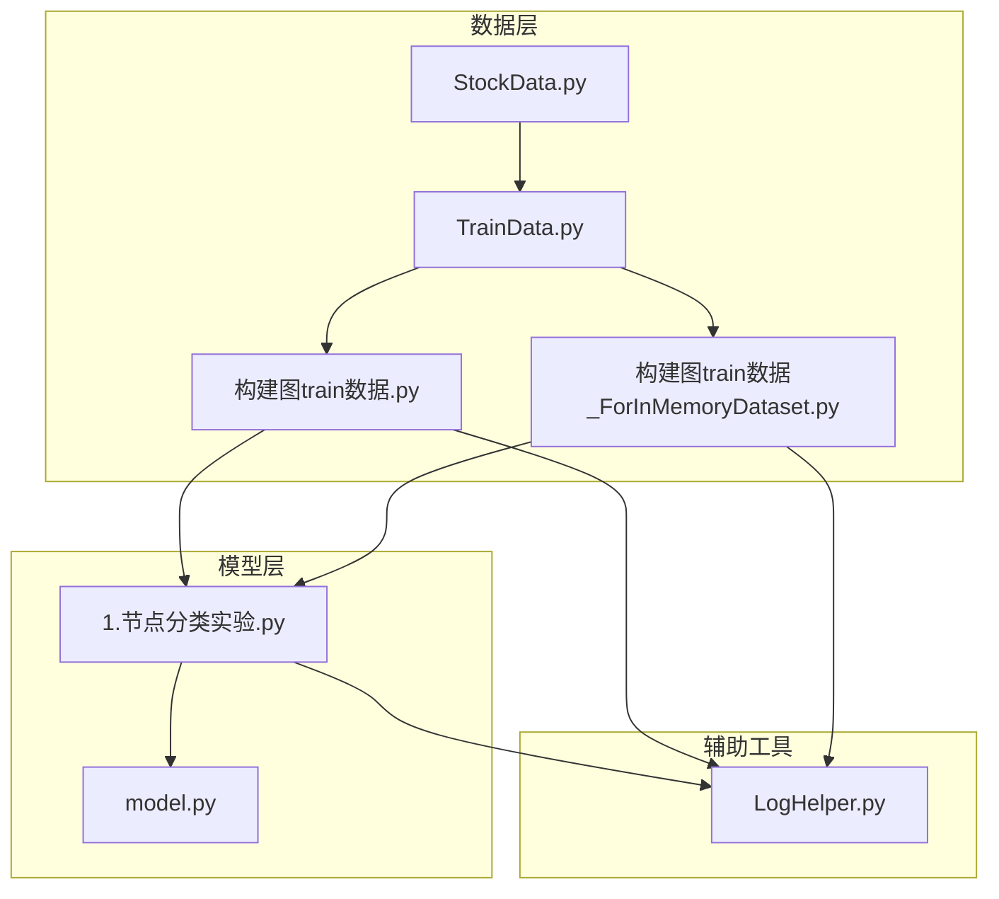
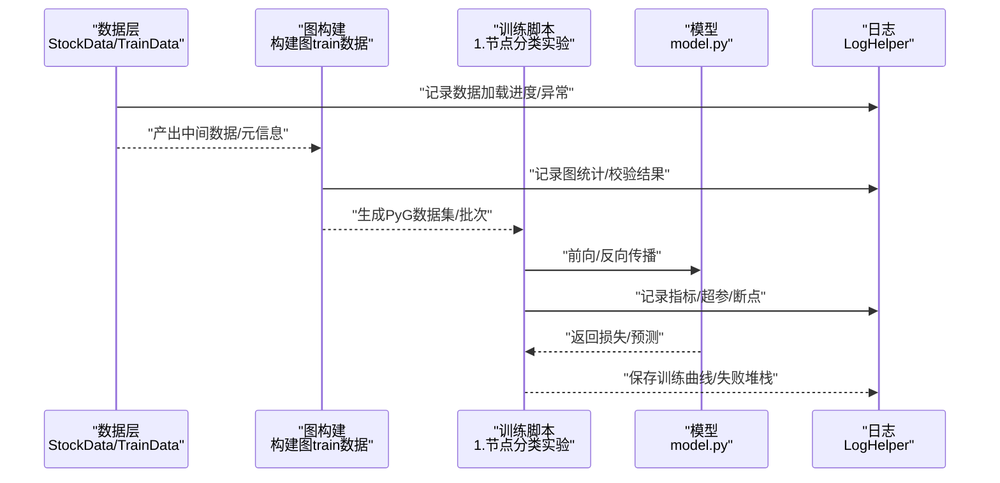
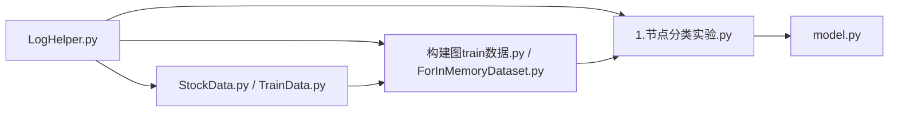
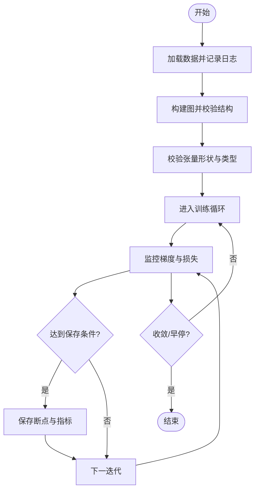

# 调试技巧

<cite>
**本文引用的文件**   
- [LogHelper.py](file://MyProject/Helper/LogHelper.py)
- [StockData.py](file://MyProject/DataBase/StockData.py)
- [TrainData.py](file://MyProject/DataBase/TrainData.py)
- [构建图train数据.py](file://MyProject/DataBase/构建图train数据.py)
- [1.节点分类实验.py](file://MyProject/Model/1.节点分类实验.py)
- [model.py](file://生成train数据/model.py)
- [构建图train数据_ForInMemoryDataset.py](file://生成train数据/构建图train数据_ForInMemoryDataset.py)
</cite>

## 目录
1. [简介](#简介)
2. [项目结构](#项目结构)
3. [核心组件](#核心组件)
4. [架构总览](#架构总览)
5. [详细组件分析](#详细组件分析)
6. [依赖分析](#依赖分析)
7. [性能考虑](#性能考虑)
8. [故障排查指南](#故障排查指南)
9. [结论](#结论)
10. [附录](#附录)

## 简介
本文件面向使用 PyTorch Geometric（PyG）进行图模型训练与推理的开发者，提供一套系统化的调试技巧与最佳实践。内容覆盖：
- 日志记录系统的正确使用：级别划分、结构化输出、文件管理
- PyG 模型的调试方法：图结构验证、张量形状检查、梯度流分析
- 内存泄漏检测与性能瓶颈定位的工具与方法
- 常见错误场景的诊断与解决方案

目标是帮助读者快速定位问题、稳定复现、高效优化。

## 项目结构
本项目围绕“数据准备—模型训练—策略评估”的流程组织代码，关键路径包括：
- 数据层：从行情数据构建图结构并生成训练样本
- 模型层：基于 PyG 的图神经网络实现与训练脚本
- 辅助工具：日志、绘图、随机数、数据库访问等

图表来源
- [StockData.py](file://MyProject/DataBase/StockData.py)
- [TrainData.py](file://MyProject/DataBase/TrainData.py)
- [构建图train数据.py](file://MyProject/DataBase/构建图train数据.py)
- [构建图train数据_ForInMemoryDataset.py](file://生成train数据/构建图train数据_ForInMemoryDataset.py)
- [1.节点分类实验.py](file://MyProject/Model/1.节点分类实验.py)
- [model.py](file://生成train数据/model.py)
- [LogHelper.py](file://MyProject/Helper/LogHelper.py)

章节来源
- [StockData.py](file://MyProject/DataBase/StockData.py)
- [TrainData.py](file://MyProject/DataBase/TrainData.py)
- [构建图train数据.py](file://MyProject/DataBase/构建图train数据.py)
- [构建图train数据_ForInMemoryDataset.py](file://生成train数据/构建图train数据_ForInMemoryDataset.py)
- [1.节点分类实验.py](file://MyProject/Model/1.节点分类实验.py)
- [model.py](file://生成train数据/model.py)
- [LogHelper.py](file://MyProject/Helper/LogHelper.py)

## 核心组件
- 日志组件 LogHelper：统一日志入口，建议按模块/任务配置不同级别与输出目标，支持结构化字段便于检索与分析。
- 数据组件 StockData/TrainData：负责原始数据读取、清洗与中间态存储，是调试时优先核查的数据源。
- 图构建脚本：将时序或关系型数据转换为 PyG Data/Batch 对象，需重点校验边索引、节点特征维度与标签一致性。
- 训练脚本与模型：节点分类实验与 model.py 定义网络前向与损失计算，是梯度与数值稳定性问题的主要定位点。

章节来源
- [LogHelper.py](file://MyProject/Helper/LogHelper.py)
- [StockData.py](file://MyProject/DataBase/StockData.py)
- [TrainData.py](file://MyProject/DataBase/TrainData.py)
- [构建图train数据.py](file://MyProject/DataBase/构建图train数据.py)
- [构建图train数据_ForInMemoryDataset.py](file://生成train数据/构建图train数据_ForInMemoryDataset.py)
- [1.节点分类实验.py](file://MyProject/Model/1.节点分类实验.py)
- [model.py](file://生成train数据/model.py)

## 架构总览
下图展示从数据到训练的端到端流程，以及日志在关键环节的落点。

图表来源
- [StockData.py](file://MyProject/DataBase/StockData.py)
- [TrainData.py](file://MyProject/DataBase/TrainData.py)
- [构建图train数据.py](file://MyProject/DataBase/构建图train数据.py)
- [构建图train数据_ForInMemoryDataset.py](file://生成train数据/构建图train数据_ForInMemoryDataset.py)
- [1.节点分类实验.py](file://MyProject/Model/1.节点分类实验.py)
- [model.py](file://生成train数据/model.py)
- [LogHelper.py](file://MyProject/Helper/LogHelper.py)

## 详细组件分析

### 日志系统：级别、结构与文件管理
- 级别划分建议
  - DEBUG：仅用于本地开发，打印细粒度中间变量、输入形状、迭代步号等
  - INFO：记录关键流程节点（开始/结束）、数据规模、模型参数摘要
  - WARNING：可恢复异常（如缺失列、空图），不影响整体运行但需关注
  - ERROR：不可恢复异常（IO失败、维度不匹配），应附带上下文与堆栈
  - CRITICAL：进程级致命错误，触发告警与自动清理
- 结构化字段建议
  - 固定键：时间戳、进程ID、线程ID、模块名、函数名、级别
  - 业务键：任务ID、数据版本、图ID、节点数、边数、设备、损失值、准确率
- 文件管理
  - 按日期/任务分文件；滚动保留策略（大小+天数）
  - 分离 stdout/stderr 与业务日志；错误日志单独归档
  - 敏感信息脱敏（路径、密钥、用户标识）

章节来源
- [LogHelper.py](file://MyProject/Helper/LogHelper.py)

### 数据与图构建：验证与排错
- 数据一致性
  - 节点特征维度一致；缺失值填充策略明确
  - 标签分布均衡性检查；类别映射唯一性
- 图结构校验
  - 边索引范围不超过节点数；无自环或按需处理
  - 稀疏边矩阵对称性（若需要）；连通分量统计
- 内存友好
  - 大表分批读取；避免一次性全量加载
  - 使用 InMemory 数据集仅在数据规模可控时使用

章节来源
- [StockData.py](file://MyProject/DataBase/StockData.py)
- [TrainData.py](file://MyProject/DataBase/TrainData.py)
- [构建图train数据.py](file://MyProject/DataBase/构建图train数据.py)
- [构建图train数据_ForInMemoryDataset.py](file://生成train数据/构建图train数据_ForInMemoryDataset.py)

### 模型与训练：形状、梯度与数值稳定性
- 张量形状检查
  - 输入 x、edge_index、y 的形状与类型在每次 forward 前后断言
  - Batch 模式下 batch 向量与节点索引对齐
- 梯度流分析
  - 逐层打印/记录梯度范数与均值，定位消失/爆炸
  - 对关键权重启用 requires_grad 检查
- 数值稳定性
  - 损失裁剪、梯度裁剪、数值溢出保护（log/sqrt 前加 epsilon）
  - 混合精度训练时的 loss scale 监控

章节来源
- [1.节点分类实验.py](file://MyProject/Model/1.节点分类实验.py)
- [model.py](file://生成train数据/model.py)

### 训练流程控制与断点续训
- 断点保存：模型权重、优化器状态、训练轮次、指标历史
- 恢复逻辑：校验 checkpoint 版本与模型结构一致性
- 早停与回滚：验证集指标下降时回滚到最佳权重

章节来源
- [1.节点分类实验.py](file://MyProject/Model/1.节点分类实验.py)

## 依赖分析
- 模块耦合
  - 训练脚本依赖图构建产物与模型定义
  - 日志贯穿数据、图构建、训练各阶段
- 外部依赖
  - PyTorch/PyG：注意版本兼容性与 CUDA/cuDNN 驱动匹配
  - 数据源：数据库/CSV 接口变更需同步更新数据层

图表来源
- [LogHelper.py](file://MyProject/Helper/LogHelper.py)
- [StockData.py](file://MyProject/DataBase/StockData.py)
- [TrainData.py](file://MyProject/DataBase/TrainData.py)
- [构建图train数据.py](file://MyProject/DataBase/构建图train数据.py)
- [构建图train数据_ForInMemoryDataset.py](file://生成train数据/构建图train数据_ForInMemoryDataset.py)
- [1.节点分类实验.py](file://MyProject/Model/1.节点分类实验.py)
- [model.py](file://生成train数据/model.py)

章节来源
- [LogHelper.py](file://MyProject/Helper/LogHelper.py)
- [StockData.py](file://MyProject/DataBase/StockData.py)
- [TrainData.py](file://MyProject/DataBase/TrainData.py)
- [构建图train数据.py](file://MyProject/DataBase/构建图train数据.py)
- [构建图train数据_ForInMemoryDataset.py](file://生成train数据/构建图train数据_ForInMemoryDataset.py)
- [1.节点分类实验.py](file://MyProject/Model/1.节点分类实验.py)
- [model.py](file://生成train数据/model.py)

## 性能考虑
- I/O 优化
  - 数据预取与缓存；减少磁盘往返
  - 使用多进程 DataLoader 并行加载
- GPU 利用
  - 批大小与显存权衡；动态批/梯度累积
  - 避免频繁 host-device 拷贝
- 计算优化
  - 算子融合与半精度训练
  - 稀疏图操作选择合适后端（CUDA/CPU）

[本节为通用指导，无需特定文件引用]

## 故障排查指南

### 日志与诊断工作流
- 分级开启日志：先 INFO，再 DEBUG；结合结构化字段过滤
- 关键断点：数据加载完成、图构建完成、每个 epoch 开始/结束、loss 突变处
- 异常捕获：在数据/图构建/训练循环外层 try-except，记录完整上下文与堆栈

章节来源
- [LogHelper.py](file://MyProject/Helper/LogHelper.py)
- [1.节点分类实验.py](file://MyProject/Model/1.节点分类实验.py)

### 图结构验证清单
- 节点数 N、边数 E、特征维度 F 与标签维度 C 的一致性
- edge_index 取值范围 [0, N)，重复边与自环的处理策略
- 训练/验证/测试划分是否覆盖所有节点且无泄露

章节来源
- [构建图train数据.py](file://MyProject/DataBase/构建图train数据.py)
- [构建图train数据_ForInMemoryDataset.py](file://生成train数据/构建图train数据_ForInMemoryDataset.py)

### 张量形状与类型检查
- 输入 x 的 dtype/device 与模型期望一致
- edge_index 为长整型；batch 向量长度等于节点数
- y 的 shape 与损失函数要求匹配（分类/回归）

章节来源
- [1.节点分类实验.py](file://MyProject/Model/1.节点分类实验.py)
- [model.py](file://生成train数据/model.py)

### 梯度流与数值稳定性
- 梯度范数监控：出现 NaN/Inf 时立即停止并记录最近一次输入
- 梯度裁剪阈值设置；损失函数数值保护
- 学习率调度与 warmup 策略

章节来源
- [1.节点分类实验.py](file://MyProject/Model/1.节点分类实验.py)
- [model.py](file://生成train数据/model.py)

### 内存泄漏与性能瓶颈定位
- 内存泄漏
  - 定期释放中间张量；避免在循环中累积历史
  - 使用可视化工具跟踪对象生命周期
- 性能瓶颈
  - 使用性能剖析工具识别热点（I/O、CPU 预处理、GPU kernel）
  - 对比不同批大小、数据加载并行度下的吞吐

章节来源
- [1.节点分类实验.py](file://MyProject/Model/1.节点分类实验.py)
- [构建图train数据.py](file://MyProject/DataBase/构建图train数据.py)

### 常见错误场景与解决思路
- 维度不匹配：核对输入/权重/标签形状与数据类型
- 边索引越界：检查节点编号重映射与去重
- 标签泄露：确保时间/空间划分严格隔离
- 显存不足：减小批大小、启用梯度累积、关闭不必要的梯度
- 训练不收敛：检查学习率、归一化、损失函数与数据质量

章节来源
- [StockData.py](file://MyProject/DataBase/StockData.py)
- [TrainData.py](file://MyProject/DataBase/TrainData.py)
- [构建图train数据.py](file://MyProject/DataBase/构建图train数据.py)
- [1.节点分类实验.py](file://MyProject/Model/1.节点分类实验.py)
- [model.py](file://生成train数据/model.py)

## 结论
通过规范的日志体系、严格的图与张量校验、系统的梯度与数值稳定性监控，以及完善的内存与性能分析方法，可以显著提升 PyG 项目的调试效率与稳定性。建议在工程中固化上述检查点与自动化脚本，形成可复用的调试基线。

## 附录

### 调试流程图（概念）

[此图为概念流程，不对应具体源码文件]