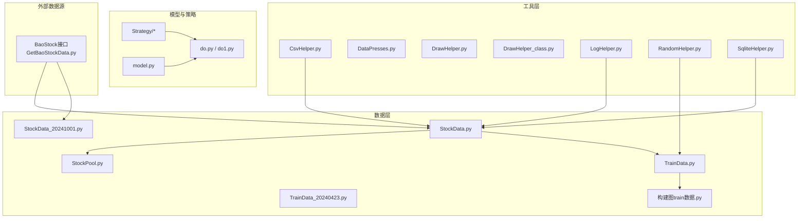
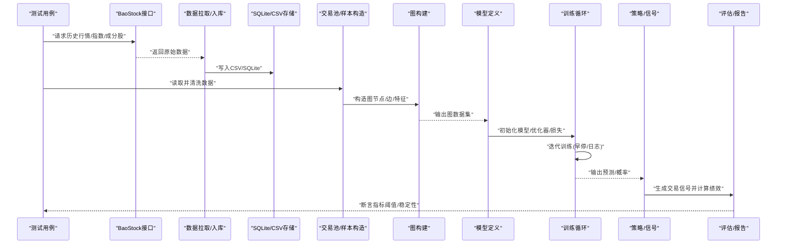
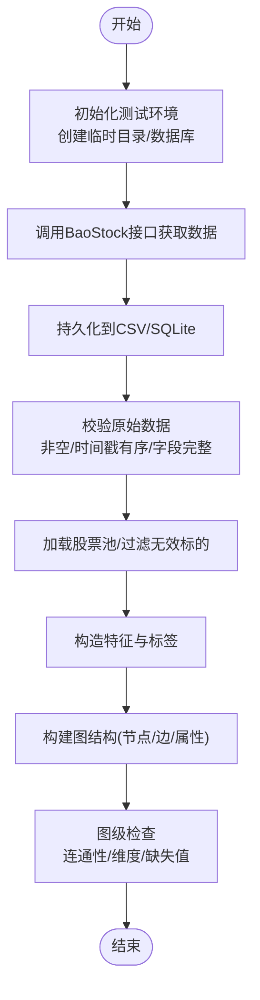
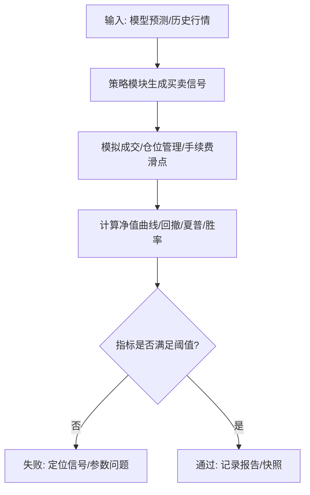
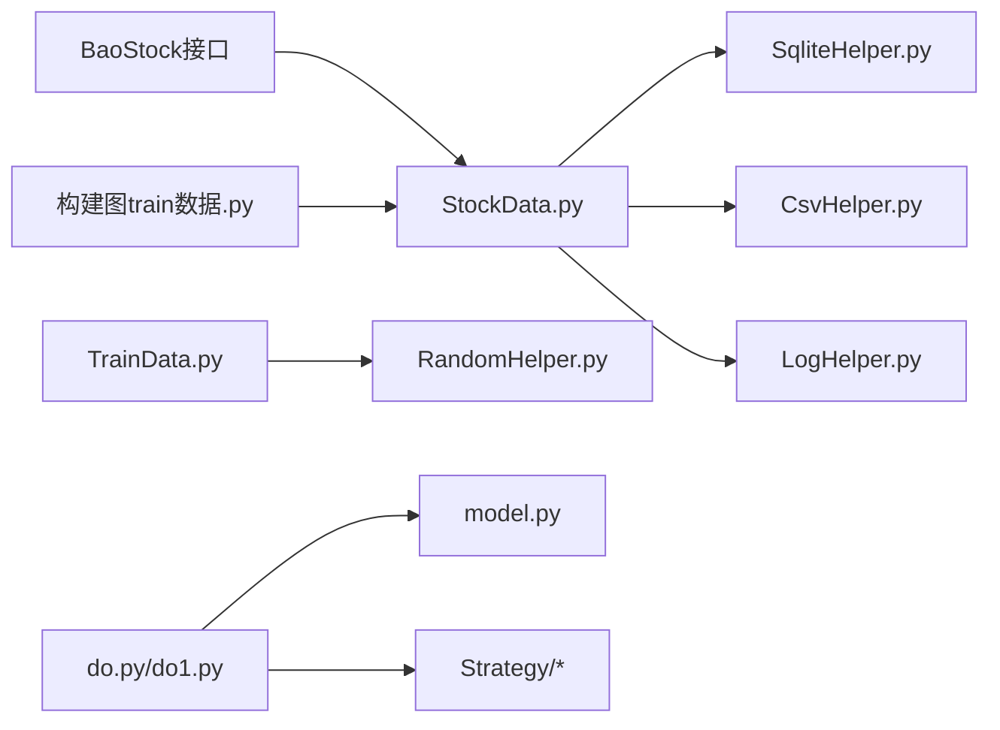

# 集成测试

<cite>
**本文引用的文件**   
- [GetBaoStockData.py](file://GetBaoStockData.py)
- [MyProject/DataBase/StockData.py](file://MyProject/DataBase/StockData.py)
- [MyProject/DataBase/StockData_20241001.py](file://MyProject/DataBase/StockData_20241001.py)
- [MyProject/DataBase/StockPool.py](file://MyProject/DataBase/StockPool.py)
- [MyProject/DataBase/TrainData.py](file://MyProject/DataBase/TrainData.py)
- [MyProject/DataBase/TrainData_20240423.py](file://MyProject/DataBase/TrainData_20240423.py)
- [MyProject/DataBase/构建图train数据.py](file://MyProject/DataBase/构建图train数据.py)
- [MyProject/Helper/CsvHelper.py](file://MyProject/Helper/CsvHelper.py)
- [MyProject/Helper/DataPresses.py](file://MyProject/Helper/DataPresses.py)
- [MyProject/Helper/DrawHelper.py](file://MyProject/Helper/DrawHelper.py)
- [MyProject/Helper/DrawHelper_class.py](file://MyProject/Helper/DrawHelper_class.py)
- [MyProject/Helper/LogHelper.py](file://MyProject/Helper/LogHelper.py)
- [MyProject/Helper/RandomHelper.py](file://MyProject/Helper/RandomHelper.py)
- [MyProject/Helper/SqliteHelper.py](file://MyProject/Helper/SqliteHelper.py)
- [MyProject/Model/Strategy/BLJJ.py](file://MyProject/Model/Strategy/BLJJ.py)
- [MyProject/Model/Strategy/CrossSimple.py](file://MyProject/Model/Strategy/CrossSimple.py)
- [MyProject/Model/Strategy/EMA.py](file://MyProject/Model/Strategy/EMA.py)
- [MyProject/Model/Strategy/MagicNine.py](file://MyProject/Model/Strategy/MagicNine.py)
- [MyProject/Model/Strategy/REF.py](file://MyProject/Model/Strategy/REF.py)
- [MyProject/Model/Strategy/SignalIntervalTrade.py](file://MyProject/Model/Strategy/SignalIntervalTrade.py)
- [MyProject/Model/Strategy/TradeTag.py](file://MyProject/Model/Strategy/TradeTag.py)
- [生成train数据/获取个股票行情.py](file://生成train数据/获取个股票行情.py)
- [生成train数据/获取股市码表.py](file://生成train数据/获取股市码表.py)
- [生成train数据/构建图train数据.py](file://生成train数据/构建图train数据.py)
- [生成train数据/model.py](file://生成train数据/model.py)
- [生成train数据/do.py](file://生成train数据/do.py)
- [生成train数据/do1.py](file://生成train数据/do1.py)
</cite>

## 目录
1. [简介](#简介)
2. [项目结构](#项目结构)
3. [核心组件](#核心组件)
4. [架构总览](#架构总览)
5. [详细组件分析](#详细组件分析)
6. [依赖关系分析](#依赖关系分析)
7. [性能考虑](#性能考虑)
8. [故障排查指南](#故障排查指南)
9. [结论](#结论)
10. [附录](#附录)

## 简介
本文件面向“GNN股票预测”项目的端到端集成测试策略，覆盖从BaoStock数据拉取、清洗与入库，到图构建、模型训练与回测评估的完整链路。文档提供：
- 数据管道端到端测试方案（含异常与边界场景）
- 模型训练集成测试方法（数据加载、初始化、训练循环、结果验证）
- 策略回测集成测试方案（信号生成与绩效指标校验）
- 测试环境搭建与数据隔离策略
- 关键流程图与时序图，便于快速落地执行

## 项目结构
仓库按功能域组织：
- 数据层：数据库访问、原始数据拉取、交易池管理、训练数据准备
- 工具层：CSV/SQLite辅助、日志、随机数、绘图等
- 模型与策略：策略实现、标签生成、训练脚本入口
- 生成训练数据：独立的数据生产与建模流程脚本



图表来源
- [GetBaoStockData.py](file://GetBaoStockData.py)
- [MyProject/DataBase/StockData.py](file://MyProject/DataBase/StockData.py)
- [MyProject/DataBase/StockData_20241001.py](file://MyProject/DataBase/StockData_20241001.py)
- [MyProject/DataBase/StockPool.py](file://MyProject/DataBase/StockPool.py)
- [MyProject/DataBase/TrainData.py](file://MyProject/DataBase/TrainData.py)
- [MyProject/DataBase/构建图train数据.py](file://MyProject/DataBase/构建图train数据.py)
- [MyProject/Helper/CsvHelper.py](file://MyProject/Helper/CsvHelper.py)
- [MyProject/Helper/SqliteHelper.py](file://MyProject/Helper/SqliteHelper.py)
- [MyProject/Helper/LogHelper.py](file://MyProject/Helper/LogHelper.py)
- [MyProject/Helper/RandomHelper.py](file://MyProject/Helper/RandomHelper.py)
- [生成train数据/model.py](file://生成train数据/model.py)
- [生成train数据/do.py](file://生成train数据/do.py)
- [生成train数据/do1.py](file://生成train数据/do1.py)

章节来源
- [GetBaoStockData.py](file://GetBaoStockData.py)
- [MyProject/DataBase/StockData.py](file://MyProject/DataBase/StockData.py)
- [MyProject/DataBase/StockData_20241001.py](file://MyProject/DataBase/StockData_20241001.py)
- [MyProject/DataBase/StockPool.py](file://MyProject/DataBase/StockPool.py)
- [MyProject/DataBase/TrainData.py](file://MyProject/DataBase/TrainData.py)
- [MyProject/DataBase/构建图train数据.py](file://MyProject/DataBase/构建图train数据.py)
- [MyProject/Helper/CsvHelper.py](file://MyProject/Helper/CsvHelper.py)
- [MyProject/Helper/SqliteHelper.py](file://MyProject/Helper/SqliteHelper.py)
- [MyProject/Helper/LogHelper.py](file://MyProject/Helper/LogHelper.py)
- [MyProject/Helper/RandomHelper.py](file://MyProject/Helper/RandomHelper.py)
- [生成train数据/model.py](file://生成train数据/model.py)
- [生成train数据/do.py](file://生成train数据/do.py)
- [生成train数据/do1.py](file://生成train数据/do1.py)

## 核心组件
- 数据拉取与入库
  - BaoStock数据获取与本地落盘（CSV/SQLite）
  - 股票池管理与标的筛选
- 训练数据准备
  - 特征工程、标签生成、时间窗口划分
  - 图结构构建（节点=标的/因子，边=相关性或行业关联）
- 模型与训练
  - 模型定义、数据加载器、训练循环、保存与恢复
- 策略与回测
  - 交易信号生成、持仓与资金曲线、绩效指标计算

章节来源
- [MyProject/DataBase/StockData.py](file://MyProject/DataBase/StockData.py)
- [MyProject/DataBase/StockData_20241001.py](file://MyProject/DataBase/StockData_20241001.py)
- [MyProject/DataBase/StockPool.py](file://MyProject/DataBase/StockPool.py)
- [MyProject/DataBase/TrainData.py](file://MyProject/DataBase/TrainData.py)
- [MyProject/DataBase/构建图train数据.py](file://MyProject/DataBase/构建图train数据.py)
- [生成train数据/model.py](file://生成train数据/model.py)
- [生成train数据/do.py](file://生成train数据/do.py)
- [生成train数据/do1.py](file://生成train数据/do1.py)
- [MyProject/Model/Strategy/*.py](file://MyProject/Model/Strategy/BLJJ.py)

## 架构总览
端到端数据与训练流水线如下：



图表来源
- [GetBaoStockData.py](file://GetBaoStockData.py)
- [MyProject/DataBase/StockData.py](file://MyProject/DataBase/StockData.py)
- [MyProject/DataBase/StockData_20241001.py](file://MyProject/DataBase/StockData_20241001.py)
- [MyProject/DataBase/StockPool.py](file://MyProject/DataBase/StockPool.py)
- [MyProject/DataBase/构建图train数据.py](file://MyProject/DataBase/构建图train数据.py)
- [生成train数据/model.py](file://生成train数据/model.py)
- [生成train数据/do.py](file://生成train数据/do.py)

## 详细组件分析

### 数据管道端到端测试
目标：验证从BaoStock拉取到图构建的完整性与一致性。



图表来源
- [GetBaoStockData.py](file://GetBaoStockData.py)
- [MyProject/DataBase/StockData.py](file://MyProject/DataBase/StockData.py)
- [MyProject/DataBase/StockData_20241001.py](file://MyProject/DataBase/StockData_20241001.py)
- [MyProject/DataBase/StockPool.py](file://MyProject/DataBase/StockPool.py)
- [MyProject/DataBase/构建图train数据.py](file://MyProject/DataBase/构建图train数据.py)
- [MyProject/Helper/SqliteHelper.py](file://MyProject/Helper/SqliteHelper.py)
- [MyProject/Helper/CsvHelper.py](file://MyProject/Helper/CsvHelper.py)

章节来源
- [MyProject/DataBase/StockData.py](file://MyProject/DataBase/StockData.py)
- [MyProject/DataBase/StockData_20241001.py](file://MyProject/DataBase/StockData_20241001.py)
- [MyProject/DataBase/StockPool.py](file://MyProject/DataBase/StockPool.py)
- [MyProject/DataBase/构建图train数据.py](file://MyProject/DataBase/构建图train数据.py)
- [MyProject/Helper/SqliteHelper.py](file://MyProject/Helper/SqliteHelper.py)
- [MyProject/Helper/CsvHelper.py](file://MyProject/Helper/CsvHelper.py)

### 模型训练集成测试
目标：验证数据加载、模型初始化、训练循环与结果可复现性。

```mermaid
sequenceDiagram
participant T as "测试用例"
participant DS as "数据集/图数据"
participant MD as "模型定义"
participant OPT as "优化器/调度器"
participant TR as "训练循环"
participant CKPT as "检查点/日志"
participant VAL as "验证集/指标"
T->>DS : "加载/切分训练/验证集"
T->>MD : "实例化模型(参数固定)"
T->>OPT : "配置优化器/学习率策略"
T->>TR : "启动训练(固定epoch/batch)"
TR->>CKPT : "保存权重/记录日志"
TR->>VAL : "计算验证指标"
VAL-->>T : "断言收敛/不下降/阈值通过"
```

图表来源
- [生成train数据/model.py](file://生成train数据/model.py)
- [生成train数据/do.py](file://生成train数据/do.py)
- [生成train数据/do1.py](file://生成train数据/do1.py)
- [MyProject/DataBase/TrainData.py](file://MyProject/DataBase/TrainData.py)
- [MyProject/DataBase/构建图train数据.py](file://MyProject/DataBase/构建图train数据.py)

章节来源
- [生成train数据/model.py](file://生成train数据/model.py)
- [生成train数据/do.py](file://生成train数据/do.py)
- [生成train数据/do1.py](file://生成train数据/do1.py)
- [MyProject/DataBase/TrainData.py](file://MyProject/DataBase/TrainData.py)
- [MyProject/DataBase/构建图train数据.py](file://MyProject/DataBase/构建图train数据.py)

### 策略回测集成测试
目标：确保交易信号生成正确且绩效评估稳定。



图表来源
- [MyProject/Model/Strategy/BLJJ.py](file://MyProject/Model/Strategy/BLJJ.py)
- [MyProject/Model/Strategy/CrossSimple.py](file://MyProject/Model/Strategy/CrossSimple.py)
- [MyProject/Model/Strategy/EMA.py](file://MyProject/Model/Strategy/EMA.py)
- [MyProject/Model/Strategy/MagicNine.py](file://MyProject/Model/Strategy/MagicNine.py)
- [MyProject/Model/Strategy/REF.py](file://MyProject/Model/Strategy/REF.py)
- [MyProject/Model/Strategy/SignalIntervalTrade.py](file://MyProject/Model/Strategy/SignalIntervalTrade.py)
- [MyProject/Model/Strategy/TradeTag.py](file://MyProject/Model/Strategy/TradeTag.py)

章节来源
- [MyProject/Model/Strategy/BLJJ.py](file://MyProject/Model/Strategy/BLJJ.py)
- [MyProject/Model/Strategy/CrossSimple.py](file://MyProject/Model/Strategy/CrossSimple.py)
- [MyProject/Model/Strategy/EMA.py](file://MyProject/Model/Strategy/EMA.py)
- [MyProject/Model/Strategy/MagicNine.py](file://MyProject/Model/Strategy/MagicNine.py)
- [MyProject/Model/Strategy/REF.py](file://MyProject/Model/Strategy/REF.py)
- [MyProject/Model/Strategy/SignalIntervalTrade.py](file://MyProject/Model/Strategy/SignalIntervalTrade.py)
- [MyProject/Model/Strategy/TradeTag.py](file://MyProject/Model/Strategy/TradeTag.py)

## 依赖关系分析
- 外部依赖
  - BaoStock接口：网络请求、限流、重试
  - SQLite/CSV：本地持久化
  - PyTorch/PyG：张量与图数据结构
- 内部耦合
  - 数据层对工具层的依赖（CSV/SQLite/日志/随机）
  - 训练脚本对数据层与模型定义的依赖
  - 策略模块对预测结果的消费



图表来源
- [GetBaoStockData.py](file://GetBaoStockData.py)
- [MyProject/DataBase/StockData.py](file://MyProject/DataBase/StockData.py)
- [MyProject/DataBase/StockData_20241001.py](file://MyProject/DataBase/StockData_20241001.py)
- [MyProject/DataBase/TrainData.py](file://MyProject/DataBase/TrainData.py)
- [MyProject/DataBase/构建图train数据.py](file://MyProject/DataBase/构建图train数据.py)
- [MyProject/Helper/SqliteHelper.py](file://MyProject/Helper/SqliteHelper.py)
- [MyProject/Helper/CsvHelper.py](file://MyProject/Helper/CsvHelper.py)
- [MyProject/Helper/LogHelper.py](file://MyProject/Helper/LogHelper.py)
- [MyProject/Helper/RandomHelper.py](file://MyProject/Helper/RandomHelper.py)
- [生成train数据/model.py](file://生成train数据/model.py)
- [生成train数据/do.py](file://生成train数据/do.py)
- [生成train数据/do1.py](file://生成train数据/do1.py)
- [MyProject/Model/Strategy/*.py](file://MyProject/Model/Strategy/BLJJ.py)

章节来源
- [MyProject/DataBase/StockData.py](file://MyProject/DataBase/StockData.py)
- [MyProject/DataBase/StockData_20241001.py](file://MyProject/DataBase/StockData_20241001.py)
- [MyProject/DataBase/TrainData.py](file://MyProject/DataBase/TrainData.py)
- [MyProject/DataBase/构建图train数据.py](file://MyProject/DataBase/构建图train数据.py)
- [MyProject/Helper/SqliteHelper.py](file://MyProject/Helper/SqliteHelper.py)
- [MyProject/Helper/CsvHelper.py](file://MyProject/Helper/CsvHelper.py)
- [MyProject/Helper/LogHelper.py](file://MyProject/Helper/LogHelper.py)
- [MyProject/Helper/RandomHelper.py](file://MyProject/Helper/RandomHelper.py)
- [生成train数据/model.py](file://生成train数据/model.py)
- [生成train数据/do.py](file://生成train数据/do.py)
- [生成train数据/do1.py](file://生成train数据/do1.py)
- [MyProject/Model/Strategy/*.py](file://MyProject/Model/Strategy/BLJJ.py)

## 性能考虑
- 数据I/O
  - 批量写入SQLite/CSV，避免逐行插入
  - 使用索引与分区键（如日期、股票代码）提升查询效率
- 图构建
  - 邻接矩阵/CSR稀疏表示，减少内存占用
  - 并行构建子图，控制最大节点/边规模
- 训练
  - 小批量训练+梯度累积，平衡显存与稳定性
  - 早停与学习率衰减，缩短收敛时间
- 回测
  - 向量化计算净值与指标，避免逐笔循环
  - 缓存中间结果，减少重复计算

[本节为通用指导，无需源码引用]

## 故障排查指南
- 数据拉取失败
  - 检查网络连通性与BaoStock限流；增加重试与退避
  - 校验返回字段与时间序列连续性
- 数据入库异常
  - 确认SQLite连接与事务提交；CSV编码与分隔符一致
  - 断言必填字段非空、时间戳单调递增
- 图构建错误
  - 检查节点/边维度对齐、缺失值填充策略
  - 验证图的连通性与无孤立节点（业务允许时）
- 训练不收敛
  - 固定随机种子，确保可复现
  - 检查学习率、批大小、损失函数与标签分布
- 回测异常
  - 核对信号与成交逻辑（滑点、手续费、涨跌停限制）
  - 断言净值曲线单调性（在单方向策略下）与指标范围

章节来源
- [MyProject/Helper/LogHelper.py](file://MyProject/Helper/LogHelper.py)
- [MyProject/Helper/SqliteHelper.py](file://MyProject/Helper/SqliteHelper.py)
- [MyProject/Helper/CsvHelper.py](file://MyProject/Helper/CsvHelper.py)
- [MyProject/Helper/RandomHelper.py](file://MyProject/Helper/RandomHelper.py)

## 结论
本集成测试策略以“端到端可复现、分层断言、数据隔离”为核心原则，覆盖数据、训练与回测三大环节。建议将测试用例纳入CI，结合最小数据集与轻量模型进行快速回归，同时保留全量数据的周期型深度测试。

[本节为总结性内容，无需源码引用]

## 附录

### 测试环境搭建与数据隔离
- 环境
  - Python虚拟环境，固定依赖版本
  - 可选GPU加速（CUDA/cuDNN），CPU降级路径
- 数据隔离
  - 每个测试进程使用独立的临时目录与SQLite文件
  - 测试前清理旧数据，测试后自动回收
- 配置
  - 通过环境变量或配置文件注入：数据路径、模型超参、回测参数
- 可观测性
  - 统一日志格式，包含时间戳、阶段、关键指标
  - 断言失败时导出最小可复现场景（数据切片、权重、日志）

章节来源
- [MyProject/Helper/LogHelper.py](file://MyProject/Helper/LogHelper.py)
- [MyProject/Helper/SqliteHelper.py](file://MyProject/Helper/SqliteHelper.py)
- [MyProject/Helper/CsvHelper.py](file://MyProject/Helper/CsvHelper.py)
- [生成train数据/do.py](file://生成train数据/do.py)
- [生成train数据/do1.py](file://生成train数据/do1.py)