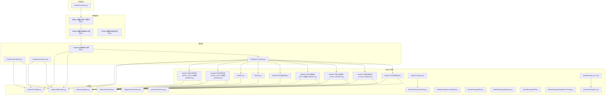
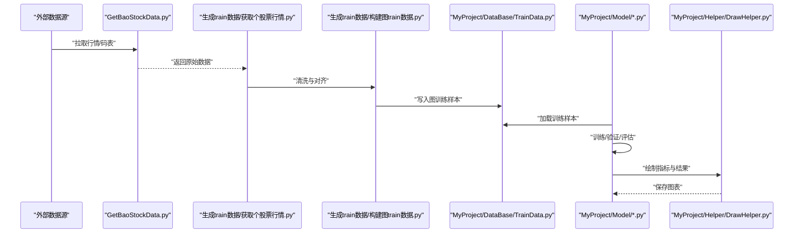
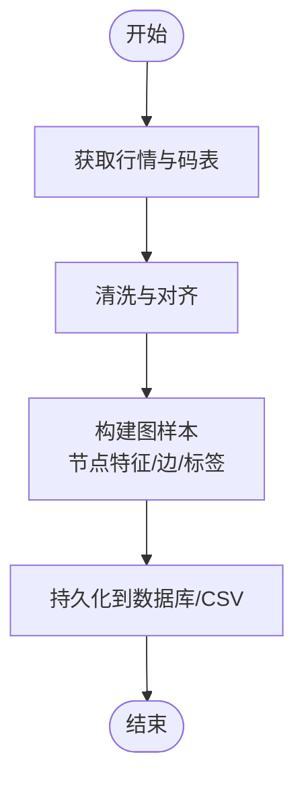
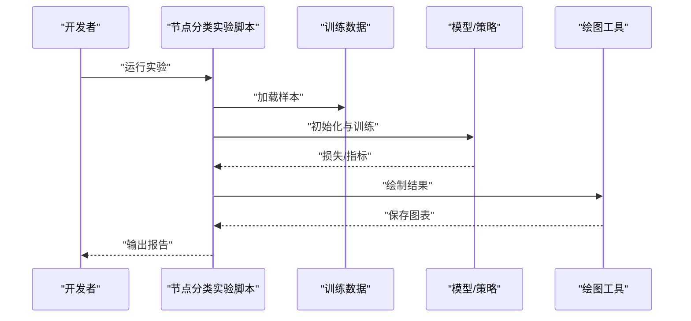
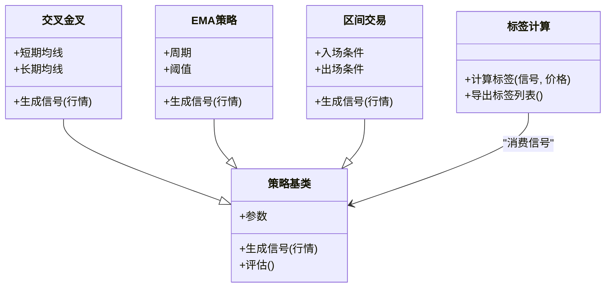
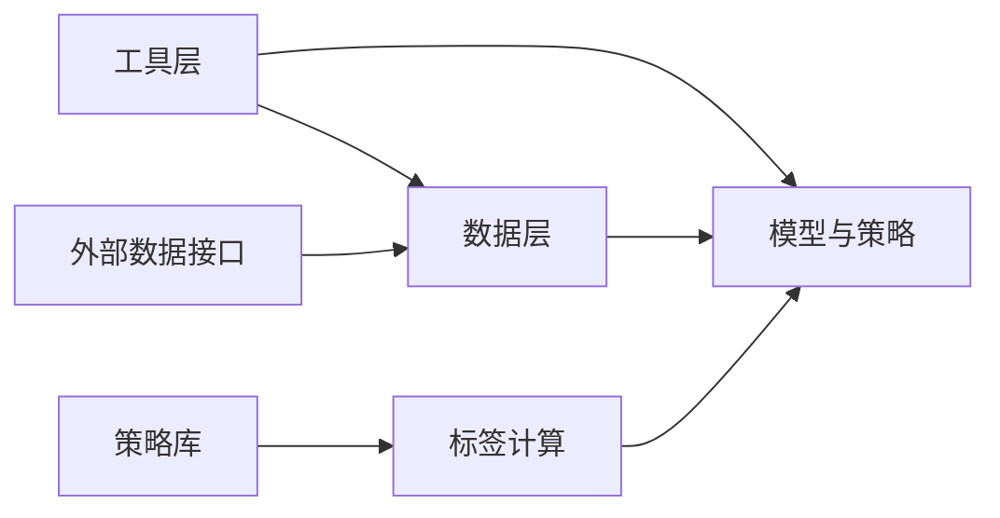

# 开发指南

<cite>
**本文引用的文件**   
- [MyProject/DataBase/StockData.py](file://MyProject/DataBase/StockData.py)
- [MyProject/DataBase/StockPool.py](file://MyProject/DataBase/StockPool.py)
- [MyProject/DataBase/TrainData.py](file://MyProject/DataBase/TrainData.py)
- [MyProject/DataBase/构建图train数据.py](file://MyProject/DataBase/构建图train数据.py)
- [MyProject/Helper/CsvHelper.py](file://MyProject/Helper/CsvHelper.py)
- [MyProject/Helper/DataPresses.py](file://MyProject/Helper/DataPresses.py)
- [MyProject/Helper/DrawHelper.py](file://MyProject/Helper/DrawHelper.py)
- [MyProject/Helper/LogHelper.py](file://MyProject/Helper/LogHelper.py)
- [MyProject/Helper/RandomHelper.py](file://MyProject/Helper/RandomHelper.py)
- [MyProject/Helper/SqliteHelper.py](file://MyProject/Helper/SqliteHelper.py)
- [MyProject/Model/Strategy/BLJJ.py](file://MyProject/Model/Strategy/BLJJ.py)
- [MyProject/Model/Strategy/CrossSimple.py](file://MyProject/Model/Strategy/CrossSimple.py)
- [MyProject/Model/Strategy/EMA.py](file://MyProject/Model/Strategy/EMA.py)
- [MyProject/Model/Strategy/MagicNine.py](file://MyProject/Model/Strategy/MagicNine.py)
- [MyProject/Model/Strategy/REF.py](file://MyProject/Model/Strategy/REF.py)
- [MyProject/Model/Strategy/SignalIntervalTrade.py](file://MyProject/Model/Strategy/SignalIntervalTrade.py)
- [MyProject/Model/Strategy/TradeTag.py](file://MyProject/Model/Strategy/TradeTag.py)
- [MyProject/Model/1.节点分类实验.py](file://MyProject/Model/1.节点分类实验.py)
- [MyProject/Model/2.节点分类实验_74.19%_20240423.py](file://MyProject/Model/2.节点分类实验_74.19%_20240423.py)
- [MyProject/Model/3.节点分类实验_79.57%_20240413.py](file://MyProject/Model/3.节点分类实验_79.57%_20240413.py)
- [MyProject/Model/4.节点分类实验_80.7%+画图_20240521.py](file://MyProject/Model/4.节点分类实验_80.7%+画图_20240521.py)
- [MyProject/Model/5.节点分类实验.py](file://MyProject/Model/5.节点分类实验.py)
- [MyProject/Model/6.py](file://MyProject/Model/6.py)
- [MyProject/Model/7.py](file://MyProject/Model/7.py)
- [MyProject/Model/8.节点分类实验_MACD_93.47%+画图_20240505.py](file://MyProject/Model/8.节点分类实验_MACD_93.47%+画图_20240505.py)
- [MyProject/Model/9.节点分类实验_MACD_93.47%+画图_20240505.py](file://MyProject/Model/9.节点分类实验_MACD_93.47%+画图_20240505.py)
- [MyProject/Model/CalTagList.py](file://MyProject/Model/CalTagList.py)
- [MyProject/Model/Strategy_BLJJ.py](file://MyProject/Model/Strategy_BLJJ.py)
- [生成train数据/构建图train数据.py](file://生成train数据/构建图train数据.py)
- [生成train数据/获取个股票行情.py](file://生成train数据/获取个股票行情.py)
- [生成train数据/获取股市码表.py](file://生成train数据/获取股市码表.py)
- [GetBaoStockData.py](file://GetBaoStockData.py)
</cite>

## 目录
1. [简介](#简介)
2. [项目结构](#项目结构)
3. [核心组件](#核心组件)
4. [架构总览](#架构总览)
5. [详细组件分析](#详细组件分析)
6. [依赖分析](#依赖分析)
7. [性能考虑](#性能考虑)
8. [故障排查指南](#故障排查指南)
9. [结论](#结论)
10. [附录](#附录)

## 简介
本指南面向新加入的开发者，提供从环境搭建、代码规范、功能开发流程、测试与审查、调试与性能分析到贡献流程的完整说明。项目围绕“基于图神经网络的股票交易策略”展开，包含数据获取与清洗、训练数据构建、模型实验与评估、策略实现与可视化等模块。

## 项目结构
仓库采用按职责分层的组织方式：
- MyProject/DataBase：原始与中间数据存储（股票池、行情、训练集）
- MyProject/Helper：通用工具（CSV、SQLite、日志、绘图、随机数、压缩）
- MyProject/Model：模型实验脚本与策略实现
- 生成train数据：离线数据准备与批量处理脚本
- 根目录：外部数据源接口脚本

图表来源
- [MyProject/DataBase/StockData.py](file://MyProject/DataBase/StockData.py)
- [MyProject/DataBase/StockPool.py](file://MyProject/DataBase/StockPool.py)
- [MyProject/DataBase/TrainData.py](file://MyProject/DataBase/TrainData.py)
- [MyProject/DataBase/构建图train数据.py](file://MyProject/DataBase/构建图train数据.py)
- [MyProject/Helper/CsvHelper.py](file://MyProject/Helper/CsvHelper.py)
- [MyProject/Helper/SqliteHelper.py](file://MyProject/Helper/SqliteHelper.py)
- [MyProject/Helper/LogHelper.py](file://MyProject/Helper/LogHelper.py)
- [MyProject/Helper/DrawHelper.py](file://MyProject/Helper/DrawHelper.py)
- [MyProject/Helper/RandomHelper.py](file://MyProject/Helper/RandomHelper.py)
- [MyProject/Helper/DataPresses.py](file://MyProject/Helper/DataPresses.py)
- [MyProject/Model/1.节点分类实验.py](file://MyProject/Model/1.节点分类实验.py)
- [MyProject/Model/2.节点分类实验_74.19%_20240423.py](file://MyProject/Model/2.节点分类实验_74.19%_20240423.py)
- [MyProject/Model/3.节点分类实验_79.57%_20240413.py](file://MyProject/Model/3.节点分类实验_79.57%_20240413.py)
- [MyProject/Model/4.节点分类实验_80.7%+画图_20240521.py](file://MyProject/Model/4.节点分类实验_80.7%+画图_20240521.py)
- [MyProject/Model/5.节点分类实验.py](file://MyProject/Model/5.节点分类实验.py)
- [MyProject/Model/6.py](file://MyProject/Model/6.py)
- [MyProject/Model/7.py](file://MyProject/Model/7.py)
- [MyProject/Model/8.节点分类实验_MACD_93.47%+画图_20240505.py](file://MyProject/Model/8.节点分类实验_MACD_93.47%+画图_20240505.py)
- [MyProject/Model/9.节点分类实验_MACD_93.47%+画图_20240505.py](file://MyProject/Model/9.节点分类实验_MACD_93.47%+画图_20240505.py)
- [MyProject/Model/Strategy/BLJJ.py](file://MyProject/Model/Strategy/BLJJ.py)
- [MyProject/Model/Strategy/CrossSimple.py](file://MyProject/Model/Strategy/CrossSimple.py)
- [MyProject/Model/Strategy/EMA.py](file://MyProject/Model/Strategy/EMA.py)
- [MyProject/Model/Strategy/MagicNine.py](file://MyProject/Model/Strategy/MagicNine.py)
- [MyProject/Model/Strategy/REF.py](file://MyProject/Model/Strategy/REF.py)
- [MyProject/Model/Strategy/SignalIntervalTrade.py](file://MyProject/Model/Strategy/SignalIntervalTrade.py)
- [MyProject/Model/Strategy/TradeTag.py](file://MyProject/Model/Strategy/TradeTag.py)
- [MyProject/Model/CalTagList.py](file://MyProject/Model/CalTagList.py)
- [MyProject/Model/Strategy_BLJJ.py](file://MyProject/Model/Strategy_BLJJ.py)
- [生成train数据/构建图train数据.py](file://生成train数据/构建图train数据.py)
- [生成train数据/获取个股票行情.py](file://生成train数据/获取个股票行情.py)
- [生成train数据/获取股市码表.py](file://生成train数据/获取股市码表.py)
- [GetBaoStockData.py](file://GetBaoStockData.py)

章节来源
- [MyProject/DataBase/StockData.py](file://MyProject/DataBase/StockData.py)
- [MyProject/DataBase/StockPool.py](file://MyProject/DataBase/StockPool.py)
- [MyProject/DataBase/TrainData.py](file://MyProject/DataBase/TrainData.py)
- [MyProject/DataBase/构建图train数据.py](file://MyProject/DataBase/构建图train数据.py)
- [MyProject/Helper/CsvHelper.py](file://MyProject/Helper/CsvHelper.py)
- [MyProject/Helper/SqliteHelper.py](file://MyProject/Helper/SqliteHelper.py)
- [MyProject/Helper/LogHelper.py](file://MyProject/Helper/LogHelper.py)
- [MyProject/Helper/DrawHelper.py](file://MyProject/Helper/DrawHelper.py)
- [MyProject/Helper/RandomHelper.py](file://MyProject/Helper/RandomHelper.py)
- [MyProject/Helper/DataPresses.py](file://MyProject/Helper/DataPresses.py)
- [MyProject/Model/1.节点分类实验.py](file://MyProject/Model/1.节点分类实验.py)
- [MyProject/Model/2.节点分类实验_74.19%_20240423.py](file://MyProject/Model/2.节点分类实验_74.19%_20240423.py)
- [MyProject/Model/3.节点分类实验_79.57%_20240413.py](file://MyProject/Model/3.节点分类实验_79.57%_20240413.py)
- [MyProject/Model/4.节点分类实验_80.7%+画图_20240521.py](file://MyProject/Model/4.节点分类实验_80.7%+画图_20240521.py)
- [MyProject/Model/5.节点分类实验.py](file://MyProject/Model/5.节点分类实验.py)
- [MyProject/Model/6.py](file://MyProject/Model/6.py)
- [MyProject/Model/7.py](file://MyProject/Model/7.py)
- [MyProject/Model/8.节点分类实验_MACD_93.47%+画图_20240505.py](file://MyProject/Model/8.节点分类实验_MACD_93.47%+画图_20240505.py)
- [MyProject/Model/9.节点分类实验_MACD_93.47%+画图_20240505.py](file://MyProject/Model/9.节点分类实验_MACD_93.47%+画图_20240505.py)
- [MyProject/Model/Strategy/BLJJ.py](file://MyProject/Model/Strategy/BLJJ.py)
- [MyProject/Model/Strategy/CrossSimple.py](file://MyProject/Model/Strategy/CrossSimple.py)
- [MyProject/Model/Strategy/EMA.py](file://MyProject/Model/Strategy/EMA.py)
- [MyProject/Model/Strategy/MagicNine.py](file://MyProject/Model/Strategy/MagicNine.py)
- [MyProject/Model/Strategy/REF.py](file://MyProject/Model/Strategy/REF.py)
- [MyProject/Model/Strategy/SignalIntervalTrade.py](file://MyProject/Model/Strategy/SignalIntervalTrade.py)
- [MyProject/Model/Strategy/TradeTag.py](file://MyProject/Model/Strategy/TradeTag.py)
- [MyProject/Model/CalTagList.py](file://MyProject/Model/CalTagList.py)
- [MyProject/Model/Strategy_BLJJ.py](file://MyProject/Model/Strategy_BLJJ.py)
- [生成train数据/构建图train数据.py](file://生成train数据/构建图train数据.py)
- [生成train数据/获取个股票行情.py](file://生成train数据/获取个股票行情.py)
- [生成train数据/获取股市码表.py](file://生成train数据/获取股市码表.py)
- [GetBaoStockData.py](file://GetBaoStockData.py)

## 核心组件
- 数据层
  - StockData.py：封装个股行情数据的读取、缓存与基础预处理。
  - StockPool.py：维护股票池与标的筛选逻辑。
  - TrainData.py：训练数据集的构造、划分与持久化。
  - 构建图train数据.py：将时序行情转化为图结构样本，供GNN训练使用。
- 工具层
  - CsvHelper.py / SqliteHelper.py：CSV与SQLite读写封装。
  - LogHelper.py：统一日志输出与轮转配置。
  - DrawHelper.py：指标曲线与结果可视化。
  - RandomHelper.py：可复现实验的随机种子管理。
  - DataPresses.py：数据压缩与解压辅助。
- 模型与策略
  - 节点分类实验脚本（1~9）：不同特征与超参的实验入口，通常调用训练数据并输出指标与图表。
  - Strategy/*：策略信号与标签生成（如交叉金叉、EMA、MACD、区间交易、自定义标签）。
  - CalTagList.py / Strategy_BLJJ.py：标签计算与特定策略封装。

章节来源
- [MyProject/DataBase/StockData.py](file://MyProject/DataBase/StockData.py)
- [MyProject/DataBase/StockPool.py](file://MyProject/DataBase/StockPool.py)
- [MyProject/DataBase/TrainData.py](file://MyProject/DataBase/TrainData.py)
- [MyProject/DataBase/构建图train数据.py](file://MyProject/DataBase/构建图train数据.py)
- [MyProject/Helper/CsvHelper.py](file://MyProject/Helper/CsvHelper.py)
- [MyProject/Helper/SqliteHelper.py](file://MyProject/Helper/SqliteHelper.py)
- [MyProject/Helper/LogHelper.py](file://MyProject/Helper/LogHelper.py)
- [MyProject/Helper/DrawHelper.py](file://MyProject/Helper/DrawHelper.py)
- [MyProject/Helper/RandomHelper.py](file://MyProject/Helper/RandomHelper.py)
- [MyProject/Helper/DataPresses.py](file://MyProject/Helper/DataPresses.py)
- [MyProject/Model/1.节点分类实验.py](file://MyProject/Model/1.节点分类实验.py)
- [MyProject/Model/2.节点分类实验_74.19%_20240423.py](file://MyProject/Model/2.节点分类实验_74.19%_20240423.py)
- [MyProject/Model/3.节点分类实验_79.57%_20240413.py](file://MyProject/Model/3.节点分类实验_79.57%_20240413.py)
- [MyProject/Model/4.节点分类实验_80.7%+画图_20240521.py](file://MyProject/Model/4.节点分类实验_80.7%+画图_20240521.py)
- [MyProject/Model/5.节点分类实验.py](file://MyProject/Model/5.节点分类实验.py)
- [MyProject/Model/6.py](file://MyProject/Model/6.py)
- [MyProject/Model/7.py](file://MyProject/Model/7.py)
- [MyProject/Model/8.节点分类实验_MACD_93.47%+画图_20240505.py](file://MyProject/Model/8.节点分类实验_MACD_93.47%+画图_20240505.py)
- [MyProject/Model/9.节点分类实验_MACD_93.47%+画图_20240505.py](file://MyProject/Model/9.节点分类实验_MACD_93.47%+画图_20240505.py)
- [MyProject/Model/Strategy/BLJJ.py](file://MyProject/Model/Strategy/BLJJ.py)
- [MyProject/Model/Strategy/CrossSimple.py](file://MyProject/Model/Strategy/CrossSimple.py)
- [MyProject/Model/Strategy/EMA.py](file://MyProject/Model/Strategy/EMA.py)
- [MyProject/Model/Strategy/MagicNine.py](file://MyProject/Model/Strategy/MagicNine.py)
- [MyProject/Model/Strategy/REF.py](file://MyProject/Model/Strategy/REF.py)
- [MyProject/Model/Strategy/SignalIntervalTrade.py](file://MyProject/Model/Strategy/SignalIntervalTrade.py)
- [MyProject/Model/Strategy/TradeTag.py](file://MyProject/Model/Strategy/TradeTag.py)
- [MyProject/Model/CalTagList.py](file://MyProject/Model/CalTagList.py)
- [MyProject/Model/Strategy_BLJJ.py](file://MyProject/Model/Strategy_BLJJ.py)

## 架构总览
整体数据流遵循“外部数据→本地存储→图样本→模型训练→评估与可视化”的流水线。

图表来源
- [GetBaoStockData.py](file://GetBaoStockData.py)
- [生成train数据/获取个股票行情.py](file://生成train数据/获取个股票行情.py)
- [生成train数据/构建图train数据.py](file://生成train数据/构建图train数据.py)
- [MyProject/DataBase/TrainData.py](file://MyProject/DataBase/TrainData.py)
- [MyProject/Model/1.节点分类实验.py](file://MyProject/Model/1.节点分类实验.py)
- [MyProject/Helper/DrawHelper.py](file://MyProject/Helper/DrawHelper.py)

## 详细组件分析

### 数据准备与图样本构建
- 目标：将多只股票的时序行情转换为图结构样本，用于节点分类任务。
- 关键步骤
  - 获取行情与码表：通过外部接口拉取数据，并进行去重、缺失值处理、时间对齐。
  - 构建图样本：以时间窗口或事件为粒度，抽取节点特征与边关系，生成邻接矩阵与节点标签。
  - 持久化：将样本落盘至SQLite或CSV，便于后续实验复用。
- 建议优化
  - 增量更新：仅拉取新增交易日数据，避免全量重复下载。
  - 批量化IO：合并小文件写入，减少磁盘I/O抖动。
  - 索引设计：在SQLite中为常用查询字段建立索引，提升训练加载速度。

图表来源
- [生成train数据/获取个股票行情.py](file://生成train数据/获取个股票行情.py)
- [生成train数据/构建图train数据.py](file://生成train数据/构建图train数据.py)
- [MyProject/DataBase/TrainData.py](file://MyProject/DataBase/TrainData.py)

章节来源
- [生成train数据/获取个股票行情.py](file://生成train数据/获取个股票行情.py)
- [生成train数据/构建图train数据.py](file://生成train数据/构建图train数据.py)
- [MyProject/DataBase/TrainData.py](file://MyProject/DataBase/TrainData.py)

### 模型实验与评估
- 入口：各“节点分类实验*.py”脚本作为独立实验入口，负责加载数据、配置模型、训练与评估、保存结果与图表。
- 策略集成：部分实验引入策略信号（如MACD、EMA、交叉金叉）作为节点特征或标签来源。
- 可视化：统一使用绘图工具输出指标曲线、混淆矩阵、ROC/AUC等。

图表来源
- [MyProject/Model/1.节点分类实验.py](file://MyProject/Model/1.节点分类实验.py)
- [MyProject/Model/4.节点分类实验_80.7%+画图_20240521.py](file://MyProject/Model/4.节点分类实验_80.7%+画图_20240521.py)
- [MyProject/Model/8.节点分类实验_MACD_93.47%+画图_20240505.py](file://MyProject/Model/8.节点分类实验_MACD_93.47%+画图_20240505.py)
- [MyProject/Model/9.节点分类实验_MACD_93.47%+画图_20240505.py](file://MyProject/Model/9.节点分类实验_MACD_93.47%+画图_20240505.py)
- [MyProject/Helper/DrawHelper.py](file://MyProject/Helper/DrawHelper.py)

章节来源
- [MyProject/Model/1.节点分类实验.py](file://MyProject/Model/1.节点分类实验.py)
- [MyProject/Model/2.节点分类实验_74.19%_20240423.py](file://MyProject/Model/2.节点分类实验_74.19%_20240423.py)
- [MyProject/Model/3.节点分类实验_79.57%_20240413.py](file://MyProject/Model/3.节点分类实验_79.57%_20240413.py)
- [MyProject/Model/4.节点分类实验_80.7%+画图_20240521.py](file://MyProject/Model/4.节点分类实验_80.7%+画图_20240521.py)
- [MyProject/Model/5.节点分类实验.py](file://MyProject/Model/5.节点分类实验.py)
- [MyProject/Model/6.py](file://MyProject/Model/6.py)
- [MyProject/Model/7.py](file://MyProject/Model/7.py)
- [MyProject/Model/8.节点分类实验_MACD_93.47%+画图_20240505.py](file://MyProject/Model/8.节点分类实验_MACD_93.47%+画图_20240505.py)
- [MyProject/Model/9.节点分类实验_MACD_93.47%+画图_20240505.py](file://MyProject/Model/9.节点分类实验_MACD_93.47%+画图_20240505.py)
- [MyProject/Helper/DrawHelper.py](file://MyProject/Helper/DrawHelper.py)

### 策略与标签工程
- 策略库：CrossSimple、EMA、MagicNine、REF、SignalIntervalTrade、BLJJ等，提供信号生成与交易规则。
- 标签计算：TradeTag与CalTagList负责根据策略与价格行为生成分类标签，支撑节点分类任务。
- 典型流程
  - 输入：标准化后的OHLCV序列与衍生指标。
  - 处理：应用策略规则生成买卖信号。
  - 输出：标签序列或交易区间标记，供训练与回测使用。

图表来源
- [MyProject/Model/Strategy/CrossSimple.py](file://MyProject/Model/Strategy/CrossSimple.py)
- [MyProject/Model/Strategy/EMA.py](file://MyProject/Model/Strategy/EMA.py)
- [MyProject/Model/Strategy/SignalIntervalTrade.py](file://MyProject/Model/Strategy/SignalIntervalTrade.py)
- [MyProject/Model/Strategy/BLJJ.py](file://MyProject/Model/Strategy/BLJJ.py)
- [MyProject/Model/Strategy/TradeTag.py](file://MyProject/Model/Strategy/TradeTag.py)
- [MyProject/Model/CalTagList.py](file://MyProject/Model/CalTagList.py)

章节来源
- [MyProject/Model/Strategy/CrossSimple.py](file://MyProject/Model/Strategy/CrossSimple.py)
- [MyProject/Model/Strategy/EMA.py](file://MyProject/Model/Strategy/EMA.py)
- [MyProject/Model/Strategy/MagicNine.py](file://MyProject/Model/Strategy/MagicNine.py)
- [MyProject/Model/Strategy/REF.py](file://MyProject/Model/Strategy/REF.py)
- [MyProject/Model/Strategy/SignalIntervalTrade.py](file://MyProject/Model/Strategy/SignalIntervalTrade.py)
- [MyProject/Model/Strategy/BLJJ.py](file://MyProject/Model/Strategy/BLJJ.py)
- [MyProject/Model/Strategy/TradeTag.py](file://MyProject/Model/Strategy/TradeTag.py)
- [MyProject/Model/CalTagList.py](file://MyProject/Model/CalTagList.py)

## 依赖分析
- 内部依赖
  - 数据层对工具层有强依赖（CSV/SQLite/日志/绘图）。
  - 模型实验对数据层与工具层均有依赖。
  - 策略模块被标签计算与实验脚本引用。
- 外部依赖
  - 外部数据接口脚本负责从第三方平台拉取数据。
- 潜在风险
  - 脚本间耦合度较高，建议逐步抽象公共接口，降低重复代码。
  - 大量实验脚本命名含日期与分数，不利于版本管理，建议迁移至配置驱动。

图表来源
- [MyProject/Helper/CsvHelper.py](file://MyProject/Helper/CsvHelper.py)
- [MyProject/Helper/SqliteHelper.py](file://MyProject/Helper/SqliteHelper.py)
- [MyProject/Helper/LogHelper.py](file://MyProject/Helper/LogHelper.py)
- [MyProject/Helper/DrawHelper.py](file://MyProject/Helper/DrawHelper.py)
- [MyProject/DataBase/StockData.py](file://MyProject/DataBase/StockData.py)
- [MyProject/DataBase/StockPool.py](file://MyProject/DataBase/StockPool.py)
- [MyProject/DataBase/TrainData.py](file://MyProject/DataBase/TrainData.py)
- [MyProject/Model/Strategy/BLJJ.py](file://MyProject/Model/Strategy/BLJJ.py)
- [MyProject/Model/Strategy/TradeTag.py](file://MyProject/Model/Strategy/TradeTag.py)
- [GetBaoStockData.py](file://GetBaoStockData.py)

章节来源
- [MyProject/Helper/CsvHelper.py](file://MyProject/Helper/CsvHelper.py)
- [MyProject/Helper/SqliteHelper.py](file://MyProject/Helper/SqliteHelper.py)
- [MyProject/Helper/LogHelper.py](file://MyProject/Helper/LogHelper.py)
- [MyProject/Helper/DrawHelper.py](file://MyProject/Helper/DrawHelper.py)
- [MyProject/DataBase/StockData.py](file://MyProject/DataBase/StockData.py)
- [MyProject/DataBase/StockPool.py](file://MyProject/DataBase/StockPool.py)
- [MyProject/DataBase/TrainData.py](file://MyProject/DataBase/TrainData.py)
- [MyProject/Model/Strategy/BLJJ.py](file://MyProject/Model/Strategy/BLJJ.py)
- [MyProject/Model/Strategy/TradeTag.py](file://MyProject/Model/Strategy/TradeTag.py)
- [GetBaoStockData.py](file://GetBaoStockData.py)

## 性能考虑
- I/O优化
  - 使用SQLite时，为高频查询字段建立索引；批量写入时使用事务包裹。
  - CSV大文件读写建议使用分块迭代与内存映射。
- 计算优化
  - 向量化操作优先于循环；尽量使用NumPy/Pandas内置函数。
  - 图构建阶段预分配数组，减少动态扩容开销。
- 并行与缓存
  - 数据拉取与清洗可并行化；对稳定中间结果进行缓存，避免重复计算。
- 监控与定位
  - 使用日志记录关键耗时点；结合系统性能工具（CPU/内存/磁盘）定位瓶颈。

[本节为通用指导，不直接分析具体文件]

## 故障排查指南
- 常见问题
  - 数据缺失或时间戳不一致：检查清洗与对齐逻辑，确保时间轴一致。
  - SQLite锁冲突：避免并发写同一数据库；必要时改用只读副本。
  - 内存溢出：减小批次大小、启用惰性加载、释放临时变量。
  - 绘图异常：确认字体与后端设置；输出路径权限正确。
- 定位方法
  - 开启详细日志，记录关键变量形状与范围。
  - 最小复现：剥离无关逻辑，构造最小可复现场景。
  - 断点调试：在数据加载与模型训练前后插入断点，观察状态变化。

章节来源
- [MyProject/Helper/LogHelper.py](file://MyProject/Helper/LogHelper.py)
- [MyProject/Helper/SqliteHelper.py](file://MyProject/Helper/SqliteHelper.py)
- [MyProject/Helper/DrawHelper.py](file://MyProject/Helper/DrawHelper.py)

## 结论
本项目已形成较为完整的“数据—图样本—模型—策略—可视化”闭环。建议在保持现有结构的基础上，逐步推进模块化与配置化，完善测试与CI，提升可维护性与协作效率。

[本节为总结性内容，不直接分析具体文件]

## 附录

### 开发环境与依赖
- Python版本：建议使用Python 3.9+。
- 虚拟环境：推荐使用venv或conda创建隔离环境。
- 关键依赖（示例）：numpy、pandas、torch、torch-geometric、matplotlib、sqlite3。
- 安装步骤
  - 创建并激活虚拟环境。
  - 安装依赖包。
  - 验证导入与GPU可用性（如有）。

[本节为通用指导，不直接分析具体文件]

### 代码结构与命名规范
- 目录组织
  - 数据层：DataBase
  - 工具层：Helper
  - 模型与策略：Model（含Strategy子目录）
  - 数据准备：生成train数据
- 命名约定
  - 模块名：小写下划线分隔（如 stock_data.py）。
  - 类名：大驼峰（如 StockDataLoader）。
  - 函数/变量：小写下划线（如 load_stock_pool）。
  - 常量：大写加下划线（如 MAX_BATCH_SIZE）。
- 文件组织
  - 每个模块单一职责，避免过长文件。
  - 相关脚本集中存放，避免散落。

[本节为通用指导，不直接分析具体文件]

### 新功能开发流程
- 需求分析
  - 明确业务目标与指标（如准确率、收益、回撤）。
  - 识别所需数据与特征。
- 设计文档
  - 描述数据流、模型结构、训练与评估方案。
  - 定义输入输出格式与存储位置。
- 代码实现
  - 在对应目录新增模块，遵循命名规范。
  - 提供最小可运行脚本与必要配置。
- 测试验证
  - 单元测试：覆盖核心函数与边界条件。
  - 集成测试：端到端跑通数据到评估流程。
  - 回归测试：对比历史结果，确保无退化。

[本节为通用指导，不直接分析具体文件]

### 代码审查标准与流程
- 静态检查
  - 使用linter与类型检查工具，修复警告与错误。
  - 格式化统一风格，提交前自动格式化。
- 单元测试
  - 覆盖率要求：核心逻辑≥80%。
  - 用例应包含正常路径与异常路径。
- 集成测试
  - 在CI环境中执行端到端流程，验证数据与模型链路。
- 审查清单
  - 可读性、可维护性、性能、安全性、可测试性。

[本节为通用指导，不直接分析具体文件]

### 调试技巧与性能分析方法
- 调试
  - 结构化日志：记录输入形状、关键中间值与异常堆栈。
  - 断点与单步：在数据加载、模型前向与反向传播处设置断点。
- 性能分析
  - CPU/内存：使用系统工具与语言级Profiler定位热点。
  - GPU：监控显存占用与算力利用率，避免频繁设备切换。
  - I/O：监控磁盘吞吐与延迟，优化批大小与缓存策略。

[本节为通用指导，不直接分析具体文件]

### 贡献代码指南（Git工作流与PR流程）
- 分支策略
  - main：稳定发布分支。
  - develop：集成开发分支。
  - feature/*：功能分支。
  - fix/*：缺陷修复分支。
- 提交信息规范
  - 类型：feat、fix、docs、style、refactor、test、chore。
  - 格式：<type>: <subject>，必要时附<body>与<footer>。
- Pull Request流程
  - 关联Issue或需求编号。
  - 自测通过后发起PR，填写变更说明与影响范围。
  - 至少一名Reviewer审核，CI通过后合并。

[本节为通用指导，不直接分析具体文件]

### 持续集成与自动化测试
- CI配置要点
  - 触发条件：push与PR。
  - 步骤：安装依赖、静态检查、单元测试、集成测试、打包产物。
- 环境变量与密钥
  - 使用CI提供的Secrets管理敏感信息。
  - 区分开发与生产环境配置。
- 报告与通知
  - 生成测试报告与覆盖率报告。
  - 失败时通知相关人员。

[本节为通用指导，不直接分析具体文件]

### 环境管理与数据管理
- 环境管理
  - 使用requirements.txt或pyproject.toml锁定依赖版本。
  - 提供一键安装脚本与环境校验命令。
- 数据管理
  - 数据版本化：对重要数据集打标签或哈希。
  - 数据字典：记录字段含义、取值范围与来源。
  - 清理策略：定期归档与删除过期数据。

[本节为通用指导，不直接分析具体文件]