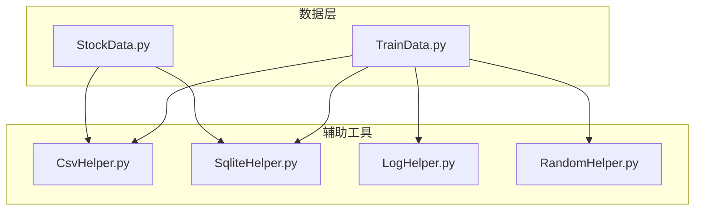
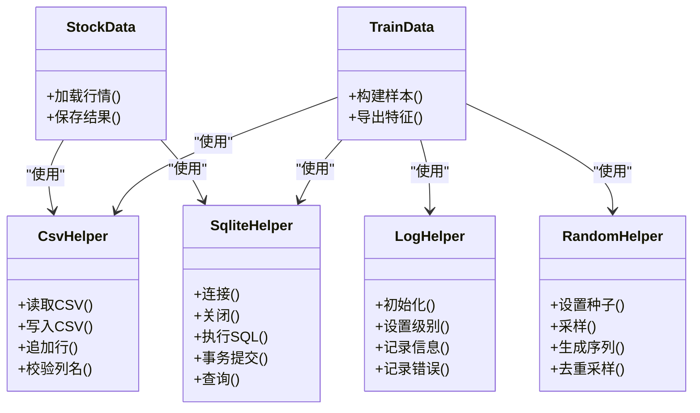
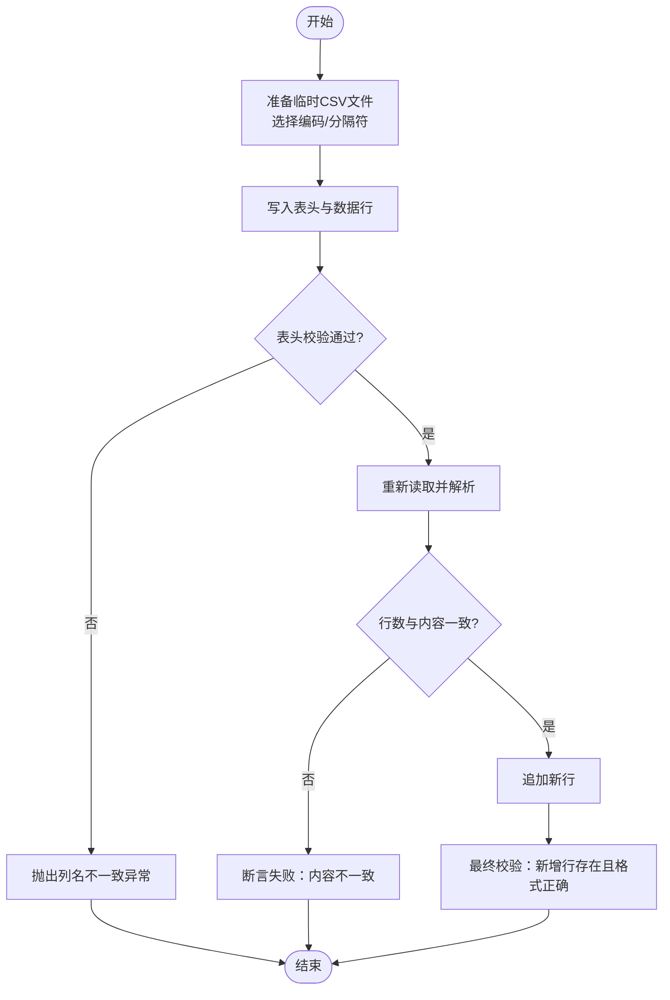
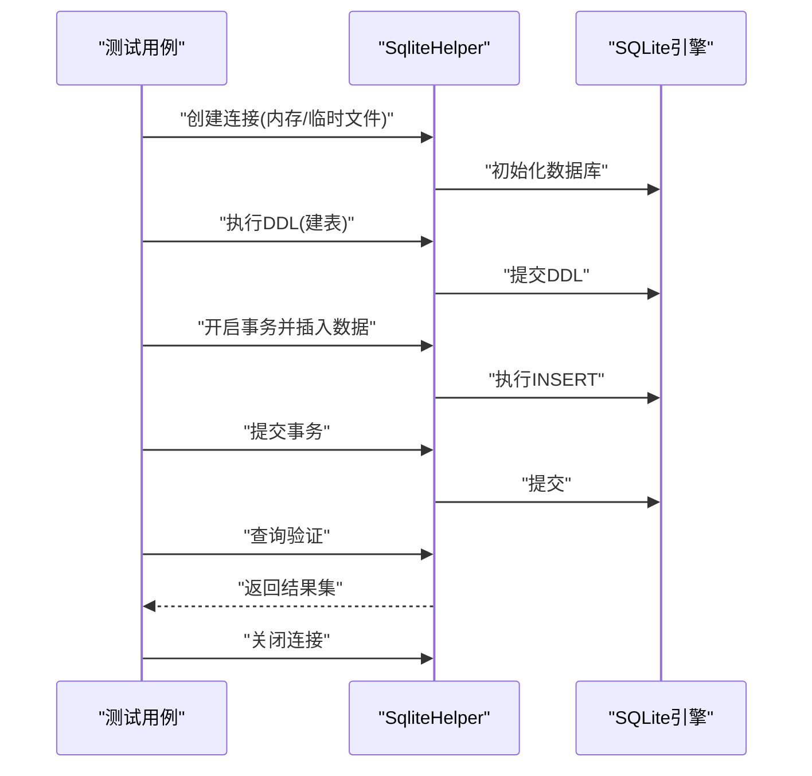
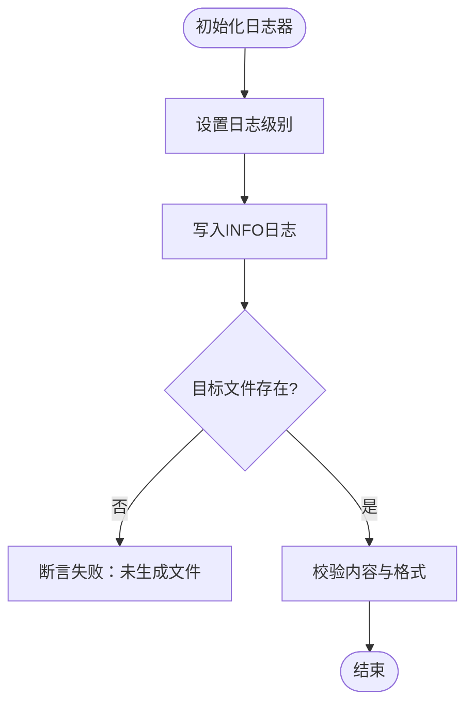
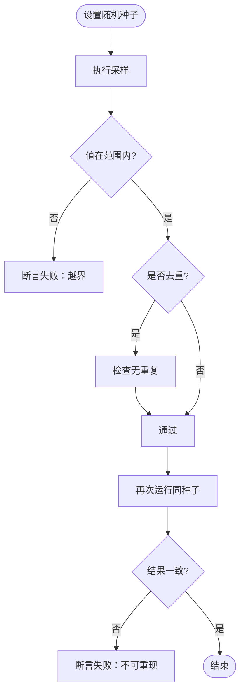
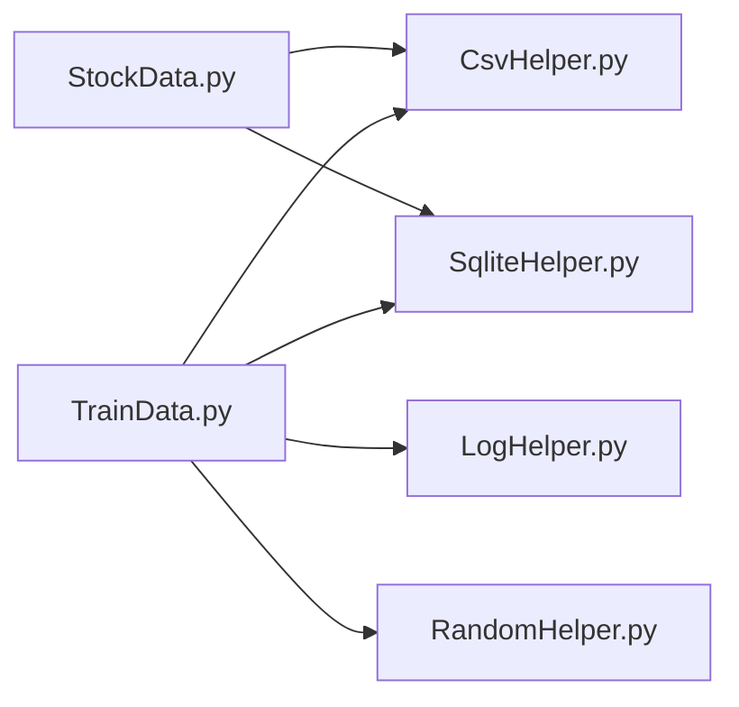

# 单元测试策略

<cite>
**本文引用的文件**   
- [CsvHelper.py](file://MyProject/Helper/CsvHelper.py)
- [SqliteHelper.py](file://MyProject/Helper/SqliteHelper.py)
- [LogHelper.py](file://MyProject/Helper/LogHelper.py)
- [RandomHelper.py](file://MyProject/Helper/RandomHelper.py)
- [StockData.py](file://MyProject/DataBase/StockData.py)
- [TrainData.py](file://MyProject/DataBase/TrainData.py)
</cite>

## 目录
1. [引言](#引言)
2. [项目结构](#项目结构)
3. [核心组件](#核心组件)
4. [架构总览](#架构总览)
5. [详细组件分析](#详细组件分析)
6. [依赖分析](#依赖分析)
7. [性能考虑](#性能考虑)
8. [故障排查指南](#故障排查指南)
9. [结论](#结论)
10. [附录](#附录)

## 引言
本文件为项目的单元测试策略与最佳实践，聚焦于工具类模块的测试方法：CSV文件操作、SQLite数据库操作、日志记录与随机数生成。文档涵盖测试用例设计原则、断言方法、Mock对象使用、测试数据准备与环境配置、覆盖率要求、命名约定与代码组织模式，并提供正常流程、异常处理与边界条件的示例路径指引。

## 项目结构
本项目采用按功能域组织的目录结构，关键测试目标集中在 Helper 与 DataBase 两个子包：
- Helper：通用工具（CSV、SQLite、日志、随机数等）
- DataBase：领域数据模型与持久化逻辑（股票数据、训练数据）

图表来源
- [CsvHelper.py](file://MyProject/Helper/CsvHelper.py)
- [SqliteHelper.py](file://MyProject/Helper/SqliteHelper.py)
- [LogHelper.py](file://MyProject/Helper/LogHelper.py)
- [RandomHelper.py](file://MyProject/Helper/RandomHelper.py)
- [StockData.py](file://MyProject/DataBase/StockData.py)
- [TrainData.py](file://MyProject/DataBase/TrainData.py)

章节来源
- [CsvHelper.py](file://MyProject/Helper/CsvHelper.py)
- [SqliteHelper.py](file://MyProject/Helper/SqliteHelper.py)
- [LogHelper.py](file://MyProject/Helper/LogHelper.py)
- [RandomHelper.py](file://MyProject/Helper/RandomHelper.py)
- [StockData.py](file://MyProject/DataBase/StockData.py)
- [TrainData.py](file://MyProject/DataBase/TrainData.py)

## 核心组件
以下四个工具类是单元测试的重点对象：
- CsvHelper：CSV读写封装，关注编码、分隔符、空值处理、列映射与批量写入
- SqliteHelper：SQLite连接管理、事务、SQL执行与结果集转换
- LogHelper：日志初始化、级别控制、输出目标（控制台/文件）、格式化
- RandomHelper：随机种子、分布采样、去重与范围约束

章节来源
- [CsvHelper.py](file://MyProject/Helper/CsvHelper.py)
- [SqliteHelper.py](file://MyProject/Helper/SqliteHelper.py)
- [LogHelper.py](file://MyProject/Helper/LogHelper.py)
- [RandomHelper.py](file://MyProject/Helper/RandomHelper.py)

## 架构总览
从调用关系看，数据层对工具层的依赖如下：
- StockData 依赖 CSV 与 SQLite 进行数据存取
- TrainData 依赖 SQLite、CSV、日志与随机数进行数据处理与实验

图表来源
- [CsvHelper.py](file://MyProject/Helper/CsvHelper.py)
- [SqliteHelper.py](file://MyProject/Helper/SqliteHelper.py)
- [LogHelper.py](file://MyProject/Helper/LogHelper.py)
- [RandomHelper.py](file://MyProject/Helper/RandomHelper.py)
- [StockData.py](file://MyProject/DataBase/StockData.py)
- [TrainData.py](file://MyProject/DataBase/TrainData.py)

## 详细组件分析

### CSV工具类（CsvHelper）测试策略
- 测试目标
  - 正确读写CSV文件，支持不同编码与分隔符
  - 空值与缺失列的处理
  - 列名校验与顺序一致性
  - 大文件分块写入的性能与内存占用
- 断言要点
  - 文件存在性与大小
  - 首行表头与数据类型
  - 行数与关键字段非空
  - 特殊字符与转义行为
- Mock与隔离
  - 使用临时目录与文件避免污染真实数据
  - 若内部依赖第三方库，可替换其打开/写入接口以便注入假实现
- 用例覆盖
  - 正常流程：标准CSV读写、追加行、指定编码
  - 异常处理：文件不存在、权限不足、非法分隔符、列不匹配
  - 边界条件：空文件、单行、超大行、含BOM头、重复列名

图表来源
- [CsvHelper.py](file://MyProject/Helper/CsvHelper.py)

章节来源
- [CsvHelper.py](file://MyProject/Helper/CsvHelper.py)

### SQLite工具类（SqliteHelper）测试策略
- 测试目标
  - 连接建立与释放
  - DDL/DML执行与事务语义
  - 查询结果集的结构与类型
  - 并发安全与资源清理
- 断言要点
  - 表是否存在、字段类型与约束
  - 插入后计数与主键唯一性
  - 事务回滚后的状态一致性
- Mock与隔离
  - 使用内存数据库或临时文件数据库
  - 在需要时替换底层连接工厂以注入测试连接
- 用例覆盖
  - 正常流程：建表、插入、查询、更新、删除
  - 异常处理：连接失败、SQL语法错误、外键冲突、死锁重试
  - 边界条件：空结果集、超长字符串、二进制数据、零事务

图表来源
- [SqliteHelper.py](file://MyProject/Helper/SqliteHelper.py)

章节来源
- [SqliteHelper.py](file://MyProject/Helper/SqliteHelper.py)

### 日志工具类（LogHelper）测试策略
- 测试目标
  - 日志级别过滤生效
  - 输出到控制台与文件的目标正确
  - 日志格式与时间戳符合预期
- 断言要点
  - 日志文件存在且包含期望条目
  - 特定级别的日志被过滤或未出现
  - 多进程/多线程下的日志不交错
- Mock与隔离
  - 将日志输出重定向到临时文件或内存缓冲区
  - 禁用网络/远程日志后端
- 用例覆盖
  - 正常流程：INFO/DEBUG/WARNING/ERROR均能输出
  - 异常处理：日志路径不可写、磁盘满
  - 边界条件：极长消息、Unicode字符、频繁写入

图表来源
- [LogHelper.py](file://MyProject/Helper/LogHelper.py)

章节来源
- [LogHelper.py](file://MyProject/Helper/LogHelper.py)

### 随机数工具类（RandomHelper）测试策略
- 测试目标
  - 种子固定时的可重现性
  - 采样分布与范围约束
  - 去重采样的终止条件
- 断言要点
  - 相同种子产生相同序列
  - 采样值落在指定区间
  - 去重后元素数量满足上限
- Mock与隔离
  - 直接替换底层随机源以注入确定性序列
- 用例覆盖
  - 正常流程：均匀采样、正态采样、带权重采样
  - 异常处理：负长度、越界范围、重复次数超限
  - 边界条件：空集合、单元素集合、极大样本量

图表来源
- [RandomHelper.py](file://MyProject/Helper/RandomHelper.py)

章节来源
- [RandomHelper.py](file://MyProject/Helper/RandomHelper.py)

### 数据层集成测试（StockData、TrainData）
- 测试目标
  - 数据层对工具层的组合调用是否正确
  - 端到端的数据流：从原始数据到训练样本
- 断言要点
  - 中间产物（CSV/SQLite）与最终输出的一致性
  - 日志中关键步骤的记录完整性
- 用例覆盖
  - 正常流程：完整流水线
  - 异常处理：上游数据缺失、格式错误
  - 边界条件：空数据集、极端统计值

章节来源
- [StockData.py](file://MyProject/DataBase/StockData.py)
- [TrainData.py](file://MyProject/DataBase/TrainData.py)

## 依赖分析
- 耦合关系
  - 数据层对工具层有明确依赖，工具层应尽量保持无状态与纯函数风格以降低耦合
- 外部依赖
  - CSV与SQLite为标准库或轻量级第三方库，测试时应优先使用内置能力
- 循环依赖
  - 当前结构未见明显循环依赖；建议在新增模块时遵循单向依赖原则

图表来源
- [StockData.py](file://MyProject/DataBase/StockData.py)
- [TrainData.py](file://MyProject/DataBase/TrainData.py)
- [CsvHelper.py](file://MyProject/Helper/CsvHelper.py)
- [SqliteHelper.py](file://MyProject/Helper/SqliteHelper.py)
- [LogHelper.py](file://MyProject/Helper/LogHelper.py)
- [RandomHelper.py](file://MyProject/Helper/RandomHelper.py)

## 性能考虑
- I/O密集型测试
  - 使用内存数据库与临时文件，避免磁盘瓶颈
  - 对大文件写入采用分块与增量校验
- CPU密集型测试
  - 限制样本规模，确保快速反馈
  - 对随机采样与去重算法进行复杂度评估
- 并发测试
  - 针对日志与SQLite并发访问进行压力测试
  - 使用线程/进程隔离避免共享状态污染

## 故障排查指南
- 常见问题
  - 文件路径与权限问题：确认临时目录可写、路径不存在自动创建
  - 编码不一致：统一UTF-8，必要时显式声明编码
  - 数据库锁定：确保连接及时关闭，事务及时提交/回滚
  - 随机不可重现：检查种子设置位置与随机源替换
- 定位手段
  - 增加详细日志与断点
  - 最小化复现用例，逐步缩小范围
  - 对比中间产物（CSV/SQLite）与期望快照

章节来源
- [LogHelper.py](file://MyProject/Helper/LogHelper.py)
- [SqliteHelper.py](file://MyProject/Helper/SqliteHelper.py)

## 结论
通过围绕CSV、SQLite、日志与随机数四大工具类的系统化测试策略，结合数据层的集成验证，可有效保障数据流水线的稳定性与可维护性。建议持续完善测试套件，提升覆盖率，并将测试纳入CI流程以实现自动化质量门禁。

## 附录

### 测试命名约定与组织模式
- 命名约定
  - 测试文件：test_<模块名>.py
  - 测试类：Test<模块名>
  - 测试方法：test_<场景>_<输入>_<期望>
- 组织模式
  - 每个工具类一个测试文件
  - 使用参数化测试覆盖多组输入
  - 使用fixture管理临时文件与数据库连接

### 断言方法与Mock使用
- 断言方法
  - 相等性、包含性、长度、类型、异常类型与消息
  - 数值近似比较用于浮点误差
- Mock对象
  - 使用标准库mock替换I/O与外部依赖
  - 验证调用次数与参数
  - 模拟异常抛出以覆盖异常分支

### 测试数据准备策略
- 小样本数据：构造最小可用数据集
- 边界数据：空、单行、重复、缺失、超长
- 随机数据：固定种子保证可重现
- 快照数据：对稳定输出进行快照比对

### 测试环境配置指南
- 临时目录：每次测试前创建，结束后清理
- 数据库：优先内存数据库，必要时临时文件
- 日志：重定向到内存或临时文件
- 环境变量：集中管理测试开关与阈值

### 覆盖率要求
- 语句覆盖率≥80%
- 分支覆盖率≥70%
- 关键路径（CSV/SQLite/日志/随机）覆盖率≥90%