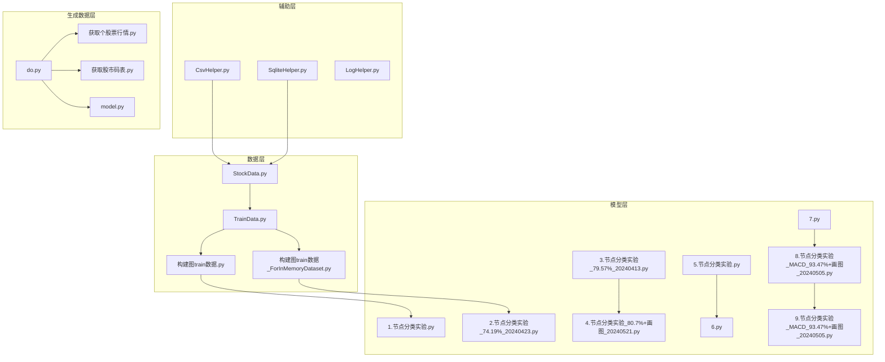
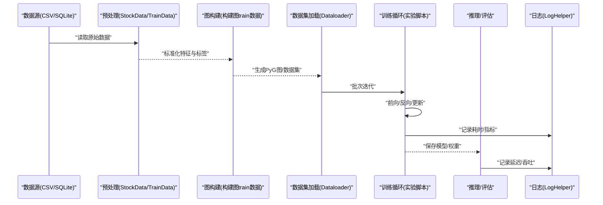
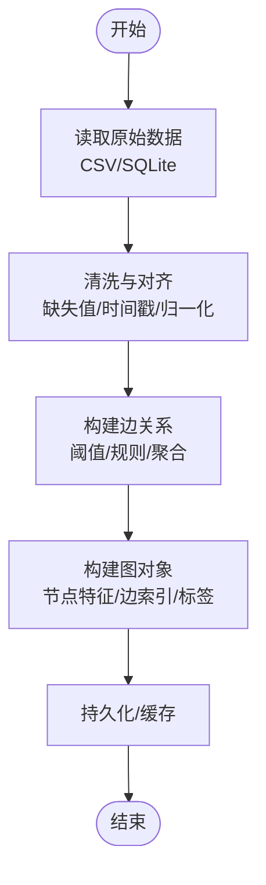

# 性能测试与优化

<cite>
**本文引用的文件**   
- [构建图train数据.py](file://MyProject/DataBase/构建图train数据.py)
- [StockData.py](file://MyProject/DataBase/StockData.py)
- [TrainData.py](file://MyProject/DataBase/TrainData.py)
- [CsvHelper.py](file://MyProject/Helper/CsvHelper.py)
- [SqliteHelper.py](file://MyProject/Helper/SqliteHelper.py)
- [LogHelper.py](file://MyProject/Helper/LogHelper.py)
- [1.节点分类实验.py](file://MyProject/Model/1.节点分类实验.py)
- [2.节点分类实验_74.19%_20240423.py](file://MyProject/Model/2.节点分类实验_74.19%_20240423.py)
- [3.节点分类实验_79.57%_20240413.py](file://MyProject/Model/3.节点分类实验_79.57%_20240413.py)
- [4.节点分类实验_80.7%+画图_20240521.py](file://MyProject/Model/4.节点分类实验_80.7%+画图_20240521.py)
- [5.节点分类实验.py](file://MyProject/Model/5.节点分类实验.py)
- [6.py](file://MyProject/Model/6.py)
- [7.py](file://MyProject/Model/7.py)
- [8.节点分类实验_MACD_93.47%+画图_20240505.py](file://MyProject/Model/8.节点分类实验_MACD_93.47%+画图_20240505.py)
- [9.节点分类实验_MACD_93.47%+画图_20240505.py](file://MyProject/Model/9.节点分类实验_MACD_93.47%+画图_20240505.py)
- [构建图train数据_ForInMemoryDataset.py](file://生成train数据/构建图train数据_ForInMemoryDataset.py)
- [获取个股票行情.py](file://生成train数据/获取个股票行情.py)
- [获取股市码表.py](file://生成train数据/获取股市码表.py)
- [do.py](file://生成train数据/do.py)
- [model.py](file://生成train数据/model.py)
</cite>

## 目录
1. [引言](#引言)
2. [项目结构](#项目结构)
3. [核心组件](#核心组件)
4. [架构总览](#架构总览)
5. [详细组件分析](#详细组件分析)
6. [依赖关系分析](#依赖关系分析)
7. [性能指标体系](#性能指标体系)
8. [大数据量性能测试方法](#大数据量性能测试方法)
9. [瓶颈识别与优化建议](#瓶颈识别与优化建议)
10. [压力与负载测试指南](#压力与负载测试指南)
11. [工具使用与结果分析](#工具使用与结果分析)
12. [性能回归检测策略](#性能回归检测策略)
13. [故障排查指南](#故障排查指南)
14. [结论](#结论)

## 引言
本文件面向本项目（基于PyTorch Geometric的图神经网络节点分类任务）的性能测试与优化，目标是建立可复用的性能指标体系、覆盖图构建效率、模型训练速度与推理延迟的测试方法，并提供瓶颈定位、优化策略、压力/负载测试实施指南、工具使用与结果分析技巧以及性能回归检测策略。文档既适合工程实践者快速落地，也便于非专业读者理解整体思路。

## 项目结构
仓库围绕“数据准备—图构建—模型训练—评估”的主线组织：
- 数据层：从CSV/SQLite等来源读取并清洗，构造图结构与特征。
- 辅助层：提供CSV读写、SQLite访问、日志记录等通用能力。
- 模型层：多版本节点分类实验脚本，包含训练、验证、可视化流程。
- 生成数据层：独立的数据采集与图构建脚本，便于批量生产训练集。



图表来源
- [StockData.py](file://MyProject/DataBase/StockData.py)
- [TrainData.py](file://MyProject/DataBase/TrainData.py)
- [构建图train数据.py](file://MyProject/DataBase/构建图train数据.py)
- [构建图train数据_ForInMemoryDataset.py](file://生成train数据/构建图train数据_ForInMemoryDataset.py)
- [CsvHelper.py](file://MyProject/Helper/CsvHelper.py)
- [SqliteHelper.py](file://MyProject/Helper/SqliteHelper.py)
- [1.节点分类实验.py](file://MyProject/Model/1.节点分类实验.py)
- [2.节点分类实验_74.19%_20240423.py](file://MyProject/Model/2.节点分类实验_74.19%_20240423.py)
- [3.节点分类实验_79.57%_20240413.py](file://MyProject/Model/3.节点分类实验_79.57%_20240413.py)
- [4.节点分类实验_80.7%+画图_20240521.py](file://MyProject/Model/4.节点分类实验_80.7%+画图_20240521.py)
- [5.节点分类实验.py](file://MyProject/Model/5.节点分类实验.py)
- [6.py](file://MyProject/Model/6.py)
- [7.py](file://MyProject/Model/7.py)
- [8.节点分类实验_MACD_93.47%+画图_20240505.py](file://MyProject/Model/8.节点分类实验_MACD_93.47%+画图_20240505.py)
- [9.节点分类实验_MACD_93.47%+画图_20240505.py](file://MyProject/Model/9.节点分类实验_MACD_93.47%+画图_20240505.py)
- [do.py](file://生成train数据/do.py)
- [获取个股票行情.py](file://生成train数据/获取个股票行情.py)
- [获取股市码表.py](file://生成train数据/获取股市码表.py)
- [model.py](file://生成train数据/model.py)

章节来源
- [构建图train数据.py](file://MyProject/DataBase/构建图train数据.py)
- [构建图train数据_ForInMemoryDataset.py](file://生成train数据/构建图train数据_ForInMemoryDataset.py)
- [1.节点分类实验.py](file://MyProject/Model/1.节点分类实验.py)
- [2.节点分类实验_74.19%_20240423.py](file://MyProject/Model/2.节点分类实验_74.19%_20240423.py)
- [3.节点分类实验_79.57%_20240413.py](file://MyProject/Model/3.节点分类实验_79.57%_20240413.py)
- [4.节点分类实验_80.7%+画图_20240521.py](file://MyProject/Model/4.节点分类实验_80.7%+画图_20240521.py)
- [5.节点分类实验.py](file://MyProject/Model/5.节点分类实验.py)
- [6.py](file://MyProject/Model/6.py)
- [7.py](file://MyProject/Model/7.py)
- [8.节点分类实验_MACD_93.47%+画图_20240505.py](file://MyProject/Model/8.节点分类实验_MACD_93.47%+画图_20240505.py)
- [9.节点分类实验_MACD_93.47%+画图_20240505.py](file://MyProject/Model/9.节点分类实验_MACD_93.47%+画图_20240505.py)
- [CsvHelper.py](file://MyProject/Helper/CsvHelper.py)
- [SqliteHelper.py](file://MyProject/Helper/SqliteHelper.py)
- [LogHelper.py](file://MyProject/Helper/LogHelper.py)
- [StockData.py](file://MyProject/DataBase/StockData.py)
- [TrainData.py](file://MyProject/DataBase/TrainData.py)
- [获取个股票行情.py](file://生成train数据/获取个股票行情.py)
- [获取股市码表.py](file://生成train数据/获取股市码表.py)
- [do.py](file://生成train数据/do.py)
- [model.py](file://生成train数据/model.py)

## 核心组件
- 数据源与预处理
  - 股票行情与基础信息读取、清洗与对齐，为后续图构建提供时序特征与标签。
  - 将原始数据转换为图节点特征、边关系与标签集合，形成PyG可用的数据集对象。
- 图构建
  - 根据业务规则（如时间窗口、相关性阈值、行业关联等）构建邻接矩阵或稀疏边列表。
  - 支持内存友好型数据集（如InMemoryDataset）以应对大规模图。
- 模型训练与评估
  - 多版本节点分类实验脚本，涵盖不同超参、损失函数、采样策略与可视化输出。
  - 训练过程需监控显存占用、CPU/GPU利用率、每步耗时与收敛曲线。
- 辅助工具
  - CSV/SQLite读写封装，统一IO接口；日志记录用于追踪关键步骤耗时与异常。

章节来源
- [StockData.py](file://MyProject/DataBase/StockData.py)
- [TrainData.py](file://MyProject/DataBase/TrainData.py)
- [构建图train数据.py](file://MyProject/DataBase/构建图train数据.py)
- [构建图train数据_ForInMemoryDataset.py](file://生成train数据/构建图train数据_ForInMemoryDataset.py)
- [CsvHelper.py](file://MyProject/Helper/CsvHelper.py)
- [SqliteHelper.py](file://MyProject/Helper/SqliteHelper.py)
- [LogHelper.py](file://MyProject/Helper/LogHelper.py)
- [1.节点分类实验.py](file://MyProject/Model/1.节点分类实验.py)
- [2.节点分类实验_74.19%_20240423.py](file://MyProject/Model/2.节点分类实验_74.19%_20240423.py)
- [3.节点分类实验_79.57%_20240413.py](file://MyProject/Model/3.节点分类实验_79.57%_20240413.py)
- [4.节点分类实验_80.7%+画图_20240521.py](file://MyProject/Model/4.节点分类实验_80.7%+画图_20240521.py)
- [5.节点分类实验.py](file://MyProject/Model/5.节点分类实验.py)
- [6.py](file://MyProject/Model/6.py)
- [7.py](file://MyProject/Model/7.py)
- [8.节点分类实验_MACD_93.47%+画图_20240505.py](file://MyProject/Model/8.节点分类实验_MACD_93.47%+画图_20240505.py)
- [9.节点分类实验_MACD_93.47%+画图_20240505.py](file://MyProject/Model/9.节点分类实验_MACD_93.47%+画图_20240505.py)

## 架构总览
下图展示端到端流水线：数据采集→图构建→训练→推理→评估，标注了关键性能观测点。



图表来源
- [StockData.py](file://MyProject/DataBase/StockData.py)
- [TrainData.py](file://MyProject/DataBase/TrainData.py)
- [构建图train数据.py](file://MyProject/DataBase/构建图train数据.py)
- [1.节点分类实验.py](file://MyProject/Model/1.节点分类实验.py)
- [LogHelper.py](file://MyProject/Helper/LogHelper.py)

## 详细组件分析

### 数据与图构建组件
- 职责
  - 从CSV/SQLite拉取数据，进行缺失值处理、归一化、对齐时间戳。
  - 依据业务规则构建节点特征、边关系与标签，输出PyG兼容的数据集。
- 性能关注点
  - I/O吞吐：批量读取、列裁剪、类型转换开销。
  - 图构建复杂度：邻接矩阵/CSR构建、去重、排序对时间与内存的影响。
  - 内存峰值：中间DataFrame/张量拷贝、临时数组。
- 优化建议
  - 使用惰性加载与分块处理，避免一次性载入全量数据。
  - 优先使用稀疏表示（COO/CSR）存储边，减少内存占用。
  - 预分配张量、复用缓冲区，减少重复分配。
  - 利用NumPy/Pandas向量化操作替代Python循环。

章节来源
- [构建图train数据.py](file://MyProject/DataBase/构建图train数据.py)
- [构建图train数据_ForInMemoryDataset.py](file://生成train数据/构建图train数据_ForInMemoryDataset.py)
- [StockData.py](file://MyProject/DataBase/StockData.py)
- [TrainData.py](file://MyProject/DataBase/TrainData.py)
- [CsvHelper.py](file://MyProject/Helper/CsvHelper.py)
- [SqliteHelper.py](file://MyProject/Helper/SqliteHelper.py)

#### 图构建流程（概念性流程图）


[此图为概念性流程，不直接映射具体源码，故无图表来源]

### 模型训练与推理组件
- 职责
  - 定义模型、损失、优化器，执行训练循环与验证。
  - 导出模型并进行推理，统计延迟与吞吐。
- 性能关注点
  - GPU利用率与显存占用：批大小、梯度累积、混合精度。
  - CPU-GPU同步与I/O瓶颈：DataLoader并行度、pin_memory。
  - 算子效率：GCN/GraphSAGE等层的实现与融合。
- 优化建议
  - 调整batch size至GPU饱和但不溢出显存的区间。
  - 启用混合精度（FP16/BF16）与梯度缩放。
  - 使用torch.compile或后端优化选项（视环境而定）。
  - 合理设置num_workers与prefetch_factor，避免I/O阻塞。

章节来源
- [1.节点分类实验.py](file://MyProject/Model/1.节点分类实验.py)
- [2.节点分类实验_74.19%_20240423.py](file://MyProject/Model/2.节点分类实验_74.19%_20240423.py)
- [3.节点分类实验_79.57%_20240413.py](file://MyProject/Model/3.节点分类实验_79.57%_20240413.py)
- [4.节点分类实验_80.7%+画图_20240521.py](file://MyProject/Model/4.节点分类实验_80.7%+画图_20240521.py)
- [5.节点分类实验.py](file://MyProject/Model/5.节点分类实验.py)
- [6.py](file://MyProject/Model/6.py)
- [7.py](file://MyProject/Model/7.py)
- [8.节点分类实验_MACD_93.47%+画图_20240505.py](file://MyProject/Model/8.节点分类实验_MACD_93.47%+画图_20240505.py)
- [9.节点分类实验_MACD_93.47%+画图_20240505.py](file://MyProject/Model/9.节点分类实验_MACD_93.47%+画图_20240505.py)

#### 训练主循环（概念性序列图）
```mermaid
sequenceDiagram
participant DL as "DataLoader"
participant TR as "训练循环"
participant MOD as "模型"
participant OPT as "优化器"
participant LOG as "日志"
loop 每个epoch
DL->>TR : "返回批次(batch)"
TR->>MOD : "前向计算"
MOD-->>TR : "预测/损失"
TR->>OPT : "反向传播/参数更新"
TR->>LOG : "记录loss/acc/耗时"
end
```

[此图为概念性流程，不直接映射具体源码，故无图表来源]

## 依赖关系分析
- 模块耦合
  - 数据层被图构建与训练脚本共同依赖，变更需保证向后兼容。
  - 辅助层（CSV/SQLite/日志）被多处调用，应保持稳定接口。
- 外部依赖
  - PyTorch与PyTorch Geometric：图算子、分布式与加速特性。
  - Pandas/NumPy：数据处理与数值计算。
  - SQLite/CSV：轻量级数据持久化。
- 潜在风险
  - 大图的邻接结构在CPU侧频繁操作可能成为瓶颈。
  - DataLoader线程过多导致上下文切换开销增大。

章节来源
- [构建图train数据.py](file://MyProject/DataBase/构建图train数据.py)
- [构建图train数据_ForInMemoryDataset.py](file://生成train数据/构建图train数据_ForInMemoryDataset.py)
- [CsvHelper.py](file://MyProject/Helper/CsvHelper.py)
- [SqliteHelper.py](file://MyProject/Helper/SqliteHelper.py)
- [1.节点分类实验.py](file://MyProject/Model/1.节点分类实验.py)

## 性能指标体系
- 资源类
  - 内存使用：进程RSS、Python堆、PyTorch张量显存峰值与均值。
  - CPU利用率：总体与单核、用户态/内核态占比。
  - GPU利用率与显存：SM利用率、显存占用、带宽使用率。
- 时间类
  - 端到端耗时：数据准备→图构建→训练→推理→评估。
  - 阶段耗时：I/O、图构建、前向、反向、优化器更新、评估。
  - 延迟分布：P50/P90/P99推理延迟。
- 吞吐类
  - 样本吞吐：每秒处理的样本数/节点数/边数。
  - 训练吞吐：每秒处理的batch数。
- 质量类
  - 准确率/损失收敛速度，作为性能优化的约束条件。

观测手段
- 系统级：top/htop、nvidia-smi、perf、vmstat、iotop。
- Python级：tracemalloc、memory_profiler、py-spy。
- PyTorch级：torch.profiler、CUDA Profiler（nsys/nvprof）、TensorBoard。

[本节为通用指导，不直接分析具体文件，故无章节来源]

## 大数据量性能测试方法
- 图构建效率
  - 输入规模：节点数N、边数E、特征维度d。
  - 指标：构建时长、内存峰值、稀疏化比例、去重/排序耗时。
  - 方法：逐步放大N/E，绘制构建时间与内存曲线，识别拐点。
- 模型训练速度
  - 指标：每epoch耗时、每step耗时、GPU利用率、显存占用。
  - 方法：固定batch size，调节num_workers、pin_memory、混合精度，对比吞吐。
- 推理延迟
  - 指标：端到端延迟、P95/P99延迟、吞吐。
  - 方法：离线批量推理与在线流式推理两种模式，分别压测。

章节来源
- [构建图train数据.py](file://MyProject/DataBase/构建图train数据.py)
- [构建图train数据_ForInMemoryDataset.py](file://生成train数据/构建图train数据_ForInMemoryDataset.py)
- [1.节点分类实验.py](file://MyProject/Model/1.节点分类实验.py)
- [2.节点分类实验_74.19%_20240423.py](file://MyProject/Model/2.节点分类实验_74.19%_20240423.py)
- [3.节点分类实验_79.57%_20240413.py](file://MyProject/Model/3.节点分类实验_79.57%_20240413.py)
- [4.节点分类实验_80.7%+画图_20240521.py](file://MyProject/Model/4.节点分类实验_80.7%+画图_20240521.py)
- [5.节点分类实验.py](file://MyProject/Model/5.节点分类实验.py)
- [6.py](file://MyProject/Model/6.py)
- [7.py](file://MyProject/Model/7.py)
- [8.节点分类实验_MACD_93.47%+画图_20240505.py](file://MyProject/Model/8.节点分类实验_MACD_93.47%+画图_20240505.py)
- [9.节点分类实验_MACD_93.47%+画图_20240505.py](file://MyProject/Model/9.节点分类实验_MACD_93.47%+画图_20240505.py)

## 瓶颈识别与优化建议
- 算法优化
  - 选择更高效的图卷积实现（如带稀疏优化的层），减少稠密矩阵乘。
  - 采用邻居采样/分层采样降低每步计算量。
- 数据结构选择
  - 边使用COO/CSR，节点特征使用连续内存布局，避免频繁转置/复制。
  - 大图使用InMemoryDataset或自定义懒加载Dataset。
- 并行计算应用
  - DataLoader多进程、prefetch、pin_memory提升I/O吞吐。
  - 多卡训练（DDP/FSDP）扩展吞吐，注意通信开销。
- I/O与缓存
  - 预计算并缓存中间结果（如图邻接、特征），避免重复构建。
  - 使用更快的存储格式（Parquet/HDF5）与列裁剪。
- 运行时优化
  - 混合精度、梯度累积、梯度裁剪阈值调优。
  - 使用torch.profiler定位热点算子，针对性替换或融合。

章节来源
- [构建图train数据.py](file://MyProject/DataBase/构建图train数据.py)
- [构建图train数据_ForInMemoryDataset.py](file://生成train数据/构建图train数据_ForInMemoryDataset.py)
- [1.节点分类实验.py](file://MyProject/Model/1.节点分类实验.py)
- [2.节点分类实验_74.19%_20240423.py](file://MyProject/Model/2.节点分类实验_74.19%_20240423.py)
- [3.节点分类实验_79.57%_20240413.py](file://MyProject/Model/3.节点分类实验_79.57%_20240413.py)
- [4.节点分类实验_80.7%+画图_20240521.py](file://MyProject/Model/4.节点分类实验_80.7%+画图_20240521.py)
- [5.节点分类实验.py](file://MyProject/Model/5.节点分类实验.py)
- [6.py](file://MyProject/Model/6.py)
- [7.py](file://MyProject/Model/7.py)
- [8.节点分类实验_MACD_93.47%+画图_20240505.py](file://MyProject/Model/8.节点分类实验_MACD_93.47%+画图_20240505.py)
- [9.节点分类实验_MACD_93.47%+画图_20240505.py](file://MyProject/Model/9.节点分类实验_MACD_93.47%+画图_20240505.py)

## 压力与负载测试指南
- 场景设计
  - 真实业务画像：按日/周周期增量更新图，峰值时段并发请求。
  - 数据规模阶梯：小/中/大/超大四档，覆盖N/E/d的组合。
- 指标基线
  - 构建：目标时间内完成全量/增量构建，内存不超过阈值。
  - 训练：稳定吞吐，GPU利用率≥目标值，显存不溢出。
  - 推理：P95/P99延迟满足SLA，吞吐达到预期。
- 执行步骤
  - 准备基准数据集与配置，固化随机种子。
  - 逐档加压，记录资源与时间指标，绘制趋势图。
  - 观察抖动与尾部延迟，定位不稳定因素。
- 持续集成
  - 将压测纳入CI，失败即阻断合并，防止性能回退。

[本节为通用指导，不直接分析具体文件，故无章节来源]

## 工具使用与结果分析
- 系统工具
  - nvidia-smi：监控GPU利用率与显存占用。
  - top/htop：观察CPU与内存使用。
  - perf：定位热点函数与系统调用。
- Python与PyTorch
  - torch.profiler：记录算子耗时、内存分配，导出火焰图。
  - memory_profiler/tracemalloc：定位Python侧内存泄漏与热点。
  - TensorBoard：可视化训练曲线与资源指标。
- 结果分析技巧
  - 区分I/O瓶颈与计算瓶颈：若GPU利用率低且CPU等待高，优先优化DataLoader。
  - 关注尾部延迟：P95/P99显著高于均值时，检查锁竞争、GC停顿、网络抖动。
  - 结合火焰图与热点函数，优先优化Top-N热点。

[本节为通用指导，不直接分析具体文件，故无章节来源]

## 性能回归检测策略
- 基线管理
  - 维护各规模下的基线指标（构建时长、训练吞吐、推理延迟）。
  - 记录运行环境与依赖版本，确保可比性。
- 自动化回归
  - 在PR/MR触发轻量回归测试，比较关键指标偏差。
  - 设定阈值告警（如延迟上升>5%，吞吐下降>3%）。
- 报告与回溯
  - 自动生成性能报告（含趋势图、差异说明）。
  - 对回归提交进行复盘，必要时回滚或修复。

[本节为通用指导，不直接分析具体文件，故无章节来源]

## 故障排查指南
- 常见问题
  - OOM：显存不足或Python堆增长过快。
  - 训练缓慢：DataLoader阻塞、GPU空闲、算子未融合。
  - 推理抖动：尾部延迟高、锁竞争、I/O不稳定。
- 排查路径
  - 先确认是否I/O瓶颈：观察CPU与磁盘活动，调整num_workers/prefetch。
  - 再确认是否计算瓶颈：查看GPU利用率与热点算子，考虑混合精度/编译优化。
  - 最后检查系统与驱动：CUDA/cuDNN版本匹配、驱动稳定性。
- 日志与诊断
  - 使用LogHelper记录关键步骤耗时与异常。
  - 开启torch.profiler捕获一次完整训练/推理，定位问题。

章节来源
- [LogHelper.py](file://MyProject/Helper/LogHelper.py)
- [构建图train数据.py](file://MyProject/DataBase/构建图train数据.py)
- [1.节点分类实验.py](file://MyProject/Model/1.节点分类实验.py)

## 结论
通过建立统一的性能指标体系、覆盖图构建/训练/推理的全链路测试方法，并结合系统级与框架级工具进行瓶颈定位与优化，可在保证模型质量的前提下显著提升系统吞吐与稳定性。建议在工程中常态化引入性能回归检测，确保长期演进中的性能可控。