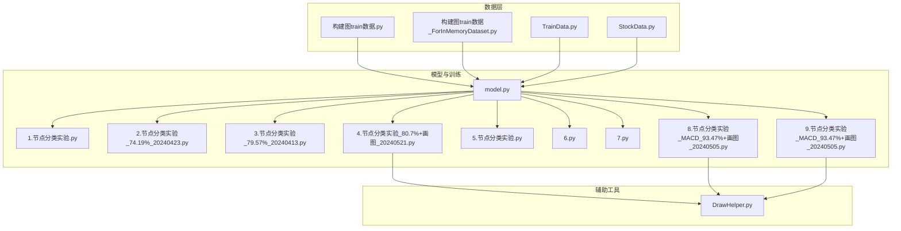
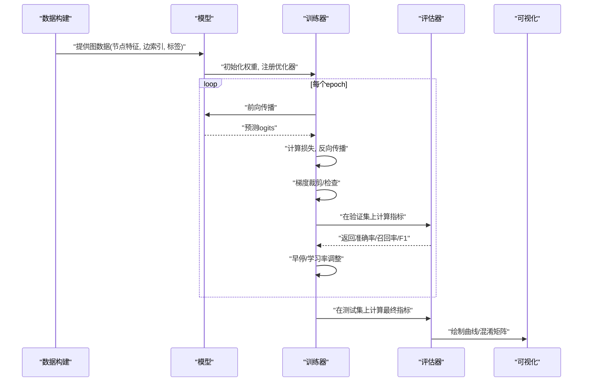
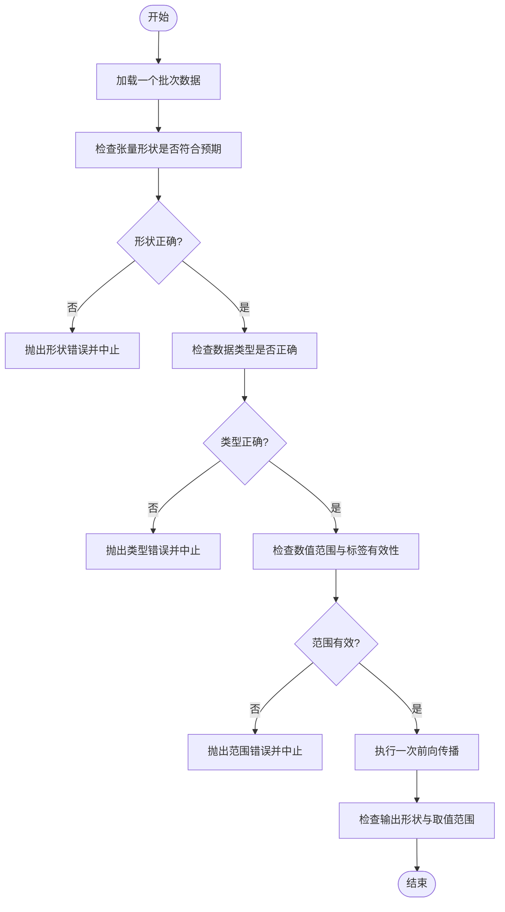
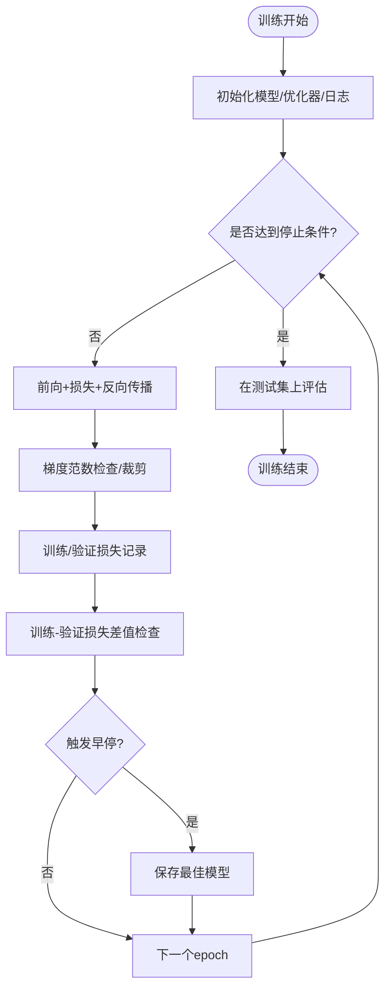
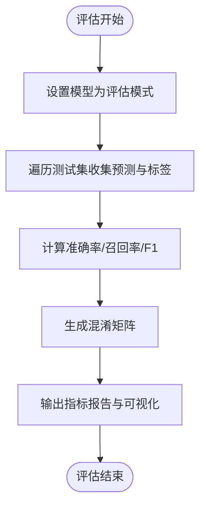
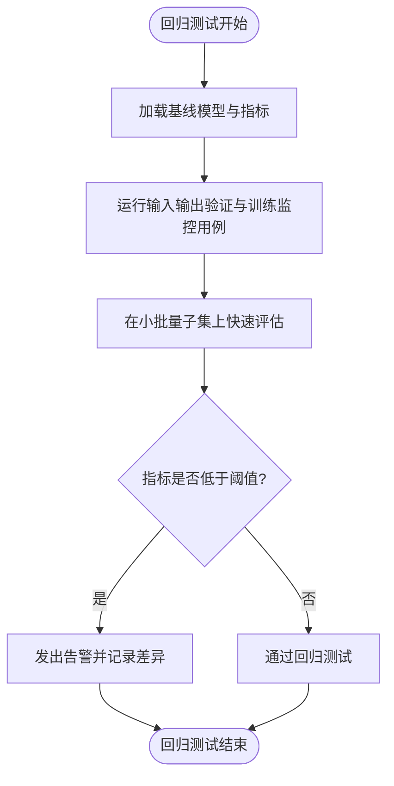

# 模型测试与验证

<cite>
**本文引用的文件**   
- [MyProject/Model/1.节点分类实验.py](file://MyProject/Model/1.节点分类实验.py)
- [MyProject/Model/2.节点分类实验_74.19%_20240423.py](file://MyProject/Model/2.节点分类实验_74.19%_20240423.py)
- [MyProject/Model/3.节点分类实验_79.57%_20240413.py](file://MyProject/Model/3.节点分类实验_79.57%_20240413.py)
- [MyProject/Model/4.节点分类实验_80.7%+画图_20240521.py](file://MyProject/Model/4.节点分类实验_80.7%+画图_20240521.py)
- [MyProject/Model/5.节点分类实验.py](file://MyProject/Model/5.节点分类实验.py)
- [MyProject/Model/6.py](file://MyProject/Model/6.py)
- [MyProject/Model/7.py](file://MyProject/Model/7.py)
- [MyProject/Model/8.节点分类实验_MACD_93.47%+画图_20240505.py](file://MyProject/Model/8.节点分类实验_MACD_93.47%+画图_20240505.py)
- [MyProject/Model/9.节点分类实验_MACD_93.47%+画图_20240505.py](file://MyProject/Model/9.节点分类实验_MACD_93.47%+画图_20240505.py)
- [生成train数据/model.py](file://生成train数据/model.py)
- [生成train数据/构建图train数据.py](file://生成train数据/构建图train数据.py)
- [生成train数据/构建图train数据_ForInMemoryDataset.py](file://生成train数据/构建图train数据_ForInMemoryDataset.py)
- [MyProject/DataBase/TrainData.py](file://MyProject/DataBase/TrainData.py)
- [MyProject/DataBase/StockData.py](file://MyProject/DataBase/StockData.py)
- [MyProject/Helper/DrawHelper.py](file://MyProject/Helper/DrawHelper.py)
</cite>

## 目录
1. [引言](#引言)
2. [项目结构](#项目结构)
3. [核心组件](#核心组件)
4. [架构总览](#架构总览)
5. [详细组件分析](#详细组件分析)
6. [依赖分析](#依赖分析)
7. [性能考虑](#性能考虑)
8. [故障排查指南](#故障排查指南)
9. [结论](#结论)
10. [附录](#附录)

## 引言
本文件面向图神经网络（GNN）模型的测试与验证，目标是建立一套可复用的测试体系，覆盖以下方面：
- 输入输出验证：张量形状、数据类型、数值范围
- 训练过程监控：损失收敛性、梯度检查、过拟合检测
- 性能基准：准确率、召回率、F1分数等指标的计算与比较
- 回归测试策略：确保模型更新后性能不下降
- 具体实现示例：测试数据集构建、评估指标计算、结果分析与可视化

本项目为股票场景下的节点分类任务，使用PyTorch Geometric进行图数据处理与模型训练。多个“节点分类实验”脚本体现了从数据准备、模型定义、训练到评估的完整流程，适合作为测试体系的落地载体。

## 项目结构
围绕模型测试与验证，关键代码分布在如下位置：
- 模型与训练脚本：MyProject/Model/*.py
- 数据构建与加载：生成train数据/*.py、MyProject/DataBase/*.py
- 辅助工具（绘图、日志等）：MyProject/Helper/*.py

图表来源
- [生成train数据/构建图train数据.py](file://生成train数据/构建图train数据.py)
- [生成train数据/构建图train数据_ForInMemoryDataset.py](file://生成train数据/构建图train数据_ForInMemoryDataset.py)
- [MyProject/DataBase/TrainData.py](file://MyProject/DataBase/TrainData.py)
- [MyProject/DataBase/StockData.py](file://MyProject/DataBase/StockData.py)
- [生成train数据/model.py](file://生成train数据/model.py)
- [MyProject/Model/1.节点分类实验.py](file://MyProject/Model/1.节点分类实验.py)
- [MyProject/Model/2.节点分类实验_74.19%_20240423.py](file://MyProject/Model/2.节点分类实验_74.19%_20240423.py)
- [MyProject/Model/3.节点分类实验_79.57%_20240413.py](file://MyProject/Model/3.节点分类实验_79.57%_20240413.py)
- [MyProject/Model/4.节点分类实验_80.7%+画图_20240521.py](file://MyProject/Model/4.节点分类实验_80.7%+画图_20240521.py)
- [MyProject/Model/5.节点分类实验.py](file://MyProject/Model/5.节点分类实验.py)
- [MyProject/Model/6.py](file://MyProject/Model/6.py)
- [MyProject/Model/7.py](file://MyProject/Model/7.py)
- [MyProject/Model/8.节点分类实验_MACD_93.47%+画图_20240505.py](file://MyProject/Model/8.节点分类实验_MACD_93.47%+画图_20240505.py)
- [MyProject/Model/9.节点分类实验_MACD_93.47%+画图_20240505.py](file://MyProject/Model/9.节点分类实验_MACD_93.47%+画图_20240505.py)
- [MyProject/Helper/DrawHelper.py](file://MyProject/Helper/DrawHelper.py)

章节来源
- [生成train数据/构建图train数据.py](file://生成train数据/构建图train数据.py)
- [生成train数据/构建图train数据_ForInMemoryDataset.py](file://生成train数据/构建图train数据_ForInMemoryDataset.py)
- [MyProject/DataBase/TrainData.py](file://MyProject/DataBase/TrainData.py)
- [MyProject/DataBase/StockData.py](file://MyProject/DataBase/StockData.py)
- [生成train数据/model.py](file://生成train数据/model.py)
- [MyProject/Model/1.节点分类实验.py](file://MyProject/Model/1.节点分类实验.py)
- [MyProject/Model/2.节点分类实验_74.19%_20240423.py](file://MyProject/Model/2.节点分类实验_74.19%_20240423.py)
- [MyProject/Model/3.节点分类实验_79.57%_20240413.py](file://MyProject/Model/3.节点分类实验_79.57%_20240413.py)
- [MyProject/Model/4.节点分类实验_80.7%+画图_20240521.py](file://MyProject/Model/4.节点分类实验_80.7%+画图_20240521.py)
- [MyProject/Model/5.节点分类实验.py](file://MyProject/Model/5.节点分类实验.py)
- [MyProject/Model/6.py](file://MyProject/Model/6.py)
- [MyProject/Model/7.py](file://MyProject/Model/7.py)
- [MyProject/Model/8.节点分类实验_MACD_93.47%+画图_20240505.py](file://MyProject/Model/8.节点分类实验_MACD_93.47%+画图_20240505.py)
- [MyProject/Model/9.节点分类实验_MACD_93.47%+画图_20240505.py](file://MyProject/Model/9.节点分类实验_MACD_93.47%+画图_20240505.py)
- [MyProject/Helper/DrawHelper.py](file://MyProject/Helper/DrawHelper.py)

## 核心组件
围绕模型测试与验证，建议将现有脚本抽象为以下可复用组件：
- 数据管道组件：负责图数据的构造、划分（训练/验证/测试）、批处理与校验
- 模型组件：封装GNN模型定义、前向传播、参数初始化与导出
- 训练器组件：封装优化器、损失函数、训练循环、学习率调度、早停与日志记录
- 评估器组件：封装指标计算（准确率、召回率、F1）、阈值选择、混淆矩阵与可视化
- 测试套件：包含输入输出验证、训练监控断言、回归测试与基准报告

上述组件可在现有“节点分类实验”脚本中逐步抽取与统一，形成稳定的测试基线。

章节来源
- [生成train数据/model.py](file://生成train数据/model.py)
- [MyProject/Model/1.节点分类实验.py](file://MyProject/Model/1.节点分类实验.py)
- [MyProject/Model/4.节点分类实验_80.7%+画图_20240521.py](file://MyProject/Model/4.节点分类实验_80.7%+画图_20240521.py)
- [MyProject/Model/8.节点分类实验_MACD_93.47%+画图_20240505.py](file://MyProject/Model/8.节点分类实验_MACD_93.47%+画图_20240505.py)
- [MyProject/Model/9.节点分类实验_MACD_93.47%+画图_20240505.py](file://MyProject/Model/9.节点分类实验_MACD_93.47%+画图_20240505.py)

## 架构总览
下图展示从数据到训练、评估与可视化的端到端流程，并标注了测试与验证的关键断点。

图表来源
- [生成train数据/构建图train数据.py](file://生成train数据/构建图train数据.py)
- [生成train数据/model.py](file://生成train数据/model.py)
- [MyProject/Model/1.节点分类实验.py](file://MyProject/Model/1.节点分类实验.py)
- [MyProject/Model/4.节点分类实验_80.7%+画图_20240521.py](file://MyProject/Model/4.节点分类实验_80.7%+画图_20240521.py)
- [MyProject/Helper/DrawHelper.py](file://MyProject/Helper/DrawHelper.py)

## 详细组件分析

### 输入输出验证方法
目标：确保模型对任意批次的数据具备鲁棒的前向能力，避免后续训练因数据异常而失败。

- 张量形状检查
  - 节点特征：[num_nodes, num_features]
  - 边索引：[2, num_edges]
  - 标签：[num_nodes] 或按任务定义的维度
  - 掩码（如存在）：[num_nodes]
- 数据类型验证
  - 特征与边索引类型需与模型期望一致（例如float32、long）
  - 标签类型为整数类别索引
- 数值范围测试
  - 特征值应在合理范围内（如标准化后的均值方差）
  - 标签类别索引在[0, num_classes-1]内
- 空图与极端图检查
  - 零节点/零边的边界情况
  - 单节点/单边的退化图
- 随机种子一致性
  - 固定随机种子下，相同输入应得到确定性输出（禁用dropout或在eval模式下）

图表来源
- [生成train数据/构建图train数据.py](file://生成train数据/构建图train数据.py)
- [生成train数据/构建图train数据_ForInMemoryDataset.py](file://生成train数据/构建图train数据_ForInMemoryDataset.py)
- [MyProject/DataBase/TrainData.py](file://MyProject/DataBase/TrainData.py)
- [生成train数据/model.py](file://生成train数据/model.py)

章节来源
- [生成train数据/构建图train数据.py](file://生成train数据/构建图train数据.py)
- [生成train数据/构建图train数据_ForInMemoryDataset.py](file://生成train数据/构建图train数据_ForInMemoryDataset.py)
- [MyProject/DataBase/TrainData.py](file://MyProject/DataBase/TrainData.py)
- [生成train数据/model.py](file://生成train数据/model.py)

### 训练过程监控测试
目标：在训练过程中自动检测异常与潜在问题，保障训练稳定性与收敛性。

- 损失函数收敛性
  - 断言：训练损失随epoch单调下降或满足滑动平均下降阈值
  - 断言：验证损失不出现持续上升超过容忍度
- 梯度检查
  - 断言：梯度范数处于合理范围（防止爆炸/消失）
  - 可选：梯度裁剪前后对比，记录最大/最小梯度
- 过拟合检测
  - 断言：训练损失与验证损失的差距不超过阈值
  - 早停策略：当验证指标长时间不提升时停止训练
- 学习率与优化器状态
  - 断言：学习率按计划衰减且不为NaN/Inf
  - 断言：优化器参数未出现异常值

图表来源
- [MyProject/Model/1.节点分类实验.py](file://MyProject/Model/1.节点分类实验.py)
- [MyProject/Model/2.节点分类实验_74.19%_20240423.py](file://MyProject/Model/2.节点分类实验_74.19%_20240423.py)
- [MyProject/Model/3.节点分类实验_79.57%_20240413.py](file://MyProject/Model/3.节点分类实验_79.57%_20240413.py)
- [MyProject/Model/4.节点分类实验_80.7%+画图_20240521.py](file://MyProject/Model/4.节点分类实验_80.7%+画图_20240521.py)
- [MyProject/Model/5.节点分类实验.py](file://MyProject/Model/5.节点分类实验.py)
- [MyProject/Model/6.py](file://MyProject/Model/6.py)
- [MyProject/Model/7.py](file://MyProject/Model/7.py)
- [MyProject/Model/8.节点分类实验_MACD_93.47%+画图_20240505.py](file://MyProject/Model/8.节点分类实验_MACD_93.47%+画图_20240505.py)
- [MyProject/Model/9.节点分类实验_MACD_93.47%+画图_20240505.py](file://MyProject/Model/9.节点分类实验_MACD_93.47%+画图_20240505.py)

章节来源
- [MyProject/Model/1.节点分类实验.py](file://MyProject/Model/1.节点分类实验.py)
- [MyProject/Model/2.节点分类实验_74.19%_20240423.py](file://MyProject/Model/2.节点分类实验_74.19%_20240423.py)
- [MyProject/Model/3.节点分类实验_79.57%_20240413.py](file://MyProject/Model/3.节点分类实验_79.57%_20240413.py)
- [MyProject/Model/4.节点分类实验_80.7%+画图_20240521.py](file://MyProject/Model/4.节点分类实验_80.7%+画图_20240521.py)
- [MyProject/Model/5.节点分类实验.py](file://MyProject/Model/5.节点分类实验.py)
- [MyProject/Model/6.py](file://MyProject/Model/6.py)
- [MyProject/Model/7.py](file://MyProject/Model/7.py)
- [MyProject/Model/8.节点分类实验_MACD_93.47%+画图_20240505.py](file://MyProject/Model/8.节点分类实验_MACD_93.47%+画图_20240505.py)
- [MyProject/Model/9.节点分类实验_MACD_93.47%+画图_20240505.py](file://MyProject/Model/9.节点分类实验_MACD_93.47%+画图_20240505.py)

### 模型性能基准测试方法
目标：在统一的测试集上计算并比较关键指标，确保不同版本或配置的可比性。

- 指标定义
  - 准确率：正确预测样本占比
  - 召回率：正类被正确识别的比例（可按类别统计）
  - F1分数：精确率与召回率的调和平均（可按类别或宏/微平均）
- 计算流程
  - 在eval模式下运行模型，收集预测与真实标签
  - 根据任务类型（多分类/二分类）选择合适的聚合方式
  - 输出混淆矩阵与逐类指标，便于诊断不平衡问题
- 阈值与概率
  - 若为二分类或多标签，需明确阈值策略（默认0.5或基于验证集调优）
- 结果存储与对比
  - 将指标写入结构化日志或CSV，便于跨版本对比与回归判定

图表来源
- [MyProject/Model/4.节点分类实验_80.7%+画图_20240521.py](file://MyProject/Model/4.节点分类实验_80.7%+画图_20240521.py)
- [MyProject/Model/8.节点分类实验_MACD_93.47%+画图_20240505.py](file://MyProject/Model/8.节点分类实验_MACD_93.47%+画图_20240505.py)
- [MyProject/Model/9.节点分类实验_MACD_93.47%+画图_20240505.py](file://MyProject/Model/9.节点分类实验_MACD_93.47%+画图_20240505.py)
- [MyProject/Helper/DrawHelper.py](file://MyProject/Helper/DrawHelper.py)

章节来源
- [MyProject/Model/4.节点分类实验_80.7%+画图_20240521.py](file://MyProject/Model/4.节点分类实验_80.7%+画图_20240521.py)
- [MyProject/Model/8.节点分类实验_MACD_93.47%+画图_20240505.py](file://MyProject/Model/8.节点分类实验_MACD_93.47%+画图_20240505.py)
- [MyProject/Model/9.节点分类实验_MACD_93.47%+画图_20240505.py](file://MyProject/Model/9.节点分类实验_MACD_93.47%+画图_20240505.py)
- [MyProject/Helper/DrawHelper.py](file://MyProject/Helper/DrawHelper.py)

### 模型回归测试策略
目标：在模型或数据变更后，确保关键指标不出现显著退化。

- 基线快照
  - 保存当前版本的模型权重、超参、数据划分与随机种子
  - 记录基线指标（准确率、召回率、F1）作为参考
- 自动化回归用例
  - 在固定小批量子集上进行快速评估，断言指标不低于基线的容忍阈值
  - 对输入输出验证与训练监控用例进行全量执行
- 变更影响分析
  - 若指标下降，定位变更点（数据预处理、模型结构、训练策略）
  - 必要时回滚或修复后再提交

图表来源
- [MyProject/Model/1.节点分类实验.py](file://MyProject/Model/1.节点分类实验.py)
- [MyProject/Model/4.节点分类实验_80.7%+画图_20240521.py](file://MyProject/Model/4.节点分类实验_80.7%+画图_20240521.py)
- [MyProject/Model/8.节点分类实验_MACD_93.47%+画图_20240505.py](file://MyProject/Model/8.节点分类实验_MACD_93.47%+画图_20240505.py)

章节来源
- [MyProject/Model/1.节点分类实验.py](file://MyProject/Model/1.节点分类实验.py)
- [MyProject/Model/4.节点分类实验_80.7%+画图_20240521.py](file://MyProject/Model/4.节点分类实验_80.7%+画图_20240521.py)
- [MyProject/Model/8.节点分类实验_MACD_93.47%+画图_20240505.py](file://MyProject/Model/8.节点分类实验_MACD_93.47%+画图_20240505.py)

### 具体实现示例
本节给出在现有脚本基础上落地的示例步骤（以路径引用代替代码片段）：
- 测试数据集构建
  - 使用数据构建脚本准备图数据，并在训练/验证/测试集上划分
  - 参考路径：[生成train数据/构建图train数据.py](file://生成train数据/构建图train数据.py)、[生成train数据/构建图train数据_ForInMemoryDataset.py](file://生成train数据/构建图train数据_ForInMemoryDataset.py)
- 评估指标计算
  - 在评估阶段收集预测与标签，计算准确率、召回率、F1
  - 参考路径：[MyProject/Model/4.节点分类实验_80.7%+画图_20240521.py](file://MyProject/Model/4.节点分类实验_80.7%+画图_20240521.py)、[MyProject/Model/8.节点分类实验_MACD_93.47%+画图_20240505.py](file://MyProject/Model/8.节点分类实验_MACD_93.47%+画图_20240505.py)
- 结果分析
  - 结合混淆矩阵与逐类指标，分析类别不平衡与误判热点
  - 参考路径：[MyProject/Helper/DrawHelper.py](file://MyProject/Helper/DrawHelper.py)

章节来源
- [生成train数据/构建图train数据.py](file://生成train数据/构建图train数据.py)
- [生成train数据/构建图train数据_ForInMemoryDataset.py](file://生成train数据/构建图train数据_ForInMemoryDataset.py)
- [MyProject/Model/4.节点分类实验_80.7%+画图_20240521.py](file://MyProject/Model/4.节点分类实验_80.7%+画图_20240521.py)
- [MyProject/Model/8.节点分类实验_MACD_93.47%+画图_20240505.py](file://MyProject/Model/8.节点分类实验_MACD_93.47%+画图_20240505.py)
- [MyProject/Helper/DrawHelper.py](file://MyProject/Helper/DrawHelper.py)

## 依赖分析
- 数据依赖
  - 图数据由数据构建脚本生成，供模型训练与评估使用
- 模型依赖
  - 模型定义位于独立文件，被各实验脚本复用
- 工具依赖
  - 绘图与可视化用于结果展示与分析

图表来源
- [生成train数据/构建图train数据.py](file://生成train数据/构建图train数据.py)
- [生成train数据/model.py](file://生成train数据/model.py)
- [MyProject/Model/1.节点分类实验.py](file://MyProject/Model/1.节点分类实验.py)
- [MyProject/Model/4.节点分类实验_80.7%+画图_20240521.py](file://MyProject/Model/4.节点分类实验_80.7%+画图_20240521.py)
- [MyProject/Helper/DrawHelper.py](file://MyProject/Helper/DrawHelper.py)

章节来源
- [生成train数据/构建图train数据.py](file://生成train数据/构建图train数据.py)
- [生成train数据/model.py](file://生成train数据/model.py)
- [MyProject/Model/1.节点分类实验.py](file://MyProject/Model/1.节点分类实验.py)
- [MyProject/Model/4.节点分类实验_80.7%+画图_20240521.py](file://MyProject/Model/4.节点分类实验_80.7%+画图_20240521.py)
- [MyProject/Helper/DrawHelper.py](file://MyProject/Helper/DrawHelper.py)

## 性能考虑
- 数据加载与批处理
  - 使用内存数据集或惰性加载减少I/O瓶颈
  - 合理设置batch_size与num_workers，平衡吞吐与显存占用
- 模型复杂度
  - 控制层数与隐藏维度，避免过度参数化导致训练不稳定
- 训练稳定性
  - 采用梯度裁剪、合理的初始学习率与衰减策略
  - 早停与权重备份，降低过拟合风险
- 评估效率
  - 在评估阶段关闭dropout与requires_grad，加速推理
  - 缓存中间结果，避免重复计算

## 故障排查指南
- 常见错误
  - 形状不匹配：检查节点特征与边索引的形状是否与模型定义一致
  - 类型错误：确认特征为浮点型、标签为整型
  - NaN/Inf：检查损失是否为NaN，必要时启用梯度裁剪与数值稳定技巧
- 调试手段
  - 打印关键张量的形状与统计信息（均值、方差、极值）
  - 在少量样本上运行前向与反向，观察梯度分布
  - 使用可视化查看训练/验证曲线与混淆矩阵，定位问题

章节来源
- [MyProject/Model/1.节点分类实验.py](file://MyProject/Model/1.节点分类实验.py)
- [MyProject/Model/4.节点分类实验_80.7%+画图_20240521.py](file://MyProject/Model/4.节点分类实验_80.7%+画图_20240521.py)
- [MyProject/Helper/DrawHelper.py](file://MyProject/Helper/DrawHelper.py)

## 结论
通过建立系统的输入输出验证、训练监控、性能基准与回归测试，可以在保证训练稳定性的同时，持续提升模型质量与可维护性。建议在现有“节点分类实验”脚本基础上逐步抽取通用组件，形成标准化的测试流水线，并将基线与阈值纳入版本管理，确保每次变更都可追溯、可回滚。

## 附录
- 术语
  - 节点分类：对图中每个节点预测其所属类别
  - 早停：当验证指标不再提升时提前终止训练
  - 混淆矩阵：展示预测与真实标签的交叉计数
- 建议清单
  - 固定随机种子，确保结果可复现
  - 记录超参与环境信息，便于回溯
  - 定期更新基线指标，反映数据与任务演进