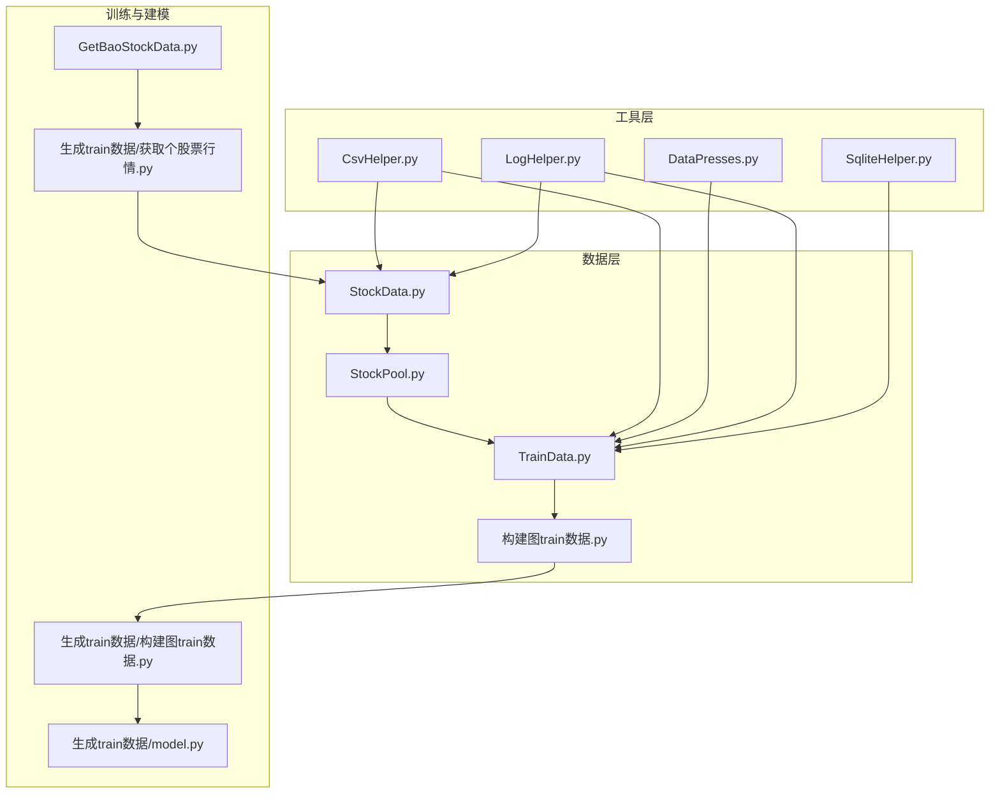
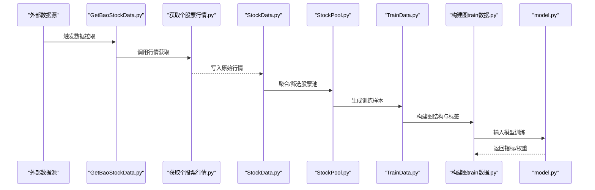
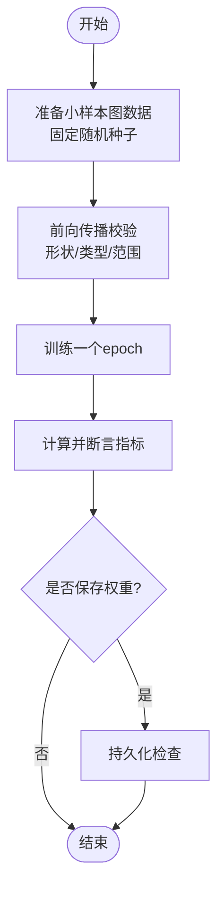
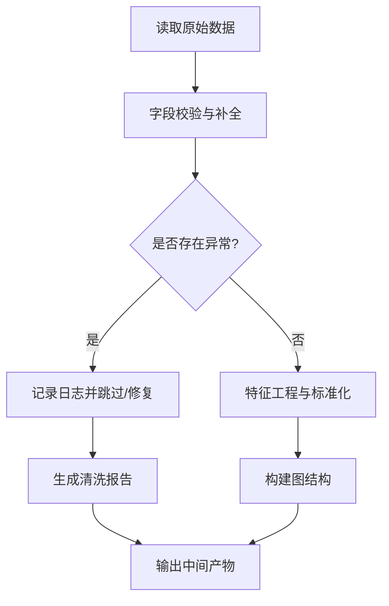
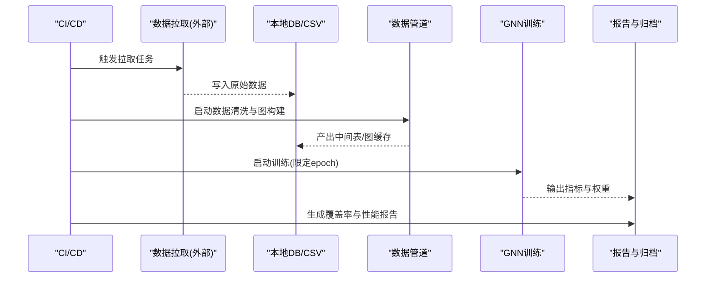
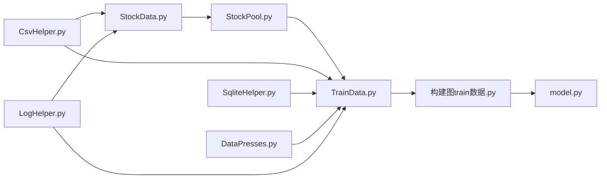

# 测试策略与实践

<cite>
**本文引用的文件**   
- [MyProject/DataBase/StockData.py](file://MyProject/DataBase/StockData.py)
- [MyProject/DataBase/StockPool.py](file://MyProject/DataBase/StockPool.py)
- [MyProject/DataBase/TrainData.py](file://MyProject/DataBase/TrainData.py)
- [MyProject/DataBase/构建图train数据.py](file://MyProject/DataBase/构建图train数据.py)
- [MyProject/Helper/CsvHelper.py](file://MyProject/Helper/CsvHelper.py)
- [MyProject/Helper/DataPresses.py](file://MyProject/Helper/DataPresses.py)
- [MyProject/Helper/LogHelper.py](file://MyProject/Helper/LogHelper.py)
- [MyProject/Helper/SqliteHelper.py](file://MyProject/Helper/SqliteHelper.py)
- [生成train数据/构建图train数据.py](file://生成train数据/构建图train数据.py)
- [生成train数据/model.py](file://生成train数据/model.py)
- [生成train数据/获取个股票行情.py](file://生成train数据/获取个股票行情.py)
- [GetBaoStockData.py](file://GetBaoStockData.py)
</cite>

## 目录
1. [引言](#引言)
2. [项目结构](#项目结构)
3. [核心组件](#核心组件)
4. [架构总览](#架构总览)
5. [详细组件分析](#详细组件分析)
6. [依赖分析](#依赖分析)
7. [性能考虑](#性能考虑)
8. [故障排查指南](#故障排查指南)
9. [结论](#结论)
10. [附录](#附录)

## 引言
本文件面向本项目（基于PyTorch Geometric的图神经网络与股票数据管道）制定一套完整的测试策略与实践规范，覆盖测试金字塔、单元测试编写指南、GNN模型测试方法、数据管道测试策略、测试工具链配置、性能与压力测试实施、结果分析与回归测试策略。目标是确保代码质量、可维护性与可复现性，同时为后续持续集成提供稳定基础。

## 项目结构
项目围绕“数据准备—特征工程—图构建—模型训练—评估”的主线展开，关键目录与职责如下：
- MyProject/DataBase：原始与加工后的股票数据、交易池、训练数据集与图构建脚本
- MyProject/Helper：CSV读写、数据压缩、日志、SQLite辅助等通用工具
- 生成train数据：图训练数据构建流程、模型定义与外部数据拉取脚本
- GetBaoStockData.py：外部行情数据获取入口

图表来源
- [MyProject/DataBase/StockData.py](file://MyProject/DataBase/StockData.py)
- [MyProject/DataBase/StockPool.py](file://MyProject/DataBase/StockPool.py)
- [MyProject/DataBase/TrainData.py](file://MyProject/DataBase/TrainData.py)
- [MyProject/DataBase/构建图train数据.py](file://MyProject/DataBase/构建图train数据.py)
- [MyProject/Helper/CsvHelper.py](file://MyProject/Helper/CsvHelper.py)
- [MyProject/Helper/DataPresses.py](file://MyProject/Helper/DataPresses.py)
- [MyProject/Helper/LogHelper.py](file://MyProject/Helper/LogHelper.py)
- [MyProject/Helper/SqliteHelper.py](file://MyProject/Helper/SqliteHelper.py)
- [生成train数据/构建图train数据.py](file://生成train数据/构建图train数据.py)
- [生成train数据/model.py](file://生成train数据/model.py)
- [生成train数据/获取个股票行情.py](file://生成train数据/获取个股票行情.py)
- [GetBaoStockData.py](file://GetBaoStockData.py)

章节来源
- [MyProject/DataBase/StockData.py](file://MyProject/DataBase/StockData.py)
- [MyProject/DataBase/StockPool.py](file://MyProject/DataBase/StockPool.py)
- [MyProject/DataBase/TrainData.py](file://MyProject/DataBase/TrainData.py)
- [MyProject/DataBase/构建图train数据.py](file://MyProject/DataBase/构建图train数据.py)
- [MyProject/Helper/CsvHelper.py](file://MyProject/Helper/CsvHelper.py)
- [MyProject/Helper/DataPresses.py](file://MyProject/Helper/DataPresses.py)
- [MyProject/Helper/LogHelper.py](file://MyProject/Helper/LogHelper.py)
- [MyProject/Helper/SqliteHelper.py](file://MyProject/Helper/SqliteHelper.py)
- [生成train数据/构建图train数据.py](file://生成train数据/构建图train数据.py)
- [生成train数据/model.py](file://生成train数据/model.py)
- [生成train数据/获取个股票行情.py](file://生成train数据/获取个股票行情.py)
- [GetBaoStockData.py](file://GetBaoStockData.py)

## 核心组件
- 数据获取与存储
  - 外部行情接入：通过外部接口拉取个股行情并落库或落盘，需校验字段完整性、时间序列连续性、去重与异常值处理。
  - 本地数据封装：对CSV/SQLite进行读写与查询封装，保证类型一致与空值处理。
- 数据清洗与特征工程
  - 数据压缩与缓存：减少IO开销，保障重复读取一致性。
  - 日志记录：关键步骤埋点，便于定位问题与审计。
- 图构建与训练
  - 将时序/截面数据转换为图结构（节点、边、属性），构造PyG Data对象。
  - 模型定义与训练循环：包含前向传播、损失计算、优化器更新、指标统计与保存。

章节来源
- [MyProject/DataBase/StockData.py](file://MyProject/DataBase/StockData.py)
- [MyProject/DataBase/StockPool.py](file://MyProject/DataBase/StockPool.py)
- [MyProject/DataBase/TrainData.py](file://MyProject/DataBase/TrainData.py)
- [MyProject/DataBase/构建图train数据.py](file://MyProject/DataBase/构建图train数据.py)
- [MyProject/Helper/CsvHelper.py](file://MyProject/Helper/CsvHelper.py)
- [MyProject/Helper/DataPresses.py](file://MyProject/Helper/DataPresses.py)
- [MyProject/Helper/LogHelper.py](file://MyProject/Helper/LogHelper.py)
- [MyProject/Helper/SqliteHelper.py](file://MyProject/Helper/SqliteHelper.py)
- [生成train数据/构建图train数据.py](file://生成train数据/构建图train数据.py)
- [生成train数据/model.py](file://生成train数据/model.py)
- [生成train数据/获取个股票行情.py](file://生成train数据/获取个股票行情.py)
- [GetBaoStockData.py](file://GetBaoStockData.py)

## 架构总览
下图展示从外部数据到图训练的整体流程，以及各模块间的调用关系与数据流向。

图表来源
- [GetBaoStockData.py](file://GetBaoStockData.py)
- [生成train数据/获取个股票行情.py](file://生成train数据/获取个股票行情.py)
- [MyProject/DataBase/StockData.py](file://MyProject/DataBase/StockData.py)
- [MyProject/DataBase/StockPool.py](file://MyProject/DataBase/StockPool.py)
- [MyProject/DataBase/TrainData.py](file://MyProject/DataBase/TrainData.py)
- [MyProject/DataBase/构建图train数据.py](file://MyProject/DataBase/构建图train数据.py)
- [生成train数据/model.py](file://生成train数据/model.py)

## 详细组件分析

### 测试金字塔与范围优先级
- 单元测试（数量最多、执行最快）
  - 目标：验证最小单元的正确性（函数/类方法）。
  - 范围：CSV读写、SQLite操作、数据压缩、日志输出、数据清洗规则、图构建小样例、模型前向形状与数值范围检查。
  - 优先级：高（每次提交必跑）。
- 集成测试（中等数量、中等速度）
  - 目标：验证模块间协作与端到端子流程。
  - 范围：数据拉取→入库→清洗→图构建→训练一个epoch；含外部依赖Mock。
  - 优先级：中高（每日定时或PR合并前）。
- 端到端测试（数量最少、最慢）
  - 目标：验证完整流水线在真实环境下的稳定性与可复现性。
  - 范围：全量数据构建+多轮训练+指标收敛性检查。
  - 优先级：中（发布前或里程碑版本）。

[本节为概念性说明，不直接分析具体文件]

### 单元测试编写指南
- 用例设计原则
  - 单一职责：每个用例只验证一个行为分支。
  - 可重复：固定随机种子、固定输入数据路径或内存对象。
  - 快速：避免I/O阻塞，必要时使用内存文件系统或临时目录。
  - 断言明确：不仅断言返回值，还要断言副作用（如日志写入、文件变更）。
- Mock对象使用
  - 网络请求：Mock外部行情接口，返回固定响应集。
  - 数据库：使用内存SQLite或隔离临时库，避免污染生产数据。
  - 外部服务：模拟失败/超时/限流场景，验证重试与降级逻辑。
- 数据准备策略
  - 小样本：构造极小但覆盖边界条件的图样例（单节点、无自环、稀疏边、缺失特征）。
  - 固定种子：保证数值型结果可复现。
  - 数据快照：将典型CSV/SQLite快照纳入仓库或随测试下载。

章节来源
- [MyProject/Helper/CsvHelper.py](file://MyProject/Helper/CsvHelper.py)
- [MyProject/Helper/SqliteHelper.py](file://MyProject/Helper/SqliteHelper.py)
- [MyProject/Helper/DataPresses.py](file://MyProject/Helper/DataPresses.py)
- [MyProject/Helper/LogHelper.py](file://MyProject/Helper/LogHelper.py)

### 图神经网络模型测试方法
- 输入输出验证
  - 维度与类型：节点特征矩阵、边索引、标签张量的形状与dtype符合预期。
  - 数值范围：激活值、损失值、梯度范数在合理区间，防止NaN/Inf。
  - 确定性：固定seed后多次运行输出一致。
- 训练过程监控
  - 指标曲线：loss、准确率/召回率/F1、AUC等单调性或收敛趋势。
  - 早停与回滚：达到阈值保存最佳权重，异常时恢复。
  - 资源占用：显存峰值、CPU/GPU利用率、训练吞吐。
- 性能基准测试
  - 基线对比：不同层数/隐藏维/学习率的性能差异。
  - 缩放测试：节点规模N、边密度E变化时的耗时与内存曲线。
  - 硬件无关性：在CPU与GPU上均可运行且结果等价（允许浮点误差）。

图表来源
- [生成train数据/model.py](file://生成train数据/model.py)
- [生成train数据/构建图train数据.py](file://生成train数据/构建图train数据.py)

章节来源
- [生成train数据/model.py](file://生成train数据/model.py)
- [生成train数据/构建图train数据.py](file://生成train数据/构建图train数据.py)

### 数据管道测试策略
- 数据质量检查
  - 完整性：必填字段非空、时间戳连续、股票代码存在。
  - 一致性：单位统一、正负号约定、去重策略正确。
  - 分布性：异常值检测（如Z-score、IQR）、类别均衡性。
- 异常处理
  - 网络错误：重试次数、退避策略、熔断开关。
  - 解析错误：跳过坏行并记录，保留进度。
  - 磁盘/IO：空间不足、权限问题的优雅退出与提示。
- 边界条件
  - 空数据/单样本/极大稀疏图/全零特征/极端标签比例。
  - 并发写入冲突、分片读取顺序一致性。

图表来源
- [MyProject/DataBase/StockData.py](file://MyProject/DataBase/StockData.py)
- [MyProject/DataBase/StockPool.py](file://MyProject/DataBase/StockPool.py)
- [MyProject/DataBase/TrainData.py](file://MyProject/DataBase/TrainData.py)
- [MyProject/DataBase/构建图train数据.py](file://MyProject/DataBase/构建图train数据.py)
- [MyProject/Helper/CsvHelper.py](file://MyProject/Helper/CsvHelper.py)
- [MyProject/Helper/SqliteHelper.py](file://MyProject/Helper/SqliteHelper.py)
- [MyProject/Helper/LogHelper.py](file://MyProject/Helper/LogHelper.py)

章节来源
- [MyProject/DataBase/StockData.py](file://MyProject/DataBase/StockData.py)
- [MyProject/DataBase/StockPool.py](file://MyProject/DataBase/StockPool.py)
- [MyProject/DataBase/TrainData.py](file://MyProject/DataBase/TrainData.py)
- [MyProject/DataBase/构建图train数据.py](file://MyProject/DataBase/构建图train数据.py)
- [MyProject/Helper/CsvHelper.py](file://MyProject/Helper/CsvHelper.py)
- [MyProject/Helper/SqliteHelper.py](file://MyProject/Helper/SqliteHelper.py)
- [MyProject/Helper/LogHelper.py](file://MyProject/Helper/LogHelper.py)

### 测试工具链配置
- pytest配置要点
  - 插件：pytest-cov（覆盖率）、pytest-timeout（超时保护）、pytest-xdist（并行）、pytest-mock（Mock）。
  - 标记：@pytest.mark.slow用于长耗时用例，默认仅运行fast。
  - 参数化：使用@pytest.mark.parametrize覆盖多组输入。
  - 配置文件：根目录放置pytest.ini或pyproject.toml中的[tool.pytest.ini_options]。
- 覆盖率报告
  - 命令示例：pytest --cov=MyProject --cov-report=html --cov-report=term-missing
  - 阈值：设置最低覆盖率门槛，未达标则CI失败。
- 测试数据管理
  - 小样本数据放入tests/fixtures或tests/data，按功能域组织。
  - 大文件或敏感数据使用环境变量控制下载路径，避免入库。
  - 使用临时目录（tmp_path）存放中间产物，测试结束后自动清理。

[本节为通用实践说明，不直接分析具体文件]

### 性能测试与压力测试
- 性能测试
  - 训练吞吐：样本/秒、迭代耗时、GPU利用率。
  - 图构建耗时：随节点/边规模变化的时间复杂度验证。
  - 内存峰值：监控最大RSS与显存占用，避免OOM。
- 压力测试
  - 并发数据写入：多线程/多进程写CSV/SQLite的锁与一致性。
  - 大数据量图：超大规模图的加载与训练稳定性。
  - 长时间运行：7×24小时稳定性与内存泄漏检测。
- 结果分析与回归
  - 指标基线：保存历史指标（JSON/CSV），新结果与之比较。
  - 回归判定：关键指标下降超过阈值即告警。
  - 可视化：生成趋势图与热力图，辅助定位退化原因。

[本节为通用实践说明，不直接分析具体文件]

### 端到端工作流测试（示例流程）

图表来源
- [生成train数据/获取个股票行情.py](file://生成train数据/获取个股票行情.py)
- [GetBaoStockData.py](file://GetBaoStockData.py)
- [MyProject/DataBase/StockData.py](file://MyProject/DataBase/StockData.py)
- [MyProject/DataBase/TrainData.py](file://MyProject/DataBase/TrainData.py)
- [生成train数据/model.py](file://生成train数据/model.py)

## 依赖分析
- 内部依赖
  - StockData/StockPool/TrainData/构建图train数据形成数据链路，彼此耦合度适中，建议以接口契约约束。
  - Helper模块被多处复用，应保持低耦合、纯函数风格为主。
- 外部依赖
  - PyTorch/PyG：图与深度学习核心。
  - 行情接口：网络波动与限频需Mock与容错。
  - SQLite/CSV：本地持久化，注意并发与事务。
- 潜在风险
  - 循环导入：确保模块分层清晰。
  - 全局状态：避免跨测试共享可变状态。
  - 硬编码路径：统一使用配置或环境变量。

图表来源
- [MyProject/DataBase/StockData.py](file://MyProject/DataBase/StockData.py)
- [MyProject/DataBase/StockPool.py](file://MyProject/DataBase/StockPool.py)
- [MyProject/DataBase/TrainData.py](file://MyProject/DataBase/TrainData.py)
- [MyProject/DataBase/构建图train数据.py](file://MyProject/DataBase/构建图train数据.py)
- [生成train数据/model.py](file://生成train数据/model.py)
- [MyProject/Helper/CsvHelper.py](file://MyProject/Helper/CsvHelper.py)
- [MyProject/Helper/SqliteHelper.py](file://MyProject/Helper/SqliteHelper.py)
- [MyProject/Helper/DataPresses.py](file://MyProject/Helper/DataPresses.py)
- [MyProject/Helper/LogHelper.py](file://MyProject/Helper/LogHelper.py)

章节来源
- [MyProject/DataBase/StockData.py](file://MyProject/DataBase/StockData.py)
- [MyProject/DataBase/StockPool.py](file://MyProject/DataBase/StockPool.py)
- [MyProject/DataBase/TrainData.py](file://MyProject/DataBase/TrainData.py)
- [MyProject/DataBase/构建图train数据.py](file://MyProject/DataBase/构建图train数据.py)
- [生成train数据/model.py](file://生成train数据/model.py)
- [MyProject/Helper/CsvHelper.py](file://MyProject/Helper/CsvHelper.py)
- [MyProject/Helper/SqliteHelper.py](file://MyProject/Helper/SqliteHelper.py)
- [MyProject/Helper/DataPresses.py](file://MyProject/Helper/DataPresses.py)
- [MyProject/Helper/LogHelper.py](file://MyProject/Helper/LogHelper.py)

## 性能考虑
- 数据侧
  - 批量读取与惰性加载，避免一次性载入超大图。
  - 使用列式存储或Parquet提升读取效率（可选）。
- 模型侧
  - 混合精度训练、梯度累积、分布式数据并行。
  - 图采样与Mini-batch训练降低显存压力。
- 测试侧
  - 使用小样本与短训练时长加速反馈。
  - 并行执行测试套件，缩短CI时间。

[本节为通用实践说明，不直接分析具体文件]

## 故障排查指南
- 常见问题定位
  - 数据缺失/错位：检查CSV/SQLite校验与日志，确认字段映射。
  - 图构建失败：打印节点/边数量与索引范围，核对PyG格式。
  - 训练崩溃：捕获NaN/Inf，检查学习率与梯度裁剪。
- 日志与断点
  - 关键路径打点：数据拉取、入库、清洗、图构建、训练阶段。
  - 结构化日志：包含时间、阶段、度量、错误码。
- 回滚与恢复
  - 权重检查点：异常时自动回滚至最近稳定版本。
  - 数据版本化：中间产物带版本号，支持回溯。

章节来源
- [MyProject/Helper/LogHelper.py](file://MyProject/Helper/LogHelper.py)
- [MyProject/DataBase/StockData.py](file://MyProject/DataBase/StockData.py)
- [MyProject/DataBase/TrainData.py](file://MyProject/DataBase/TrainData.py)
- [生成train数据/model.py](file://生成train数据/model.py)

## 结论
通过建立清晰的测试金字塔、完善的单元测试与集成测试、严格的GNN与数据管道测试策略，以及配套的测试工具链与性能基准，本项目可在保证质量的同时持续提升交付效率。建议在CI中固化关键测试与覆盖率门禁，逐步引入回归分析与自动化报告，形成闭环的质量保障体系。

## 附录
- 推荐命令
  - 运行全部测试：pytest
  - 仅运行快速测试：pytest -m not slow
  - 生成覆盖率报告：pytest --cov=MyProject --cov-report=html
  - 并行执行：pytest -n auto
- 目录建议
  - tests/unit：单元测试
  - tests/integration：集成测试
  - tests/e2e：端到端测试
  - tests/fixtures：测试数据与快照
  - tests/perf：性能与压力测试

[本节为通用实践说明，不直接分析具体文件]