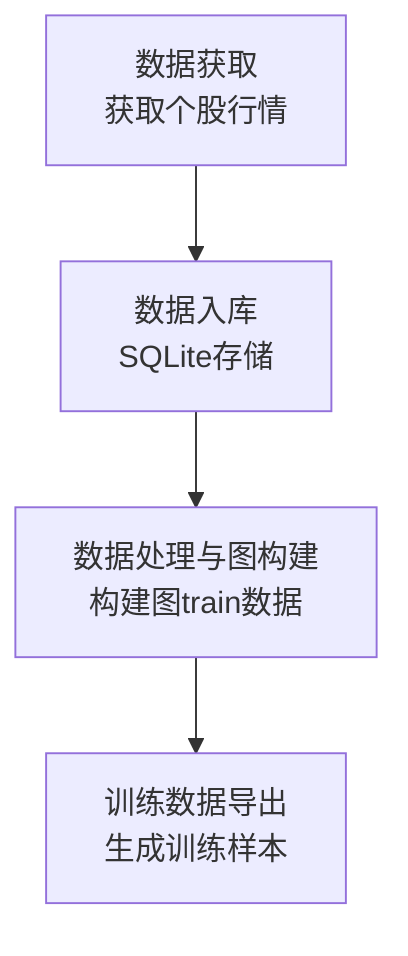
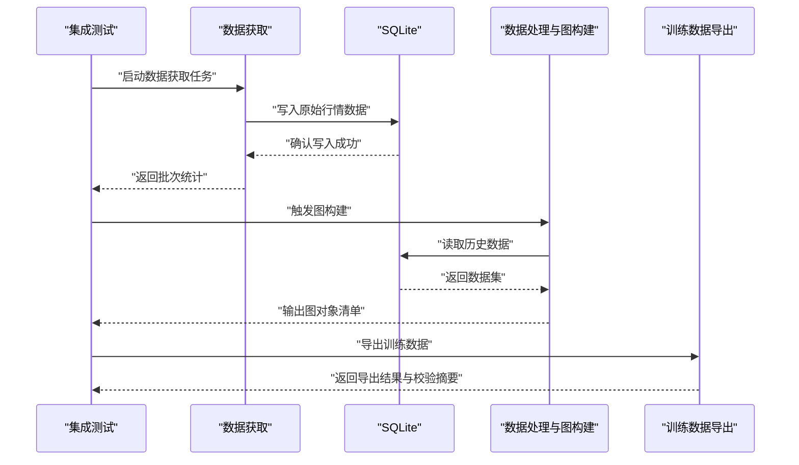
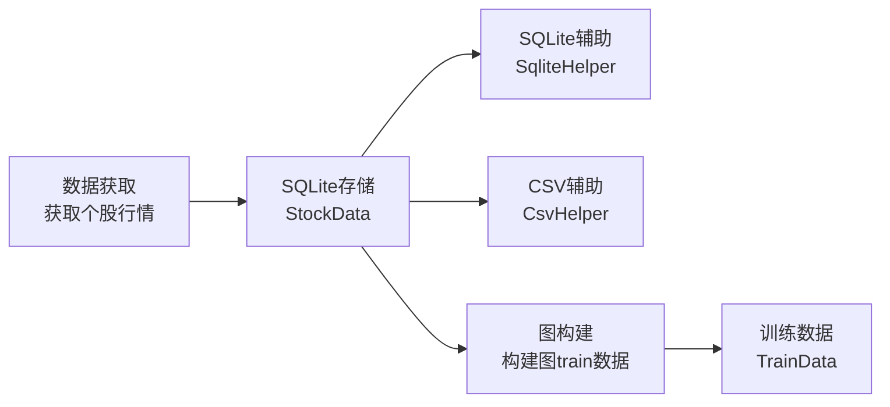

# 集成测试策略

<cite>
**本文引用的文件**   
- [GetBaoStockData.py](file://GetBaoStockData.py)
- [DataBase/StockData.py](file://MyProject/DataBase/StockData.py)
- [DataBase/TrainData.py](file://MyProject/DataBase/TrainData.py)
- [DataBase/构建图train数据.py](file://MyProject/DataBase/构建图train数据.py)
- [Helper/CsvHelper.py](file://MyProject/Helper/CsvHelper.py)
- [Helper/SqliteHelper.py](file://MyProject/Helper/SqliteHelper.py)
- [生成train数据/获取个股票行情.py](file://生成train数据/获取个股票行情.py)
- [生成train数据/构建图train数据.py](file://生成train数据/构建图train数据.py)
</cite>

## 目录
1. [引言](#引言)
2. [项目结构](#项目结构)
3. [核心组件](#核心组件)
4. [架构总览](#架构总览)
5. [详细组件分析](#详细组件分析)
6. [依赖关系分析](#依赖关系分析)
7. [性能考虑](#性能考虑)
8. [故障排查指南](#故障排查指南)
9. [结论](#结论)
10. [附录](#附录)

## 引言
本文件面向GNN股票数据分析与训练数据生成的数据管道，提供端到端的集成测试策略。目标包括：
- 定义从“股票数据获取”到“数据处理”、“图构建”再到“训练数据生成”的完整集成测试方案
- 明确各模块间接口契约（数据格式、API调用、错误处理）
- 给出测试环境搭建指南（数据库初始化、测试数据准备、依赖服务模拟）
- 覆盖异步操作与并发场景的测试方法
- 提供完整的集成测试用例示例，覆盖主要业务流程与异常场景

## 项目结构
本项目围绕“数据获取—清洗入库—图构建—训练数据导出”的数据流水线组织代码。关键路径如下：
- 数据获取层：通过外部数据源拉取个股行情与基础信息
- 数据持久化层：使用SQLite进行结构化存储
- 数据处理与图构建层：基于已入库数据进行特征工程与图结构构造
- 训练数据导出层：输出供GNN模型消费的训练样本

图表来源
- [生成train数据/获取个股票行情.py](file://生成train数据/获取个股票行情.py)
- [DataBase/StockData.py](file://MyProject/DataBase/StockData.py)
- [DataBase/构建图train数据.py](file://MyProject/DataBase/构建图train数据.py)
- [DataBase/TrainData.py](file://MyProject/DataBase/TrainData.py)

章节来源
- [GetBaoStockData.py](file://GetBaoStockData.py)
- [生成train数据/获取个股票行情.py](file://生成train数据/获取个股票行情.py)
- [DataBase/StockData.py](file://MyProject/DataBase/StockData.py)
- [DataBase/TrainData.py](file://MyProject/DataBase/TrainData.py)
- [DataBase/构建图train数据.py](file://MyProject/DataBase/构建图train数据.py)

## 核心组件
- 数据获取模块
  - 负责对接外部数据源，拉取个股行情与基础信息，并进行初步校验与落库
  - 关注点：网络稳定性、限流与重试、字段完整性、时间序列连续性
- 数据持久化模块
  - 基于SQLite的表结构与读写封装，确保事务一致性与幂等写入
  - 关注点：连接池、索引设计、批量写入、回滚与恢复
- 数据处理与图构建模块
  - 读取入库数据，计算技术指标、构建节点与边、生成图对象
  - 关注点：数值稳定性、缺失值处理、图规模控制、内存占用
- 训练数据导出模块
  - 将图与标签转换为GNN可消费的格式（如PyTorch Geometric Data）
  - 关注点：格式一致性、序列化体积、分片与并行IO

章节来源
- [GenerateBaoStockData.py](file://GetBaoStockData.py)
- [DataBase/StockData.py](file://MyProject/DataBase/StockData.py)
- [DataBase/TrainData.py](file://MyProject/DataBase/TrainData.py)
- [DataBase/构建图train数据.py](file://MyProject/DataBase/构建图train数据.py)

## 架构总览
下图展示端到端数据管道的集成测试边界与交互点。测试应覆盖：
- 外部数据源模拟与断网/超时/限流场景
- SQLite读写与事务一致性
- 图构建阶段的数值与拓扑正确性
- 训练数据导出的格式与可读性

图表来源
- [生成train数据/获取个股票行情.py](file://生成train数据/获取个股票行情.py)
- [DataBase/StockData.py](file://MyProject/DataBase/StockData.py)
- [DataBase/构建图train数据.py](file://MyProject/DataBase/构建图train数据.py)
- [DataBase/TrainData.py](file://MyProject/DataBase/TrainData.py)

## 详细组件分析

### 数据获取模块集成测试
- 测试目标
  - 验证数据字段完整性、时间戳顺序、去重与幂等
  - 验证网络异常、限流、超时、空响应等异常分支
- 关键断言
  - 返回数据结构符合预期Schema
  - 写入SQLite后记录数与期望一致
  - 重复执行不产生重复记录
- 建议实现要点
  - 使用请求级Mock或本地HTTP服务器模拟外部API
  - 注入失败模式（超时、5xx、429、空体）
  - 对批大小、重试次数、退避策略进行参数化测试

章节来源
- [生成train数据/获取个股票行情.py](file://生成train数据/获取个股票行情.py)
- [GetBaoStockData.py](file://GetBaoStockData.py)

### 数据持久化模块集成测试
- 测试目标
  - 表结构约束生效（主键、唯一、非空）
  - 事务提交与回滚行为正确
  - 批量写入性能与内存占用可控
- 关键断言
  - 插入/更新/删除后查询结果一致
  - 并发写入无脏读/丢失写
  - 大事务下磁盘I/O稳定
- 建议实现要点
  - 使用独立测试数据库文件，每次测试前重置
  - 开启外键与检查约束
  - 针对热点表建立必要索引并验证查询计划

章节来源
- [DataBase/StockData.py](file://MyProject/DataBase/StockData.py)
- [Helper/SqliteHelper.py](file://MyProject/Helper/SqliteHelper.py)

### 数据处理与图构建模块集成测试
- 测试目标
  - 指标计算正确性（如均线、MACD等）
  - 节点/边定义与数量符合预期
  - 图对象可被下游读取且维度一致
- 关键断言
  - 输入时间窗口内数据连续且无NaN
  - 图邻接矩阵/边列表与节点特征维度匹配
  - 不同股票子图的隔离性
- 建议实现要点
  - 使用小样本固定数据集保证确定性
  - 对极端值与缺失值进行边界测试
  - 监控峰值内存与构建耗时

章节来源
- [DataBase/构建图train数据.py](file://MyProject/DataBase/构建图train数据.py)
- [DataBase/TrainData.py](file://MyProject/DataBase/TrainData.py)

### 训练数据导出模块集成测试
- 测试目标
  - 导出文件格式与字段顺序稳定
  - 下游框架可正常加载
  - 分片/压缩策略有效
- 关键断言
  - 导出文件MD5/行数/列数与基准一致
  - 加载后张量形状与类型正确
  - 增量导出仅包含新增样本
- 建议实现要点
  - 使用最小可复现实例进行回归比对
  - 对超大样本进行分片与断点续传测试

章节来源
- [DataBase/TrainData.py](file://MyProject/DataBase/TrainData.py)

### 接口契约与数据格式验证
- 数据格式规范
  - 统一时间戳与时区
  - 必填字段与取值范围
  - 编码与分隔符约定
- API调用契约
  - 请求头、分页、排序、过滤参数
  - 状态码与错误码语义
  - 幂等键与重试策略
- 错误处理机制
  - 业务异常与系统异常分类
  - 日志级别与上下文信息
  - 降级与熔断策略

章节来源
- [Helper/CsvHelper.py](file://MyProject/Helper/CsvHelper.py)
- [Helper/SqliteHelper.py](file://MyProject/Helper/SqliteHelper.py)

### 异步与并发测试策略
- 异步操作
  - 使用事件循环驱动的任务编排
  - 对超时、取消、异常传播进行断言
- 并发场景
  - 多进程/多线程写入同一表的竞争条件
  - 锁粒度与死锁检测
  - 资源上限与背压策略
- 建议实现要点
  - 使用轻量级消息队列或内存队列模拟异步
  - 并发度与批大小作为参数化变量
  - 引入随机抖动以暴露时序相关缺陷

[本节为通用方法论，不直接分析具体文件]

## 依赖关系分析
下图展示关键模块间的依赖关系，便于定位集成测试的耦合面与替换点。

图表来源
- [生成train数据/获取个股票行情.py](file://生成train数据/获取个股票行情.py)
- [DataBase/StockData.py](file://MyProject/DataBase/StockData.py)
- [Helper/SqliteHelper.py](file://MyProject/Helper/SqliteHelper.py)
- [Helper/CsvHelper.py](file://MyProject/Helper/CsvHelper.py)
- [DataBase/构建图train数据.py](file://MyProject/DataBase/构建图train数据.py)
- [DataBase/TrainData.py](file://MyProject/DataBase/TrainData.py)

章节来源
- [生成train数据/获取个股票行情.py](file://生成train数据/获取个股票行情.py)
- [DataBase/StockData.py](file://MyProject/DataBase/StockData.py)
- [Helper/SqliteHelper.py](file://MyProject/Helper/SqliteHelper.py)
- [Helper/CsvHelper.py](file://MyProject/Helper/CsvHelper.py)
- [DataBase/构建图train数据.py](file://MyProject/DataBase/构建图train数据.py)
- [DataBase/TrainData.py](file://MyProject/DataBase/TrainData.py)

## 性能考虑
- I/O优化
  - 批量写入与预编译SQL
  - 合理索引与分区策略
- 计算优化
  - 向量化计算与缓存中间结果
  - 图构建阶段惰性加载与按需计算
- 资源管理
  - 连接池与线程池上限
  - 内存水位监控与自动降采样

[本节为通用指导，不直接分析具体文件]

## 故障排查指南
- 常见问题定位
  - 数据缺失：核对时间窗口与去重逻辑
  - 图构建失败：检查节点/边维度与连通性
  - 导出不可用：对比基准文件的哈希与结构
- 日志与观测
  - 关键步骤埋点与耗时统计
  - 错误堆栈与上下文快照
- 快速恢复
  - 幂等重建与断点续跑
  - 回滚至最近可用快照

章节来源
- [Helper/SqliteHelper.py](file://MyProject/Helper/SqliteHelper.py)
- [DataBase/构建图train数据.py](file://MyProject/DataBase/构建图train数据.py)

## 结论
通过分层与端到端相结合的集成测试策略，可有效保障数据管道在复杂环境与异常条件下的稳定性与正确性。建议在CI中固化最小可复现用例，结合Mock与参数化覆盖更多边界场景，持续回归以确保演进安全。

[本节为总结性内容，不直接分析具体文件]

## 附录

### 测试环境搭建指南
- 数据库初始化
  - 创建独立测试数据库文件
  - 执行建表脚本与索引初始化
  - 准备种子数据（少量但具代表性）
- 依赖服务模拟
  - 使用本地HTTP服务器或Mock框架模拟外部API
  - 注入失败模式（超时、限流、空响应）
- 运行方式
  - 单测与集成测试分离
  - 使用配置文件切换环境（开发/测试/生产）

[本节为通用指导，不直接分析具体文件]

### 端到端集成测试用例示例（流程说明）
- 正常流程
  - 拉取N只股票M天行情 → 写入SQLite → 构建图 → 导出训练数据 → 校验导出文件
- 异常流程
  - 外部API超时/限流 → 重试与退避 → 部分失败回滚 → 告警与补偿
  - 数据缺失/异常值 → 清洗与插补 → 记录审计日志
  - 并发写入冲突 → 锁等待与重试 → 最终一致性校验
- 回归与冒烟
  - 固定小样本集的最小路径用例
  - 关键指标阈值断言（行数、列数、哈希）

[本节为通用指导，不直接分析具体文件]