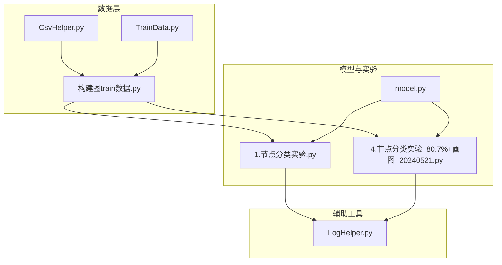
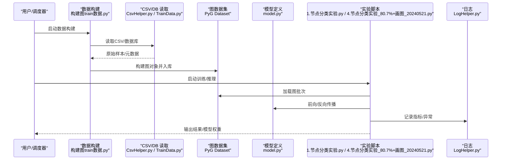
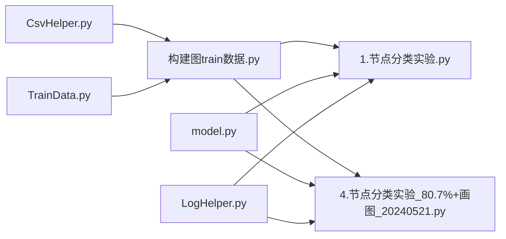

# 调试与性能优化

<cite>
**本文引用的文件**   
- [MyProject/Helper/LogHelper.py](file://MyProject/Helper/LogHelper.py)
- [MyProject/Model/1.节点分类实验.py](file://MyProject/Model/1.节点分类实验.py)
- [MyProject/Model/4.节点分类实验_80.7%+画图_20240521.py](file://MyProject/Model/4.节点分类实验_80.7%+画图_20240521.py)
- [生成train数据/构建图train数据.py](file://生成train数据/构建图train数据.py)
- [生成train数据/model.py](file://生成train数据/model.py)
- [MyProject/DataBase/TrainData.py](file://MyProject/DataBase/TrainData.py)
- [MyProject/Helper/CsvHelper.py](file://MyProject/Helper/CsvHelper.py)
- [网络资料/3-图模型必备神器PyTorch Geometric安装与使用/工具包使用/2-点分类任务.ipynb](file://网络资料/3-图模型必备神器PyTorch Geometric安装与使用/工具包使用/2-点分类任务.ipynb)
</cite>

## 目录
1. [简介](#简介)
2. [项目结构](#项目结构)
3. [核心组件](#核心组件)
4. [架构总览](#架构总览)
5. [详细组件分析](#详细组件分析)
6. [依赖关系分析](#依赖关系分析)
7. [性能考虑](#性能考虑)
8. [故障排查指南](#故障排查指南)
9. [结论](#结论)
10. [附录](#附录)

## 简介
本指南面向基于 PyTorch Geometric（PyG）的图神经网络训练与推理流程，聚焦于“调试”和“性能优化”。内容覆盖：
- 系统化调试方法：日志记录、断点调试、错误追踪策略
- PyG 模型调试：图数据验证、梯度检查、内存泄漏检测
- 性能分析方法：CPU/GPU 利用率监控、内存使用分析、计算瓶颈识别
- 常见优化技巧：图批处理、数据加载加速、推理优化
- 生产环境监控与诊断工具
- 基准测试构建与执行、性能回归检测与处理流程

## 项目结构
仓库围绕“数据准备—模型训练—策略评估”展开。关键路径包括：
- 数据准备与图构建：生成 train 数据、CSV 辅助、数据库读写
- 模型与实验脚本：节点分类实验、可视化输出
- 辅助工具：日志、绘图、随机数、SQLite 等

图表来源
- [MyProject/Helper/CsvHelper.py](file://MyProject/Helper/CsvHelper.py)
- [MyProject/DataBase/TrainData.py](file://MyProject/DataBase/TrainData.py)
- [生成train数据/构建图train数据.py](file://生成train数据/构建图train数据.py)
- [MyProject/Model/1.节点分类实验.py](file://MyProject/Model/1.节点分类实验.py)
- [MyProject/Model/4.节点分类实验_80.7%+画图_20240521.py](file://MyProject/Model/4.节点分类实验_80.7%+画图_20240521.py)
- [生成train数据/model.py](file://生成train数据/model.py)
- [MyProject/Helper/LogHelper.py](file://MyProject/Helper/LogHelper.py)

章节来源
- [MyProject/Helper/LogHelper.py](file://MyProject/Helper/LogHelper.py)
- [MyProject/Model/1.节点分类实验.py](file://MyProject/Model/1.节点分类实验.py)
- [MyProject/Model/4.节点分类实验_80.7%+画图_20240521.py](file://MyProject/Model/4.节点分类实验_80.7%+画图_20240521.py)
- [生成train数据/构建图train数据.py](file://生成train数据/构建图train数据.py)
- [生成train数据/model.py](file://生成train数据/model.py)
- [MyProject/DataBase/TrainData.py](file://MyProject/DataBase/TrainData.py)
- [MyProject/Helper/CsvHelper.py](file://MyProject/Helper/CsvHelper.py)

## 核心组件
- 日志系统：统一日志封装，便于在训练/推理各阶段记录关键信息
- 数据管道：从 CSV/数据库读取原始数据，构建 PyG 图数据集，供训练器消费
- 模型与实验：定义模型结构、训练循环、指标统计与可视化
- 辅助工具：CSV 解析、SQLite 存取、绘图、随机种子控制

章节来源
- [MyProject/Helper/LogHelper.py](file://MyProject/Helper/LogHelper.py)
- [MyProject/Helper/CsvHelper.py](file://MyProject/Helper/CsvHelper.py)
- [MyProject/DataBase/TrainData.py](file://MyProject/DataBase/TrainData.py)
- [生成train数据/构建图train数据.py](file://生成train数据/构建图train数据.py)
- [生成train数据/model.py](file://生成train数据/model.py)
- [MyProject/Model/1.节点分类实验.py](file://MyProject/Model/1.节点分类实验.py)
- [MyProject/Model/4.节点分类实验_80.7%+画图_20240521.py](file://MyProject/Model/4.节点分类实验_80.7%+画图_20240521.py)

## 架构总览
下图展示从数据到训练的关键调用链与交互关系，适用于定位问题与性能热点。

图表来源
- [生成train数据/构建图train数据.py](file://生成train数据/构建图train数据.py)
- [MyProject/Helper/CsvHelper.py](file://MyProject/Helper/CsvHelper.py)
- [MyProject/DataBase/TrainData.py](file://MyProject/DataBase/TrainData.py)
- [生成train数据/model.py](file://生成train数据/model.py)
- [MyProject/Model/1.节点分类实验.py](file://MyProject/Model/1.节点分类实验.py)
- [MyProject/Model/4.节点分类实验_80.7%+画图_20240521.py](file://MyProject/Model/4.节点分类实验_80.7%+画图_20240521.py)
- [MyProject/Helper/LogHelper.py](file://MyProject/Helper/LogHelper.py)

## 详细组件分析

### 日志系统与可观测性
- 目标：为数据构建、训练、推理提供一致的日志能力，便于回溯与排障
- 建议实践：
  - 分级日志：DEBUG/INFO/WARNING/ERROR，避免过度 DEBUG 影响性能
  - 结构化字段：包含时间戳、进程/线程、模块名、关键参数摘要
  - 异常堆栈：捕获并记录完整 traceback，附带上下文快照（如 batch size、设备、张量形状）
  - 采样与轮转：大日志按大小或时间轮转；高频日志采样降低 I/O 压力
  - 指标埋点：loss、acc、吞吐、延迟、显存占用等关键指标定期写入

章节来源
- [MyProject/Helper/LogHelper.py](file://MyProject/Helper/LogHelper.py)

### 数据构建与图数据验证
- 目标：确保图结构与标签一致，减少训练期崩溃与偏差
- 验证清单：
  - 节点特征维度一致性、边索引范围合法、无自环/重复边（视任务而定）
  - 标签分布合理、类别平衡、缺失值处理
  - 图数量、平均度、连通分量统计
- 建议实现：
  - 在数据构建完成后增加校验步骤，失败即中止并输出详细报告
  - 对异常图进行隔离与重放，便于后续修复

章节来源
- [生成train数据/构建图train数据.py](file://生成train数据/构建图train数据.py)
- [MyProject/Helper/CsvHelper.py](file://MyProject/Helper/CsvHelper.py)
- [MyProject/DataBase/TrainData.py](file://MyProject/DataBase/TrainData.py)

### 模型与训练循环
- 目标：稳定收敛、可复现实验、便于定位梯度与数值问题
- 建议要点：
  - 固定随机种子，保证可复现
  - 学习率预热/衰减策略，梯度裁剪防爆炸
  - 早停与最佳模型保存，避免过拟合
  - 混合精度训练（可选），注意数值稳定性
  - 训练曲线与指标持久化，便于离线分析

章节来源
- [生成train数据/model.py](file://生成train数据/model.py)
- [MyProject/Model/1.节点分类实验.py](file://MyProject/Model/1.节点分类实验.py)
- [MyProject/Model/4.节点分类实验_80.7%+画图_20240521.py](file://MyProject/Model/4.节点分类实验_80.7%+画图_20240521.py)

### PyG 模型调试方法
- 图数据验证：
  - 检查 x, edge_index, y 的形状与类型
  - 统计图的规模与稀疏度，确认 DataLoader 的 num_workers/pin_memory 配置
- 梯度检查：
  - 打印/记录每层参数梯度范数与均值，定位不更新或爆炸的层
  - 使用小批量合成数据快速验证反向传播链路
- 内存泄漏检测：
  - 训练循环中定期释放中间变量，避免引用累积
  - 使用 torch.cuda.memory_summary 与外部工具（如 nvprof/nsys）观察显存趋势
  - 关闭不必要的 requires_grad 分支，减少图保留

章节来源
- [网络资料/3-图模型必备神器PyTorch Geometric安装与使用/工具包使用/2-点分类任务.ipynb](file://网络资料/3-图模型必备神器PyTorch Geometric安装与使用/工具包使用/2-点分类任务.ipynb)
- [生成train数据/model.py](file://生成train数据/model.py)
- [MyProject/Model/1.节点分类实验.py](file://MyProject/Model/1.节点分类实验.py)

### 性能分析方法
- CPU/GPU 利用率监控：
  - nvidia-smi 周期性采样，关注 GPU Utilization、SM 利用率、显存带宽
  - Linux perf、htop/top 观察 CPU 使用与线程竞争
- 内存使用分析：
  - Python 侧：tracemalloc、objgraph 定位对象增长
  - CUDA 侧：torch.cuda.memory_allocated/used，memory_summary
- 计算瓶颈识别：
  - 使用 torch.profiler 或 Nsight Systems 定位热点算子
  - 关注 DataLoader 是否成为瓶颈（I/O、预处理、序列化）

[本节为通用指导，不直接分析具体文件]

### 常见优化技巧
- 图批处理优化：
  - 使用 Batch 合并多图，减少内核启动开销
  - 调整 max_nodes_per_batch 或 per_graph_max_nodes 以平衡吞吐与显存
- 数据加载加速：
  - 启用 pin_memory、num_workers > 0，预取下一批次
  - 将图数据缓存至内存或磁盘高效格式（如 .pt/.bin）
- 模型推理优化：
  - 使用 torch.no_grad()，关闭梯度
  - 半精度推理（FP16/BF16），结合 TensorRT/TorchScript（可选）
  - 批量化推理，避免逐样本调用

[本节为通用指导，不直接分析具体文件]

### 生产环境监控与诊断
- 指标采集：
  - 业务指标：准确率、召回率、AUC、延迟分位
  - 系统指标：GPU 利用率、显存峰值、CPU 负载、I/O 吞吐
- 告警与回滚：
  - 设定阈值触发告警，自动降级或回滚到上一稳定版本
- 可观测性平台：
  - 日志集中收集（ELK/Loki）、指标上报（Prometheus/Grafana）、分布式追踪（OpenTelemetry）

[本节为通用指导，不直接分析具体文件]

### 基准测试与性能回归管理
- 基准设计：
  - 固定数据集、模型、硬件与驱动版本
  - 覆盖典型场景：小图/大图、低/高并发、不同 batch size
- 执行与度量：
  - 记录吞吐（样本/秒）、端到端延迟、资源占用
  - 多次运行取稳健统计（中位数、P95/P99）
- 回归检测：
  - 自动化 CI 跑基准，对比历史基线，超阈则阻断合并
  - 定位变更点（数据/模型/依赖/环境），最小化复现

[本节为通用指导，不直接分析具体文件]

## 依赖关系分析
- 数据层依赖 CSV/DB 读取与 SQLite 存储
- 模型与实验脚本依赖 PyG 数据加载与训练接口
- 日志贯穿全链路，作为统一的可观测入口

图表来源
- [MyProject/Helper/CsvHelper.py](file://MyProject/Helper/CsvHelper.py)
- [MyProject/DataBase/TrainData.py](file://MyProject/DataBase/TrainData.py)
- [生成train数据/构建图train数据.py](file://生成train数据/构建图train数据.py)
- [生成train数据/model.py](file://生成train数据/model.py)
- [MyProject/Model/1.节点分类实验.py](file://MyProject/Model/1.节点分类实验.py)
- [MyProject/Model/4.节点分类实验_80.7%+画图_20240521.py](file://MyProject/Model/4.节点分类实验_80.7%+画图_20240521.py)
- [MyProject/Helper/LogHelper.py](file://MyProject/Helper/LogHelper.py)

章节来源
- [MyProject/Helper/CsvHelper.py](file://MyProject/Helper/CsvHelper.py)
- [MyProject/DataBase/TrainData.py](file://MyProject/DataBase/TrainData.py)
- [生成train数据/构建图train数据.py](file://生成train数据/构建图train数据.py)
- [生成train数据/model.py](file://生成train数据/model.py)
- [MyProject/Model/1.节点分类实验.py](file://MyProject/Model/1.节点分类实验.py)
- [MyProject/Model/4.节点分类实验_80.7%+画图_20240521.py](file://MyProject/Model/4.节点分类实验_80.7%+画图_20240521.py)
- [MyProject/Helper/LogHelper.py](file://MyProject/Helper/LogHelper.py)

## 性能考虑
- 数据 I/O 往往是首当其冲的瓶颈，优先优化数据管线
- 图批处理能显著提升吞吐，但需权衡显存与 OOM 风险
- 混合精度与算子融合可提升速度，需验证数值稳定性
- 生产环境应持续监控资源使用，建立容量规划与弹性扩容策略

[本节为通用指导，不直接分析具体文件]

## 故障排查指南
- 常见问题定位流程：
  - 现象确认：复现条件、输入规模、设备与版本
  - 日志检索：按时间/模块/级别过滤，关联异常前后上下文
  - 数据校验：检查图结构、标签、特征一致性
  - 梯度诊断：查看梯度范数、是否存在 NaN/Inf
  - 资源分析：CPU/GPU/内存/显存趋势，定位热点
- 常用工具：
  - Python：pdb/ipdb、logging、torch.profiler、tracemalloc
  - CUDA：nvidia-smi、nvprof、Nsight Systems、Nsight Compute
  - 系统：perf、top/htop、vmstat、iostat

章节来源
- [MyProject/Helper/LogHelper.py](file://MyProject/Helper/LogHelper.py)
- [MyProject/Model/1.节点分类实验.py](file://MyProject/Model/1.节点分类实验.py)
- [MyProject/Model/4.节点分类实验_80.7%+画图_20240521.py](file://MyProject/Model/4.节点分类实验_80.7%+画图_20240521.py)

## 结论
通过统一的日志体系、严格的数据与梯度校验、系统的性能分析与优化手段，以及完善的基准与回归管理机制，可以显著提升图神经网络项目的稳定性与效率。建议在研发早期就引入这些实践，形成工程化闭环。

[本节为总结性内容，不直接分析具体文件]

## 附录
- 术语表：
  - 图批处理：将多个图合并为一个批次以提升吞吐
  - 混合精度：使用较低精度（如 FP16）进行计算与存储
  - 性能回归：变更后性能较基线显著下降的现象
- 参考示例：
  - 点分类任务示例可用于理解 PyG 数据与训练流程

章节来源
- [网络资料/3-图模型必备神器PyTorch Geometric安装与使用/工具包使用/2-点分类任务.ipynb](file://网络资料/3-图模型必备神器PyTorch Geometric安装与使用/工具包使用/2-点分类任务.ipynb)