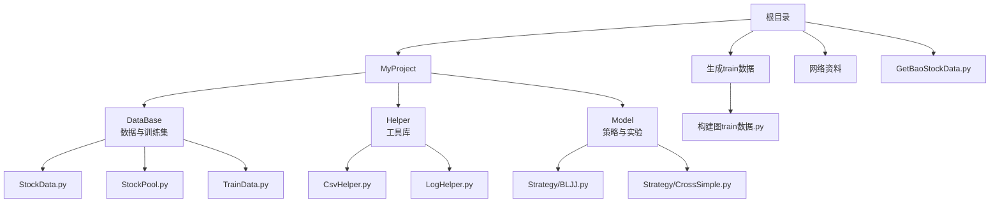
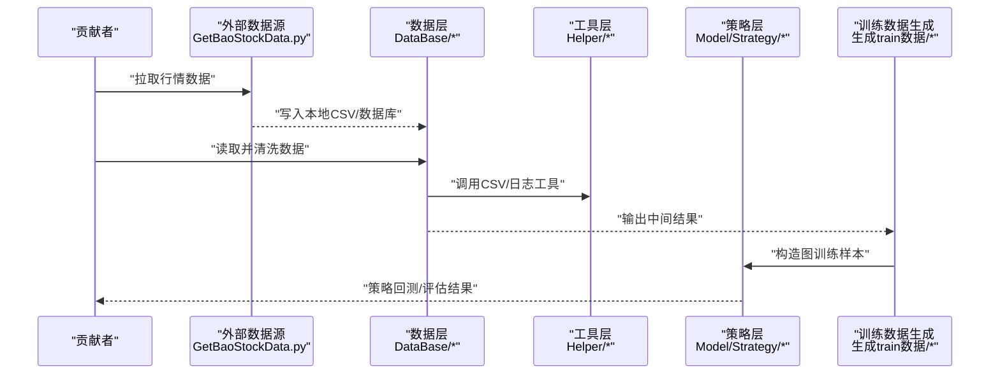
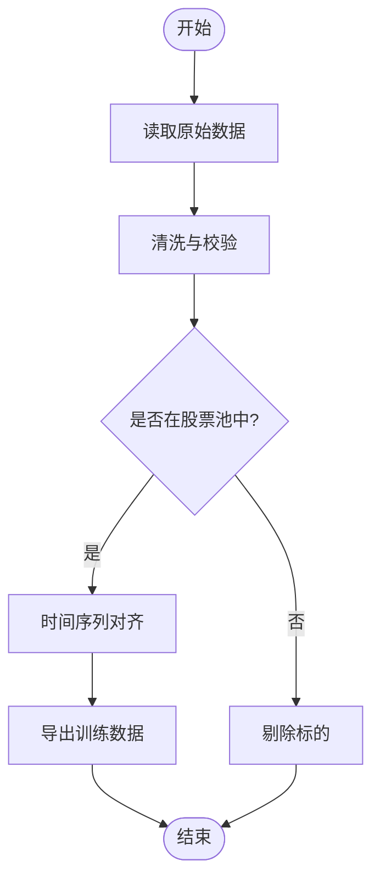
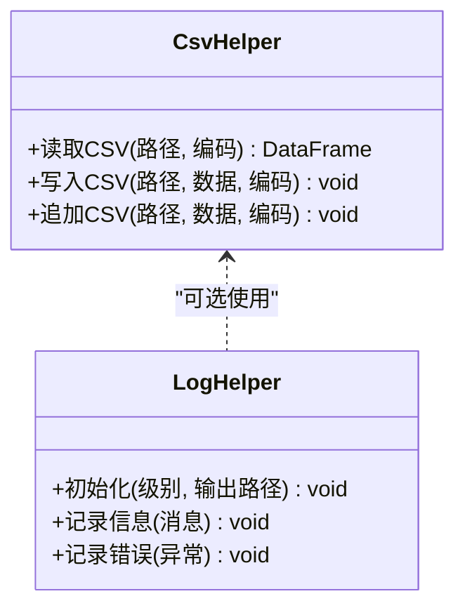
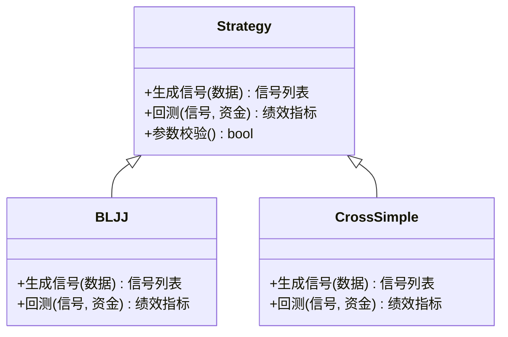
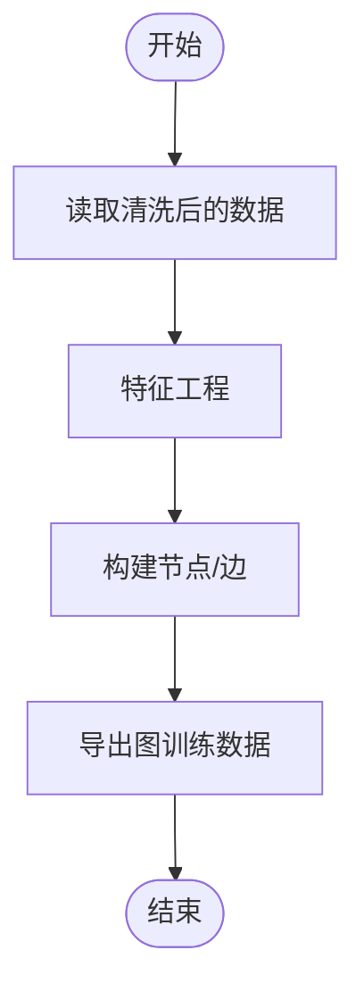
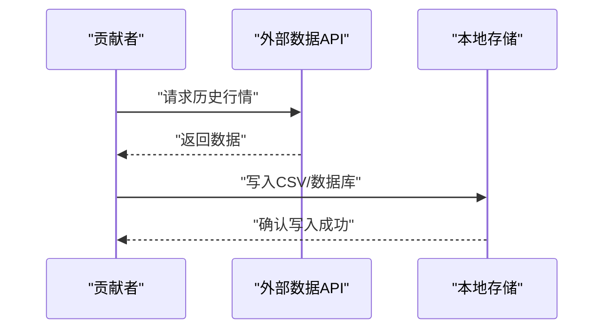
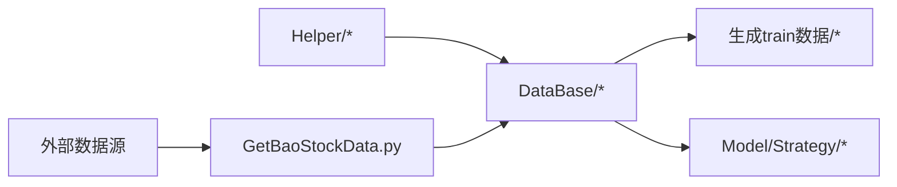

# 贡献指南

<cite>
**本文引用的文件**   
- [MyProject/DataBase/StockData.py](file://MyProject/DataBase/StockData.py)
- [MyProject/DataBase/StockPool.py](file://MyProject/DataBase/StockPool.py)
- [MyProject/DataBase/TrainData.py](file://MyProject/DataBase/TrainData.py)
- [MyProject/Helper/CsvHelper.py](file://MyProject/Helper/CsvHelper.py)
- [MyProject/Helper/LogHelper.py](file://MyProject/Helper/LogHelper.py)
- [MyProject/Model/Strategy/BLJJ.py](file://MyProject/Model/Strategy/BLJJ.py)
- [MyProject/Model/Strategy/CrossSimple.py](file://MyProject/Model/Strategy/CrossSimple.py)
- [生成train数据/构建图train数据.py](file://生成train数据/构建图train数据.py)
- [GetBaoStockData.py](file://GetBaoStockData.py)
</cite>

## 目录
1. [简介](#简介)
2. [项目结构](#项目结构)
3. [核心组件](#核心组件)
4. [架构总览](#架构总览)
5. [详细组件分析](#详细组件分析)
6. [依赖关系分析](#依赖关系分析)
7. [性能与可维护性建议](#性能与可维护性建议)
8. [故障排查指南](#故障排查指南)
9. [结论](#结论)
10. [附录：贡献流程与规范](#附录贡献流程与规范)

## 简介
本贡献指南面向希望参与本项目（基于图神经网络的股票策略研究）的开发者，提供从环境准备、代码提交到审查合并的全流程说明。文档同时定义Pull Request模板与审查清单、Issue模板与标签规范、文档贡献与发布流程、社区行为准则与沟通渠道，并附新贡献者入门指引与常见问题解答。

## 项目结构
仓库采用按功能域划分的目录组织方式，主要包含：
- MyProject：核心实验与策略实现
  - DataBase：数据获取、清洗与训练数据构建
  - Helper：通用工具（CSV、日志、绘图等）
  - Model：模型与交易策略实现
- 生成train数据：用于构建图训练数据的脚本集合
- 网络资料：学习资料与示例Notebook
- GetBaoStockData.py：外部行情数据获取入口

图表来源
- [MyProject/DataBase/StockData.py](file://MyProject/DataBase/StockData.py)
- [MyProject/DataBase/StockPool.py](file://MyProject/DataBase/StockPool.py)
- [MyProject/DataBase/TrainData.py](file://MyProject/DataBase/TrainData.py)
- [MyProject/Helper/CsvHelper.py](file://MyProject/Helper/CsvHelper.py)
- [MyProject/Helper/LogHelper.py](file://MyProject/Helper/LogHelper.py)
- [MyProject/Model/Strategy/BLJJ.py](file://MyProject/Model/Strategy/BLJJ.py)
- [MyProject/Model/Strategy/CrossSimple.py](file://MyProject/Model/Strategy/CrossSimple.py)
- [生成train数据/构建图train数据.py](file://生成train数据/构建图train数据.py)
- [GetBaoStockData.py](file://GetBaoStockData.py)

章节来源
- [MyProject/DataBase/StockData.py](file://MyProject/DataBase/StockData.py)
- [MyProject/DataBase/StockPool.py](file://MyProject/DataBase/StockPool.py)
- [MyProject/DataBase/TrainData.py](file://MyProject/DataBase/TrainData.py)
- [MyProject/Helper/CsvHelper.py](file://MyProject/Helper/CsvHelper.py)
- [MyProject/Helper/LogHelper.py](file://MyProject/Helper/LogHelper.py)
- [MyProject/Model/Strategy/BLJJ.py](file://MyProject/Model/Strategy/BLJJ.py)
- [MyProject/Model/Strategy/CrossSimple.py](file://MyProject/Model/Strategy/CrossSimple.py)
- [生成train数据/构建图train数据.py](file://生成train数据/构建图train数据.py)
- [GetBaoStockData.py](file://GetBaoStockData.py)

## 核心组件
- 数据层（DataBase）
  - StockData.py：负责基础行情数据加载与预处理
  - StockPool.py：股票池管理与筛选逻辑
  - TrainData.py：训练数据集构建与导出
- 工具层（Helper）
  - CsvHelper.py：CSV读写封装
  - LogHelper.py：统一日志输出配置
- 策略层（Model/Strategy）
  - BLJJ.py：具体策略实现之一
  - CrossSimple.py：交叉信号策略实现
- 数据生成（生成train数据）
  - 构建图train数据.py：将原始数据转换为图结构的训练样本
- 外部数据接入
  - GetBaoStockData.py：对接外部数据源（如BaoStock）

章节来源
- [MyProject/DataBase/StockData.py](file://MyProject/DataBase/StockData.py)
- [MyProject/DataBase/StockPool.py](file://MyProject/DataBase/StockPool.py)
- [MyProject/DataBase/TrainData.py](file://MyProject/DataBase/TrainData.py)
- [MyProject/Helper/CsvHelper.py](file://MyProject/Helper/CsvHelper.py)
- [MyProject/Helper/LogHelper.py](file://MyProject/Helper/LogHelper.py)
- [MyProject/Model/Strategy/BLJJ.py](file://MyProject/Model/Strategy/BLJJ.py)
- [MyProject/Model/Strategy/CrossSimple.py](file://MyProject/Model/Strategy/CrossSimple.py)
- [生成train数据/构建图train数据.py](file://生成train数据/构建图train数据.py)
- [GetBaoStockData.py](file://GetBaoStockData.py)

## 架构总览
整体数据流遵循“外部数据 → 本地存储 → 特征工程 → 图训练数据 → 策略回测”的链路。

图表来源
- [GetBaoStockData.py](file://GetBaoStockData.py)
- [MyProject/DataBase/StockData.py](file://MyProject/DataBase/StockData.py)
- [MyProject/DataBase/StockPool.py](file://MyProject/DataBase/StockPool.py)
- [MyProject/DataBase/TrainData.py](file://MyProject/DataBase/TrainData.py)
- [MyProject/Helper/CsvHelper.py](file://MyProject/Helper/CsvHelper.py)
- [MyProject/Helper/LogHelper.py](file://MyProject/Helper/LogHelper.py)
- [MyProject/Model/Strategy/BLJJ.py](file://MyProject/Model/Strategy/BLJJ.py)
- [MyProject/Model/Strategy/CrossSimple.py](file://MyProject/Model/Strategy/CrossSimple.py)
- [生成train数据/构建图train数据.py](file://生成train数据/构建图train数据.py)

## 详细组件分析

### 数据层（DataBase）
- 职责
  - 统一数据访问接口，屏蔽底层存储差异
  - 提供数据清洗、去重、对齐等预处理能力
  - 输出标准化的训练数据集
- 关键文件
  - StockData.py：数据加载与预处理
  - StockPool.py：股票池管理
  - TrainData.py：训练数据构建与导出

图表来源
- [MyProject/DataBase/StockData.py](file://MyProject/DataBase/StockData.py)
- [MyProject/DataBase/StockPool.py](file://MyProject/DataBase/StockPool.py)
- [MyProject/DataBase/TrainData.py](file://MyProject/DataBase/TrainData.py)

章节来源
- [MyProject/DataBase/StockData.py](file://MyProject/DataBase/StockData.py)
- [MyProject/DataBase/StockPool.py](file://MyProject/DataBase/StockPool.py)
- [MyProject/DataBase/TrainData.py](file://MyProject/DataBase/TrainData.py)

### 工具层（Helper）
- 职责
  - CSV读写封装，保证编码与分隔符一致性
  - 日志统一输出，便于问题定位
- 关键文件
  - CsvHelper.py：CSV操作封装
  - LogHelper.py：日志配置与输出

图表来源
- [MyProject/Helper/CsvHelper.py](file://MyProject/Helper/CsvHelper.py)
- [MyProject/Helper/LogHelper.py](file://MyProject/Helper/LogHelper.py)

章节来源
- [MyProject/Helper/CsvHelper.py](file://MyProject/Helper/CsvHelper.py)
- [MyProject/Helper/LogHelper.py](file://MyProject/Helper/LogHelper.py)

### 策略层（Model/Strategy）
- 职责
  - 实现不同交易策略的信号生成与回测逻辑
  - 保持策略间接口一致，便于对比与替换
- 关键文件
  - BLJJ.py：某策略实现
  - CrossSimple.py：简单交叉信号策略

图表来源
- [MyProject/Model/Strategy/BLJJ.py](file://MyProject/Model/Strategy/BLJJ.py)
- [MyProject/Model/Strategy/CrossSimple.py](file://MyProject/Model/Strategy/CrossSimple.py)

章节来源
- [MyProject/Model/Strategy/BLJJ.py](file://MyProject/Model/Strategy/BLJJ.py)
- [MyProject/Model/Strategy/CrossSimple.py](file://MyProject/Model/Strategy/CrossSimple.py)

### 训练数据生成（生成train数据）
- 职责
  - 将时序数据转换为图结构样本，供GNN训练
- 关键文件
  - 构建图train数据.py：图样本构建主流程

图表来源
- [生成train数据/构建图train数据.py](file://生成train数据/构建图train数据.py)

章节来源
- [生成train数据/构建图train数据.py](file://生成train数据/构建图train数据.py)

### 外部数据接入（GetBaoStockData.py）
- 职责
  - 对接外部数据源，拉取并落盘
- 关键文件
  - GetBaoStockData.py：数据拉取入口

图表来源
- [GetBaoStockData.py](file://GetBaoStockData.py)

章节来源
- [GetBaoStockData.py](file://GetBaoStockData.py)

## 依赖关系分析
- 模块耦合
  - 数据层依赖工具层（CSV、日志）
  - 策略层依赖数据层输出的标准化数据
  - 训练数据生成依赖数据层与工具层
- 外部依赖
  - 外部数据源（如BaoStock）通过GetBaoStockData.py接入

图表来源
- [MyProject/Helper/CsvHelper.py](file://MyProject/Helper/CsvHelper.py)
- [MyProject/Helper/LogHelper.py](file://MyProject/Helper/LogHelper.py)
- [MyProject/DataBase/StockData.py](file://MyProject/DataBase/StockData.py)
- [MyProject/DataBase/StockPool.py](file://MyProject/DataBase/StockPool.py)
- [MyProject/DataBase/TrainData.py](file://MyProject/DataBase/TrainData.py)
- [生成train数据/构建图train数据.py](file://生成train数据/构建图train数据.py)
- [MyProject/Model/Strategy/BLJJ.py](file://MyProject/Model/Strategy/BLJJ.py)
- [MyProject/Model/Strategy/CrossSimple.py](file://MyProject/Model/Strategy/CrossSimple.py)
- [GetBaoStockData.py](file://GetBaoStockData.py)

章节来源
- [MyProject/Helper/CsvHelper.py](file://MyProject/Helper/CsvHelper.py)
- [MyProject/Helper/LogHelper.py](file://MyProject/Helper/LogHelper.py)
- [MyProject/DataBase/StockData.py](file://MyProject/DataBase/StockData.py)
- [MyProject/DataBase/StockPool.py](file://MyProject/DataBase/StockPool.py)
- [MyProject/DataBase/TrainData.py](file://MyProject/DataBase/TrainData.py)
- [生成train数据/构建图train数据.py](file://生成train数据/构建图train数据.py)
- [MyProject/Model/Strategy/BLJJ.py](file://MyProject/Model/Strategy/BLJJ.py)
- [MyProject/Model/Strategy/CrossSimple.py](file://MyProject/Model/Strategy/CrossSimple.py)
- [GetBaoStockData.py](file://GetBaoStockData.py)

## 性能与可维护性建议
- 数据I/O
  - 批量写入与分块读取，避免内存峰值过高
  - 统一编码与分隔符，减少解析失败
- 日志与可观测性
  - 关键步骤打点记录，便于定位瓶颈
- 策略扩展
  - 保持策略接口一致，新增策略无需修改其他模块
- 可复现性
  - 固定随机种子与版本依赖，确保实验可复现

## 故障排查指南
- 常见数据问题
  - 缺失值与异常值：在数据清洗阶段进行填充或剔除
  - 时间戳不一致：统一时区与频率对齐
- 日志定位
  - 检查LogHelper输出路径与级别
  - 关注CSV读写失败的错误堆栈
- 外部数据源
  - 检查网络连通性与API限频
  - 重试机制与断点续传

章节来源
- [MyProject/Helper/LogHelper.py](file://MyProject/Helper/LogHelper.py)
- [MyProject/Helper/CsvHelper.py](file://MyProject/Helper/CsvHelper.py)
- [GetBaoStockData.py](file://GetBaoStockData.py)

## 结论
本指南明确了项目的结构与开发流程，定义了代码质量、测试覆盖、文档更新与PR审查标准，并提供Issue模板与标签规范、文档贡献与发布流程、社区行为准则与沟通渠道，以及新贡献者入门与FAQ。遵循本指南有助于提升协作效率与代码质量。

## 附录：贡献流程与规范

### 一、如何参与项目开发
- Fork项目到你的仓库
- 创建分支
  - 命名规范：feature/xxx、fix/xxx、docs/xxx、refactor/xxx
- 提交代码
  - 提交信息格式：类型(范围): 描述
    - 类型：feat、fix、docs、style、refactor、test、chore
    - 范围：模块名（如DataBase、Helper、Model/Strategy）
    - 描述：简洁明确，动词开头
- 推送与发起PR
  - 推送至你的远程分支
  - 在目标仓库创建Pull Request，选择正确的目标分支

### 二、Pull Request规范与审查流程
- PR模板
  - 标题：[类型] 简短描述
  - 变更内容：列出主要改动点
  - 影响范围：涉及模块与依赖变化
  - 自测情况：本地验证步骤与结果
  - 关联Issue：链接相关Issue编号
- 描述要求
  - 清晰说明动机与背景
  - 给出关键设计决策与权衡
  - 附上截图或日志片段（必要时）
- 审查清单
  - 代码风格与可读性
  - 单元测试与集成测试是否覆盖
  - 文档是否同步更新
  - 是否存在潜在性能退化
  - 是否有安全与合规风险
- 审查流程
  - 至少一名维护者审查通过
  - CI全部通过后合并
  - 合并后关闭关联Issue

### 三、代码贡献标准与要求
- 代码质量
  - 遵循PEP8风格
  - 函数与类需有清晰的注释与文档字符串
  - 复杂逻辑需补充流程图或说明
- 文档更新
  - 新增或修改功能需同步更新README或对应模块文档
  - 变更日志需记录重要改动
- 测试覆盖
  - 新增功能需提供单元测试
  - 关键路径需有集成测试
  - 覆盖率阈值建议不低于80%

### 四、问题报告与功能请求处理流程
- Issue模板
  - 标题：简明扼要
  - 环境信息：操作系统、Python版本、依赖版本
  - 复现步骤：详细步骤与期望/实际结果
  - 附加材料：日志、截图、最小可复现代码
- 标签使用规范
  - bug：缺陷报告
  - feature：新功能请求
  - docs：文档改进
  - enhancement：增强优化
  - help wanted：需要帮助
  - good first issue：适合新手
- 处理流程
  - 维护者初审并分配标签
  - 指派负责人与里程碑
  - 讨论方案与优先级
  - 完成后关闭并归档

### 五、文档贡献指南
- 文档格式
  - Markdown为主，统一标题层级与列表样式
  - 图表使用Mermaid或PNG，附带说明
- 更新流程
  - 在docs或README中更新相关内容
  - 提交PR并标注docs类型
- 发布流程
  - 维护者审核通过后合并
  - 定期发布版本说明与变更日志

### 六、社区行为准则与沟通渠道
- 行为准则
  - 尊重他人、理性讨论、拒绝人身攻击
  - 鼓励包容与多样性
  - 遵守法律法规与平台规则
- 沟通渠道
  - Issue用于问题与需求跟踪
  - 讨论区用于方案探讨
  - 邮件或群组用于紧急事项

### 七、新贡献者入门指导
- 快速上手
  - 安装依赖并运行示例脚本
  - 阅读README与核心模块说明
- 推荐任务
  - 修复小bug或完善文档
  - 为现有模块补充单元测试
- 常见问题解答
  - 如何设置本地开发环境？
  - 如何运行数据拉取与训练数据生成？
  - 如何查看日志与定位问题？
  - 如何编写符合规范的提交信息与PR描述？