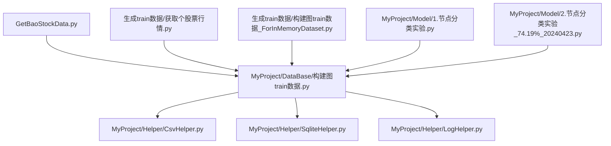
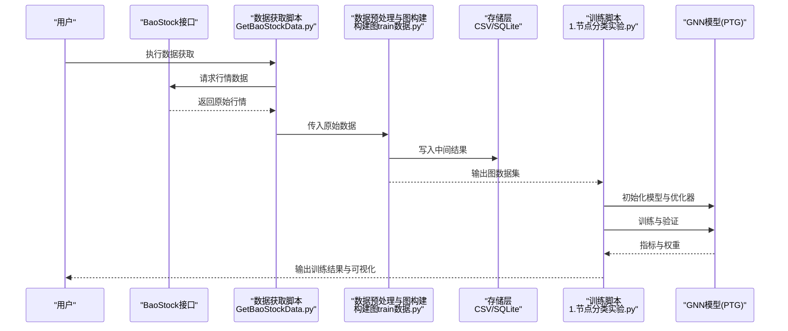
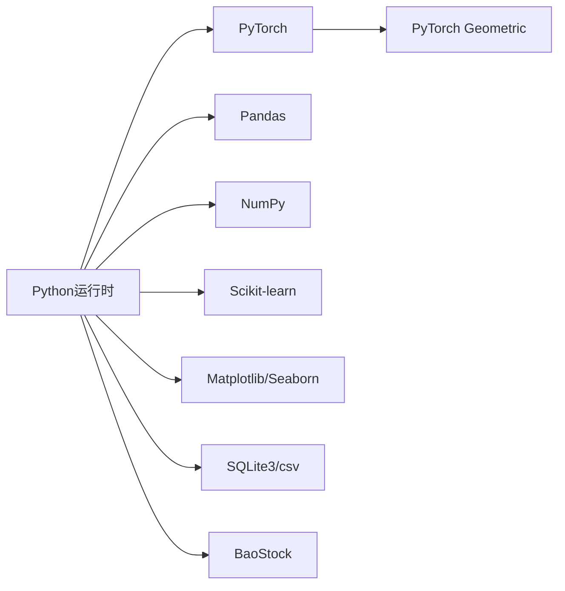

# 快速开始

<cite>
**本文引用的文件**   
- [GetBaoStockData.py](file://GetBaoStockData.py)
- [构建图train数据.py](file://MyProject/DataBase/构建图train数据.py)
- [1.节点分类实验.py](file://MyProject/Model/1.节点分类实验.py)
- [2.节点分类实验_74.19%_20240423.py](file://MyProject/Model/2.节点分类实验_74.19%_20240423.py)
- [获取个股票行情.py](file://生成train数据/获取个股票行情.py)
- [构建图train数据_ForInMemoryDataset.py](file://生成train数据/构建图train数据_ForInMemoryDataset.py)
- [CsvHelper.py](file://MyProject/Helper/CsvHelper.py)
- [SqliteHelper.py](file://MyProject/Helper/SqliteHelper.py)
- [LogHelper.py](file://MyProject/Helper/LogHelper.py)
</cite>

## 目录
1. [简介](#简介)
2. [项目结构](#项目结构)
3. [核心组件](#核心组件)
4. [架构总览](#架构总览)
5. [详细组件分析](#详细组件分析)
6. [依赖关系分析](#依赖关系分析)
7. [性能注意事项](#性能注意事项)
8. [故障排除指南](#故障排除指南)
9. [结论](#结论)
10. [附录](#附录)

## 简介
本指南面向首次接触GNN股票预测系统的用户，目标是在30分钟内完成环境搭建、数据准备与模型训练，并成功运行第一个预测实验。系统基于PyTorch Geometric进行图神经网络建模，使用BaoStock拉取A股行情数据，Pandas进行数据处理，SQLite/CSV作为数据存储介质。你将按步骤完成：
- 安装Python与依赖包（含GPU可选）
- 配置BaoStock与本地路径
- 拉取并预处理数据，构建图训练样本
- 运行节点分类实验，得到初步预测结果

## 项目结构
仓库采用“功能模块+示例脚本”的组织方式：
- MyProject/DataBase：数据获取、清洗与图训练数据构建
- MyProject/Model：节点分类实验脚本与策略实现
- MyProject/Helper：通用工具（CSV/SQLite/日志等）
- 生成train数据：数据获取与图构建的独立脚本集合
- GetBaoStockData.py：统一的BaoStock数据获取入口

图表来源
- [GetBaoStockData.py](file://GetBaoStockData.py)
- [构建图train数据.py](file://MyProject/DataBase/构建图train数据.py)
- [CsvHelper.py](file://MyProject/Helper/CsvHelper.py)
- [SqliteHelper.py](file://MyProject/Helper/SqliteHelper.py)
- [LogHelper.py](file://MyProject/Helper/LogHelper.py)
- [获取个股票行情.py](file://生成train数据/获取个股票行情.py)
- [构建图train数据_ForInMemoryDataset.py](file://生成train数据/构建图train数据_ForInMemoryDataset.py)
- [1.节点分类实验.py](file://MyProject/Model/1.节点分类实验.py)
- [2.节点分类实验_74.19%_20240423.py](file://MyProject/Model/2.节点分类实验_74.19%_20240423.py)

章节来源
- [GetBaoStockData.py](file://GetBaoStockData.py)
- [构建图train数据.py](file://MyProject/DataBase/构建图train数据.py)
- [1.节点分类实验.py](file://MyProject/Model/1.节点分类实验.py)
- [2.节点分类实验_74.19%_20240423.py](file://MyProject/Model/2.节点分类实验_74.19%_20240423.py)
- [获取个股票行情.py](file://生成train数据/获取个股票行情.py)
- [构建图train数据_ForInMemoryDataset.py](file://生成train数据/构建图train数据_ForInMemoryDataset.py)
- [CsvHelper.py](file://MyProject/Helper/CsvHelper.py)
- [SqliteHelper.py](file://MyProject/Helper/SqliteHelper.py)
- [LogHelper.py](file://MyProject/Helper/LogHelper.py)

## 核心组件
- 数据获取层：通过BaoStock接口拉取个股历史行情，统一由GetBaoStockData.py管理；也可使用“生成train数据/获取个股票行情.py”直接获取单只股票数据。
- 数据预处理与图构建：将时序行情转换为图结构（节点=时间步或股票，边=时序关联或相关性），输出供GNN训练的Graph对象与标签。
- 模型训练层：节点分类实验脚本（如1.节点分类实验.py、2.节点分类实验_74.19%_20240423.py）加载图数据，定义GNN模型并进行训练与评估。
- 存储与工具：CSV/SQLite用于持久化中间结果，日志记录训练过程与错误信息。

章节来源
- [GetBaoStockData.py](file://GetBaoStockData.py)
- [构建图train数据.py](file://MyProject/DataBase/构建图train数据.py)
- [获取个股票行情.py](file://生成train数据/获取个股票行情.py)
- [构建图train数据_ForInMemoryDataset.py](file://生成train数据/构建图train数据_ForInMemoryDataset.py)
- [1.节点分类实验.py](file://MyProject/Model/1.节点分类实验.py)
- [2.节点分类实验_74.19%_20240423.py](file://MyProject/Model/2.节点分类实验_74.19%_20240423.py)
- [CsvHelper.py](file://MyProject/Helper/CsvHelper.py)
- [SqliteHelper.py](file://MyProject/Helper/SqliteHelper.py)
- [LogHelper.py](file://MyProject/Helper/LogHelper.py)

## 架构总览
下图展示了从数据获取到模型训练的端到端流程，以及各模块之间的调用关系。

图表来源
- [GetBaoStockData.py](file://GetBaoStockData.py)
- [构建图train数据.py](file://MyProject/DataBase/构建图train数据.py)
- [1.节点分类实验.py](file://MyProject/Model/1.节点分类实验.py)

## 详细组件分析

### 数据获取与预处理
- BaoStock接入：确保已正确安装并配置BaoStock，设置必要的API密钥或网络代理（如需）。
- 数据格式：标准OHLCV字段（开盘、最高、最低、收盘、成交量等），后续用于特征工程与标签构造。
- 图构建思路：将时间窗口内的价格序列转化为节点特征，边可由滑动窗口邻接或相关性阈值构建；标签通常基于未来收益方向（上涨/下跌）。

章节来源
- [GetBaoStockData.py](file://GetBaoStockData.py)
- [构建图train数据.py](file://MyProject/DataBase/构建图train数据.py)
- [获取个股票行情.py](file://生成train数据/获取个股票行情.py)

### 图训练数据构建
- 输入：标准化后的行情序列与标签
- 处理：特征缩放、缺失值填充、窗口切分、邻接矩阵/边列表生成
- 输出：PyTorch Geometric的Data/InMemoryDataset对象，便于Dataloader批量读取

章节来源
- [构建图train数据.py](file://MyProject/DataBase/构建图train数据.py)
- [构建图train数据_ForInMemoryDataset.py](file://生成train数据/构建图train数据_ForInMemoryDataset.py)

### 节点分类实验（训练与评估）
- 数据加载：从构建好的图数据集中读取节点特征、边索引与标签
- 模型：基于GCN/GAT等图卷积层的分类头
- 训练：划分训练/验证集，使用交叉熵损失与Adam优化器
- 评估：准确率、混淆矩阵、学习曲线与预测可视化

章节来源
- [1.节点分类实验.py](file://MyProject/Model/1.节点分类实验.py)
- [2.节点分类实验_74.19%_20240423.py](file://MyProject/Model/2.节点分类实验_74.19%_20240423.py)

### 存储与工具
- CSV/SQLite：保存中间特征、图结构与训练日志
- 日志：记录关键步骤、异常堆栈与性能指标

章节来源
- [CsvHelper.py](file://MyProject/Helper/CsvHelper.py)
- [SqliteHelper.py](file://MyProject/Helper/SqliteHelper.py)
- [LogHelper.py](file://MyProject/Helper/LogHelper.py)

## 依赖关系分析
- Python版本：建议使用Python 3.8–3.10（兼容多数深度学习库）
- 核心依赖：
  - PyTorch与PyTorch Geometric（需匹配CUDA版本，若使用GPU）
  - BaoStock（行情数据源）
  - Pandas（数据处理）
  - NumPy、Scikit-learn（数值计算与评估）
  - Matplotlib/Seaborn（可视化）
  - SQLite3（内置）、csv（内置）
- 可选依赖：TensorBoard（训练监控）、joblib（缓存）

图表来源
- [GetBaoStockData.py](file://GetBaoStockData.py)
- [构建图train数据.py](file://MyProject/DataBase/构建图train数据.py)
- [1.节点分类实验.py](file://MyProject/Model/1.节点分类实验.py)

## 性能注意事项
- 数据规模：减少不必要的列与时间窗口长度，避免内存溢出
- GPU加速：确保CUDA驱动与PyTorch/PTG版本一致，启用混合精度训练（如适用）
- I/O优化：优先使用SQLite或Parquet存储大规模中间结果，减少重复计算
- 批处理：合理设置batch size与num_workers，平衡吞吐与延迟

## 故障排除指南
- 无法连接BaoStock
  - 检查网络与代理设置，确认API密钥有效
  - 尝试更换镜像或切换网络环境
- 依赖冲突或导入失败
  - 使用虚拟环境隔离依赖
  - 按顺序安装PyTorch（指定CUDA版本）→ PyTorch Geometric → 其他库
- 内存不足
  - 减小时间窗口或股票数量
  - 使用InMemoryDataset分批加载
- 训练不收敛或准确率过低
  - 检查标签构造逻辑（未来信息泄露）
  - 调整学习率、正则化与网络深度
- 可视化无输出
  - 确认后端可用（如Jupyter中需显示matplotlib）
  - 检查输出路径权限

## 结论
通过本指南，你应能在30分钟内完成环境搭建、数据准备与第一次GNN节点分类实验。建议后续扩展：
- 引入更多技术指标（MACD、RSI等）增强节点特征
- 尝试不同图构建策略（动态邻接、行业关联图）
- 增加模型复杂度与超参搜索，提升泛化能力

## 附录

### 环境搭建步骤（建议在虚拟环境中执行）
- 创建并激活虚拟环境
- 安装PyTorch（CPU或GPU版本，注意CUDA匹配）
- 安装PyTorch Geometric（与PyTorch版本对应）
- 安装BaoStock、Pandas、NumPy、Scikit-learn、Matplotlib等
- 验证安装：在Python中import上述库无报错

### 最小可运行示例（端到端）
- 步骤一：获取数据
  - 执行数据获取脚本，拉取若干只股票的近期行情
- 步骤二：构建图训练数据
  - 运行图构建脚本，生成可供GNN使用的图数据集
- 步骤三：运行节点分类实验
  - 执行训练脚本，观察训练日志与评估指标
- 步骤四：查看结果
  - 检查输出的图表与指标文件，确认流程无误

章节来源
- [GetBaoStockData.py](file://GetBaoStockData.py)
- [构建图train数据.py](file://MyProject/DataBase/构建图train数据.py)
- [1.节点分类实验.py](file://MyProject/Model/1.节点分类实验.py)
- [2.节点分类实验_74.19%_20240423.py](file://MyProject/Model/2.节点分类实验_74.19%_20240423.py)
- [获取个股票行情.py](file://生成train数据/获取个股票行情.py)
- [构建图train数据_ForInMemoryDataset.py](file://生成train数据/构建图train数据_ForInMemoryDataset.py)
- [CsvHelper.py](file://MyProject/Helper/CsvHelper.py)
- [SqliteHelper.py](file://MyProject/Helper/SqliteHelper.py)
- [LogHelper.py](file://MyProject/Helper/LogHelper.py)