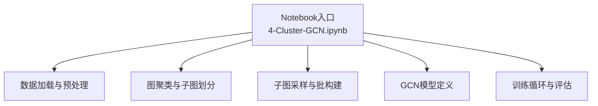
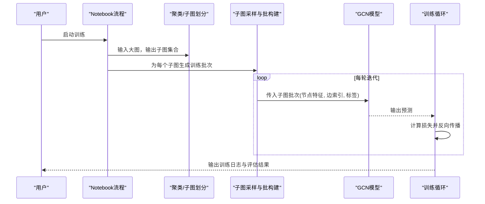
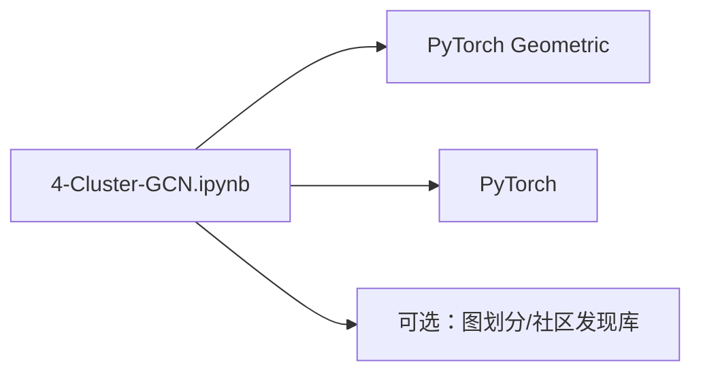

# Cluster-GCN算法详解

<cite>
**本文引用的文件**   
- [4-Cluster-GCN.ipynb](file://网络资料/3-图模型必备神器PyTorch Geometric安装与使用/工具包使用/4-Cluster-GCN.ipynb)
</cite>

## 目录
1. [引言](#引言)
2. [项目结构](#项目结构)
3. [核心组件](#核心组件)
4. [架构总览](#架构总览)
5. [详细组件分析](#详细组件分析)
6. [依赖关系分析](#依赖关系分析)
7. [性能考量](#性能考量)
8. [故障排查指南](#故障排查指南)
9. [结论](#结论)
10. [附录](#附录)

## 引言
本文件面向希望在实际项目中落地Cluster-GCN的开发者，系统阐述其理论基础、实现要点与工程实践。Cluster-GCN通过“先聚类、再采样子图”的方式，将大规模图的训练转化为多个独立子图上的mini-batch训练，从而显著降低内存占用并提升可扩展性。相比传统全图GCN，Cluster-GCN在超大规模图上具备更好的内存效率与并行化潜力；同时，由于邻居聚合范围被限制在子图内，其对长程依赖的建模能力有所取舍，适合对局部结构敏感的任务场景。

## 项目结构
仓库中包含一个与Cluster-GCN直接相关的Jupyter Notebook示例，位于“网络资料/3-图模型必备神器PyTorch Geometric安装与使用/工具包使用/4-Cluster-GCN.ipynb”。该示例展示了基于PyTorch Geometric（PyG）的Cluster-GCN典型流程：数据准备、聚类划分、子图构建、模型定义与训练循环等。

图表来源
- [4-Cluster-GCN.ipynb](file://网络资料/3-图模型必备神器PyTorch Geometric安装与使用/工具包使用/4-Cluster-GCN.ipynb)

章节来源
- [4-Cluster-GCN.ipynb](file://网络资料/3-图模型必备神器PyTorch Geometric安装与使用/工具包使用/4-Cluster-GCN.ipynb)

## 核心组件
围绕Cluster-GCN的关键模块包括：
- 图聚类与子图划分：将大图划分为若干连通或近似连通的子图，保证每个子图内部信息流相对完整。
- 子图采样与批构建：从各子图中按批次抽取节点及其邻域，形成可放入GPU的小规模子图。
- GCN模型：在子图上执行多层图卷积，进行特征传播与分类/回归。
- 训练循环：对子图批次进行前向、损失计算、反向传播与参数更新，并进行验证/测试评估。

章节来源
- [4-Cluster-GCN.ipynb](file://网络资料/3-图模型必备神器PyTorch Geometric安装与使用/工具包使用/4-Cluster-GCN.ipynb)

## 架构总览
下图展示Cluster-GCN端到端的数据与计算流：原始大图经聚类得到子图集合，随后在每个子图上以mini-batch方式训练GCN，最终汇总指标完成评估。

图表来源
- [4-Cluster-GCN.ipynb](file://网络资料/3-图模型必备神器PyTorch Geometric安装与使用/工具包使用/4-Cluster-GCN.ipynb)

## 详细组件分析

### 图聚类与子图划分
- 目标：将大图切分为若干子图，使子图内部连接密度较高、跨子图连接较少，从而减少边界效应与信息泄露。
- 常用策略：谱聚类、贪心划分、基于度/密度的启发式方法；在PyG生态中常借助社区发现或图划分库。
- 关键参数：子图数量、子图大小上限、平衡约束（尽量均衡子图规模）、保留跨边比例阈值等。
- 复杂度与权衡：聚类阶段通常具有较高时间复杂度，但能换来训练阶段的显著内存与吞吐收益。

章节来源
- [4-Cluster-GCN.ipynb](file://网络资料/3-图模型必备神器PyTorch Geometric安装与使用/工具包使用/4-Cluster-GCN.ipynb)

### 子图采样与批构建
- 目标：在子图范围内按批次抽取节点及其k-hop邻域，构造可训练的Data对象。
- 关键点：
  - 控制每批节点数与最大层数，避免显存溢出。
  - 合理设置邻居采样策略（如固定k层或自适应采样），平衡感受野与开销。
  - 处理孤立节点与稀疏边，确保批次完整性。
- 数据结构：节点特征矩阵、边索引张量、标签向量、掩码等。

章节来源
- [4-Cluster-GCN.ipynb](file://网络资料/3-图模型必备神器PyTorch Geometric安装与使用/工具包使用/4-Cluster-GCN.ipynb)

### GCN模型定义
- 结构：多层图卷积+非线性激活+可选Dropout/归一化，末端接分类头。
- 设计要点：
  - 层数与隐藏维度需结合子图规模与任务难度调优。
  - 正则化（Dropout/L2）有助于缓解过拟合。
  - 若存在类别不平衡，可在损失函数中引入权重或采用Focal Loss等变体。
- 输入输出：子图批次作为输入，输出节点级预测概率或嵌入向量。

章节来源
- [4-Cluster-GCN.ipynb](file://网络资料/3-图模型必备神器PyTorch Geometric安装与使用/工具包使用/4-Cluster-GCN.ipynb)

### 训练循环与评估
- 流程：遍历子图批次→前向传播→计算损失→反向传播→优化器更新→记录指标。
- 评估：在验证集上统计准确率/F1等指标，必要时保存最佳模型。
- 分布式扩展：可将不同子图分配到多进程或多设备并行训练，注意同步策略与负载均衡。

章节来源
- [4-Cluster-GCN.ipynb](file://网络资料/3-图模型必备神器PyTorch Geometric安装与使用/工具包使用/4-Cluster-GCN.ipynb)

### 与传统GCN的对比与适用场景
- 优势
  - 内存友好：子图训练避免全图邻域聚合带来的指数级增长。
  - 可扩展性强：天然支持并行与分片，易于扩展到更大图。
  - 训练稳定：小批量子图更易收敛，便于正则化与早停。
- 局限
  - 长程依赖受限：子图边界可能切断长距离信息传播路径。
  - 聚类质量影响大：不当划分可能导致性能下降。
- 适用场景
  - 超大规模节点分类/半监督学习。
  - 资源受限环境下的图学习。
  - 需要高吞吐与低延迟的训练部署。

[本节为概念性内容，不直接分析具体文件]

## 依赖关系分析
- 外部依赖
  - PyTorch：深度学习框架基础。
  - PyTorch Geometric（PyG）：图神经网络算子与数据集/工具链。
  - 可选：图划分/社区发现库（用于聚类）。
- 内部依赖
  - Notebook流程串联数据、聚类、采样、模型与训练，形成清晰流水线。

图表来源
- [4-Cluster-GCN.ipynb](file://网络资料/3-图模型必备神器PyTorch Geometric安装与使用/工具包使用/4-Cluster-GCN.ipynb)

章节来源
- [4-Cluster-GCN.ipynb](file://网络资料/3-图模型必备神器PyTorch Geometric安装与使用/工具包使用/4-Cluster-GCN.ipynb)

## 性能考量
- 内存管理
  - 控制子图大小与batch size，避免显存峰值过高。
  - 使用梯度累积在单卡上模拟更大batch。
- 计算效率
  - 预计算子图邻接结构，减少重复构建开销。
  - 利用PyG内置的高效稀疏算子与CUDA加速。
- 并行与I/O
  - 多进程并行处理不同子图批次。
  - 数据持久化与缓存，减少磁盘IO瓶颈。
- 超参调优
  - 子图数量/大小、GCN层数与隐藏维、学习率与权重衰减、Dropout比率等。

[本节提供通用指导，不直接分析具体文件]

## 故障排查指南
- 显存不足
  - 现象：OOM错误。
  - 排查：减小子图规模或batch size；检查是否意外复制了大图副本；确认未在全图级别进行不必要的操作。
- 训练不收敛
  - 现象：loss震荡或停滞。
  - 排查：调整学习率与优化器；增加正则化；检查标签分布与损失函数选择。
- 性能退化
  - 现象：验证集指标低于预期。
  - 排查：检查聚类质量（子图内连通性）；增大子图或增加GCN层数以扩大感受野；核对邻居采样深度。
- 数据问题
  - 现象：空批次或形状不一致。
  - 排查：校验节点/边索引一致性；过滤孤立点；确保批次内特征维度一致。

章节来源
- [4-Cluster-GCN.ipynb](file://网络资料/3-图模型必备神器PyTorch Geometric安装与使用/工具包使用/4-Cluster-GCN.ipynb)

## 结论
Cluster-GCN通过“聚类+子图采样”的设计，有效缓解了全图GCN在大规模图上的内存与计算瓶颈，具备良好的可扩展性与工程落地价值。实际应用中，应重点关注聚类质量、子图规模与GCN深度的协同调优，并结合任务特性选择合适的正则化与损失函数。对于需要长程依赖的场景，可考虑在子图边界处引入桥接边或分层融合策略，以兼顾效率与表达力。

[本节为总结性内容，不直接分析具体文件]

## 附录
- 快速上手建议
  - 从小规模图开始，逐步放大子图规模与GCN深度。
  - 记录每次实验的超参与指标，建立可复现实验基线。
  - 在多机多卡环境下，优先保证子图负载均衡与通信开销最小化。
- 参考实现位置
  - Notebook示例：网络资料/3-图模型必备神器PyTorch Geometric安装与使用/工具包使用/4-Cluster-GCN.ipynb

[本节为补充说明，不直接分析具体文件]